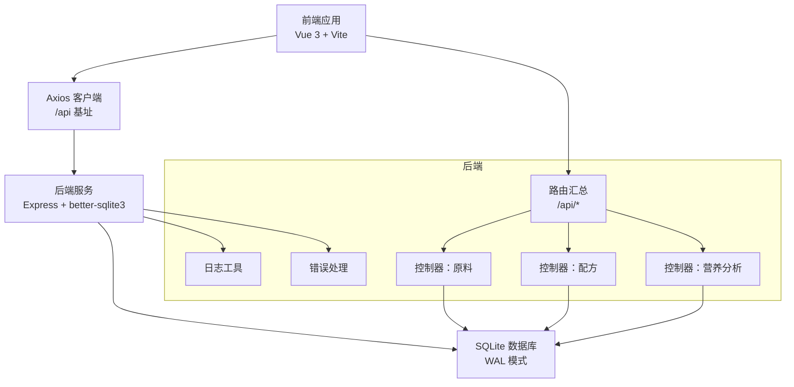
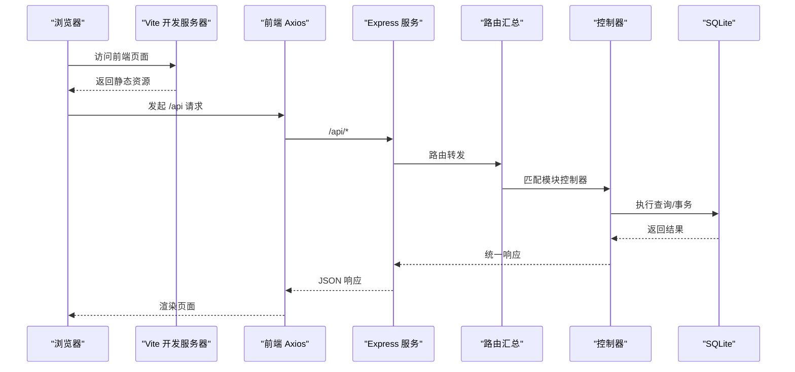
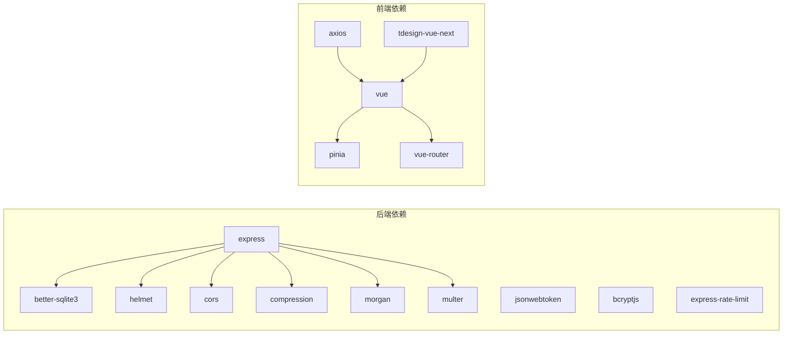

# 性能问题排查

<cite>
**本文引用的文件**   
- [backend/src/index.ts](file://backend/src/index.ts)
- [backend/src/config/database.ts](file://backend/src/config/database.ts)
- [backend/src/utils/logger.ts](file://backend/src/utils/logger.ts)
- [backend/src/middleware/errorHandler.ts](file://backend/src/middleware/errorHandler.ts)
- [backend/src/routers/index.ts](file://backend/src/routers/index.ts)
- [backend/src/controllers/materialController.ts](file://backend/src/controllers/materialController.ts)
- [backend/src/controllers/formulaController.ts](file://backend/src/controllers/formulaController.ts)
- [backend/src/controllers/nutritionController.ts](file://backend/src/controllers/nutritionController.ts)
- [backend/DATABASE_DOC.md](file://backend/DATABASE_DOC.md)
- [backend/package.json](file://backend/package.json)
- [frontend/vite.config.ts](file://frontend/vite.config.ts)
- [frontend/src/main.ts](file://frontend/src/main.ts)
- [frontend/src/api/http.ts](file://frontend/src/api/http.ts)
- [frontend/src/stores/material.ts](file://frontend/src/stores/material.ts)
</cite>

## 目录
1. [简介](#简介)
2. [项目结构](#项目结构)
3. [核心组件](#核心组件)
4. [架构总览](#架构总览)
5. [详细组件分析](#详细组件分析)
6. [依赖关系分析](#依赖关系分析)
7. [性能考量与优化建议](#性能考量与优化建议)
8. [故障排查指南](#故障排查指南)
9. [结论](#结论)
10. [附录](#附录)

## 简介
本文件面向 TingStudio 的性能问题排查与优化，聚焦以下场景：
- 后端 API 响应时间过长
- 数据库查询慢
- 前端页面加载缓慢
- 内存泄漏检测与定位
- 性能监控指标与分析工具使用
- 数据库索引与查询优化
- 前端资源优化
- 性能基准测试与回归检测策略

目标是帮助开发者快速定位瓶颈，并给出可操作的优化建议。

## 项目结构
TingStudio 采用前后端分离架构：
- 后端基于 Express + better-sqlite3，提供 REST API，路由集中于统一路由器，控制器按功能模块拆分。
- 前端基于 Vue 3 + Vite，通过 Axios 发起 API 请求，Pinia 管理状态，TDesign 提供 UI 组件。

图表来源
- [backend/src/index.ts:13-55](file://backend/src/index.ts#L13-L55)
- [backend/src/routers/index.ts:11-23](file://backend/src/routers/index.ts#L11-L23)
- [backend/src/config/database.ts:10-37](file://backend/src/config/database.ts#L10-L37)
- [frontend/vite.config.ts:12-22](file://frontend/vite.config.ts#L12-L22)
- [frontend/src/api/http.ts:6-10](file://frontend/src/api/http.ts#L6-L10)

章节来源
- [backend/src/index.ts:13-55](file://backend/src/index.ts#L13-L55)
- [backend/src/routers/index.ts:11-23](file://backend/src/routers/index.ts#L11-L23)
- [frontend/vite.config.ts:12-22](file://frontend/vite.config.ts#L12-L22)
- [frontend/src/api/http.ts:6-10](file://frontend/src/api/http.ts#L6-L10)

## 核心组件
- 后端入口与中间件：健康检查、CORS、压缩、日志、静态资源、全局错误处理。
- 数据库连接：SQLite（WAL 模式），外键约束开启；提供统一查询封装与事务支持。
- 路由与控制器：按模块划分，控制器内执行 SQL 查询与分页逻辑。
- 前端：Axios 统一请求与响应拦截，Pinia 状态管理，Vite 开发服务器代理后端。

章节来源
- [backend/src/index.ts:13-55](file://backend/src/index.ts#L13-L55)
- [backend/src/config/database.ts:10-37](file://backend/src/config/database.ts#L10-L37)
- [backend/src/middleware/errorHandler.ts:5-50](file://backend/src/middleware/errorHandler.ts#L5-L50)
- [backend/src/routers/index.ts:11-23](file://backend/src/routers/index.ts#L11-L23)
- [frontend/src/api/http.ts:6-10](file://frontend/src/api/http.ts#L6-L10)

## 架构总览
后端服务启动流程与请求处理链路如下：

图表来源
- [backend/src/index.ts:35-48](file://backend/src/index.ts#L35-L48)
- [backend/src/routers/index.ts:11-23](file://backend/src/routers/index.ts#L11-L23)
- [backend/src/controllers/materialController.ts:7-38](file://backend/src/controllers/materialController.ts#L7-L38)
- [backend/src/config/database.ts:44-55](file://backend/src/config/database.ts#L44-L55)
- [frontend/src/api/http.ts:6-10](file://frontend/src/api/http.ts#L6-L10)

## 详细组件分析

### 后端入口与中间件
- 启动阶段：连接数据库、注册全局中间件（安全、跨域、压缩、日志、静态资源）、挂载路由、健康检查、404、错误处理。
- 健康检查：轻量级探活接口，便于容器编排与负载均衡。
- 日志：统一格式化输出，开发环境可打印 debug 信息。

章节来源
- [backend/src/index.ts:13-55](file://backend/src/index.ts#L13-L55)
- [backend/src/utils/logger.ts:24-39](file://backend/src/utils/logger.ts#L24-L39)

### 数据库连接与查询封装
- 连接：确保数据目录存在，创建/打开数据库，启用 WAL 与外键约束。
- 查询：统一 query 封装，区分 SELECT 与 DML，返回行数组或运行结果；提供事务封装。
- 事务：简化多语句一致性写入。

章节来源
- [backend/src/config/database.ts:10-37](file://backend/src/config/database.ts#L10-L37)
- [backend/src/config/database.ts:44-61](file://backend/src/config/database.ts#L44-L61)

### 路由汇总
- 统一挂载各模块路由前缀，便于扩展与维护。

章节来源
- [backend/src/routers/index.ts:11-23](file://backend/src/routers/index.ts#L11-L23)

### 控制器：原料管理
- 列表查询：支持关键词模糊匹配、分页；先查列表再查总数，避免重复扫描。
- 关键路径：LIKE 模糊匹配可能触发全表扫描，需结合索引与分页策略。

章节来源
- [backend/src/controllers/materialController.ts:7-38](file://backend/src/controllers/materialController.ts#L7-L38)

### 控制器：配方管理
- 列表查询：根据用户角色决定可见范围；支持关键词与业务员过滤；分页查询。
- 批量版本查询：按配方 ID 列表批量取版本，减少 N+1 查询。
- 更新流程：变更材料时自动创建新版本并标记旧版本为非当前，涉及多条写入与 JSON 比较。

章节来源
- [backend/src/controllers/formulaController.ts:7-69](file://backend/src/controllers/formulaController.ts#L7-L69)
- [backend/src/controllers/formulaController.ts:133-218](file://backend/src/controllers/formulaController.ts#L133-L218)

### 控制器：营养分析
- 合规性检查：遍历营养字段，对比目标值与容差范围，生成检查结果与建议；最后持久化报告。
- 性能关注：字段循环与 JSON 解析开销，建议缓存标准档案与必要字段预计算。

章节来源
- [backend/src/controllers/nutritionController.ts:309-407](file://backend/src/controllers/nutritionController.ts#L309-L407)

### 前端：Axios 客户端与状态管理
- Axios：统一 baseURL、超时、请求头；请求拦截附加 Token；响应拦截统一错误提示与 401 登出。
- Pinia：状态集中管理，加载态控制，分页参数动态化。
- Vite：开发服务器代理 /api 到后端 3000 端口。

章节来源
- [frontend/src/api/http.ts:6-10](file://frontend/src/api/http.ts#L6-L10)
- [frontend/src/api/http.ts:21-43](file://frontend/src/api/http.ts#L21-L43)
- [frontend/src/stores/material.ts:16-37](file://frontend/src/stores/material.ts#L16-L37)
- [frontend/vite.config.ts:12-22](file://frontend/vite.config.ts#L12-L22)

## 依赖关系分析
后端依赖与版本信息（节选）：
- Express、better-sqlite3、helmet、cors、compression、morgan、multer、bcryptjs、jsonwebtoken、express-rate-limit
- 开发依赖：tsx、typescript、@types/* 等

前端依赖与版本信息（节选）：
- Vue 3、Pinia、tdesign-vue-next、axios、vue-router、sass、vite、vue-tsc 等

图表来源
- [backend/package.json:14-26](file://backend/package.json#L14-L26)
- [frontend/package.json:12-20](file://frontend/package.json#L12-L20)

章节来源
- [backend/package.json:14-26](file://backend/package.json#L14-L26)
- [frontend/package.json:12-20](file://frontend/package.json#L12-L20)

## 性能考量与优化建议

### 1. 数据库查询慢
- 现状与风险
  - LIKE 模糊查询可能触发全表扫描，影响原料与配方列表分页性能。
  - 配方版本批量查询通过 IN 子句实现，但未见显式索引覆盖复合条件。
  - 营养分析对 JSON 字段进行字段遍历与比较，存在循环与解析成本。
- 优化建议
  - 索引优化
    - 在原料表 name/code 上建立索引（已有索引定义，确认实际生效）。
    - 在配方表 name/salesman_id/created_by 上建立索引（已有索引定义）。
    - 在公式版本表 formula_id/version_number 建立复合索引（已有索引定义）。
    - 在导出任务表 formula_id/status、分享配置表 formula_id、营养汇总表 formula_id、营养分析报告表 formula_id 建立索引（已有索引定义）。
  - 查询优化
    - 使用参数化查询与 LIMIT/OFFSET 分页，避免一次性加载大量数据。
    - 对 JSON 字段的 LIKE 搜索尽量限定范围或改用规范化表结构。
    - 缓存热点数据（如营养标准档案）与常用统计结果。
  - WAL 与外键
    - WAL 模式提升并发读写，外键约束保证一致性，注意在大批量导入时临时禁用约束或使用事务包裹。
- 参考表结构与索引
  - [backend/DATABASE_DOC.md:61-63](file://backend/DATABASE_DOC.md#L61-L63)
  - [backend/DATABASE_DOC.md:86-89](file://backend/DATABASE_DOC.md#L86-L89)
  - [backend/DATABASE_DOC.md:144-147](file://backend/DATABASE_DOC.md#L144-L147)
  - [backend/DATABASE_DOC.md:190](file://backend/DATABASE_DOC.md#L190)
  - [backend/DATABASE_DOC.md:217-220](file://backend/DATABASE_DOC.md#L217-L220)
  - [backend/DATABASE_DOC.md:244](file://backend/DATABASE_DOC.md#L244)
  - [backend/DATABASE_DOC.md:269](file://backend/DATABASE_DOC.md#L269)
  - [backend/DATABASE_DOC.md:344](file://backend/DATABASE_DOC.md#L344)
  - [backend/DATABASE_DOC.md:389](file://backend/DATABASE_DOC.md#L389)

章节来源
- [backend/src/controllers/materialController.ts:18-32](file://backend/src/controllers/materialController.ts#L18-L32)
- [backend/src/controllers/formulaController.ts:44-63](file://backend/src/controllers/formulaController.ts#L44-L63)
- [backend/src/controllers/nutritionController.ts:309-407](file://backend/src/controllers/nutritionController.ts#L309-L407)
- [backend/DATABASE_DOC.md:61-63](file://backend/DATABASE_DOC.md#L61-L63)
- [backend/DATABASE_DOC.md:86-89](file://backend/DATABASE_DOC.md#L86-L89)
- [backend/DATABASE_DOC.md:144-147](file://backend/DATABASE_DOC.md#L144-L147)
- [backend/DATABASE_DOC.md:190](file://backend/DATABASE_DOC.md#L190)
- [backend/DATABASE_DOC.md:217-220](file://backend/DATABASE_DOC.md#L217-L220)
- [backend/DATABASE_DOC.md:244](file://backend/DATABASE_DOC.md#L244)
- [backend/DATABASE_DOC.md:269](file://backend/DATABASE_DOC.md#L269)
- [backend/DATABASE_DOC.md:344](file://backend/DATABASE_DOC.md#L344)
- [backend/DATABASE_DOC.md:389](file://backend/DATABASE_DOC.md#L389)

### 2. 前端页面加载缓慢
- 现状与风险
  - Vite 开发服务器代理 /api，生产构建需确保静态资源与 API 基址正确。
  - Axios 默认超时 15s，网络波动或后端慢查询会放大感知延迟。
  - Pinia 管理状态，加载态控制良好，但频繁请求与无缓存策略会增加等待。
- 优化建议
  - 资源优化
    - 生产构建启用压缩与 Tree-shaking，合理拆分路由组件与异步加载。
    - 图片与静态资源 CDN 化，减少首屏阻塞。
  - 请求优化
    - 合理设置超时与重试策略，对高频接口增加本地缓存。
    - 分页与搜索防抖，避免频繁请求。
  - 交互体验
    - 加载骨架屏与占位符，提升感知速度。
- 参考配置
  - [frontend/vite.config.ts:12-22](file://frontend/vite.config.ts#L12-L22)
  - [frontend/src/api/http.ts:6-10](file://frontend/src/api/http.ts#L6-L10)
  - [frontend/src/stores/material.ts:16-37](file://frontend/src/stores/material.ts#L16-L37)

章节来源
- [frontend/vite.config.ts:12-22](file://frontend/vite.config.ts#L12-L22)
- [frontend/src/api/http.ts:6-10](file://frontend/src/api/http.ts#L6-L10)
- [frontend/src/stores/material.ts:16-37](file://frontend/src/stores/material.ts#L16-L37)

### 3. API 响应时间过长
- 现象与定位
  - 控制器内存在多次数据库往返与 JSON 解析，建议合并查询与减少不必要的对象转换。
  - 营养分析流程涉及字段循环与 JSON 持久化，建议缓存与批处理。
- 优化建议
  - 减少 N+1 查询：批量获取版本与统计，避免逐条查询。
  - 事务与批处理：将多个写入放入事务，降低锁竞争与磁盘 IO。
  - 响应体精简：仅返回必要字段，避免大对象序列化。
- 参考实现
  - [backend/src/controllers/formulaController.ts:44-63](file://backend/src/controllers/formulaController.ts#L44-L63)
  - [backend/src/controllers/nutritionController.ts:309-407](file://backend/src/controllers/nutritionController.ts#L309-L407)

章节来源
- [backend/src/controllers/formulaController.ts:44-63](file://backend/src/controllers/formulaController.ts#L44-L63)
- [backend/src/controllers/nutritionController.ts:309-407](file://backend/src/controllers/nutritionController.ts#L309-L407)

### 4. 内存泄漏检测
- 建议手段
  - 后端：使用进程外分析工具（如 Node.js Profiler 或 heapdump）捕获堆快照，对比冷热态差异；关注定时器、事件监听器、闭包持有。
  - 前端：Chrome DevTools Memory 面板定期截图，观察对象增长曲线；排查未销毁的订阅、定时器、DOM 引用。
- 常见风险点
  - 控制器中未释放的大对象与循环引用。
  - 前端 Store 中未清理的缓存与未取消的请求。
- 参考入口与日志
  - [backend/src/utils/logger.ts:24-39](file://backend/src/utils/logger.ts#L24-L39)
  - [frontend/src/stores/material.ts:16-37](file://frontend/src/stores/material.ts#L16-L37)

章节来源
- [backend/src/utils/logger.ts:24-39](file://backend/src/utils/logger.ts#L24-L39)
- [frontend/src/stores/material.ts:16-37](file://frontend/src/stores/material.ts#L16-L37)

### 5. 性能监控指标与分析工具
- 指标建议
  - 后端：请求延迟（P50/P90/P99）、吞吐（RPS）、错误率、数据库查询耗时、连接数、内存占用。
  - 前端：首屏时间（FCP/LCP）、交互就绪（TTI）、路由切换时间、资源体积与请求数。
- 工具建议
  - 后端：Node.js Profiler、APM（如 New Relic/AppDynamics）、数据库 EXPLAIN/ANALYZE。
  - 前端：Lighthouse、WebPageTest、Chrome DevTools Performance/Memory。
- 参考入口与日志
  - [backend/src/index.ts:38-40](file://backend/src/index.ts#L38-L40)
  - [backend/src/utils/logger.ts:24-39](file://backend/src/utils/logger.ts#L24-L39)

章节来源
- [backend/src/index.ts:38-40](file://backend/src/index.ts#L38-L40)
- [backend/src/utils/logger.ts:24-39](file://backend/src/utils/logger.ts#L24-L39)

### 6. 性能基准测试与回归检测策略
- 基准测试
  - 后端：使用压测工具（如 k6/JMeter）模拟并发请求，覆盖核心接口（列表、详情、搜索、导出）。
  - 前端：Lighthouse 脚本化执行，记录关键指标（加载、交互、SEO、可访问性）。
- 回归检测
  - CI 集成：将基准测试与 Lighthouse 作为构建步骤，失败即阻断发布。
  - 告警阈值：设定 P95 延迟、错误率、资源体积阈值，异常自动通知。
- 参考实现
  - [backend/src/index.ts:38-40](file://backend/src/index.ts#L38-L40)
  - [frontend/src/api/http.ts:6-10](file://frontend/src/api/http.ts#L6-L10)

章节来源
- [backend/src/index.ts:38-40](file://backend/src/index.ts#L38-L40)
- [frontend/src/api/http.ts:6-10](file://frontend/src/api/http.ts#L6-L10)

## 故障排查指南

### 1. 后端启动与健康检查
- 现象：服务无法启动或健康检查失败。
- 排查步骤
  - 检查数据库连接路径与权限。
  - 查看日志输出，确认中间件加载顺序与端口占用。
  - 访问 /health 接口验证服务可用性。
- 参考实现
  - [backend/src/index.ts:13-55](file://backend/src/index.ts#L13-L55)
  - [backend/src/index.ts:38-40](file://backend/src/index.ts#L38-L40)

章节来源
- [backend/src/index.ts:13-55](file://backend/src/index.ts#L13-L55)
- [backend/src/index.ts:38-40](file://backend/src/index.ts#L38-L40)

### 2. 数据库连接与事务
- 现象：查询报错或事务回滚。
- 排查步骤
  - 确认 WAL 模式与外键约束已启用。
  - 检查事务包裹范围，避免长时间持锁。
  - 使用 EXPLAIN 查询计划，识别慢查询。
- 参考实现
  - [backend/src/config/database.ts:10-37](file://backend/src/config/database.ts#L10-L37)
  - [backend/src/config/database.ts:58-61](file://backend/src/config/database.ts#L58-L61)

章节来源
- [backend/src/config/database.ts:10-37](file://backend/src/config/database.ts#L10-L37)
- [backend/src/config/database.ts:58-61](file://backend/src/config/database.ts#L58-L61)

### 3. 控制器错误处理
- 现象：接口返回 4xx/5xx，前端弹窗提示。
- 排查步骤
  - 检查错误处理器对不同异常类型的映射（UNIQUE/FOREIGN KEY/JWT/文件大小）。
  - 开发环境查看详细错误信息，生产环境统一错误消息。
- 参考实现
  - [backend/src/middleware/errorHandler.ts:5-50](file://backend/src/middleware/errorHandler.ts#L5-L50)

章节来源
- [backend/src/middleware/errorHandler.ts:5-50](file://backend/src/middleware/errorHandler.ts#L5-L50)

### 4. 前端请求失败与 401 登出
- 现象：接口报错或自动跳转登录。
- 排查步骤
  - 检查本地 Token 是否存在与过期。
  - 确认 Axios 拦截器是否正确附加 Authorization。
  - 核对 Vite 代理配置与后端 /api 前缀。
- 参考实现
  - [frontend/src/api/http.ts:12-19](file://frontend/src/api/http.ts#L12-L19)
  - [frontend/src/api/http.ts:31-43](file://frontend/src/api/http.ts#L31-L43)
  - [frontend/vite.config.ts:15-21](file://frontend/vite.config.ts#L15-L21)

章节来源
- [frontend/src/api/http.ts:12-19](file://frontend/src/api/http.ts#L12-L19)
- [frontend/src/api/http.ts:31-43](file://frontend/src/api/http.ts#L31-L43)
- [frontend/vite.config.ts:15-21](file://frontend/vite.config.ts#L15-L21)

## 结论
- 通过 WAL 与外键约束保障数据一致性，配合索引与分页策略可显著改善查询性能。
- 控制器层面减少 N+1 查询、合并事务、缓存热点数据，可有效降低后端响应时间。
- 前端侧优化资源体积、请求策略与交互反馈，提升用户体验。
- 建立完善的监控与基准测试体系，持续跟踪性能指标，防止回归。

## 附录

### A. 数据库索引现状与建议
- 已定义索引
  - 原料表：name、code
  - 配方表：name、salesman_id、created_by
  - 配方版本表：formula_id、version_number（复合）
  - 导出模板表：type
  - 导出任务表：formula_id、status
  - API 数据接口表：endpoint
  - 分享配置表：formula_id
  - 营养汇总表：formula_id
  - 营养分析报告表：formula_id
- 建议补充
  - 在 LIKE 查询较多的列上评估全文检索或规范化字段。
  - 对热点查询（如按 created_by/状态/分类）考虑复合索引。

章节来源
- [backend/DATABASE_DOC.md:61-63](file://backend/DATABASE_DOC.md#L61-L63)
- [backend/DATABASE_DOC.md:86-89](file://backend/DATABASE_DOC.md#L86-L89)
- [backend/DATABASE_DOC.md:144-147](file://backend/DATABASE_DOC.md#L144-L147)
- [backend/DATABASE_DOC.md:190](file://backend/DATABASE_DOC.md#L190)
- [backend/DATABASE_DOC.md:217-220](file://backend/DATABASE_DOC.md#L217-L220)
- [backend/DATABASE_DOC.md:244](file://backend/DATABASE_DOC.md#L244)
- [backend/DATABASE_DOC.md:269](file://backend/DATABASE_DOC.md#L269)
- [backend/DATABASE_DOC.md:344](file://backend/DATABASE_DOC.md#L344)
- [backend/DATABASE_DOC.md:389](file://backend/DATABASE_DOC.md#L389)