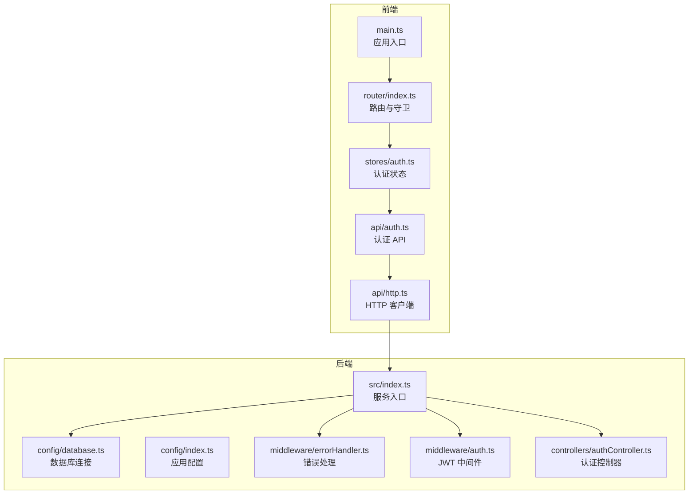
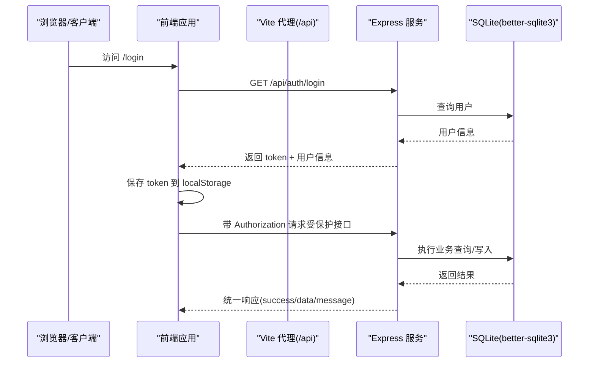
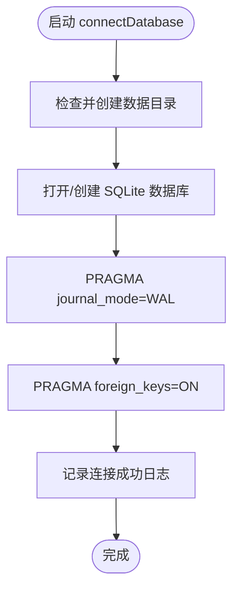
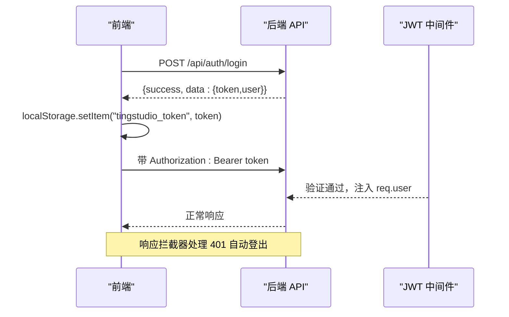
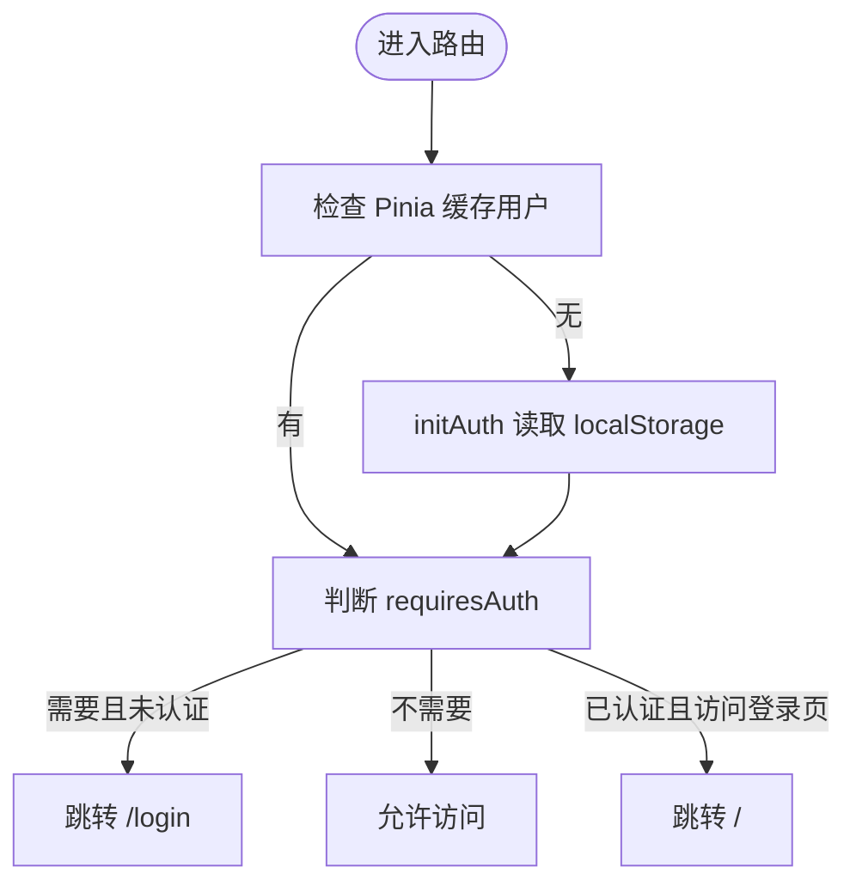
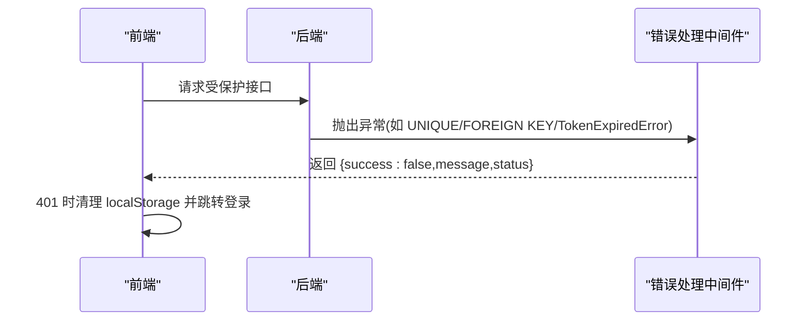
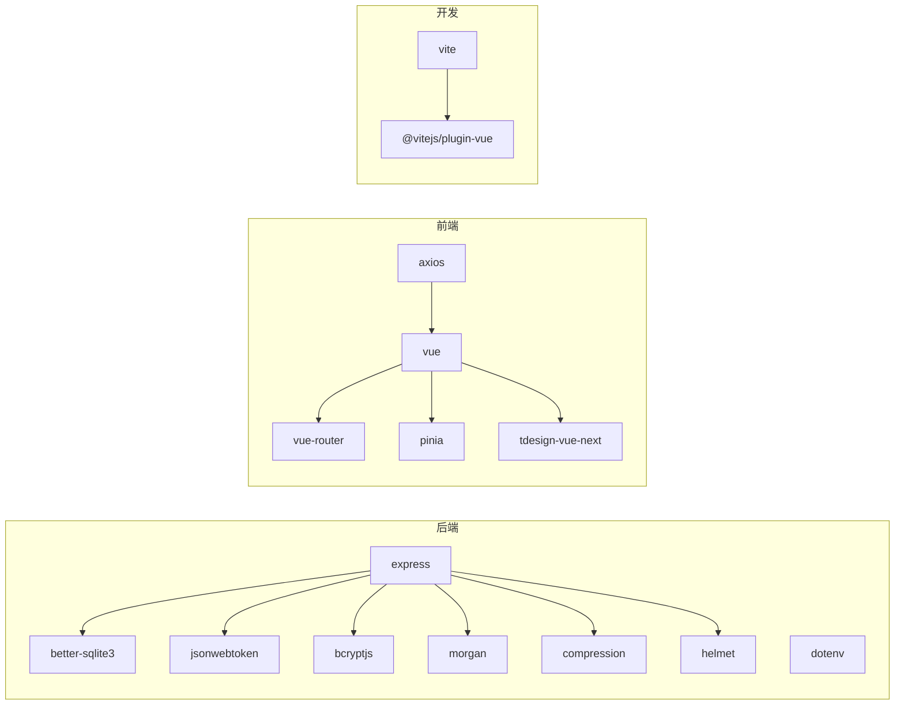

# 故障排除

<cite>
**本文引用的文件**
- [后端入口 index.ts](file://backend/src/index.ts)
- [数据库配置 database.ts](file://backend/src/config/database.ts)
- [JWT 认证中间件 auth.ts](file://backend/src/middleware/auth.ts)
- [认证控制器 authController.ts](file://backend/src/controllers/authController.ts)
- [全局错误处理 errorHandler.ts](file://backend/src/middleware/errorHandler.ts)
- [日志工具 logger.ts](file://backend/src/utils/logger.ts)
- [应用配置 config.ts](file://backend/src/config/index.ts)
- [前端入口 main.ts](file://frontend/src/main.ts)
- [前端路由 router/index.ts](file://frontend/src/router/index.ts)
- [HTTP 客户端 http.ts](file://frontend/src/api/http.ts)
- [认证 Store auth.ts](file://frontend/src/stores/auth.ts)
- [认证 API auth.ts](file://frontend/src/api/auth.ts)
- [Vite 开发服务器配置 vite.config.ts](file://frontend/vite.config.ts)
- [后端 API 文档 API_DOC.md](file://backend/API_DOC.md)
- [数据库设计文档 DATABASE_DOC.md](file://backend/DATABASE_DOC.md)
</cite>

## 目录
1. [简介](#简介)
2. [项目结构](#项目结构)
3. [核心组件](#核心组件)
4. [架构总览](#架构总览)
5. [详细组件分析](#详细组件分析)
6. [依赖关系分析](#依赖关系分析)
7. [性能考虑](#性能考虑)
8. [故障排除指南](#故障排除指南)
9. [结论](#结论)
10. [附录](#附录)

## 简介
本指南面向 TingStudio 开发者与运维人员，聚焦于开发与运行时常见问题的快速定位与解决。覆盖范围包括：
- 数据库连接与初始化问题
- JWT 认证失败与令牌生命周期
- API 请求错误与响应格式
- 前端路由守卫与鉴权流程
- 日志配置与错误追踪
- 性能诊断与优化建议
- 系统监控与告警配置思路

## 项目结构
TingStudio 采用前后端分离架构：
- 后端基于 Express + TypeScript，使用 better-sqlite3 作为数据库驱动，提供 RESTful API。
- 前端基于 Vue 3 + Pinia + Vue Router，通过 Axios 与后端交互，开发服务器通过 Vite 提供代理。

**图表来源**
- [后端入口 index.ts:1-61](file://backend/src/index.ts#L1-L61)
- [数据库配置 database.ts:1-70](file://backend/src/config/database.ts#L1-L70)
- [JWT 认证中间件 auth.ts:1-38](file://backend/src/middleware/auth.ts#L1-L38)
- [认证控制器 authController.ts:1-89](file://backend/src/controllers/authController.ts#L1-L89)
- [全局错误处理 errorHandler.ts:1-51](file://backend/src/middleware/errorHandler.ts#L1-L51)
- [前端入口 main.ts:1-17](file://frontend/src/main.ts#L1-L17)
- [前端路由 router/index.ts:1-165](file://frontend/src/router/index.ts#L1-L165)
- [HTTP 客户端 http.ts:1-58](file://frontend/src/api/http.ts#L1-L58)
- [认证 Store auth.ts:1-64](file://frontend/src/stores/auth.ts#L1-L64)
- [认证 API auth.ts:1-36](file://frontend/src/api/auth.ts#L1-L36)

**章节来源**
- [后端入口 index.ts:1-61](file://backend/src/index.ts#L1-L61)
- [前端入口 main.ts:1-17](file://frontend/src/main.ts#L1-L17)

## 核心组件
- 后端服务入口负责初始化数据库、中间件、静态资源、路由与错误处理，并提供健康检查端点。
- 数据库模块封装 SQLite 连接、WAL 模式与外键约束启用，提供统一查询与事务接口。
- JWT 中间件与认证控制器配合，实现登录、注册与当前用户信息获取。
- 前端路由守卫在进入受保护页面前检查认证状态；HTTP 客户端统一注入 Authorization 头并处理 401 自动登出。
- 日志工具支持 info/warn/error/debug 输出，开发环境默认开启 debug。

**章节来源**
- [后端入口 index.ts:13-55](file://backend/src/index.ts#L13-L55)
- [数据库配置 database.ts:10-70](file://backend/src/config/database.ts#L10-L70)
- [JWT 认证中间件 auth.ts:13-38](file://backend/src/middleware/auth.ts#L13-L38)
- [认证控制器 authController.ts:8-89](file://backend/src/controllers/authController.ts#L8-L89)
- [前端路由 router/index.ts:148-162](file://frontend/src/router/index.ts#L148-L162)
- [HTTP 客户端 http.ts:12-43](file://frontend/src/api/http.ts#L12-L43)
- [日志工具 logger.ts:24-40](file://backend/src/utils/logger.ts#L24-L40)

## 架构总览
后端服务启动流程与关键组件交互如下：

**图表来源**
- [后端入口 index.ts:34-48](file://backend/src/index.ts#L34-L48)
- [认证控制器 authController.ts:42-71](file://backend/src/controllers/authController.ts#L42-L71)
- [HTTP 客户端 http.ts:12-43](file://frontend/src/api/http.ts#L12-L43)
- [数据库配置 database.ts:44-55](file://backend/src/config/database.ts#L44-L55)

## 详细组件分析

### 数据库连接与初始化
- 初始化流程：确保数据目录存在 -> 打开/创建 SQLite 文件 -> 启用 WAL 模式与外键约束。
- 查询接口：区分 SELECT 与其他语句，返回兼容的 [rows] 模式或 RunResult。
- 事务封装：提供 transaction(fn) 简化多语句一致性。

**图表来源**
- [数据库配置 database.ts:10-30](file://backend/src/config/database.ts#L10-L30)

**章节来源**
- [数据库配置 database.ts:10-70](file://backend/src/config/database.ts#L10-L70)

### JWT 认证与令牌管理
- 中间件：校验 Authorization 头是否为 Bearer 令牌，解码后注入 req.user。
- 控制器：登录/注册成功后签发 JWT，设置过期时间。
- 前端：localStorage 存储 token，Axios 请求拦截器自动附加 Authorization；响应拦截器处理 401 自动清空本地认证并跳转登录。

**图表来源**
- [JWT 认证中间件 auth.ts:13-31](file://backend/src/middleware/auth.ts#L13-L31)
- [认证控制器 authController.ts:42-71](file://backend/src/controllers/authController.ts#L42-L71)
- [HTTP 客户端 http.ts:12-43](file://frontend/src/api/http.ts#L12-L43)

**章节来源**
- [JWT 认证中间件 auth.ts:13-38](file://backend/src/middleware/auth.ts#L13-L38)
- [认证控制器 authController.ts:8-89](file://backend/src/controllers/authController.ts#L8-L89)
- [HTTP 客户端 http.ts:12-43](file://frontend/src/api/http.ts#L12-L43)

### 前端路由守卫与鉴权
- 路由守卫：进入受保护页面前检查 Pinia 认证状态；若未认证则跳转登录；已登录访问登录/注册页则重定向首页。
- 认证 Store：提供 login/register/logout，保存用户信息到 localStorage 并同步 Pinia 状态。

**图表来源**
- [前端路由 router/index.ts:148-162](file://frontend/src/router/index.ts#L148-L162)
- [认证 Store auth.ts:12-17](file://frontend/src/stores/auth.ts#L12-L17)

**章节来源**
- [前端路由 router/index.ts:148-162](file://frontend/src/router/index.ts#L148-L162)
- [认证 Store auth.ts:12-32](file://frontend/src/stores/auth.ts#L12-L32)

### API 请求与统一错误处理
- 响应格式：统一 success/data/message；分页列表包含 pagination。
- 错误处理：后端根据错误类型返回 401/409/400/413 等状态码；前端拦截器对 401 清理本地认证并提示。
- 健康检查：/health 返回服务状态。

**图表来源**
- [全局错误处理 errorHandler.ts:5-50](file://backend/src/middleware/errorHandler.ts#L5-L50)
- [HTTP 客户端 http.ts:31-43](file://frontend/src/api/http.ts#L31-L43)
- [后端 API 文档 API_DOC.md:18-71](file://backend/API_DOC.md#L18-L71)

**章节来源**
- [全局错误处理 errorHandler.ts:5-50](file://backend/src/middleware/errorHandler.ts#L5-L50)
- [HTTP 客户端 http.ts:21-43](file://frontend/src/api/http.ts#L21-L43)
- [后端 API 文档 API_DOC.md:18-71](file://backend/API_DOC.md#L18-L71)

## 依赖关系分析
- 后端依赖：dotenv、express、cors、helmet、compression、morgan、better-sqlite3、jsonwebtoken、bcryptjs。
- 前端依赖：vue、@vueuse/core、tdesign-vue-next、axios、pinia、vue-router。
- 开发依赖：vite、@vitejs/plugin-vue、typescript、sass 等。

**图表来源**
- [后端入口 index.ts:2-9](file://backend/src/index.ts#L2-L9)
- [前端入口 main.ts:1-7](file://frontend/src/main.ts#L1-L7)
- [Vite 开发服务器配置 vite.config.ts:1-23](file://frontend/vite.config.ts#L1-L23)

**章节来源**
- [后端入口 index.ts:2-9](file://backend/src/index.ts#L2-L9)
- [前端入口 main.ts:1-7](file://frontend/src/main.ts#L1-L7)
- [Vite 开发服务器配置 vite.config.ts:1-23](file://frontend/vite.config.ts#L1-L23)

## 性能考虑
- 数据库层面
  - WAL 模式提升并发读写性能，外键约束保障数据一致性。
  - 使用事务包裹批量写入，减少磁盘写入次数。
  - 为高频查询字段建立索引（如物料名称/编码、业务员状态等）。
- 后端层面
  - 启用压缩与安全中间件，避免不必要的日志输出。
  - 控制请求体大小与超时时间，防止资源滥用。
- 前端层面
  - 路由懒加载组件，减少首屏体积。
  - 合理使用 Pinia 状态缓存，避免重复请求。
  - 使用虚拟滚动与分页加载大数据集。

[本节为通用指导，不直接分析具体文件]

## 故障排除指南

### 一、数据库连接问题
- 症状
  - 启动时报错“数据库连接失败”或无法创建/打开数据库文件。
- 排查步骤
  - 检查数据库路径是否存在且可写（默认 ./data/tingstudio.db）。
  - 确认进程是否有文件系统权限。
  - 查看后端日志中的错误堆栈。
- 解决方案
  - 在启动前手动创建 data 目录或将 DB_PATH 指向可写路径。
  - 确保 WAL 与外键 PRAGMA 设置正确。
  - 如需迁移或修复，备份原数据库后重建。

**章节来源**
- [数据库配置 database.ts:10-30](file://backend/src/config/database.ts#L10-L30)
- [应用配置 config.ts:6-8](file://backend/src/config/index.ts#L6-L8)
- [日志工具 logger.ts:31-32](file://backend/src/utils/logger.ts#L31-L32)

### 二、JWT 认证失败
- 症状
  - 登录成功但后续接口返回 401 或“令牌无效/已过期”。
- 排查步骤
  - 检查前端是否正确保存 token 并在请求头附加 Authorization。
  - 核对后端 JWT 密钥与过期时间配置。
  - 查看后端错误处理器对 JsonWebTokenError/TokenExpiredError 的分支。
- 解决方案
  - 确保前端拦截器始终附加 Bearer token。
  - 调整 JWT_SECRET 与 JWT_EXPIRES_IN，保持前后端一致。
  - 前端 401 时自动清理本地认证并跳转登录。

**章节来源**
- [JWT 认证中间件 auth.ts:13-31](file://backend/src/middleware/auth.ts#L13-L31)
- [全局错误处理 errorHandler.ts:25-34](file://backend/src/middleware/errorHandler.ts#L25-L34)
- [HTTP 客户端 http.ts:12-43](file://frontend/src/api/http.ts#L12-L43)
- [应用配置 config.ts:10-13](file://backend/src/config/index.ts#L10-L13)

### 三、API 请求错误
- 症状
  - 统一返回 {success:false,message}，状态码 400/401/409/413/500。
- 排查步骤
  - 根据状态码对照 API 文档，确认请求参数、权限与资源状态。
  - 检查后端错误处理器对 UNIQUE/FOREIGN KEY/文件大小限制的分支。
  - 查看后端日志定位具体错误。
- 解决方案
  - 修正参数约束（长度、唯一性、外键存在性）。
  - 降低上传文件大小或调整 MAX_FILE_SIZE。
  - 修复业务逻辑后再试。

**章节来源**
- [全局错误处理 errorHandler.ts:13-40](file://backend/src/middleware/errorHandler.ts#L13-L40)
- [后端 API 文档 API_DOC.md:58-71](file://backend/API_DOC.md#L58-L71)
- [日志工具 logger.ts:31-32](file://backend/src/utils/logger.ts#L31-L32)

### 四、前端路由问题
- 症状
  - 受保护页面无法访问或登录/注册页循环跳转。
- 排查步骤
  - 检查路由守卫逻辑与 meta.requiresAuth 标记。
  - 确认 Pinia 认证状态与 localStorage 缓存是否一致。
- 解决方案
  - 保证受保护路由设置 requiresAuth=true。
  - 登录成功后及时更新 Pinia 与 localStorage。
  - 避免手动篡改认证缓存导致状态不一致。

**章节来源**
- [前端路由 router/index.ts:148-162](file://frontend/src/router/index.ts#L148-L162)
- [认证 Store auth.ts:12-17](file://frontend/src/stores/auth.ts#L12-L17)

### 五、调试技巧与日志分析
- 后端
  - 使用 logger.info/warn/error/debug 输出关键路径与上下文。
  - 开发环境查看 Morgan 访问日志与自定义日志。
  - 健康检查 /health 用于快速确认服务可用性。
- 前端
  - 打开浏览器开发者工具 Network 面板，观察请求/响应与状态码。
  - 在 Console 查看错误堆栈与日志。
  - 使用 Vue DevTools 检查 Pinia 状态变化。

**章节来源**
- [日志工具 logger.ts:24-40](file://backend/src/utils/logger.ts#L24-L40)
- [后端入口 index.ts:38-40](file://backend/src/index.ts#L38-L40)
- [HTTP 客户端 http.ts:31-43](file://frontend/src/api/http.ts#L31-L43)

### 六、性能问题诊断与优化
- 数据库查询
  - 使用 EXPLAIN QUERY PLAN 分析慢查询（SQLite 支持）。
  - 为高频过滤/排序字段添加索引，避免全表扫描。
  - 将大事务拆分为小事务，减少锁竞争。
- 前端渲染
  - 使用虚拟列表/分页加载长列表。
  - 避免不必要的响应式数据深度与复杂对象。
  - 合理使用 keep-alive 缓存页面状态。

**章节来源**
- [数据库设计文档 DATABASE_DOC.md:59-62](file://backend/DATABASE_DOC.md#L59-L62)
- [数据库设计文档 DATABASE_DOC.md:115-118](file://backend/DATABASE_DOC.md#L115-L118)
- [数据库设计文档 DATABASE_DOC.md:139-144](file://backend/DATABASE_DOC.md#L139-L144)

### 七、系统监控与告警配置
- 建议指标
  - 服务可用性：/health 健康检查成功率。
  - 请求延迟与错误率：各端点 2xx/4xx/5xx 比例。
  - 数据库性能：慢查询数、连接数、WAL 写入频率。
- 告警规则
  - /health 连续失败超过阈值触发告警。
  - 401/403 鉴权失败率异常升高。
  - 5xx 错误率超过阈值或 P95 延迟超时。
- 工具建议
  - 使用 Prometheus + Grafana 监控后端日志与指标。
  - 使用 ELK/Fluentd 收集前端错误日志与网络异常。

[本节为通用指导，不直接分析具体文件]

## 结论
通过明确的组件职责划分与统一的错误/日志规范，TingStudio 能够在开发与生产环境中快速定位问题。建议团队在日常开发中：
- 严格遵循统一响应格式与错误处理分支。
- 在关键路径增加日志输出，便于回溯。
- 建立完善的监控与告警体系，将问题扼杀在摇篮中。

## 附录
- 常用端点
  - GET /health：健康检查
  - POST /api/auth/login：登录
  - POST /api/auth/register：注册
  - GET /api/auth/me：获取当前用户
- 常用环境变量
  - PORT、NODE_ENV、DB_PATH、JWT_SECRET、JWT_EXPIRES_IN、UPLOAD_DIR、MAX_FILE_SIZE、CORS_ORIGIN

**章节来源**
- [后端 API 文档 API_DOC.md:677-687](file://backend/API_DOC.md#L677-L687)
- [后端 API 文档 API_DOC.md:82-159](file://backend/API_DOC.md#L82-L159)
- [应用配置 config.ts:2-23](file://backend/src/config/index.ts#L2-L23)