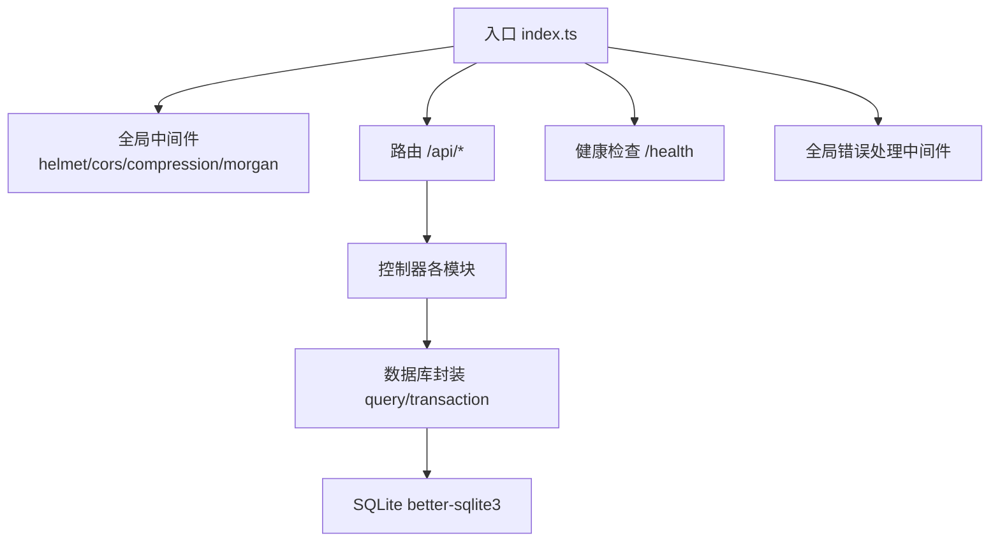
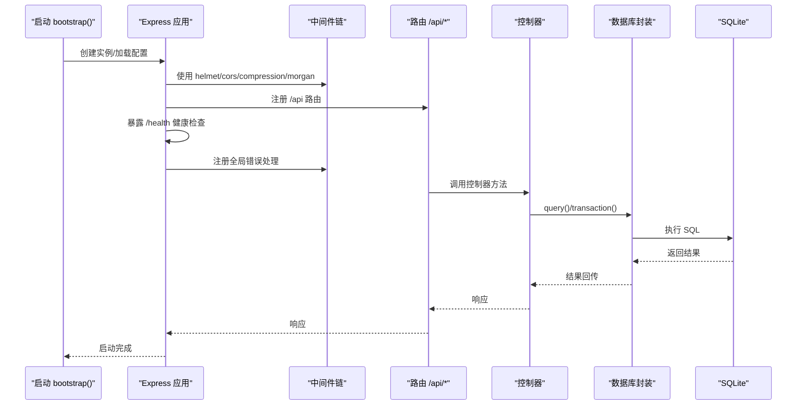
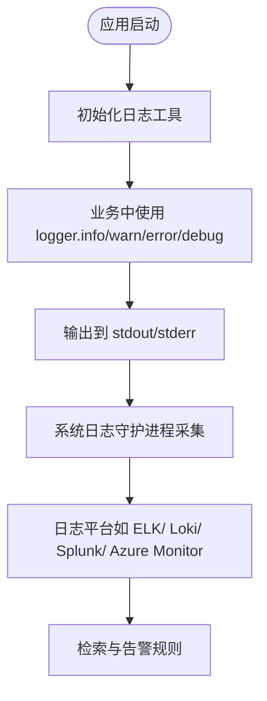
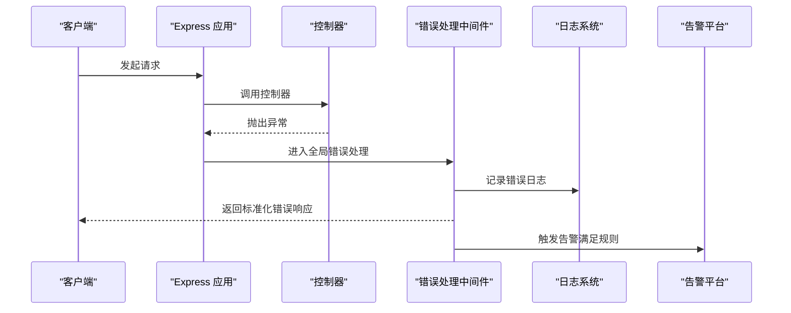
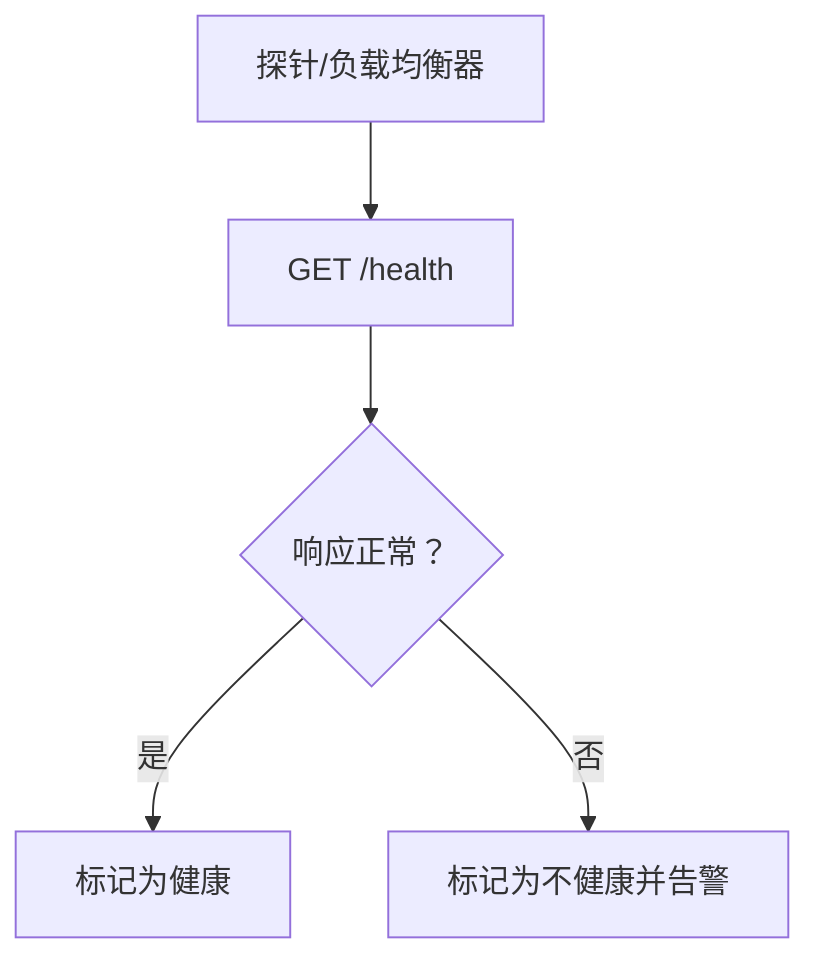
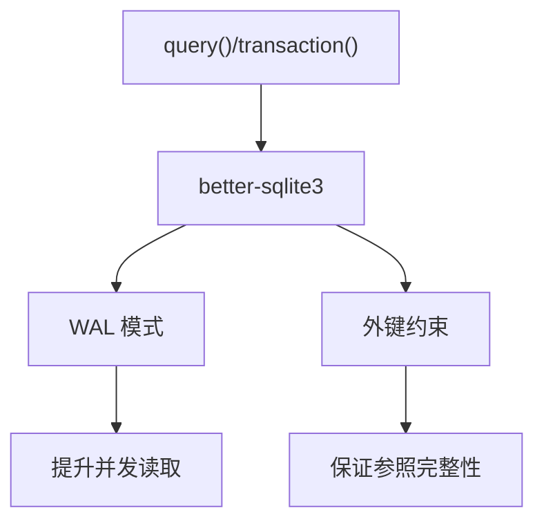
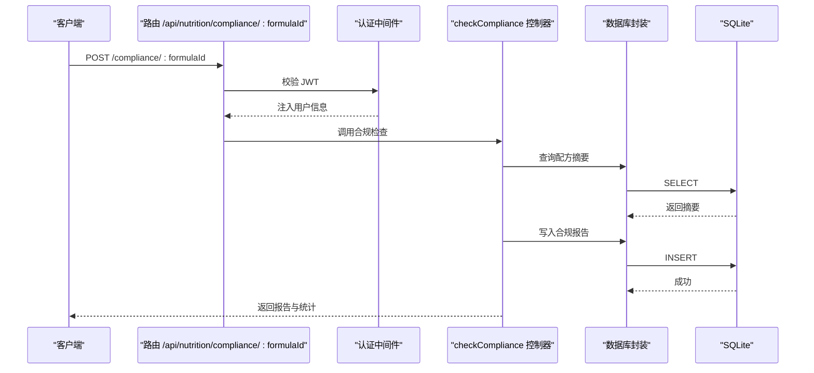
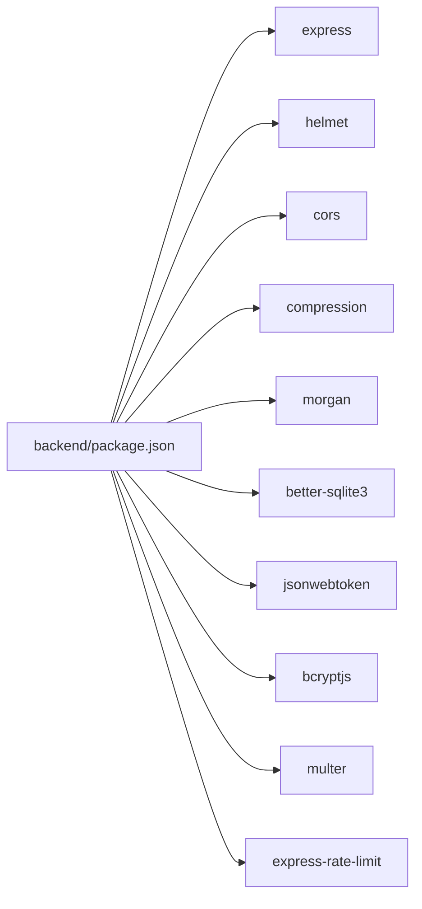

# 监控与告警

<cite>
**本文引用的文件**
- [backend/src/utils/logger.ts](file://backend/src/utils/logger.ts)
- [backend/src/middleware/errorHandler.ts](file://backend/src/middleware/errorHandler.ts)
- [backend/src/index.ts](file://backend/src/index.ts)
- [backend/src/config/index.ts](file://backend/src/config/index.ts)
- [backend/src/config/database.ts](file://backend/src/config/database.ts)
- [backend/src/middleware/auth.ts](file://backend/src/middleware/auth.ts)
- [backend/src/middleware/validate.ts](file://backend/src/middleware/validate.ts)
- [backend/src/controllers/nutritionController.ts](file://backend/src/controllers/nutritionController.ts)
- [backend/src/routes/nutrition.ts](file://backend/src/routes/nutrition.ts)
- [backend/package.json](file://backend/package.json)
- [backend/src/scripts/init.sql](file://backend/src/scripts/init.sql)
- [README.md](file://README.md)
</cite>

## 目录
1. [引言](#引言)
2. [项目结构](#项目结构)
3. [核心组件](#核心组件)
4. [架构总览](#架构总览)
5. [详细组件分析](#详细组件分析)
6. [依赖关系分析](#依赖关系分析)
7. [性能考量](#性能考量)
8. [故障排查指南](#故障排查指南)
9. [结论](#结论)
10. [附录](#附录)

## 引言
本文件面向运维与开发团队，提供 TingStudio 的监控与告警配置指南。当前系统已具备基础的日志输出、统一错误处理、健康检查端点以及数据库连接管理能力。本文将基于现有代码实现，给出可落地的日志监控、错误监控、性能监控与告警配置建议，并提供告警规则与通知渠道的实践路径，帮助建立完善的运维监控体系。

## 项目结构
后端采用 Express + TypeScript 架构，核心模块包括：
- 入口与中间件：启动、CORS、压缩、日志、健康检查、全局错误处理
- 配置：数据库、JWT、上传、跨域等
- 数据库：SQLite 连接、事务、查询封装
- 控制器与路由：业务模块（认证、配方、导出、营养等）
- 工具：日志工具

图表来源
- [backend/src/index.ts:13-61](file://backend/src/index.ts#L13-L61)
- [backend/src/middleware/errorHandler.ts:1-51](file://backend/src/middleware/errorHandler.ts#L1-L51)
- [backend/src/config/database.ts:10-70](file://backend/src/config/database.ts#L10-L70)

章节来源
- [backend/src/index.ts:13-61](file://backend/src/index.ts#L13-L61)
- [backend/src/config/index.ts:1-24](file://backend/src/config/index.ts#L1-L24)
- [backend/src/config/database.ts:10-70](file://backend/src/config/database.ts#L10-L70)
- [backend/src/utils/logger.ts:1-40](file://backend/src/utils/logger.ts#L1-L40)
- [backend/src/middleware/errorHandler.ts:1-51](file://backend/src/middleware/errorHandler.ts#L1-L51)
- [README.md:11-29](file://README.md#L11-L29)

## 核心组件
- 日志工具：提供 info/warn/error/debug 四级日志，带时间戳与颜色输出；开发环境启用 debug。
- 全局错误处理：捕获未处理异常，针对 SQLite 约束、JWT、文件大小等场景进行分类响应。
- 健康检查：提供 /health 端点返回服务状态与时间戳。
- 数据库连接：自动创建数据目录、启用 WAL 与外键约束，提供查询与事务封装。
- 认证中间件：基于 JWT 的请求拦截与用户信息注入。
- 参数校验中间件：对请求体进行类型、长度、范围等规则校验。
- 营养分析控制器：包含合规性检查逻辑，涉及数据库写入与报告生成。

章节来源
- [backend/src/utils/logger.ts:24-39](file://backend/src/utils/logger.ts#L24-L39)
- [backend/src/middleware/errorHandler.ts:5-50](file://backend/src/middleware/errorHandler.ts#L5-L50)
- [backend/src/index.ts:37-40](file://backend/src/index.ts#L37-L40)
- [backend/src/config/database.ts:10-70](file://backend/src/config/database.ts#L10-L70)
- [backend/src/middleware/auth.ts:13-37](file://backend/src/middleware/auth.ts#L13-L37)
- [backend/src/middleware/validate.ts:16-67](file://backend/src/middleware/validate.ts#L16-L67)
- [backend/src/controllers/nutritionController.ts:291-407](file://backend/src/controllers/nutritionController.ts#L291-L407)

## 架构总览
下图展示了后端启动流程、中间件链路、错误处理与数据库交互的关键节点。

图表来源
- [backend/src/index.ts:13-61](file://backend/src/index.ts#L13-L61)
- [backend/src/config/database.ts:44-61](file://backend/src/config/database.ts#L44-L61)

章节来源
- [backend/src/index.ts:13-61](file://backend/src/index.ts#L13-L61)
- [backend/src/config/database.ts:44-61](file://backend/src/config/database.ts#L44-L61)

## 详细组件分析

### 日志监控与采集
- 当前实现：日志工具提供 info/warn/error/debug 输出，开发环境默认仅输出 debug。
- 建议采集：将 stdout/stderr 交由系统日志守护进程（如 systemd journald、Windows Event Log 或容器日志驱动）统一收集；结合 morgan 输出 HTTP 访问日志。
- 日志级别建议：
  - info：启动、连接数据库、定时任务触发
  - warn：参数校验失败、鉴权失败、外部依赖异常
  - error：未捕获异常、数据库连接失败、关键业务失败
  - debug：开发调试信息（生产环境谨慎开启）

图表来源
- [backend/src/utils/logger.ts:24-39](file://backend/src/utils/logger.ts#L24-L39)
- [backend/src/index.ts:27](file://backend/src/index.ts#L27)

章节来源
- [backend/src/utils/logger.ts:13-39](file://backend/src/utils/logger.ts#L13-L39)
- [backend/src/index.ts:27](file://backend/src/index.ts#L27)

### 错误监控与告警
- 当前实现：全局错误处理中间件对常见错误进行分类响应，并记录错误日志。
- 建议告警规则：
  - 5xx 错误率：连续 5 分钟内错误率超过阈值（例如 5%）
  - 数据库连接失败：出现特定错误日志（如“数据库连接失败”）
  - 认证失败：短时间内大量 401/403
  - 文件上传失败：413（文件过大）频繁出现
- 告警通道：邮件、IM（钉钉/飞书）、Webhook（接入监控面板）

图表来源
- [backend/src/middleware/errorHandler.ts:5-50](file://backend/src/middleware/errorHandler.ts#L5-L50)
- [backend/src/index.ts:48](file://backend/src/index.ts#L48)

章节来源
- [backend/src/middleware/errorHandler.ts:5-50](file://backend/src/middleware/errorHandler.ts#L5-L50)
- [backend/src/index.ts:48](file://backend/src/index.ts#L48)

### 性能监控与健康检查
- 健康检查：/health 返回服务可用性与时间戳，可用于探活与编排健康检查。
- 建议指标：
  - 响应时间分位（P50/P90/P95/P99）
  - 并发连接数、队列长度
  - 数据库慢查询计数
  - 内存与 CPU 使用率
- 建议采集方式：Prometheus + Node_exporter 或云厂商监控（如 Azure Monitor），结合 Grafana 建立仪表板。

图表来源
- [backend/src/index.ts:37-40](file://backend/src/index.ts#L37-L40)

章节来源
- [backend/src/index.ts:37-40](file://backend/src/index.ts#L37-L40)

### 数据库监控与备份策略
- 连接与事务：数据库封装提供 query/transaction，启用 WAL 与外键约束，提升并发与一致性。
- 建议监控：
  - 连接池使用率、超时次数
  - 事务提交/回滚频率
  - 表锁等待、慢查询
- 建议策略：定期备份 SQLite 文件，保留多个历史版本，结合校验和与归档存储。

图表来源
- [backend/src/config/database.ts:21-23](file://backend/src/config/database.ts#L21-L23)
- [backend/src/config/database.ts:44-61](file://backend/src/config/database.ts#L44-L61)

章节来源
- [backend/src/config/database.ts:10-70](file://backend/src/config/database.ts#L10-L70)

### 营养分析流程与可观测性
- 合规性检查：控制器根据配方与标准生成合规报告并写入数据库。
- 建议观测点：
  - 合规检查耗时分布
  - 报告生成成功率
  - 失败原因分类统计（无配方摘要、无标准等）

图表来源
- [backend/src/routes/nutrition.ts:29](file://backend/src/routes/nutrition.ts#L29)
- [backend/src/middleware/auth.ts:13-31](file://backend/src/middleware/auth.ts#L13-L31)
- [backend/src/controllers/nutritionController.ts:291-407](file://backend/src/controllers/nutritionController.ts#L291-L407)
- [backend/src/config/database.ts:44-61](file://backend/src/config/database.ts#L44-L61)

章节来源
- [backend/src/routes/nutrition.ts:13-30](file://backend/src/routes/nutrition.ts#L13-L30)
- [backend/src/middleware/auth.ts:13-37](file://backend/src/middleware/auth.ts#L13-L37)
- [backend/src/controllers/nutritionController.ts:291-407](file://backend/src/controllers/nutritionController.ts#L291-L407)
- [backend/src/config/database.ts:44-61](file://backend/src/config/database.ts#L44-L61)

## 依赖关系分析
- 后端依赖：Express、Helmet、CORS、compression、morgan、better-sqlite3、jsonwebtoken、bcryptjs、multer、express-rate-limit 等。
- 开发依赖：TypeScript、tsx、Vite 等。

图表来源
- [backend/package.json:14-26](file://backend/package.json#L14-L26)

章节来源
- [backend/package.json:14-26](file://backend/package.json#L14-L26)

## 性能考量
- 中间件顺序：helmet/cors/compression/morgan 的顺序影响整体吞吐与延迟，建议保持现有顺序以获得最佳安全性与性能平衡。
- 数据库：WAL 模式提升并发读取，外键约束保障一致性；避免长事务与热点表写入。
- 日志：生产环境避免过多 debug 输出，降低 IO 压力。
- 速率限制：可引入 express-rate-limit 对敏感端点进行限流，防止滥用与雪崩。

章节来源
- [backend/src/index.ts:21-29](file://backend/src/index.ts#L21-L29)
- [backend/src/config/database.ts:21-23](file://backend/src/config/database.ts#L21-L23)
- [backend/package.json:21](file://backend/package.json#L21)

## 故障排查指南
- 启动失败：检查数据库初始化是否完成、端口占用、环境变量是否正确。
- 404 接口不存在：确认路由注册与 /api 前缀是否正确。
- 401/403 认证失败：核对 JWT 生成与校验密钥、过期时间、中间件是否生效。
- 409/400 数据约束冲突：检查唯一索引冲突与外键引用。
- 413 文件过大：检查上传大小限制与前端上传配置。
- 数据库连接失败：确认数据目录存在、SQLite 文件可读写、WAL/外键配置生效。

章节来源
- [backend/src/index.ts:43-48](file://backend/src/index.ts#L43-L48)
- [backend/src/middleware/errorHandler.ts:13-40](file://backend/src/middleware/errorHandler.ts#L13-L40)
- [backend/src/config/database.ts:10-29](file://backend/src/config/database.ts#L10-L29)
- [backend/src/middleware/auth.ts:13-31](file://backend/src/middleware/auth.ts#L13-L31)

## 结论
TingStudio 已具备基础的监控与告警能力：统一日志输出、健康检查端点、全局错误处理与数据库连接管理。建议在此基础上扩展系统日志采集、错误率与健康检查告警、数据库与业务指标监控，并通过告警面板与通知渠道形成闭环，持续提升系统稳定性与可运维性。

## 附录
- 健康检查端点：/health
- 常用环境变量参考：
  - PORT：服务端口
  - NODE_ENV：运行环境
  - DB_PATH：SQLite 数据库路径
  - JWT_SECRET：JWT 密钥
  - JWT_EXPIRES_IN：JWT 过期时间
  - UPLOAD_DIR：上传目录
  - MAX_FILE_SIZE：最大文件大小
  - CORS_ORIGIN：允许的前端源
- 数据库表结构参考：导出任务、API 数据接口、分享配置等表定义位于初始化 SQL 文件中。

章节来源
- [backend/src/index.ts:37-40](file://backend/src/index.ts#L37-L40)
- [backend/src/config/index.ts:2-23](file://backend/src/config/index.ts#L2-L23)
- [backend/src/scripts/init.sql:111-169](file://backend/src/scripts/init.sql#L111-L169)