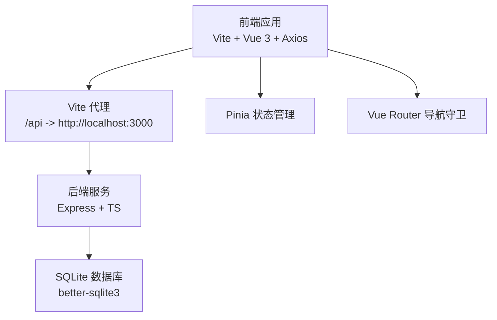
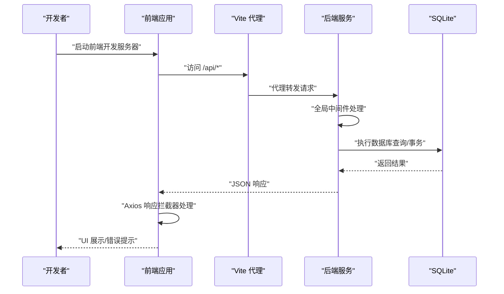
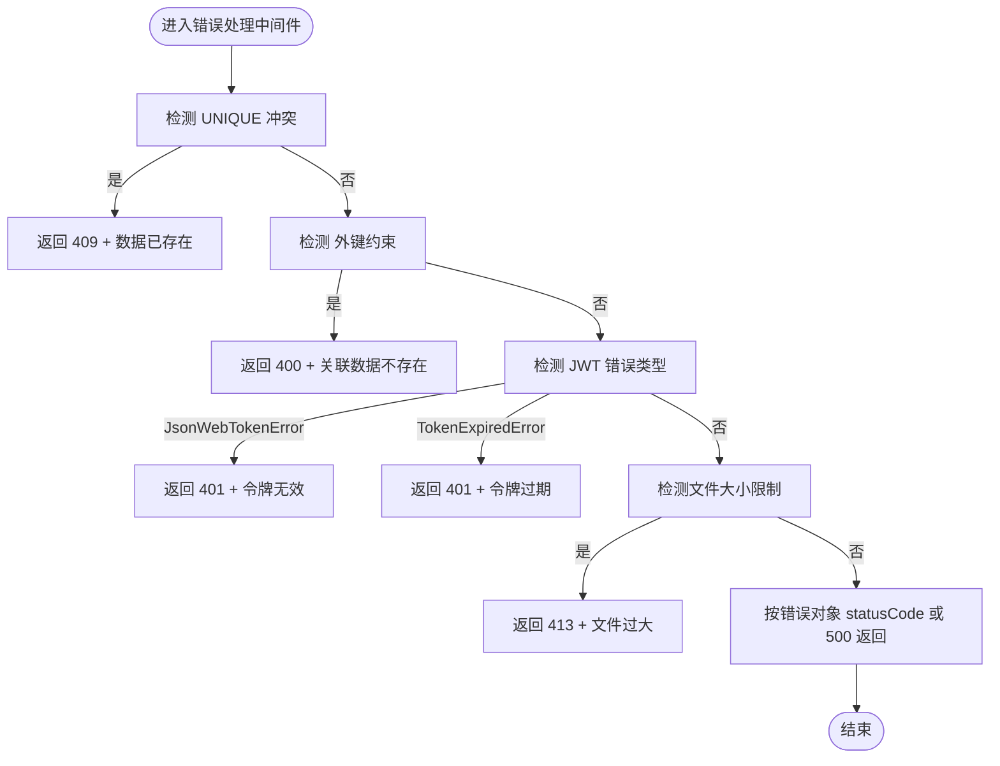
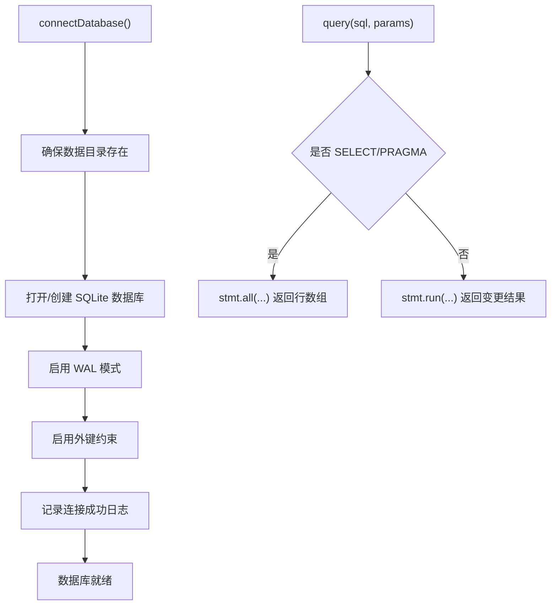
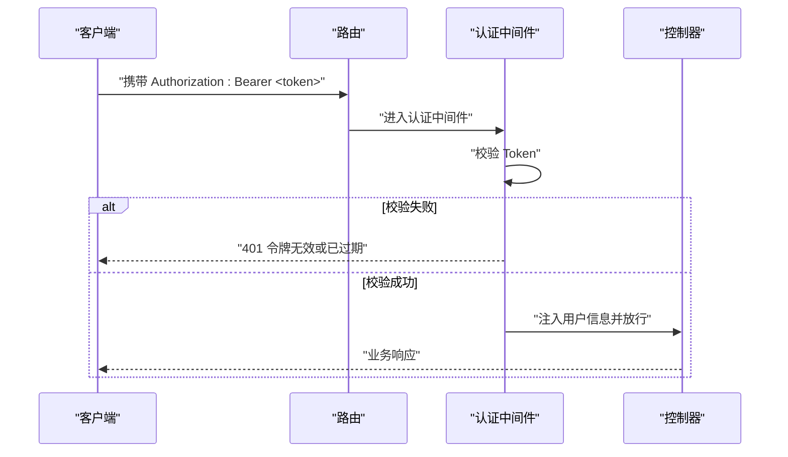
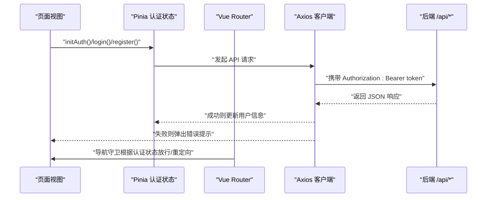
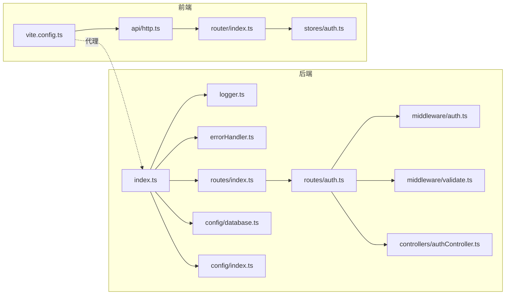

# 调试指南

<cite>
**本文引用的文件**
- [backend/src/utils/logger.ts](file://backend/src/utils/logger.ts)
- [backend/src/middleware/errorHandler.ts](file://backend/src/middleware/errorHandler.ts)
- [backend/src/config/index.ts](file://backend/src/config/index.ts)
- [backend/src/config/database.ts](file://backend/src/config/database.ts)
- [backend/src/middleware/auth.ts](file://backend/src/middleware/auth.ts)
- [backend/src/middleware/validate.ts](file://backend/src/middleware/validate.ts)
- [backend/src/controllers/authController.ts](file://backend/src/controllers/authController.ts)
- [backend/src/routes/auth.ts](file://backend/src/routes/auth.ts)
- [backend/src/index.ts](file://backend/src/index.ts)
- [frontend/src/api/http.ts](file://frontend/src/api/http.ts)
- [frontend/src/router/index.ts](file://frontend/src/router/index.ts)
- [frontend/src/stores/auth.ts](file://frontend/src/stores/auth.ts)
- [frontend/vite.config.ts](file://frontend/vite.config.ts)
- [backend/package.json](file://backend/package.json)
- [frontend/package.json](file://frontend/package.json)
</cite>

## 目录
1. [简介](#简介)
2. [项目结构](#项目结构)
3. [核心组件](#核心组件)
4. [架构总览](#架构总览)
5. [详细组件分析](#详细组件分析)
6. [依赖关系分析](#依赖关系分析)
7. [性能与调试建议](#性能与调试建议)
8. [故障排查指南](#故障排查指南)
9. [结论](#结论)
10. [附录](#附录)

## 简介
本调试指南面向 TingStudio 的后端与前端开发与测试人员，系统性介绍如何使用日志、浏览器开发者工具、网络请求调试、断点调试等技术定位问题；涵盖日志级别配置、错误堆栈查看、请求响应数据分析、调试环境设置、断点与变量监视技巧，并提供常见场景的案例与最佳实践。

## 项目结构
- 后端采用 Express + TypeScript，使用 better-sqlite3 作为数据库驱动，内置日志、错误处理、认证与参数校验中间件。
- 前端采用 Vue 3 + Vite + Pinia + Vue Router，Axios 统一发起 API 请求，通过本地存储维护鉴权状态。
- 开发时前后端通过代理打通：前端 Vite 代理 /api 到后端本地服务端口。

图表来源
- [frontend/vite.config.ts:12-22](file://frontend/vite.config.ts#L12-L22)
- [backend/src/index.ts:35-48](file://backend/src/index.ts#L35-L48)
- [backend/src/config/database.ts:18-37](file://backend/src/config/database.ts#L18-L37)

章节来源
- [backend/src/index.ts:13-61](file://backend/src/index.ts#L13-L61)
- [frontend/vite.config.ts:1-23](file://frontend/vite.config.ts#L1-L23)

## 核心组件
- 后端日志工具：提供 info/warn/error/debug 四级日志输出，支持时间戳与元数据打印，开发环境默认开启 debug 输出。
- 全局错误处理：对常见数据库约束错误、JWT 错误、文件大小限制、默认 500 等进行分类处理与统一响应。
- 配置中心：集中管理端口、数据库路径、JWT 秘钥与过期时间、上传目录与大小限制、CORS 来源等。
- 数据库连接：自动创建数据目录、启用 WAL 与外键约束、提供 query/transaction 接口与连接池化思路。
- 认证中间件：从 Authorization 头解析 Bearer Token 并校验，失败时返回 401。
- 参数校验中间件：基于规则对请求体字段进行类型、长度、范围与必填校验。
- 前端 HTTP 客户端：统一 baseURL、请求头、拦截器、错误提示与 401 自动登出逻辑。
- 前端路由与状态：导航守卫控制访问权限，Pinia 缓存用户信息与登录状态。

章节来源
- [backend/src/utils/logger.ts:24-39](file://backend/src/utils/logger.ts#L24-L39)
- [backend/src/middleware/errorHandler.ts:5-50](file://backend/src/middleware/errorHandler.ts#L5-L50)
- [backend/src/config/index.ts:2-24](file://backend/src/config/index.ts#L2-L24)
- [backend/src/config/database.ts:10-37](file://backend/src/config/database.ts#L10-L37)
- [backend/src/middleware/auth.ts:13-31](file://backend/src/middleware/auth.ts#L13-L31)
- [backend/src/middleware/validate.ts:16-67](file://backend/src/middleware/validate.ts#L16-L67)
- [frontend/src/api/http.ts:6-58](file://frontend/src/api/http.ts#L6-L58)
- [frontend/src/router/index.ts:148-162](file://frontend/src/router/index.ts#L148-L162)
- [frontend/src/stores/auth.ts:6-63](file://frontend/src/stores/auth.ts#L6-L63)

## 架构总览
后端服务启动流程、中间件链路与错误处理在启动文件中集中体现；前端通过 Vite 代理转发 /api 请求到后端，Axios 拦截器统一处理鉴权与错误提示。

图表来源
- [frontend/vite.config.ts:15-20](file://frontend/vite.config.ts#L15-L20)
- [backend/src/index.ts:20-48](file://backend/src/index.ts#L20-L48)
- [backend/src/config/database.ts:44-55](file://backend/src/config/database.ts#L44-L55)
- [frontend/src/api/http.ts:21-43](file://frontend/src/api/http.ts#L21-L43)

## 详细组件分析

### 后端日志与错误处理
- 日志级别与输出
  - info/warn/error/debug 分别对应不同颜色与前缀，支持附加元数据；debug 仅在开发环境生效。
  - 可通过 NODE_ENV 控制 debug 输出，便于本地调试。
- 错误处理策略
  - 对 SQLite 约束冲突、JWT 过期/无效、文件大小超限等进行分类处理，返回明确的业务错误码与消息。
  - 默认情况下根据错误对象上的 statusCode 返回相应状态码，开发环境返回具体错误消息，生产环境返回通用错误描述。

图表来源
- [backend/src/middleware/errorHandler.ts:13-49](file://backend/src/middleware/errorHandler.ts#L13-L49)

章节来源
- [backend/src/utils/logger.ts:24-39](file://backend/src/utils/logger.ts#L24-L39)
- [backend/src/middleware/errorHandler.ts:5-50](file://backend/src/middleware/errorHandler.ts#L5-L50)

### 数据库连接与查询
- 连接管理
  - 自动创建数据目录，确保数据库文件可写；启用 WAL 模式与外键约束，提升并发与一致性。
  - 提供 query 方法兼容 SELECT/INSERT/UPDATE/DELETE，返回结构与 mysql2 类似，便于控制器解构使用。
- 事务支持
  - 提供 transaction 包装，保证多条写入的一致性。

图表来源
- [backend/src/config/database.ts:10-37](file://backend/src/config/database.ts#L10-L37)
- [backend/src/config/database.ts:44-61](file://backend/src/config/database.ts#L44-L61)

章节来源
- [backend/src/config/database.ts:10-70](file://backend/src/config/database.ts#L10-L70)

### 认证与参数校验
- 认证中间件
  - 从 Authorization 头提取 Bearer Token，使用配置中的密钥与过期时间进行校验；校验失败统一返回 401。
- 参数校验中间件
  - 支持字符串/数字/布尔/数组类型校验，以及最小/最大值、最小/最大长度、必填等规则；校验失败返回 400 与错误列表。

图表来源
- [backend/src/middleware/auth.ts:13-31](file://backend/src/middleware/auth.ts#L13-L31)
- [backend/src/routes/auth.ts:19](file://backend/src/routes/auth.ts#L19)
- [backend/src/controllers/authController.ts:74-88](file://backend/src/controllers/authController.ts#L74-L88)

章节来源
- [backend/src/middleware/auth.ts:13-38](file://backend/src/middleware/auth.ts#L13-L38)
- [backend/src/middleware/validate.ts:16-67](file://backend/src/middleware/validate.ts#L16-L67)
- [backend/src/routes/auth.ts:1-20](file://backend/src/routes/auth.ts#L1-L20)

### 前端 HTTP 客户端与路由守卫
- Axios 客户端
  - 统一 baseURL 为 /api，自动附加本地存储中的 token；响应拦截器对 success=false 的业务错误进行提示与拒绝；对 401 自动清理本地缓存并跳转登录。
- 路由守卫
  - 在导航前检查认证状态，未登录则重定向至登录页；已登录访问登录/注册页则重定向首页。
- Pinia 状态
  - 缓存用户信息与 token，登录/注册成功后持久化保存并更新状态；登出时清除缓存并重置状态。

图表来源
- [frontend/src/api/http.ts:12-43](file://frontend/src/api/http.ts#L12-L43)
- [frontend/src/router/index.ts:148-162](file://frontend/src/router/index.ts#L148-L162)
- [frontend/src/stores/auth.ts:12-63](file://frontend/src/stores/auth.ts#L12-L63)

章节来源
- [frontend/src/api/http.ts:1-58](file://frontend/src/api/http.ts#L1-L58)
- [frontend/src/router/index.ts:1-165](file://frontend/src/router/index.ts#L1-L165)
- [frontend/src/stores/auth.ts:1-64](file://frontend/src/stores/auth.ts#L1-L64)

## 依赖关系分析
- 后端
  - 启动文件引入日志、数据库连接、路由与错误处理；morgan 用于请求日志；cors/helmet/compression 提升安全与性能。
  - 路由层组合控制器与中间件，控制器依赖数据库查询与工具函数。
- 前端
  - Vite 配置代理后端服务；Axios 客户端封装统一拦截器；路由与 Pinia 协同实现鉴权与导航。

图表来源
- [backend/src/index.ts:8-11](file://backend/src/index.ts#L8-L11)
- [backend/src/routes/auth.ts:3-5](file://backend/src/routes/auth.ts#L3-L5)
- [frontend/vite.config.ts:15-20](file://frontend/vite.config.ts#L15-L20)

章节来源
- [backend/src/index.ts:13-61](file://backend/src/index.ts#L13-L61)
- [frontend/vite.config.ts:1-23](file://frontend/vite.config.ts#L1-L23)

## 性能与调试建议
- 日志级别与输出
  - 开发环境建议保持 NODE_ENV=development 以启用 debug 日志；生产环境建议仅保留 info/warn/error。
  - 使用 logger 的元数据能力记录关键上下文（如请求 ID、用户 ID、SQL 片段），便于追踪。
- 中间件顺序与性能
  - helmet/cors/compression 顺序合理，注意压缩与 JSON 解析的大小限制（默认 10MB）。
- 数据库优化
  - WAL 模式提升读写并发；外键约束保障一致性；对高频查询建立索引（结合实际 SQL）。
- 前端性能
  - 使用 Vite 的热更新与按需加载；避免在响应拦截器中做重型计算；合理使用 Pinia 状态缓存。

[本节为通用建议，不直接分析具体文件]

## 故障排查指南

### 后端日志分析
- 启动日志
  - 查看服务启动与环境信息输出，确认端口、CORS 来源、NODE_ENV 是否符合预期。
- 请求日志
  - morgan(dev) 输出请求方法、URL、状态码与响应时间，快速定位慢接口与异常状态。
- 错误日志
  - 使用 logger.error 记录异常堆栈与上下文；结合 errorHandler 的分类处理判断是参数错误、鉴权失败还是数据库约束冲突。

章节来源
- [backend/src/index.ts:51-54](file://backend/src/index.ts#L51-L54)
- [backend/src/index.ts:27](file://backend/src/index.ts#L27)
- [backend/src/middleware/errorHandler.ts:11](file://backend/src/middleware/errorHandler.ts#L11)

### 前端浏览器开发者工具
- 网络面板
  - 观察 /api/* 请求的请求头（Authorization）、状态码、响应体；关注 401 时是否缺少 token 或 token 过期。
- 存储面板
  - 检查 localStorage 中是否存在 tingstudio_token 与用户缓存；401 后前端会清理这些缓存并跳转登录。
- 控制台
  - 查看 Axios 响应拦截器抛出的错误对象与 MessagePlugin 的提示信息，辅助定位业务错误。
- 调试断点
  - 在路由守卫与 Pinia 动作中设置断点，观察认证状态变化与导航行为。

章节来源
- [frontend/src/api/http.ts:12-43](file://frontend/src/api/http.ts#L12-L43)
- [frontend/src/router/index.ts:148-162](file://frontend/src/router/index.ts#L148-L162)
- [frontend/src/stores/auth.ts:19-47](file://frontend/src/stores/auth.ts#L19-L47)

### 网络请求调试
- 代理配置
  - 确认 Vite 代理将 /api 指向后端地址；跨域问题优先检查 CORS 来源与凭证设置。
- 请求头与鉴权
  - 确认 Authorization: Bearer token 正确附加；若 401，检查 token 是否过期或被篡改。
- 响应数据
  - 统一响应结构包含 success/message/data；业务错误时 success=false，需根据 message 与错误码定位问题。

章节来源
- [frontend/vite.config.ts:15-20](file://frontend/vite.config.ts#L15-L20)
- [frontend/src/api/http.ts:6-19](file://frontend/src/api/http.ts#L6-L19)
- [frontend/src/api/http.ts:21-43](file://frontend/src/api/http.ts#L21-L43)

### 断点调试与变量监视
- 后端
  - 使用 tsx watch 启动时可在 IDE 设置断点；在控制器、中间件与数据库查询处插入断点，监视 req/res、用户信息与 SQL 参数。
- 前端
  - 在路由守卫、Pinia 动作与 API 调用处设置断点；监视用户状态、loading 状态与错误消息。
- 变量监视
  - 关注关键变量：用户 ID、token、请求体、数据库查询结果、分页参数等。

章节来源
- [backend/package.json:7](file://backend/package.json#L7)
- [frontend/package.json:7](file://frontend/package.json#L7)
- [backend/src/controllers/authController.ts:9-39](file://backend/src/controllers/authController.ts#L9-L39)
- [frontend/src/stores/auth.ts:19-47](file://frontend/src/stores/auth.ts#L19-L47)

### 常见场景案例
- 场景一：注册时报“用户名已存在”
  - 后端：控制器检查重复用户名并返回 409；前端：响应拦截器提示“数据已存在”。
  - 调试要点：确认用户名唯一性检查逻辑与前端提示一致。
- 场景二：登录后 401
  - 前端：响应拦截器检测 401，清理本地缓存并跳转登录；后端：认证中间件校验失败返回 401。
  - 调试要点：检查 token 是否正确存储、是否过期、是否被篡改。
- 场景三：数据库约束冲突
  - 后端：UNIQUE/FOREIGN KEY 冲突被 errorHandler 捕获并返回明确错误；前端：提示“数据已存在/关联数据不存在”。
  - 调试要点：核对输入数据与关联表是否存在。

章节来源
- [backend/src/controllers/authController.ts:13-21](file://backend/src/controllers/authController.ts#L13-L21)
- [frontend/src/api/http.ts:33-37](file://frontend/src/api/http.ts#L33-L37)
- [backend/src/middleware/auth.ts:13-31](file://backend/src/middleware/auth.ts#L13-L31)
- [backend/src/middleware/errorHandler.ts:13-23](file://backend/src/middleware/errorHandler.ts#L13-L23)

## 结论
通过统一的日志体系、完善的错误处理、清晰的认证与校验机制，以及前后端协同的调试工具链，可以高效定位与解决 TingStudio 的各类问题。建议在开发阶段充分利用 debug 日志与断点，在测试阶段重点验证鉴权、参数校验与数据库约束场景。

[本节为总结，不直接分析具体文件]

## 附录

### 环境变量与配置
- 后端
  - PORT、NODE_ENV、DB_PATH、JWT_SECRET、JWT_EXPIRES_IN、UPLOAD_DIR、MAX_FILE_SIZE、CORS_ORIGIN。
- 前端
  - Vite 默认端口 5173，代理 /api 到后端本地服务。

章节来源
- [backend/src/config/index.ts:2-24](file://backend/src/config/index.ts#L2-L24)
- [frontend/vite.config.ts:12-22](file://frontend/vite.config.ts#L12-L22)

### 启动与脚本
- 后端
  - dev：tsx watch 监听重启；build：TypeScript 编译；start：运行 dist；init-db/seed/import-nutrition：数据库初始化与数据导入。
- 前端
  - dev：Vite 开发服务器；build：编译打包；preview：预览构建产物；init:sample-data：初始化示例数据。

章节来源
- [backend/package.json:6-12](file://backend/package.json#L6-L12)
- [frontend/package.json:6-11](file://frontend/package.json#L6-L11)