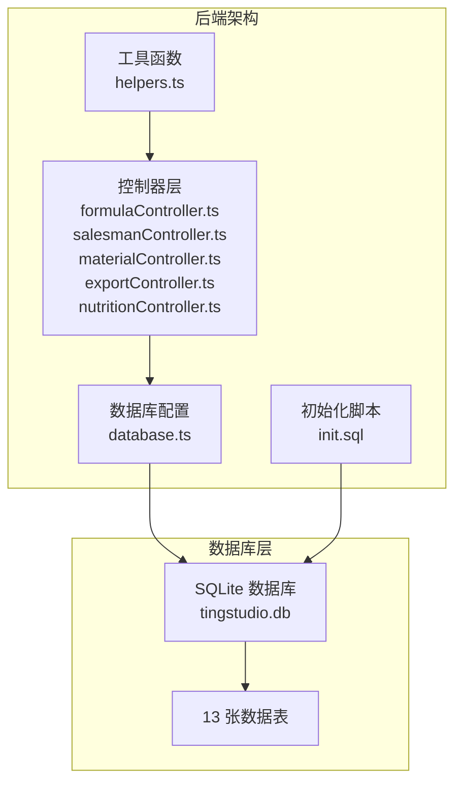
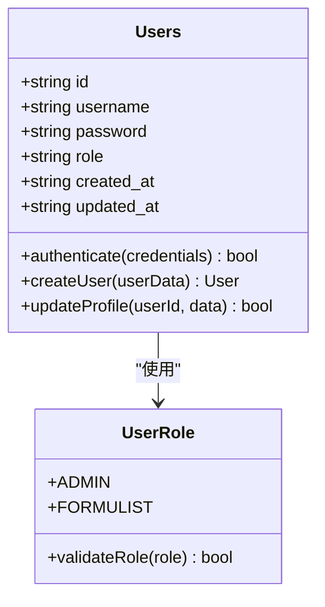
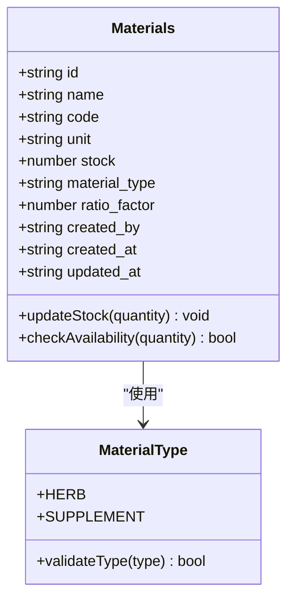
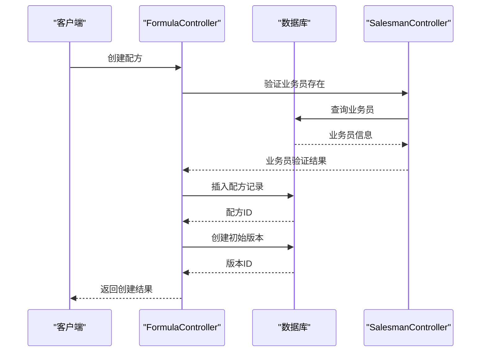
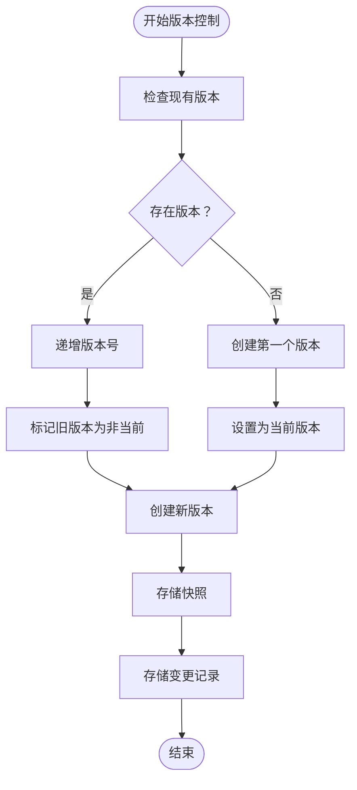
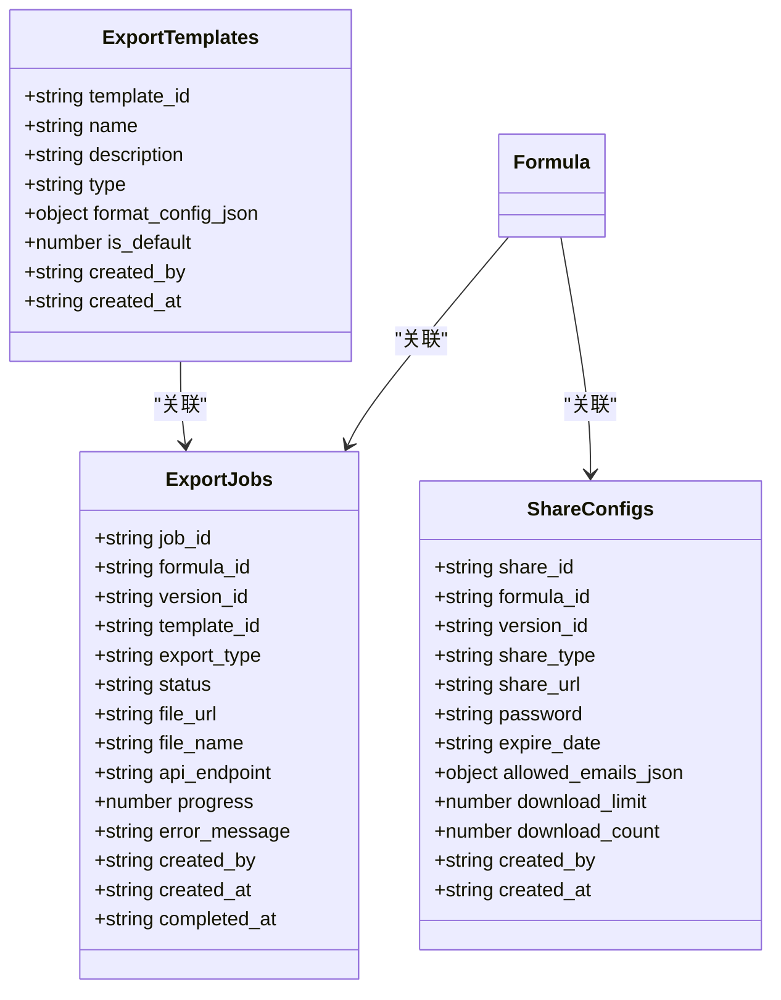
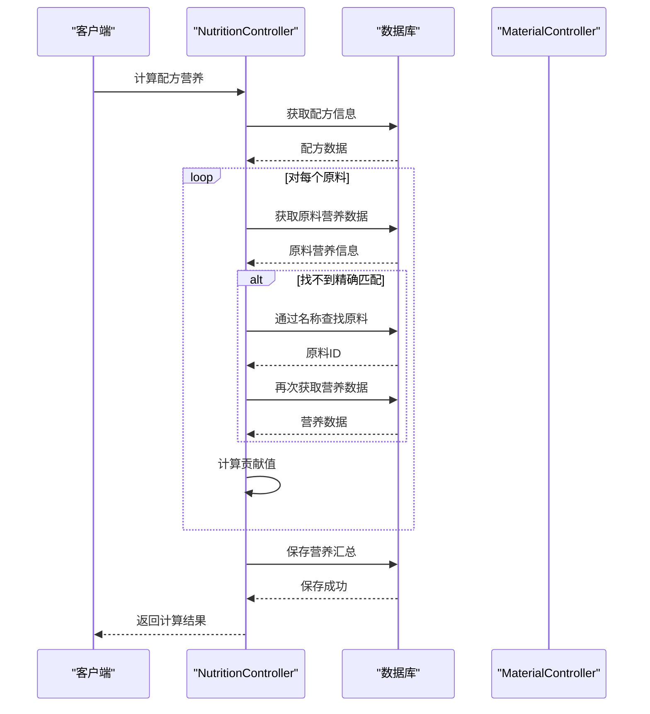
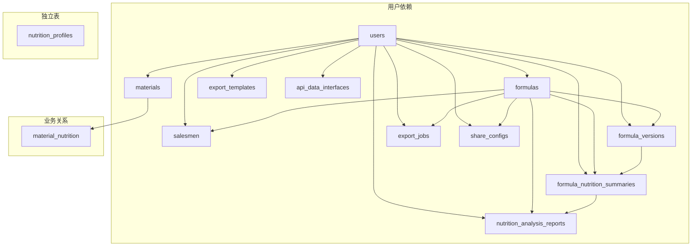

# 实体关系设计

<cite>
**本文档引用的文件**
- [DATABASE_DOC.md](file://backend/DATABASE_DOC.md)
- [init.sql](file://backend/src/scripts/init.sql)
- [database.ts](file://backend/src/config/database.ts)
- [helpers.ts](file://backend/src/utils/helpers.ts)
- [formulaController.ts](file://backend/src/controllers/formulaController.ts)
- [salesmanController.ts](file://backend/src/controllers/salesmanController.ts)
- [materialController.ts](file://backend/src/controllers/materialController.ts)
- [exportController.ts](file://backend/src/controllers/exportController.ts)
- [nutritionController.ts](file://backend/src/controllers/nutritionController.ts)
</cite>

## 目录
1. [简介](#简介)
2. [项目结构](#项目结构)
3. [核心组件](#核心组件)
4. [架构概览](#架构概览)
5. [详细组件分析](#详细组件分析)
6. [依赖关系分析](#依赖关系分析)
7. [性能考虑](#性能考虑)
8. [故障排除指南](#故障排除指南)
9. [结论](#结论)

## 简介

TingStudio 是一个基于 SQLite 的配方管理系统，采用 better-sqlite3 作为数据库驱动。该系统实现了完整的配方管理、营养分析、导出管理和业务员管理功能。本文档详细分析了系统中的 13 张表之间的实体关系设计，包括外键约束、级联操作和参照完整性。

## 项目结构

系统采用前后端分离架构，后端使用 Node.js + Express + better-sqlite3，前端使用 Vue.js。数据库初始化通过 SQL 脚本完成，支持 WAL 模式和外键约束。



**图表来源**
- [database.ts:1-70](file://backend/src/config/database.ts#L1-L70)
- [init.sql:1-228](file://backend/src/scripts/init.sql#L1-L228)

**章节来源**
- [database.ts:1-70](file://backend/src/config/database.ts#L1-L70)
- [init.sql:1-228](file://backend/src/scripts/init.sql#L1-L228)

## 核心组件

系统包含 5 个功能模块，共 13 张表：

### 基础模块（3 张表）
- **users**: 用户管理系统
- **materials**: 原料管理
- **formulas**: 配方管理

### 业务员管理（1 张表）
- **salesmen**: 业务员管理

### 版本控制（1 张表）
- **formula_versions**: 配方版本控制

### 导出管理（4 张表）
- **export_templates**: 导出模板
- **export_jobs**: 导出任务
- **api_data_interfaces**: API 数据接口
- **share_configs**: 分享配置

### 营养分析（4 张表）
- **material_nutrition**: 原料营养成分
- **formula_nutrition_summaries**: 配方营养汇总
- **nutrition_profiles**: 营养标准档案
- **nutrition_analysis_reports**: 营养分析报告

**章节来源**
- [DATABASE_DOC.md:11-19](file://backend/DATABASE_DOC.md#L11-L19)

## 架构概览

系统采用三层架构设计，通过外键约束确保数据完整性，支持复杂的业务关系。

```mermaid
erDiagram
USERS {
text id PK
text username UK
text password
text role
text created_at
text updated_at
}
MATERIALS {
text id PK
text name
text code UK
text unit
real stock
text material_type
real ratio_factor
text created_by FK
text created_at
text updated_at
}
FORMULAS {
text id PK
text name
text salesman_id FK
text salesman_name
text materials_json
real finished_weight
text description
text created_by FK
text created_at
text updated_at
}
SALEMEN {
text id PK
text name
text code UK
text department
text phone
text email
text status
text created_by
text created_at
text updated_at
}
FORMULA_VERSIONS {
text version_id PK
text formula_id FK
text version_number
text version_name
text changes_json
text snapshot_json
text status
integer is_current
text created_by
text created_at
}
EXPORT_TEMPLATES {
text template_id PK
text name
text description
text type
text format_config_json
integer is_default
text created_by
text created_at
}
EXPORT_JOBS {
text job_id PK
text formula_id FK
text version_id
text template_id
text export_type
text status
text file_url
text file_name
text api_endpoint
integer progress
text error_message
text created_by
text created_at
text completed_at
}
API_DATA_INTERFACES {
text interface_id PK
text name
text description
text endpoint UK
text method
text authentication
text auth_config_json
text data_format
text field_mapping_json
text rate_limit_json
text retry_config_json
text created_by
text created_at
text updated_at
}
SHARE_CONFIGS {
text share_id PK
text formula_id FK
text version_id
text share_type
text share_url
text password
text expire_date
text allowed_emails_json
integer download_limit
integer download_count
text created_by
text created_at
}
MATERIAL_NUTRITION {
text nutrition_id PK
text material_id UK FK
text per_100g_json
text data_version
text data_source
text notes
text last_updated
}
FORMULA_NUTRITION_SUMMARIES {
text summary_id PK
text formula_id FK
text version_id UK
real total_weight
text total_nutrition_json
text per_100g_nutrition_json
text material_breakdown_json
text calculated_by
text calculated_at
}
NUTRITION_PROFILES {
text profile_id PK
text name
text description
text category
text target_values_json
text tolerance_ranges_json
text mandatory_fields_json
text created_at
text updated_at
}
NUTRITION_ANALYSIS_REPORTS {
text report_id PK
text formula_id FK
text version_id
text summary_id FK
text compliance_check_json
text recommendations_json
text generated_by
text generated_at
}
USERS ||--o{ MATERIALS : "创建"
USERS ||--o{ FORMULAS : "创建"
USERS ||--o{ SALEMEN : "创建"
USERS ||--o{ FORMULA_VERSIONS : "创建"
USERS ||--o{ EXPORT_TEMPLATES : "创建"
USERS ||--o{ EXPORT_JOBS : "创建"
USERS ||--o{ API_DATA_INTERFACES : "创建"
USERS ||--o{ SHARE_CONFIGS : "创建"
USERS ||--o{ FORMULA_NUTRITION_SUMMARIES : "计算"
USERS ||--o{ NUTRITION_ANALYSIS_REPORTS : "生成"
MATERIALS ||--|| MATERIAL_NUTRITION : "一对一"
FORMULAS }o--|| SALEMEN : "多对一"
FORMULAS ||--o{ FORMULA_VERSIONS : "一对多"
FORMULAS ||--o{ EXPORT_JOBS : "一对多"
FORMULAS ||--o{ FORMULA_NUTRITION_SUMMARIES : "一对多"
FORMULAS ||--o{ SHARE_CONFIGS : "一对多"
FORMULAS ||--o{ NUTRITION_ANALYSIS_REPORTS : "一对多"
FORMULA_VERSIONS ||--|| FORMULA_NUTRITION_SUMMARIES : "一对一"
FORMULA_NUTRITION_SUMMARIES ||--o{ NUTRITION_ANALYSIS_REPORTS : "一对多"
NUTRITION_PROFILES ||--o{ NUTRITION_ANALYSIS_REPORTS : "被引用"
```

**图表来源**
- [DATABASE_DOC.md:25-427](file://backend/DATABASE_DOC.md#L25-L427)
- [init.sql:7-228](file://backend/src/scripts/init.sql#L7-L228)

## 详细组件分析

### 用户管理模块 (users)

用户表是整个系统的核心实体，支持管理员和配方师两种角色。



**图表来源**
- [DATABASE_DOC.md:25-41](file://backend/DATABASE_DOC.md#L25-L41)

**章节来源**
- [DATABASE_DOC.md:25-41](file://backend/DATABASE_DOC.md#L25-L41)

### 原料管理模块 (materials)

原料表存储配方所需的各种原料信息，支持中药材和营养补充剂两类。



**图表来源**
- [DATABASE_DOC.md:44-64](file://backend/DATABASE_DOC.md#L44-L64)

**章节来源**
- [DATABASE_DOC.md:44-64](file://backend/DATABASE_DOC.md#L44-L64)

### 配方管理模块 (formulas)

配方表存储配方基本信息，通过 JSON 格式存储原料列表，并关联业务员。



**图表来源**
- [formulaController.ts:88-130](file://backend/src/controllers/formulaController.ts#L88-L130)
- [DATABASE_DOC.md:67-90](file://backend/DATABASE_DOC.md#L67-L90)

**章节来源**
- [formulaController.ts:88-130](file://backend/src/controllers/formulaController.ts#L88-L130)
- [DATABASE_DOC.md:67-90](file://backend/DATABASE_DOC.md#L67-L90)

### 业务员管理模块 (salesmen)

业务员表存储销售代表的基本信息，支持激活和停用状态管理。

**章节来源**
- [DATABASE_DOC.md:101-122](file://backend/DATABASE_DOC.md#L101-L122)
- [salesmanController.ts:61-83](file://backend/src/controllers/salesmanController.ts#L61-L83)

### 版本控制模块 (formula_versions)

配方版本表实现完整的版本快照和变更记录功能。



**图表来源**
- [formulaController.ts:167-211](file://backend/src/controllers/formulaController.ts#L167-L211)
- [DATABASE_DOC.md:125-172](file://backend/DATABASE_DOC.md#L125-L172)

**章节来源**
- [formulaController.ts:167-211](file://backend/src/controllers/formulaController.ts#L167-L211)
- [DATABASE_DOC.md:125-172](file://backend/DATABASE_DOC.md#L125-L172)

### 导出管理模块

导出管理模块包含模板、任务、API 接口和分享配置四个表。



**图表来源**
- [DATABASE_DOC.md:175-270](file://backend/DATABASE_DOC.md#L175-L270)

**章节来源**
- [DATABASE_DOC.md:175-270](file://backend/DATABASE_DOC.md#L175-L270)
- [exportController.ts:55-72](file://backend/src/controllers/exportController.ts#L55-L72)

### 营养分析模块

营养分析模块实现从原料到配方的完整营养计算流程。



**图表来源**
- [nutritionController.ts:123-242](file://backend/src/controllers/nutritionController.ts#L123-L242)

**章节来源**
- [nutritionController.ts:123-242](file://backend/src/controllers/nutritionController.ts#L123-L242)

## 依赖关系分析

系统通过外键约束建立了严格的依赖关系，确保数据一致性。

### 主要依赖关系



**图表来源**
- [DATABASE_DOC.md:393-427](file://backend/DATABASE_DOC.md#L393-L427)

### 外键约束设计

系统实现了多种外键约束策略：

1. **RESTRICT 约束**: `formulas.salesman_id` → `salesmen.id`
   - 防止删除仍在使用的业务员

2. **CASCADE 约束**: 
   - `formula_versions.formula_id` → `formulas.id`
   - `export_jobs.formula_id` → `formulas.id`
   - `share_configs.formula_id` → `formulas.id`
   - `formula_nutrition_summaries.formula_id` → `formulas.id`
   - `material_nutrition.material_id` → `materials.id`
   - `nutrition_analysis_reports.formula_id` → `formulas.id`
   - `nutrition_analysis_reports.summary_id` → `formula_nutrition_summaries.summary_id`

3. **UNIQUE 约束**:
   - `formula_nutrition_summaries.version_id` (UNIQUE)
   - `material_nutrition.material_id` (UNIQUE)

**章节来源**
- [DATABASE_DOC.md:84](file://backend/DATABASE_DOC.md#L84)
- [DATABASE_DOC.md:142](file://backend/DATABASE_DOC.md#L142)
- [DATABASE_DOC.md:215](file://backend/DATABASE_DOC.md#L215)
- [DATABASE_DOC.md:267](file://backend/DATABASE_DOC.md#L267)
- [DATABASE_DOC.md:342](file://backend/DATABASE_DOC.md#L342)
- [DATABASE_DOC.md:287](file://backend/DATABASE_DOC.md#L287)
- [DATABASE_DOC.md:385-387](file://backend/DATABASE_DOC.md#L385-L387)

## 性能考虑

### 索引优化

系统为关键查询字段建立了索引：

- **users**: username (UNIQUE)
- **materials**: name, code (UNIQUE)
- **salesmen**: name, code, status
- **formulas**: name, salesman_id, created_by
- **formula_versions**: formula_id, (formula_id, version_number)
- **export_jobs**: formula_id, status
- **export_templates**: type
- **api_data_interfaces**: endpoint (UNIQUE)
- **share_configs**: formula_id
- **formula_nutrition_summaries**: formula_id, version_id (UNIQUE)
- **nutrition_analysis_reports**: formula_id
- **nutrition_profiles**: category

### 查询优化策略

1. **批量查询**: 在获取配方列表时，同时查询相关版本信息
2. **条件过滤**: 使用适当的 WHERE 条件减少查询结果集
3. **分页处理**: 默认每页 20 条记录，最大 100 条
4. **JSON 查询**: 使用 LIKE 操作符进行 JSON 字段查询

**章节来源**
- [DATABASE_DOC.md:61-63](file://backend/DATABASE_DOC.md#L61-L63)
- [DATABASE_DOC.md:86-89](file://backend/DATABASE_DOC.md#L86-L89)
- [DATABASE_DOC.md:144-147](file://backend/DATABASE_DOC.md#L144-L147)
- [DATABASE_DOC.md:217-219](file://backend/DATABASE_DOC.md#L217-L219)
- [DATABASE_DOC.md:344](file://backend/DATABASE_DOC.md#L344)
- [formulaController.ts:44-63](file://backend/src/controllers/formulaController.ts#L44-L63)

## 故障排除指南

### 常见错误及解决方案

1. **外键约束错误**
   - 症状: 删除业务员时报错
   - 原因: 业务员仍有关联的配方
   - 解决: 先删除或转移相关配方

2. **唯一约束冲突**
   - 症状: 创建重复的用户名、原料编码、业务员工号
   - 原因: UNIQUE 约束触发
   - 解决: 修改为唯一的值

3. **JSON 数据解析错误**
   - 症状: 营养数据或模板配置解析失败
   - 原因: JSON 格式不正确
   - 解决: 使用安全解析函数处理

4. **版本控制问题**
   - 症状: 版本号计算错误
   - 原因: 版本号格式不符合预期
   - 解决: 按照 vX.Y 格式生成版本号

**章节来源**
- [salesmanController.ts:115-124](file://backend/src/controllers/salesmanController.ts#L115-L124)
- [materialController.ts:73-78](file://backend/src/controllers/materialController.ts#L73-L78)
- [formulaController.ts:182-186](file://backend/src/controllers/formulaController.ts#L182-L186)

## 结论

TingStudio 的实体关系设计体现了良好的数据库规范化原则和业务逻辑抽象。通过 13 张表的精心设计，系统实现了从用户管理到营养分析的完整业务流程。外键约束确保了数据完整性，索引优化提升了查询性能，而 JSON 字段的设计则提供了灵活的数据存储能力。

该设计支持复杂的业务场景，如配方版本控制、营养成分计算、多格式导出等功能，为配方师和管理员提供了完整的工具链。通过 RESTRICT 和 CASCADE 等不同的外键策略，系统在保证数据一致性的同时，也提供了足够的灵活性来处理各种业务需求。