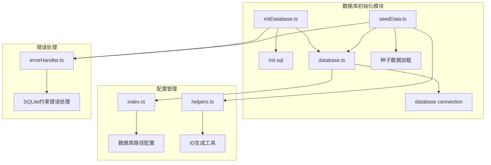
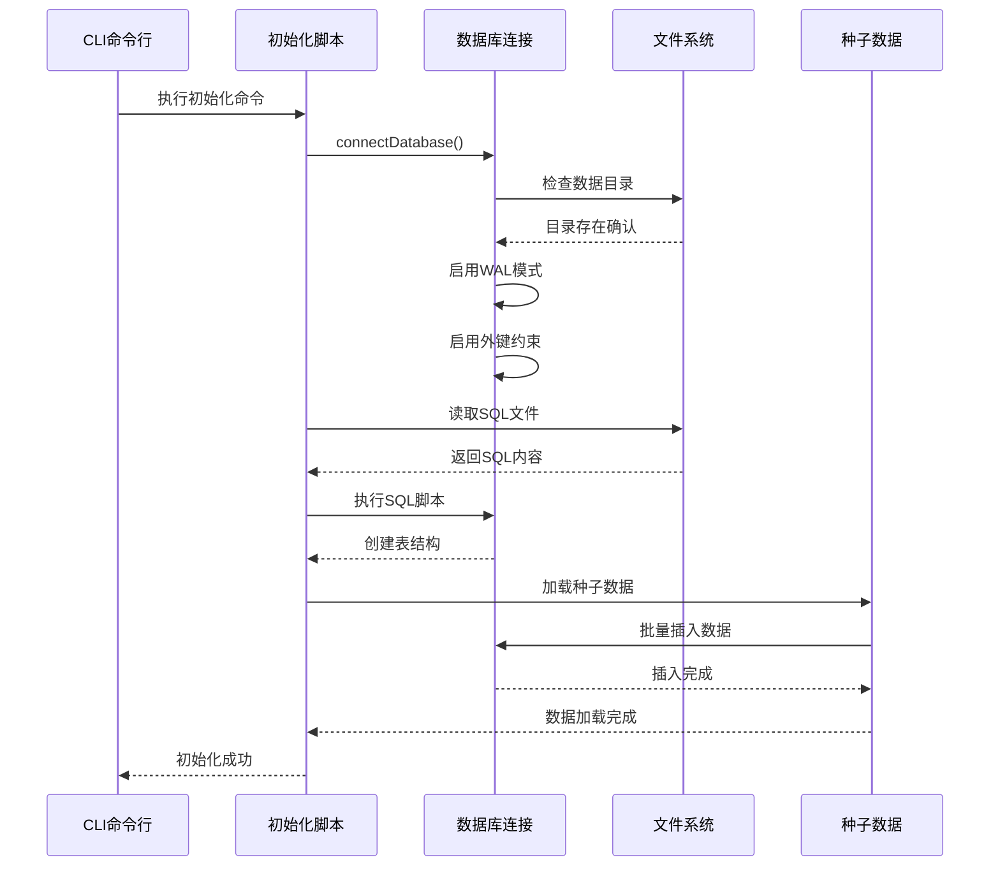
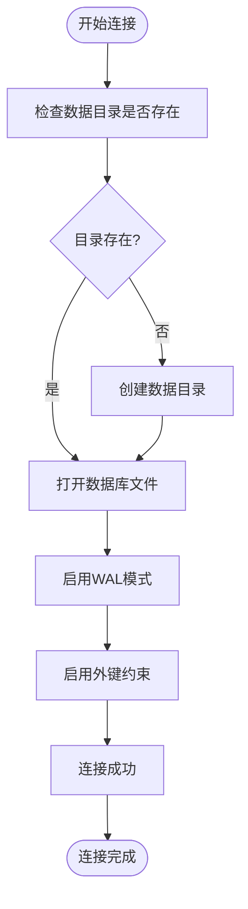
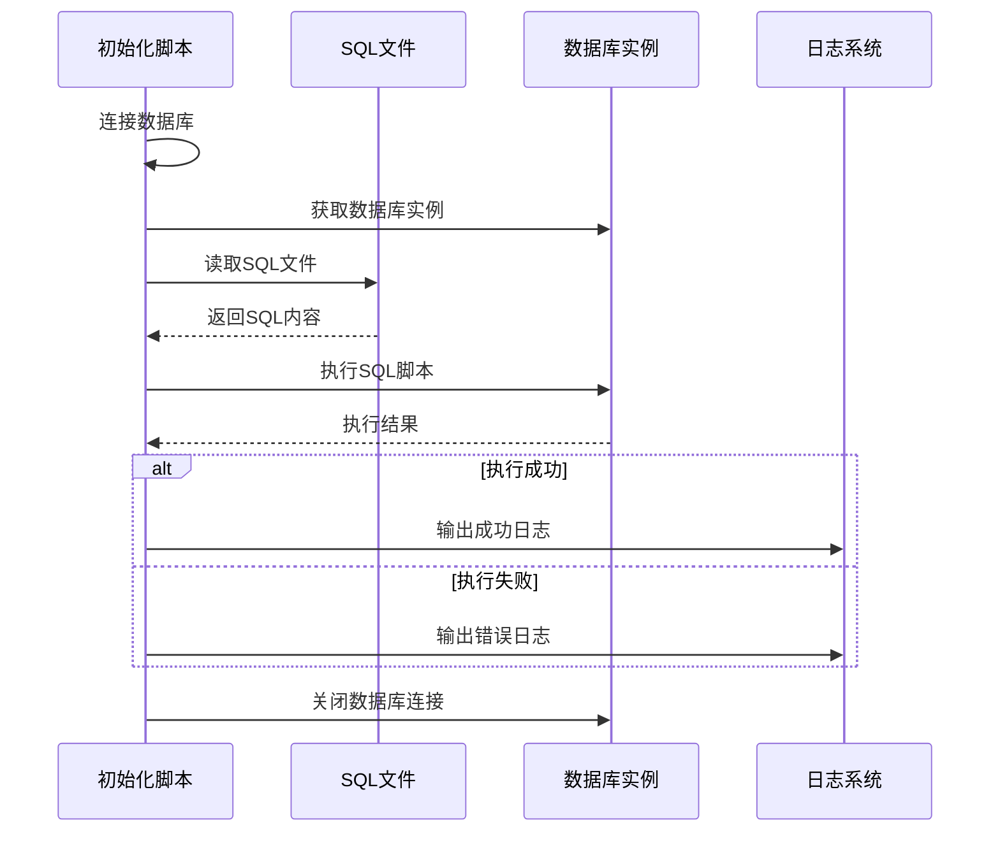
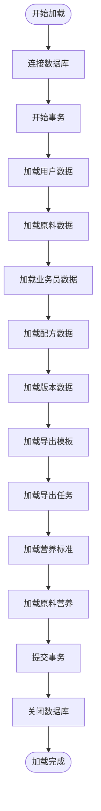
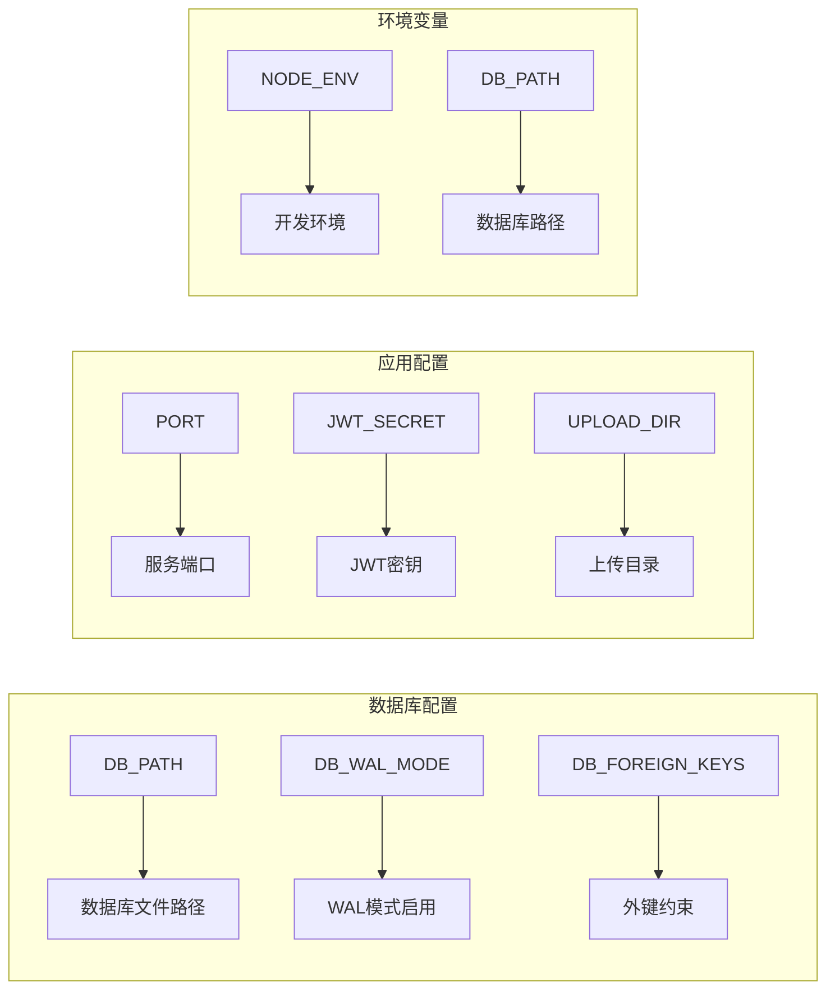
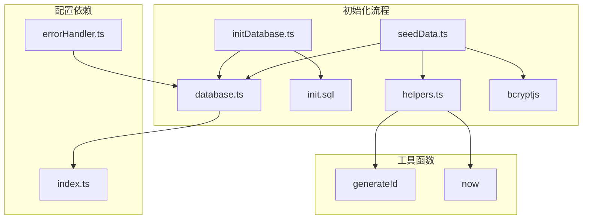
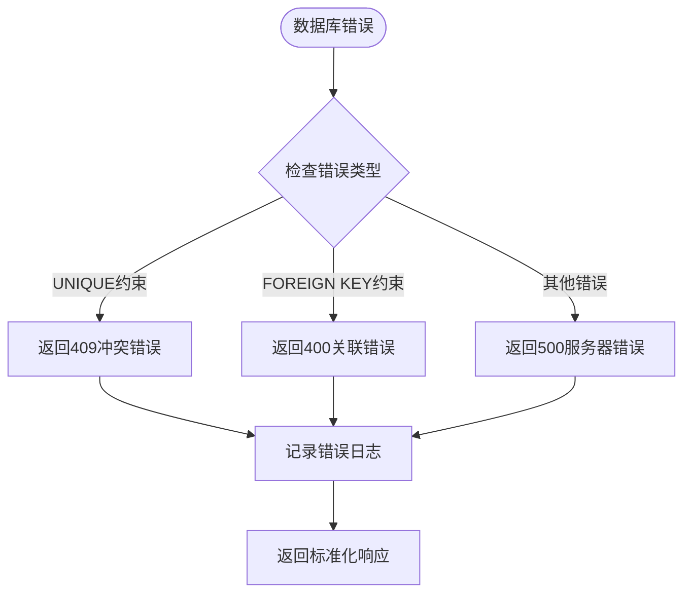
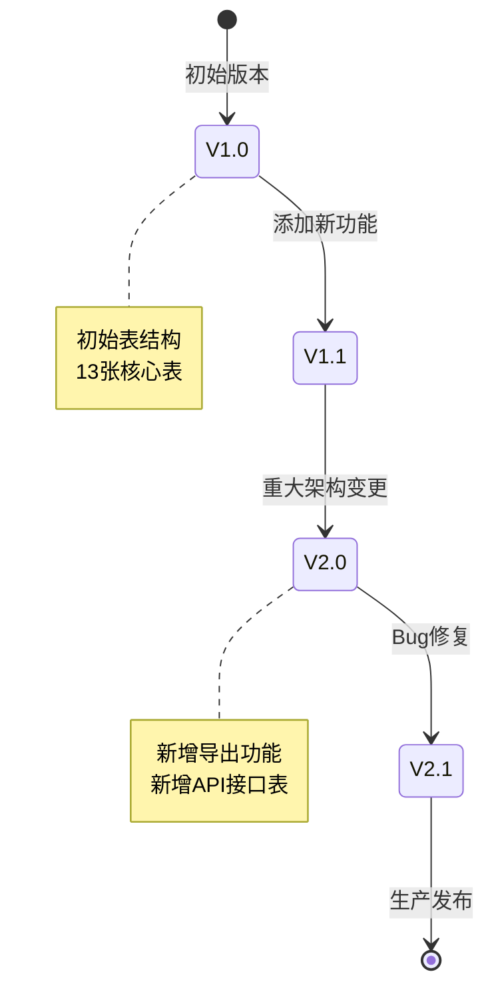

# 数据库初始化

<cite>
**本文档引用的文件**
- [initDatabase.ts](file://backend/src/scripts/initDatabase.ts)
- [init.sql](file://backend/src/scripts/init.sql)
- [database.ts](file://backend/src/config/database.ts)
- [index.ts](file://backend/src/config/index.ts)
- [seedData.ts](file://backend/src/scripts/seedData.ts)
- [helpers.ts](file://backend/src/utils/helpers.ts)
- [errorHandler.ts](file://backend/src/middleware/errorHandler.ts)
- [DATABASE_DOC.md](file://backend/DATABASE_DOC.md)
- [package.json](file://backend/package.json)
</cite>

## 目录
1. [简介](#简介)
2. [项目结构](#项目结构)
3. [核心组件](#核心组件)
4. [架构概览](#架构概览)
5. [详细组件分析](#详细组件分析)
6. [依赖关系分析](#依赖关系分析)
7. [性能考虑](#性能考虑)
8. [故障排除指南](#故障排除指南)
9. [结论](#结论)
10. [附录](#附录)

## 简介
TingStudio 是一个基于 SQLite 的食品配方工作数据管理平台。本文档详细说明了数据库初始化流程，包括数据库文件创建、表结构创建、索引建立、约束设置等初始化过程。同时阐述了种子数据的加载机制、数据量参考、数据库版本管理和迁移策略，以及初始化脚本的执行顺序和错误处理机制。

## 项目结构
TingStudio 后端采用模块化架构，数据库相关代码主要集中在以下位置：
- `backend/src/scripts/` - 数据库初始化和种子数据脚本
- `backend/src/config/` - 数据库连接配置管理
- `backend/src/utils/` - 通用工具函数
- `backend/src/middleware/` - 错误处理中间件



**图表来源**
- [initDatabase.ts:1-37](file://backend/src/scripts/initDatabase.ts#L1-L37)
- [database.ts:1-70](file://backend/src/config/database.ts#L1-L70)
- [seedData.ts:1-399](file://backend/src/scripts/seedData.ts#L1-L399)

**章节来源**
- [initDatabase.ts:1-37](file://backend/src/scripts/initDatabase.ts#L1-L37)
- [database.ts:1-70](file://backend/src/config/database.ts#L1-L70)
- [seedData.ts:1-399](file://backend/src/scripts/seedData.ts#L1-L399)

## 核心组件
数据库初始化系统由四个核心组件构成：

### 1. 数据库连接管理器
负责数据库连接的建立、配置和生命周期管理，支持 WAL 模式和外键约束。

### 2. 初始化脚本执行器
负责执行 SQL 初始化脚本，创建完整的数据库结构。

### 3. 种子数据加载器
负责批量插入预定义的示例数据，支持事务处理和错误恢复。

### 4. 配置管理系统
统一管理数据库路径、连接参数和环境变量配置。

**章节来源**
- [database.ts:10-30](file://backend/src/config/database.ts#L10-L30)
- [initDatabase.ts:11-31](file://backend/src/scripts/initDatabase.ts#L11-L31)
- [seedData.ts:102-393](file://backend/src/scripts/seedData.ts#L102-L393)
- [index.ts:6-8](file://backend/src/config/index.ts#L6-L8)

## 架构概览
TingStudio 的数据库初始化架构采用分层设计，确保初始化过程的可靠性和可维护性。



**图表来源**
- [initDatabase.ts:11-31](file://backend/src/scripts/initDatabase.ts#L11-L31)
- [database.ts:10-30](file://backend/src/config/database.ts#L10-L30)
- [seedData.ts:102-393](file://backend/src/scripts/seedData.ts#L102-L393)

## 详细组件分析

### 数据库连接管理器
数据库连接管理器是整个初始化系统的核心，负责数据库的生命周期管理。

#### 连接建立流程


**图表来源**
- [database.ts:10-30](file://backend/src/config/database.ts#L10-L30)

#### 关键特性
- **自动目录创建**：确保数据目录存在，避免初始化失败
- **WAL模式支持**：提高并发读写性能
- **外键约束管理**：确保数据完整性
- **连接池管理**：单例模式确保连接一致性

**章节来源**
- [database.ts:10-37](file://backend/src/config/database.ts#L10-L37)

### 初始化脚本执行器
初始化脚本执行器负责执行 SQL 脚本，创建完整的数据库结构。

#### 执行流程


**图表来源**
- [initDatabase.ts:11-31](file://backend/src/scripts/initDatabase.ts#L11-L31)

#### SQL脚本结构
初始化 SQL 脚本包含 13 张核心表，按功能模块组织：

| 模块 | 表数量 | 功能描述 |
|------|--------|----------|
| 基础模块 | 3 | 用户管理、原料管理、配方管理 |
| 业务员管理 | 1 | 销售人员信息管理 |
| 版本控制 | 1 | 配方版本历史追踪 |
| 导出管理 | 4 | 导出模板、任务、API接口、分享配置 |
| 营养分析 | 4 | 原料营养、配方汇总、标准档案、分析报告 |

**章节来源**
- [initDatabase.ts:11-31](file://backend/src/scripts/initDatabase.ts#L11-L31)
- [init.sql:1-228](file://backend/src/scripts/init.sql#L1-L228)

### 种子数据加载器
种子数据加载器负责批量插入预定义的示例数据，支持事务处理和错误恢复。

#### 数据加载流程


**图表来源**
- [seedData.ts:102-393](file://backend/src/scripts/seedData.ts#L102-L393)

#### 数据量统计
根据数据库设计文档，种子数据包含以下量级的数据：

| 表名 | 种子数据量 | 说明 |
|------|-----------|------|
| users | 10条 | 包含1个admin和9个普通用户 |
| materials | 73条 | 来源于Excel的真实原料数据 |
| salesmen | 10条 | 5个部门，9个active + 1个inactive |
| formulas | 4条 | 来源于Excel的真实配方数据 |
| formula_versions | 4条 | 每个配方1个版本 |
| export_templates | 6条 | PDF/Excel/API/Print各类型 |
| export_jobs | 4条 | 不同状态的任务记录 |
| nutrition_profiles | 6条 | 6个分类的营养标准 |
| material_nutrition | 73条 | 每种原料对应的营养数据 |

**章节来源**
- [seedData.ts:102-393](file://backend/src/scripts/seedData.ts#L102-L393)
- [DATABASE_DOC.md:431-444](file://backend/DATABASE_DOC.md#L431-L444)

### 配置管理系统
配置管理系统统一管理数据库路径、连接参数和环境变量。

#### 配置项说明


**图表来源**
- [index.ts:6-8](file://backend/src/config/index.ts#L6-L8)
- [package.json:6-12](file://backend/package.json#L6-L12)

**章节来源**
- [index.ts:1-24](file://backend/src/config/index.ts#L1-L24)
- [package.json:1-42](file://backend/package.json#L1-L42)

## 依赖关系分析

### 组件依赖图


**图表来源**
- [initDatabase.ts:6](file://backend/src/scripts/initDatabase.ts#L6)
- [database.ts:3](file://backend/src/config/database.ts#L3)
- [seedData.ts:4](file://backend/src/scripts/seedData.ts#L4)

### 外部依赖
- **better-sqlite3**: SQLite数据库驱动程序
- **bcryptjs**: 密码哈希加密
- **dotenv**: 环境变量管理
- **express**: Web框架（用于错误处理）

**章节来源**
- [package.json:14-26](file://backend/package.json#L14-L26)

## 性能考虑
数据库初始化过程涉及大量数据操作，需要考虑以下性能因素：

### 1. 事务优化
- 使用事务批量插入数据，减少磁盘I/O操作
- 单个事务包含所有表的数据插入，确保原子性

### 2. 索引策略
- 在高频查询字段上建立索引
- 平衡查询性能和写入性能

### 3. 内存管理
- 分批处理大数据量，避免内存溢出
- 及时释放数据库连接

### 4. 并发控制
- WAL模式支持并发读写
- 外键约束确保数据一致性

## 故障排除指南

### 常见错误及解决方案

#### 1. 数据库连接失败
**错误表现**: "数据库连接失败"
**可能原因**:
- 数据目录权限不足
- 数据库文件被其他进程占用
- 路径配置错误

**解决方案**:
```bash
# 检查数据目录权限
ls -la ./data/

# 确认数据库文件可写
touch ./data/tingstudio.db

# 检查端口占用
lsof -i :3000
```

#### 2. SQL执行错误
**错误表现**: "执行 SQL 失败"
**可能原因**:
- SQL语法错误
- 表结构冲突
- 缺少必要的权限

**解决方案**:
```bash
# 检查SQL语法
sqlite3 ./data/tingstudio.db ".schema"

# 清理现有数据库
rm ./data/tingstudio.db

# 重新初始化
npm run init-db
```

#### 3. 种子数据插入失败
**错误表现**: "种子数据插入失败"
**可能原因**:
- 外键约束冲突
- 唯一约束违反
- 数据格式不正确

**解决方案**:
```bash
# 查看具体错误信息
npm run seed

# 检查数据完整性
sqlite3 ./data/tingstudio.db "SELECT COUNT(*) FROM users;"
sqlite3 ./data/tingstudio.db "SELECT COUNT(*) FROM materials;"
```

#### 4. 错误处理机制
系统提供了专门的错误处理中间件来捕获和处理数据库相关错误：



**图表来源**
- [errorHandler.ts:13-23](file://backend/src/middleware/errorHandler.ts#L13-L23)

**章节来源**
- [errorHandler.ts:1-51](file://backend/src/middleware/errorHandler.ts#L1-L51)

## 结论
TingStudio 的数据库初始化系统采用模块化设计，具有以下特点：

1. **可靠性**: 通过事务管理和错误处理确保初始化过程的稳定性
2. **可维护性**: 清晰的模块分离和配置管理
3. **扩展性**: 支持未来版本升级和功能扩展
4. **性能**: WAL模式和索引优化提升查询性能

该系统为 TingStudio 提供了完整、可靠的数据库基础设施，支持从开发环境到生产环境的各种部署场景。

## 附录

### 数据库版本管理策略
虽然当前版本没有实现自动版本迁移，但系统具备良好的扩展基础：



### 数据库备份恢复最佳实践
```bash
# 备份数据库
cp ./data/tingstudio.db ./backup/tingstudio_backup_$(date +%Y%m%d_%H%M%S).db

# 恢复数据库
cp ./backup/tingstudio_backup_YYYYMMDD_HHMMSS.db ./data/tingstudio.db

# 验证备份
sqlite3 ./data/tingstudio.db "PRAGMA integrity_check;"
```

### 初始化脚本执行顺序
1. **数据库连接**: `connectDatabase()`
2. **表结构创建**: 执行 `init.sql` 脚本
3. **种子数据加载**: 批量插入示例数据
4. **连接关闭**: `closeDatabase()`

**章节来源**
- [initDatabase.ts:11-31](file://backend/src/scripts/initDatabase.ts#L11-L31)
- [seedData.ts:102-393](file://backend/src/scripts/seedData.ts#L102-L393)