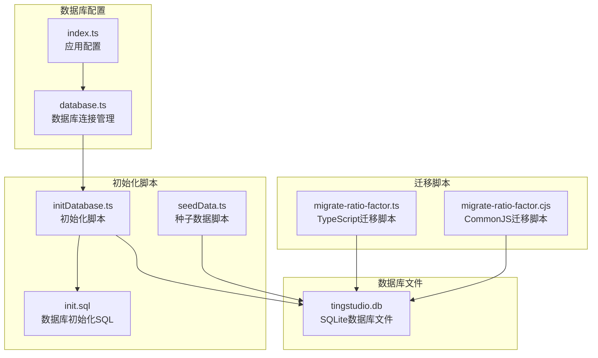
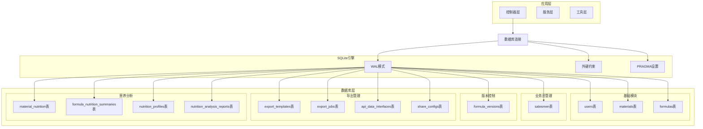
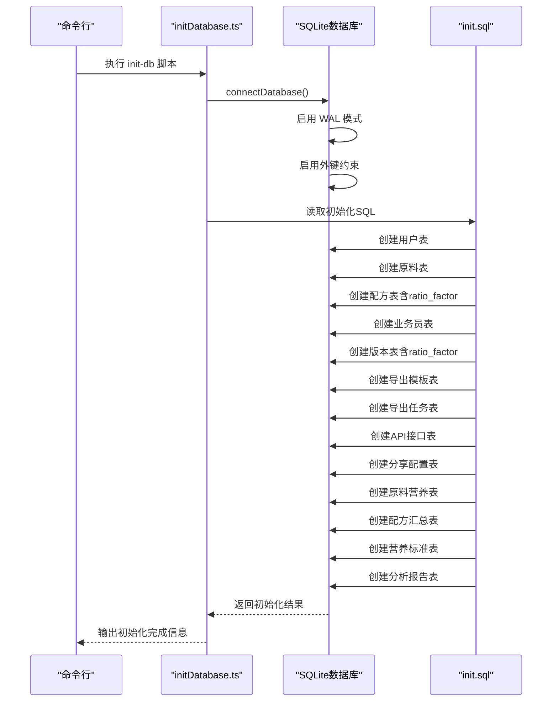
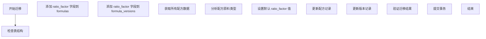
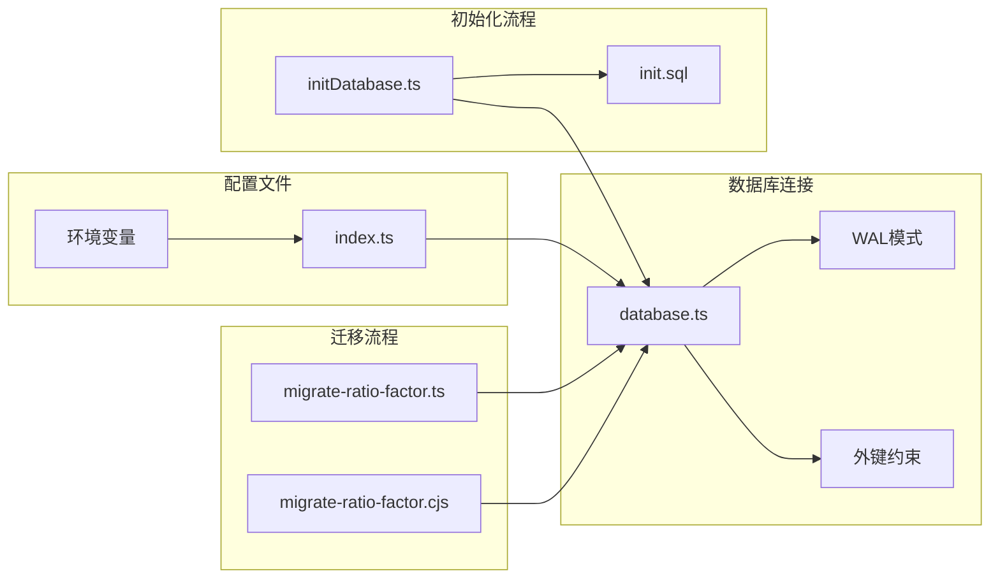

# 数据库概览

<cite>
**本文档引用的文件**
- [DATABASE_DOC.md](file://backend/DATABASE_DOC.md)
- [database.ts](file://backend/src/config/database.ts)
- [init.sql](file://backend/src/scripts/init.sql)
- [initDatabase.ts](file://backend/src/scripts/initDatabase.ts)
- [index.ts](file://backend/src/config/index.ts)
- [seedData.ts](file://backend/src/scripts/seedData.ts)
- [migrate-ratio-factor.ts](file://backend/src/scripts/migrate-ratio-factor.ts)
- [migrate-ratio-factor.cjs](file://backend/src/scripts/migrate-ratio-factor.cjs)
- [package.json](file://backend/package.json)
</cite>

## 更新摘要
**变更内容**
- 更新了配方表和版本表中 ratio_factor 字段的位置说明
- 新增了数据库迁移脚本的详细说明
- 更新了表结构文档以反映最新的字段布局
- 增强了数据库架构重构的技术细节

## 目录
1. [简介](#简介)
2. [项目结构](#项目结构)
3. [核心组件](#核心组件)
4. [架构概览](#架构概览)
5. [详细组件分析](#详细组件分析)
6. [数据库迁移](#数据库迁移)
7. [依赖关系分析](#依赖关系分析)
8. [性能考量](#性能考量)
9. [故障排除指南](#故障排除指南)
10. [结论](#结论)

## 简介

TingStudio 采用 SQLite 作为本地数据库解决方案，通过 better-sqlite3 驱动程序实现高性能的数据持久化。该数据库设计遵循模块化原则，包含 13 张核心表，覆盖配方管理、业务员管理、版本控制、导出管理、营养分析等五大功能模块。

**数据库架构重构**：本次更新反映了数据库架构的重大重构，其中最重要的变化是 ratio_factor 字段从 materials 表迁移到 formulas 和 formula_versions 表，这一变更优化了配方计算逻辑和数据一致性。

选择 SQLite 的主要优势包括：
- **零配置部署**：无需独立数据库服务器进程
- **高并发支持**：WAL 模式提供更好的并发读写性能
- **数据完整性**：外键约束确保数据一致性
- **跨平台兼容**：支持多种操作系统环境
- **开发友好**：简化开发和测试流程

## 项目结构

数据库相关文件在项目中的组织结构如下：



**图表来源**
- [database.ts:1-70](file://backend/src/config/database.ts#L1-L70)
- [init.sql:1-229](file://backend/src/scripts/init.sql#L1-L229)
- [initDatabase.ts:1-37](file://backend/src/scripts/initDatabase.ts#L1-L37)
- [migrate-ratio-factor.ts:1-149](file://backend/src/scripts/migrate-ratio-factor.ts#L1-L149)

**章节来源**
- [database.ts:1-70](file://backend/src/config/database.ts#L1-L70)
- [init.sql:1-229](file://backend/src/scripts/init.sql#L1-L229)
- [initDatabase.ts:1-37](file://backend/src/scripts/initDatabase.ts#L1-L37)
- [migrate-ratio-factor.ts:1-149](file://backend/src/scripts/migrate-ratio-factor.ts#L1-L149)

## 核心组件

### 数据库连接管理器

数据库连接管理器提供了统一的连接处理机制，包含以下关键功能：

- **自动目录创建**：确保数据目录存在
- **WAL 模式启用**：提升并发性能
- **外键约束验证**：保证数据完整性
- **事务支持**：提供原子性操作
- **查询封装**：兼容 MySQL 风格的查询接口

### 初始化系统

初始化系统包含四个核心组件：

1. **SQL 初始化脚本**：定义完整的数据库结构
2. **数据库初始化脚本**：执行 SQL 脚本并创建表结构
3. **种子数据脚本**：生成演示和测试所需的数据
4. **迁移脚本**：处理数据库结构变更和数据迁移

**章节来源**
- [database.ts:10-37](file://backend/src/config/database.ts#L10-L37)
- [initDatabase.ts:11-31](file://backend/src/scripts/initDatabase.ts#L11-L31)
- [seedData.ts:7-394](file://backend/src/scripts/seedData.ts#L7-L394)
- [migrate-ratio-factor.ts:27-146](file://backend/src/scripts/migrate-ratio-factor.ts#L27-L146)

## 架构概览

### 数据库整体架构



**图表来源**
- [DATABASE_DOC.md:9-20](file://backend/DATABASE_DOC.md#L9-L20)
- [init.sql:7-229](file://backend/src/scripts/init.sql#L7-L229)
- [database.ts:21-23](file://backend/src/config/database.ts#L21-L23)

### 数据库初始化流程



**图表来源**
- [initDatabase.ts:11-31](file://backend/src/scripts/initDatabase.ts#L11-L31)
- [init.sql:7-229](file://backend/src/scripts/init.sql#L7-L229)
- [database.ts:10-30](file://backend/src/config/database.ts#L10-L30)

## 详细组件分析

### 基础模块

#### 用户表 (users)

用户表是系统的核心认证表，支持管理员和配方师两种角色：

| 字段 | 类型 | 约束 | 说明 |
|------|------|------|------|
| id | TEXT | PRIMARY KEY | 用户唯一标识 |
| username | TEXT | NOT NULL, UNIQUE | 用户名，登录凭证 |
| password | TEXT | NOT NULL | 密码（bcrypt 哈希） |
| role | TEXT | NOT NULL, DEFAULT 'formulist' | 角色：admin/formulist |
| created_at | TEXT | NOT NULL | 创建时间（ISO 8601） |
| updated_at | TEXT | NOT NULL | 更新时间（ISO 8601） |

**业务含义**：
- `admin`：系统管理员，拥有所有权限
- `formulist`：配方师，负责配方创建和营养分析

#### 原料表 (materials)

**更新**：ratio_factor 字段已从该表移除，现在由配方表管理

原料表存储配方所需的原料信息：

| 字段 | 类型 | 约束 | 说明 |
|------|------|------|------|
| id | TEXT | PRIMARY KEY | 原料唯一标识 |
| name | TEXT | NOT NULL | 原料名称 |
| code | TEXT | NOT NULL, UNIQUE | 原料编码（如 MAT001） |
| unit | TEXT | NOT NULL, DEFAULT 'g' | 计量单位 |
| stock | REAL | NOT NULL, DEFAULT 0 | 库存数量 |
| material_type | TEXT | NOT NULL, DEFAULT 'herb' | 原料类型：herb/supplement |
| created_by | TEXT | NOT NULL | 创建人（用户 ID） |
| created_at | TEXT | NOT NULL | 创建时间 |
| updated_at | TEXT | NOT NULL | 更新时间 |

**索引**：
- `idx_material_name`：按原料名称
- `idx_material_code`：按原料编码

#### 配方表 (formulas)

**更新**：新增 ratio_factor 字段，用于配方计算

配方表存储配方基本信息，原料列表以 JSON 格式存储：

| 字段 | 类型 | 约束 | 说明 |
|------|------|------|------|
| id | TEXT | PRIMARY KEY | 配方唯一标识 |
| name | TEXT | NOT NULL | 配方名称 |
| salesman_id | TEXT | NOT NULL, FK → salesmen.id | 所属业务员 |
| salesman_name | TEXT | NOT NULL | 业务员名称（冗余） |
| materials_json | TEXT | NOT NULL | 原料列表 JSON |
| finished_weight | REAL | NOT NULL, DEFAULT 0 | 成品重量 |
| ratio_factor | REAL | NOT NULL, DEFAULT 0.18 | 含量比系数（默认 0.18） |
| description | TEXT | NULL | 配方描述 |
| created_by | TEXT | NOT NULL | 创建人（用户 ID） |
| created_at | TEXT | NOT NULL | 创建时间 |
| updated_at | TEXT | NOT NULL | 更新时间 |

**外键**：`salesman_id` → `salesmen(id)` ON DELETE RESTRICT

**索引**：
- `idx_formula_name`：按配方名称
- `idx_formula_salesman_id`：按业务员 ID
- `idx_formula_created_by`：按创建人

**`materials_json` 结构**：
```json
[
  { "materialId": "xxx", "materialName": "白砂糖", "quantity": 200 },
  { "materialId": "yyy", "materialName": "全脂奶粉", "quantity": 300 }
]
```

**章节来源**
- [DATABASE_DOC.md:25-95](file://backend/DATABASE_DOC.md#L25-L95)
- [init.sql:32-49](file://backend/src/scripts/init.sql#L32-L49)

### 业务员管理模块

#### 业务员表 (salesmen)

业务员表存储业务员基本信息：

| 字段 | 类型 | 约束 | 说明 |
|------|------|------|------|
| id | TEXT | PRIMARY KEY | 业务员唯一标识 |
| name | TEXT | NOT NULL | 姓名 |
| code | TEXT | NOT NULL, UNIQUE | 工号（如 SM001） |
| department | TEXT | NULL | 所属部门 |
| phone | TEXT | NULL | 联系电话 |
| email | TEXT | NULL | 邮箱 |
| status | TEXT | NOT NULL, DEFAULT 'active' | 状态：active/inactive |
| created_by | TEXT | NOT NULL | 创建人 |
| created_at | TEXT | NOT NULL | 创建时间 |
| updated_at | TEXT | NOT NULL | 更新时间 |

**索引**：
- `idx_salesman_name`：按姓名
- `idx_salesman_code`：按工号
- `idx_salesman_status`：按状态

**章节来源**
- [DATABASE_DOC.md:98-119](file://backend/DATABASE_DOC.md#L98-L119)
- [init.sql:55-70](file://backend/src/scripts/init.sql#L55-L70)

### 版本控制模块

#### 配方版本表 (formula_versions)

**更新**：新增 ratio_factor 字段，用于版本级别的配方计算

配方版本表存储配方的版本快照和变更记录：

| 字段 | 类型 | 约束 | 说明 |
|------|------|------|------|
| version_id | TEXT | PRIMARY KEY | 版本 ID |
| formula_id | TEXT | NOT NULL, FK → formulas.id | 配方 ID |
| version_number | TEXT | NOT NULL | 版本号（如 v1.0） |
| version_name | TEXT | NULL | 版本名称 |
| changes_json | TEXT | NULL | 变更记录 JSON |
| snapshot_json | TEXT | NOT NULL | 完整配方快照 JSON |
| status | TEXT | NOT NULL, DEFAULT 'draft' | 状态：draft/published/archived |
| is_current | INTEGER | NOT NULL, DEFAULT 0 | 是否为当前版本（1/0） |
| ratio_factor | REAL | NOT NULL, DEFAULT 0.18 | 含量比系数（默认 0.18） |
| created_by | TEXT | NOT NULL | 创建人 |
| created_at | TEXT | NOT NULL | 创建时间 |

**外键**：`formula_id` → `formulas(id)` ON DELETE CASCADE

**索引**：
- `idx_fv_formula`：按配方
- `idx_fv_version_number`：按配方+版本号（复合）

**`snapshot_json` 结构**：
```json
{
  "name": "婴儿配方奶粉1段",
  "salesmanId": "xxx",
  "salesmanName": "张明",
  "materials": [...],
  "description": "...",
  "formulaData": { ... }
}
```

**`changes_json` 结构**：
```json
[
  {
    "field": "materials",
    "fieldLabel": "原料: 白砂糖",
    "oldValue": 200,
    "newValue": 180,
    "changeType": "modify"
  }
]
```

**章节来源**
- [DATABASE_DOC.md:125-169](file://backend/DATABASE_DOC.md#L125-L169)
- [init.sql:76-92](file://backend/src/scripts/init.sql#L76-L92)

### 导出管理模块

#### 导出模板表 (export_templates)

导出模板表存储配方导出的模板配置：

| 字段 | 类型 | 约束 | 说明 |
|------|------|------|------|
| template_id | TEXT | PRIMARY KEY | 模板 ID |
| name | TEXT | NOT NULL | 模板名称 |
| description | TEXT | NULL | 描述 |
| type | TEXT | NOT NULL | 类型：pdf/excel/api/print |
| format_config_json | TEXT | NOT NULL | 格式配置 JSON |
| is_default | INTEGER | NOT NULL, DEFAULT 0 | 是否为默认模板 |
| created_by | TEXT | NOT NULL | 创建人 |
| created_at | TEXT | NOT NULL | 创建时间 |

**索引**：`idx_et_type`：按类型

#### 导出任务表 (export_jobs)

导出任务表存储配方导出的任务记录：

| 字段 | 类型 | 约束 | 说明 |
|------|------|------|------|
| job_id | TEXT | PRIMARY KEY | 任务 ID |
| formula_id | TEXT | NOT NULL, FK → formulas.id | 配方 ID |
| version_id | TEXT | NULL | 版本 ID |
| template_id | TEXT | NULL | 模板 ID |
| export_type | TEXT | NOT NULL | 导出类型：pdf/excel/api |
| status | TEXT | NOT NULL, DEFAULT 'pending' | 状态：pending/processing/completed/failed |
| file_url | TEXT | NULL | 文件路径 |
| file_name | TEXT | NULL | 文件名 |
| api_endpoint | TEXT | NULL | API 推送端点 |
| progress | INTEGER | NOT NULL, DEFAULT 0 | 进度百分比（0-100） |
| error_message | TEXT | NULL | 错误信息 |
| created_by | TEXT | NOT NULL | 创建人 |
| created_at | TEXT | NOT NULL | 创建时间 |
| completed_at | TEXT | NULL | 完成时间 |

**外键**：`formula_id` → `formulas(id)` ON DELETE CASCADE

**索引**：
- `idx_ej_formula`：按配方
- `idx_ej_status`：按状态

**章节来源**
- [DATABASE_DOC.md:175-217](file://backend/DATABASE_DOC.md#L175-L217)
- [init.sql:98-130](file://backend/src/scripts/init.sql#L98-L130)

### 营养分析模块

#### 原料营养成分表 (material_nutrition)

原料营养成分表存储每种原料的营养成分数据（每100g含量）：

| 字段 | 类型 | 约束 | 说明 |
|------|------|------|------|
| nutrition_id | TEXT | PRIMARY KEY | 营养记录 ID |
| material_id | TEXT | NOT NULL, UNIQUE, FK → materials.id | 原料 ID（一对一） |
| per_100g_json | TEXT | NOT NULL | 每100g营养成分 JSON |
| data_version | TEXT | NOT NULL, DEFAULT '1.0' | 数据版本号 |
| data_source | TEXT | NULL | 数据来源 |
| notes | TEXT | NULL | 备注 |
| last_updated | TEXT | NOT NULL | 最后更新时间 |

**外键**：`material_id` → `materials(id)` ON DELETE CASCADE

#### 配方营养汇总表 (formula_nutrition_summaries)

配方营养汇总表存储配方的营养成分计算结果：

| 字段 | 类型 | 约束 | 说明 |
|------|------|------|------|
| summary_id | TEXT | PRIMARY KEY | 汇总 ID |
| formula_id | TEXT | NOT NULL, FK → formulas.id | 配方 ID |
| version_id | TEXT | NULL | 版本 ID |
| total_weight | REAL | NOT NULL, DEFAULT 0 | 配方总重量 |
| total_nutrition_json | TEXT | NOT NULL | 总营养成分 JSON |
| per_100g_nutrition_json | TEXT | NOT NULL | 每100g营养 JSON |
| material_breakdown_json | TEXT | NULL | 各原料贡献明细 JSON |
| calculated_by | TEXT | NOT NULL | 计算人 |
| calculated_at | TEXT | NOT NULL | 计算时间 |

**外键**：`formula_id` → `formulas(id)` ON DELETE CASCADE

**唯一约束**：`uk_fns_version`：`UNIQUE(version_id)`（一个版本只能有一个汇总）

**索引**：`idx_fns_formula`：按配方

**章节来源**
- [DATABASE_DOC.md:273-342](file://backend/DATABASE_DOC.md#L273-L342)
- [init.sql:173-199](file://backend/src/scripts/init.sql#L173-L199)

## 数据库迁移

### ratio_factor 字段迁移

**更新**：这是本次数据库架构重构的核心变更

ratio_factor 字段从 materials 表迁移到 formulas 和 formula_versions 表，这一变更优化了配方计算逻辑：

#### 迁移策略

1. **字段添加**：为 formulas 和 formula_versions 表添加 ratio_factor 字段
2. **数据迁移**：根据配方中的原料类型设置合适的 ratio_factor 值
3. **默认值设定**：辅料使用 1.0，药材使用 0.18
4. **版本同步**：同时更新配方的所有版本记录

#### 迁移脚本功能

迁移脚本提供了完整的自动化迁移流程：



**图表来源**
- [migrate-ratio-factor.ts:27-146](file://backend/src/scripts/migrate-ratio-factor.ts#L27-L146)

#### 迁移逻辑

- **辅料检测**：如果配方包含 supplement 类型原料，使用 ratio_factor = 1.0
- **药材默认**：如果配方只包含 herb 类型原料，使用 ratio_factor = 0.18
- **数据一致性**：确保配方与其所有版本保持相同的 ratio_factor 值

**章节来源**
- [migrate-ratio-factor.ts:1-149](file://backend/src/scripts/migrate-ratio-factor.ts#L1-L149)
- [migrate-ratio-factor.cjs:1-145](file://backend/src/scripts/migrate-ratio-factor.cjs#L1-L145)

## 依赖关系分析

### 数据库配置依赖



**图表来源**
- [index.ts:6-8](file://backend/src/config/index.ts#L6-L8)
- [database.ts:10-30](file://backend/src/config/database.ts#L10-L30)
- [initDatabase.ts:14-23](file://backend/src/scripts/initDatabase.ts#L14-L23)
- [migrate-ratio-factor.ts:5-13](file://backend/src/scripts/migrate-ratio-factor.ts#L5-L13)

### 数据模型关系图

```mermaid
erDiagram
USERS {
text id PK
text username UK
text password
text role
text created_at
text updated_at
}
MATERIALS {
text id PK
text name
text code UK
text unit
real stock
text material_type
text created_by FK
text created_at
text updated_at
}
FORMULAS {
text id PK
text name
text salesman_id FK
text salesman_name
text materials_json
real finished_weight
real ratio_factor
text description
text created_by FK
text created_at
text updated_at
}
SALES_MEN {
text id PK
text name
text code UK
text department
text phone
text email
text status
text created_by FK
text created_at
text updated_at
}
FORMULA_VERSIONS {
text version_id PK
text formula_id FK
text version_number
text version_name
text changes_json
text snapshot_json
text status
integer is_current
real ratio_factor
text created_by FK
text created_at
}
EXPORT_TEMPLATES {
text template_id PK
text name
text description
text type
text format_config_json
integer is_default
text created_by FK
text created_at
}
EXPORT_JOBS {
text job_id PK
text formula_id FK
text version_id
text template_id
text export_type
text status
text file_url
text file_name
text api_endpoint
integer progress
text error_message
text created_by FK
text created_at
text completed_at
}
API_DATA_INTERFACES {
text interface_id PK
text name
text description
text endpoint UK
text method
text authentication
text auth_config_json
text data_format
text field_mapping_json
text rate_limit_json
text retry_config_json
text created_by FK
text created_at
text updated_at
}
SHARE_CONFIGS {
text share_id PK
text formula_id FK
text version_id
text share_type
text share_url
text password
text expire_date
text allowed_emails_json
integer download_limit
integer download_count
text created_by FK
text created_at
}
MATERIAL_NUTRITION {
text nutrition_id PK
text material_id UK FK
text per_100g_json
text data_version
text data_source
text notes
text last_updated
}
FORMULA_NUTRITION_SUMMARIES {
text summary_id PK
text formula_id FK
text version_id UK
real total_weight
text total_nutrition_json
text per_100g_nutrition_json
text material_breakdown_json
text calculated_by FK
text calculated_at
}
NUTRITION_PROFILES {
text profile_id PK
text name
text description
text category
text target_values_json
text tolerance_ranges_json
text mandatory_fields_json
text created_at
text updated_at
}
NUTRITION_ANALYSIS_REPORTS {
text report_id PK
text formula_id FK
text version_id
text summary_id FK
text compliance_check_json
text recommendations_json
text generated_by FK
text generated_at
}
USERS ||--o{ MATERIALS : creates
USERS ||--o{ FORMULAS : creates
USERS ||--o{ SALES_MEN : creates
USERS ||--o{ FORMULA_VERSIONS : creates
USERS ||--o{ EXPORT_TEMPLATES : creates
USERS ||--o{ EXPORT_JOBS : creates
USERS ||--o{ API_DATA_INTERFACES : creates
USERS ||--o{ SHARE_CONFIGS : creates
USERS ||--o{ FORMULA_NUTRITION_SUMMARIES : calculates
MATERIALS ||--|| MATERIAL_NUTRITION : has_one
SALES_MEN ||--o{ FORMULAS : manages
FORMULAS ||--o{ FORMULA_VERSIONS : has_many
FORMULAS ||--o{ EXPORT_JOBS : exported_in
FORMULAS ||--o{ FORMULA_NUTRITION_SUMMARIES : calculated_from
FORMULAS ||--o{ SHARE_CONFIGS : shared_by
FORMULAS ||--o{ NUTRITION_ANALYSIS_REPORTS : reported_in
FORMULA_VERSIONS ||--|| FORMULA_NUTRITION_SUMMARIES : generates
FORMULA_NUTRITION_SUMMARIES ||--o{ NUTRITION_ANALYSIS_REPORTS : produces
```

**图表来源**
- [DATABASE_DOC.md:393-427](file://backend/DATABASE_DOC.md#L393-L427)
- [init.sql:7-229](file://backend/src/scripts/init.sql#L7-L229)

**章节来源**
- [DATABASE_DOC.md:393-427](file://backend/DATABASE_DOC.md#L393-L427)
- [init.sql:7-229](file://backend/src/scripts/init.sql#L7-L229)

## 性能考量

### WAL 模式的性能优势

SQLite 的 Write-Ahead Logging (WAL) 模式相比传统预写日志 (WAL) 提供了显著的性能提升：

- **并发读取优化**：多个读取操作可以同时进行，无需互斥锁
- **写入性能提升**：写入操作不会阻塞读取操作
- **崩溃恢复**：提供更好的崩溃恢复能力
- **磁盘空间**：可能需要更多的磁盘空间

### 外键约束的最佳实践

启用外键约束虽然增加了数据完整性保障，但也需要注意：

- **性能影响**：外键检查会增加写入操作的开销
- **事务处理**：在事务中批量操作时，外键检查会在事务结束时进行
- **级联删除**：谨慎使用级联删除，避免意外的数据级联删除

### 索引策略

合理的索引设计对查询性能至关重要：

- **常用查询字段**：为经常用于 WHERE 条件的字段建立索引
- **复合索引**：对于多字段组合查询，考虑使用复合索引
- **索引维护**：定期分析数据库统计信息，优化索引使用

### ratio_factor 字段的性能影响

**更新**：ratio_factor 字段的重新定位对性能有积极影响：

- **计算效率**：字段位于配方级别，避免了每次查询时的额外关联
- **数据一致性**：版本表中的 ratio_factor 确保历史版本的计算准确性
- **查询优化**：减少了跨表查询的需求，提升了配方计算的性能

## 故障排除指南

### 常见问题及解决方案

#### 数据库连接失败

**症状**：启动应用时报数据库连接错误

**可能原因**：
- 数据库文件权限不足
- 数据库路径不存在
- 数据库文件被其他进程占用

**解决步骤**：
1. 检查数据库文件路径配置
2. 确认数据目录具有适当的读写权限
3. 关闭可能占用数据库文件的其他进程
4. 重启应用服务

#### 外键约束冲突

**症状**：执行删除或更新操作时出现外键约束错误

**可能原因**：
- 尝试删除仍有子记录的父记录
- 尝试更新引用不存在的外键值

**解决方法**：
1. 检查相关表之间的数据关系
2. 先删除或更新子记录，再处理父记录
3. 使用级联操作时要谨慎

#### 初始化脚本执行失败

**症状**：执行数据库初始化时出现 SQL 错误

**可能原因**：
- SQL 语法错误
- 表结构定义冲突
- 数据库版本不兼容

**解决步骤**：
1. 检查 SQL 脚本的语法正确性
2. 确认数据库版本支持所有语法特性
3. 清理现有数据库结构后重新初始化

#### ratio_factor 迁移失败

**症状**：执行 ratio_factor 字段迁移时出现错误

**可能原因**：
- 数据库连接问题
- 权限不足
- 现有数据格式不兼容

**解决步骤**：
1. 确认数据库连接正常
2. 检查迁移脚本的执行权限
3. 验证现有数据格式
4. 手动执行迁移脚本进行修复

**章节来源**
- [database.ts:26-29](file://backend/src/config/database.ts#L26-L29)
- [initDatabase.ts:25-27](file://backend/src/scripts/initDatabase.ts#L25-L27)
- [migrate-ratio-factor.ts:135-140](file://backend/src/scripts/migrate-ratio-factor.ts#L135-L140)

## 结论

TingStudio 的数据库设计体现了现代应用开发的最佳实践：

### 设计优势

1. **模块化架构**：13 张表清晰的功能划分，便于维护和扩展
2. **数据完整性**：通过外键约束和数据验证确保数据一致性
3. **性能优化**：WAL 模式提供良好的并发性能
4. **开发友好**：零配置部署，简化开发和测试流程
5. **可扩展性**：合理的表结构设计支持未来的功能扩展
6. **架构重构**：ratio_factor 字段的重新定位优化了配方计算逻辑

### 技术特色

- **SQLite + better-sqlite3**：结合了 SQLite 的易用性和 better-sqlite3 的高性能
- **JSON 字段支持**：灵活的数据存储方式，适应复杂的业务需求
- **种子数据系统**：完善的测试和演示数据支持
- **事务支持**：确保数据操作的原子性和一致性
- **自动化迁移**：提供完整的数据库结构变更管理

### 发展建议

1. **监控指标**：添加数据库性能监控和慢查询分析
2. **备份策略**：建立定期备份和恢复机制
3. **迁移工具**：开发数据库结构变更的自动化工具
4. **文档完善**：持续更新数据库设计文档和技术规范
5. **性能优化**：针对 ratio_factor 字段的使用模式进行进一步优化

这次数据库架构重构为 TingStudio 提供了更加合理和高效的数据库设计方案，支持从个人使用到中小规模团队协作的各种应用场景。新的设计不仅提升了性能，还增强了数据的一致性和可维护性。