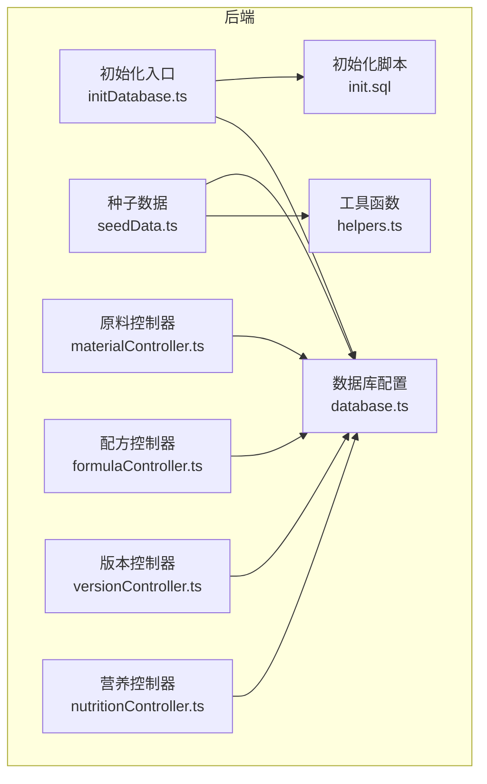
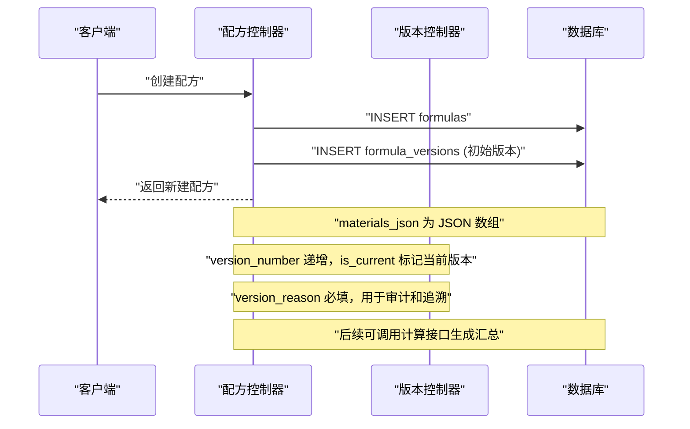
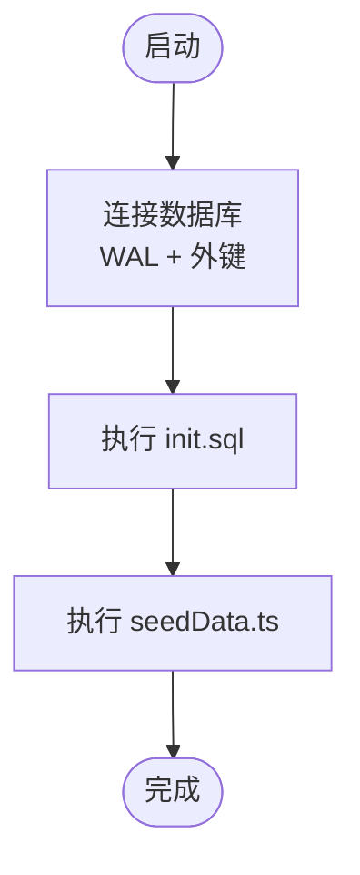
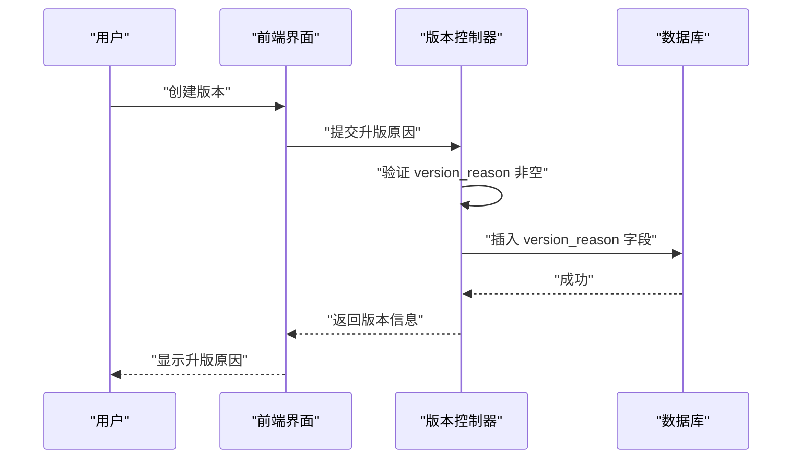

# 数据库设计

<cite>
**本文档引用的文件**
- [DATABASE_DOC.md](file://backend/DATABASE_DOC.md)
- [init.sql](file://backend/src/scripts/init.sql)
- [initDatabase.ts](file://backend/src/scripts/initDatabase.ts)
- [seedData.ts](file://backend/src/scripts/seedData.ts)
- [database.ts](file://backend/src/config/database.ts)
- [helpers.ts](file://backend/src/utils/helpers.ts)
- [materialController.ts](file://backend/src/controllers/materialController.ts)
- [formulaController.ts](file://backend/src/controllers/formulaController.ts)
- [versionController.ts](file://backend/src/controllers/versionController.ts)
- [nutritionController.ts](file://backend/src/controllers/nutritionController.ts)
- [version.ts](file://frontend/src/api/version.ts)
- [versionList.vue](file://frontend/src/views/versions/VersionList.vue)
- [versionCompare.vue](file://frontend/src/views/versions/VersionCompare.vue)
</cite>

## 目录
1. [简介](#简介)
2. [项目结构](#项目结构)
3. [核心组件](#核心组件)
4. [架构总览](#架构总览)
5. [详细组件分析](#详细组件分析)
6. [依赖关系分析](#依赖关系分析)
7. [性能考虑](#性能考虑)
8. [故障排查指南](#故障排查指南)
9. [结论](#结论)
10. [附录](#附录)

## 简介
本文件基于 TingStudio 项目的数据库设计文档与初始化脚本，系统化梳理了数据库整体架构、13 张核心表的结构与关系、约束与索引设计、数据模型原理、初始化流程、种子数据与迁移策略，并提供查询优化与性能调优建议，辅以 ER 图与表结构图帮助开发者快速理解数据模型。

## 项目结构
数据库位于后端目录，采用 SQLite（better-sqlite3）作为存储引擎，通过初始化脚本创建表结构，配合种子数据脚本批量填充测试数据；应用层通过统一的数据库连接管理模块进行访问。



图表来源
- [database.ts:1-70](file://backend/src/config/database.ts#L1-L70)
- [initDatabase.ts:1-37](file://backend/src/scripts/initDatabase.ts#L1-L37)
- [init.sql:1-232](file://backend/src/scripts/init.sql#L1-L232)
- [seedData.ts:1-400](file://backend/src/scripts/seedData.ts#L1-L400)
- [helpers.ts:1-86](file://backend/src/utils/helpers.ts#L1-L86)
- [materialController.ts:1-129](file://backend/src/controllers/materialController.ts#L1-L129)
- [formulaController.ts:1-379](file://backend/src/controllers/formulaController.ts#L1-L379)
- [versionController.ts:1-373](file://backend/src/controllers/versionController.ts#L1-L373)
- [nutritionController.ts:1-538](file://backend/src/controllers/nutritionController.ts#L1-L538)

章节来源
- [database.ts:1-70](file://backend/src/config/database.ts#L1-L70)
- [initDatabase.ts:1-37](file://backend/src/scripts/initDatabase.ts#L1-L37)
- [init.sql:1-232](file://backend/src/scripts/init.sql#L1-L232)
- [seedData.ts:1-400](file://backend/src/scripts/seedData.ts#L1-L400)

## 核心组件
- 存储引擎与连接管理：SQLite（WAL 模式），启用外键约束，提供统一查询与事务封装。
- 初始化脚本：一次性创建 13 张表及索引。
- 种子数据：批量插入用户、原料、业务员、配方、版本、导出模板、导出任务、营养标准、原料营养等数据。
- 控制器：围绕表结构进行 CRUD 与业务逻辑实现，涉及 JSON 字段解析与版本变更追踪。

章节来源
- [database.ts:1-70](file://backend/src/config/database.ts#L1-L70)
- [init.sql:1-232](file://backend/src/scripts/init.sql#L1-L232)
- [seedData.ts:1-400](file://backend/src/scripts/seedData.ts#L1-L400)
- [materialController.ts:1-129](file://backend/src/controllers/materialController.ts#L1-L129)
- [formulaController.ts:1-379](file://backend/src/controllers/formulaController.ts#L1-L379)
- [versionController.ts:1-373](file://backend/src/controllers/versionController.ts#L1-L373)
- [nutritionController.ts:1-538](file://backend/src/controllers/nutritionController.ts#L1-L538)

## 架构总览
数据库采用"功能域划分"的表组织方式，围绕配方研发与营养分析形成闭环：基础模块（用户、原料、配方）、业务员管理、版本控制、导出管理、营养分析。

```mermaid
erDiagram
USERS {
text id PK
text username UK
text password
text role
text created_at
text updated_at
}
MATERIALS {
text id PK
text name
text code UK
text unit
real stock
text material_type
text created_by
text created_at
text updated_at
}
SALES_MEN {
text id PK
text name
text code UK
text department
text phone
text email
text status
text created_by
text created_at
text updated_at
}
FORMULAS {
text id PK
text name
text salesman_id FK
text salesman_name
text materials_json
real finished_weight
real ratio_factor
real supplement_ratio_factor
text description
text created_by
text created_at
text updated_at
}
FORMULA_VERSIONS {
text version_id PK
text formula_id FK
text version_number
text version_name
text version_reason
text changes_json
text snapshot_json
text status
integer is_current
real ratio_factor
real supplement_ratio_factor
text created_by
text created_at
}
EXPORT_TEMPLATES {
text template_id PK
text name
text description
text type
text format_config_json
integer is_default
text created_by
text created_at
}
EXPORT_JOBS {
text job_id PK
text formula_id FK
text version_id
text template_id
text export_type
text status
text file_url
text file_name
text api_endpoint
integer progress
text error_message
text created_by
text created_at
text completed_at
}
API_DATA_INTERFACES {
text interface_id PK
text name
text description
text endpoint UK
text method
text authentication
text auth_config_json
text data_format
text field_mapping_json
text rate_limit_json
text retry_config_json
text created_by
text created_at
text updated_at
}
SHARE_CONFIGS {
text share_id PK
text formula_id FK
text version_id
text share_type
text share_url
text password
text expire_date
text allowed_emails_json
integer download_limit
integer download_count
text created_by
text created_at
}
MATERIAL_NUTRITION {
text nutrition_id PK
text material_id FK UK
text per_100g_json
text data_version
text data_source
text notes
text last_updated
}
FORMULA_NUTRITION_SUMMARIES {
text summary_id PK
text formula_id FK
text version_id UK
real total_weight
text total_nutrition_json
text per_100g_nutrition_json
text material_breakdown_json
text calculated_by
text calculated_at
}
NUTRITION_PROFILES {
text profile_id PK
text name
text description
text category
text target_values_json
text tolerance_ranges_json
text mandatory_fields_json
text created_at
text updated_at
}
NUTRITION_ANALYSIS_REPORTS {
text report_id PK
text formula_id FK
text version_id
text summary_id FK
text compliance_check_json
text recommendations_json
text generated_by
text generated_at
}
USERS ||--o{ MATERIALS : "创建"
USERS ||--o{ FORMULAS : "创建"
USERS ||--o{ SALES_MEN : "创建"
USERS ||--o{ FORMULA_VERSIONS : "创建"
USERS ||--o{ EXPORT_TEMPLATES : "创建"
USERS ||--o{ EXPORT_JOBS : "创建"
USERS ||--o{ API_DATA_INTERFACES : "创建"
USERS ||--o{ SHARE_CONFIGS : "创建"
USERS ||--o{ FORMULA_NUTRITION_SUMMARIES : "计算"
USERS ||--o{ NUTRITION_ANALYSIS_REPORTS : "生成"
MATERIALS ||--|| MATERIAL_NUTRITION : "一对一"
SALES_MEN ||--o{ FORMULAS : "拥有"
FORMULAS ||--o{ FORMULA_VERSIONS : "版本"
FORMULAS ||--o{ EXPORT_JOBS : "导出"
FORMULAS ||--o{ FORMULA_NUTRITION_SUMMARIES : "汇总"
FORMULAS ||--o{ SHARE_CONFIGS : "分享"
FORMULAS ||--o{ NUTRITION_ANALYSIS_REPORTS : "报告"
FORMULA_VERSIONS ||--|| FORMULA_NUTRITION_SUMMARIES : "一对一(版本)"
FORMULA_NUTRITION_SUMMARIES ||--o{ NUTRITION_ANALYSIS_REPORTS : "报告"
```

图表来源
- [init.sql:1-232](file://backend/src/scripts/init.sql#L1-L232)
- [DATABASE_DOC.md:23-424](file://backend/DATABASE_DOC.md#L23-L424)

## 详细组件分析

### 基础模块

#### 用户表 users
- 主键：id（TEXT，PRIMARY KEY）
- 约束：username 唯一（UNIQUE），role 默认值与枚举校验，created_at/updated_at 默认当前时间
- 业务含义：admin 拥有全部权限，formulist 仅能创建/编辑自身数据
- 索引：无（按需查询）

章节来源
- [init.sql:7-15](file://backend/src/scripts/init.sql#L7-L15)
- [DATABASE_DOC.md:25-41](file://backend/DATABASE_DOC.md#L25-L41)

#### 原料表 materials
- 主键：id（TEXT，PRIMARY KEY）
- 约束：name、code 唯一（UNIQUE），unit 默认 g，stock 默认 0，material_type 默认 herb
- 索引：idx_material_name、idx_material_code
- JSON 字段：无（原料基础属性）

章节来源
- [init.sql:17-30](file://backend/src/scripts/init.sql#L17-L30)
- [DATABASE_DOC.md:44-62](file://backend/DATABASE_DOC.md#L44-L62)

#### 配方表 formulas
- 主键：id（TEXT，PRIMARY KEY）
- 外键：salesman_id → salesmen(id)（ON DELETE RESTRICT）
- 约束：materials_json 为 JSON，finished_weight/ratio_factor/supplement_ratio_factor 默认值，created_by 引用 users
- 索引：idx_formula_name、idx_formula_salesman_id、idx_formula_created_by
- JSON 结构：materials_json 数组，元素包含 materialId、materialName、quantity 等

章节来源
- [init.sql:32-50](file://backend/src/scripts/init.sql#L32-L50)
- [DATABASE_DOC.md:65-95](file://backend/DATABASE_DOC.md#L65-L95)
- [formulaController.ts:68-109](file://backend/src/controllers/formulaController.ts#L68-L109)

### 业务员管理
- 表：salesmen
- 约束：code 唯一（UNIQUE），status 枚举（active/inactive）
- 索引：idx_salesman_name、idx_salesman_code、idx_salesman_status

章节来源
- [init.sql:56-71](file://backend/src/scripts/init.sql#L56-L71)
- [DATABASE_DOC.md:98-119](file://backend/DATABASE_DOC.md#L98-L119)

### 版本控制
- 表：formula_versions
- 外键：formula_id → formulas(id)（ON DELETE CASCADE）
- 约束：status 枚举（draft/published/archived），is_current 0/1，version_number 唯一性（与 formula_id 组合索引），ratio_factor/supplement_ratio_factor 默认值
- 索引：idx_fv_formula、idx_fv_version_number
- JSON 结构：changes_json（变更记录）、snapshot_json（完整配方快照）
- **新增字段**：version_reason（TEXT，DEFAULT NULL）用于记录版本变更原因，支持审计和追溯功能

**更新** 新增 version_reason 字段，用于跟踪配方版本变更的原因，提供更好的审计和追溯功能。该字段在创建版本时必填，为空时会触发验证错误。

章节来源
- [init.sql:77-95](file://backend/src/scripts/init.sql#L77-L95)
- [DATABASE_DOC.md:122-169](file://backend/DATABASE_DOC.md#L122-L169)
- [formulaController.ts:212-240](file://backend/src/controllers/formulaController.ts#L212-L240)
- [versionController.ts:93-150](file://backend/src/controllers/versionController.ts#L93-L150)

### 导出管理
- 导出模板表 export_templates
  - 约束：type 枚举（pdf/excel/api/print），is_default 默认 0
  - 索引：idx_et_type
- 导出任务表 export_jobs
  - 外键：formula_id → formulas(id)（ON DELETE CASCADE），version_id 可空
  - 约束：status 枚举（pending/processing/completed/failed），progress 默认 0
  - 索引：idx_ej_formula、idx_ej_status
- API 数据接口表 api_data_interfaces
  - 约束：endpoint 唯一（UNIQUE），method、authentication、data_format 枚举
  - 索引：idx_adi_endpoint
- 分享配置表 share_configs
  - 外键：formula_id → formulas(id)（ON DELETE CASCADE）
  - 索引：idx_sc_formula

章节来源
- [init.sql:101-170](file://backend/src/scripts/init.sql#L101-L170)
- [DATABASE_DOC.md:172-267](file://backend/DATABASE_DOC.md#L172-L267)

### 营养分析
- 原料营养成分表 material_nutrition
  - 外键：material_id → materials(id)（ON DELETE CASCADE），material_id 唯一（UNIQUE）
  - JSON 结构：per_100g_json（每 100g 营养成分）
- 配方营养汇总表 formula_nutrition_summaries
  - 外键：formula_id → formulas(id)（ON DELETE CASCADE）
  - 约束：version_id 唯一（uk_fns_version），total_weight 默认 0
  - 索引：idx_fns_formula
- 营养标准/档案表 nutrition_profiles
  - 约束：category 枚举（infant/child/adult/elderly/pregnant/special）
  - 索引：idx_np_category
- 营养分析报告表 nutrition_analysis_reports
  - 外键：formula_id → formulas(id)（ON DELETE CASCADE），summary_id → formula_nutrition_summaries(summary_id)（ON DELETE CASCADE）
  - 索引：idx_nar_formula

章节来源
- [init.sql:175-232](file://backend/src/scripts/init.sql#L175-L232)
- [DATABASE_DOC.md:270-387](file://backend/DATABASE_DOC.md#L270-L387)
- [nutritionController.ts:123-225](file://backend/src/controllers/nutritionController.ts#L123-L225)

## 依赖关系分析
- 外键链路
  - users → 所有业务表（created_by 引用）
  - materials → material_nutrition（一对一）
  - salesmen → formulas（N:1）
  - formulas → formula_versions（1:N）
  - formulas → export_jobs（1:N）
  - formulas → formula_nutrition_summaries（1:N）
  - formulas → share_configs（1:N）
  - formulas → nutrition_analysis_reports（1:N）
  - formula_versions → formula_nutrition_summaries（一对一，version_id 唯一）
  - formula_nutrition_summaries → nutrition_analysis_reports（1:N）
- 索引覆盖
  - 名称/编码/状态/类型等高频过滤字段建立索引，提升查询效率
- JSON 字段
  - materials_json、各种 *_json 字段在 SQLite 中以 TEXT 存储，应用层负责序列化/反序列化



图表来源
- [formulaController.ts:68-109](file://backend/src/controllers/formulaController.ts#L68-L109)
- [versionController.ts:93-150](file://backend/src/controllers/versionController.ts#L93-L150)
- [init.sql:77-95](file://backend/src/scripts/init.sql#L77-L95)

章节来源
- [init.sql:1-232](file://backend/src/scripts/init.sql#L1-L232)
- [formulaController.ts:1-379](file://backend/src/controllers/formulaController.ts#L1-L379)
- [versionController.ts:1-373](file://backend/src/controllers/versionController.ts#L1-L373)
- [nutritionController.ts:1-538](file://backend/src/controllers/nutritionController.ts#L1-L538)

## 性能考虑
- 存储与事务
  - WAL 模式提升并发写入性能；外键约束确保参照完整性
- 索引策略
  - 为高频过滤字段建立索引（名称、编码、状态、类型、创建人、版本号等）
  - 复合索引用于组合查询（如版本号+配方）
- JSON 查询
  - SQLite 使用 LIKE 模糊匹配 JSON 文本（如配方中的原料引用），建议：
    - 在高并发场景下避免频繁扫描 JSON 文本
    - 可考虑将关键 JSON 字段拆分为规范化表（如配方-原料明细表），以减少 JSON 解析与 LIKE 匹配
- 分页与排序
  - 使用 LIMIT/OFFSET 分页，结合 created_at 或复合索引排序
- 事务与批量
  - 种子数据使用事务批量插入，降低锁竞争与日志开销
- 时间与ID
  - ISO 8601 时间戳便于排序与审计；自定义 ID 生成策略兼顾可读性与冲突概率

章节来源
- [database.ts:21-23](file://backend/src/config/database.ts#L21-L23)
- [init.sql:28-95](file://backend/src/scripts/init.sql#L28-L95)
- [seedData.ts:12-393](file://backend/src/scripts/seedData.ts#L12-L393)
- [materialController.ts:113-121](file://backend/src/controllers/materialController.ts#L113-L121)

## 故障排查指南
- 初始化失败
  - 检查数据库路径是否存在且可写；确认 WAL 与外键 PRAGMA 成功执行
- 唯一约束冲突
  - 用户名、原料编码、业务员编码、接口端点等唯一字段重复导致插入失败
- 外键约束错误
  - 删除/更新被其他表引用的数据会触发外键约束；需先清理关联数据或使用级联策略
- JSON 解析异常
  - 应用层对 JSON 字段进行安全解析，若格式异常将回退默认值；检查前端传参与序列化逻辑
- 查询性能问题
  - 为高频过滤字段添加索引；避免在 JSON 文本上进行复杂正则匹配
- **版本创建失败**
  - version_reason 字段为空会导致验证错误；前端创建版本对话框要求必填升版原因

章节来源
- [database.ts:10-30](file://backend/src/config/database.ts#L10-L30)
- [materialController.ts:73-104](file://backend/src/controllers/materialController.ts#L73-L104)
- [formulaController.ts:118-133](file://backend/src/controllers/formulaController.ts#L118-L133)
- [versionController.ts:100-103](file://backend/src/controllers/versionController.ts#L100-L103)
- [nutritionController.ts:77-121](file://backend/src/controllers/nutritionController.ts#L77-L121)

## 结论
TingStudio 的数据库设计以 SQLite 为核心，围绕配方研发与营养分析构建了清晰的功能域划分与强外键约束体系。通过初始化脚本与种子数据实现了快速落地，配合控制器层的 JSON 字段处理与版本控制机制，满足中小规模业务的日常运营需求。**新增的 version_reason 字段显著增强了版本管理的审计能力，为配方变更提供了完整的追溯功能。** 建议在高并发与复杂查询场景下逐步引入规范化表与索引优化，持续提升系统稳定性与性能。

## 附录

### 数据库初始化流程
- 连接数据库并启用 WAL 与外键
- 执行初始化 SQL 脚本创建 13 张表与索引
- 批量插入种子数据（用户、原料、业务员、配方、版本、导出模板、导出任务、营养标准、原料营养）



图表来源
- [initDatabase.ts:11-31](file://backend/src/scripts/initDatabase.ts#L11-L31)
- [init.sql:1-232](file://backend/src/scripts/init.sql#L1-L232)
- [seedData.ts:7-393](file://backend/src/scripts/seedData.ts#L7-L393)

### 种子数据结构与量级参考
- users：10 条（含 1 个 admin）
- materials：30 条（含 material_type 字段）
- salesmen：15 条（6 个部门，27 active + 3 inactive）
- formulas：30 条（覆盖婴幼儿到特殊医学配方，含 ratio_factor/supplement_ratio_factor 字段）
- formula_versions：30 条（每配方 1 个版本，含 version_reason 字段）
- export_templates：12 条（pdf/excel/api/print 各类型）
- export_jobs：10 条（多种状态）
- nutrition_profiles：12 条（6 个分类）
- material_nutrition：30 条（每种原料对应营养数据）

章节来源
- [DATABASE_DOC.md:428-441](file://backend/DATABASE_DOC.md#L428-L441)
- [seedData.ts:14-389](file://backend/src/scripts/seedData.ts#L14-L389)

### 查询优化建议
- 为高频过滤字段建立索引（名称、编码、状态、类型、创建人、版本号）
- 避免在 JSON 文本上进行复杂正则匹配；必要时拆分为规范化表
- 使用事务批量插入与更新，减少锁竞争
- 分页查询使用 LIMIT/OFFSET 并结合合适索引
- 对于统计类查询，考虑物化汇总表或缓存中间结果
- **版本管理优化**：利用 version_reason 字段进行审计查询，支持按变更原因筛选版本历史

章节来源
- [init.sql:28-232](file://backend/src/scripts/init.sql#L28-L232)
- [materialController.ts:18-22](file://backend/src/controllers/materialController.ts#L18-L22)
- [formulaController.ts:24-32](file://backend/src/controllers/formulaController.ts#L24-L32)
- [versionController.ts:93-150](file://backend/src/controllers/versionController.ts#L93-L150)

### 版本管理增强功能
**新增功能**：version_reason 字段提供了完整的版本变更审计能力

- **前端界面**：版本列表显示升版原因，支持按原因筛选和搜索
- **后端验证**：创建版本时强制要求填写升版原因，确保审计完整性
- **发布流程**：发布确认对话框显示版本原因，便于审批和追溯
- **对比功能**：版本对比支持显示变更原因，便于理解版本演进



图表来源
- [versionList.vue:73-79](file://frontend/src/views/versions/VersionList.vue#L73-L79)
- [versionController.ts:100-103](file://backend/src/controllers/versionController.ts#L100-L103)
- [init.sql:83](file://backend/src/scripts/init.sql#L83)