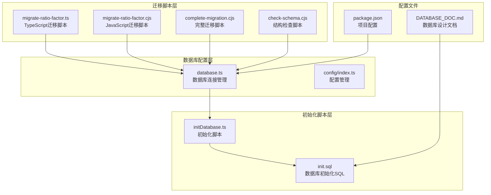
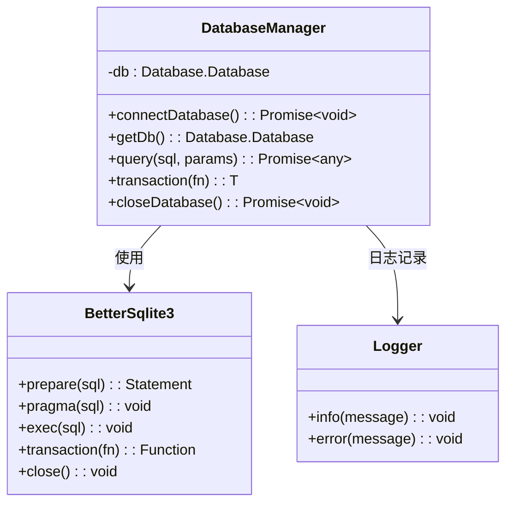
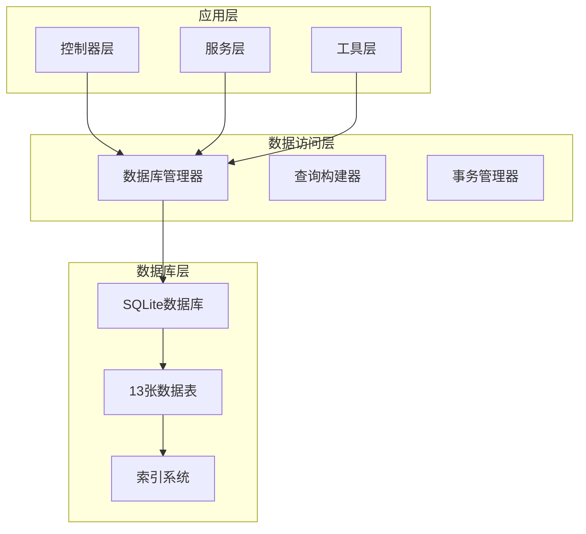
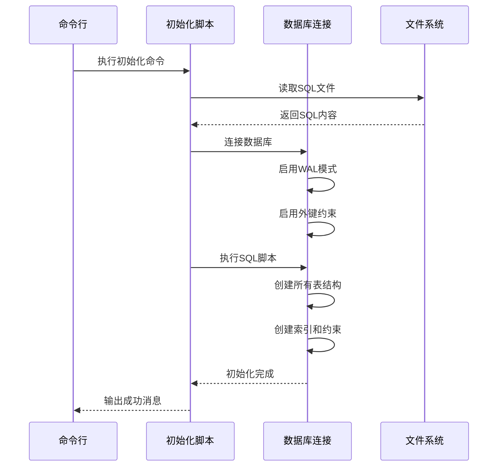
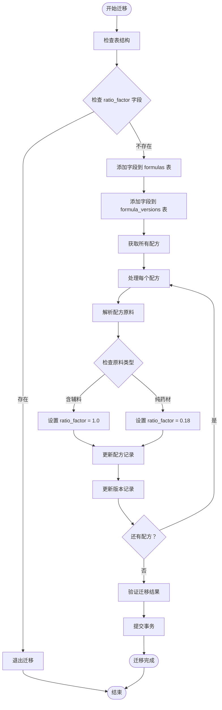
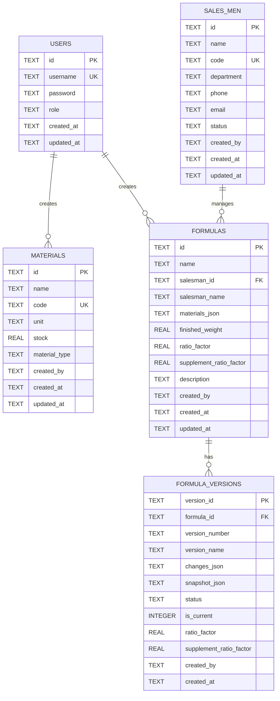

# 数据库迁移文档

<cite>
**本文档中引用的文件**
- [DATABASE_DOC.md](file://backend/DATABASE_DOC.md)
- [database.ts](file://backend/src/config/database.ts)
- [init.sql](file://backend/src/scripts/init.sql)
- [initDatabase.ts](file://backend/src/scripts/initDatabase.ts)
- [check-schema.cjs](file://backend/src/scripts/check-schema.cjs)
- [complete-migration.cjs](file://backend/src/scripts/complete-migration.cjs)
- [migrate-ratio-factor.cjs](file://backend/src/scripts/migrate-ratio-factor.cjs)
- [migrate-ratio-factor.ts](file://backend/src/scripts/migrate-ratio-factor.ts)
- [package.json](file://backend/package.json)
</cite>

## 目录
1. [简介](#简介)
2. [项目结构](#项目结构)
3. [核心组件](#核心组件)
4. [架构概览](#架构概览)
5. [详细组件分析](#详细组件分析)
6. [依赖关系分析](#依赖关系分析)
7. [性能考虑](#性能考虑)
8. [故障排除指南](#故障排除指南)
9. [结论](#结论)

## 简介

TingStudio 是一个基于 SQLite 的食品配方管理系统，采用 TypeScript 和 Node.js 构建。本项目实现了完整的数据库迁移机制，支持从旧版本向新版本的平滑升级。

项目采用 SQLite 作为主要数据库存储，使用 better-sqlite3 驱动程序，支持 WAL 模式和外键约束。数据库初始化通过专门的 SQL 脚本完成，并提供了多个迁移脚本来处理结构变更。

## 项目结构

后端项目采用模块化架构，数据库相关的核心文件分布如下：



**图表来源**
- [database.ts:1-70](file://backend/src/config/database.ts#L1-L70)
- [init.sql:1-232](file://backend/src/scripts/init.sql#L1-L232)
- [initDatabase.ts:1-37](file://backend/src/scripts/initDatabase.ts#L1-L37)

**章节来源**
- [package.json:1-43](file://backend/package.json#L1-L43)
- [DATABASE_DOC.md:1-461](file://backend/DATABASE_DOC.md#L1-L461)

## 核心组件

### 数据库连接管理器

数据库连接管理器是整个系统的核心组件，负责数据库的初始化、连接管理和事务处理。



**图表来源**
- [database.ts:10-37](file://backend/src/config/database.ts#L10-L37)

### 数据库初始化系统

数据库初始化系统通过 SQL 脚本创建所有必要的表结构，包括主键、外键、索引和约束条件。

**章节来源**
- [database.ts:10-70](file://backend/src/config/database.ts#L10-L70)
- [initDatabase.ts:11-31](file://backend/src/scripts/initDatabase.ts#L11-L31)

## 架构概览

系统采用分层架构设计，数据库层提供统一的数据访问接口，业务逻辑层通过这些接口进行数据操作。



**图表来源**
- [database.ts:44-61](file://backend/src/config/database.ts#L44-L61)
- [init.sql:7-232](file://backend/src/scripts/init.sql#L7-L232)

## 详细组件分析

### 数据库初始化流程

数据库初始化过程包含以下关键步骤：



**图表来源**
- [initDatabase.ts:11-31](file://backend/src/scripts/initDatabase.ts#L11-L31)
- [database.ts:10-30](file://backend/src/config/database.ts#L10-L30)

### 迁移脚本系统

系统提供了多种迁移脚本来处理不同的数据库变更场景：

#### 比例因子迁移脚本

比例因子迁移脚本处理从 `materials` 表到 `formulas` 表的字段迁移：



**图表来源**
- [migrate-ratio-factor.ts:27-127](file://backend/src/scripts/migrate-ratio-factor.ts#L27-L127)

#### 完整迁移脚本

完整迁移脚本处理遗留的迁移任务：

**章节来源**
- [migrate-ratio-factor.ts:1-149](file://backend/src/scripts/migrate-ratio-factor.ts#L1-L149)
- [complete-migration.cjs:1-70](file://backend/src/scripts/complete-migration.cjs#L1-L70)

### 数据库表结构分析

系统包含13张核心表，按照功能模块进行组织：



**图表来源**
- [init.sql:7-232](file://backend/src/scripts/init.sql#L7-L232)

**章节来源**
- [DATABASE_DOC.md:23-461](file://backend/DATABASE_DOC.md#L23-L461)

## 依赖关系分析

系统的关键依赖关系如下：

```mermaid
graph LR
subgraph "核心依赖"
BetterSqlite3[better-sqlite3]
Dotenv[dotenv]
Express[express]
end
subgraph "开发依赖"
Typescript[typescript]
TSX[tsx]
TypeBetterSqlite3[@types/better-sqlite3]
TypeNode[@types/node]
end
subgraph "运行时依赖"
Bcrypt[bcryptjs]
Compression[compression]
Cors[cors]
Helmet[helmet]
JWT[jsonwebtoken]
Morgan[morgan]
Multer[multer]
XLSX[xlsx]
end
BetterSqlite3 --> DatabaseManager[database.ts]
Dotenv --> Config[index.ts]
Express --> Controllers[*Controller.ts]
DatabaseManager --> BetterSqlite3
Config --> DatabaseManager
Controllers --> DatabaseManager
```

**图表来源**
- [package.json:14-41](file://backend/package.json#L14-L41)

**章节来源**
- [package.json:1-43](file://backend/package.json#L1-L43)

## 性能考虑

### 数据库性能优化

1. **WAL 模式**：启用写-ahead logging 模式提高并发性能
2. **外键约束**：确保数据完整性的同时影响性能
3. **索引策略**：为常用查询字段建立索引
4. **事务处理**：批量操作使用事务提高效率

### 迁移性能优化

1. **批量处理**：迁移脚本使用批量更新减少数据库往返
2. **事务保护**：所有迁移操作在事务中执行确保原子性
3. **回滚机制**：错误时自动回滚避免部分更新
4. **进度监控**：提供详细的执行进度和状态反馈

## 故障排除指南

### 常见问题及解决方案

#### 数据库连接问题

**问题**：数据库无法连接
**原因**：数据库文件路径错误或权限不足
**解决方案**：
1. 检查数据库文件路径配置
2. 确认数据目录存在且可写
3. 验证数据库文件权限

#### 迁移失败问题

**问题**：迁移脚本执行失败
**原因**：表结构已存在或数据不一致
**解决方案**：
1. 检查当前表结构状态
2. 手动清理冲突的字段
3. 重新执行迁移脚本

#### 性能问题

**问题**：数据库操作缓慢
**原因**：缺少必要索引或查询优化不足
**解决方案**：
1. 分析慢查询日志
2. 为常用查询字段添加索引
3. 优化复杂查询语句

**章节来源**
- [check-schema.cjs:1-43](file://backend/src/scripts/check-schema.cjs#L1-L43)
- [complete-migration.cjs:64-67](file://backend/src/scripts/complete-migration.cjs#L64-L67)

## 结论

TingStudio 的数据库迁移系统设计合理，具有以下特点：

1. **模块化设计**：清晰的分层架构便于维护和扩展
2. **自动化程度高**：提供完整的初始化和迁移脚本
3. **安全性保证**：事务处理和错误回滚机制
4. **性能优化**：合理的索引策略和查询优化
5. **可维护性**：详细的文档和注释

建议在未来版本中进一步完善：
- 增加数据库备份机制
- 实现增量迁移版本控制
- 添加更多性能监控指标
- 优化大表数据处理能力