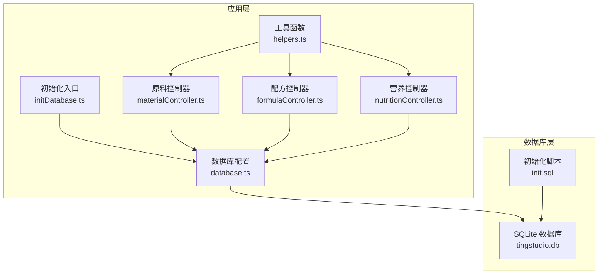
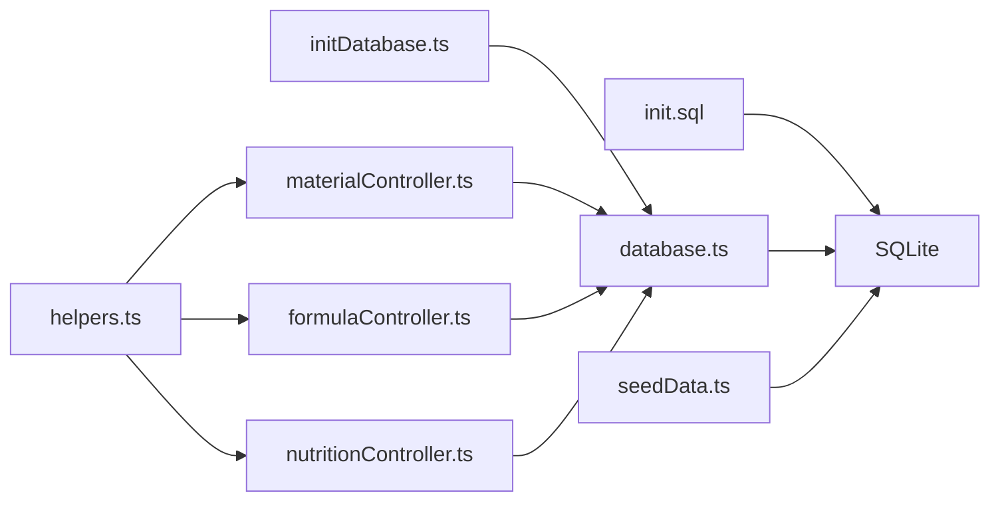

# 数据模型设计

<cite>
**本文档引用的文件**
- [DATABASE_DOC.md](file://backend/DATABASE_DOC.md)
- [init.sql](file://backend/src/scripts/init.sql)
- [database.ts](file://backend/src/config/database.ts)
- [initDatabase.ts](file://backend/src/scripts/initDatabase.ts)
- [seedData.ts](file://backend/src/scripts/seedData.ts)
- [helpers.ts](file://backend/src/utils/helpers.ts)
- [index.ts](file://backend/src/config/index.ts)
- [materialController.ts](file://backend/src/controllers/materialController.ts)
- [formulaController.ts](file://backend/src/controllers/formulaController.ts)
- [nutritionController.ts](file://backend/src/controllers/nutritionController.ts)
</cite>

## 目录
1. [简介](#简介)
2. [项目结构](#项目结构)
3. [核心组件](#核心组件)
4. [架构总览](#架构总览)
5. [详细组件分析](#详细组件分析)
6. [依赖关系分析](#依赖关系分析)
7. [性能考量](#性能考量)
8. [故障排查指南](#故障排查指南)
9. [结论](#结论)
10. [附录](#附录)

## 简介
本文件基于仓库中的数据库设计文档与实现代码，系统化梳理 TingStudio 的数据模型设计。重点覆盖以下方面：
- 数据模型设计原理与实现策略
- JSON 字段的使用方式与解析规范
- 时间戳格式标准化与一致性
- ID 生成策略与全局唯一性保障
- 数据完整性保证机制（主键、外键、唯一、检查约束）
- 数据验证规则与业务规则的实现方式
- 数据模型演进策略与版本管理方案
- 数据安全与隐私保护的设计考虑

## 项目结构
TingStudio 后端采用 SQLite（better-sqlite3）作为本地数据库，通过初始化脚本创建表结构，并在运行时通过统一的数据库连接管理器进行访问。种子数据脚本用于快速构建演示环境。



图表来源
- [database.ts:1-70](file://backend/src/config/database.ts#L1-L70)
- [initDatabase.ts:1-37](file://backend/src/scripts/initDatabase.ts#L1-L37)
- [init.sql:1-228](file://backend/src/scripts/init.sql#L1-L228)
- [materialController.ts:1-129](file://backend/src/controllers/materialController.ts#L1-L129)
- [formulaController.ts:1-287](file://backend/src/controllers/formulaController.ts#L1-L287)
- [nutritionController.ts:1-641](file://backend/src/controllers/nutritionController.ts#L1-L641)
- [helpers.ts:1-86](file://backend/src/utils/helpers.ts#L1-L86)

章节来源
- [database.ts:1-70](file://backend/src/config/database.ts#L1-L70)
- [initDatabase.ts:1-37](file://backend/src/scripts/initDatabase.ts#L1-L37)
- [init.sql:1-228](file://backend/src/scripts/init.sql#L1-L228)

## 核心组件
- 数据库连接与事务管理：提供连接建立、WAL 模式、外键约束开启、查询封装与事务支持。
- 初始化脚本：定义 13 张表的结构、索引、外键与检查约束。
- 工具函数：统一 ID 生成、时间格式化、JSON 安全解析、命名转换等。
- 控制器：围绕核心业务表进行 CRUD、版本控制、营养计算与合规检查。

章节来源
- [database.ts:1-70](file://backend/src/config/database.ts#L1-L70)
- [init.sql:1-228](file://backend/src/scripts/init.sql#L1-L228)
- [helpers.ts:1-86](file://backend/src/utils/helpers.ts#L1-L86)
- [materialController.ts:1-129](file://backend/src/controllers/materialController.ts#L1-L129)
- [formulaController.ts:1-287](file://backend/src/controllers/formulaController.ts#L1-L287)
- [nutritionController.ts:1-641](file://backend/src/controllers/nutritionController.ts#L1-L641)

## 架构总览
数据库层采用 SQLite，应用层通过 better-sqlite3 访问；控制器层负责业务逻辑与数据校验；工具层提供通用能力。数据模型围绕“用户-原料-配方-版本-导出-营养”六大主题域展开，JSON 字段承载灵活的数据结构，配合检查约束与索引确保一致性与性能。

```mermaid
erDiagram
USERS {
text id PK
text username UK
text password
text role
text created_at
text updated_at
}
MATERIALS {
text id PK
text name
text code UK
text unit
real stock
text material_type
real ratio_factor
text created_by
text created_at
text updated_at
}
SALES_MEN {
text id PK
text name
text code UK
text department
text phone
text email
text status
text created_by
text created_at
text updated_at
}
FORMULAS {
text id PK
text name
text salesman_id FK
text salesman_name
text materials_json
real finished_weight
text description
text created_by
text created_at
text updated_at
}
FORMULA_VERSIONS {
text version_id PK
text formula_id FK
text version_number
text version_name
text changes_json
text snapshot_json
text status
integer is_current
text created_by
text created_at
}
EXPORT_TEMPLATES {
text template_id PK
text name
text description
text type
text format_config_json
integer is_default
text created_by
text created_at
}
EXPORT_JOBS {
text job_id PK
text formula_id FK
text version_id
text template_id
text export_type
text status
text file_url
text file_name
text api_endpoint
integer progress
text error_message
text created_by
text created_at
text completed_at
}
API_DATA_INTERFACES {
text interface_id PK
text name
text description
text endpoint UK
text method
text authentication
text auth_config_json
text data_format
text field_mapping_json
text rate_limit_json
text retry_config_json
text created_by
text created_at
text updated_at
}
SHARE_CONFIGS {
text share_id PK
text formula_id FK
text version_id
text share_type
text share_url
text password
text expire_date
text allowed_emails_json
integer download_limit
integer download_count
text created_by
text created_at
}
MATERIAL_NUTRITION {
text nutrition_id PK
text material_id UK FK
text per_100g_json
text data_version
text data_source
text notes
text last_updated
}
FORMULA_NUTRITION_SUMMARIES {
text summary_id PK
text formula_id FK
text version_id UK
real total_weight
text total_nutrition_json
text per_100g_nutrition_json
text material_breakdown_json
text calculated_by
text calculated_at
}
NUTRITION_PROFILES {
text profile_id PK
text name
text description
text category
text target_values_json
text tolerance_ranges_json
text mandatory_fields_json
text created_at
text updated_at
}
NUTRITION_ANALYSIS_REPORTS {
text report_id PK
text formula_id FK
text version_id
text summary_id FK
text compliance_check_json
text recommendations_json
text generated_by
text generated_at
}
USERS ||--o{ MATERIALS : "created_by"
USERS ||--o{ FORMULAS : "created_by"
USERS ||--o{ SALES_MEN : "created_by"
USERS ||--o{ FORMULA_VERSIONS : "created_by"
USERS ||--o{ EXPORT_TEMPLATES : "created_by"
USERS ||--o{ EXPORT_JOBS : "created_by"
USERS ||--o{ API_DATA_INTERFACES : "created_by"
USERS ||--o{ SHARE_CONFIGS : "created_by"
USERS ||--o{ FORMULA_NUTRITION_SUMMARIES : "calculated_by"
USERS ||--o{ NUTRITION_ANALYSIS_REPORTS : "generated_by"
MATERIALS ||--|| MATERIAL_NUTRITION : "material_id"
FORMULAS ||--o{ FORMULA_VERSIONS : "formula_id"
FORMULAS ||--o{ EXPORT_JOBS : "formula_id"
FORMULAS ||--o{ FORMULA_NUTRITION_SUMMARIES : "formula_id"
FORMULAS ||--o{ SHARE_CONFIGS : "formula_id"
FORMULAS ||--o{ NUTRITION_ANALYSIS_REPORTS : "formula_id"
FORMULA_VERSIONS ||--|| FORMULA_NUTRITION_SUMMARIES : "version_id"
FORMULA_NUTRITION_SUMMARIES ||--o{ NUTRITION_ANALYSIS_REPORTS : "summary_id"
```

图表来源
- [DATABASE_DOC.md:23-427](file://backend/DATABASE_DOC.md#L23-L427)
- [init.sql:1-228](file://backend/src/scripts/init.sql#L1-L228)

## 详细组件分析

### 数据模型设计原理与实现策略
- 统一 ID 生成：采用高基数字符串策略，结合时间戳与随机数，确保跨节点与跨进程的唯一性与排序友好性。
- 时间戳标准化：统一使用 ISO 8601 字符串，便于人类阅读与机器解析，同时支持排序与检索。
- JSON 字段策略：将复杂结构（如物料列表、营养数据、模板配置、变更记录等）以 JSON 文本形式存储，应用层负责解析与校验，提升灵活性与扩展性。
- 外键与约束：通过 SQLite 的外键约束与检查约束，保证引用完整性与取值合法性；同时通过索引优化常见查询路径。
- 业务冗余与一致性：在配方表中冗余业务员名称，减少联表查询成本；在版本表中维护快照与变更记录，确保历史可追溯。

章节来源
- [DATABASE_DOC.md:447-457](file://backend/DATABASE_DOC.md#L447-L457)
- [helpers.ts:3-11](file://backend/src/utils/helpers.ts#L3-L11)
- [init.sql:1-228](file://backend/src/scripts/init.sql#L1-L228)

### JSON 字段使用方式
- 配方物料列表：以 JSON 数组形式存储，包含物料 ID、名称与用量，控制器在创建/更新时进行序列化与反序列化。
- 营养数据：每 100g 营养素以 JSON 对象存储，字段键名可能带有单位后缀，控制器在读取时进行标准化处理。
- 模板配置、认证配置、字段映射、限流与重试配置：以 JSON 存储，便于动态渲染与对接外部系统。
- 版本快照与变更记录：快照 JSON 包含完整配方状态，变更记录 JSON 记录字段级差异，便于审计与回溯。

章节来源
- [DATABASE_DOC.md:91-171](file://backend/DATABASE_DOC.md#L91-L171)
- [formulaController.ts:88-130](file://backend/src/controllers/formulaController.ts#L88-L130)
- [nutritionController.ts:55-121](file://backend/src/controllers/nutritionController.ts#L55-L121)

### 时间戳格式标准化
- 创建与更新时间统一使用 ISO 8601 字符串，数据库侧默认值与应用侧生成相结合，确保一致性。
- 导出任务的完成时间与营养汇总的计算时间同样遵循此规范。

章节来源
- [DATABASE_DOC.md:35-140](file://backend/DATABASE_DOC.md#L35-L140)
- [helpers.ts:8-11](file://backend/src/utils/helpers.ts#L8-L11)
- [init.sql:13-18](file://backend/src/scripts/init.sql#L13-L18)

### ID 生成策略
- ID 采用“时间戳 + 随机字符串”的组合，具备全局唯一性与可排序性，适合 SQLite 场景下的主键使用。
- 控制器在新增资源时调用统一的 ID 生成函数，确保一致性。

章节来源
- [DATABASE_DOC.md:451-451](file://backend/DATABASE_DOC.md#L451-L451)
- [helpers.ts:3-6](file://backend/src/utils/helpers.ts#L3-L6)
- [seedData.ts:118-149](file://backend/src/scripts/seedData.ts#L118-L149)

### 数据完整性保证机制
- 主键设计：所有表均设置主键，确保行级唯一性。
- 外键约束：严格定义外键关系与级联行为（如删除配方时级联删除版本、导出任务、分享配置与营养汇总），防止悬挂引用。
- 唯一约束：用户名、原料编码、业务员编码、接口端点等关键字段设置唯一约束，避免重复。
- 检查约束：枚举字段（如角色、类型、状态、单位等）通过 CHECK 约束限定取值范围，确保数据合法。
- 索引：为高频查询字段（名称、编码、状态、创建人、版本号等）建立索引，提升查询性能。

章节来源
- [DATABASE_DOC.md:29-147](file://backend/DATABASE_DOC.md#L29-L147)
- [init.sql:10-182](file://backend/src/scripts/init.sql#L10-L182)

### 数据验证规则与业务规则实现
- 输入校验：控制器对请求参数进行基本校验（如业务员存在性、唯一性冲突处理），并在数据库约束触发时返回明确错误。
- 业务规则：
  - 配方更新时自动创建版本快照与变更记录，保持版本可追溯。
  - 营养计算前需确保配方已计算汇总，否则拒绝合规检查。
  - 原料删除前检查是否被配方引用（通过 JSON 文本 LIKE 检测），避免破坏完整性。
  - 营养数据标准化：对键名进行清洗与映射，兼容不同来源的字段命名差异。

章节来源
- [formulaController.ts:88-218](file://backend/src/controllers/formulaController.ts#L88-L218)
- [nutritionController.ts:123-242](file://backend/src/controllers/nutritionController.ts#L123-L242)
- [materialController.ts:108-128](file://backend/src/controllers/materialController.ts#L108-L128)

### 数据模型演进策略与版本管理
- 版本表设计：配方版本表记录快照与变更，版本号递增，当前版本标记为唯一，确保同一版本仅有一份汇总。
- 数据版本：原料营养数据维护版本号，更新时递增主版本号，便于追踪数据来源与变更历史。
- JSON 结构演进：通过字段名标准化与安全解析函数，逐步引入新字段而不破坏现有结构；同时保留向后兼容的默认值。

章节来源
- [DATABASE_DOC.md:125-171](file://backend/DATABASE_DOC.md#L125-L171)
- [formulaController.ts:167-211](file://backend/src/controllers/formulaController.ts#L167-L211)
- [nutritionController.ts:96-115](file://backend/src/controllers/nutritionController.ts#L96-L115)

### 数据安全与隐私保护
- 密码存储：使用 bcrypt 哈希存储用户密码，增强安全性。
- 敏感字段：接口认证配置、分享密码等敏感信息以 JSON 形式存储，建议在前端与日志中避免泄露。
- 访问控制：控制器根据用户角色与创建人字段进行数据隔离，避免越权访问。
- 日志与审计：通过版本快照与变更记录实现审计线索，便于追踪数据变更。

章节来源
- [DATABASE_DOC.md:454-454](file://backend/DATABASE_DOC.md#L454-L454)
- [formulaController.ts:15-69](file://backend/src/controllers/formulaController.ts#L15-L69)
- [seedData.ts:123-123](file://backend/src/scripts/seedData.ts#L123-L123)

## 依赖关系分析
- 数据库连接管理器集中管理连接、事务与查询封装，控制器通过统一接口访问数据库。
- 工具函数为控制器提供 ID 生成、时间格式化、JSON 安全解析与命名转换等能力。
- 初始化脚本与种子数据脚本分别负责结构初始化与演示数据填充，确保开发与测试环境的一致性。



图表来源
- [init.sql:1-228](file://backend/src/scripts/init.sql#L1-L228)
- [initDatabase.ts:1-37](file://backend/src/scripts/initDatabase.ts#L1-L37)
- [database.ts:1-70](file://backend/src/config/database.ts#L1-L70)
- [helpers.ts:1-86](file://backend/src/utils/helpers.ts#L1-L86)
- [materialController.ts:1-129](file://backend/src/controllers/materialController.ts#L1-L129)
- [formulaController.ts:1-287](file://backend/src/controllers/formulaController.ts#L1-L287)
- [nutritionController.ts:1-641](file://backend/src/controllers/nutritionController.ts#L1-L641)
- [seedData.ts:1-399](file://backend/src/scripts/seedData.ts#L1-L399)

章节来源
- [database.ts:1-70](file://backend/src/config/database.ts#L1-L70)
- [initDatabase.ts:1-37](file://backend/src/scripts/initDatabase.ts#L1-L37)
- [init.sql:1-228](file://backend/src/scripts/init.sql#L1-L228)
- [helpers.ts:1-86](file://backend/src/utils/helpers.ts#L1-L86)
- [seedData.ts:1-399](file://backend/src/scripts/seedData.ts#L1-L399)

## 性能考量
- 索引策略：为高频过滤与排序字段建立索引，如名称、编码、状态、创建人、版本号等，显著提升查询性能。
- 查询封装：数据库层统一查询封装，支持 SELECT 返回行数组与 DML 返回影响行数，简化控制器逻辑。
- 事务：批量写入与复杂更新通过事务包裹，保证一致性与原子性。
- JSON 查询：对 JSON 字段的 LIKE 查询仅在必要场景使用（如删除前检查），避免全表扫描。

章节来源
- [DATABASE_DOC.md:61-147](file://backend/DATABASE_DOC.md#L61-L147)
- [database.ts:39-61](file://backend/src/config/database.ts#L39-L61)
- [materialController.ts:113-121](file://backend/src/controllers/materialController.ts#L113-L121)

## 故障排查指南
- 连接失败：检查数据库路径与权限，确认 WAL 模式与外键约束已启用。
- 唯一约束冲突：针对用户名、编码、端点等唯一字段，出现冲突时返回明确提示并引导修正。
- 外键约束错误：删除或更新时若违反外键约束，需先清理相关子表数据或调整引用关系。
- JSON 解析异常：使用安全解析函数处理空值与非法 JSON，避免应用崩溃。
- 版本与汇总缺失：合规检查前需确保配方已完成营养汇总计算，否则会返回提示。

章节来源
- [database.ts:10-30](file://backend/src/config/database.ts#L10-L30)
- [materialController.ts:73-78](file://backend/src/controllers/materialController.ts#L73-L78)
- [nutritionController.ts:298-305](file://backend/src/controllers/nutritionController.ts#L298-L305)

## 结论
TingStudio 的数据模型以 SQLite 为基础，结合 JSON 字段与严格的约束设计，在灵活性与完整性之间取得平衡。通过统一的 ID 生成、时间戳标准化与工具函数封装，实现了良好的可维护性与可扩展性。版本控制与审计记录进一步增强了数据可追溯性，满足业务演进需求。建议在后续迭代中持续完善 JSON 字段的结构化校验与文档化，以提升系统的长期稳定性与可读性。

## 附录
- 数据库配置：端口、数据库路径、JWT 密钥、上传目录与 CORS 等配置项集中管理。
- 初始化流程：先连接数据库，再执行初始化 SQL，最后关闭连接。
- 种子数据：包含用户、原料、业务员、配方、版本、导出模板、导出任务、营养标准与原料营养等数据，便于快速演示。

章节来源
- [index.ts:1-24](file://backend/src/config/index.ts#L1-L24)
- [initDatabase.ts:11-31](file://backend/src/scripts/initDatabase.ts#L11-L31)
- [seedData.ts:102-399](file://backend/src/scripts/seedData.ts#L102-L399)