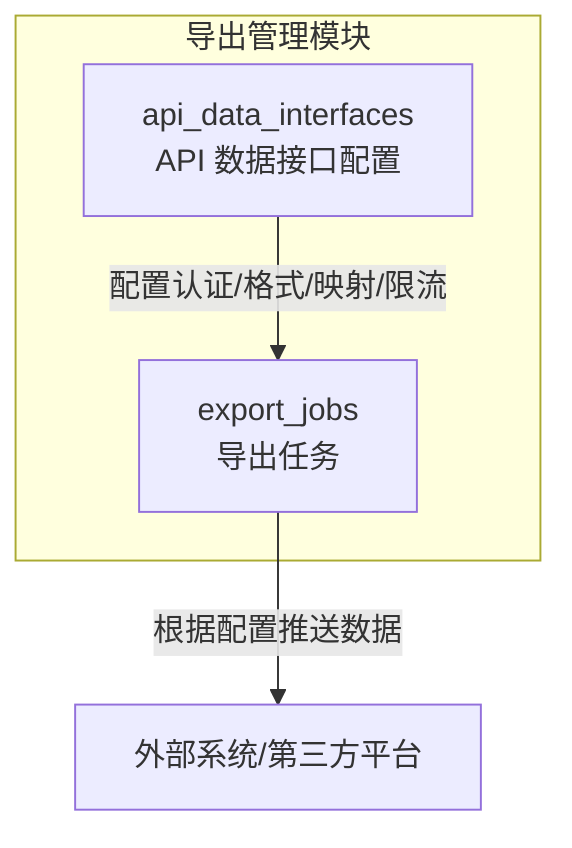
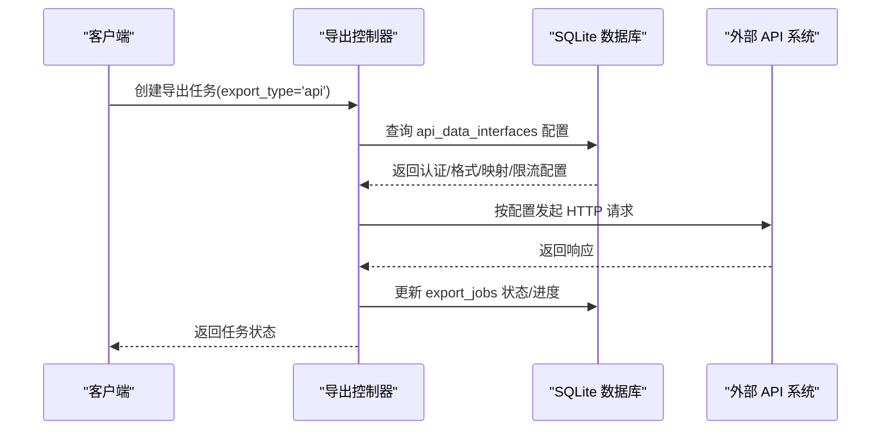
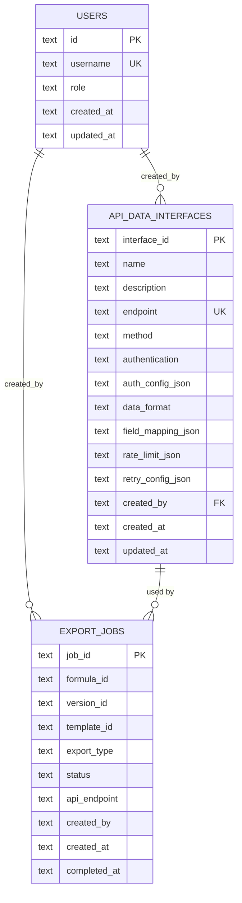
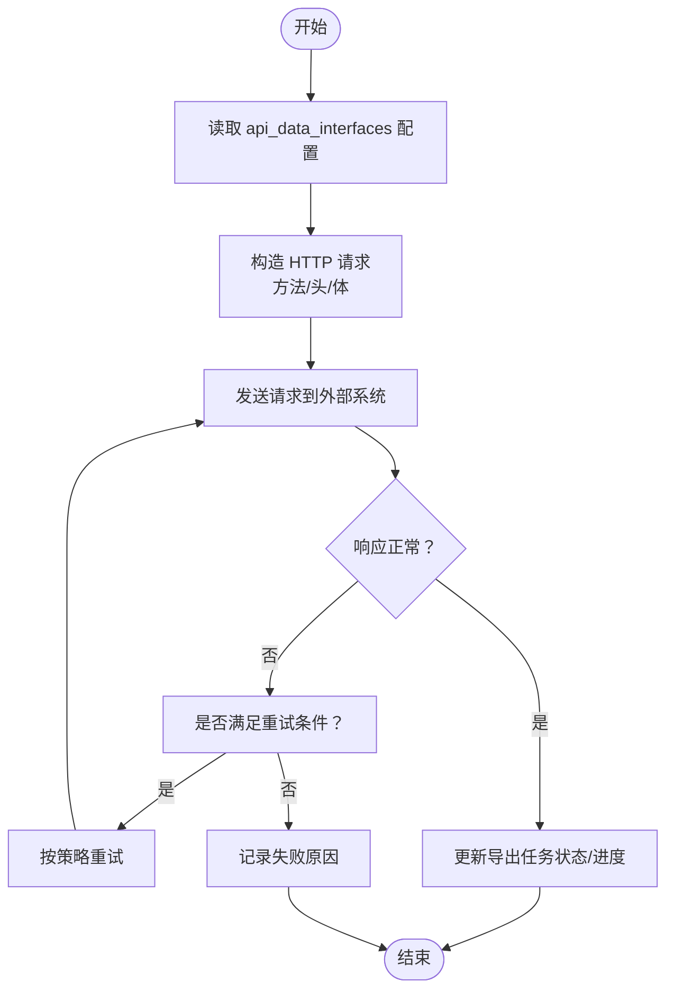

# API 数据接口表 (api_data_interfaces)

<cite>
**本文档引用的文件**
- [DATABASE_DOC.md](file://backend/DATABASE_DOC.md)
- [init.sql](file://backend/src/scripts/init.sql)
- [exportController.ts](file://backend/src/controllers/exportController.ts)
- [API_DOC.md](file://backend/API_DOC.md)
</cite>

## 目录
1. [简介](#简介)
2. [项目结构](#项目结构)
3. [核心组件](#核心组件)
4. [架构总览](#架构总览)
5. [详细组件分析](#详细组件分析)
6. [依赖关系分析](#依赖关系分析)
7. [性能考量](#性能考量)
8. [故障排查指南](#故障排查指南)
9. [结论](#结论)
10. [附录](#附录)

## 简介
本文件面向“API 数据接口表”（api_data_interfaces），基于数据库设计文档与后端实现，系统性说明该表的字段定义、数据类型、约束条件、业务含义以及与导出流程的集成关系。重点涵盖以下方面：
- 字段定义与约束：interface_id、name、description、endpoint、method、authentication、auth_config_json、data_format、field_mapping_json、rate_limit_json、retry_config_json、created_by、created_at、updated_at
- 认证方式与配置机制：none/basic/apiKey/oauth 的差异与配置要点
- 索引设计与查询优化
- 字段映射与限流配置的实际应用场景
- 认证配置的 JSON 示例与最佳实践

## 项目结构
api_data_interfaces 属于“导出管理”模块，与导出任务表（export_jobs）协同工作，用于将配方数据通过 API 推送到外部系统。其在数据库中的位置如下：

图表来源
- [init.sql:131-148](file://backend/src/scripts/init.sql#L131-L148)
- [DATABASE_DOC.md:223-246](file://backend/DATABASE_DOC.md#L223-L246)

章节来源
- [DATABASE_DOC.md:18-19](file://backend/DATABASE_DOC.md#L18-L19)
- [init.sql:131-148](file://backend/src/scripts/init.sql#L131-L148)

## 核心组件
api_data_interfaces 存储外部 API 对接的配置信息，是导出任务（export_jobs.export_type='api'）执行时的关键输入。其核心职责包括：
- 维护每个外部 API 的端点、HTTP 方法、认证方式与配置
- 定义数据格式（JSON/XML）
- 提供字段映射规则，便于将内部数据转换为外部系统期望的结构
- 配置限流与重试策略，保障推送稳定性

章节来源
- [DATABASE_DOC.md:223-246](file://backend/DATABASE_DOC.md#L223-L246)
- [exportController.ts:187-229](file://backend/src/controllers/exportController.ts#L187-L229)

## 架构总览
下图展示 api_data_interfaces 在导出流程中的作用与调用关系：

图表来源
- [exportController.ts:187-229](file://backend/src/controllers/exportController.ts#L187-L229)
- [init.sql:111-129](file://backend/src/scripts/init.sql#L111-L129)

## 详细组件分析

### 字段定义与约束
- interface_id：主键，唯一标识接口配置
- name：接口名称，必填
- description：接口描述，可空
- endpoint：端点地址，必填且唯一
- method：HTTP 方法，默认 GET，取值限定为 GET/POST/PUT/DELETE
- authentication：认证方式，默认 none，取值限定为 none/basic/apiKey/oauth
- auth_config_json：认证配置 JSON，可空
- data_format：数据格式，默认 json，取值限定为 json/xml
- field_mapping_json：字段映射 JSON，可空
- rate_limit_json：限流配置 JSON，可空
- retry_config_json：重试配置 JSON，可空
- created_by：创建人（用户 ID），必填
- created_at/updated_at：时间戳，采用 ISO 8601 字符串

章节来源
- [DATABASE_DOC.md:227-242](file://backend/DATABASE_DOC.md#L227-L242)
- [init.sql:132-146](file://backend/src/scripts/init.sql#L132-L146)

### 认证方式与配置机制
支持四种认证方式，分别适用于不同的安全场景：
- none：不进行额外认证，适合内网或测试环境
- basic：HTTP 基本认证，通常包含用户名/密码
- apiKey：API Key 认证，常通过请求头或查询参数传递
- oauth：OAuth 流程认证，适合第三方授权

认证配置通过 auth_config_json 字段以 JSON 形式存储，典型字段可能包括：
- basic：用户名、密码
- apiKey：密钥、头部字段名（如 Authorization 或 X-API-Key）
- oauth：令牌、令牌类型、刷新逻辑（视具体 OAuth 版本而定）

章节来源
- [DATABASE_DOC.md:234](file://backend/DATABASE_DOC.md#L234)
- [API_DOC.md:552](file://backend/API_DOC.md#L552)

### 字段映射与数据格式
- data_format：决定推送的数据格式为 JSON 或 XML
- field_mapping_json：用于将内部字段映射到外部系统的字段，提升兼容性与灵活性
  - 实际应用中，可将内部字段名映射为外部 API 所需的字段名
  - 支持嵌套字段映射与条件映射，以适配复杂外部系统结构

章节来源
- [DATABASE_DOC.md:236](file://backend/DATABASE_DOC.md#L236)
- [DATABASE_DOC.md:237](file://backend/DATABASE_DOC.md#L237)

### 限流与重试配置
- rate_limit_json：定义速率限制策略，如每分钟请求数、并发限制、退避策略等
- retry_config_json：定义重试策略，如重试次数、退避间隔、触发条件（网络错误/特定 HTTP 状态码）
- 实际应用场景
  - 第三方 API 限流：通过 rate_limit_json 控制请求节奏，避免触发限流
  - 网络抖动与临时错误：通过 retry_config_json 自动重试，提高成功率
  - 幂等性考虑：结合重试策略与去重机制，确保重复推送不会产生副作用

章节来源
- [DATABASE_DOC.md:238](file://backend/DATABASE_DOC.md#L238)
- [DATABASE_DOC.md:239](file://backend/DATABASE_DOC.md#L239)

### 索引设计
- idx_adi_endpoint：对 endpoint 字段建立索引，加速按端点查询与去重校验
- 建议在高频查询字段上增加索引，如 created_by、authentication、data_format 等，以优化筛选与排序性能

章节来源
- [DATABASE_DOC.md:244](file://backend/DATABASE_DOC.md#L244)
- [init.sql:148](file://backend/src/scripts/init.sql#L148)

### 实际应用场景
- 导出任务推送：当导出任务类型为 API 时，系统读取 api_data_interfaces 中的配置，构造请求并推送数据
- 多系统对接：通过不同的认证方式与字段映射，适配不同外部系统的规范
- 稳定性保障：通过限流与重试配置，降低第三方 API 限流与网络波动的影响

章节来源
- [exportController.ts:187-229](file://backend/src/controllers/exportController.ts#L187-L229)
- [API_DOC.md:542-557](file://backend/API_DOC.md#L542-L557)

### 认证配置 JSON 示例（概念性说明）
以下为常见认证配置的 JSON 结构示例（仅作概念说明，非仓库现有示例）：
- basic
  - {
    "username": "user",
    "password": "pass"
  }
- apiKey
  - {
    "key": "your-api-key",
    "headerName": "Authorization",
    "prefix": "Bearer "
  }
- oauth
  - {
    "clientId": "client-id",
    "clientSecret": "client-secret",
    "accessToken": "access-token",
    "refreshToken": "refresh-token",
    "tokenEndpoint": "https://example.com/oauth/token"
  }

说明
- 以上示例展示了字段命名与层级结构，具体字段以各外部系统要求为准
- 建议将敏感信息（如密码、密钥、令牌）存储在安全配置中心或加密环境中

[本节为概念性说明，不直接引用具体文件]

## 依赖关系分析
- 与 export_jobs 的耦合：导出任务（export_type='api'）依赖 api_data_interfaces 的配置完成推送
- 与 users 的关系：created_by 字段关联 users 表，用于审计与权限控制
- 与 SQLite 的约束：endpoint 唯一性约束，method/authentication/data_format 的枚举约束

图表来源
- [init.sql:7-15](file://backend/src/scripts/init.sql#L7-L15)
- [init.sql:131-148](file://backend/src/scripts/init.sql#L131-L148)
- [init.sql:111-129](file://backend/src/scripts/init.sql#L111-L129)

章节来源
- [DATABASE_DOC.md:393-427](file://backend/DATABASE_DOC.md#L393-L427)
- [init.sql:131-148](file://backend/src/scripts/init.sql#L131-L148)

## 性能考量
- 索引优化：endpoint 唯一索引可避免重复配置；建议在高频查询字段（如 created_by、authentication、data_format）上增加索引
- JSON 字段解析：auth_config_json、field_mapping_json、rate_limit_json、retry_config_json 为 TEXT 类型，应用层解析，注意缓存与序列化开销
- 并发与限流：合理设置 rate_limit_json，避免触发第三方 API 限流；结合 retry_config_json 提高成功率
- 数据量增长：随着接口配置增多，建议定期清理无用配置并归档历史记录

[本节提供一般性指导，不直接引用具体文件]

## 故障排查指南
- 端点冲突：endpoint 唯一性约束导致插入失败，需检查是否已有相同端点
- 认证失败：核对 auth_config_json 内容与外部系统要求一致
- 字段映射错误：检查 field_mapping_json 是否正确映射到外部系统字段
- 限流与重试：观察第三方 API 响应与状态码，调整 rate_limit_json 与 retry_config_json
- 时间格式：created_at/updated_at 使用 ISO 8601 字符串，确保前后端解析一致

章节来源
- [exportController.ts:204-209](file://backend/src/controllers/exportController.ts#L204-L209)
- [DATABASE_DOC.md:244](file://backend/DATABASE_DOC.md#L244)

## 结论
api_data_interfaces 作为导出模块与外部系统对接的“配置中心”，通过灵活的认证方式、数据格式、字段映射与限流重试策略，支撑多样化的外部推送需求。建议在生产环境中：
- 明确认证策略与配置项，确保与外部系统严格匹配
- 建立完善的字段映射与限流重试策略，并持续监控与优化
- 加强索引与查询优化，保障大规模配置下的查询性能

[本节为总结性内容，不直接引用具体文件]

## 附录

### 字段映射与限流配置的应用流程

图表来源
- [exportController.ts:187-229](file://backend/src/controllers/exportController.ts#L187-L229)
- [DATABASE_DOC.md:238](file://backend/DATABASE_DOC.md#L238)
- [DATABASE_DOC.md:239](file://backend/DATABASE_DOC.md#L239)