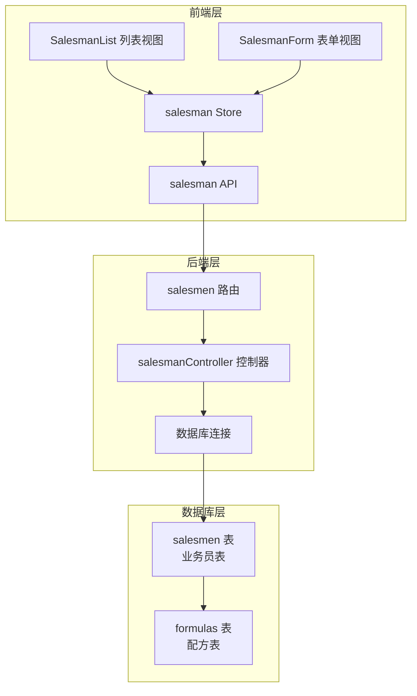
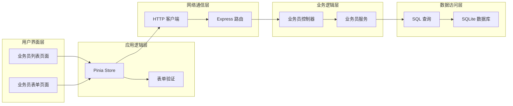
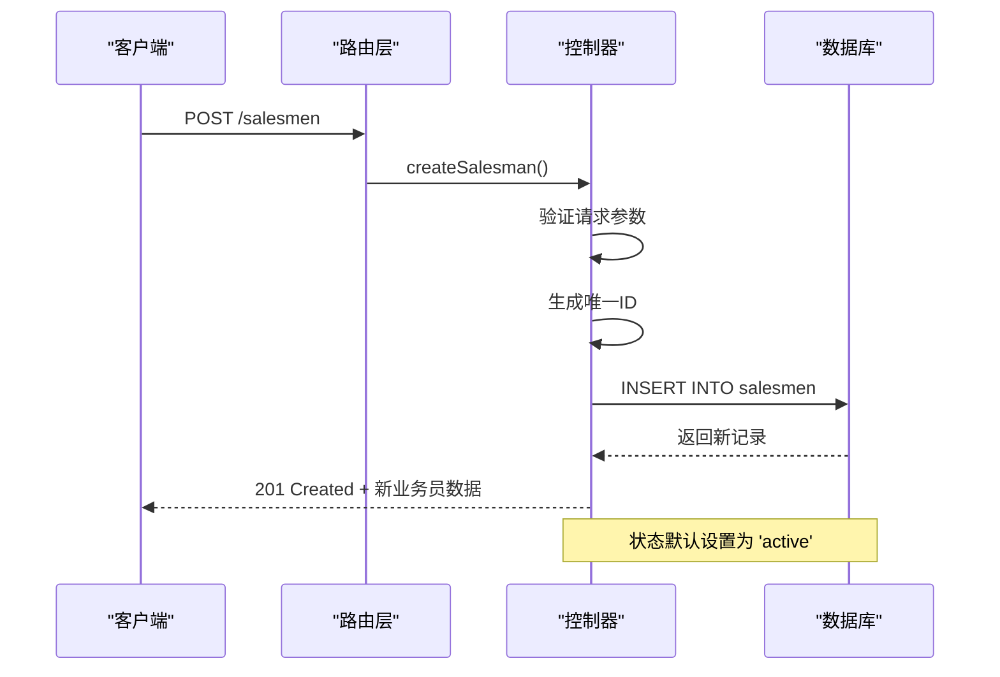
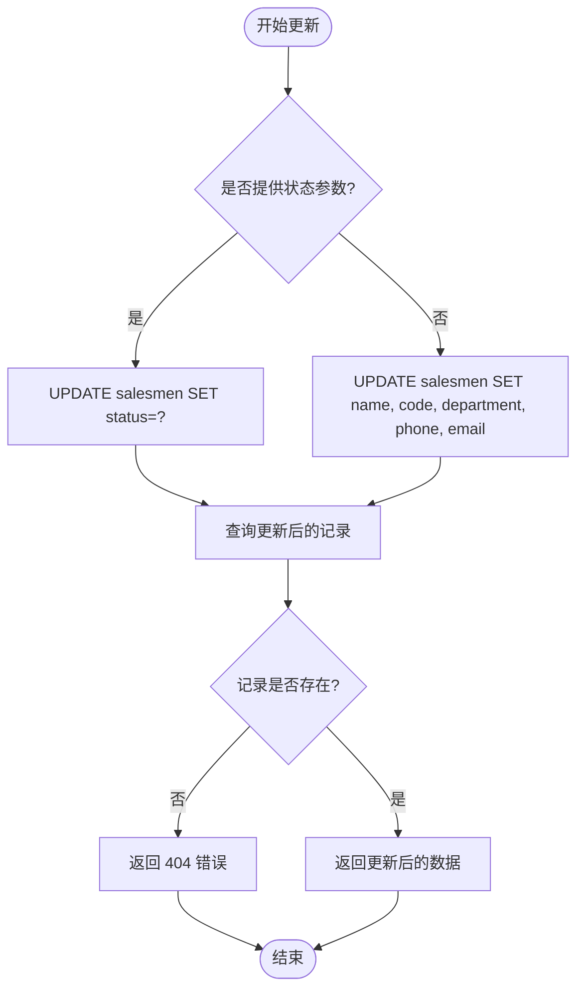
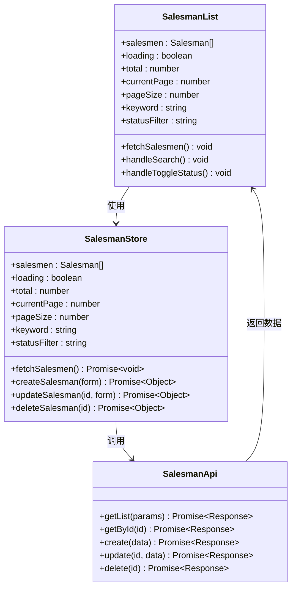
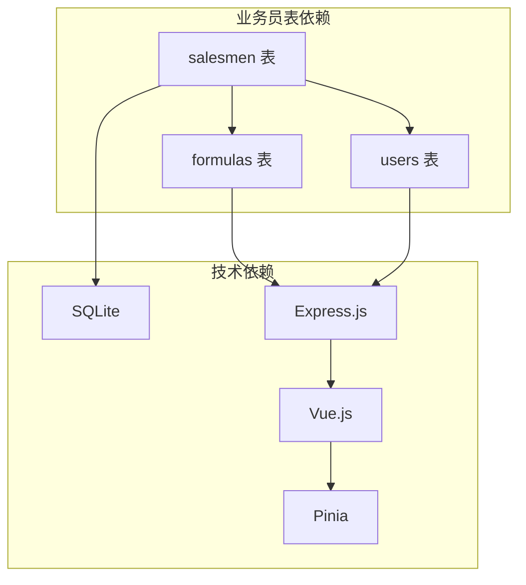
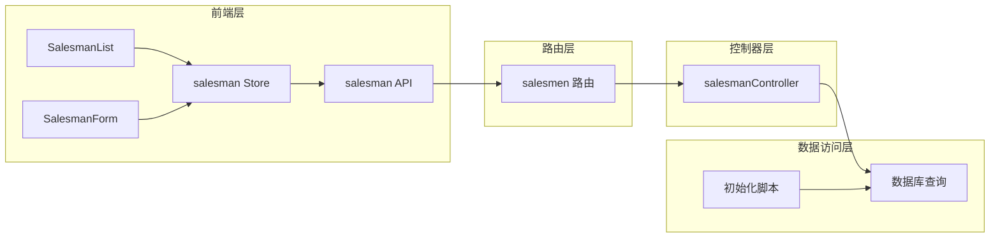

# 业务员表 (salesmen)

<cite>
**本文档引用的文件**
- [DATABASE_DOC.md](file://backend/DATABASE_DOC.md)
- [init.sql](file://backend/src/scripts/init.sql)
- [salesmanController.ts](file://backend/src/controllers/salesmanController.ts)
- [salesmen.ts](file://backend/src/routes/salesmen.ts)
- [salesman.ts](file://frontend/src/api/salesman.ts)
- [salesman.ts](file://frontend/src/stores/salesman.ts)
- [SalesmanList.vue](file://frontend/src/views/salesmen/SalesmanList.vue)
- [SalesmanForm.vue](file://frontend/src/views/salesmen/SalesmanForm.vue)
- [seedData.ts](file://backend/src/scripts/seedData.ts)
</cite>

## 目录
1. [简介](#简介)
2. [项目结构](#项目结构)
3. [核心组件](#核心组件)
4. [架构概览](#架构概览)
5. [详细组件分析](#详细组件分析)
6. [依赖关系分析](#依赖关系分析)
7. [性能考虑](#性能考虑)
8. [故障排除指南](#故障排除指南)
9. [结论](#结论)
10. [附录](#附录)

## 简介

业务员表 (salesmen) 是 TingStudio 系统中的核心业务实体之一，用于存储公司业务员的基本信息和管理状态。该表采用 SQLite 数据库存储，支持业务员的增删改查操作，并与配方表形成重要的外键关联关系。

## 项目结构

业务员表在系统中的组织结构如下：

**图表来源**
- [salesmen.ts:1-24](file://backend/src/routes/salesmen.ts#L1-L24)
- [salesmanController.ts:1-125](file://backend/src/controllers/salesmanController.ts#L1-L125)
- [init.sql:55-71](file://backend/src/scripts/init.sql#L55-L71)

**章节来源**
- [salesmen.ts:1-24](file://backend/src/routes/salesmen.ts#L1-L24)
- [salesmanController.ts:1-125](file://backend/src/controllers/salesmanController.ts#L1-L125)

## 核心组件

### 数据库表结构

业务员表采用 SQLite 存储，具有以下核心字段：

| 字段名 | 数据类型 | 约束条件 | 业务含义 |
|--------|----------|----------|----------|
| `id` | TEXT | PRIMARY KEY | 业务员唯一标识符 |
| `name` | TEXT | NOT NULL | 业务员姓名 |
| `code` | TEXT | NOT NULL, UNIQUE | 工号编码（如 SM001） |
| `department` | TEXT | NULL | 所属部门 |
| `phone` | TEXT | NULL | 联系电话 |
| `email` | TEXT | NULL | 邮箱地址 |
| `status` | TEXT | NOT NULL, DEFAULT 'active' | 状态：active/inactive |
| `created_by` | TEXT | NOT NULL | 创建人ID |
| `created_at` | TEXT | NOT NULL | 创建时间（ISO 8601） |
| `updated_at` | TEXT | NOT NULL | 更新时间（ISO 8601） |

### 索引设计

业务员表建立了三个关键索引以优化查询性能：

1. **idx_salesman_name**：按姓名查询优化
2. **idx_salesman_code**：按工号查询优化  
3. **idx_salesman_status**：按状态查询优化

**章节来源**
- [DATABASE_DOC.md:101-122](file://backend/DATABASE_DOC.md#L101-L122)
- [init.sql:55-71](file://backend/src/scripts/init.sql#L55-L71)

## 架构概览

业务员表在整个系统架构中的位置和作用：

**图表来源**
- [salesman.ts:1-121](file://frontend/src/stores/salesman.ts#L1-L121)
- [salesman.ts:1-41](file://frontend/src/api/salesman.ts#L1-L41)
- [salesmen.ts:1-24](file://backend/src/routes/salesmen.ts#L1-L24)
- [salesmanController.ts:1-125](file://backend/src/controllers/salesmanController.ts#L1-L125)

## 详细组件分析

### 后端控制器实现

业务员控制器提供了完整的 CRUD 操作：

#### 创建业务员流程

**图表来源**
- [salesmen.ts:15-21](file://backend/src/routes/salesmen.ts#L15-L21)
- [salesmanController.ts:62-83](file://backend/src/controllers/salesmanController.ts#L62-L83)

#### 更新业务员状态流程

**图表来源**
- [salesmanController.ts:85-113](file://backend/src/controllers/salesmanController.ts#L85-L113)

### 前端交互组件

#### 业务员列表组件

前端使用 Vue 3 + TDesign 实现了完整的业务员管理界面：

**图表来源**
- [SalesmanList.vue:1-136](file://frontend/src/views/salesmen/SalesmanList.vue#L1-L136)
- [salesman.ts:1-121](file://frontend/src/stores/salesman.ts#L1-L121)
- [salesman.ts:1-41](file://frontend/src/api/salesman.ts#L1-L41)

#### 业务员表单组件

表单组件实现了完整的数据验证和提交逻辑：

**章节来源**
- [SalesmanList.vue:1-136](file://frontend/src/views/salesmen/SalesmanList.vue#L1-L136)
- [SalesmanForm.vue:1-158](file://frontend/src/views/salesmen/SalesmanForm.vue#L1-L158)
- [salesman.ts:1-121](file://frontend/src/stores/salesman.ts#L1-L121)
- [salesman.ts:1-41](file://frontend/src/api/salesman.ts#L1-L41)

### 数据完整性约束

业务员表的数据完整性通过多种机制保证：

1. **唯一性约束**：工号 (code) 必须唯一
2. **状态枚举**：status 字段仅允许 'active' 或 'inactive'
3. **外键关联**：与配方表形成关联关系
4. **时间戳管理**：自动维护创建和更新时间

**章节来源**
- [init.sql:55-71](file://backend/src/scripts/init.sql#L55-L71)
- [DATABASE_DOC.md:101-122](file://backend/DATABASE_DOC.md#L101-L122)

## 依赖关系分析

### 外部依赖关系

**图表来源**
- [DATABASE_DOC.md:393-427](file://backend/DATABASE_DOC.md#L393-L427)
- [init.sql:34-49](file://backend/src/scripts/init.sql#L34-L49)

### 内部依赖关系

业务员表与其他组件的内部依赖关系：

**图表来源**
- [salesmen.ts:1-24](file://backend/src/routes/salesmen.ts#L1-L24)
- [salesmanController.ts:1-125](file://backend/src/controllers/salesmanController.ts#L1-L125)
- [init.sql:55-71](file://backend/src/scripts/init.sql#L55-L71)

**章节来源**
- [salesmen.ts:1-24](file://backend/src/routes/salesmen.ts#L1-L24)
- [salesmanController.ts:1-125](file://backend/src/controllers/salesmanController.ts#L1-L125)

## 性能考虑

### 查询优化

1. **索引策略**：
   - 姓名索引：支持模糊搜索和精确匹配
   - 工号索引：确保工号唯一性和快速查找
   - 状态索引：优化状态过滤查询

2. **分页查询**：
   - 支持关键词、状态、部门多条件组合查询
   - 默认按创建时间倒序排列

3. **缓存策略**：
   - 前端 Pinia Store 缓存最近查询结果
   - 避免重复网络请求

### 数据一致性

1. **事务处理**：所有写操作都在事务中执行
2. **并发控制**：SQLite WAL 模式支持并发读取
3. **错误恢复**：完善的异常处理和回滚机制

## 故障排除指南

### 常见问题及解决方案

#### 工号冲突错误
**问题**：创建业务员时提示工号已存在
**原因**：工号字段具有唯一性约束
**解决**：修改为唯一的工号值

#### 业务员不存在
**问题**：更新或删除业务员时返回不存在
**原因**：ID 不正确或已被删除
**解决**：确认业务员 ID 正确性

#### 状态更新失败
**问题**：无法停用业务员
**原因**：状态字段验证失败
**解决**：确保状态值为 'inactive'

**章节来源**
- [salesmanController.ts:77-82](file://backend/src/controllers/salesmanController.ts#L77-L82)
- [salesmanController.ts:105-108](file://backend/src/controllers/salesmanController.ts#L105-L108)

## 结论

业务员表 (salesmen) 作为 TingStudio 系统的核心业务实体，设计合理、结构清晰。通过完善的索引设计、数据验证和错误处理机制，确保了系统的稳定性和可靠性。前后端分离的架构设计使得业务员管理功能既易于使用又便于维护。

## 附录

### 业务员状态管理

| 状态值 | 含义 | 用途 |
|--------|------|------|
| active | 活跃 | 可正常参与业务活动 |
| inactive | 停用 | 已离职或暂停使用 |

### 工号编码规则

1. **前缀**：SM (Sales Man)
2. **格式**：SM + 3位数字 (001-999)
3. **示例**：SM001, SM123, SM999

### 数据示例

基于种子数据生成的业务员示例：

| 字段 | 示例值 |
|------|--------|
| id | 自动生成的唯一ID |
| name | 业务员A, 业务员B, ... |
| code | SM001, SM002, ... |
| department | 华东销售部, 华南销售部, ... |
| phone | 13611111111, 13622222222, ... |
| email | sm001@ting.com, sm002@ting.com, ... |
| status | active, inactive |

**章节来源**
- [seedData.ts:164-171](file://backend/src/scripts/seedData.ts#L164-L171)