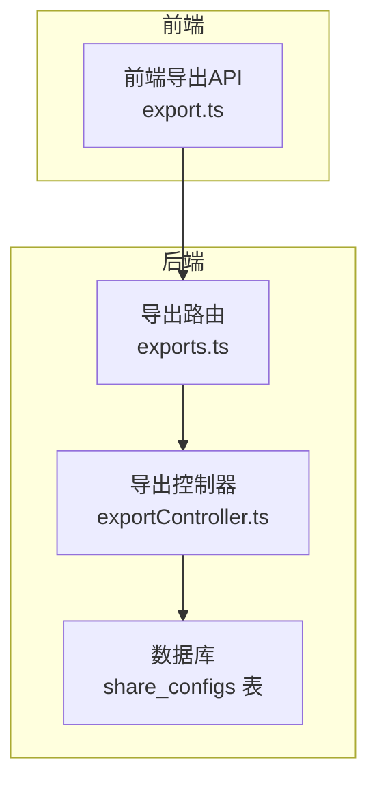
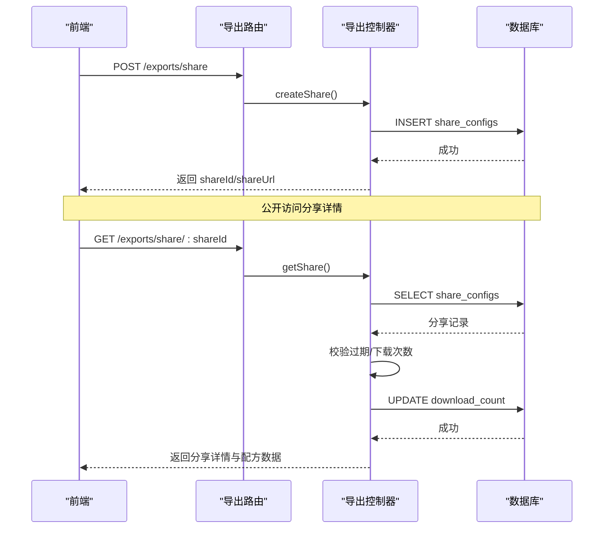
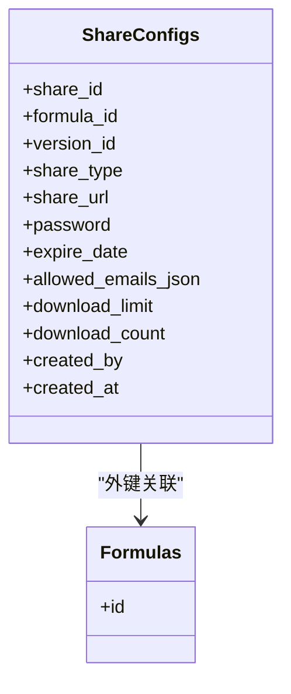

# 分享配置表 (share_configs)

<cite>
**本文档引用的文件**
- [DATABASE_DOC.md](file://backend/DATABASE_DOC.md)
- [init.sql](file://backend/src/scripts/init.sql)
- [exportController.ts](file://backend/src/controllers/exportController.ts)
- [exports.ts](file://backend/src/routes/exports.ts)
- [helpers.ts](file://backend/src/utils/helpers.ts)
- [export.ts](file://frontend/src/api/export.ts)
</cite>

## 目录
1. [简介](#简介)
2. [项目结构与定位](#项目结构与定位)
3. [核心组件概览](#核心组件概览)
4. [架构总览](#架构总览)
5. [详细组件分析](#详细组件分析)
6. [依赖关系分析](#依赖关系分析)
7. [性能与扩展性考量](#性能与扩展性考量)
8. [故障排查指南](#故障排查指南)
9. [结论](#结论)
10. [附录](#附录)

## 简介
分享配置表（share_configs）用于存储配方分享的配置信息，支持三种分享类型（链接/邮件/API），并提供密码保护、过期时间控制、下载次数限制以及允许邮箱白名单等访问控制能力。该表与配方主表（formulas）建立外键关联，并通过公开路由对外提供分享访问能力。

## 项目结构与定位
- 数据库层：share_configs 表在初始化脚本中定义，包含字段、约束与索引。
- 控制器层：导出控制器提供创建分享与公开获取分享详情的能力。
- 路由层：导出路由对分享相关接口进行暴露，其中分享获取接口为公开访问。
- 前端层：导出 API 提供创建分享的请求封装。

图表来源
- [exports.ts:1-34](file://backend/src/routes/exports.ts#L1-L34)
- [exportController.ts:107-185](file://backend/src/controllers/exportController.ts#L107-L185)
- [init.sql:150-166](file://backend/src/scripts/init.sql#L150-L166)

章节来源
- [exports.ts:1-34](file://backend/src/routes/exports.ts#L1-L34)
- [exportController.ts:107-185](file://backend/src/controllers/exportController.ts#L107-L185)
- [init.sql:150-166](file://backend/src/scripts/init.sql#L150-L166)

## 核心组件概览
- 表名：share_configs
- 主要职责：维护分享配置、访问控制与统计信息
- 关联表：formulas（外键，级联删除）
- 索引：按 formula_id 建立索引以优化查询

章节来源
- [DATABASE_DOC.md:248-271](file://backend/DATABASE_DOC.md#L248-L271)
- [init.sql:150-166](file://backend/src/scripts/init.sql#L150-L166)

## 架构总览
分享流程从创建分享开始，随后通过公开路由访问分享详情。系统在访问时执行过期校验、下载次数校验，并更新下载计数。

图表来源
- [exports.ts:25-33](file://backend/src/routes/exports.ts#L25-L33)
- [exportController.ts:119-185](file://backend/src/controllers/exportController.ts#L119-L185)
- [init.sql:150-166](file://backend/src/scripts/init.sql#L150-L166)

## 详细组件分析

### 字段定义与业务含义
- share_id
  - 类型：TEXT
  - 约束：PRIMARY KEY
  - 说明：分享记录唯一标识，采用应用层生成的非 UUID 标识
  - 生成策略：时间戳 + 随机字符串
- formula_id
  - 类型：TEXT
  - 约束：NOT NULL，外键 → formulas.id，ON DELETE CASCADE
  - 说明：关联的配方 ID
- version_id
  - 类型：TEXT
  - 约束：NULL
  - 说明：可选的版本 ID，未设置时表示使用最新版本
- share_type
  - 类型：TEXT
  - 约束：NOT NULL，默认 'link'，CHECK('link','email','api')
  - 说明：分享类型，支持链接、邮件、API 三种模式
- share_url
  - 类型：TEXT
  - 约束：NULL
  - 说明：分享访问 URL（公开路由中的路径片段）
- password
  - 类型：TEXT
  - 约束：NULL
  - 说明：访问密码（数据库中存储明文，建议前端加密或仅在传输中保护）
- expire_date
  - 类型：TEXT
  - 约束：NULL
  - 说明：过期时间（ISO 8601 字符串）
- allowed_emails_json
  - 类型：TEXT
  - 约束：NULL
  - 说明：允许访问的邮箱列表（JSON 数组）
- download_limit
  - 类型：INTEGER
  - 约束：NULL
  - 说明：最大下载次数限制
- download_count
  - 类型：INTEGER
  - 约束：NOT NULL，默认 0
  - 说明：当前已下载次数
- created_by
  - 类型：TEXT
  - 约束：NOT NULL
  - 说明：创建人（用户 ID）
- created_at
  - 类型：TEXT
  - 约束：NOT NULL
  - 说明：创建时间（ISO 8601）

章节来源
- [DATABASE_DOC.md:248-271](file://backend/DATABASE_DOC.md#L248-L271)
- [init.sql:150-166](file://backend/src/scripts/init.sql#L150-L166)
- [exportController.ts:119-185](file://backend/src/controllers/exportController.ts#L119-L185)

### 外键关系与索引设计
- 外键
  - formula_id → formulas(id)，ON DELETE CASCADE
- 索引
  - idx_sc_formula(formula_id)：加速按配方维度的查询与统计

章节来源
- [DATABASE_DOC.md:267-269](file://backend/DATABASE_DOC.md#L267-L269)
- [init.sql:166](file://backend/src/scripts/init.sql#L166)

### 分享类型与访问控制机制
- 分享类型（share_type）
  - link：公开链接分享，适合临时共享
  - email：邮件分享，结合 allowed_emails_json 实现白名单访问
  - api：API 分享，便于系统间集成
- 访问控制
  - 过期控制：若 expire_date 存在且已过期，则返回“链接已过期”
  - 下载次数控制：若 download_limit 存在且 download_count 达到上限，则返回“下载次数已达上限”
  - 下载计数：每次成功访问后，download_count 自增
  - 邮箱白名单：allowed_emails_json 为 JSON 数组，用于限定可访问邮箱范围

章节来源
- [DATABASE_DOC.md:257](file://backend/DATABASE_DOC.md#L257)
- [exportController.ts:140-185](file://backend/src/controllers/exportController.ts#L140-L185)

### 密码保护、过期时间与下载限制实现机制
- 密码保护
  - 字段 password 存储明文，建议在传输层使用 HTTPS 并在应用层对密码进行哈希处理
- 过期时间
  - expire_date 为 ISO 8601 字符串；访问时比较当前时间与过期时间
- 下载限制
  - download_limit 为整数；访问前检查 download_count 与 download_limit 的关系，成功访问后更新计数

章节来源
- [exportController.ts:140-185](file://backend/src/controllers/exportController.ts#L140-L185)

### 完整 JSON 示例
- 分享配置示例（字段映射）
  - share_id: "分享唯一标识"
  - formula_id: "配方ID"
  - version_id: "版本ID（可选）"
  - share_type: "link|email|api"
  - share_url: "/share/{share_id}"
  - password: "密码（可选）"
  - expire_date: "ISO 8601 时间"
  - allowed_emails_json: "[\"user@example.com\"]"
  - download_limit: 10
  - download_count: 3
  - created_by: "用户ID"
  - created_at: "ISO 8601 时间"

章节来源
- [DATABASE_DOC.md:248-271](file://backend/DATABASE_DOC.md#L248-L271)

### 安全考虑
- 密码存储：当前字段存储明文，建议改为哈希存储并在传输层强制 HTTPS
- 访问控制：结合 allowed_emails_json 与过期时间，避免未授权访问
- 下载限制：合理设置 download_limit，防止滥用
- 路由安全：分享获取接口为公开访问，需确保分享内容不涉及敏感信息

章节来源
- [exportController.ts:140-185](file://backend/src/controllers/exportController.ts#L140-L185)

## 依赖关系分析
- 控制器依赖
  - 使用数据库查询与事务更新
  - 使用工具函数进行 ID 生成、时间格式化与 JSON 解析
- 路由依赖
  - 导出路由对分享接口进行暴露，其中分享获取接口为公开访问
- 前端依赖
  - 前端导出 API 封装了创建分享的请求

图表来源
- [init.sql:150-166](file://backend/src/scripts/init.sql#L150-L166)
- [DATABASE_DOC.md:267](file://backend/DATABASE_DOC.md#L267)

章节来源
- [exportController.ts:119-185](file://backend/src/controllers/exportController.ts#L119-L185)
- [exports.ts:25-33](file://backend/src/routes/exports.ts#L25-L33)
- [helpers.ts:3-11](file://backend/src/utils/helpers.ts#L3-L11)

## 性能与扩展性考量
- 查询性能
  - 建议在 formula_id 上保持索引，以提升按配方维度的查询效率
- 写入性能
  - 分享创建为单条插入，写入成本低
- 访问性能
  - 下载计数更新为单行更新，影响较小
- 扩展方向
  - 可增加分享统计表，分离高频读取与写入
  - 可引入缓存层，减少重复查询

章节来源
- [DATABASE_DOC.md:269](file://backend/DATABASE_DOC.md#L269)
- [init.sql:166](file://backend/src/scripts/init.sql#L166)

## 故障排查指南
- 分享不存在
  - 现象：返回“分享不存在”
  - 排查：确认 share_id 是否正确
- 分享已过期
  - 现象：返回“分享链接已过期”
  - 排查：检查 expire_date 是否早于当前时间
- 下载次数已达上限
  - 现象：返回“下载次数已达上限”
  - 排查：检查 download_limit 与 download_count 的关系
- 数据库约束错误
  - 现象：创建分享时报错
  - 排查：检查外键、CHECK 约束与字段类型

章节来源
- [exportController.ts:140-185](file://backend/src/controllers/exportController.ts#L140-L185)

## 结论
share_configs 表提供了灵活的分享能力，支持多种分享类型与访问控制策略。通过过期时间、下载次数限制与邮箱白名单等机制，可在保证易用性的同时提升安全性与可控性。建议在生产环境中强化密码存储与传输安全，并根据业务规模评估是否引入缓存与统计表以优化性能。

## 附录
- 字段与类型对照
  - share_id: TEXT（主键）
  - formula_id: TEXT（外键）
  - version_id: TEXT（可空）
  - share_type: TEXT（枚举）
  - share_url: TEXT（可空）
  - password: TEXT（可空）
  - expire_date: TEXT（可空）
  - allowed_emails_json: TEXT（可空）
  - download_limit: INTEGER（可空）
  - download_count: INTEGER（默认 0）
  - created_by: TEXT（必填）
  - created_at: TEXT（必填）

章节来源
- [DATABASE_DOC.md:248-271](file://backend/DATABASE_DOC.md#L248-L271)
- [init.sql:150-166](file://backend/src/scripts/init.sql#L150-L166)