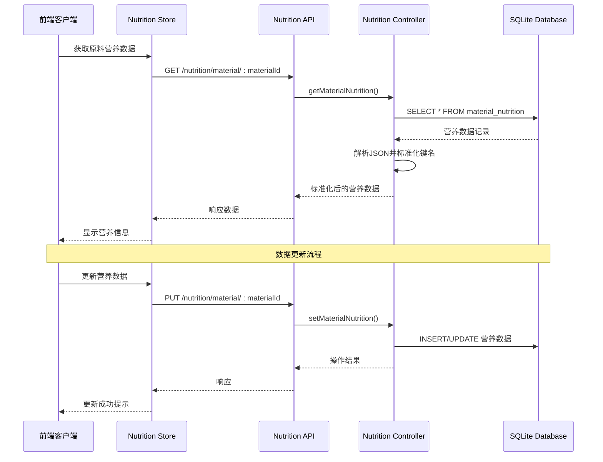
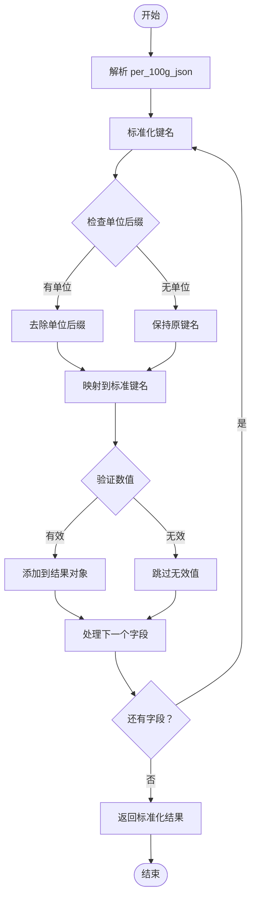
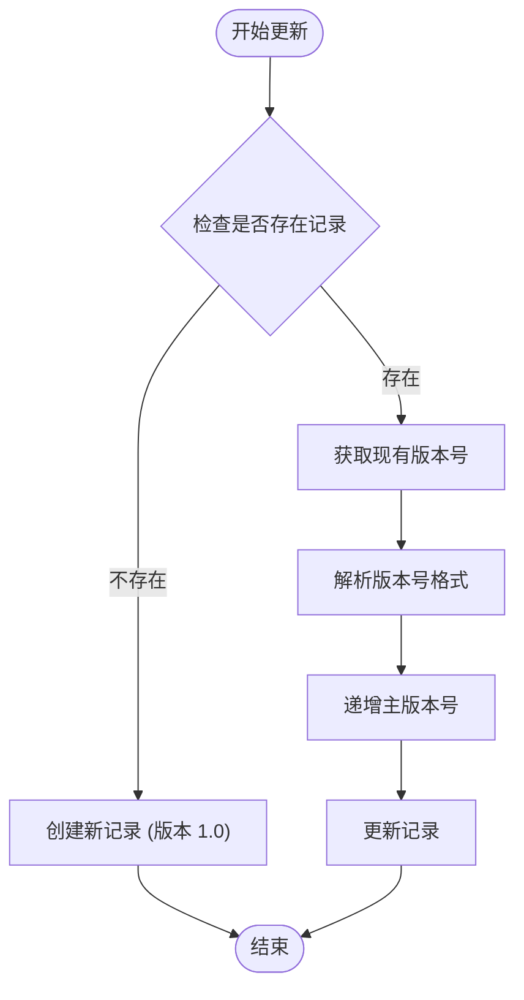
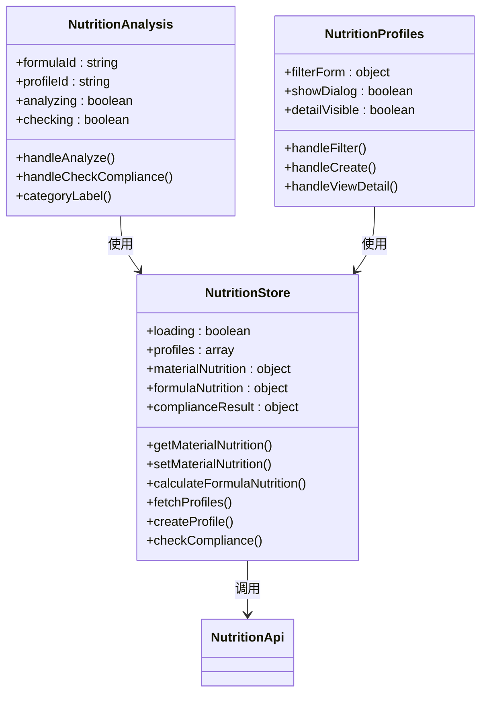
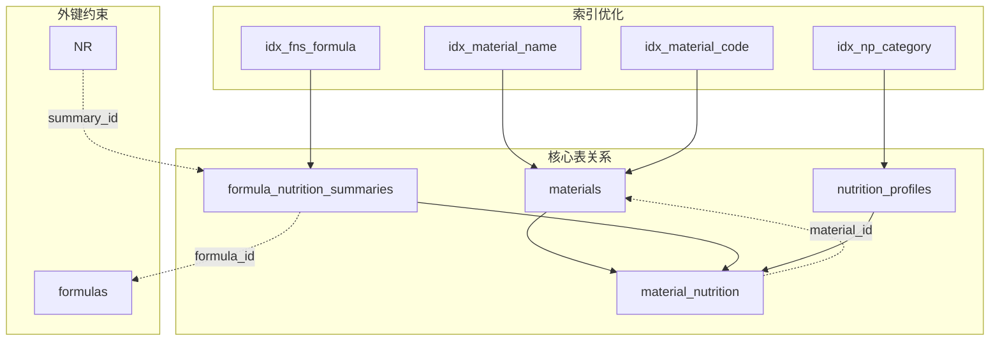
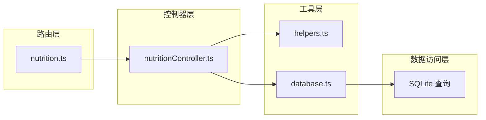

# 原料营养成分表 (material_nutrition)

<cite>
**本文档引用的文件**
- [DATABASE_DOC.md](file://backend/DATABASE_DOC.md)
- [init.sql](file://backend/src/scripts/init.sql)
- [nutritionController.ts](file://backend/src/controllers/nutritionController.ts)
- [nutrition.ts](file://backend/src/routes/nutrition.ts)
- [helpers.ts](file://backend/src/utils/helpers.ts)
- [importNutritionData.ts](file://backend/src/scripts/importNutritionData.ts)
- [seedData.ts](file://backend/src/scripts/seedData.ts)
- [NutritionAnalysis.vue](file://frontend/src/views/nutrition/NutritionAnalysis.vue)
- [NutritionProfiles.vue](file://frontend/src/views/nutrition/NutritionProfiles.vue)
- [nutrition.ts](file://frontend/src/stores/nutrition.ts)
- [nutrition.ts](file://frontend/src/api/nutrition.ts)
</cite>

## 目录
1. [简介](#简介)
2. [项目结构](#项目结构)
3. [核心组件](#核心组件)
4. [架构概览](#架构概览)
5. [详细组件分析](#详细组件分析)
6. [依赖关系分析](#依赖关系分析)
7. [性能考虑](#性能考虑)
8. [故障排除指南](#故障排除指南)
9. [结论](#结论)
10. [附录](#附录)

## 简介

原料营养成分表 (material_nutrition) 是 TingStudio 配方管理系统中的核心数据表之一，专门用于存储每种原料的营养成分数据。该表采用每100克含量的标准表示方法，为配方的营养分析和合规性检查提供了基础数据支撑。

本表的设计遵循了以下核心原则：
- **标准化存储**：统一使用每100克作为营养成分的基准单位
- **版本化管理**：支持营养数据的版本追踪和更新历史
- **灵活扩展**：通过JSON字段支持营养成分的动态扩展
- **数据完整性**：通过外键约束确保数据的一致性和完整性

## 项目结构

TingStudio 项目采用前后端分离的架构设计，原料营养成分表位于后端数据库中，通过RESTful API与前端应用交互。

```mermaid
graph TB
subgraph "前端应用 (Vue.js)"
FA[NutritionAnalysis.vue]
FP[NutritionProfiles.vue]
FS[nutrition.ts (Store)]
FA --> FS
FP --> FS
end
subgraph "后端服务 (Node.js)"
RC[nutritionController.ts]
RR[nutrition.ts (Routes)]
DB[SQLite 数据库]
RC --> DB
RR --> RC
end
subgraph "数据库表"
MN[material_nutrition]
MT[materials]
FN[formula_nutrition_summaries]
NP[nutrition_profiles]
end
FS --> RR
RR --> RC
RC --> MN
MN --> MT
MN --> FN
MN --> NP
```

**图表来源**
- [nutrition.ts:1-31](file://backend/src/routes/nutrition.ts#L1-L31)
- [nutritionController.ts:1-641](file://backend/src/controllers/nutritionController.ts#L1-L641)
- [init.sql:172-182](file://backend/src/scripts/init.sql#L172-L182)

**章节来源**
- [DATABASE_DOC.md:273-322](file://backend/DATABASE_DOC.md#L273-L322)
- [init.sql:172-182](file://backend/src/scripts/init.sql#L172-L182)

## 核心组件

### 数据表结构

原料营养成分表包含以下核心字段：

| 字段名 | 数据类型 | 约束条件 | 说明 |
|--------|----------|----------|------|
| nutrition_id | TEXT | PRIMARY KEY | 营养记录唯一标识符 |
| material_id | TEXT | NOT NULL, UNIQUE, FK | 原料ID（一对一关系） |
| per_100g_json | TEXT | NOT NULL | 每100克营养成分JSON数据 |
| data_version | TEXT | NOT NULL, DEFAULT '1.0' | 数据版本号 |
| data_source | TEXT | NULL | 数据来源信息 |
| notes | TEXT | NULL | 备注说明 |
| last_updated | TEXT | NOT NULL | 最后更新时间 |

### 外键关系

```mermaid
erDiagram
MATERIALS ||--|| MATERIAL_NUTRITION : "一对一"
MATERIALS {
text id PK
text name
text code
text unit
real stock
text material_type
real ratio_factor
text created_by
text created_at
text updated_at
}
MATERIAL_NUTRITION {
text nutrition_id PK
text material_id UK FK
text per_100g_json
text data_version
text data_source
text notes
text last_updated
}
```

**图表来源**
- [init.sql:172-182](file://backend/src/scripts/init.sql#L172-L182)
- [DATABASE_DOC.md:273-287](file://backend/DATABASE_DOC.md#L273-L287)

**章节来源**
- [DATABASE_DOC.md:273-287](file://backend/DATABASE_DOC.md#L273-L287)
- [init.sql:172-182](file://backend/src/scripts/init.sql#L172-L182)

## 架构概览

### 数据流架构



**图表来源**
- [nutrition.ts:17-19](file://backend/src/routes/nutrition.ts#L17-L19)
- [nutritionController.ts:55-121](file://backend/src/controllers/nutritionController.ts#L55-L121)

### 营养数据标准化流程



**图表来源**
- [nutritionController.ts:16-44](file://backend/src/controllers/nutritionController.ts#L16-L44)

**章节来源**
- [nutritionController.ts:55-121](file://backend/src/controllers/nutritionController.ts#L55-L121)

## 详细组件分析

### per_100g_json 字段设计

per_100g_json 字段是整个表的核心，采用JSON格式存储每100克原料的营养成分数据。该字段支持多种营养素的存储，包括宏量营养素、微量营养素和维生素类。

#### 营养素分类与定义

| 分类 | 营养素名称 | 单位 | 用途 |
|------|------------|------|------|
| 能量 | energy | 千焦(kJ) | 基础代谢和活动消耗 |
| 宏量营养素 | protein | 克(g) | 蛋白质合成和组织修复 |
| 宏量营养素 | fat | 克(g) | 脂肪酸和能量储存 |
| 宏量营养素 | carbohydrate | 克(g) | 碳水化合物和快速能量 |
| 膳食纤维 | fiber | 克(g) | 消化健康和饱腹感 |
| 糖类 | sugars | 克(g) | 快速糖分来源 |
| 矿物质 | sodium | 毫克(mg) | 电解质平衡 |
| 矿物质 | potassium | 毫克(mg) | 细胞功能 |
| 矿物质 | calcium | 毫克(mg) | 骨骼健康 |
| 矿物质 | iron | 毫克(mg) | 血红蛋白合成 |
| 矿物质 | zinc | 毫克(mg) | 免疫功能 |
| 矿物质 | magnesium | 毫克(mg) | 酶反应辅助 |
| 矿物质 | phosphorus | 毫克(mg) | 骨骼和牙齿 |
| 维生素类 | vitaminA | 微克(μg) | 视觉和免疫 |
| 维生素类 | vitaminC | 毫克(mg) | 抗氧化和胶原蛋白 |
| 维生素类 | vitaminD | 微克(μg) | 钙吸收 |
| 维生素类 | vitaminE | 毫克(mg) | 抗氧化 |
| 维生素类 | vitaminK | 微克(μg) | 凝血功能 |
| 维生素类 | vitaminB1 | 毫克(mg) | 能量代谢 |
| 维生素类 | vitaminB2 | 毫克(mg) | 细胞呼吸 |
| 维生素类 | vitaminB3 | 毫克(mg) | 能量产生 |
| 维生素类 | vitaminB6 | 毫克(mg) | 蛋白质代谢 |
| 维生素类 | vitaminB12 | 微克(μg) | 红细胞形成 |
| 维生素类 | folate | 微克(μg) | DNA合成 |
| 胆固醇 | cholesterol | 毫克(mg) | 胆固醇水平 |
| 脂肪酸 | transFat | 克(g) | 反式脂肪酸 |
| 脂肪酸 | saturatedFat | 克(g) | 饱和脂肪酸 |

#### JSON 结构示例

```json
{
  "energy": 1500,
  "protein": 5.0,
  "fat": 1.0,
  "carbohydrate": 70.0,
  "fiber": 0.5,
  "sugars": 0,
  "sodium": 50.0,
  "potassium": 100,
  "calcium": 20.0,
  "iron": 0.5,
  "zinc": 0.3,
  "magnesium": 10,
  "phosphorus": 50,
  "vitaminA": 200,
  "vitaminC": 0.1,
  "vitaminD": 0,
  "vitaminE": 0.5,
  "vitaminK": 0,
  "vitaminB1": 0.01,
  "vitaminB2": 0.02,
  "vitaminB3": 0.1,
  "vitaminB6": 0.01,
  "vitaminB12": 0,
  "folate": 5,
  "cholesterol": 0,
  "transFat": 0,
  "saturatedFat": 0.3
}
```

**章节来源**
- [DATABASE_DOC.md:289-320](file://backend/DATABASE_DOC.md#L289-L320)
- [nutritionController.ts:7-13](file://backend/src/controllers/nutritionController.ts#L7-L13)

### 数据版本管理机制

#### 版本号生成策略

当更新原料营养数据时，系统会自动递增版本号：



**图表来源**
- [nutritionController.ts:96-115](file://backend/src/controllers/nutritionController.ts#L96-L115)

#### 版本号格式规范

- **格式**：`主版本号.次版本号`
- **默认值**：首次创建为 `1.0`
- **更新规则**：每次更新时递增主版本号
- **示例**：`1.0` → `2.0` → `3.0` ...

**章节来源**
- [nutritionController.ts:96-115](file://backend/src/controllers/nutritionController.ts#L96-L115)

### 数据来源追踪机制

#### 数据源字段设计

data_source 字段用于记录营养数据的来源信息，支持以下格式：

- **文件来源**：`nutrition1.xls / nutrition2.xls 配方营养计算表`
- **数据库导入**：`Excel 导入: 2024-01-15`
- **手动输入**：`配方师录入: 张三`
- **第三方API**：`Nutritionix API v2.0`

#### 备注字段用途

notes 字段提供额外的说明信息，包括：
- 数据质量评估
- 测试批次标识
- 特殊注意事项
- 数据验证结果

**章节来源**
- [DATABASE_DOC.md:282-283](file://backend/DATABASE_DOC.md#L282-L283)
- [nutritionController.ts:96-115](file://backend/src/controllers/nutritionController.ts#L96-L115)

### 前端集成实现

#### Vue.js 组件集成

前端通过 NutritionAnalysis.vue 和 NutritionProfiles.vue 组件与后端 API 交互：



**图表来源**
- [NutritionAnalysis.vue:124-218](file://frontend/src/views/nutrition/NutritionAnalysis.vue#L124-L218)
- [NutritionProfiles.vue:113-218](file://frontend/src/views/nutrition/NutritionProfiles.vue#L113-L218)
- [nutrition.ts:6-99](file://frontend/src/stores/nutrition.ts#L6-L99)

**章节来源**
- [NutritionAnalysis.vue:124-218](file://frontend/src/views/nutrition/NutritionAnalysis.vue#L124-L218)
- [NutritionProfiles.vue:113-218](file://frontend/src/views/nutrition/NutritionProfiles.vue#L113-L218)
- [nutrition.ts:6-99](file://frontend/src/stores/nutrition.ts#L6-L99)

## 依赖关系分析

### 数据库依赖关系



**图表来源**
- [init.sql:172-182](file://backend/src/scripts/init.sql#L172-L182)
- [init.sql:184-198](file://backend/src/scripts/init.sql#L184-L198)
- [init.sql:200-212](file://backend/src/scripts/init.sql#L200-L212)

### 控制器依赖关系



**图表来源**
- [nutrition.ts:1-31](file://backend/src/routes/nutrition.ts#L1-L31)
- [nutritionController.ts:1-6](file://backend/src/controllers/nutritionController.ts#L1-L6)
- [helpers.ts:1-86](file://backend/src/utils/helpers.ts#L1-L86)

**章节来源**
- [nutrition.ts:1-31](file://backend/src/routes/nutrition.ts#L1-L31)
- [nutritionController.ts:1-6](file://backend/src/controllers/nutritionController.ts#L1-L6)
- [helpers.ts:1-86](file://backend/src/utils/helpers.ts#L1-L86)

## 性能考虑

### 查询优化策略

1. **索引使用**
   - material_nutrition 表的 material_id 字段具有唯一索引
   - formula_nutrition_summaries 表对 formula_id 建有索引
   - nutrition_profiles 表对 category 建有索引

2. **JSON 字段处理**
   - 使用安全的 JSON 解析函数避免解析错误
   - 标准化键名时使用映射表提高性能
   - 缓存常用的营养素映射关系

3. **批量操作**
   - 支持批量获取原料营养数据
   - 避免重复的数据库查询
   - 使用预编译语句减少SQL解析开销

### 内存管理

- JSON 数据在内存中进行解析和缓存
- 标准化后的数据结构进行复用
- 及时清理不再使用的中间变量

## 故障排除指南

### 常见问题及解决方案

#### 1. 营养数据解析错误

**问题症状**：
- 前端显示营养数据为空
- 控制器抛出 JSON 解析异常

**解决步骤**：
1. 检查 per_100g_json 字段的 JSON 格式
2. 验证营养素键名是否符合标准格式
3. 确认数值类型是否为数字而非字符串

**章节来源**
- [helpers.ts:77-85](file://backend/src/utils/helpers.ts#L77-L85)
- [nutritionController.ts:36-44](file://backend/src/controllers/nutritionController.ts#L36-L44)

#### 2. 版本号更新异常

**问题症状**：
- 营养数据更新后版本号未变化
- 数据库中出现重复版本号

**解决步骤**：
1. 检查现有版本号格式是否正确
2. 验证版本号解析逻辑
3. 确认数据库更新语句执行成功

**章节来源**
- [nutritionController.ts:96-115](file://backend/src/controllers/nutritionController.ts#L96-L115)

#### 3. 外键约束冲突

**问题症状**：
- 删除原料时报外键约束错误
- 更新原料ID时报约束冲突

**解决步骤**：
1. 检查 material_nutrition 表中是否存在对应的营养数据
2. 确认删除操作前先清理相关营养数据
3. 验证外键级联删除设置

**章节来源**
- [init.sql:181](file://backend/src/scripts/init.sql#L181)

## 结论

原料营养成分表 (material_nutrition) 作为 TingStudio 配方管理系统的核心数据表，其设计体现了现代营养数据分析系统的最佳实践。通过标准化的每100克营养数据存储、完善的版本管理机制和灵活的数据来源追踪，该表为配方的营养分析、合规性检查和质量控制提供了坚实的数据基础。

### 主要优势

1. **标准化存储**：统一的每100克基准单位简化了营养数据的比较和计算
2. **版本化管理**：支持营养数据的历史追踪和版本演进
3. **灵活扩展**：JSON 格式的营养数据支持未来营养素的动态扩展
4. **数据完整性**：严格的外键约束确保了数据的一致性和完整性
5. **前后端集成**：完整的 API 接口和前端组件实现了无缝的数据交互

### 应用场景

该表广泛应用于以下场景：
- 配方营养成分计算
- 营养标准合规性检查
- 原料质量评估和监控
- 营养数据分析和报告生成
- 配方优化和调整建议

## 附录

### API 接口规范

#### 获取原料营养数据
- **URL**: `/nutrition/material/:materialId`
- **方法**: GET
- **认证**: 需要登录
- **响应**: 标准化的营养数据对象

#### 设置/更新原料营养数据
- **URL**: `/nutrition/material/:materialId`
- **方法**: PUT
- **认证**: 需要登录
- **请求体**: 包含 per100g、dataSource、notes 字段的对象
- **响应**: 操作结果状态

#### 计算配方营养汇总
- **URL**: `/nutrition/calculate/:formulaId`
- **方法**: POST
- **认证**: 需要登录
- **响应**: 配方的营养汇总结果

**章节来源**
- [nutrition.ts:17-30](file://backend/src/routes/nutrition.ts#L17-L30)
- [nutrition.ts:15-37](file://frontend/src/api/nutrition.ts#L15-L37)

### 数据导入脚本

系统提供了多种数据导入方式：

1. **Excel 导入**：通过 importNutritionData.ts 脚本批量导入营养数据
2. **种子数据**：通过 seedData.ts 脚本创建测试数据
3. **手动录入**：通过前端界面手动输入营养数据

**章节来源**
- [importNutritionData.ts:133-170](file://backend/src/scripts/importNutritionData.ts#L133-L170)
- [seedData.ts:359-365](file://backend/src/scripts/seedData.ts#L359-L365)