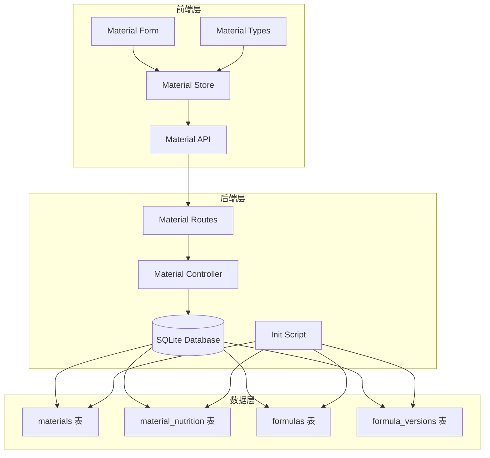
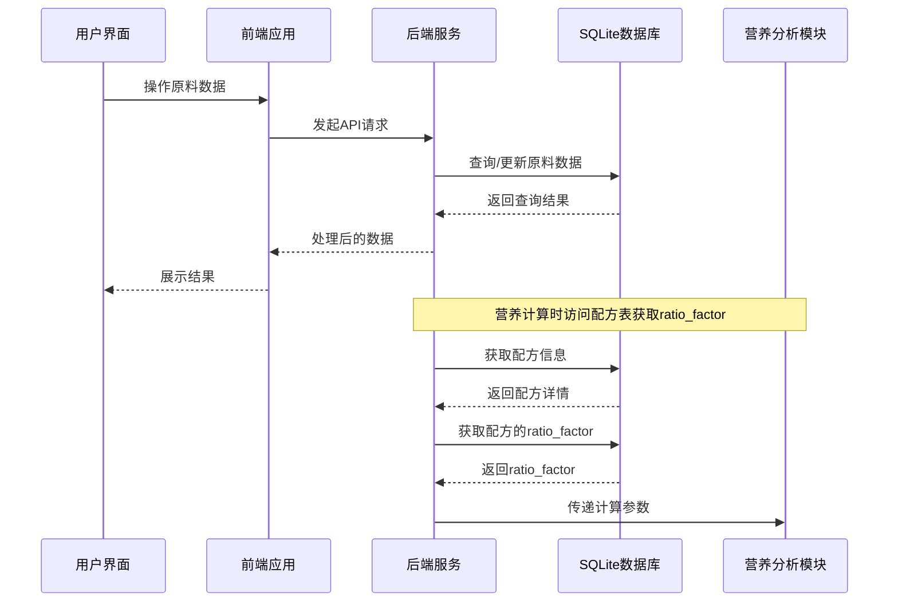
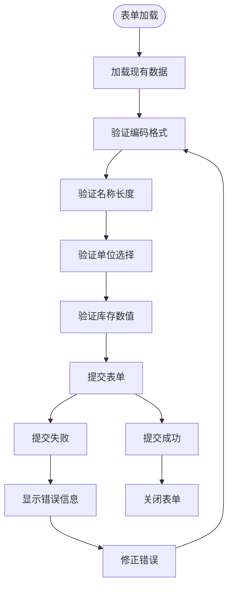
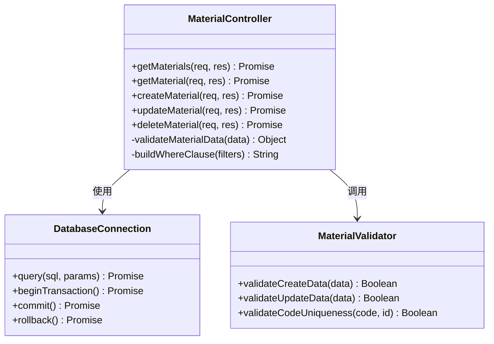
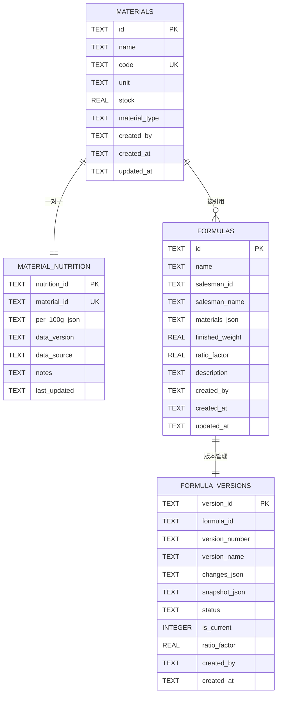
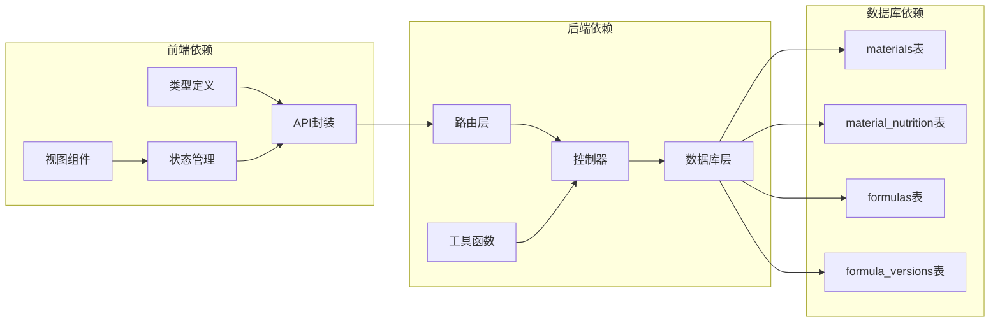
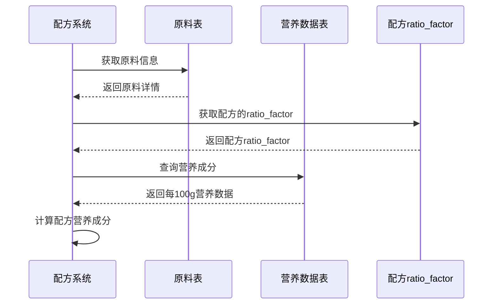

# 原料表 (materials)

<cite>
**本文档引用的文件**
- [DATABASE_DOC.md](file://backend/DATABASE_DOC.md)
- [init.sql](file://backend/src/scripts/init.sql)
- [materialController.ts](file://backend/src/controllers/materialController.ts)
- [materials.ts](file://backend/src/routes/materials.ts)
- [material.ts](file://frontend/src/types/material.ts)
- [material.ts](file://frontend/src/api/material.ts)
- [material.ts](file://frontend/src/stores/material.ts)
- [MaterialForm.vue](file://frontend/src/views/materials/MaterialForm.vue)
- [nutritionController.ts](file://backend/src/controllers/nutritionController.ts)
- [seedData.ts](file://backend/src/scripts/seedData.ts)
- [migrate-ratio-factor.ts](file://backend/src/scripts/migrate-ratio-factor.ts)
</cite>

## 更新摘要
**变更内容**
- 更新了原料表字段定义，移除了 `ratio_factor` 字段
- 新增了配方表和版本表中 `ratio_factor` 字段的说明
- 更新了营养计算流程，说明 `ratio_factor` 现在存储在配方表中
- 添加了数据库迁移脚本的说明
- 更新了相关业务逻辑和架构图

## 目录
1. [简介](#简介)
2. [项目结构](#项目结构)
3. [核心组件](#核心组件)
4. [架构概览](#架构概览)
5. [详细组件分析](#详细组件分析)
6. [依赖分析](#依赖分析)
7. [性能考虑](#性能考虑)
8. [故障排除指南](#故障排除指南)
9. [结论](#结论)
10. [附录](#附录)

## 简介

原料表 (materials) 是 TingStudio 配方管理系统中的核心数据表之一，用于存储配方所需的各类原料信息。该表不仅承载着基本的原料属性数据，还与营养分析模块紧密关联，为配方的营养成分计算提供关键数据支撑。

在系统中，原料表承担着以下重要职责：
- 存储原料的基本信息（名称、编码、计量单位、库存等）
- 支持原料类型的分类管理（中药材 vs 营养补充剂）
- 作为营养数据表的主表，建立一对一的关系
- 支持配方系统的原料选择和用量管理

**重要变更**：`ratio_factor` 字段已从原料表移除，现在存储在配方表和版本表中，用于配方级别的营养计算。

## 项目结构

原料表相关的代码分布在前后端多个层次中，形成了完整的数据管理架构：



**图表来源**
- [material.ts:1-45](file://frontend/src/api/material.ts#L1-L45)
- [material.ts:1-130](file://frontend/src/stores/material.ts#L1-L130)
- [materials.ts:1-22](file://backend/src/routes/materials.ts#L1-L22)
- [materialController.ts:1-129](file://backend/src/controllers/materialController.ts#L1-L129)
- [init.sql:17-31](file://backend/src/scripts/init.sql#L17-L31)

**章节来源**
- [material.ts:1-45](file://frontend/src/api/material.ts#L1-L45)
- [material.ts:1-130](file://frontend/src/stores/material.ts#L1-L130)
- [materials.ts:1-22](file://backend/src/routes/materials.ts#L1-L22)
- [materialController.ts:1-129](file://backend/src/controllers/materialController.ts#L1-L129)

## 核心组件

### 数据库表结构

原料表采用 SQLite 作为底层存储，具有以下核心特征：

| 组件 | 描述 | 默认值 |
|------|------|--------|
| **主键** | `id` | 自动生成 |
| **唯一约束** | `code` | 唯一性保证 |
| **索引** | `idx_material_name`, `idx_material_code` | 性能优化 |
| **外键** | `created_by` → `users.id` | 用户关联 |

### 字段详细说明

#### 基础字段
- **id**: 原料唯一标识符，采用自动生成策略
- **name**: 原料名称，必填字段
- **code**: 原料编码，采用 MAT+序号的命名规则（如 MAT001），全局唯一
- **unit**: 计量单位，默认为 'g'，支持多种单位类型

#### 业务字段
- **stock**: 当前库存数量，默认 0
- **material_type**: 原料类型，支持 'herb' 和 'supplement' 两种类型

#### 系统字段
- **created_by**: 创建人标识，关联用户表
- **created_at**: 创建时间，默认当前时间
- **updated_at**: 更新时间，默认当前时间

**重要变更**：`ratio_factor` 字段已从原料表移除，现在存储在配方表和版本表中。

**章节来源**
- [DATABASE_DOC.md:44-65](file://backend/DATABASE_DOC.md#L44-L65)
- [init.sql:17-31](file://backend/src/scripts/init.sql#L17-L31)

## 架构概览

原料表在整个系统架构中扮演着承上启下的关键角色，连接着前端展示层、后端业务逻辑层和数据库存储层：



**图表来源**
- [material.ts:25-44](file://frontend/src/api/material.ts#L25-L44)
- [materialController.ts:6-38](file://backend/src/controllers/materialController.ts#L6-L38)
- [nutritionController.ts:434-447](file://backend/src/controllers/nutritionController.ts#L434-L447)

**章节来源**
- [material.ts:1-45](file://frontend/src/api/material.ts#L1-L45)
- [materialController.ts:1-129](file://backend/src/controllers/materialController.ts#L1-L129)

## 详细组件分析

### 前端组件分析

#### MaterialForm.vue 表单组件
前端表单组件提供了完整的原料数据输入和验证功能：



**图表来源**
- [MaterialForm.vue:125-136](file://frontend/src/views/materials/MaterialForm.vue#L125-L136)
- [MaterialForm.vue:142-165](file://frontend/src/views/materials/MaterialForm.vue#L142-L165)

#### MaterialStore 状态管理
Pinia 状态管理器负责管理原料数据的生命周期：

| 功能 | 方法 | 描述 |
|------|------|------|
| 列表获取 | `fetchMaterials()` | 获取分页的原料列表 |
| 单项获取 | `getMaterial(id)` | 获取指定ID的原料详情 |
| 创建操作 | `createMaterial(form)` | 创建新的原料记录 |
| 更新操作 | `updateMaterial(id, form)` | 更新现有原料信息 |
| 删除操作 | `deleteMaterial(id)` | 删除指定原料记录 |
| 全量获取 | `fetchAllForSelect()` | 获取所有原料用于下拉选择 |

**章节来源**
- [MaterialForm.vue:1-204](file://frontend/src/views/materials/MaterialForm.vue#L1-L204)
- [material.ts:1-130](file://frontend/src/stores/material.ts#L1-L130)

### 后端组件分析

#### 材料控制器 (MaterialController)
后端控制器实现了完整的 CRUD 操作：



**图表来源**
- [materialController.ts:6-129](file://backend/src/controllers/materialController.ts#L6-L129)

#### 路由配置
RESTful API 路由设计遵循标准规范：

| HTTP方法 | 路径 | 描述 | 验证要求 |
|----------|------|------|----------|
| GET | `/materials` | 获取原料列表 | 认证中间件 |
| GET | `/materials/:id` | 获取单个原料 | 认证中间件 |
| POST | `/materials` | 创建新原料 | 认证 + 数据验证 |
| PUT | `/materials/:id` | 更新原料信息 | 认证中间件 |
| DELETE | `/materials/:id` | 删除原料 | 认证中间件 |

**章节来源**
- [materialController.ts:1-129](file://backend/src/controllers/materialController.ts#L1-L129)
- [materials.ts:1-22](file://backend/src/routes/materials.ts#L1-L22)

### 数据库设计分析

#### 索引设计
数据库为提高查询性能建立了专门的索引：



**图表来源**
- [init.sql:17-31](file://backend/src/scripts/init.sql#L17-L31)
- [init.sql:172-182](file://backend/src/scripts/init.sql#L172-L182)

#### 约束和校验
数据库层面实施了多重约束确保数据完整性：

| 约束类型 | 字段 | 约束条件 | 业务意义 |
|----------|------|----------|----------|
| 主键约束 | `id` | 自动递增 | 唯一标识原料 |
| 唯一约束 | `code` | 全局唯一 | 编码规范化 |
| 非空约束 | `name`, `code` | 必填 | 基本信息完整 |
| 默认值 | `unit='g'`, `stock=0` | 系统默认 | 数据一致性 |
| 检查约束 | `material_type IN ('herb','supplement')` | 限定枚举值 | 类型规范化 |
| 外键约束 | `created_by` → `users.id` | 用户关联 | 责任追踪 |

**重要变更**：`ratio_factor` 字段已从原料表移除，现在存储在配方表和版本表中，具有默认值 0.18。

**章节来源**
- [init.sql:17-31](file://backend/src/scripts/init.sql#L17-L31)
- [DATABASE_DOC.md:44-65](file://backend/DATABASE_DOC.md#L44-L65)

## 依赖分析

### 前后端依赖关系



**图表来源**
- [material.ts:1-30](file://frontend/src/types/material.ts#L1-L30)
- [material.ts:1-45](file://frontend/src/api/material.ts#L1-L45)
- [material.ts:1-130](file://frontend/src/stores/material.ts#L1-L130)
- [materialController.ts:1-129](file://backend/src/controllers/materialController.ts#L1-L129)

### 关联关系分析

#### 与营养数据的关联
原料表与营养数据表建立了一对一的关联关系：



**重要变更**：`ratio_factor` 现在存储在配方表中，营养计算时从配方表获取该值。

**图表来源**
- [nutritionController.ts:434-447](file://backend/src/controllers/nutritionController.ts#L434-L447)
- [nutritionController.ts:466-485](file://backend/src/controllers/nutritionController.ts#L466-L485)

#### 与配方系统的交互
原料数据在配方系统中发挥着关键作用：

| 交互场景 | 数据流向 | 业务价值 |
|----------|----------|----------|
| 配方创建 | 原料选择 → 配方保存 | 支持配方开发 |
| 营养计算 | 原料信息 + 配方ratio_factor → 营养分析 | 生成营养标签 |
| 库存管理 | 原料使用 → 库存更新 | 控制成本 |
| 报告生成 | 原料数据 → 导出报告 | 合规性证明 |

**章节来源**
- [nutritionController.ts:434-517](file://backend/src/controllers/nutritionController.ts#L434-L517)

## 性能考虑

### 查询优化
针对原料表的查询模式，系统采用了以下优化策略：

1. **索引优化**
   - `idx_material_name`: 支持按名称模糊查询
   - `idx_material_code`: 支持按编码精确查询
   - `idx_material_created_by`: 支持用户级数据隔离

2. **分页查询**
   - 支持大数据量的分页浏览
   - 避免一次性加载所有数据

3. **缓存策略**
   - 常用原料数据可进行内存缓存
   - 减少重复的数据库查询

### 存储优化
- 使用 SQLite 的 WAL 模式提高并发性能
- JSON 字段采用 TEXT 类型存储，便于灵活扩展
- 合理的数据类型选择减少存储空间占用

## 故障排除指南

### 常见问题及解决方案

#### 编码冲突问题
**问题描述**: 创建或更新原料时出现编码重复错误
**解决方案**: 
- 检查现有编码是否已被使用
- 修改编码格式确保唯一性
- 遵循 MAT+序号的命名规范

#### 数据验证错误
**问题描述**: 表单提交时出现数据验证失败
**解决步骤**:
1. 检查必填字段是否完整填写
2. 验证编码格式符合要求（大写字母、数字、横线）
3. 确认数值字段的范围和精度

#### 删除限制问题
**问题描述**: 尝试删除原料时提示正在被使用
**解决方法**:
- 检查是否有配方引用该原料
- 更新或删除相关配方后再删除原料
- 系统会自动阻止删除被使用的原料

#### 营养计算异常问题
**问题描述**: 营养计算结果异常
**解决步骤**:
1. 检查配方的 `ratio_factor` 值是否正确
2. 验证原料的 `ratio_factor` 值是否存在于原料表中
3. 确认配方中使用的原料都存在对应的营养数据

**章节来源**
- [materialController.ts:73-104](file://backend/src/controllers/materialController.ts#L73-L104)
- [materialController.ts:113-121](file://backend/src/controllers/materialController.ts#L113-L121)

## 结论

原料表 (materials) 作为 TingStudio 配方管理系统的核心数据表，通过精心设计的字段结构、完善的约束机制和合理的索引策略，为整个系统的功能实现提供了坚实的数据基础。

该表的设计充分考虑了以下关键要素：
- **数据完整性**: 通过多种约束确保数据质量
- **性能优化**: 合理的索引设计支持高效查询
- **业务适配**: 支持中药材和营养补充剂两类原料
- **扩展性**: JSON 字段和灵活的字段设计便于功能扩展

**重要变更**：`ratio_factor` 字段的重新定位体现了系统架构的演进，从单一的原料级别计算调整为配方级别的计算，更好地支持了复杂的配方管理和营养分析需求。

在未来的发展中，原料表还可以进一步优化的方向包括：
- 增加更多的业务字段支持复杂需求
- 实现更精细的权限控制机制
- 加强与其他业务模块的集成度

## 附录

### 数据模型图

```mermaid
erDiagram
MATERIALS {
TEXT id PK
TEXT name
TEXT code UK
TEXT unit
REAL stock
TEXT material_type
TEXT created_by FK
TEXT created_at
TEXT updated_at
}
MATERIAL_NUTRITION {
TEXT nutrition_id PK
TEXT material_id UK FK
TEXT per_100g_json
TEXT data_version
TEXT data_source
TEXT notes
TEXT last_updated
}
USERS {
TEXT id PK
TEXT username UK
TEXT password
TEXT role
TEXT created_at
TEXT updated_at
}
FORMULAS {
TEXT id PK
TEXT name
TEXT salesman_id
TEXT salesman_name
TEXT materials_json
REAL finished_weight
REAL ratio_factor
TEXT description
TEXT created_by FK
TEXT created_at
TEXT updated_at
}
FORMULA_VERSIONS {
TEXT version_id PK
TEXT formula_id FK
TEXT version_number
TEXT version_name
TEXT changes_json
TEXT snapshot_json
TEXT status
INTEGER is_current
REAL ratio_factor
TEXT created_by FK
TEXT created_at
TEXT updated_at
}
MATERIALS ||--|| MATERIAL_NUTRITION : "一对一"
USERS ||--o{ MATERIALS : "创建者"
USERS ||--o{ FORMULAS : "创建者"
FORMULAS ||--|| FORMULA_VERSIONS : "版本管理"
```

**图表来源**
- [init.sql:17-31](file://backend/src/scripts/init.sql#L17-L31)
- [init.sql:172-182](file://backend/src/scripts/init.sql#L172-L182)

### 实际使用场景

#### 场景一：配方开发
- 选择合适的原料并设置用量
- 查看原料的营养成分信息
- 计算配方的最终营养含量

#### 场景二：库存管理
- 监控原料的实时库存情况
- 设置安全库存阈值
- 生成采购建议

#### 场景三：质量控制
- 验证原料的合规性
- 追溯原料的来源信息
- 生成质量报告

### 数据库迁移说明

**重要说明**：系统已执行 `ratio_factor` 字段的数据库迁移，具体变更如下：

1. **迁移脚本**：`migrate-ratio-factor.ts` 负责将 `ratio_factor` 字段从 `materials` 表迁移到 `formulas` 和 `formula_versions` 表
2. **迁移逻辑**：根据配方中是否包含营养补充剂原料来设置不同的 `ratio_factor` 值
3. **默认值**：纯药材配方使用 0.18，含辅料配方使用 1.0
4. **兼容性**：迁移后保持现有业务逻辑不变，仅改变了数据存储位置

**章节来源**
- [migrate-ratio-factor.ts:1-149](file://backend/src/scripts/migrate-ratio-factor.ts#L1-L149)
- [nutritionController.ts:434-447](file://backend/src/controllers/nutritionController.ts#L434-L447)