# 导出任务表 (export_jobs)

<cite>
**本文档引用的文件**
- [DATABASE_DOC.md](file://backend/DATABASE_DOC.md)
- [init.sql](file://backend/src/scripts/init.sql)
- [exportController.ts](file://backend/src/controllers/exportController.ts)
- [exports.ts](file://backend/src/routes/exports.ts)
- [export.ts](file://frontend/src/api/export.ts)
- [export.ts](file://frontend/src/stores/export.ts)
- [ExportCenter.vue](file://frontend/src/views/exports/ExportCenter.vue)
- [seedData.ts](file://backend/src/scripts/seedData.ts)
</cite>

## 目录
1. [简介](#简介)
2. [项目结构](#项目结构)
3. [核心组件](#核心组件)
4. [架构概览](#架构概览)
5. [详细组件分析](#详细组件分析)
6. [依赖分析](#依赖分析)
7. [性能考虑](#性能考虑)
8. [故障排除指南](#故障排除指南)
9. [结论](#结论)
10. [附录](#附录)

## 简介
导出任务表 (export_jobs) 是 TingStudio 系统中用于管理配方导出任务的核心数据表。该表支持多种导出格式（PDF、Excel、API），提供完整的任务生命周期管理，包括任务创建、状态跟踪、进度监控和错误处理。

## 项目结构
导出任务功能涉及前后端多个层次的协作：

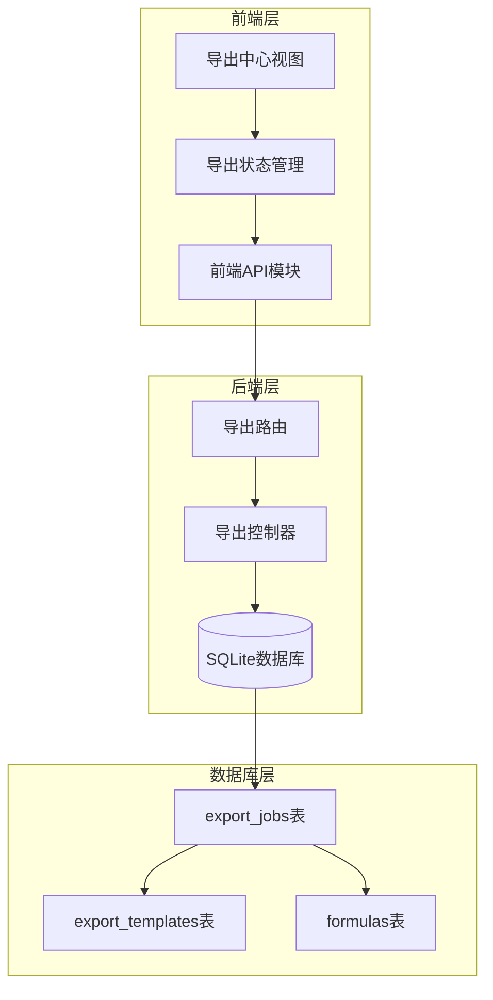

**图表来源**
- [export.ts:30-55](file://frontend/src/api/export.ts#L30-L55)
- [exports.ts:12-34](file://backend/src/routes/exports.ts#L12-L34)
- [exportController.ts:55-117](file://backend/src/controllers/exportController.ts#L55-L117)

**章节来源**
- [export.ts:1-56](file://frontend/src/api/export.ts#L1-L56)
- [exports.ts:1-34](file://backend/src/routes/exports.ts#L1-L34)
- [exportController.ts:1-230](file://backend/src/controllers/exportController.ts#L1-L230)

## 核心组件
导出任务表包含以下关键组件：

### 数据模型
导出任务表采用简洁而完整的数据模型设计，支持灵活的导出需求和状态管理。

### 状态管理
系统实现了完整的任务状态管理机制，确保导出过程的可控性和可观测性。

### 进度跟踪
内置进度跟踪机制，支持实时监控导出任务的执行状态。

**章节来源**
- [DATABASE_DOC.md:194-221](file://backend/DATABASE_DOC.md#L194-L221)
- [init.sql:111-129](file://backend/src/scripts/init.sql#L111-L129)

## 架构概览
导出任务系统的整体架构采用分层设计，从前端交互到后端处理再到数据库存储形成完整的数据流。

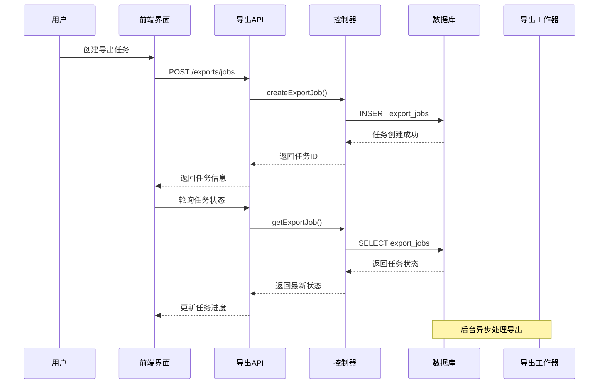

**图表来源**
- [exportController.ts:55-117](file://backend/src/controllers/exportController.ts#L55-L117)
- [export.ts:37-44](file://frontend/src/api/export.ts#L37-L44)

## 详细组件分析

### 字段定义与业务含义

#### 主键字段
- **job_id**: 任务唯一标识符，采用自定义ID生成策略，确保全局唯一性
- **formula_id**: 关联到配方表的外键，建立任务与配方的直接关系

#### 导出配置字段
- **version_id**: 版本标识符，允许对特定版本进行导出
- **template_id**: 模板标识符，指定使用的导出模板
- **export_type**: 导出类型枚举，支持 pdf、excel、api 三种格式

#### 状态管理字段
- **status**: 任务状态，包含 pending、processing、completed、failed 四种状态
- **progress**: 进度百分比，从 0 到 100 的整数值
- **error_message**: 错误信息存储，便于问题诊断和用户反馈

#### 文件管理字段
- **file_url**: 导出文件的存储路径
- **file_name**: 导出文件的显示名称
- **api_endpoint**: API导出的目标端点

#### 时间戳字段
- **created_at**: 任务创建时间，默认使用数据库时间戳
- **completed_at**: 任务完成时间，仅在任务完成后填充

#### 责任追踪字段
- **created_by**: 创建者标识，建立任务与用户的关联
- **updated_by**: 最后更新者标识（在某些实现中）

**章节来源**
- [DATABASE_DOC.md:198-213](file://backend/DATABASE_DOC.md#L198-L213)
- [init.sql:111-126](file://backend/src/scripts/init.sql#L111-L126)

### 数据类型与约束

#### 核心约束
- **主键约束**: job_id 作为唯一标识符
- **外键约束**: formula_id 引用 formulas 表，ON DELETE CASCADE 级联删除
- **检查约束**: export_type 和 status 字段的枚举值验证

#### 索引设计
- **idx_ej_formula**: 按配方ID建立索引，优化查询性能
- **idx_ej_status**: 按状态建立索引，支持状态筛选和统计

#### 默认值策略
- **status**: 默认值为 'pending'
- **progress**: 默认值为 0
- **created_at**: 使用数据库默认时间戳

**章节来源**
- [DATABASE_DOC.md:217-219](file://backend/DATABASE_DOC.md#L217-L219)
- [init.sql:128-129](file://backend/src/scripts/init.sql#L128-L129)

### 状态管理机制

#### 状态流转图
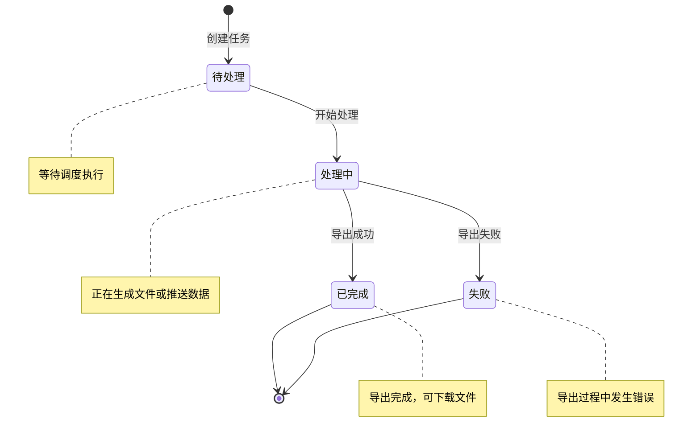

#### 状态转换规则
- **待处理 (pending)**: 新建任务的初始状态
- **处理中 (processing)**: 任务开始执行时的状态
- **已完成 (completed)**: 导出成功完成的状态
- **失败 (failed)**: 导出过程中发生错误的状态

**章节来源**
- [DATABASE_DOC.md:205-205](file://backend/DATABASE_DOC.md#L205-L205)
- [seedData.ts:302-302](file://backend/src/scripts/seedData.ts#L302-L302)

### 进度跟踪机制

#### 进度更新策略
- **初始化**: 新任务创建时进度为 0%
- **处理中**: 根据导出进度动态更新
- **完成**: 导出完成后进度达到 100%

#### 进度监控流程
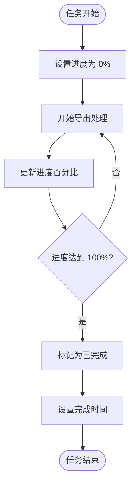

**图表来源**
- [exportController.ts:55-72](file://backend/src/controllers/exportController.ts#L55-L72)
- [export.ts:37-44](file://frontend/src/api/export.ts#L37-L44)

**章节来源**
- [exportController.ts:104-117](file://backend/src/controllers/exportController.ts#L104-L117)
- [export.ts:14-28](file://frontend/src/api/export.ts#L14-L28)

### 外键关系与索引设计

#### 外键关系图
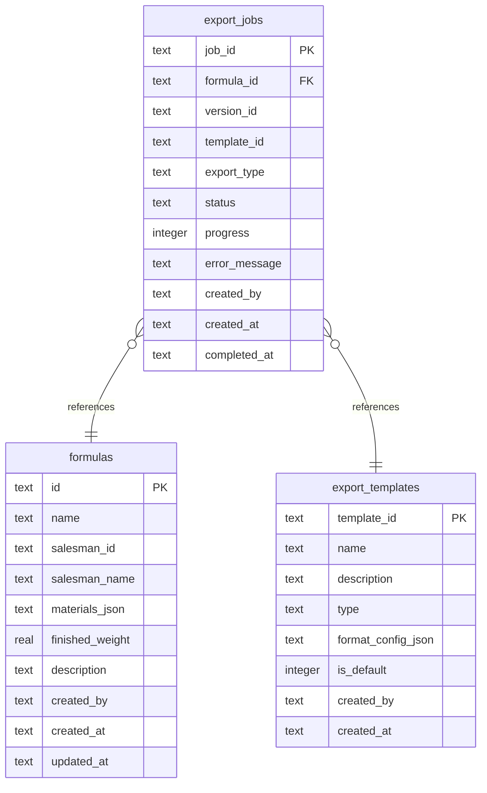

**图表来源**
- [DATABASE_DOC.md:215-215](file://backend/DATABASE_DOC.md#L215-L215)
- [DATABASE_DOC.md:181-181](file://backend/DATABASE_DOC.md#L181-L181)

#### 索引优化策略
- **查询优化**: idx_ej_formula 支持按配方快速检索
- **筛选优化**: idx_ej_status 支持按状态过滤
- **复合索引**: 可考虑为 (formula_id, status) 创建复合索引

**章节来源**
- [DATABASE_DOC.md:217-219](file://backend/DATABASE_DOC.md#L217-L219)
- [init.sql:128-129](file://backend/src/scripts/init.sql#L128-L129)

### 不同类型导出任务的处理流程

#### PDF 导出流程
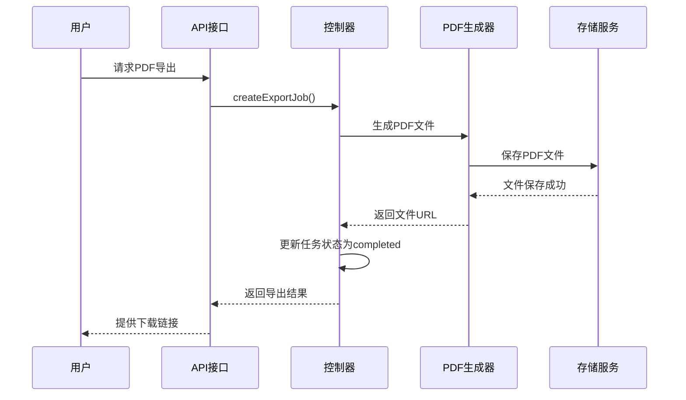

#### Excel 导出流程
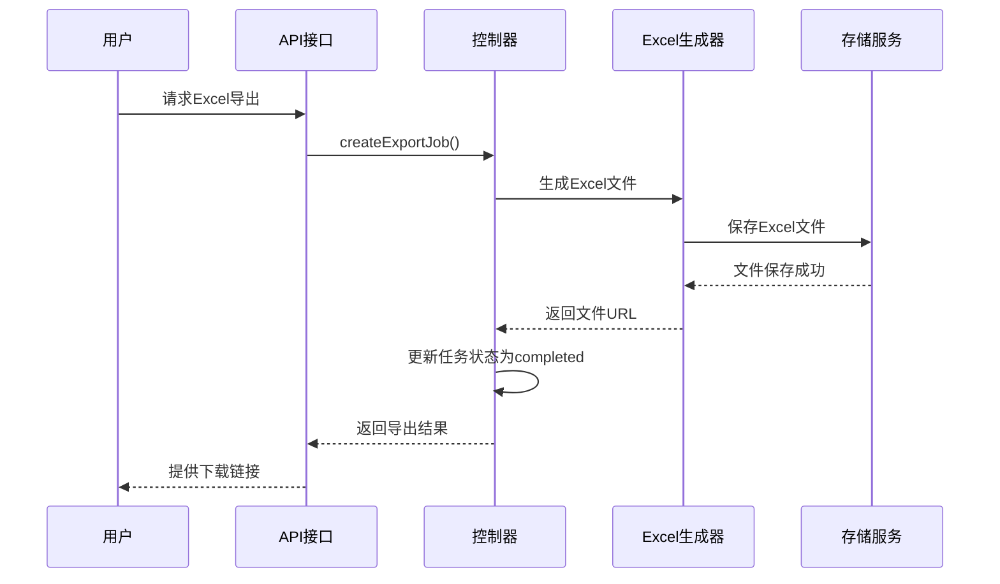

#### API 导出流程
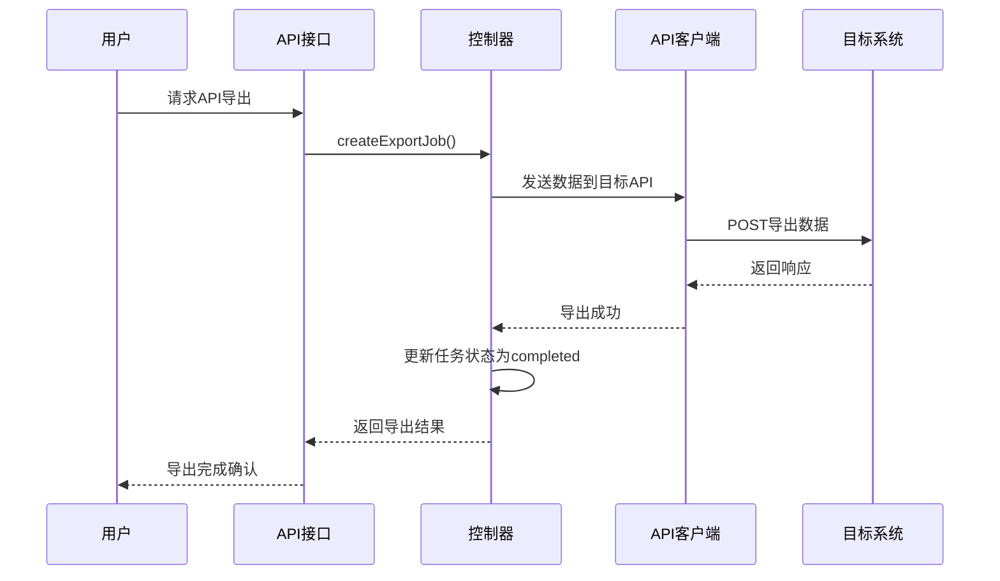

**图表来源**
- [exportController.ts:55-72](file://backend/src/controllers/exportController.ts#L55-L72)
- [export.ts:37-44](file://frontend/src/api/export.ts#L37-L44)

**章节来源**
- [DATABASE_DOC.md:204-204](file://backend/DATABASE_DOC.md#L204-L204)
- [init.sql:116-116](file://backend/src/scripts/init.sql#L116-L116)

### 错误处理机制

#### 错误分类与处理策略
- **数据库错误**: 连接异常、约束冲突、事务回滚
- **文件操作错误**: 文件读写失败、存储空间不足
- **网络错误**: API调用超时、连接失败、认证错误
- **业务逻辑错误**: 参数验证失败、权限不足、资源不存在

#### 错误恢复机制
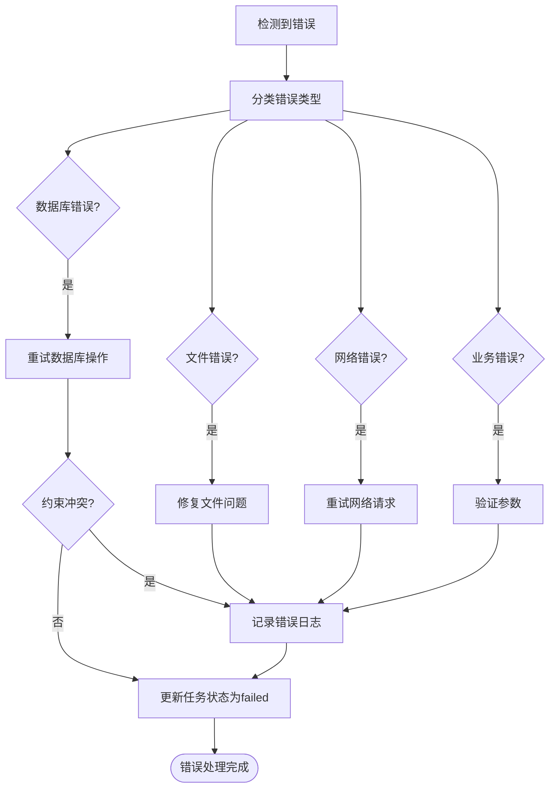

**图表来源**
- [exportController.ts:69-71](file://backend/src/controllers/exportController.ts#L69-L71)
- [exportController.ts:99-101](file://backend/src/controllers/exportController.ts#L99-L101)

**章节来源**
- [exportController.ts:69-71](file://backend/src/controllers/exportController.ts#L69-L71)
- [exportController.ts:99-101](file://backend/src/controllers/exportController.ts#L99-L101)

### 导出任务的完整生命周期示例

#### 生命周期时序图
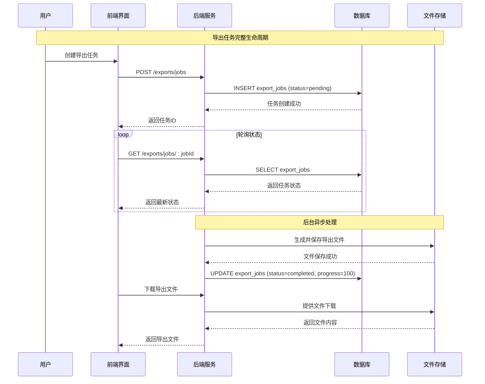

#### 典型场景示例
基于种子数据，系统包含以下典型任务状态组合：
- **已完成任务**: 两个任务标记为 completed，进度为 100%
- **处理中任务**: 一个任务标记为 processing，进度为 65%
- **待处理任务**: 一个任务标记为 pending，进度为 0%

**图表来源**
- [seedData.ts:302-325](file://backend/src/scripts/seedData.ts#L302-L325)
- [export.ts:139-146](file://frontend/src/views/exports/ExportCenter.vue#L139-L146)

**章节来源**
- [seedData.ts:302-325](file://backend/src/scripts/seedData.ts#L302-L325)
- [export.ts:139-146](file://frontend/src/views/exports/ExportCenter.vue#L139-L146)

## 依赖分析

### 组件耦合关系
导出任务表与系统其他组件存在以下依赖关系：

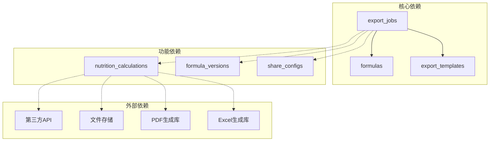

**图表来源**
- [DATABASE_DOC.md:414-416](file://backend/DATABASE_DOC.md#L414-L416)
- [DATABASE_DOC.md:416-416](file://backend/DATABASE_DOC.md#L416-L416)

### 数据一致性保证
- **外键约束**: 确保引用完整性
- **级联删除**: 删除配方时自动清理相关任务
- **事务处理**: 关键操作在事务中执行
- **并发控制**: 支持多用户同时操作

**章节来源**
- [DATABASE_DOC.md:215-215](file://backend/DATABASE_DOC.md#L215-L215)
- [init.sql:126-126](file://backend/src/scripts/init.sql#L126-L126)

## 性能考虑

### 查询优化策略
- **索引使用**: 利用 idx_ej_formula 和 idx_ej_status 提高查询效率
- **分页处理**: 支持大数据量的任务列表分页显示
- **缓存策略**: 对频繁查询的结果进行缓存

### 存储优化
- **文件压缩**: 导出文件采用适当的压缩策略
- **存储清理**: 定期清理过期的导出文件
- **CDN集成**: 支持CDN加速文件下载

### 并发处理
- **队列系统**: 使用消息队列处理大量导出任务
- **负载均衡**: 支持多实例部署
- **资源限制**: 控制单个任务的资源消耗

## 故障排除指南

### 常见问题诊断
1. **任务状态异常**: 检查数据库连接和事务状态
2. **文件下载失败**: 验证文件存储路径和权限
3. **API导出错误**: 检查目标API的可用性和认证配置
4. **内存溢出**: 优化大文件处理和内存管理

### 日志记录策略
- **错误日志**: 详细记录错误信息和堆栈跟踪
- **性能日志**: 监控查询性能和响应时间
- **审计日志**: 追踪用户操作和系统事件

### 监控指标
- **任务成功率**: 统计导出任务的成功率
- **平均处理时间**: 监控导出任务的处理效率
- **存储使用情况**: 跟踪导出文件的存储占用

**章节来源**
- [exportController.ts:69-71](file://backend/src/controllers/exportController.ts#L69-L71)
- [exportController.ts:99-101](file://backend/src/controllers/exportController.ts#L99-L101)

## 结论
导出任务表 (export_jobs) 设计合理，功能完善，能够有效支持系统的导出需求。其状态管理机制、进度跟踪功能和错误处理策略为用户提供可靠的导出体验。通过合理的索引设计和外键约束，确保了数据的一致性和完整性。

## 附录

### API 接口规范
- **创建任务**: POST /exports/jobs
- **获取任务列表**: GET /exports/jobs
- **获取单个任务**: GET /exports/jobs/:jobId
- **获取模板列表**: GET /exports/templates

### 前端集成要点
- 实现轮询机制监控任务状态
- 提供友好的用户界面展示导出进度
- 支持任务取消和重新尝试功能

**章节来源**
- [exports.ts:20-23](file://backend/src/routes/exports.ts#L20-L23)
- [export.ts:30-55](file://frontend/src/api/export.ts#L30-L55)