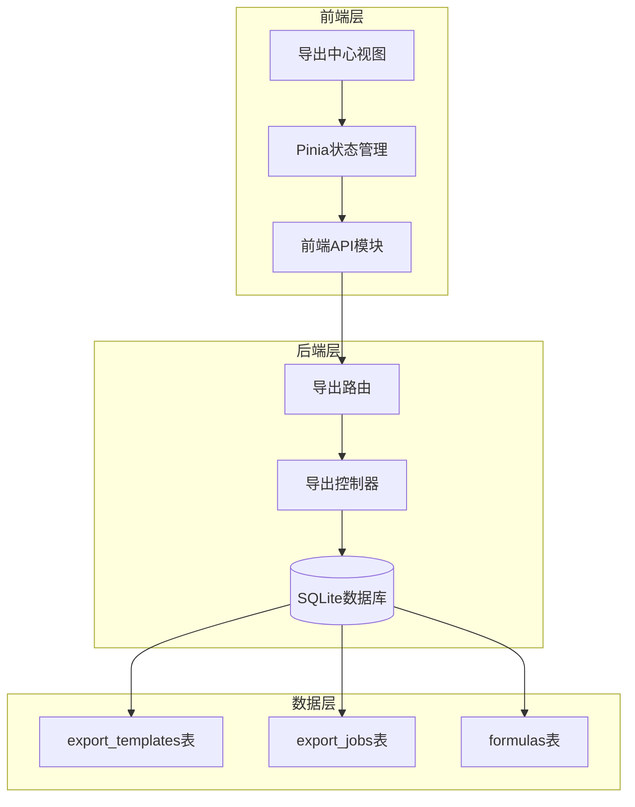
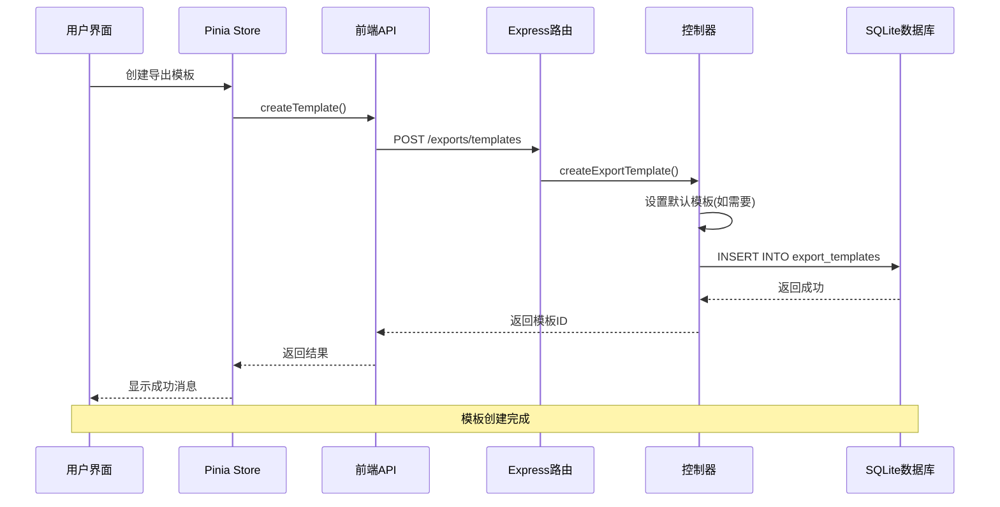
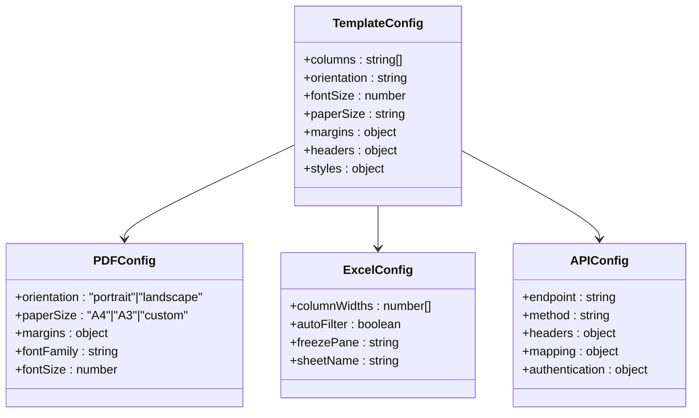
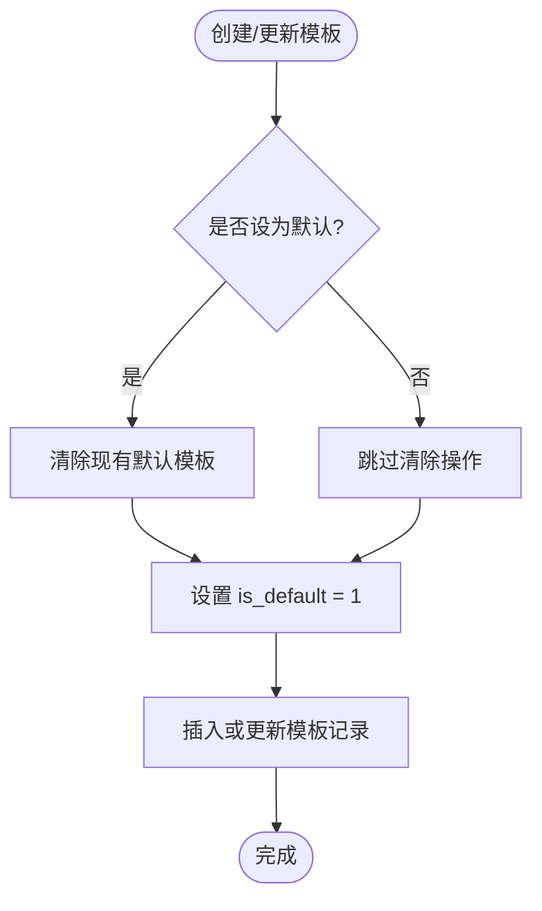
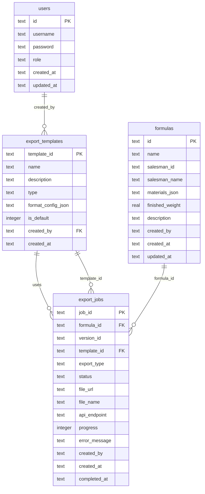

# 导出模板表 (export_templates)

<cite>
**本文档引用的文件**
- [DATABASE_DOC.md](file://backend/DATABASE_DOC.md)
- [init.sql](file://backend/src/scripts/init.sql)
- [exportController.ts](file://backend/src/controllers/exportController.ts)
- [exports.ts](file://backend/src/routes/exports.ts)
- [export.ts](file://frontend/src/api/export.ts)
- [ExportCenter.vue](file://frontend/src/views/exports/ExportCenter.vue)
- [export.ts](file://frontend/src/stores/export.ts)
- [seedData.ts](file://backend/src/scripts/seedData.ts)
</cite>

## 目录
1. [简介](#简介)
2. [项目结构](#项目结构)
3. [核心组件](#核心组件)
4. [架构概览](#架构概览)
5. [详细组件分析](#详细组件分析)
6. [依赖关系分析](#依赖关系分析)
7. [性能考虑](#性能考虑)
8. [故障排除指南](#故障排除指南)
9. [结论](#结论)

## 简介

导出模板表 (export_templates) 是 TingStudio 系统中用于管理配方导出格式的核心数据表。该表存储了各种导出模板的配置信息，支持 PDF、Excel、API 和 Print 四种导出类型，并通过 JSON 格式的配置参数实现灵活的格式定制。

该表的设计体现了现代软件架构中的配置驱动模式，允许用户根据不同的业务需求创建和管理导出模板，同时通过默认模板机制确保新用户的最佳体验。

## 项目结构

导出模板功能在系统中的整体架构如下：

**图表来源**
- [export.ts:1-56](file://frontend/src/api/export.ts#L1-L56)
- [exports.ts:1-34](file://backend/src/routes/exports.ts#L1-L34)
- [exportController.ts:1-230](file://backend/src/controllers/exportController.ts#L1-L230)

**章节来源**
- [export.ts:1-56](file://frontend/src/api/export.ts#L1-L56)
- [exports.ts:1-34](file://backend/src/routes/exports.ts#L1-L34)
- [exportController.ts:1-230](file://backend/src/controllers/exportController.ts#L1-L230)

## 核心组件

### 数据表结构

导出模板表采用简洁而强大的设计，通过单一的 JSON 配置字段实现了高度的灵活性：

| 字段名 | 数据类型 | 约束条件 | 业务含义 |
|--------|----------|----------|----------|
| template_id | TEXT | PRIMARY KEY | 模板唯一标识符 |
| name | TEXT | NOT NULL | 模板显示名称 |
| description | TEXT | NULL | 模板描述信息 |
| type | TEXT | NOT NULL, CHECK(type IN ('pdf','excel','api','print')) | 导出类型 |
| format_config_json | TEXT | NOT NULL | 格式配置JSON对象 |
| is_default | INTEGER | NOT NULL, DEFAULT 0 | 是否为默认模板 |
| created_by | TEXT | NOT NULL | 创建者用户ID |
| created_at | TEXT | NOT NULL | 创建时间戳 |

### 索引设计

为了优化查询性能，系统为导出模板表建立了专门的索引：

- **主键索引**: `PRIMARY KEY (template_id)` - 唯一标识符索引
- **类型索引**: `idx_et_type (type)` - 按导出类型快速筛选
- **外键约束**: `created_by` 引用 `users.id` - 确保数据完整性

**章节来源**
- [DATABASE_DOC.md:175-191](file://backend/DATABASE_DOC.md#L175-L191)
- [init.sql:97-108](file://backend/src/scripts/init.sql#L97-L108)

## 架构概览

导出模板系统的整体工作流程如下：

**图表来源**
- [ExportCenter.vue:162-167](file://frontend/src/views/exports/ExportCenter.vue#L162-L167)
- [export.ts:34-36](file://frontend/src/api/export.ts#L34-L36)
- [exports.ts:17-18](file://backend/src/routes/exports.ts#L17-L18)
- [exportController.ts:32-53](file://backend/src/controllers/exportController.ts#L32-L53)

## 详细组件分析

### 导出模板类型

系统支持四种不同的导出模板类型，每种类型都有其特定的应用场景：

#### PDF 模板
- **用途**: 生成标准的PDF格式配方报告
- **典型场景**: 质检报告、合规文档、客户交付
- **配置重点**: 页面布局、字体大小、边距设置

#### Excel 模板
- **用途**: 生成可编辑的Excel电子表格
- **典型场景**: 生产计划、库存管理、数据分析
- **配置重点**: 列宽、数据格式、公式设置

#### API 模板
- **用途**: 配置外部系统对接的API推送
- **典型场景**: MES系统集成、ERP对接、第三方平台
- **配置重点**: 接口URL、认证方式、数据映射

#### Print 模板
- **用途**: 生成适合打印的纸质文档
- **典型场景**: 生产线标签、包装说明、内部文档
- **配置重点**: 打印方向、纸张尺寸、边距设置

### 格式配置机制

格式配置通过 JSON 对象实现，提供了极大的灵活性：

**图表来源**
- [exportController.ts:35-46](file://backend/src/controllers/exportController.ts#L35-L46)
- [seedData.ts:285-289](file://backend/src/scripts/seedData.ts#L285-L289)

### 默认模板管理机制

系统通过 `is_default` 字段实现默认模板的自动管理：

**图表来源**
- [exportController.ts:39-41](file://backend/src/controllers/exportController.ts#L39-L41)

**章节来源**
- [exportController.ts:32-53](file://backend/src/controllers/exportController.ts#L32-L53)

### 实际应用场景

#### 生产环境配置
- **MES系统对接**: 使用 API 模板连接生产管理系统
- **质量控制**: 使用 PDF 模板生成标准化质检报告
- **库存管理**: 使用 Excel 模板生成原料采购清单
- **客户交付**: 使用 PDF 模板生成产品配方说明

#### 开发测试配置
- **开发调试**: 使用简单的 Print 模板进行快速验证
- **数据迁移**: 使用 Excel 模板进行批量数据处理
- **报表生成**: 使用 PDF 模板生成月度分析报告

**章节来源**
- [seedData.ts:271-296](file://backend/src/scripts/seedData.ts#L271-L296)

## 依赖关系分析

导出模板表与其他系统组件的依赖关系：

**图表来源**
- [init.sql:97-127](file://backend/src/scripts/init.sql#L97-L127)
- [DATABASE_DOC.md:393-427](file://backend/DATABASE_DOC.md#L393-L427)

**章节来源**
- [init.sql:97-127](file://backend/src/scripts/init.sql#L97-L127)
- [DATABASE_DOC.md:393-427](file://backend/DATABASE_DOC.md#L393-L427)

## 性能考虑

### 查询优化
- **类型筛选**: 通过 `idx_et_type` 索引优化按类型查询
- **排序优化**: 支持按默认状态和创建时间的高效排序
- **分页处理**: 后端提供分页查询接口，避免大数据集加载

### 存储优化
- **JSON存储**: 使用 TEXT 类型存储 JSON 配置，减少表结构复杂度
- **索引策略**: 仅在必要字段建立索引，平衡查询性能和存储空间
- **数据压缩**: SQLite 自动压缩空闲空间，减少存储占用

### 缓存策略
- **模板缓存**: 前端 Store 缓存模板列表，减少重复请求
- **配置缓存**: 模板配置在内存中缓存，提高渲染效率

## 故障排除指南

### 常见问题及解决方案

#### 模板创建失败
**症状**: 创建模板时返回错误
**可能原因**:
- JSON 配置格式不正确
- 模板名称重复
- 权限不足

**解决步骤**:
1. 验证 JSON 配置的语法正确性
2. 检查模板名称的唯一性
3. 确认用户具有创建权限

#### 默认模板冲突
**症状**: 新建默认模板后旧默认模板未清除
**解决方法**:
- 确保在创建新默认模板时执行清除逻辑
- 检查数据库事务的完整性

#### 查询性能问题
**症状**: 模板列表加载缓慢
**优化建议**:
- 使用类型过滤参数缩小查询范围
- 实现分页加载机制
- 考虑添加更多索引

**章节来源**
- [exportController.ts:27-29](file://backend/src/controllers/exportController.ts#L27-L29)
- [export.ts:26-34](file://frontend/src/stores/export.ts#L26-L34)

## 结论

导出模板表 (export_templates) 通过其简洁而强大的设计，为 TingStudio 系统提供了灵活的导出能力。该表的核心优势包括：

1. **类型多样性**: 支持 PDF、Excel、API、Print 四种导出类型，满足不同业务场景需求
2. **配置灵活性**: 通过 JSON 配置实现高度定制化的导出格式
3. **默认模板管理**: 自动化的默认模板机制确保用户体验的一致性
4. **性能优化**: 合理的索引设计和查询优化保证了良好的响应速度
5. **扩展性强**: 清晰的架构设计便于未来功能扩展和维护

该设计充分体现了现代软件架构的最佳实践，既保证了功能的完整性，又确保了系统的可维护性和可扩展性。通过合理的配置管理和完善的错误处理机制，导出模板功能能够稳定地支撑 TingStudio 的各项业务需求。