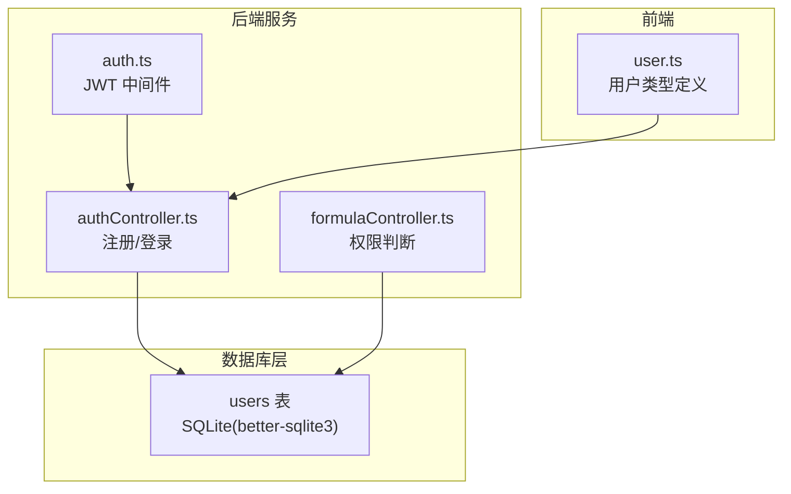
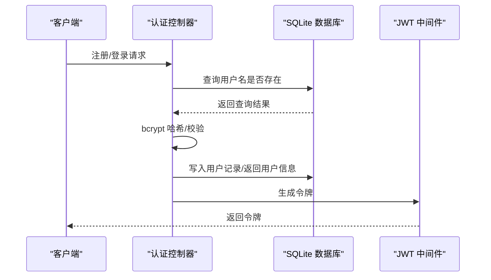
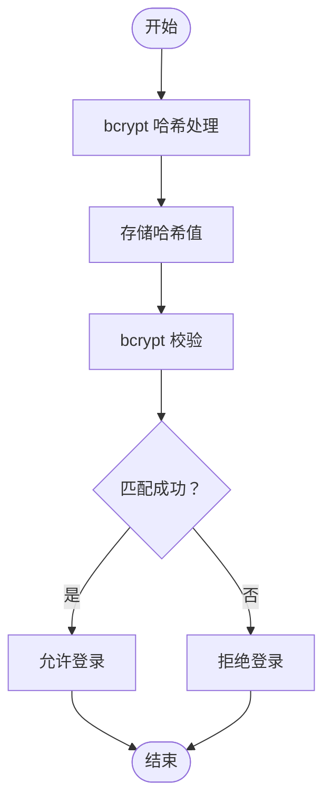
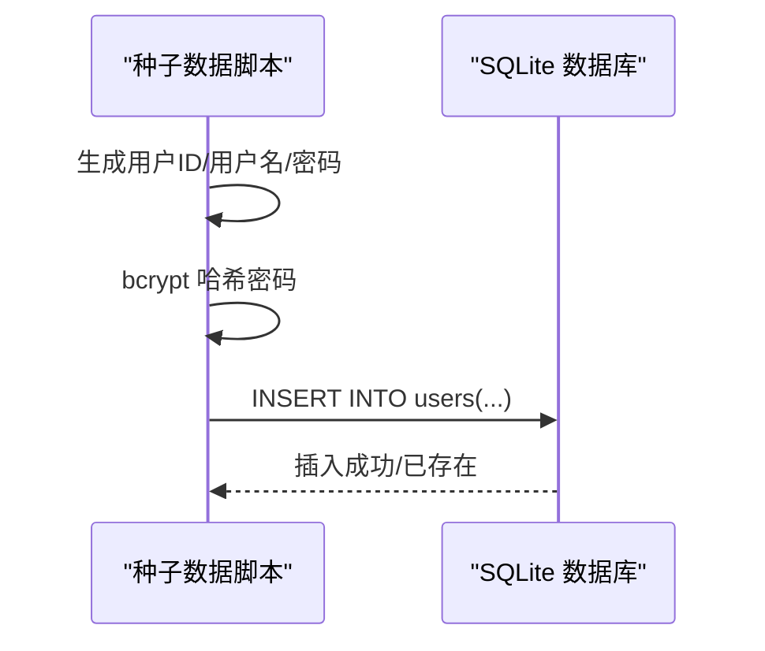
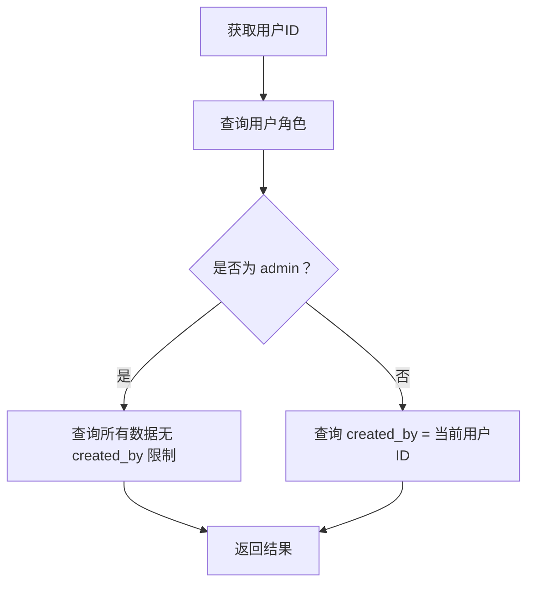
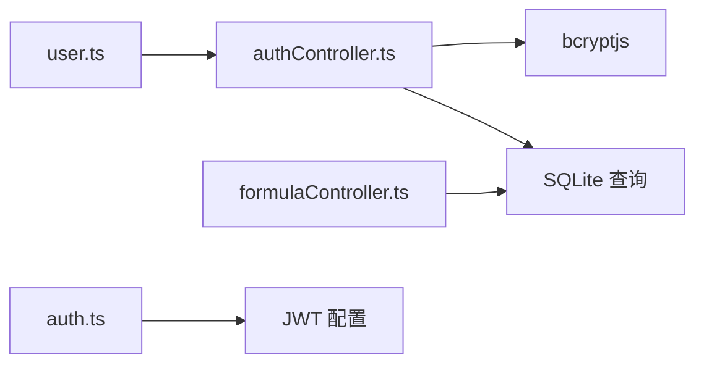

# 用户表 (users)

<cite>
**本文档引用的文件**
- [DATABASE_DOC.md](file://backend/DATABASE_DOC.md)
- [init.sql](file://backend/src/scripts/init.sql)
- [seedData.ts](file://backend/src/scripts/seedData.ts)
- [authController.ts](file://backend/src/controllers/authController.ts)
- [formulaController.ts](file://backend/src/controllers/formulaController.ts)
- [auth.ts](file://backend/src/middleware/auth.ts)
- [user.ts](file://frontend/src/types/user.ts)
</cite>

## 目录
1. [简介](#简介)
2. [项目结构](#项目结构)
3. [核心组件](#核心组件)
4. [架构总览](#架构总览)
5. [详细组件分析](#详细组件分析)
6. [依赖分析](#依赖分析)
7. [性能考虑](#性能考虑)
8. [故障排除指南](#故障排除指南)
9. [结论](#结论)

## 简介
本文件面向数据库设计与开发人员，系统性阐述用户表（users）的设计与实现细节。内容覆盖字段定义、数据类型、约束条件、业务含义、索引与外键关系、密码安全机制（bcrypt 哈希）、SQL 创建语句示例以及数据插入示例，并结合后端认证流程与前端类型定义进行说明，帮助读者全面理解用户表在系统中的作用与最佳实践。

## 项目结构
用户表位于 SQLite 数据库中，作为系统的基础模块之一，参与多处业务流程：
- 数据库初始化脚本中定义了用户表结构与约束
- 种子数据脚本演示了用户表的数据插入与密码哈希处理
- 认证控制器负责用户注册与登录流程，涉及密码校验
- 权限控制在配方控制器中体现，通过用户角色区分访问范围
- 前端类型定义明确了用户对象在前端侧的结构

图表来源
- [init.sql:7-15](file://backend/src/scripts/init.sql#L7-L15)
- [authController.ts:8-39](file://backend/src/controllers/authController.ts#L8-L39)
- [formulaController.ts:15-22](file://backend/src/controllers/formulaController.ts#L15-L22)
- [auth.ts:13-31](file://backend/src/middleware/auth.ts#L13-L31)
- [user.ts:1-22](file://frontend/src/types/user.ts#L1-L22)

章节来源
- [DATABASE_DOC.md:25-42](file://backend/DATABASE_DOC.md#L25-L42)
- [init.sql:7-15](file://backend/src/scripts/init.sql#L7-L15)

## 核心组件
- 用户表 users：存储系统用户信息，包含唯一标识、用户名、密码哈希、角色、创建与更新时间戳。
- 认证控制器：处理用户注册与登录，使用 bcrypt 对密码进行哈希存储与校验。
- 权限控制：在配方控制器中根据用户角色决定可见性与操作范围。
- 前端类型：定义用户对象在前端侧的结构，便于统一数据契约。

章节来源
- [authController.ts:8-39](file://backend/src/controllers/authController.ts#L8-L39)
- [formulaController.ts:15-22](file://backend/src/controllers/formulaController.ts#L15-L22)
- [user.ts:1-22](file://frontend/src/types/user.ts#L1-L22)

## 架构总览
用户表在系统中的位置与交互如下：
- 用户表是系统用户身份与权限的根数据源
- 认证流程依赖用户表进行用户名存在性检查与密码校验
- 权限控制依赖用户表的角色字段，决定业务数据的访问范围
- 前端通过认证接口获取用户信息与令牌，令牌中包含用户标识

图表来源
- [authController.ts:8-39](file://backend/src/controllers/authController.ts#L8-L39)
- [auth.ts:13-31](file://backend/src/middleware/auth.ts#L13-L31)

## 详细组件分析

### 字段定义与业务含义
- id：TEXT，主键，系统自动生成的唯一标识符
- username：TEXT，NOT NULL，UNIQUE，登录凭证
- password：TEXT，NOT NULL，存储 bcrypt 哈希后的密码
- role：TEXT，NOT NULL，默认 'formulist'，枚举值 'admin' 或 'formulist'
- created_at：TEXT，NOT NULL，默认当前时间（ISO 8601）
- updated_at：TEXT，NOT NULL，默认当前时间（ISO 8601）

业务含义：
- admin：系统管理员，拥有最高权限，可访问与操作所有业务数据
- formulist：配方师，负责配方创建、编辑与版本管理，通常仅能访问自身创建的数据

章节来源
- [DATABASE_DOC.md:29-36](file://backend/DATABASE_DOC.md#L29-L36)
- [DATABASE_DOC.md:38-40](file://backend/DATABASE_DOC.md#L38-L40)

### 数据类型与约束
- 主键约束：id 为主键
- 唯一性约束：username 唯一
- 默认值：role 默认 'formulist'；created_at/updated_at 默认当前时间
- 检查约束：role 限定为 'admin' 或 'formulist'

章节来源
- [init.sql:8-15](file://backend/src/scripts/init.sql#L8-L15)
- [DATABASE_DOC.md:33](file://backend/DATABASE_DOC.md#L33)

### 索引与外键关系
- 当前用户表未定义额外索引（由数据库文档说明）
- 用户表与其他表的关系主要体现在业务层面：
  - users 与 materials/formulas/salesmen/formula_versions/export_* 等表通过 created_by 字段建立“创建者”关系
  - 在业务逻辑中，这些关系用于控制数据访问范围（例如 formulist 仅能访问自身创建的数据）

章节来源
- [DATABASE_DOC.md:396-406](file://backend/DATABASE_DOC.md#L396-L406)
- [DATABASE_DOC.md:431-435](file://backend/DATABASE_DOC.md#L431-L435)

### 密码存储安全机制（bcrypt 哈希）
- 注册时：使用 bcrypt 对明文密码进行哈希处理，存储哈希值
- 登录时：从数据库读取用户记录，使用 bcrypt.compare 校验输入密码与存储哈希
- 安全参数：使用 10 轮哈希（成本因子），平衡安全性与性能

图表来源
- [authController.ts:24](file://backend/src/controllers/authController.ts#L24)
- [authController.ts:55](file://backend/src/controllers/authController.ts#L55)

章节来源
- [DATABASE_DOC.md:454](file://backend/DATABASE_DOC.md#L454)
- [authController.ts:24](file://backend/src/controllers/authController.ts#L24)
- [authController.ts:55](file://backend/src/controllers/authController.ts#L55)

### SQL 创建语句示例
- 初始化脚本中提供了完整的 CREATE TABLE users 语句，包含主键、唯一性、默认值与检查约束
- 可直接参考以下路径获取完整 SQL：
  - [init.sql:7-15](file://backend/src/scripts/init.sql#L7-L15)

章节来源
- [init.sql:7-15](file://backend/src/scripts/init.sql#L7-L15)

### 数据插入示例
- 种子数据脚本演示了用户表的批量插入，包含：
  - 生成唯一 id
  - 生成用户名（示例包含 admin 与 user002 等）
  - 使用 bcrypt 对密码进行哈希
  - 指定角色（admin/formulist）
  - 设置 created_at/updated_at 时间戳

图表来源
- [seedData.ts:111-130](file://backend/src/scripts/seedData.ts#L111-L130)

章节来源
- [seedData.ts:111-130](file://backend/src/scripts/seedData.ts#L111-L130)

### 权限控制机制与角色差异
- 角色定义：admin/formulist
- 权限差异：
  - admin：可访问所有业务数据，不受 created_by 限制
  - formulist：仅能访问自身创建的数据（由业务逻辑控制）
- 实现方式：在配方控制器中先查询当前用户角色，再动态拼接查询条件

图表来源
- [formulaController.ts:15-22](file://backend/src/controllers/formulaController.ts#L15-L22)

章节来源
- [formulaController.ts:15-22](file://backend/src/controllers/formulaController.ts#L15-L22)
- [DATABASE_DOC.md:38-40](file://backend/DATABASE_DOC.md#L38-L40)

### 前端类型定义
- 前端类型定义了用户对象的基本字段，便于在前端侧统一处理用户信息
- 注意：前端类型不包含密码字段，符合安全最佳实践

章节来源
- [user.ts:1-22](file://frontend/src/types/user.ts#L1-L22)

## 依赖分析
- 认证控制器依赖数据库查询与 bcrypt 哈希库，用于用户注册与登录
- 权限控制依赖用户表的角色字段，影响业务数据的查询范围
- JWT 中间件依赖配置中的密钥，用于令牌签发与验证
- 前端类型定义与后端接口保持一致，确保数据契约稳定

图表来源
- [authController.ts:3](file://backend/src/controllers/authController.ts#L3)
- [auth.ts:3](file://backend/src/middleware/auth.ts#L3)
- [formulaController.ts:3](file://backend/src/controllers/formulaController.ts#L3)

章节来源
- [authController.ts:3](file://backend/src/controllers/authController.ts#L3)
- [auth.ts:3](file://backend/src/middleware/auth.ts#L3)
- [formulaController.ts:3](file://backend/src/controllers/formulaController.ts#L3)

## 性能考虑
- 用户名唯一性索引：由于 username 字段具有 UNIQUE 约束，数据库会自动维护唯一性索引，有利于登录与注册时的快速查找
- 时间戳默认值：created_at/updated_at 使用函数默认值，减少应用层处理开销
- 密码哈希成本：10 轮哈希在安全性与性能之间取得平衡，可根据服务器负载调整

## 故障排除指南
- 用户名冲突：注册时若用户名已存在，返回 409 冲突错误
- 登录失败：用户名或密码错误时返回 401 未授权
- 令牌无效：缺少或无效的 JWT 令牌会导致 401 未授权
- 数据一致性：确保 created_at/updated_at 字段正确设置，避免时间戳异常导致的排序与审计问题

章节来源
- [authController.ts:18-21](file://backend/src/controllers/authController.ts#L18-L21)
- [authController.ts:50-59](file://backend/src/controllers/authController.ts#L50-L59)
- [auth.ts:14-30](file://backend/src/middleware/auth.ts#L14-L30)

## 结论
用户表 users 是系统的身份与权限根基，通过明确的字段定义、严格的约束与安全的密码存储机制，支撑起认证与权限控制流程。配合前端类型定义与后端控制器实现，形成了从注册、登录到权限判断的完整闭环。建议在后续扩展中继续遵循现有约束与安全实践，确保系统的稳定性与安全性。