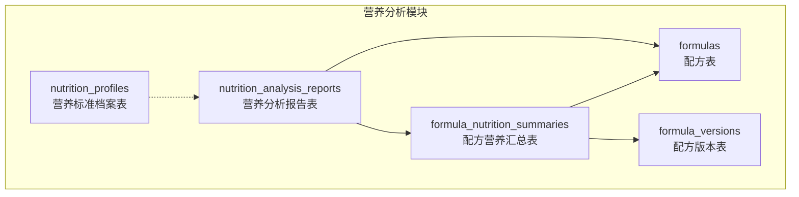
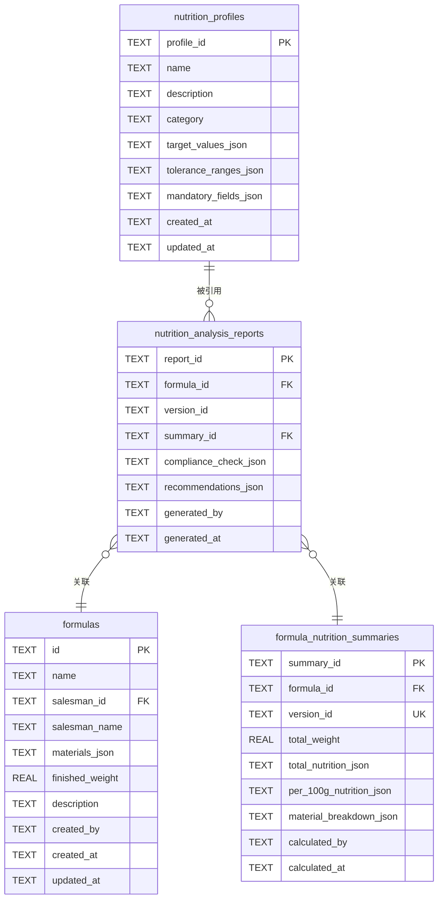
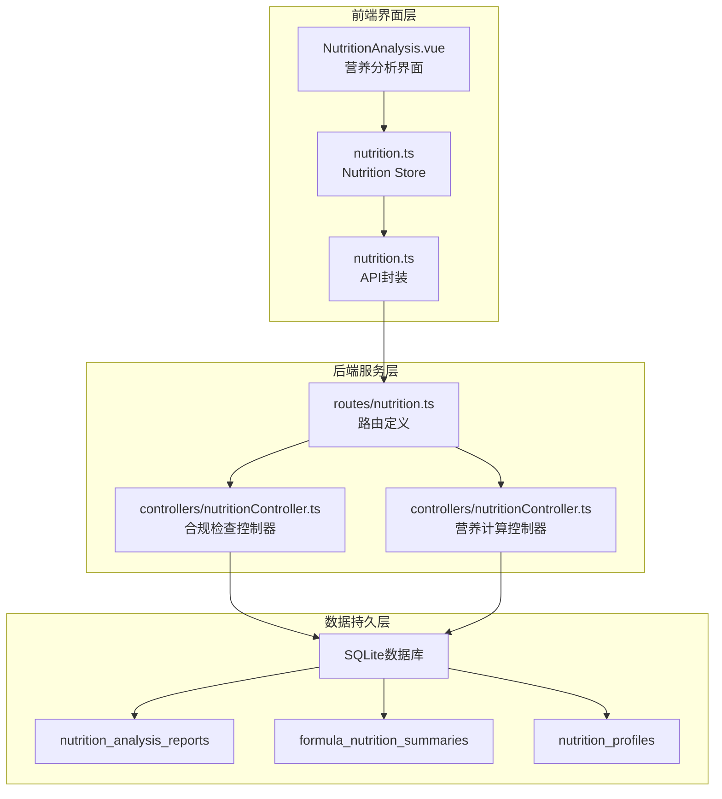
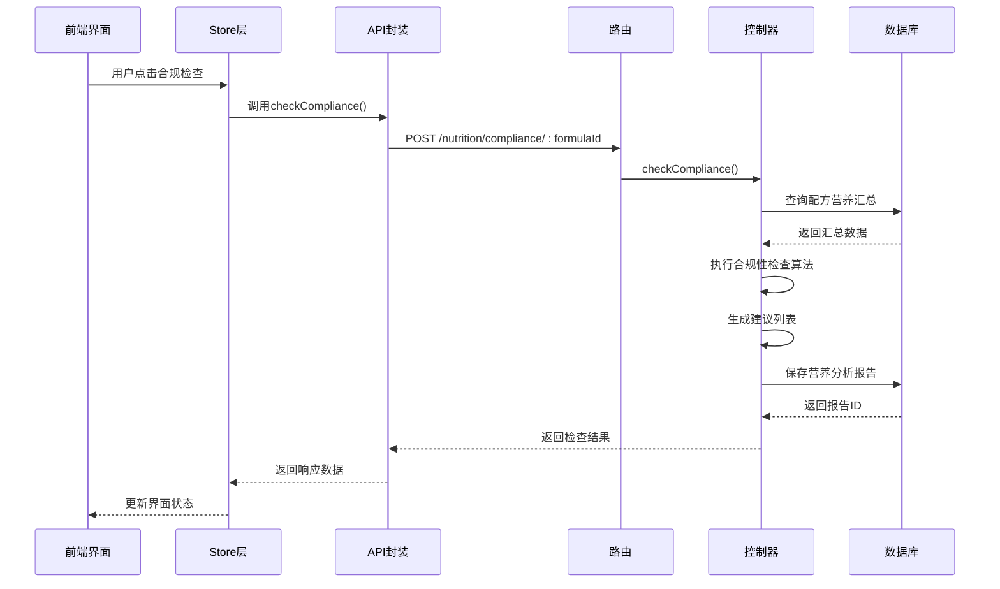
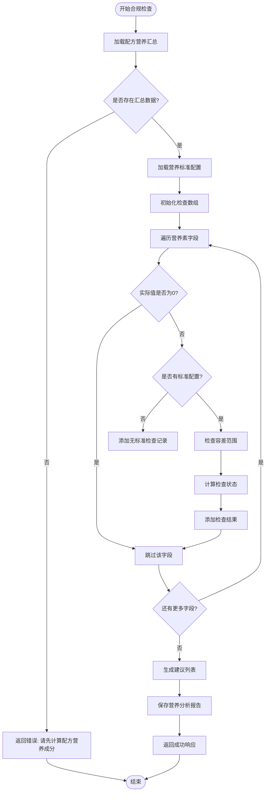
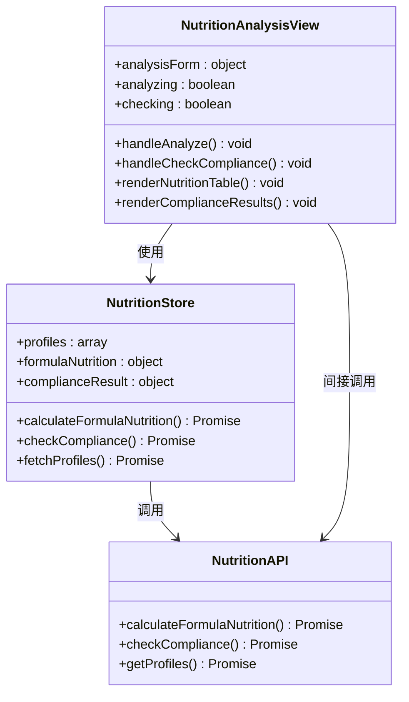
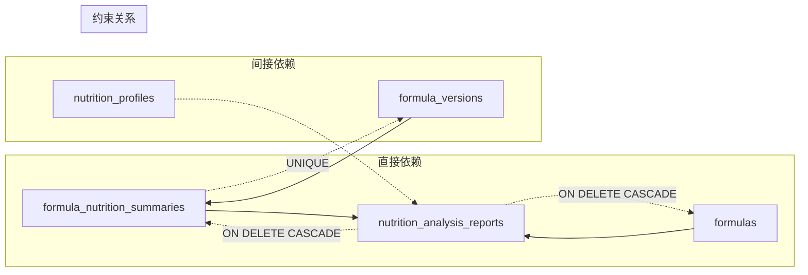
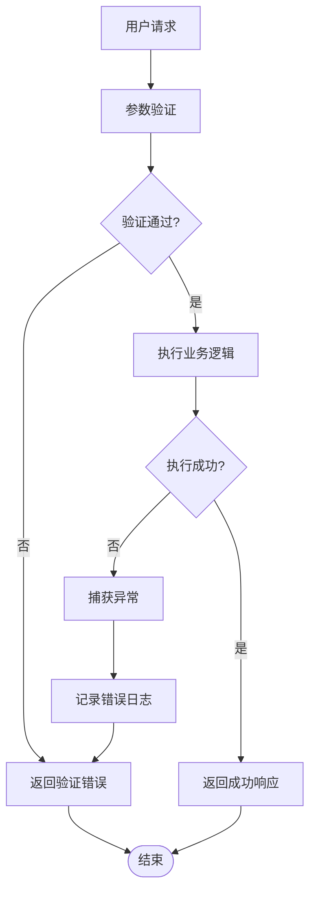

# 营养分析报告表 (nutrition_analysis_reports)

<cite>
**本文档引用的文件**
- [DATABASE_DOC.md](file://backend/DATABASE_DOC.md)
- [init.sql](file://backend/src/scripts/init.sql)
- [nutritionController.ts](file://backend/src/controllers/nutritionController.ts)
- [nutrition.ts](file://backend/src/routes/nutrition.ts)
- [NutritionAnalysis.vue](file://frontend/src/views/nutrition/NutritionAnalysis.vue)
- [nutrition.ts](file://frontend/src/stores/nutrition.ts)
- [nutrition.ts](file://frontend/src/api/nutrition.ts)
</cite>

## 目录
1. [简介](#简介)
2. [项目结构](#项目结构)
3. [核心组件](#核心组件)
4. [架构概览](#架构概览)
5. [详细组件分析](#详细组件分析)
6. [依赖分析](#依赖分析)
7. [性能考虑](#性能考虑)
8. [故障排除指南](#故障排除指南)
9. [结论](#结论)
10. [附录](#附录)

## 简介

营养分析报告表 (nutrition_analysis_reports) 是 TingStudio 营养分析系统中的核心数据表，用于存储配方的合规性检查报告和建议。该表建立了与配方、版本、营养汇总等关键实体的紧密关联关系，为配方师提供了完整的营养合规性分析工具。

## 项目结构

基于数据库设计文档，营养分析报告表属于营养成分集成模块，与以下相关表形成完整的数据链路：

**图表来源**
- [DATABASE_DOC.md: 370-391:370-391](file://backend/DATABASE_DOC.md#L370-L391)
- [init.sql: 214-227:214-227](file://backend/src/scripts/init.sql#L214-L227)

**章节来源**
- [DATABASE_DOC.md: 370-391:370-391](file://backend/DATABASE_DOC.md#L370-L391)
- [init.sql: 214-227:214-227](file://backend/src/scripts/init.sql#L214-L227)

## 核心组件

### 表结构定义

营养分析报告表采用 SQLite 存储，支持 JSON 格式的复杂数据结构存储：

| 字段名 | 数据类型 | 约束条件 | 业务含义 |
|--------|----------|----------|----------|
| report_id | TEXT | PRIMARY KEY | 报告唯一标识符 |
| formula_id | TEXT | NOT NULL, FK | 关联的配方标识符 |
| version_id | TEXT | NULL | 关联的版本标识符 |
| summary_id | TEXT | NOT NULL, FK | 关联的营养汇总标识符 |
| compliance_check_json | TEXT | NULL | 合规检查结果的JSON序列化 |
| recommendations_json | TEXT | NULL | 建议列表的JSON序列化 |
| generated_by | TEXT | NOT NULL | 报告生成人标识符 |
| generated_at | TEXT | NOT NULL | 报告生成时间戳 |

### 外键关系设计

**图表来源**
- [init.sql: 214-227:214-227](file://backend/src/scripts/init.sql#L214-L227)
- [init.sql: 184-198:184-198](file://backend/src/scripts/init.sql#L184-L198)
- [init.sql: 200-212:200-212](file://backend/src/scripts/init.sql#L200-L212)

**章节来源**
- [DATABASE_DOC.md: 370-391:370-391](file://backend/DATABASE_DOC.md#L370-L391)
- [init.sql: 214-227:214-227](file://backend/src/scripts/init.sql#L214-L227)

## 架构概览

营养分析报告表在整个系统中扮演着关键的数据枢纽角色，连接着配方管理、营养计算和合规检查等多个核心功能模块：

**图表来源**
- [NutritionAnalysis.vue: 1-262:1-262](file://frontend/src/views/nutrition/NutritionAnalysis.vue#L1-L262)
- [nutrition.ts: 1-31:1-31](file://backend/src/routes/nutrition.ts#L1-L31)
- [nutritionController.ts: 290-407:290-407](file://backend/src/controllers/nutritionController.ts#L290-L407)

## 详细组件分析

### 合规性检查流程

合规性检查是营养分析报告表的核心业务逻辑，整个流程包含多个阶段：

**图表来源**
- [nutritionController.ts: 290-407:290-407](file://backend/src/controllers/nutritionController.ts#L290-L407)
- [nutrition.ts: 30-31:30-31](file://backend/src/routes/nutrition.ts#L30-L31)
- [NutritionAnalysis.vue: 201-210:201-210](file://frontend/src/views/nutrition/NutritionAnalysis.vue#L201-L210)

### 合规性检查算法实现

合规性检查算法基于预定义的营养标准执行多维度验证：

**图表来源**
- [nutritionController.ts: 290-407:290-407](file://backend/src/controllers/nutritionController.ts#L290-L407)

### JSON数据结构规范

#### 合规检查结果JSON结构

合规检查结果采用统一的JSON格式，确保前后端数据交换的一致性：

| 字段名 | 类型 | 必填 | 说明 |
|--------|------|------|------|
| field | string | 是 | 营养素字段标识符 |
| label | string | 是 | 营养素显示标签 |
| actualValue | number | 是 | 实际检测值 |
| targetRange | object | 否 | 目标范围对象 |
| status | enum | 是 | 检查状态: pass/warning/fail |
| deviation | number | 否 | 偏差值 |
| message | string | 否 | 详细说明信息 |

#### 建议列表JSON结构

建议列表包含针对不同合规状态的智能建议：

| 字段名 | 类型 | 必填 | 说明 |
|--------|------|------|------|
| type | enum | 是 | 建议类型: safety/nutrition |
| priority | enum | 是 | 优先级: high/low |
| title | string | 是 | 建议标题 |
| description | string | 是 | 建议描述 |
| actionable | boolean | 是 | 是否可操作 |

**章节来源**
- [nutritionController.ts: 309-407:309-407](file://backend/src/controllers/nutritionController.ts#L309-L407)

### 前端集成与展示

前端通过NutritionAnalysis.vue组件提供直观的用户体验：

**图表来源**
- [NutritionAnalysis.vue: 124-217:124-217](file://frontend/src/views/nutrition/NutritionAnalysis.vue#L124-L217)
- [nutrition.ts: 6-99:6-99](file://frontend/src/stores/nutrition.ts#L6-L99)

**章节来源**
- [NutritionAnalysis.vue: 1-262:1-262](file://frontend/src/views/nutrition/NutritionAnalysis.vue#L1-L262)
- [nutrition.ts: 1-100:1-100](file://frontend/src/stores/nutrition.ts#L1-L100)

## 依赖分析

### 数据依赖关系

营养分析报告表与其他表之间存在复杂的依赖关系：

**图表来源**
- [init.sql: 214-227:214-227](file://backend/src/scripts/init.sql#L214-L227)
- [init.sql: 184-198:184-198](file://backend/src/scripts/init.sql#L184-L198)

### 外键约束分析

系统通过外键约束确保数据完整性：

| 外键约束 | 目标表 | 删除行为 | 业务意义 |
|----------|--------|----------|----------|
| formula_id | formulas | CASCADE | 配方删除时自动清理报告 |
| summary_id | formula_nutrition_summaries | CASCADE | 汇总删除时自动清理报告 |
| version_id | formula_versions | RESTRICT | 防止版本数据不一致 |

**章节来源**
- [DATABASE_DOC.md: 385-387:385-387](file://backend/DATABASE_DOC.md#L385-L387)
- [init.sql: 224-225:224-225](file://backend/src/scripts/init.sql#L224-L225)

## 性能考虑

### 索引优化策略

为提升查询性能，系统在关键字段上建立了适当的索引：

| 索引名称 | 字段 | 类型 | 性能收益 |
|----------|------|------|----------|
| idx_nar_formula | formula_id | 普通索引 | 加速按配方查询 |
| uk_fns_version | version_id | 唯一索引 | 防止重复版本汇总 |
| idx_np_category | category | 普通索引 | 加速按分类查询 |

### 查询优化建议

1. **批量查询优化**: 在前端同时加载配方和营养标准数据
2. **缓存策略**: 对常用的营养标准配置进行本地缓存
3. **分页处理**: 对大量报告数据实施分页加载
4. **异步处理**: 复杂计算采用异步方式避免阻塞UI

## 故障排除指南

### 常见问题及解决方案

| 问题类型 | 症状 | 可能原因 | 解决方案 |
|----------|------|----------|----------|
| 计算失败 | "请先计算配方营养成分" | 缺少营养汇总数据 | 先执行营养计算再进行合规检查 |
| 标准缺失 | 检查结果仅显示数值 | 未选择营养标准 | 选择合适的营养标准配置 |
| 数据不一致 | 报告与实际不符 | 版本数据过期 | 刷新页面或重新生成报告 |
| 性能问题 | 页面加载缓慢 | 数据量过大 | 实施分页或筛选机制 |

### 错误处理机制

系统采用统一的错误处理策略：

**章节来源**
- [nutritionController.ts: 290-407:290-407](file://backend/src/controllers/nutritionController.ts#L290-L407)

## 结论

营养分析报告表作为 TingStudio 营养分析系统的核心组件，通过精心设计的表结构、完善的外键约束和智能化的合规检查算法，为配方师提供了全面的营养合规性分析工具。该系统不仅保证了数据的完整性和一致性，还通过直观的前端界面提升了用户体验。

系统的关键优势包括：
- **数据完整性**: 通过外键约束确保引用完整性
- **扩展性**: 支持多种营养标准和自定义配置
- **易用性**: 提供直观的可视化界面和智能建议
- **性能**: 通过合理的索引设计和查询优化保证响应速度

## 附录

### 实际应用场景

1. **配方优化**: 帮助配方师识别营养不足或过量的成分
2. **质量控制**: 确保产品符合相关营养标准要求
3. **合规管理**: 为监管审查提供完整的合规性证明
4. **成本控制**: 通过数据分析优化原料配比降低成本

### 最佳实践建议

1. **定期更新**: 及时更新营养标准配置以反映最新要求
2. **数据验证**: 建立数据验证机制确保输入准确性
3. **备份策略**: 定期备份重要报告数据防止丢失
4. **权限管理**: 严格控制报告访问权限保护商业机密