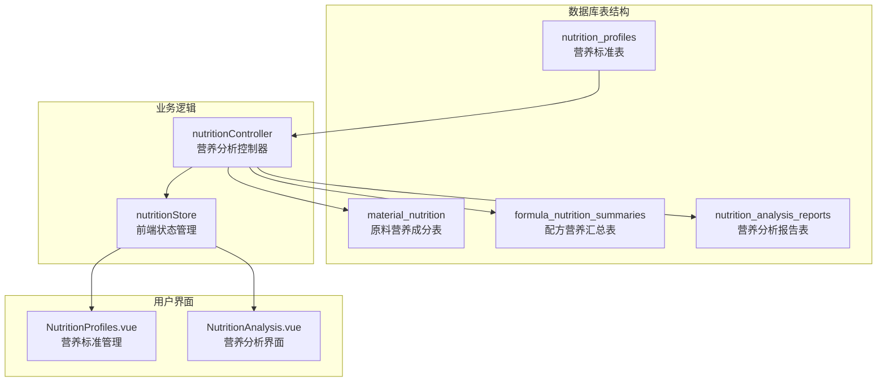
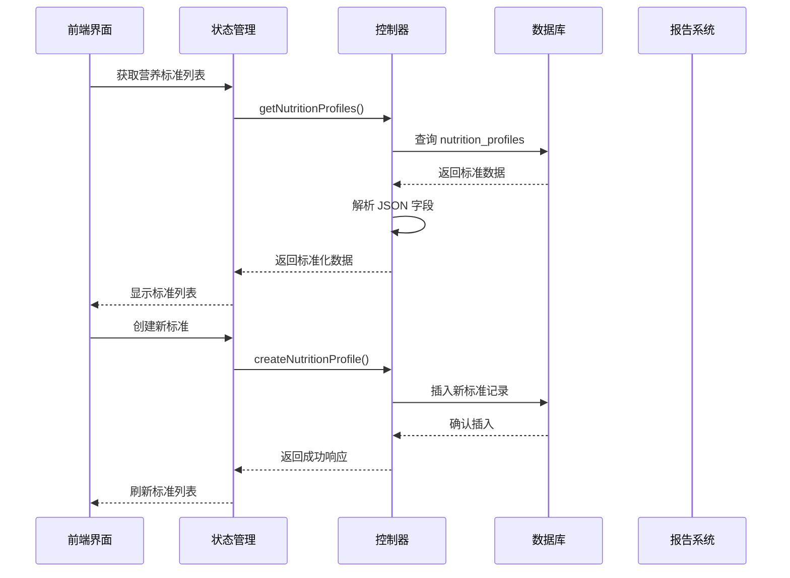
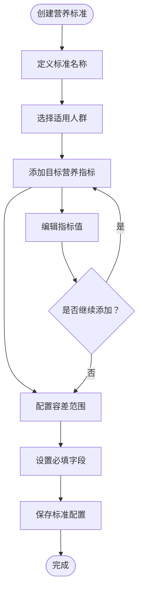
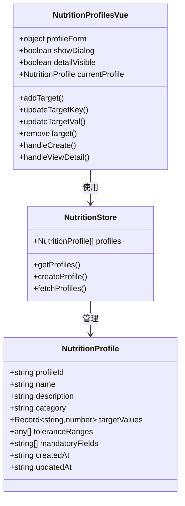
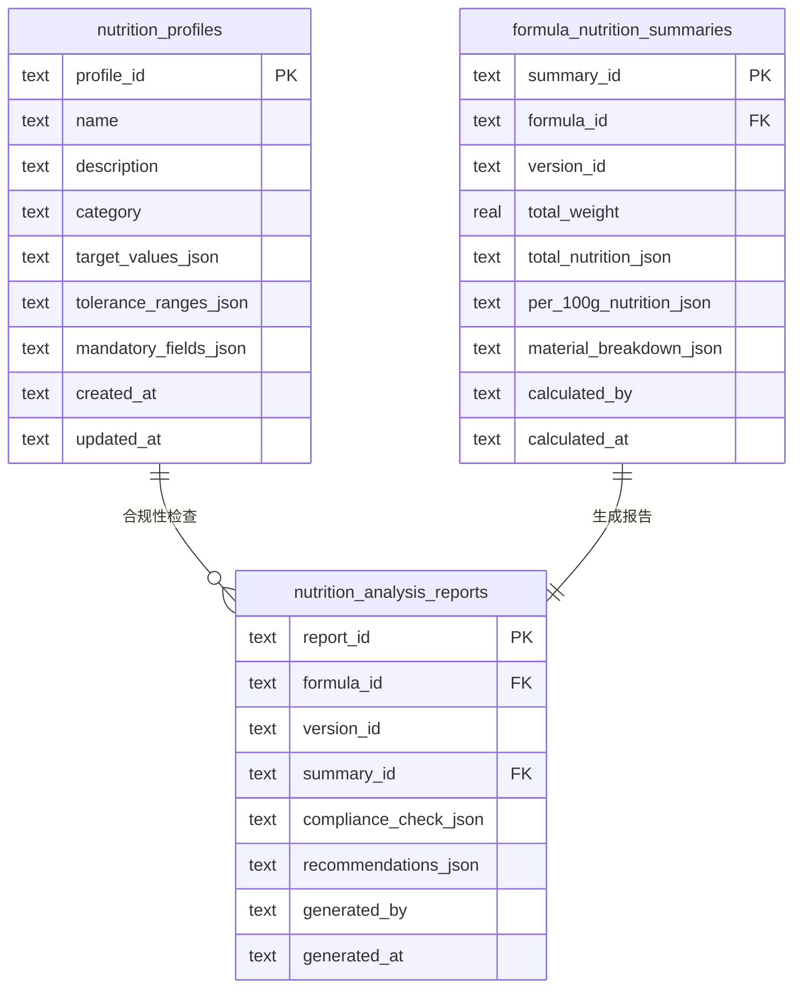
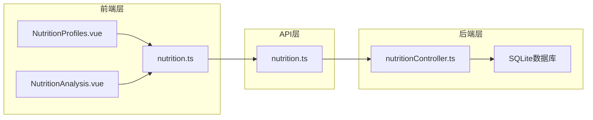

# 营养标准/档案表 (nutrition_profiles)

<cite>
**本文档引用的文件**
- [DATABASE_DOC.md](file://backend/DATABASE_DOC.md)
- [init.sql](file://backend/src/scripts/init.sql)
- [nutritionController.ts](file://backend/src/controllers/nutritionController.ts)
- [nutrition.ts](file://frontend/src/stores/nutrition.ts)
- [NutritionProfiles.vue](file://frontend/src/views/nutrition/NutritionProfiles.vue)
- [NutritionAnalysis.vue](file://frontend/src/views/nutrition/NutritionAnalysis.vue)
- [nutrition.ts](file://frontend/src/api/nutrition.ts)
- [seedData.ts](file://backend/src/scripts/seedData.ts)
</cite>

## 目录
1. [简介](#简介)
2. [项目结构](#项目结构)
3. [核心组件](#核心组件)
4. [架构概览](#架构概览)
5. [详细组件分析](#详细组件分析)
6. [依赖关系分析](#依赖关系分析)
7. [性能考虑](#性能考虑)
8. [故障排查指南](#故障排查指南)
9. [结论](#结论)

## 简介
营养标准/档案表 (nutrition_profiles) 是 TingStudio 营养分析模块的核心数据表，用于存储不同人群的营养标准值，支持配方的合规性检查。该表采用 JSON 字段存储动态的营养指标配置，提供了灵活的标准管理能力。

## 项目结构
营养标准表位于数据库设计文档的营养分析模块中，与配方、原料等表形成完整的营养分析生态系统：

**图表来源**
- [DATABASE_DOC.md: 348-368:348-368](file://backend/DATABASE_DOC.md#L348-L368)
- [init.sql: 200-212:200-212](file://backend/src/scripts/init.sql#L200-L212)

## 核心组件

### 数据表结构
nutrition_profiles 表采用 SQLite 存储，所有 JSON 字段均以 TEXT 类型存储，由应用层进行解析：

| 字段名 | 数据类型 | 约束 | 说明 |
|--------|----------|------|------|
| profile_id | TEXT | PRIMARY KEY | 标准唯一标识符 |
| name | TEXT | NOT NULL | 标准名称，如"婴儿配方奶GB10765标准" |
| description | TEXT | NULL | 标准描述信息 |
| category | TEXT | NOT NULL | 适用人群分类，枚举值包括：infant/child/adult/elderly/pregnant/special |
| target_values_json | TEXT | NOT NULL | 目标营养值配置，JSON 格式存储 |
| tolerance_ranges_json | TEXT | NULL | 容差范围配置，JSON 格式存储 |
| mandatory_fields_json | TEXT | NULL | 必填字段列表，JSON 格式存储 |
| created_at | TEXT | NOT NULL | 创建时间戳 |
| updated_at | TEXT | NOT NULL | 更新时间戳 |

### 索引设计
- **主键索引**: profile_id (自动创建)
- **分类索引**: idx_np_category(category) - 支持按人群分类查询
- **外键约束**: 与其他表无直接外键关联，作为独立标准库使用

**章节来源**
- [DATABASE_DOC.md: 348-368:348-368](file://backend/DATABASE_DOC.md#L348-L368)
- [init.sql: 200-212:200-212](file://backend/src/scripts/init.sql#L200-L212)

## 架构概览
营养标准表在整个营养分析系统中的作用和交互关系：

**图表来源**
- [nutritionController.ts: 244-288:244-288](file://backend/src/controllers/nutritionController.ts#L244-L288)
- [nutrition.ts: 51-71:51-71](file://frontend/src/stores/nutrition.ts#L51-L71)

## 详细组件分析

### 营养标准分类体系
系统支持以下六种人群分类：

| 分类代码 | 适用人群 | 主要特征 |
|----------|----------|----------|
| infant | 婴儿 (0-12个月) | 以母乳或配方奶为主要营养来源 |
| child | 儿童 (1-12岁) | 生长发育关键期，营养需求较高 |
| adult | 成人 (18-60岁) | 基础代谢水平稳定 |
| elderly | 老年人 (60岁以上) | 新陈代谢下降，消化吸收能力减弱 |
| pregnant | 孕妇 | 营养需求增加，需关注叶酸、铁等 |
| special | 特殊医学用途 | 针对特定疾病状态的营养需求 |

### 目标值配置机制
目标值配置采用 JSON 格式存储，支持任意营养指标的设定：

**图表来源**
- [nutritionController.ts: 271-288:271-288](file://backend/src/controllers/nutritionController.ts#L271-L288)
- [NutritionProfiles.vue: 126-184:126-184](file://frontend/src/views/nutrition/NutritionProfiles.vue#L126-L184)

### 容差范围配置
容差范围用于定义营养指标的允许偏差范围，支持三种状态：

| 状态 | 描述 | 用途 |
|------|------|------|
| pass | 达标 | 实际值在目标范围内 |
| warning | 警告 | 接近临界值，需要关注 |
| fail | 超标 | 实际值超出允许范围 |

容差范围的计算逻辑：
- **最小值**: 目标值 × 容差下限比例
- **最大值**: 目标值 × 容差上限比例
- **警告阈值**: 当偏离超过容差范围的80%时触发警告

### 必填字段配置
必填字段列表确保配方分析时必须包含的关键营养指标，系统会根据该配置进行完整性检查。

**章节来源**
- [DATABASE_DOC.md: 348-368:348-368](file://backend/DATABASE_DOC.md#L348-L368)
- [nutritionController.ts: 309-407:309-407](file://backend/src/controllers/nutritionController.ts#L309-L407)

### 前端管理界面
前端提供了完整的营养标准管理界面，支持标准的创建、编辑、删除和查询功能：

**图表来源**
- [nutrition.ts: 3-13:3-13](file://frontend/src/api/nutrition.ts#L3-L13)
- [NutritionProfiles.vue: 126-215:126-215](file://frontend/src/views/nutrition/NutritionProfiles.vue#L126-L215)

**章节来源**
- [NutritionProfiles.vue: 1-262:1-262](file://frontend/src/views/nutrition/NutritionProfiles.vue#L1-L262)
- [nutrition.ts: 1-100:1-100](file://frontend/src/stores/nutrition.ts#L1-L100)

## 依赖关系分析

### 数据库依赖关系
nutrition_profiles 表与其他表的关系相对独立，主要通过合规性检查间接关联：

**图表来源**
- [init.sql: 200-227:200-227](file://backend/src/scripts/init.sql#L200-L227)

### 前端依赖关系
前端状态管理与控制器的交互关系：

**图表来源**
- [nutrition.ts: 1-38:1-38](file://frontend/src/api/nutrition.ts#L1-L38)
- [nutritionController.ts: 1-641:1-641](file://backend/src/controllers/nutritionController.ts#L1-L641)

**章节来源**
- [nutrition.ts: 1-38:1-38](file://frontend/src/api/nutrition.ts#L1-L38)
- [nutritionController.ts: 1-641:1-641](file://backend/src/controllers/nutritionController.ts#L1-L641)

## 性能考虑
- **索引优化**: 分类字段建立了索引，支持高效的分类查询
- **JSON解析**: 所有 JSON 字段在应用层进行解析，避免数据库层面的复杂查询
- **缓存策略**: 前端状态管理提供数据缓存，减少重复请求
- **批量操作**: 支持批量获取营养标准列表，提高用户体验

## 故障排查指南

### 常见问题及解决方案

#### 1. JSON 格式错误
**症状**: 创建或更新营养标准时出现解析错误
**原因**: JSON 格式不符合规范
**解决方法**: 
- 检查 target_values_json、tolerance_ranges_json 的格式
- 确保所有数值都是有效的数字格式
- 验证 JSON 结构的完整性

#### 2. 分类字段验证失败
**症状**: 插入数据时报错，提示分类无效
**原因**: category 字段值不在允许的枚举范围内
**解决方法**: 
- 确保分类值为以下之一：infant、child、adult、elderly、pregnant、special

#### 3. 前端显示异常
**症状**: 营养标准列表无法正常显示
**原因**: API 请求失败或数据解析错误
**解决方法**:
- 检查网络连接状态
- 验证后端服务运行状态
- 查看浏览器控制台错误信息

**章节来源**
- [nutritionController.ts: 244-288:244-288](file://backend/src/controllers/nutritionController.ts#L244-L288)
- [nutrition.ts: 51-71:51-71](file://frontend/src/stores/nutrition.ts#L51-L71)

## 结论
nutrition_profiles 表作为营养分析系统的核心数据表，通过灵活的 JSON 配置机制支持了多样化的营养标准管理需求。其设计充分考虑了不同人群的营养特点，提供了完善的容差范围和必填字段配置能力。配合前后端的完整实现，形成了一个功能完备、易于扩展的营养标准管理系统。

该表的设计体现了现代数据库设计的最佳实践：既保持了数据结构的灵活性，又确保了查询性能和数据完整性。通过合理的索引设计和前端状态管理，系统能够高效地处理大量的营养标准数据，并为用户提供流畅的操作体验。