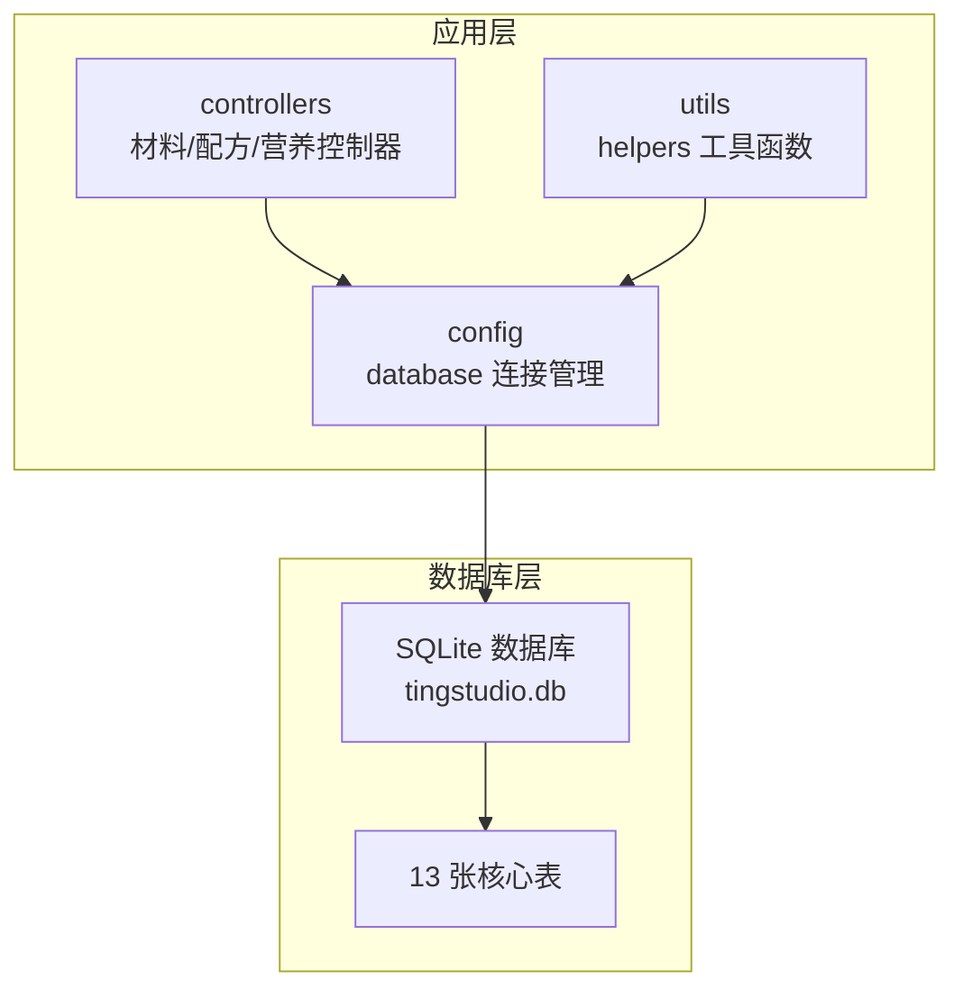
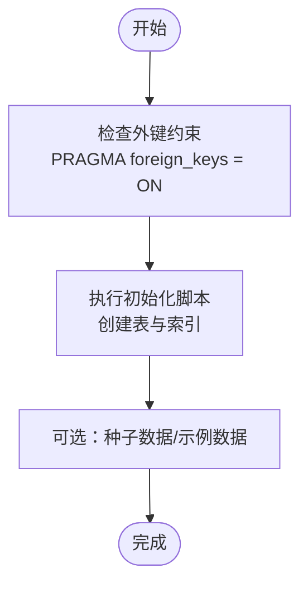

# 表结构详解

<cite>
**本文档引用的文件**
- [DATABASE_DOC.md](file://backend/DATABASE_DOC.md)
- [init.sql](file://backend/src/scripts/init.sql)
- [database.ts](file://backend/src/config/database.ts)
- [helpers.ts](file://backend/src/utils/helpers.ts)
- [materialController.ts](file://backend/src/controllers/materialController.ts)
- [formulaController.ts](file://backend/src/controllers/formulaController.ts)
- [nutritionController.ts](file://backend/src/controllers/nutritionController.ts)
</cite>

## 目录
1. [简介](#简介)
2. [项目结构](#项目结构)
3. [核心组件](#核心组件)
4. [架构总览](#架构总览)
5. [详细组件分析](#详细组件分析)
6. [依赖分析](#依赖分析)
7. [性能考量](#性能考量)
8. [故障排查指南](#故障排查指南)
9. [结论](#结论)

## 简介
本文件基于 TingStudio 项目的数据库设计文档与初始化 SQL 脚本，系统性梳理了 13 张核心表的结构设计与业务含义。内容涵盖字段定义、数据类型、约束条件、索引设计，并结合控制器实现说明各表在系统中的作用与典型使用流程。目标是帮助开发者快速理解数据模型与业务关系，便于后续开发与维护。

## 项目结构
数据库采用 SQLite（better-sqlite3），通过初始化脚本一次性创建全部表及索引；应用层通过统一的数据库连接管理模块进行访问；控制器层封装了对各表的增删改查逻辑，并在必要处进行外键约束与数据一致性校验。



图表来源
- [database.ts:10-70](file://backend/src/config/database.ts#L10-L70)
- [init.sql:1-228](file://backend/src/scripts/init.sql#L1-L228)

章节来源
- [database.ts:10-70](file://backend/src/config/database.ts#L10-L70)
- [init.sql:1-228](file://backend/src/scripts/init.sql#L1-L228)

## 核心组件
- 数据库连接与事务：统一的连接建立、WAL 模式、外键约束开启，以及查询与事务封装。
- 控制器层：围绕 13 张表的 CRUD 与业务流程（如配方版本控制、营养计算、合规检查）。
- 工具函数：ID 生成、时间格式、分页、JSON 安全解析、命名转换等。

章节来源
- [database.ts:10-70](file://backend/src/config/database.ts#L10-L70)
- [helpers.ts:1-86](file://backend/src/utils/helpers.ts#L1-L86)

## 架构总览
下图展示 13 张表之间的关系与业务流向，重点体现外键约束、一对多/一对一关系以及 JSON 字段承载的复杂数据结构。

```mermaid
erDiagram
users {
text id PK
text username UK
text password
text role
text created_at
text updated_at
}
materials {
text id PK
text name
text code UK
text unit
real stock
text material_type
real ratio_factor
text created_by
text created_at
text updated_at
}
salesmen {
text id PK
text name
text code UK
text department
text phone
text email
text status
text created_by
text created_at
text updated_at
}
formulas {
text id PK
text name
text salesman_id FK
text salesman_name
text materials_json
real finished_weight
text description
text created_by
text created_at
text updated_at
}
formula_versions {
text version_id PK
text formula_id FK
text version_number
text version_name
text changes_json
text snapshot_json
text status
integer is_current
text created_by
text created_at
}
export_templates {
text template_id PK
text name
text description
text type
text format_config_json
integer is_default
text created_by
text created_at
}
export_jobs {
text job_id PK
text formula_id FK
text version_id
text template_id
text export_type
text status
text file_url
text file_name
text api_endpoint
integer progress
text error_message
text created_by
text created_at
text completed_at
}
api_data_interfaces {
text interface_id PK
text name
text description
text endpoint UK
text method
text authentication
text auth_config_json
text data_format
text field_mapping_json
text rate_limit_json
text retry_config_json
text created_by
text created_at
text updated_at
}
share_configs {
text share_id PK
text formula_id FK
text version_id
text share_type
text share_url
text password
text expire_date
text allowed_emails_json
integer download_limit
integer download_count
text created_by
text created_at
}
material_nutrition {
text nutrition_id PK
text material_id FK UK
text per_100g_json
text data_version
text data_source
text notes
text last_updated
}
formula_nutrition_summaries {
text summary_id PK
text formula_id FK
text version_id UK
real total_weight
text total_nutrition_json
text per_100g_nutrition_json
text material_breakdown_json
text calculated_by
text calculated_at
}
nutrition_profiles {
text profile_id PK
text name
text description
text category
text target_values_json
text tolerance_ranges_json
text mandatory_fields_json
text created_at
text updated_at
}
nutrition_analysis_reports {
text report_id PK
text formula_id FK
text version_id
text summary_id FK
text compliance_check_json
text recommendations_json
text generated_by
text generated_at
}
users ||--o{ materials : "created_by"
users ||--o{ formulas : "created_by"
users ||--o{ salesmen : "created_by"
users ||--o{ formula_versions : "created_by"
users ||--o{ export_templates : "created_by"
users ||--o{ export_jobs : "created_by"
users ||--o{ api_data_interfaces : "created_by"
users ||--o{ share_configs : "created_by"
users ||--o{ formula_nutrition_summaries : "calculated_by"
users ||--o{ nutrition_analysis_reports : "generated_by"
materials ||--|| material_nutrition : "material_id"
salesmen ||--o{ formulas : "salesman_id"
formulas ||--o{ formula_versions : "formula_id"
formulas ||--o{ export_jobs : "formula_id"
formulas ||--o{ formula_nutrition_summaries : "formula_id"
formulas ||--o{ share_configs : "formula_id"
formulas ||--o{ nutrition_analysis_reports : "formula_id"
formula_versions ||--|| formula_nutrition_summaries : "version_id"
formula_nutrition_summaries ||--o{ nutrition_analysis_reports : "summary_id"
```

图表来源
- [init.sql:7-228](file://backend/src/scripts/init.sql#L7-L228)
- [DATABASE_DOC.md:393-427](file://backend/DATABASE_DOC.md#L393-L427)

## 详细组件分析

### 用户表 users
- 字段与类型：主键 id（TEXT）、用户名 username（TEXT，UNIQUE）、密码 password（TEXT）、角色 role（TEXT，默认 'formulist'，CHECK 约束取值于 'admin'/'formulist'）、创建/更新时间 created_at/updated_at（TEXT，ISO 8601）。
- 约束与索引：PRIMARY KEY、UNIQUE(username)、CHECK(role IN ('admin','formulist'))、默认时间戳。
- 业务含义：区分管理员与配方师两类用户，支撑多表的 created_by 关联与权限控制。
- 典型使用：控制器中通过用户 ID 过滤查询、创建/更新时写入 created_by。

章节来源
- [init.sql:8-15](file://backend/src/scripts/init.sql#L8-L15)
- [DATABASE_DOC.md:25-42](file://backend/DATABASE_DOC.md#L25-L42)
- [materialController.ts:13](file://backend/src/controllers/materialController.ts#L13)
- [formulaController.ts:13](file://backend/src/controllers/formulaController.ts#L13)

### 原料表 materials
- 字段与类型：主键 id（TEXT）、名称 name（TEXT）、编码 code（TEXT，UNIQUE）、单位 unit（TEXT，默认 'g'）、库存 stock（REAL，默认 0）、类型 material_type（TEXT，默认 'herb'，CHECK 取值于 'herb'/'supplement'）、含量比系数 ratio_factor（REAL，默认 0.18）、创建人 created_by（TEXT）、创建/更新时间 created_at/updated_at（TEXT）。
- 约束与索引：PRIMARY KEY、UNIQUE(code)、CHECK(material_type IN ('herb','supplement'))、索引 idx_material_name、idx_material_code。
- 业务含义：存储配方所需原料的基础信息，支持库存管理与配方计算。
- 典型使用：控制器中按关键字检索、唯一性校验、删除前检查是否被配方引用（通过 JSON 文本 LIKE 检索）。

章节来源
- [init.sql:18-31](file://backend/src/scripts/init.sql#L18-L31)
- [DATABASE_DOC.md:44-65](file://backend/DATABASE_DOC.md#L44-L65)
- [materialController.ts:15-38](file://backend/src/controllers/materialController.ts#L15-L38)
- [materialController.ts:113-128](file://backend/src/controllers/materialController.ts#L113-L128)

### 配方表 formulas
- 字段与类型：主键 id（TEXT）、名称 name（TEXT）、业务员 salesman_id（TEXT，FK → salesmen.id，RESTRICT 删除）、业务员名称冗余 salesman_name（TEXT）、原料列表 materials_json（TEXT，JSON）、成品重量 finished_weight（REAL，默认 0）、描述 description（TEXT）、创建人 created_by（TEXT）、创建/更新时间 created_at/updated_at（TEXT）。
- 约束与索引：FOREIGN KEY(salesman_id) → salesmen(id) ON DELETE RESTRICT、索引 idx_formula_name、idx_formula_salesman_id、idx_formula_created_by。
- JSON 结构：materials_json 为数组，元素包含 materialId、materialName、quantity。
- 业务含义：存储配方基本信息与原料构成，支持版本控制与导出、分享、营养分析。
- 典型使用：创建/更新时自动构建版本快照与变更记录；按原料查询配方。

章节来源
- [init.sql:34-49](file://backend/src/scripts/init.sql#L34-L49)
- [DATABASE_DOC.md:67-99](file://backend/DATABASE_DOC.md#L67-L99)
- [formulaController.ts:88-130](file://backend/src/controllers/formulaController.ts#L88-L130)
- [formulaController.ts:132-218](file://backend/src/controllers/formulaController.ts#L132-L218)
- [formulaController.ts:231-243](file://backend/src/controllers/formulaController.ts#L231-L243)

### 业务员表 salesmen
- 字段与类型：主键 id（TEXT）、姓名 name（TEXT）、工号 code（TEXT，UNIQUE）、部门 department（TEXT）、电话 phone（TEXT）、邮箱 email（TEXT）、状态 status（TEXT，默认 'active'，CHECK 取值于 'active'/'inactive'）、创建人 created_by（TEXT）、创建/更新时间 created_at/updated_at（TEXT）。
- 约束与索引：UNIQUE(code)、CHECK(status IN ('active','inactive'))、索引 idx_salesman_name、idx_salesman_code、idx_salesman_status。
- 业务含义：管理业务员信息，作为配方的归属关系。

章节来源
- [init.sql:56-70](file://backend/src/scripts/init.sql#L56-L70)
- [DATABASE_DOC.md:101-122](file://backend/DATABASE_DOC.md#L101-L122)

### 配方版本表 formula_versions
- 字段与类型：主键 version_id（TEXT）、配方 formula_id（TEXT，FK → formulas.id，CASCADE 删除）、版本号 version_number（TEXT）、版本名称 version_name（TEXT）、变更记录 changes_json（TEXT）、完整快照 snapshot_json（TEXT）、状态 status（TEXT，默认 'draft'，CHECK 取值于 'draft'/'published'/'archived'）、是否当前 is_current（INTEGER，默认 0）、创建人 created_by（TEXT）、创建时间 created_at（TEXT）。
- 约束与索引：FOREIGN KEY(formula_id) → formulas(id) ON DELETE CASCADE、索引 idx_fv_formula、idx_fv_version_number。
- JSON 结构：snapshot_json 为完整配方快照；changes_json 为变更记录数组。
- 业务含义：记录配方的版本历史与变更详情，支持版本对比与审计。

章节来源
- [init.sql:77-91](file://backend/src/scripts/init.sql#L77-L91)
- [DATABASE_DOC.md:125-172](file://backend/DATABASE_DOC.md#L125-L172)
- [formulaController.ts:167-211](file://backend/src/controllers/formulaController.ts#L167-L211)

### 导出模板表 export_templates
- 字段与类型：主键 template_id（TEXT）、模板名称 name（TEXT）、描述 description（TEXT）、类型 type（TEXT，CHECK 取值于 'pdf'/'excel'/'api'/'print'）、格式配置 format_config_json（TEXT）、是否默认 is_default（INTEGER，默认 0）、创建人 created_by（TEXT）、创建时间 created_at（TEXT）。
- 约束与索引：CHECK(type IN ('pdf','excel','api','print'))、索引 idx_et_type。
- 业务含义：定义导出任务的模板配置，支持多种导出格式与 API 推送。

章节来源
- [init.sql:98-108](file://backend/src/scripts/init.sql#L98-L108)
- [DATABASE_DOC.md:175-191](file://backend/DATABASE_DOC.md#L175-L191)

### 导出任务表 export_jobs
- 字段与类型：主键 job_id（TEXT）、配方 formula_id（TEXT，FK → formulas.id，CASCADE 删除）、版本 version_id（TEXT）、模板 template_id（TEXT）、导出类型 export_type（TEXT，CHECK 取值于 'pdf'/'excel'/'api'）、状态 status（TEXT，默认 'pending'，CHECK 取值于 'pending'/'processing'/'completed'/'failed'）、文件路径 file_url（TEXT）、文件名 file_name（TEXT）、API 推送端点 api_endpoint（TEXT）、进度 progress（INTEGER，默认 0）、错误信息 error_message（TEXT）、创建人 created_by（TEXT）、创建/完成时间 created_at/completed_at（TEXT）。
- 约束与索引：FOREIGN KEY(formula_id) → formulas(id) ON DELETE CASCADE、索引 idx_ej_formula、idx_ej_status。
- 业务含义：跟踪导出任务生命周期，支持进度与错误记录。

章节来源
- [init.sql:111-129](file://backend/src/scripts/init.sql#L111-L129)
- [DATABASE_DOC.md:194-221](file://backend/DATABASE_DOC.md#L194-L221)

### API 数据接口表 api_data_interfaces
- 字段与类型：主键 interface_id（TEXT）、接口名称 name（TEXT）、描述 description（TEXT）、端点 endpoint（TEXT，UNIQUE）、HTTP 方法 method（TEXT，默认 'GET'，CHECK 取值于 'GET'/'POST'/'PUT'/'DELETE'）、认证方式 authentication（TEXT，默认 'none'，CHECK 取值于 'none'/'basic'/'apiKey'/'oauth'）、认证配置 auth_config_json（TEXT）、数据格式 data_format（TEXT，默认 'json'，CHECK 取值于 'json'/'xml'）、字段映射 field_mapping_json（TEXT）、限流配置 rate_limit_json（TEXT）、重试配置 retry_config_json（TEXT）、创建/更新人 created_by/updated_at（TEXT）。
- 约束与索引：UNIQUE(endpoint)、CHECK(method IN ('GET','POST','PUT','DELETE'))、CHECK(authentication IN ('none','basic','apiKey','oauth'))、CHECK(data_format IN ('json','xml'))、索引 idx_adi_endpoint。
- 业务含义：集中管理外部 API 接口配置，支持多种认证与数据格式。

章节来源
- [init.sql:132-148](file://backend/src/scripts/init.sql#L132-L148)
- [DATABASE_DOC.md:223-245](file://backend/DATABASE_DOC.md#L223-L245)

### 分享配置表 share_configs
- 字段与类型：主键 share_id（TEXT）、配方 formula_id（TEXT，FK → formulas.id，CASCADE 删除）、版本 version_id（TEXT）、分享类型 share_type（TEXT，默认 'link'，CHECK 取值于 'link'/'email'/'api'）、分享 URL share_url（TEXT）、访问密码 password（TEXT）、过期日期 expire_date（TEXT）、允许邮箱 allowed_emails_json（TEXT）、下载次数限制 download_limit（INTEGER）、已下载次数 download_count（INTEGER，默认 0）、创建人 created_by（TEXT）、创建时间 created_at（TEXT）。
- 约束与索引：FOREIGN KEY(formula_id) → formulas(id) ON DELETE CASCADE、索引 idx_sc_formula。
- 业务含义：管理配方分享链接与访问控制，支持密码、有效期与下载次数限制。

章节来源
- [init.sql:151-166](file://backend/src/scripts/init.sql#L151-L166)
- [DATABASE_DOC.md:248-270](file://backend/DATABASE_DOC.md#L248-L270)

### 原料营养成分表 material_nutrition
- 字段与类型：主键 nutrition_id（TEXT）、原料 material_id（TEXT，UNIQUE，FK → materials.id，CASCADE 删除）、每100g营养 per_100g_json（TEXT）、数据版本 data_version（TEXT，默认 '1.0'）、数据来源 data_source（TEXT）、备注 notes（TEXT）、最后更新 last_updated（TEXT）。
- 约束与索引：UNIQUE(material_id)、FOREIGN KEY(material_id) → materials(id) ON DELETE CASCADE。
- JSON 结构：per_100g_json 为包含多种营养素的键值对（如能量、蛋白质、脂肪、碳水、维生素等）。
- 业务含义：存储每种原料的营养成分数据，支持版本演进与来源追踪。

章节来源
- [init.sql:173-182](file://backend/src/scripts/init.sql#L173-L182)
- [DATABASE_DOC.md:273-321](file://backend/DATABASE_DOC.md#L273-L321)
- [nutritionController.ts:56-74](file://backend/src/controllers/nutritionController.ts#L56-L74)
- [nutritionController.ts:77-121](file://backend/src/controllers/nutritionController.ts#L77-L121)

### 配方营养汇总表 formula_nutrition_summaries
- 字段与类型：主键 summary_id（TEXT）、配方 formula_id（TEXT，FK → formulas.id，CASCADE 删除）、版本 version_id（TEXT，UNIQUE），配方总重量 total_weight（REAL，默认 0）、总营养 total_nutrition_json（TEXT）、每100g营养 per_100g_nutrition_json（TEXT）、各原料贡献明细 material_breakdown_json（TEXT）、计算人 calculated_by（TEXT）、计算时间 calculated_at（TEXT）。
- 约束与索引：FOREIGN KEY(formula_id) → formulas(id) ON DELETE CASCADE、UNIQUE(version_id)、索引 idx_fns_formula。
- 业务含义：存储配方的营养计算结果，支持合规性检查与报告生成。
- 典型使用：控制器中按配方计算汇总并保存，或更新已有记录。

章节来源
- [init.sql:185-198](file://backend/src/scripts/init.sql#L185-L198)
- [DATABASE_DOC.md:324-346](file://backend/DATABASE_DOC.md#L324-L346)
- [nutritionController.ts:124-242](file://backend/src/controllers/nutritionController.ts#L124-L242)

### 营养标准/档案表 nutrition_profiles
- 字段与类型：主键 profile_id（TEXT）、标准名称 name（TEXT）、描述 description（TEXT）、分类 category（TEXT，CHECK 取值于 'infant'/'child'/'adult'/'elderly'/'pregnant'/'special'）、目标值 target_values_json（TEXT）、容差范围 tolerance_ranges_json（TEXT）、必填字段 mandatory_fields_json（TEXT）、创建/更新时间 created_at/updated_at（TEXT）。
- 约束与索引：CHECK(category IN ('infant','child','adult','elderly','pregnant','special'))、索引 idx_np_category。
- 业务含义：存储不同人群的营养标准值，用于合规性检查与建议生成。

章节来源
- [init.sql:201-212](file://backend/src/scripts/init.sql#L201-L212)
- [DATABASE_DOC.md:348-367](file://backend/DATABASE_DOC.md#L348-L367)
- [nutritionController.ts:244-288](file://backend/src/controllers/nutritionController.ts#L244-L288)

### 营养分析报告表 nutrition_analysis_reports
- 字段与类型：主键 report_id（TEXT）、配方 formula_id（TEXT，FK → formulas.id，CASCADE 删除）、版本 version_id（TEXT）、营养汇总 summary_id（TEXT，FK → formula_nutrition_summaries.summary_id，CASCADE 删除）、合规检查 compliance_check_json（TEXT）、建议 recommendations_json（TEXT）、生成人 generated_by（TEXT）、生成时间 generated_at（TEXT）。
- 约束与索引：FOREIGN KEY(formula_id) → formulas(id) ON DELETE CASCADE、FOREIGN KEY(summary_id) → formula_nutrition_summaries(summary_id) ON DELETE CASCADE、索引 idx_nar_formula。
- 业务含义：存储配方的合规性检查报告，支持生成与查询。

章节来源
- [init.sql:215-227](file://backend/src/scripts/init.sql#L215-L227)
- [DATABASE_DOC.md:370-391](file://backend/DATABASE_DOC.md#L370-L391)
- [nutritionController.ts:290-407](file://backend/src/controllers/nutritionController.ts#L290-L407)

## 依赖分析
- 外键关系：users 与多表 created_by 关联；materials 与 material_nutrition 一对一；formulas 与 salesmen 多对一；formulas 与多个下游表（versions、jobs、summaries、shares、reports）一对多；versions 与 summaries 一对一（version_id 唯一）。
- JSON 字段：materials_json、changes_json、snapshot_json、format_config_json、auth_config_json、field_mapping_json、rate_limit_json、retry_config_json、per_100g_json、total_nutrition_json、per_100g_nutrition_json、material_breakdown_json、target_values_json、tolerance_ranges_json、mandatory_fields_json、compliance_check_json、recommendations_json 等承载复杂业务数据。
- 索引策略：针对高频查询字段建立索引（如名称、编码、状态、类型、外键列），提升查询性能。
- 控制器依赖：各控制器通过统一的数据库查询封装执行 SQL，部分涉及复杂业务逻辑（如配方版本号计算、营养计算、合规检查）。



图表来源
- [database.ts:21-23](file://backend/src/config/database.ts#L21-L23)
- [init.sql:1-228](file://backend/src/scripts/init.sql#L1-L228)

章节来源
- [database.ts:21-23](file://backend/src/config/database.ts#L21-L23)
- [init.sql:1-228](file://backend/src/scripts/init.sql#L1-L228)

## 性能考量
- 索引优化：为高频过滤字段（名称、编码、状态、类型、外键）建立索引，避免全表扫描。
- JSON 查询：JSON 字段的过滤与匹配（如 LIKE 模糊匹配）可能影响性能，建议在必要时引入虚拟列或物化视图（SQLite 3.31+ 支持 JSON 函数）。
- 外键约束：启用外键约束确保数据一致性，但会增加插入/更新成本；可通过批量事务减少开销。
- 时间格式：统一使用 ISO 8601 字符串存储时间，便于排序与跨语言解析。
- ID 生成：采用基于时间戳与随机数拼接的字符串 ID，避免 UUID 的存储与索引开销。

## 故障排查指南
- 唯一约束冲突：创建/更新原料时若编码重复，控制器捕获错误并返回冲突提示。
- 外键约束拒绝：删除/更新受外键保护的记录时，需先清理引用或调整级联策略。
- JSON 解析异常：安全解析函数在解析失败时返回默认值，避免应用崩溃。
- 导出任务状态：导出任务的状态机（pending → processing → completed/failed）需正确流转，错误信息可用于定位问题。
- 营养计算缺失：当原料缺少营养数据时，计算流程会记录缺失清单，建议及时补全。

章节来源
- [materialController.ts:73-78](file://backend/src/controllers/materialController.ts#L73-L78)
- [materialController.ts:100-105](file://backend/src/controllers/materialController.ts#L100-L105)
- [formulaController.ts:167-211](file://backend/src/controllers/formulaController.ts#L167-L211)
- [nutritionController.ts:77-121](file://backend/src/controllers/nutritionController.ts#L77-L121)
- [nutritionController.ts:124-242](file://backend/src/controllers/nutritionController.ts#L124-L242)

## 结论
TingStudio 的数据库设计围绕“配方—原料—业务员—版本—导出—营养”六大业务主线展开，通过外键约束与 JSON 字段实现灵活扩展，配合索引与统一的查询封装保障性能与一致性。建议在后续迭代中：
- 对热点查询字段评估添加 JSON 函数索引；
- 在前端与后端统一 JSON 字段的校验与默认值策略；
- 完善版本与营养计算的审计日志与回滚机制；
- 逐步引入数据迁移脚本管理 schema 变更。