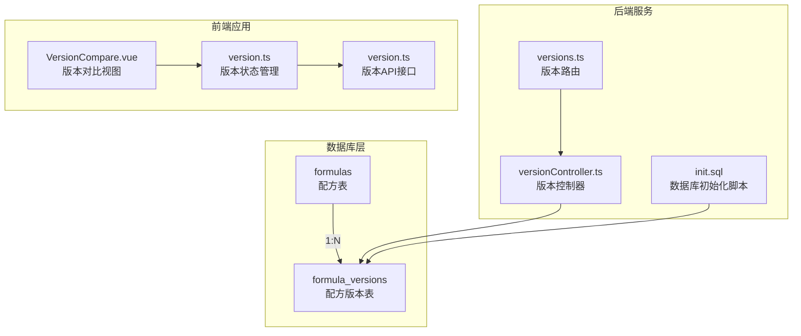
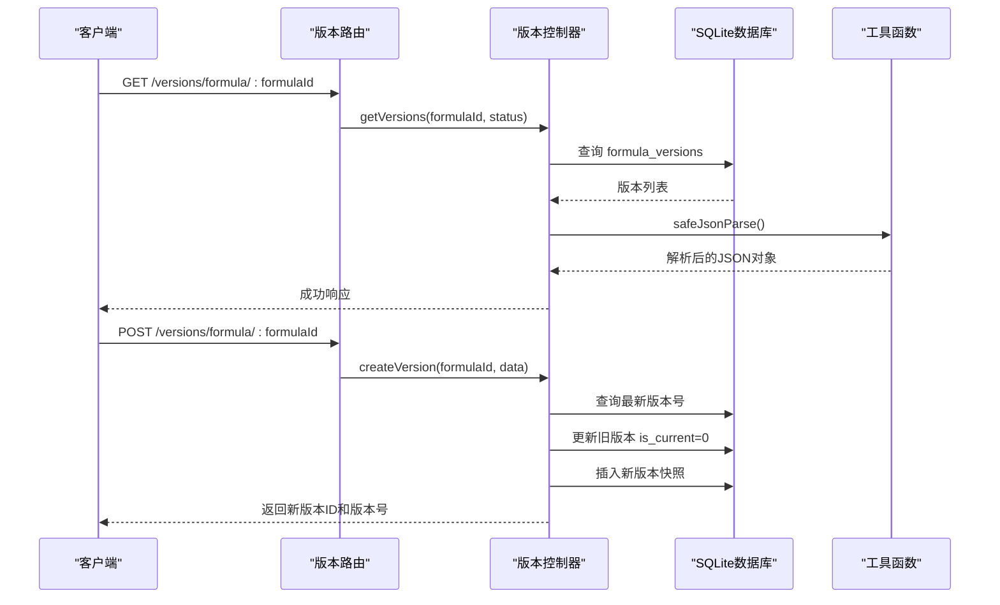
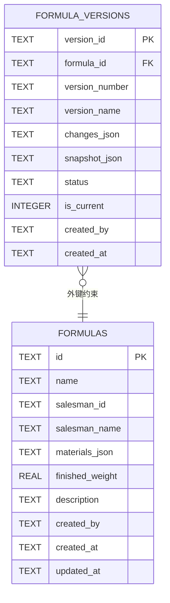
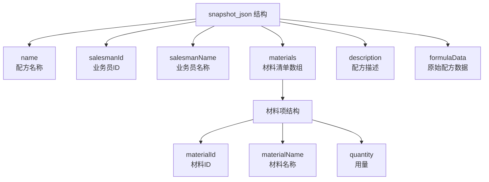
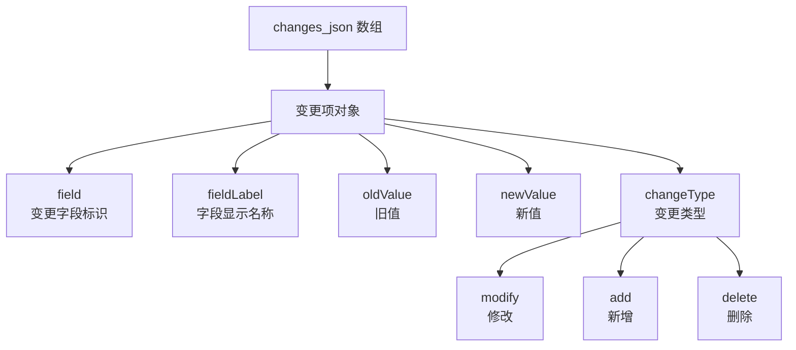
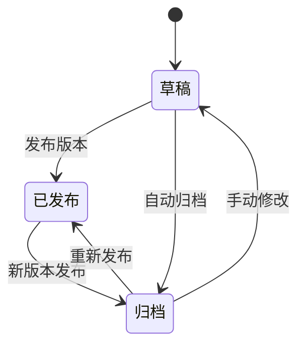
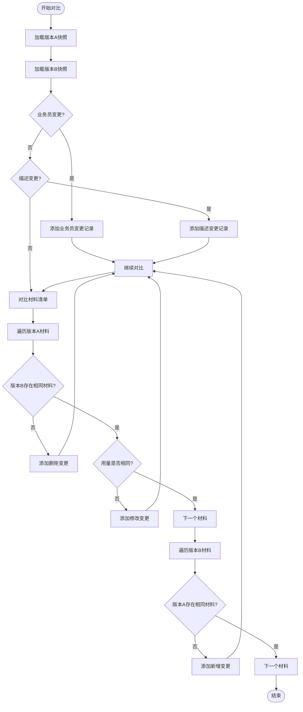
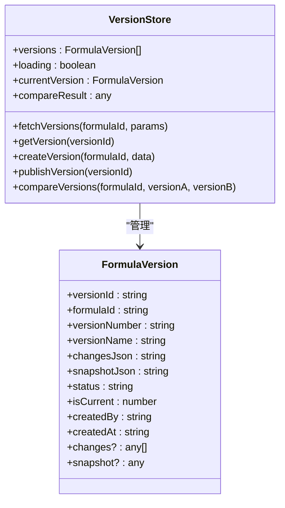
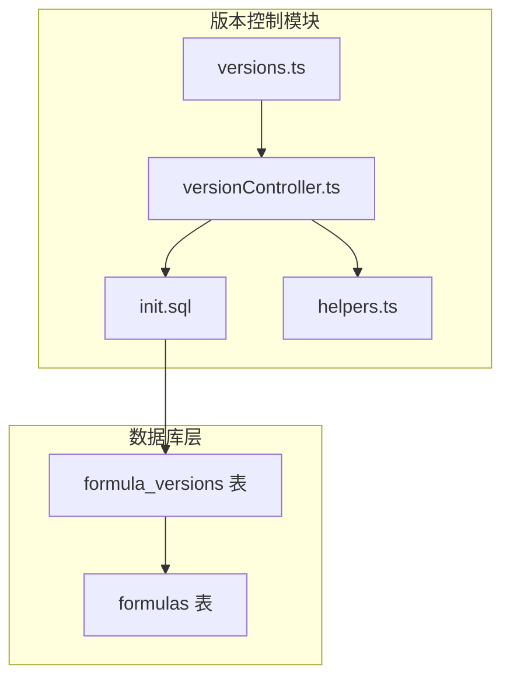
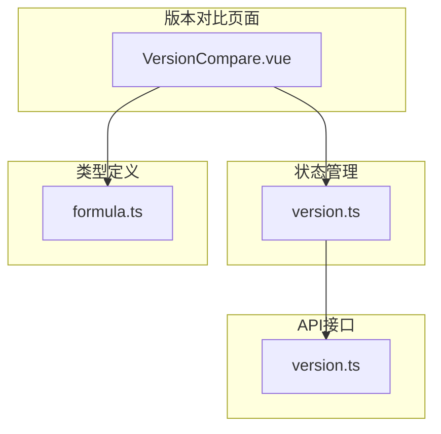

# 配方版本表 (formula_versions)

<cite>
**本文引用的文件**
- [DATABASE_DOC.md](file://backend/DATABASE_DOC.md)
- [init.sql](file://backend/src/scripts/init.sql)
- [versionController.ts](file://backend/src/controllers/versionController.ts)
- [versions.ts](file://backend/src/routes/versions.ts)
- [helpers.ts](file://backend/src/utils/helpers.ts)
- [version.ts](file://frontend/src/stores/version.ts)
- [VersionCompare.vue](file://frontend/src/views/versions/VersionCompare.vue)
- [version.ts](file://frontend/src/api/version.ts)
</cite>

## 目录
1. [简介](#简介)
2. [项目结构](#项目结构)
3. [核心组件](#核心组件)
4. [架构总览](#架构总览)
5. [详细组件分析](#详细组件分析)
6. [依赖分析](#依赖分析)
7. [性能考虑](#性能考虑)
8. [故障排除指南](#故障排除指南)
9. [结论](#结论)
10. [附录](#附录)

## 简介
配方版本表 (formula_versions) 是配方管理系统中的关键表，用于记录配方的历史版本、快照以及变更记录。该表支持版本状态管理（草稿、已发布、归档）、当前版本标记、版本对比等功能，是实现配方版本控制与审计追踪的核心数据结构。

## 项目结构
配方版本表位于数据库设计文档的“版本控制”模块中，与配方表 (formulas) 形成一对多的关系。前端通过版本对比页面展示版本差异，后端提供版本管理的完整 API 接口。

**图表来源**
- [DATABASE_DOC.md:125-173](file://backend/DATABASE_DOC.md#L125-L173)
- [init.sql:76-91](file://backend/src/scripts/init.sql#L76-L91)
- [versionController.ts:1-270](file://backend/src/controllers/versionController.ts#L1-L270)
- [versions.ts:1-17](file://backend/src/routes/versions.ts#L1-L17)

**章节来源**
- [DATABASE_DOC.md:125-173](file://backend/DATABASE_DOC.md#L125-L173)
- [init.sql:76-91](file://backend/src/scripts/init.sql#L76-L91)

## 核心组件
配方版本表包含以下核心字段：
- version_id：版本唯一标识符，主键
- formula_id：所属配方标识符，外键关联 formuls.id
- version_number：版本号（如 v1.0）
- version_name：版本名称
- changes_json：变更记录 JSON
- snapshot_json：完整配方快照 JSON
- status：版本状态（draft/published/archived）
- is_current：是否为当前版本标记
- created_by：创建人
- created_at：创建时间

**章节来源**
- [DATABASE_DOC.md:129-141](file://backend/DATABASE_DOC.md#L129-L141)
- [init.sql:77-89](file://backend/src/scripts/init.sql#L77-L89)

## 架构总览
配方版本表采用 SQLite 存储，使用 better-sqlite3 驱动。系统通过 RESTful API 提供版本管理功能，前端通过 Pinia 状态管理与 API 交互。

**图表来源**
- [versions.ts:12-16](file://backend/src/routes/versions.ts#L12-L16)
- [versionController.ts:6-35](file://backend/src/controllers/versionController.ts#L6-L35)
- [versionController.ts:60-111](file://backend/src/controllers/versionController.ts#L60-L111)
- [helpers.ts:77-85](file://backend/src/utils/helpers.ts#L77-L85)

## 详细组件分析

### 数据表结构与约束
配方版本表采用 SQLite TEXT 类型存储 JSON 字段，通过应用层解析实现强类型数据处理。

**图表来源**
- [init.sql:77-89](file://backend/src/scripts/init.sql#L77-L89)
- [DATABASE_DOC.md:125-142](file://backend/DATABASE_DOC.md#L125-L142)

### 字段详细说明

#### 主键与标识字段
- **version_id**：UUID 样式的字符串标识符，确保全局唯一性
- **formula_id**：关联到配方表的外键，支持级联删除

#### 版本标识字段
- **version_number**：语义化的版本号，支持自动递增逻辑
- **version_name**：可选的版本显示名称

#### JSON 数据字段
- **snapshot_json**：完整配方快照，包含配方基本信息和材料清单
- **changes_json**：变更记录数组，记录具体的修改内容

#### 状态管理字段
- **status**：版本状态枚举，支持 draft/published/archived
- **is_current**：布尔标记（0/1），标识当前有效版本

#### 时间戳与审计字段
- **created_by**：创建人标识
- **created_at**：ISO 8601 格式的时间戳

**章节来源**
- [DATABASE_DOC.md:129-141](file://backend/DATABASE_DOC.md#L129-L141)
- [init.sql:77-89](file://backend/src/scripts/init.sql#L77-L89)

### JSON 结构设计

#### snapshot_json 结构
快照 JSON 包含配方的完整信息，便于历史追溯和审计：

**图表来源**
- [DATABASE_DOC.md:148-158](file://backend/DATABASE_DOC.md#L148-L158)

#### changes_json 结构
变更记录 JSON 采用统一的变更描述格式：

**图表来源**
- [DATABASE_DOC.md:160-171](file://backend/DATABASE_DOC.md#L160-L171)

### 外键关系与索引设计

#### 外键关系
- **formula_id → formulas.id**：一对多关系，一个配方可有多个版本
- **ON DELETE CASCADE**：当配方被删除时，相关版本自动清理

#### 索引设计
- **idx_fv_formula**：按 formula_id 建立索引，优化查询性能
- **idx_fv_version_number**：复合索引 (formula_id, version_number)，支持版本号快速检索

**章节来源**
- [DATABASE_DOC.md:142-147](file://backend/DATABASE_DOC.md#L142-L147)
- [init.sql:90-91](file://backend/src/scripts/init.sql#L90-L91)

### 版本状态管理机制

#### 状态流转

#### 当前版本标记机制
- **单一当前版本**：每个配方仅允许一个 is_current=1 的版本
- **自动标记**：新版本创建时自动将旧版本标记为非当前
- **发布同步**：版本发布时同时设置 is_current=1

**章节来源**
- [versionController.ts:88-105](file://backend/src/controllers/versionController.ts#L88-L105)
- [versionController.ts:139-150](file://backend/src/controllers/versionController.ts#L139-L150)

### 版本对比逻辑

#### 对比算法流程

**图表来源**
- [versionController.ts:159-269](file://backend/src/controllers/versionController.ts#L159-L269)

#### 对比结果结构
对比结果包含差异列表和统计信息：
- **differences**：详细的变更记录数组
- **summary**：对比统计信息，包括新增、修改、删除的数量

**章节来源**
- [versionController.ts:159-269](file://backend/src/controllers/versionController.ts#L159-L269)

### 前端集成与用户体验

#### 版本对比界面
前端版本对比页面提供直观的对比体验：
- **版本选择器**：支持从现有版本中选择对比对象
- **统计面板**：实时显示变更总数和各类变更分布
- **差异表格**：清晰展示字段变更详情

#### 状态管理

**图表来源**
- [version.ts:6-82](file://frontend/src/stores/version.ts#L6-L82)
- [version.ts:3-16](file://frontend/src/api/version.ts#L3-L16)

**章节来源**
- [VersionCompare.vue:65-116](file://frontend/src/views/versions/VersionCompare.vue#L65-L116)
- [version.ts:6-82](file://frontend/src/stores/version.ts#L6-L82)

## 依赖分析

### 后端依赖关系

**图表来源**
- [versionController.ts:1-5](file://backend/src/controllers/versionController.ts#L1-L5)
- [versions.ts:1-6](file://backend/src/routes/versions.ts#L1-L6)
- [init.sql:76-91](file://backend/src/scripts/init.sql#L76-L91)

### 前端依赖关系

**图表来源**
- [VersionCompare.vue:68-73](file://frontend/src/views/versions/VersionCompare.vue#L68-L73)
- [version.ts:1-35](file://frontend/src/api/version.ts#L1-L35)
- [formula.ts:1-33](file://frontend/src/times/versions/VersionCompare.vue#L1-L33)

**章节来源**
- [versionController.ts:1-270](file://backend/src/controllers/versionController.ts#L1-L270)
- [versions.ts:1-17](file://backend/src/routes/versions.ts#L1-L17)

## 性能考虑
- **索引优化**：复合索引 idx_fv_version_number 支持高效的版本查询
- **JSON解析缓存**：应用层对 JSON 字段进行安全解析，避免重复解析开销
- **批量操作**：版本发布时一次性更新多个版本的状态，减少数据库往返
- **内存管理**：前端使用 Pinia 状态管理，避免不必要的组件重渲染

## 故障排除指南

### 常见问题与解决方案

#### 版本创建失败
- **症状**：创建版本时报错
- **可能原因**：配方不存在或数据库连接异常
- **解决方法**：检查配方ID有效性，确认数据库连接状态

#### 版本对比无结果
- **症状**：两个版本完全相同，对比结果显示无差异
- **可能原因**：版本快照数据不一致
- **解决方法**：重新创建版本快照，确保数据完整性

#### 状态同步问题
- **症状**：当前版本标记混乱
- **可能原因**：并发操作导致状态冲突
- **解决方法**：使用事务确保状态更新的一致性

**章节来源**
- [versionController.ts:60-111](file://backend/src/controllers/versionController.ts#L60-L111)
- [versionController.ts:159-269](file://backend/src/controllers/versionController.ts#L159-L269)

## 结论
配方版本表 (formula_versions) 通过精心设计的字段结构、状态管理和对比机制，为配方管理系统提供了完整的版本控制能力。其基于 SQLite 的轻量级实现结合前后端协同，既保证了数据一致性，又提供了良好的用户体验。JSON 字段的设计使得系统具有良好的扩展性，能够适应不断变化的业务需求。

## 附录

### API 接口规范
- **GET /versions/formula/:formulaId**：获取配方版本列表
- **GET /versions/detail/:versionId**：获取版本详情
- **POST /versions/formula/:formulaId**：创建新版本
- **PUT /versions/publish/:versionId**：发布版本
- **GET /versions/compare/:formulaId**：版本对比

### 数据类型映射
- **version_id, formula_id**：TEXT (UUID 样式字符串)
- **version_number**：TEXT (语义化版本号)
- **version_name**：TEXT (可空)
- **changes_json, snapshot_json**：TEXT (JSON 字符串)
- **status**：TEXT (枚举: draft/published/archived)
- **is_current**：INTEGER (0/1)
- **created_by**：TEXT (用户ID)
- **created_at**：TEXT (ISO 8601)