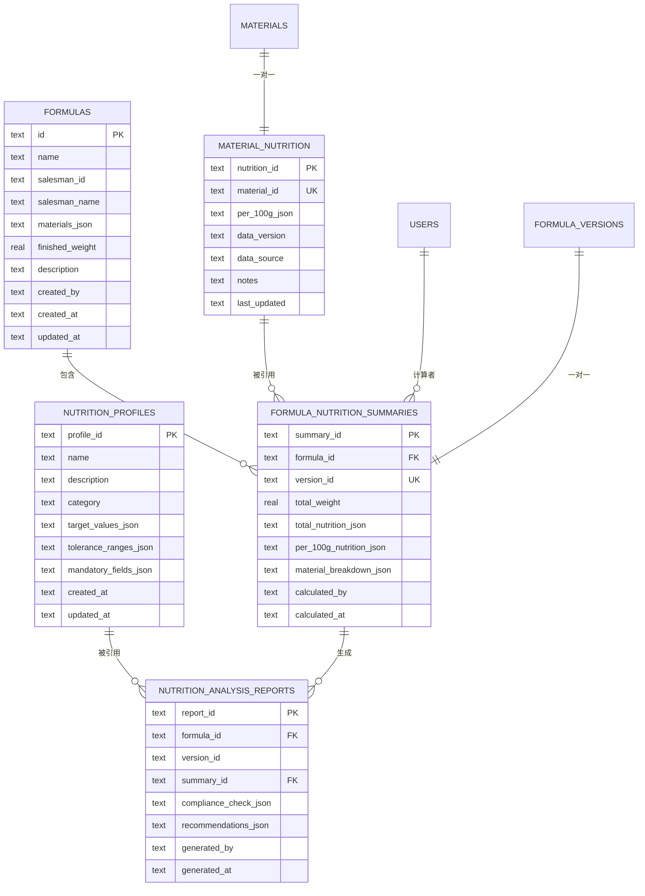
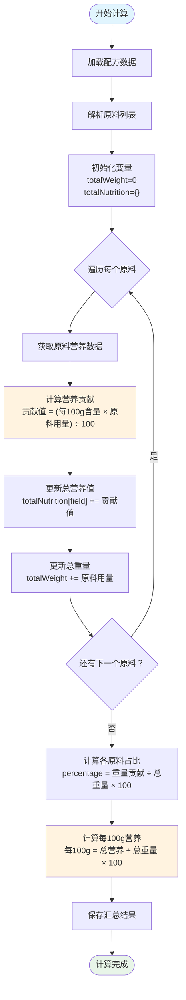
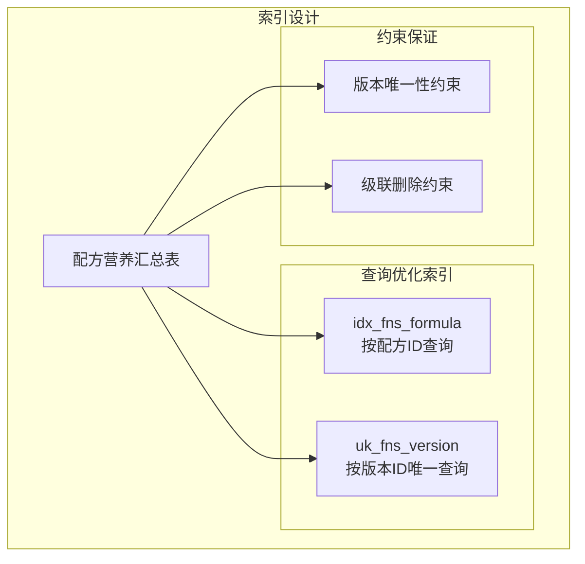
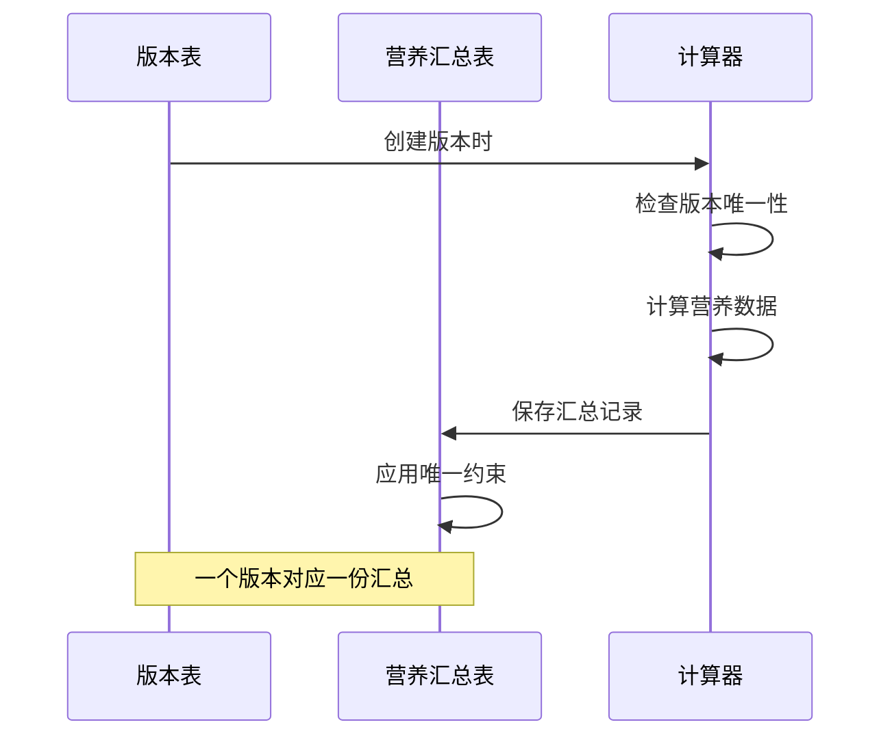

# 配方营养汇总表 (formula_nutrition_summaries)

<cite>
**本文档引用的文件**
- [DATABASE_DOC.md](file://backend/DATABASE_DOC.md)
- [init.sql](file://backend/src/scripts/init.sql)
- [nutritionController.ts](file://backend/src/controllers/nutritionController.ts)
- [nutrition.ts](file://frontend/src/api/nutrition.ts)
- [FormulaDetail.vue](file://frontend/src/views/formulas/FormulaDetail.vue)
- [NutritionAnalysis.vue](file://frontend/src/views/nutrition/NutritionAnalysis.vue)
</cite>

## 目录
1. [简介](#简介)
2. [表结构概览](#表结构概览)
3. [字段定义与业务含义](#字段定义与业务含义)
4. [数据类型与约束](#数据类型与约束)
5. [计算流程与数据结构](#计算流程与数据结构)
6. [外键关系与索引设计](#外键关系与索引设计)
7. [版本管理机制](#版本管理机制)
8. [JSON 数据结构示例](#json-数据结构示例)
9. [性能考虑](#性能考虑)
10. [故障排除指南](#故障排除指南)
11. [结论](#结论)

## 简介

配方营养汇总表（formula_nutrition_summaries）是 TingStudio 系统中用于存储配方营养成分计算结果的核心表。该表将配方中各种原料的营养数据进行聚合计算，生成配方的整体营养信息，支持合规性检查和营养分析报告生成。

## 表结构概览

配方营养汇总表采用 JSON 字段存储复杂的营养数据结构，支持灵活的营养成分扩展。表结构设计遵循 SQLite 的 JSON 存储特性，通过 TEXT 类型存储 JSON 文本，并在应用层进行解析和验证。



**图表来源**
- [init.sql:184-198](file://backend/src/scripts/init.sql#L184-L198)
- [DATABASE_DOC.md:324-346](file://backend/DATABASE_DOC.md#L324-L346)

## 字段定义与业务含义

### 核心字段说明

| 字段名 | 数据类型 | 约束 | 业务含义 |
|--------|----------|------|----------|
| **summary_id** | TEXT | PRIMARY KEY | 汇总记录唯一标识符，用于标识特定的营养计算结果 |
| **formula_id** | TEXT | NOT NULL, FK | 关联的配方标识符，建立与配方表的关联关系 |
| **version_id** | TEXT | NULL, UNIQUE | 版本标识符，支持版本化的营养计算结果管理 |
| **total_weight** | REAL | NOT NULL, DEFAULT 0 | 配方总重量（克），用于营养密度计算的基础 |
| **total_nutrition_json** | TEXT | NOT NULL | 总营养成分 JSON，存储配方所有营养素的总量 |
| **per_100g_nutrition_json** | TEXT | NOT NULL | 每100克营养 JSON，存储配方的营养密度信息 |
| **material_breakdown_json** | TEXT | NULL | 原料分解 JSON，详细记录各原料对总营养的贡献 |
| **calculated_by** | TEXT | NOT NULL | 计算执行者，记录执行营养计算的用户标识 |
| **calculated_at** | TEXT | NOT NULL | 计算时间，记录营养计算完成的时间戳 |

### 营养素字段集合

系统支持以下营养素的计算和存储：

- **宏量营养素**：能量、蛋白质、脂肪、碳水化合物、膳食纤维、糖类
- **矿物质**：钠、钾、钙、铁、锌、镁、磷
- **维生素类**：维生素A、维生素C、维生素D、维生素E、维生素K、维生素B1、维生素B2、维生素B3、维生素B6、维生素B12、叶酸
- **其他成分**：胆固醇、反式脂肪、饱和脂肪

**章节来源**
- [DATABASE_DOC.md:328-338](file://backend/DATABASE_DOC.md#L328-L338)
- [nutritionController.ts:7-13](file://backend/src/controllers/nutritionController.ts#L7-L13)

## 数据类型与约束

### 字段类型规范

所有字段均采用 SQLite 兼容的数据类型定义：

- **TEXT 类型字段**：用于存储标识符、名称、描述和 JSON 文本
- **REAL 类型字段**：用于存储数值型营养数据，支持小数精度
- **INTEGER 类型字段**：用于布尔值的存储（1/0）

### 约束条件

1. **主键约束**：summary_id 作为表的主键，确保每条汇总记录的唯一性
2. **外键约束**：formula_id 引用 formulas 表，级联删除保证数据一致性
3. **唯一约束**：uk_fns_version 确保每个版本只能有一份营养汇总
4. **非空约束**：关键字段均设置 NOT NULL 约束，保证数据完整性
5. **默认值**：total_weight 默认为 0，calculated_at 默认为当前时间

### 索引设计

- **idx_fns_formula**：在 formula_id 上创建索引，优化按配方查询性能
- **uk_fns_version**：在 version_id 上创建唯一索引，确保版本唯一性

**章节来源**
- [init.sql:184-198](file://backend/src/scripts/init.sql#L184-L198)
- [DATABASE_DOC.md:340-344](file://backend/DATABASE_DOC.md#L340-L344)

## 计算流程与数据结构

### 营养计算算法

配方营养汇总的计算过程采用加权平均算法，具体步骤如下：



**图表来源**
- [nutritionController.ts:124-242](file://backend/src/controllers/nutritionController.ts#L124-L242)

### 数据结构设计

#### total_nutrition_json 结构
存储配方所有营养素的总量，格式为：
```json
{
  "energy": 1500.0,
  "protein": 5.0,
  "fat": 1.0,
  "carbohydrate": 70.0,
  "fiber": 0.5,
  "sugars": 0,
  "sodium": 50.0,
  "potassium": 100,
  "calcium": 20.0,
  "iron": 0.5,
  "zinc": 0.3,
  "magnesium": 10,
  "phosphorus": 50,
  "vitaminA": 200,
  "vitaminC": 0.1,
  "vitaminD": 0,
  "vitaminE": 0.5,
  "vitaminK": 0,
  "vitaminB1": 0.01,
  "vitaminB2": 0.02,
  "vitaminB3": 0.1,
  "vitaminB6": 0.01,
  "vitaminB12": 0,
  "folate": 5,
  "cholesterol": 0,
  "transFat": 0,
  "saturatedFat": 0.3
}
```

#### per_100g_nutrition_json 结构
存储配方的营养密度信息，格式为：
```json
{
  "energy": 1500.00,
  "protein": 5.00,
  "fat": 1.00,
  "carbohydrate": 70.00,
  "fiber": 0.50,
  "sugars": 0.00,
  "sodium": 50.00,
  "potassium": 100.00,
  "calcium": 20.00,
  "iron": 0.50,
  "zinc": 0.30,
  "magnesium": 10.00,
  "phosphorus": 50.00,
  "vitaminA": 200.00,
  "vitaminC": 0.10,
  "vitaminD": 0.00,
  "vitaminE": 0.50,
  "vitaminK": 0.00,
  "vitaminB1": 0.01,
  "vitaminB2": 0.02,
  "vitaminB3": 0.10,
  "vitaminB6": 0.01,
  "vitaminB12": 0.00,
  "folate": 5.00,
  "cholesterol": 0.00,
  "transFat": 0.00,
  "saturatedFat": 0.30
}
```

#### material_breakdown_json 结构
详细记录各原料对总营养的贡献，格式为：
```json
[
  {
    "materialId": "MAT001",
    "materialName": "白砂糖",
    "materialCode": "",
    "quantity": 200,
    "unit": "g",
    "weightContribution": 200,
    "percentage": 40.00,
    "nutritionContribution": {
      "energy": 300.00,
      "protein": 0.00,
      "fat": 0.00,
      "carbohydrate": 70.00,
      "fiber": 0.00,
      "sugars": 70.00
    }
  }
]
```

**章节来源**
- [nutritionController.ts:140-206](file://backend/src/controllers/nutritionController.ts#L140-L206)
- [DATABASE_DOC.md:289-320](file://backend/DATABASE_DOC.md#L289-L320)

## 外键关系与索引设计

### 外键关系

配方营养汇总表建立了以下关键的外键关系：

1. **与配方表的关联**：formula_id → formulas(id) ON DELETE CASCADE
   - 确保配方删除时自动清理相关营养汇总
   - 支持按配方快速查询营养信息

2. **与用户表的关联**：calculated_by → users(id)
   - 追踪营养计算的执行者
   - 支持审计和责任追溯

3. **与版本表的关联**：version_id → formula_versions(version_id)
   - 支持版本化的营养计算结果管理
   - 确保版本唯一性约束

### 索引设计策略



**图表来源**
- [init.sql:197-198](file://backend/src/scripts/init.sql#L197-L198)

### 性能优化考虑

- **复合查询优化**：通过 idx_fns_formula 索引优化按配方的批量查询
- **版本管理优化**：uk_fns_version 索引确保版本唯一性的同时支持快速版本查询
- **内存效率**：JSON 字段设计减少重复数据存储，提高内存使用效率

**章节来源**
- [init.sql:197-198](file://backend/src/scripts/init.sql#L197-L198)
- [DATABASE_DOC.md:342-344](file://backend/DATABASE_DOC.md#L342-L344)

## 版本管理机制

### 版本唯一约束

uk_fns_version 唯一约束确保每个配方版本只能有一份营养汇总记录，防止重复计算和数据混乱。这一设计支持：

1. **版本隔离**：不同版本的配方可以有独立的营养计算结果
2. **数据一致性**：避免同一版本多次计算导致的数据冲突
3. **审计追踪**：支持版本历史的完整记录和查询

### 版本与配方的关系



**图表来源**
- [init.sql](file://backend/src/scripts/init.sql#L198)
- [DATABASE_DOC.md](file://backend/DATABASE_DOC.md#L342)

### 版本管理最佳实践

1. **版本命名规范**：使用语义化版本号（如 v1.0, v1.1）
2. **版本发布流程**：先发布版本再进行营养计算
3. **版本回滚支持**：通过版本ID快速定位历史计算结果
4. **版本清理策略**：定期清理过期版本的营养汇总数据

**章节来源**
- [DATABASE_DOC.md:342-343](file://backend/DATABASE_DOC.md#L342-L343)

## JSON 数据结构示例

### 完整的营养计算结果示例

以下是一个完整的配方营养汇总示例：

```json
{
  "formulaId": "FORM001",
  "formulaName": "婴儿配方奶粉1段",
  "totalWeight": 1000.0,
  "totalNutrition": {
    "energy": 15000.0,
    "protein": 50.0,
    "fat": 10.0,
    "carbohydrate": 700.0,
    "fiber": 5.0,
    "sugars": 700.0,
    "sodium": 500.0,
    "potassium": 1000.0,
    "calcium": 200.0,
    "iron": 5.0,
    "zinc": 3.0,
    "magnesium": 100.0,
    "phosphorus": 500.0,
    "vitaminA": 2000.0,
    "vitaminC": 1.0,
    "vitaminD": 0.0,
    "vitaminE": 5.0,
    "vitaminK": 0.0,
    "vitaminB1": 0.1,
    "vitaminB2": 0.2,
    "vitaminB3": 1.0,
    "vitaminB6": 0.1,
    "vitaminB12": 0.0,
    "folate": 50.0,
    "cholesterol": 0.0,
    "transFat": 0.0,
    "saturatedFat": 3.0
  },
  "per100gNutrition": {
    "energy": 1500.00,
    "protein": 5.00,
    "fat": 1.00,
    "carbohydrate": 70.00,
    "fiber": 0.50,
    "sugars": 70.00,
    "sodium": 50.00,
    "potassium": 100.00,
    "calcium": 20.00,
    "iron": 0.50,
    "zinc": 0.30,
    "magnesium": 10.00,
    "phosphorus": 50.00,
    "vitaminA": 200.00,
    "vitaminC": 0.10,
    "vitaminD": 0.00,
    "vitaminE": 0.50,
    "vitaminK": 0.00,
    "vitaminB1": 0.01,
    "vitaminB2": 0.02,
    "vitaminB3": 0.10,
    "vitaminB6": 0.01,
    "vitaminB12": 0.00,
    "folate": 5.00,
    "cholesterol": 0.00,
    "transFat": 0.00,
    "saturatedFat": 0.30
  },
  "materialBreakdown": [
    {
      "materialId": "MAT001",
      "materialName": "白砂糖",
      "materialCode": "",
      "quantity": 200,
      "unit": "g",
      "weightContribution": 200,
      "percentage": 20.00,
      "nutritionContribution": {
        "energy": 3000.00,
        "protein": 0.00,
        "fat": 0.00,
        "carbohydrate": 1400.00,
        "fiber": 0.00,
        "sugars": 1400.00
      }
    }
  ]
}
```

### 前端展示数据结构

前端组件使用的简化数据结构：

```json
{
  "formulaName": "婴儿配方奶粉1段",
  "finishedWeight": 1000,
  "totalWeight": 1000,
  "calcRows": [
    {
      "name": "白砂糖",
      "quantity": 200,
      "ratio": 0.2,
      "energy": 0,
      "protein": 0,
      "fat": 0,
      "carbohydrate": 70,
      "sodium": 0,
      "hasEmptyNutrition": false
    }
  ],
  "summaryRow": {
    "name": "营养成分表",
    "quantity": 1000,
    "ratio": 1.0,
    "energy": 1500,
    "protein": 5,
    "fat": 1,
    "carbohydrate": 70,
    "sodium": 50
  },
  "nrvRow": {
    "energy": 8400,
    "protein": 60,
    "fat": 60,
    "carbohydrate": 300,
    "sodium": 2000
  },
  "nrvPercentRow": {
    "energy": 17.86,
    "protein": 8.33,
    "fat": 1.67,
    "carbohydrate": 23.33,
    "sodium": 2.50
  },
  "labelRows": [
    {
      "item": "能量",
      "value": 1500,
      "unit": "千焦(kJ)",
      "nrvPercent": 17.86,
      "zeroThreshold": "≤17千焦(kJ)",
      "tolerance": "≤120%标示值"
    }
  ],
  "missingNutritionMaterials": []
}
```

**章节来源**
- [nutritionController.ts:421-640](file://backend/src/controllers/nutritionController.ts#L421-L640)
- [FormulaDetail.vue:148-160](file://frontend/src/views/formulas/FormulaDetail.vue#L148-L160)

## 性能考虑

### 查询性能优化

1. **索引策略**：合理使用 idx_fns_formula 和 uk_fns_version 索引
2. **JSON 解析优化**：在应用层缓存解析后的 JSON 数据
3. **批量操作**：支持批量查询和更新操作，减少数据库往返

### 内存使用优化

1. **JSON 字段压缩**：利用 SQLite 的 TEXT 存储特性
2. **数据去重**：避免重复存储相同的营养数据
3. **延迟加载**：按需加载详细的营养分解数据

### 扩展性考虑

1. **营养素扩展**：支持新增营养素字段的动态扩展
2. **版本管理**：支持多版本并行的营养计算结果管理
3. **并发控制**：通过唯一约束和事务控制确保数据一致性

## 故障排除指南

### 常见问题及解决方案

#### 1. 营养计算失败
**症状**：计算接口返回错误
**原因**：
- 配方中缺少必要的原料营养数据
- 原料名称不匹配导致营养数据无法获取
- 数据库连接异常

**解决方案**：
- 检查原料是否已录入营养数据
- 验证原料名称的一致性
- 确认数据库服务正常运行

#### 2. 版本唯一性冲突
**症状**：插入或更新时报唯一约束错误
**原因**：同一版本已存在营养汇总记录
**解决方案**：
- 检查现有版本状态
- 清理过期版本数据
- 重新生成版本后再进行计算

#### 3. 前端数据显示异常
**症状**：营养表格显示不正确或为空
**原因**：
- 缺少必要的营养数据
- API 请求失败
- JSON 数据格式错误

**解决方案**：
- 确认后端计算接口调用成功
- 检查网络连接状态
- 验证 JSON 数据结构完整性

**章节来源**
- [nutritionController.ts:124-242](file://backend/src/controllers/nutritionController.ts#L124-L242)
- [FormulaDetail.vue:13-27](file://frontend/src/views/formulas/FormulaDetail.vue#L13-L27)

## 结论

配方营养汇总表（formula_nutrition_summaries）作为 TingStudio 系统的核心数据表，通过精心设计的字段结构、约束条件和索引策略，实现了高效的配方营养计算和管理功能。其 JSON 数据结构设计支持灵活的营养素扩展，版本管理机制确保了数据的完整性和可追溯性。

该表的设计充分考虑了性能优化、扩展性和维护性，在实际应用中能够稳定地支持配方营养分析、合规性检查和报告生成等核心业务功能。通过合理的索引设计和约束管理，系统能够在大数据量情况下保持良好的查询性能和数据一致性。

未来可以在以下方面进一步优化：
1. 增强数据验证机制，提高数据质量
2. 优化计算算法，支持更大规模的配方计算
3. 扩展营养标准支持，增加更多分类和标准
4. 完善错误处理和日志记录机制