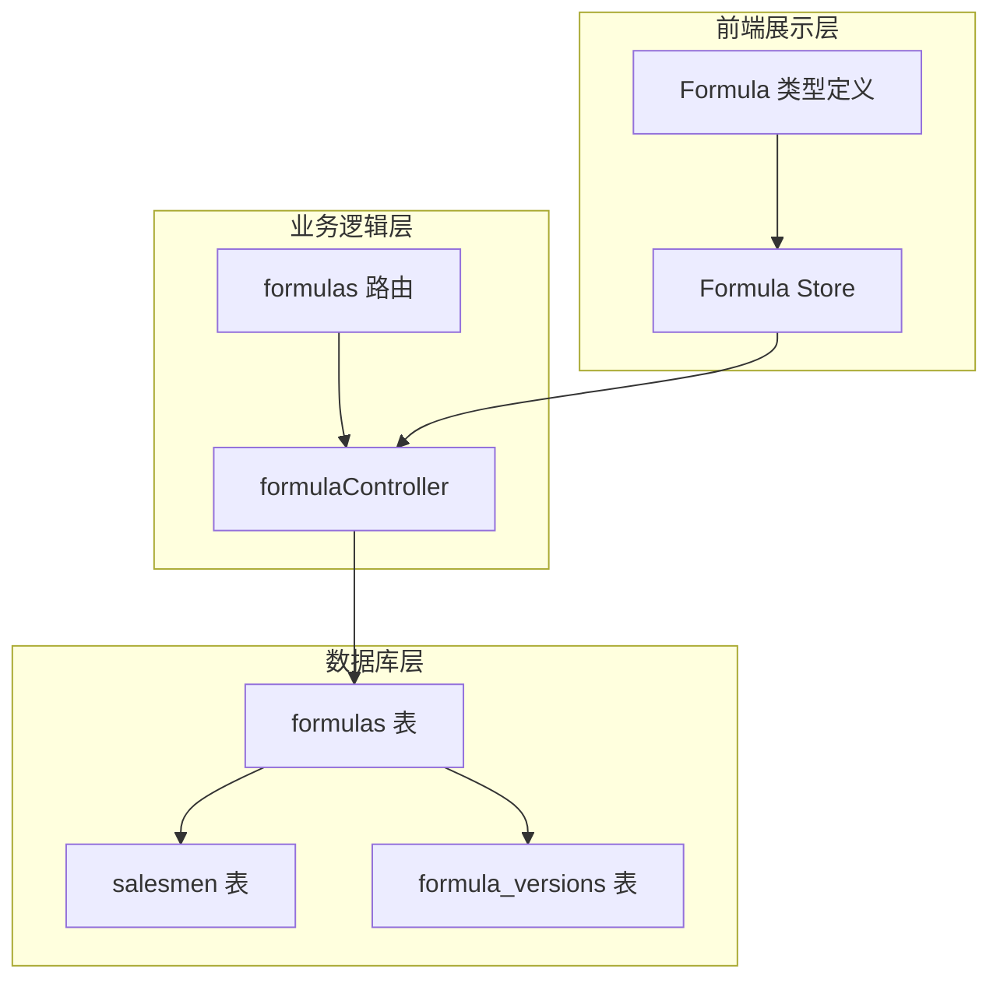
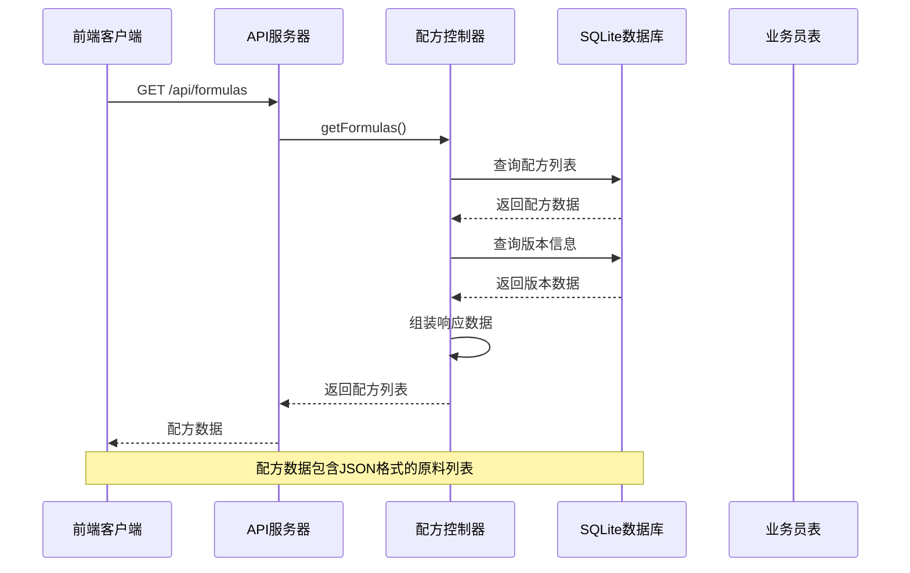
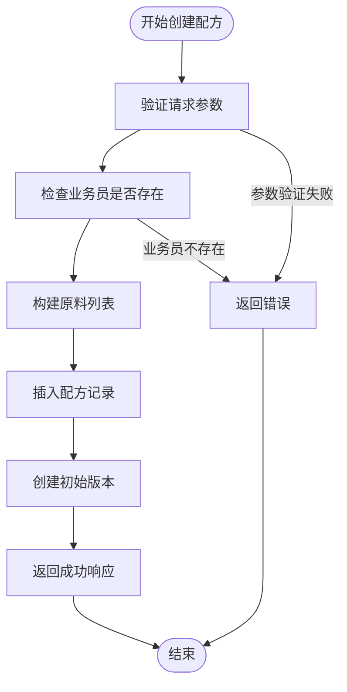
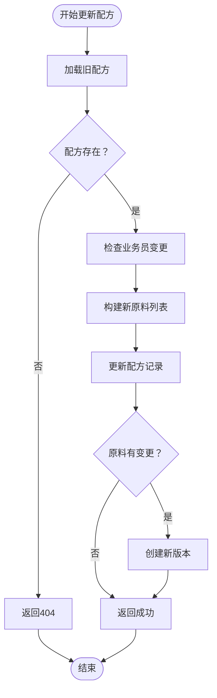
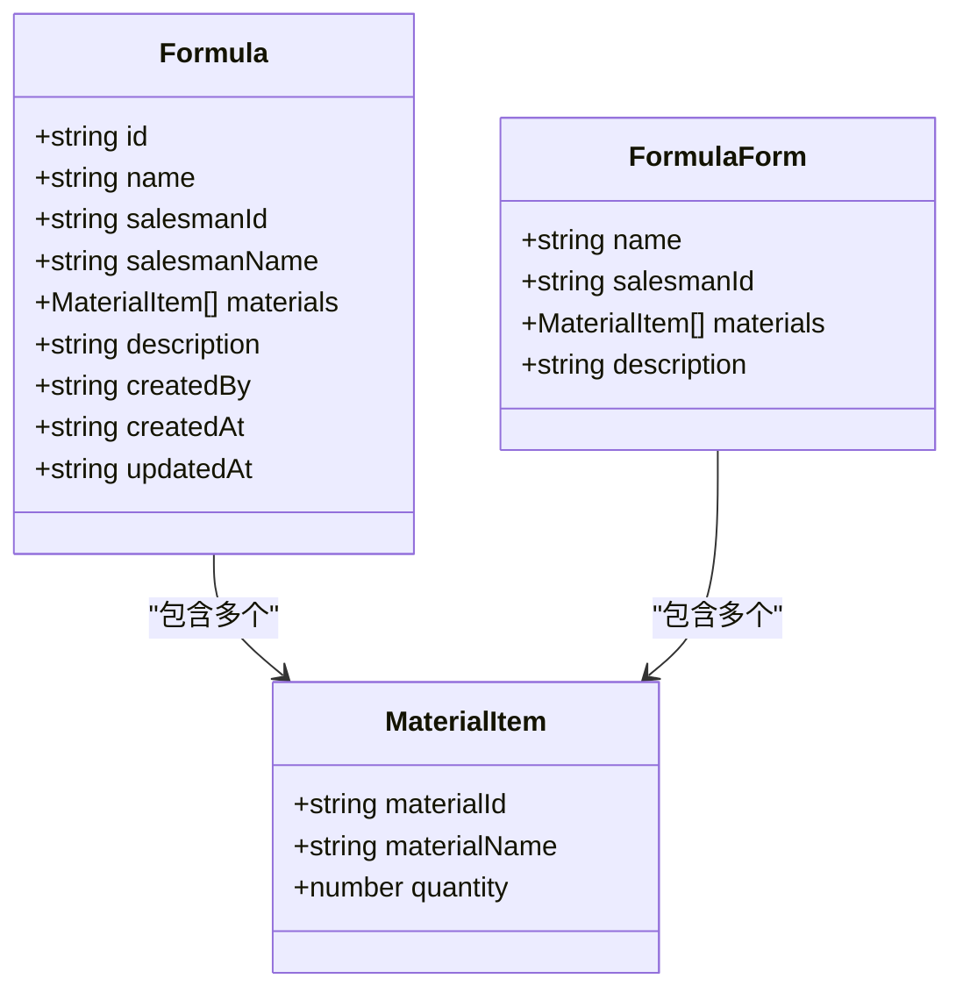
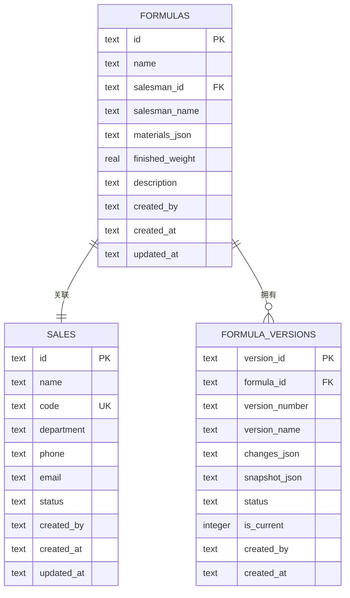
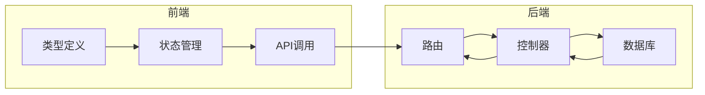

# 配方表 (formulas)

<cite>
**本文档引用的文件**
- [DATABASE_DOC.md](file://backend/DATABASE_DOC.md)
- [init.sql](file://backend/src/scripts/init.sql)
- [formulaController.ts](file://backend/src/controllers/formulaController.ts)
- [formulas.ts](file://backend/src/routes/formulas.ts)
- [formula.ts](file://frontend/src/types/formula.ts)
- [store/formula.ts](file://frontend/src/stores/formula.ts)
- [seedData.ts](file://backend/src/scripts/seedData.ts)
</cite>

## 目录
1. [简介](#简介)
2. [项目结构](#项目结构)
3. [核心组件](#核心组件)
4. [架构概览](#架构概览)
5. [详细组件分析](#详细组件分析)
6. [依赖关系分析](#依赖关系分析)
7. [性能考虑](#性能考虑)
8. [故障排除指南](#故障排除指南)
9. [结论](#结论)

## 简介

配方表 (formulas) 是 TingStudio 系统中的核心业务表，用于存储配方的基本信息和原料组成。该表采用 JSON 格式存储原料列表，实现了灵活的数据结构设计，支持复杂的配方管理和版本控制功能。

配方表的设计充分考虑了中医膏方行业的特殊需求，通过 `materials_json` 字段存储原料的动态列表，配合业务员关联实现完整的配方管理体系。

## 项目结构

配方表在系统中的位置和作用：



**图表来源**
- [DATABASE_DOC.md:67-99](file://backend/DATABASE_DOC.md#L67-L99)
- [init.sql:33-49](file://backend/src/scripts/init.sql#L33-L49)

**章节来源**
- [DATABASE_DOC.md:67-99](file://backend/DATABASE_DOC.md#L67-L99)
- [init.sql:33-49](file://backend/src/scripts/init.sql#L33-L49)

## 核心组件

### 数据库表结构

配方表采用 SQLite 存储，具有以下核心字段：

| 字段名 | 数据类型 | 约束条件 | 说明 |
|--------|----------|----------|------|
| `id` | TEXT | PRIMARY KEY | 配方唯一标识符 |
| `name` | TEXT | NOT NULL | 配方名称 |
| `salesman_id` | TEXT | NOT NULL, FK → salesmen.id | 所属业务员ID |
| `salesman_name` | TEXT | NOT NULL | 业务员名称（冗余字段） |
| `materials_json` | TEXT | NOT NULL | 原料列表的JSON格式存储 |
| `finished_weight` | REAL | NOT NULL, DEFAULT 0 | 成品重量（克） |
| `description` | TEXT | NULL | 配方描述信息 |
| `created_by` | TEXT | NOT NULL | 创建人ID |
| `created_at` | TEXT | NOT NULL | 创建时间（ISO 8601） |
| `updated_at` | TEXT | NOT NULL | 更新时间（ISO 8601） |

### 外键关系

配方表与业务员表建立了一对多的关系：
- `salesman_id` → `salesmen(id)` ON DELETE RESTRICT
- 当业务员被删除时，会阻止删除操作以保护数据完整性

### 索引设计

为了优化查询性能，建立了以下索引：
- `idx_formula_name`：按配方名称查询优化
- `idx_formula_salesman_id`：按业务员ID查询优化  
- `idx_formula_created_by`：按创建人查询优化

**章节来源**
- [DATABASE_DOC.md:67-99](file://backend/DATABASE_DOC.md#L67-L99)
- [init.sql:33-49](file://backend/src/scripts/init.sql#L33-L49)

## 架构概览

配方表在整个系统架构中的位置和交互关系：



**图表来源**
- [formulaController.ts:6-69](file://backend/src/controllers/formulaController.ts#L6-L69)
- [formulas.ts:14-16](file://backend/src/routes/formulas.ts#L14-L16)

## 详细组件分析

### 配方控制器实现

配方控制器提供了完整的 CRUD 操作：

#### 创建配方流程



**图表来源**
- [formulaController.ts:88-130](file://backend/src/controllers/formulaController.ts#L88-L130)

#### 更新配方流程



**图表来源**
- [formulaController.ts:132-218](file://backend/src/controllers/formulaController.ts#L132-L218)

### 前端类型定义

前端使用 TypeScript 定义了配方相关的数据结构：



**图表来源**
- [formula.ts:1-33](file://frontend/src/types/formula.ts#L1-L33)

**章节来源**
- [formulaController.ts:88-218](file://backend/src/controllers/formulaController.ts#L88-L218)
- [formula.ts:1-33](file://frontend/src/types/formula.ts#L1-L33)

### JSON 结构设计

#### materials_json 字段结构

`materials_json` 字段存储的是原料列表的 JSON 数组，每个元素包含：

```json
[
  {
    "materialId": "xxx",
    "materialName": "白砂糖", 
    "quantity": 200
  },
  {
    "materialId": "yyy", 
    "materialName": "全脂奶粉",
    "quantity": 300
  }
]
```

#### description 字段结构

description 字段可以存储多种格式的信息：
- 纯文本描述
- JSON 字符串，包含产品类型、用量、功效等信息
- 系统会自动解析并提取可读摘要

**章节来源**
- [DATABASE_DOC.md:91-97](file://backend/DATABASE_DOC.md#L91-L97)
- [formulaController.ts:103-105](file://backend/src/controllers/formulaController.ts#L103-L105)

### 数据完整性约束

配方表实现了严格的数据完整性约束：

1. **业务员关联约束**：通过外键确保业务员的存在性
2. **角色权限控制**：只有 admin 角色可以查看所有配方
3. **数据验证**：前端和后端双重验证确保数据质量
4. **版本控制**：自动创建和管理配方版本历史

**章节来源**
- [formulaController.ts:15-19](file://backend/src/controllers/formulaController.ts#L15-L19)
- [formulas.ts:17-23](file://backend/src/routes/formulas.ts#L17-L23)

## 依赖关系分析

### 数据库依赖关系



**图表来源**
- [DATABASE_DOC.md:67-99](file://backend/DATABASE_DOC.md#L67-L99)
- [init.sql:33-49](file://backend/src/scripts/init.sql#L33-L49)

### 前后端交互依赖



**图表来源**
- [formula.ts:136-166](file://frontend/src/stores/formula.ts#L136-L166)
- [formulaController.ts:6-69](file://backend/src/controllers/formulaController.ts#L6-L69)

**章节来源**
- [DATABASE_DOC.md:393-427](file://backend/DATABASE_DOC.md#L393-L427)
- [init.sql:33-49](file://backend/src/scripts/init.sql#L33-L49)

## 性能考虑

### 查询优化

1. **索引策略**：针对常用查询字段建立索引
2. **分页查询**：支持大数据量的分页显示
3. **批量查询**：一次性获取配方及其版本信息

### 存储优化

1. **JSON 存储**：灵活的数据结构，减少表结构变更成本
2. **冗余字段**：保存业务员名称提高查询效率
3. **版本控制**：通过快照机制避免频繁的数据更新

## 故障排除指南

### 常见问题及解决方案

1. **业务员不存在**：检查 `salesmen` 表中是否存在对应的业务员ID
2. **JSON 格式错误**：确保 `materials_json` 和 `description` 字段的 JSON 格式正确
3. **权限不足**：确认当前用户角色为 admin 或为配方创建人
4. **外键约束冲突**：删除业务员前需要先处理相关的配方数据

### 调试建议

1. 使用数据库客户端工具直接查询表数据
2. 检查 `created_by` 字段确认数据归属
3. 验证 `materials_json` 字段的解析是否正常
4. 查看版本表 `formula_versions` 确认版本历史

**章节来源**
- [formulaController.ts:96-100](file://backend/src/controllers/formulaController.ts#L96-L100)
- [formulaController.ts:140-144](file://backend/src/controllers/formulaController.ts#L140-L144)

## 结论

配方表 (formulas) 作为 TingStudio 系统的核心数据表，通过精心设计的数据库结构和完善的业务逻辑，实现了灵活而强大的配方管理功能。其主要特点包括：

1. **灵活的数据结构**：通过 JSON 字段存储原料列表，适应复杂的配方组合
2. **完善的数据完整性**：严格的外键约束和业务规则确保数据一致性
3. **高效的查询性能**：合理的索引设计和查询优化保证系统响应速度
4. **完整的版本控制**：自动化的版本管理机制支持配方的历史追踪
5. **清晰的前后端分离**：明确的接口定义和类型约束便于维护和扩展

该设计充分体现了现代 Web 应用的最佳实践，在保证功能完整性的同时，也为未来的功能扩展奠定了良好的基础。