# 辅助材料含量比系数字段

<cite>
**本文档引用的文件**
- [materialController.ts](file://backend/src/controllers/materialController.ts)
- [formulaController.ts](file://backend/src/controllers/formulaController.ts)
- [nutritionController.ts](file://backend/src/controllers/nutritionController.ts)
- [materials.ts](file://backend/src/routes/materials.ts)
- [init.sql](file://backend/src/scripts/init.sql)
- [migrate-ratio-factor.ts](file://backend/src/scripts/migrate-ratio-factor.ts)
- [migrate-supplement-ratio-factor.cjs](file://backend/src/scripts/migrate-supplement-ratio-factor.cjs)
- [material.ts](file://frontend/src/types/material.ts)
- [material.ts](file://frontend/src/api/material.ts)
- [material.ts](file://frontend/src/stores/material.ts)
- [DATABASE_DOC.md](file://backend/DATABASE_DOC.md)
</cite>

## 目录
1. [简介](#简介)
2. [项目结构](#项目结构)
3. [核心组件](#核心组件)
4. [架构概览](#架构概览)
5. [详细组件分析](#详细组件分析)
6. [依赖关系分析](#依赖关系分析)
7. [性能考虑](#性能考虑)
8. [故障排除指南](#故障排除指南)
9. [结论](#结论)

## 简介

本文档深入分析了TingStudio项目中的"辅助材料含量比系数字段"系统。该系统通过两个关键的比率因子字段（`ratio_factor`和`supplement_ratio_factor`）实现了对中药材和营养补充剂的不同含量比计算方法，确保配方营养分析的准确性和科学性。

该系统的核心价值在于：
- **差异化计算**：中药材使用0.18的默认系数，营养补充剂使用1.0的默认系数
- **版本化管理**：每个配方及其版本都维护独立的比率因子
- **自动化迁移**：支持从旧版本数据库结构平滑升级
- **实时验证**：在配方创建和更新时自动验证和应用正确的比率因子

## 项目结构

TingStudio采用前后端分离的架构设计，核心业务逻辑集中在后端，前端通过API进行交互。

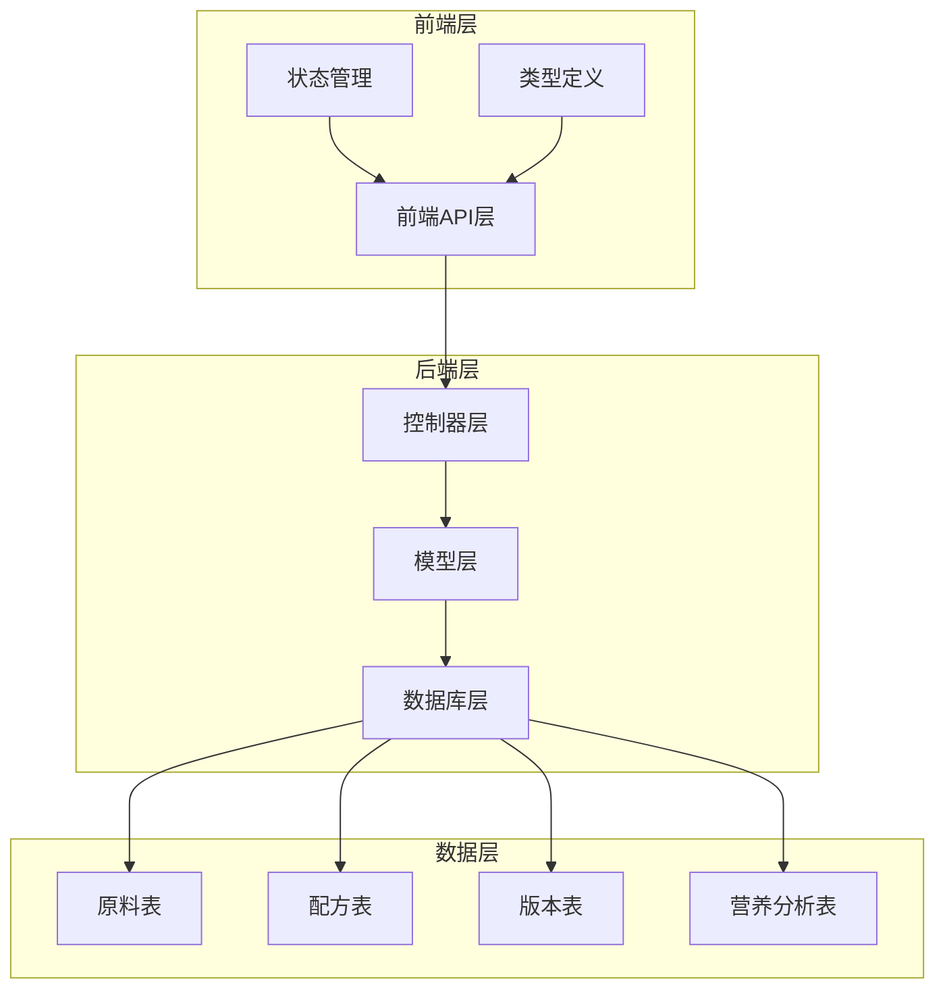

**图表来源**
- [materialController.ts:1-129](file://backend/src/controllers/materialController.ts#L1-L129)
- [formulaController.ts:1-200](file://backend/src/controllers/formulaController.ts#L1-L200)
- [init.sql:17-95](file://backend/src/scripts/init.sql#L17-L95)

**章节来源**
- [materialController.ts:1-129](file://backend/src/controllers/materialController.ts#L1-L129)
- [formulaController.ts:1-200](file://backend/src/controllers/formulaController.ts#L1-L200)
- [init.sql:17-95](file://backend/src/scripts/init.sql#L17-L95)

## 核心组件

### 比率因子系统概述

比率因子系统是配方营养分析的核心计算引擎，通过以下两个关键字段实现精确的含量比计算：

| 字段名称 | 默认值 | 范围 | 用途 | 计算场景 |
|---------|--------|------|------|----------|
| `ratio_factor` | 0.18 | 0.15-0.25 | 中药材含量比系数 | 纯中药材配方 |
| `supplement_ratio_factor` | 1.0 | 0.5-1.5 | 营养补充剂含量比系数 | 含辅料配方 |

### 数据库结构设计

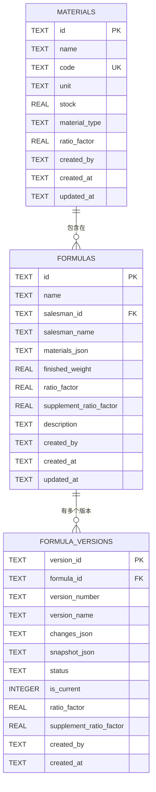

**图表来源**
- [init.sql:17-95](file://backend/src/scripts/init.sql#L17-L95)

**章节来源**
- [init.sql:17-95](file://backend/src/scripts/init.sql#L17-L95)
- [DATABASE_DOC.md:44-100](file://backend/DATABASE_DOC.md#L44-L100)

## 架构概览

### 比率因子计算流程

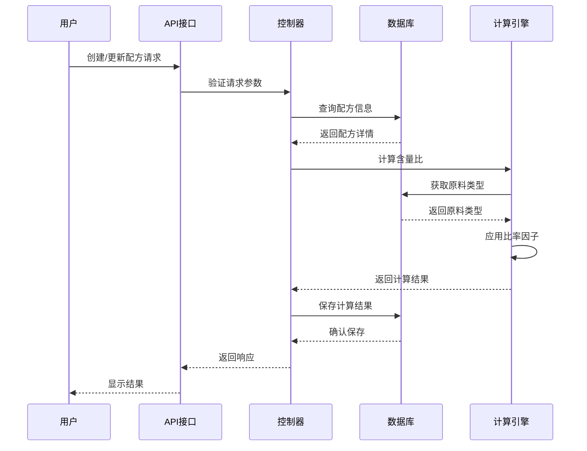

**图表来源**
- [formulaController.ts:95-139](file://backend/src/controllers/formulaController.ts#L95-L139)
- [nutritionController.ts:438-526](file://backend/src/controllers/nutritionController.ts#L438-L526)

### 数据迁移架构

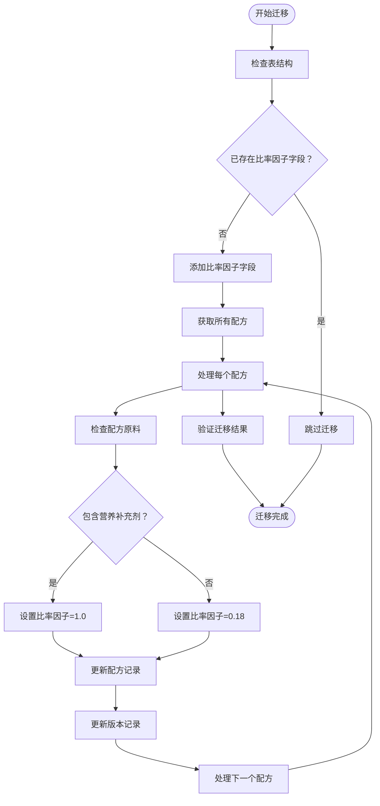

**图表来源**
- [migrate-ratio-factor.ts:27-149](file://backend/src/scripts/migrate-ratio-factor.ts#L27-L149)

**章节来源**
- [migrate-ratio-factor.ts:1-149](file://backend/src/scripts/migrate-ratio-factor.ts#L1-L149)
- [migrate-supplement-ratio-factor.cjs:1-75](file://backend/src/scripts/migrate-supplement-ratio-factor.cjs#L1-L75)

## 详细组件分析

### 原料管理系统

原料管理系统负责维护中药材和营养补充剂的基础信息，包括比率因子的存储和管理。

#### 原料类型定义

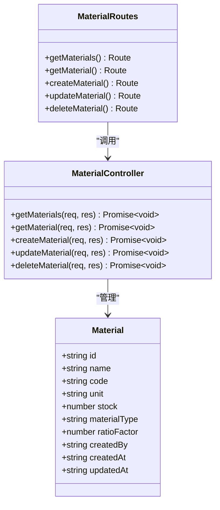

**图表来源**
- [materialController.ts:1-129](file://backend/src/controllers/materialController.ts#L1-L129)
- [materials.ts:1-22](file://backend/src/routes/materials.ts#L1-L22)

#### 原料创建流程

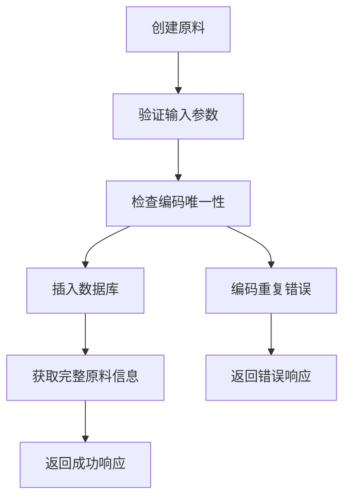

**图表来源**
- [materialController.ts:57-79](file://backend/src/controllers/materialController.ts#L57-L79)

**章节来源**
- [materialController.ts:1-129](file://backend/src/controllers/materialController.ts#L1-L129)
- [materials.ts:1-22](file://backend/src/routes/materials.ts#L1-L22)

### 配方管理系统

配方管理系统是比率因子系统的核心，负责配方的创建、更新和版本管理。

#### 配方创建与比率因子应用

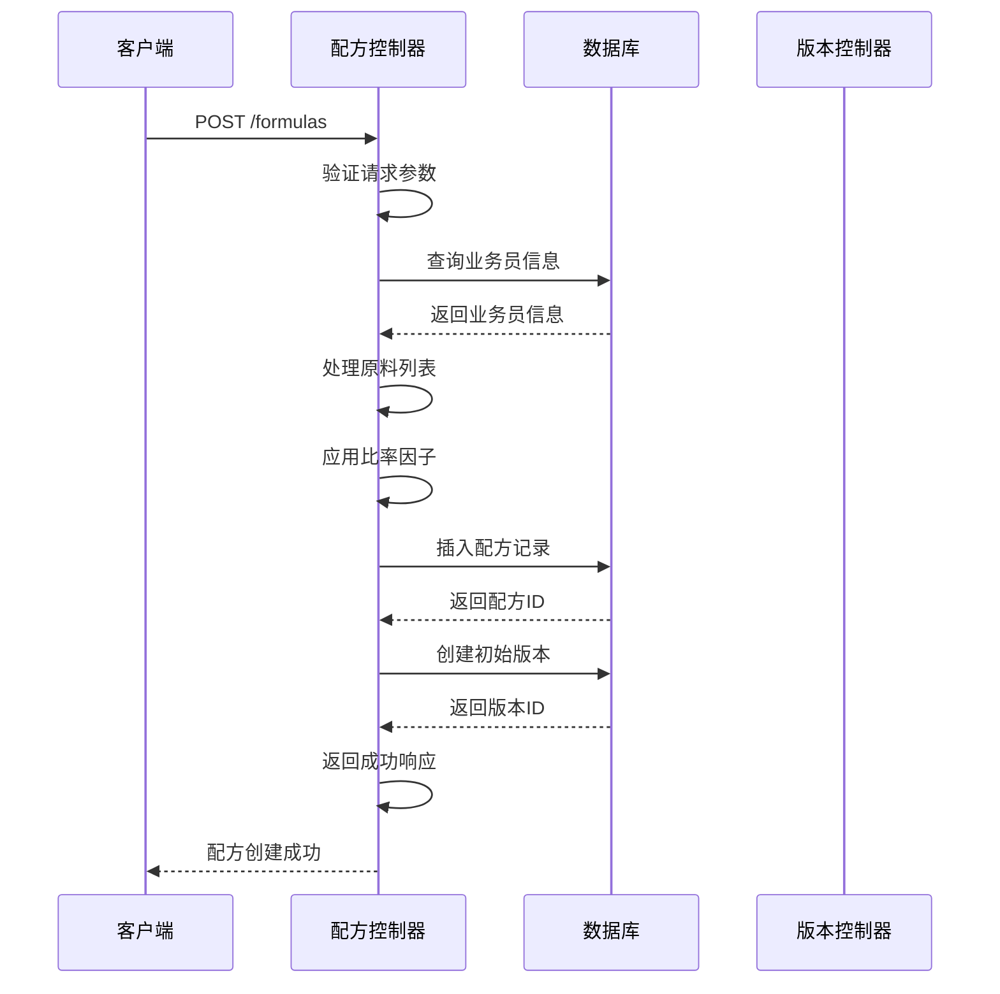

**图表来源**
- [formulaController.ts:95-139](file://backend/src/controllers/formulaController.ts#L95-L139)

#### 配方更新与版本控制

配方更新时，系统会自动创建新版本并应用相应的比率因子：

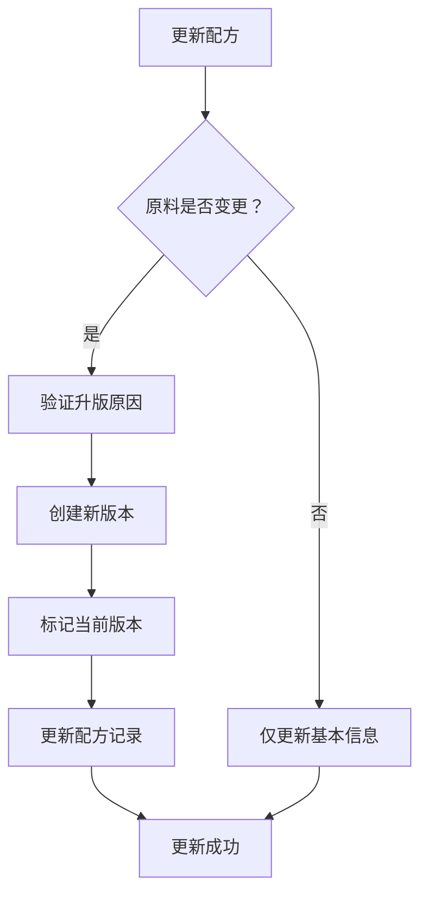

**图表来源**
- [formulaController.ts:141-200](file://backend/src/controllers/formulaController.ts#L141-L200)

**章节来源**
- [formulaController.ts:1-373](file://backend/src/controllers/formulaController.ts#L1-L373)

### 营养分析计算引擎

营养分析系统是比率因子应用的核心实现，负责将比率因子应用于具体的营养成分计算。

#### 含量比计算算法

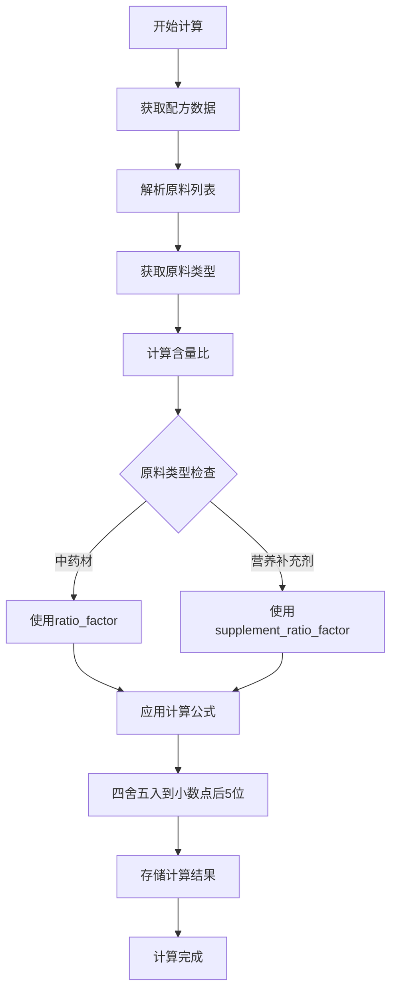

**图表来源**
- [nutritionController.ts:438-526](file://backend/src/controllers/nutritionController.ts#L438-L526)

#### 计算公式实现

营养分析系统使用以下公式计算每种原料的含量比：

```
含量比 = (原料用量 × 有效比率因子) ÷ 成品总重量
```

其中有效比率因子根据原料类型动态选择：
- 中药材：使用配方的 `ratio_factor`（默认0.18）
- 营养补充剂：使用配方的 `supplement_ratio_factor`（默认1.0）

**章节来源**
- [nutritionController.ts:438-526](file://backend/src/controllers/nutritionController.ts#L438-L526)

### 数据迁移系统

为了支持系统的演进，提供了完整的数据迁移机制，确保从旧版本平滑升级到新的比率因子架构。

#### 迁移策略

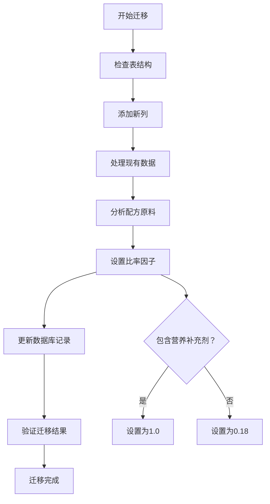

**图表来源**
- [migrate-ratio-factor.ts:27-149](file://backend/src/scripts/migrate-ratio-factor.ts#L27-L149)

**章节来源**
- [migrate-ratio-factor.ts:1-149](file://backend/src/scripts/migrate-ratio-factor.ts#L1-L149)
- [migrate-supplement-ratio-factor.cjs:1-75](file://backend/src/scripts/migrate-supplement-ratio-factor.cjs#L1-L75)

## 依赖关系分析

### 前后端依赖关系

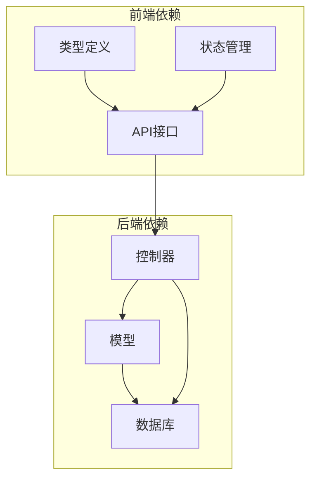

**图表来源**
- [material.ts:1-30](file://frontend/src/types/material.ts#L1-L30)
- [material.ts:1-43](file://frontend/src/api/material.ts#L1-L43)
- [material.ts:1-130](file://frontend/src/stores/material.ts#L1-L130)

### 数据库依赖关系

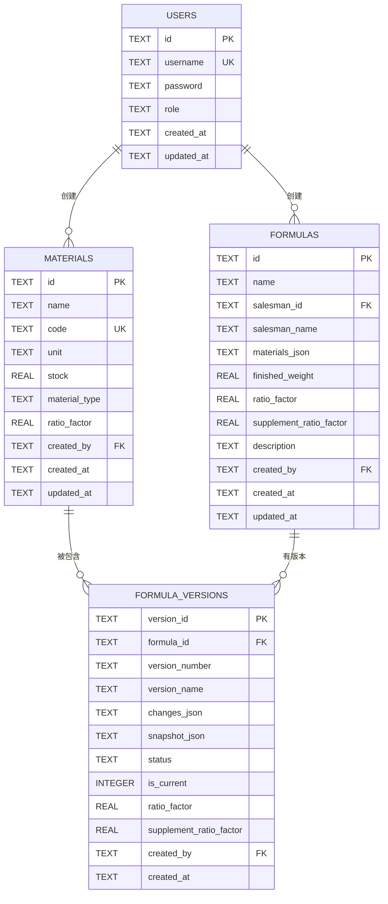

**图表来源**
- [init.sql:7-95](file://backend/src/scripts/init.sql#L7-L95)

**章节来源**
- [material.ts:1-30](file://frontend/src/types/material.ts#L1-L30)
- [material.ts:1-43](file://frontend/src/api/material.ts#L1-L43)
- [material.ts:1-130](file://frontend/src/stores/material.ts#L1-L130)
- [init.sql:7-95](file://backend/src/scripts/init.sql#L7-L95)

## 性能考虑

### 数据库优化策略

1. **索引优化**：为常用查询字段建立索引，提高查询性能
2. **批量操作**：在营养分析时使用批量查询减少数据库往返
3. **缓存策略**：对频繁访问的原料信息进行缓存
4. **事务管理**：在数据迁移时使用事务确保数据一致性

### 计算性能优化

1. **内存管理**：合理管理大量配方数据的内存使用
2. **并发处理**：支持多配方同时计算的并发处理
3. **精度控制**：通过四舍五入避免浮点数精度问题
4. **增量更新**：只对变更的配方进行重新计算

## 故障排除指南

### 常见问题及解决方案

#### 数据迁移失败

**问题症状**：迁移脚本执行中断或报错

**可能原因**：
- 数据库连接失败
- 表结构已存在目标字段
- 权限不足

**解决步骤**：
1. 检查数据库连接状态
2. 确认目标字段不存在
3. 验证数据库权限
4. 查看详细的错误日志

#### 比率因子计算异常

**问题症状**：含量比计算结果不正确

**可能原因**：
- 原料类型识别错误
- 成品重量为零
- 比率因子值超出范围

**解决步骤**：
1. 验证原料类型设置
2. 检查成品重量输入
3. 确认比率因子范围
4. 重新计算验证

#### API接口错误

**问题症状**：前端无法获取或更新配方数据

**可能原因**：
- 认证失败
- 参数验证错误
- 数据库连接问题

**解决步骤**：
1. 检查用户认证状态
2. 验证请求参数格式
3. 查看服务器日志
4. 测试数据库连接

**章节来源**
- [migrate-ratio-factor.ts:135-145](file://backend/src/scripts/migrate-ratio-factor.ts#L135-L145)
- [nutritionController.ts:512-518](file://backend/src/controllers/nutritionController.ts#L512-L518)

## 结论

TingStudio项目的辅助材料含量比系数字段系统展现了现代配方管理软件的核心设计理念：

### 系统优势

1. **科学准确性**：通过差异化比率因子确保计算结果符合营养学原理
2. **灵活性**：支持中药材和营养补充剂的混合配方计算
3. **可扩展性**：模块化的架构设计便于功能扩展和维护
4. **数据完整性**：完善的版本控制系统保证数据的可追溯性

### 技术亮点

1. **智能迁移**：自动化的数据迁移机制确保系统演进的平滑性
2. **实时验证**：在数据变更时自动验证和应用正确的计算规则
3. **性能优化**：通过索引、缓存和批量操作提升系统性能
4. **错误处理**：完善的错误处理和恢复机制保证系统稳定性

### 未来发展方向

1. **AI辅助计算**：集成机器学习算法优化比率因子的智能推荐
2. **移动端支持**：开发移动应用支持现场配方调整
3. **云端同步**：实现多设备间的数据同步和协作
4. **法规适配**：持续更新以适应最新的营养标准和法规要求

该系统为中医药配方管理和营养分析提供了坚实的技术基础，通过科学的比率因子计算确保了配方质量和安全性，为用户提供了可靠的决策支持工具。