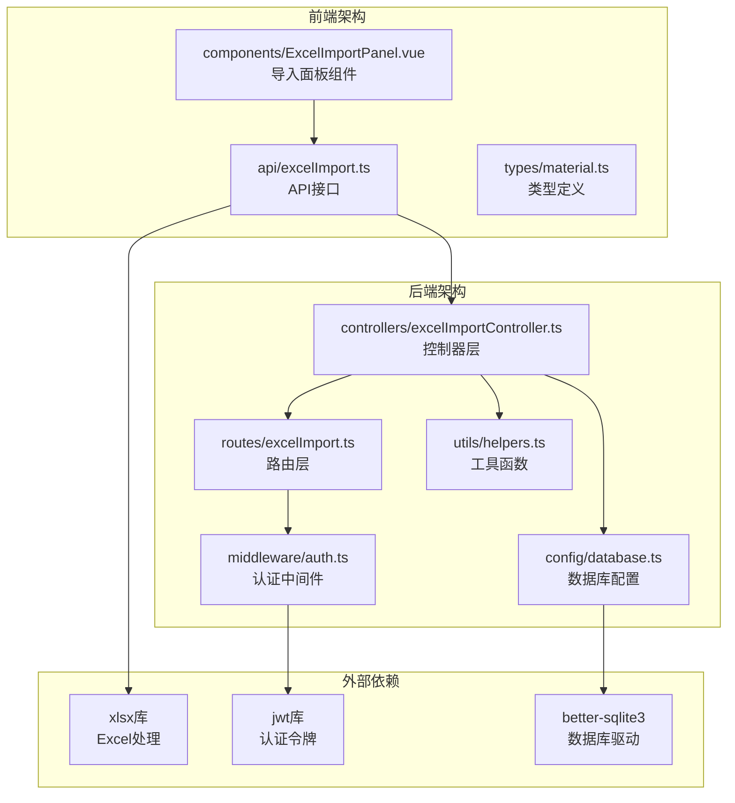
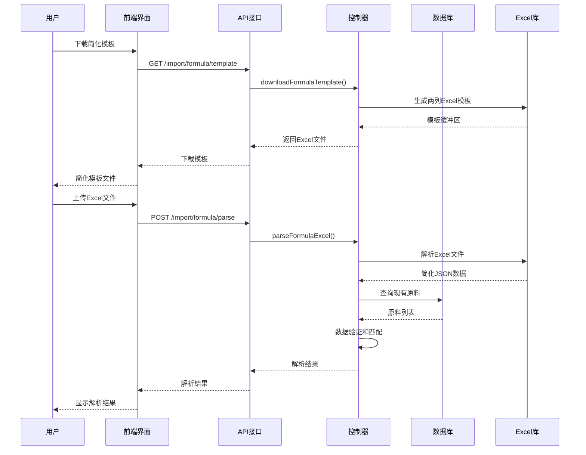
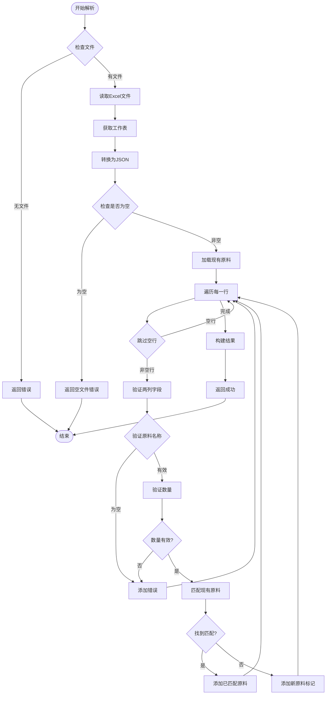
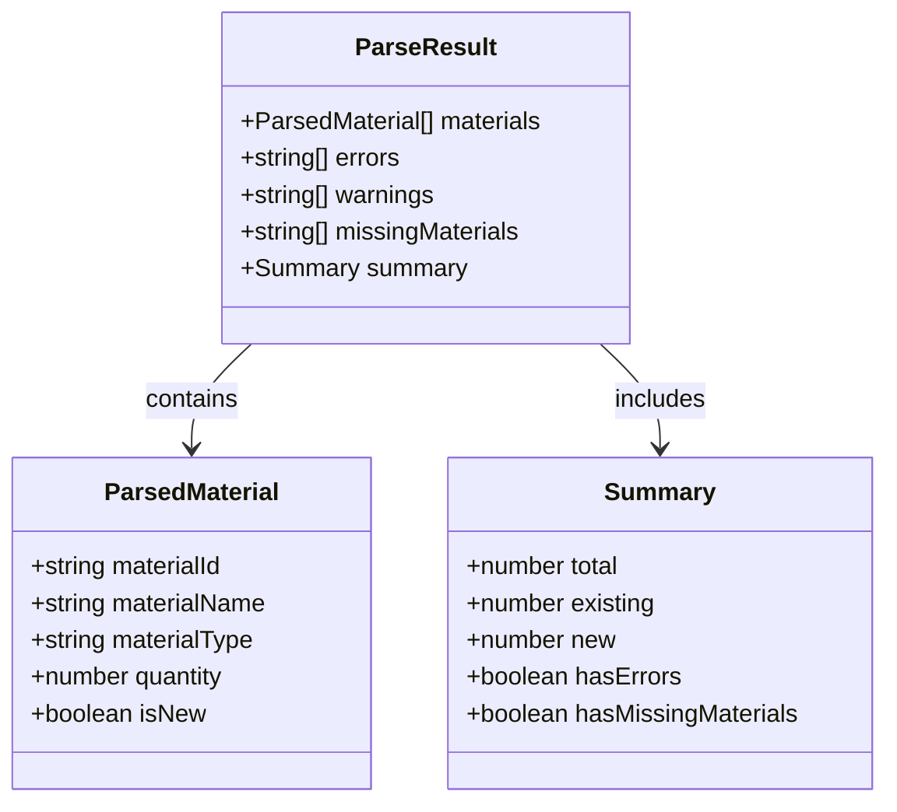

# Excel导入模块

<cite>
**本文档引用的文件**
- [excelImportController.ts](file://backend/src/controllers/excelImportController.ts)
- [excelImport.ts](file://backend/src/routes/excelImport.ts)
- [ExcelImportPanel.vue](file://frontend/src/components/ExcelImportPanel.vue)
- [excelImport.ts](file://frontend/src/api/excelImport.ts)
- [helpers.ts](file://backend/src/utils/helpers.ts)
- [database.ts](file://backend/src/config/database.ts)
- [auth.ts](file://backend/src/middleware/auth.ts)
- [index.ts](file://backend/src/routers/index.ts)
- [index.ts](file://backend/src/config/index.ts)
- [material.ts](file://frontend/src/types/material.ts)
</cite>

## 更新摘要
**变更内容**
- Excel导入模板简化为两列（原料名称、数量），移除复杂字段
- 保持向后兼容性检查，支持中英文列标题
- 更新解析逻辑以适应简化的模板结构
- 优化使用说明，突出简化后的模板特点

## 目录
1. [简介](#简介)
2. [项目结构](#项目结构)
3. [核心组件](#核心组件)
4. [架构概览](#架构概览)
5. [详细组件分析](#详细组件分析)
6. [依赖关系分析](#依赖关系分析)
7. [性能考虑](#性能考虑)
8. [故障排除指南](#故障排除指南)
9. [结论](#结论)

## 简介

Excel导入模块是TingStudio配方管理系统中的重要功能组件，允许用户通过Excel模板批量导入配方原料数据。该模块提供了完整的端到端解决方案，包括Excel模板生成、文件上传解析、数据验证和错误处理等功能。

**更新** 模板现已简化为两列（原料名称、数量），移除了复杂的字段，提高了用户使用效率，同时保持了向后兼容性检查。

该模块采用前后端分离架构，后端使用Node.js + Express提供RESTful API服务，前端使用Vue.js构建用户界面，实现了直观易用的Excel导入体验。

## 项目结构

Excel导入模块在项目中的组织结构如下：



**图表来源**
- [excelImportController.ts:1-167](file://backend/src/controllers/excelImportController.ts#L1-L167)
- [excelImport.ts:1-42](file://backend/src/routes/excelImport.ts#L1-L42)
- [ExcelImportPanel.vue:1-347](file://frontend/src/components/ExcelImportPanel.vue#L1-L347)

**章节来源**
- [excelImportController.ts:1-167](file://backend/src/controllers/excelImportController.ts#L1-L167)
- [excelImport.ts:1-42](file://backend/src/routes/excelImport.ts#L1-L42)
- [ExcelImportPanel.vue:1-347](file://frontend/src/components/ExcelImportPanel.vue#L1-L347)

## 核心组件

### 后端核心组件

#### Excel导入控制器
负责处理Excel文件的下载和解析逻辑，提供完整的业务功能实现。

**更新** 控制器现在支持简化的两列模板结构，包括：
- **模板列定义**：定义了原料名称和数量两列
- **示例数据**：提供预填充的示例数据
- **多工作表结构**：包含模板数据和使用说明两个工作表
- **列宽设置**：优化列宽以提高可读性
- **向后兼容性**：支持中英文列标题（原料名称/materialName）

#### Excel导入路由
定义了RESTful API端点，包括模板下载和文件解析两个主要接口。

#### 认证中间件
确保只有经过身份验证的用户才能访问Excel导入功能。

### 前端核心组件

#### Excel导入面板
提供用户友好的界面，包含模板下载、文件上传、解析结果显示等功能。

**更新** 面板现在显示简化的模板特点：
- **操作指导**：提供清晰的使用说明，突出两列模板
- **模板下载**：一键下载Excel模板
- **文件上传**：支持拖拽和选择上传
- **解析结果显示**：展示解析结果和错误信息
- **确认导入**：提供导入确认机制

#### Excel导入API
封装HTTP请求，处理文件上传和响应数据格式化。

**更新** API接口现在处理简化的数据结构：
- **模板下载**：GET请求获取Excel文件
- **文件解析**：POST请求上传并解析Excel文件
- **数据格式化**：统一的响应数据结构，包含简化的字段

**章节来源**
- [excelImportController.ts:28-167](file://backend/src/controllers/excelImportController.ts#L28-L167)
- [excelImport.ts:9-42](file://backend/src/routes/excelImport.ts#L9-L42)
- [ExcelImportPanel.vue:140-259](file://frontend/src/components/ExcelImportPanel.vue#L140-L259)

## 架构概览

Excel导入模块采用经典的三层架构设计，实现了清晰的职责分离：



**图表来源**
- [excelImportController.ts:29-71](file://backend/src/controllers/excelImportController.ts#L29-L71)
- [excelImportController.ts:74-167](file://backend/src/controllers/excelImportController.ts#L74-L167)
- [excelImport.ts:35-39](file://backend/src/routes/excelImport.ts#L35-L39)

## 详细组件分析

### 后端控制器分析

#### 模板下载功能
控制器实现了完整的Excel模板生成功能，包括：

**更新** 模板现在包含两列：
- **模板列定义**：定义了原料名称和数量两列
- **示例数据**：提供预填充的示例数据
- **多工作表结构**：包含模板数据和使用说明两个工作表
- **列宽设置**：优化列宽以提高可读性

**使用说明更新**：
- 1. 模板仅包含两列：原料名称、数量(g)
- 2. 原料名称必须与系统中已录入的原料名称完全一致
- 3. 数量为该原料在配方中的用量，单位为克(g)
- 4. 请删除示例数据后再填入实际数据
- 5. 导入时系统将根据原料名称自动匹配现有原料
- 6. 若原料名称在系统中不存在，将标记为"未录入"需先去原料管理中录入

#### Excel解析功能
实现了简化的数据解析和验证逻辑：



**图表来源**
- [excelImportController.ts:74-167](file://backend/src/controllers/excelImportController.ts#L74-L167)

**章节来源**
- [excelImportController.ts:28-71](file://backend/src/controllers/excelImportController.ts#L28-L71)
- [excelImportController.ts:73-167](file://backend/src/controllers/excelImportController.ts#L73-L167)

### 前端组件分析

#### Excel导入面板组件
实现了完整的用户交互界面：

**更新** 面板现在突出简化的模板特点：
- **操作指导**：提供清晰的使用说明，强调两列模板的简洁性
- **模板下载**：一键下载Excel模板
- **文件上传**：支持拖拽和选择上传
- **解析结果显示**：展示解析结果和错误信息
- **确认导入**：提供导入确认机制

#### API接口设计
封装了完整的HTTP通信逻辑：

**更新** API接口现在处理简化的数据结构：
- **模板下载**：GET请求获取Excel文件
- **文件解析**：POST请求上传并解析Excel文件
- **数据格式化**：统一的响应数据结构，包含简化的字段

**章节来源**
- [ExcelImportPanel.vue:1-347](file://frontend/src/components/ExcelImportPanel.vue#L1-L347)
- [excelImport.ts:36-54](file://frontend/src/api/excelImport.ts#L36-L54)

### 数据模型分析

#### 解析结果数据结构


**图表来源**
- [excelImport.ts:22-34](file://frontend/src/api/excelImport.ts#L22-L34)

**章节来源**
- [excelImport.ts:6-34](file://frontend/src/api/excelImport.ts#L6-L34)

## 依赖关系分析

### 外部依赖
Excel导入模块依赖以下关键外部库：

```mermaid
graph LR
subgraph "核心依赖"
A[xlsx@^0.18.5<br/>Excel文件处理]
B[jsonwebtoken@^9.0.0<br/>JWT认证]
C[better-sqlite3@^8.0.0<br/>SQLite数据库]
D[multer@^1.4.0<br/>文件上传]
end
subgraph "应用内部依赖"
E[helpers.ts<br/>工具函数]
F[database.ts<br/>数据库配置]
G[auth.ts<br/>认证中间件]
H[excelImportController.ts<br/>业务逻辑]
I[excelImport.ts<br/>路由定义]
end
A --> H
B --> G
C --> F
D --> I
E --> H
F --> H
G --> I
H --> I
```

**图表来源**
- [excelImportController.ts:5-8](file://backend/src/controllers/excelImportController.ts#L5-L8)
- [excelImport.ts:7](file://backend/src/routes/excelImport.ts#L7)

### 内部依赖关系
模块内部各组件之间的依赖关系清晰明确：

- **路由层**依赖**控制器层**提供业务逻辑
- **控制器层**依赖**数据库配置**进行数据操作
- **控制器层**依赖**工具函数**提供辅助功能
- **前端组件**依赖**API接口**进行数据交互
- **认证中间件**保护所有Excel导入相关接口

**章节来源**
- [excelImport.ts:14-33](file://backend/src/routes/excelImport.ts#L14-L33)
- [auth.ts:13-31](file://backend/src/middleware/auth.ts#L13-L31)

## 性能考虑

### 文件处理性能
- **内存限制**：文件大小限制为5MB，避免内存溢出
- **流式处理**：使用multer的内存存储，适合中小型文件
- **并发处理**：单文件解析，避免并发冲突

### 数据库查询优化
- **索引利用**：原料名称和代码字段用于快速匹配
- **批量查询**：一次性获取所有原料数据，减少查询次数
- **内存映射**：使用Map数据结构进行O(1)查找

### 前端性能优化
- **懒加载**：Excel库按需加载
- **虚拟滚动**：表格组件支持大数据量显示
- **防抖处理**：上传前的文件验证避免重复请求

## 故障排除指南

### 常见问题及解决方案

#### Excel文件解析失败
**问题症状**：上传Excel文件后返回解析错误
**可能原因**：
- 文件格式不正确（非.xlsx或.xls格式）
- 文件内容为空或格式错误
- 列标题不匹配标准格式

**解决步骤**：
1. 确认使用官方模板文件
2. 检查Excel文件格式是否正确
3. 验证列标题是否符合要求（原料名称、数量(g)）
4. 确保数据格式正确（数量必须为数字）

#### 原料匹配失败
**问题症状**：部分原料显示为"未录入"
**可能原因**：
- 原料名称与系统中现有记录不完全一致
- 原料名称拼写错误
- 原料已被删除但仍存在于历史数据中

**解决步骤**：
1. 前往原料管理页面录入缺失的原料
2. 确保原料名称与系统中的完全一致
3. 检查是否有拼写错误

#### 文件上传限制
**问题症状**：上传大文件时失败
**可能原因**：文件大小超过5MB限制

**解决步骤**：
1. 将Excel文件拆分为多个较小的文件
2. 删除不必要的数据行
3. 使用压缩工具减小文件大小

**章节来源**
- [excelImportController.ts:76-89](file://backend/src/controllers/excelImportController.ts#L76-L89)
- [ExcelImportPanel.vue:194-207](file://frontend/src/components/ExcelImportPanel.vue#L194-L207)

## 结论

Excel导入模块是一个设计良好、功能完整的数据导入解决方案。它具有以下特点：

### 优势
- **用户体验优秀**：提供清晰的操作流程和反馈信息
- **数据验证完善**：多层次的数据验证确保数据质量
- **错误处理健全**：详细的错误信息帮助用户快速定位问题
- **安全性保障**：基于JWT的认证机制确保系统安全
- **模板简化**：两列模板结构大大降低了使用门槛

### 技术亮点
- **前后端分离**：采用现代化的开发架构
- **类型安全**：完整的TypeScript类型定义
- **模块化设计**：清晰的职责分离和依赖关系
- **可扩展性**：易于添加新的功能和改进
- **向后兼容**：支持中英文列标题，确保平滑过渡

### 改进建议
- **批量导入**：可以考虑添加批量导入功能以支持更大规模的数据
- **进度跟踪**：为大型文件提供上传进度显示
- **模板自定义**：允许用户自定义Excel模板格式
- **导入历史**：记录导入历史以便审计和追踪

**更新** 模板简化为两列的设计显著提升了用户体验，使配方数据导入变得更加直观和高效。通过移除复杂字段，用户可以专注于核心的原料名称和数量信息，减少了学习成本和出错概率。

该模块为TingStudio配方管理系统的数据导入提供了坚实的基础，为用户提供了高效便捷的数据管理体验。