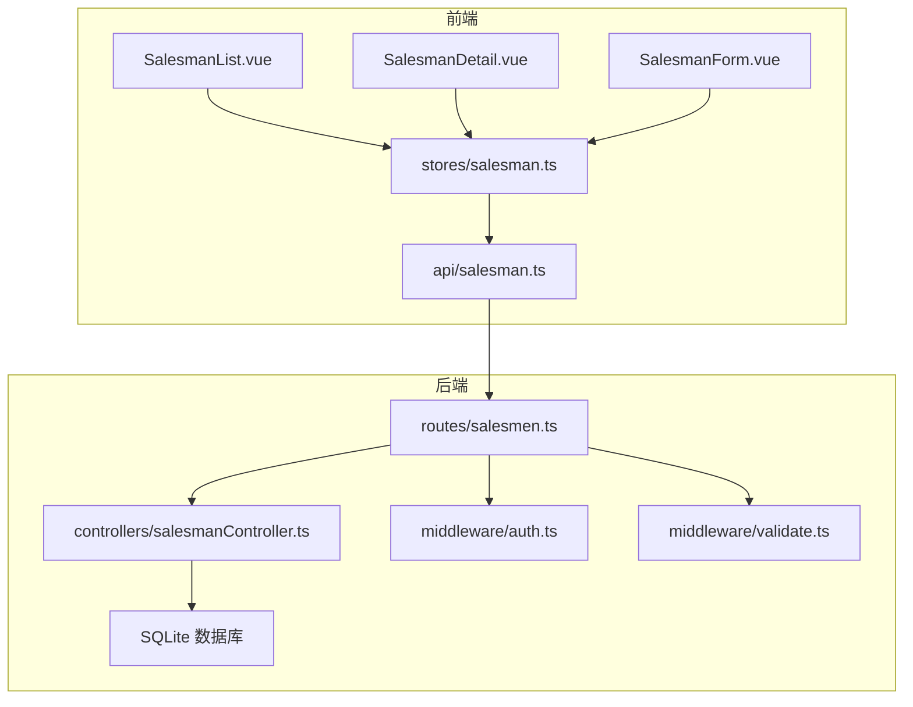
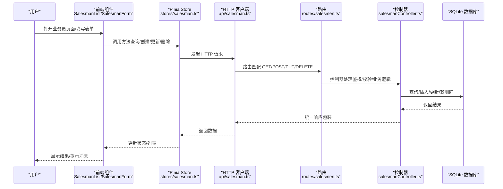
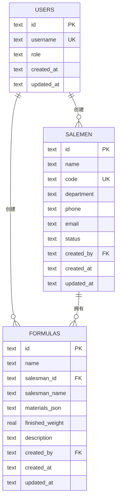
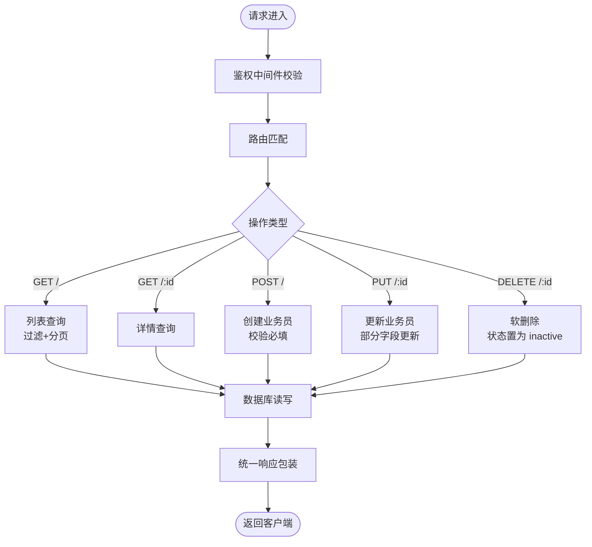
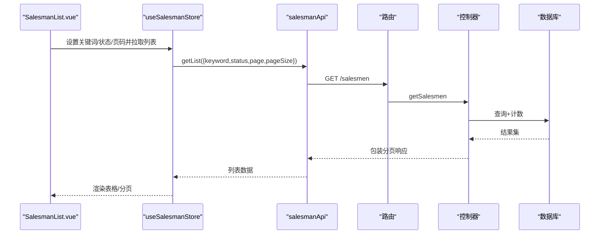
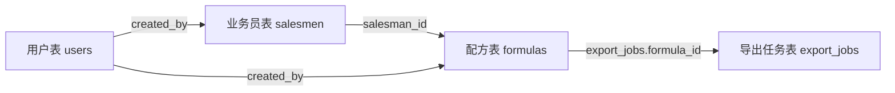
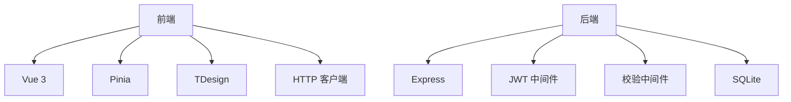

# 业务员管理系统

<cite>
**本文档引用的文件**
- [backend\src\controllers\salesmanController.ts](file://backend/src/controllers/salesmanController.ts)
- [backend\src\routes\salesmen.ts](file://backend/src/routes/salesmen.ts)
- [backend\src\middleware\auth.ts](file://backend/src/middleware/auth.ts)
- [backend\src\middleware\validate.ts](file://backend/src/middleware/validate.ts)
- [backend\src\utils\helpers.ts](file://backend/src/utils/helpers.ts)
- [backend\DATABASE_DOC.md](file://backend/DATABASE_DOC.md)
- [backend\src\scripts\init.sql](file://backend/src/scripts/init.sql)
- [frontend\src\views\salesmen\SalesmanList.vue](file://frontend/src/views/salesmen/SalesmanList.vue)
- [frontend\src\views\salesmen\SalesmanDetail.vue](file://frontend/src/views/salesmen/SalesmanDetail.vue)
- [frontend\src\views\salesmen\SalesmanForm.vue](file://frontend/src/views/salesmen/SalesmanForm.vue)
- [frontend\src\stores\salesman.ts](file://frontend/src/stores/salesman.ts)
- [frontend\src\api\salesman.ts](file://frontend/src/api/salesman.ts)
- [frontend\src\types\user.ts](file://frontend/src/types/user.ts)
</cite>

## 目录
1. [简介](#简介)
2. [项目结构](#项目结构)
3. [核心组件](#核心组件)
4. [架构总览](#架构总览)
5. [详细组件分析](#详细组件分析)
6. [依赖分析](#依赖分析)
7. [性能考虑](#性能考虑)
8. [故障排查指南](#故障排查指南)
9. [结论](#结论)
10. [附录](#附录)

## 简介
本文件为 TingStudio 业务员管理系统的全面功能文档，覆盖业务员数据模型、员工信息管理与关联关系处理；后端控制器如何实现业务员的完整生命周期管理（基本信息维护、权限分配与状态控制）；前端组件的设计实现（业务员列表展示、详情查看、表单编辑与搜索筛选）；以及业务员与配方、导出任务等模块的关联关系与数据一致性保障。同时提供配置选项、扩展功能与维护建议。

## 项目结构
系统采用前后端分离架构：
- 后端基于 Express + TypeScript，使用 SQLite 存储，提供 RESTful API。
- 前端基于 Vue 3 + Pinia + TDesign，通过 HTTP 客户端调用后端接口。
- 业务员管理模块位于 salesmen 功能域，与配方、导出、营养分析等模块存在外键与引用关系。

图表来源
- [frontend\src\views\salesmen\SalesmanList.vue](file://frontend/src/views/salesmen/SalesmanList.vue)
- [frontend\src\views\salesmen\SalesmanDetail.vue](file://frontend/src/views/salesmen/SalesmanDetail.vue)
- [frontend\src\views\salesmen\SalesmanForm.vue](file://frontend/src/views/salesmen/SalesmanForm.vue)
- [frontend\src\stores\salesman.ts](file://frontend/src/stores/salesman.ts)
- [frontend\src\api\salesman.ts](file://frontend/src/api/salesman.ts)
- [backend\src\routes\salesmen.ts](file://backend/src/routes/salesmen.ts)
- [backend\src\controllers\salesmanController.ts](file://backend/src/controllers/salesmanController.ts)
- [backend\src\middleware\auth.ts](file://backend/src/middleware/auth.ts)
- [backend\src\middleware\validate.ts](file://backend/src/middleware/validate.ts)

章节来源
- [backend\src\routes\salesmen.ts:1-24](file://backend/src/routes/salesmen.ts#L1-L24)
- [frontend\src\stores\salesman.ts:1-121](file://frontend/src/stores/salesman.ts#L1-L121)

## 核心组件
- 后端控制器：提供业务员的增删改查与分页检索能力，支持关键词、状态、部门过滤。
- 路由与中间件：统一鉴权与请求体校验，确保安全与数据正确性。
- 前端 Store：封装业务员列表、详情、创建/更新/删除的调用与状态管理。
- 前端视图组件：列表、详情、表单页面，配合分页与搜索条件。
- 数据模型：业务员表与配方表之间的外键关联，保障数据一致性。

章节来源
- [backend\src\controllers\salesmanController.ts:1-125](file://backend/src/controllers/salesmanController.ts#L1-L125)
- [backend\src\routes\salesmen.ts:1-24](file://backend/src/routes/salesmen.ts#L1-L24)
- [frontend\src\stores\salesman.ts:1-121](file://frontend/src/stores/salesman.ts#L1-L121)
- [frontend\src\views\salesmen\SalesmanList.vue:1-136](file://frontend/src/views/salesmen/SalesmanList.vue#L1-L136)
- [frontend\src\views\salesmen\SalesmanDetail.vue:1-52](file://frontend/src/views/salesmen/SalesmanDetail.vue#L1-L52)
- [frontend\src\views\salesmen\SalesmanForm.vue:1-158](file://frontend/src/views/salesmen/SalesmanForm.vue#L1-L158)

## 架构总览
业务员管理的端到端流程如下：

图表来源
- [frontend\src\views\salesmen\SalesmanList.vue:1-136](file://frontend/src/views/salesmen/SalesmanList.vue#L1-L136)
- [frontend\src\views\salesmen\SalesmanForm.vue:1-158](file://frontend/src/views/salesmen/SalesmanForm.vue#L1-L158)
- [frontend\src\stores\salesman.ts:1-121](file://frontend/src/stores/salesman.ts#L1-L121)
- [frontend\src\api\salesman.ts:1-41](file://frontend/src/api/salesman.ts#L1-L41)
- [backend\src\routes\salesmen.ts:1-24](file://backend/src/routes/salesmen.ts#L1-L24)
- [backend\src\controllers\salesmanController.ts:1-125](file://backend/src/controllers/salesmanController.ts#L1-L125)

## 详细组件分析

### 数据模型与表结构
- 业务员表（salesmen）：包含唯一工号、姓名、部门、电话、邮箱、状态、创建人与时间戳等字段。
- 配方表（formulas）：通过 salesman_id 关联业务员，且设置外键约束为 RESTRICT，防止删除仍有配方关联的业务员。
- 外键关系：salesmen.id → formulas.salesman_id

图表来源
- [backend\DATABASE_DOC.md:101-123](file://backend/DATABASE_DOC.md#L101-L123)
- [backend\DATABASE_DOC.md:67-90](file://backend/DATABASE_DOC.md#L67-L90)
- [backend\src\scripts\init.sql:55-71](file://backend/src/scripts/init.sql#L55-L71)
- [backend\src\scripts\init.sql:34-49](file://backend/src/scripts/init.sql#L34-L49)

章节来源
- [backend\DATABASE_DOC.md:101-123](file://backend/DATABASE_DOC.md#L101-L123)
- [backend\src\scripts\init.sql:55-71](file://backend/src/scripts/init.sql#L55-L71)

### 后端控制器与路由
- 列表查询：支持 keyword（姓名/工号/电话模糊）、status、department 过滤，分页排序。
- 详情查询：按 id 查询，不存在返回 404。
- 创建：校验必填字段，写入状态为 active，默认创建人来自鉴权上下文。
- 更新：支持部分字段更新，可选择性更新状态。
- 删除：软删除（将状态置为 inactive）。

图表来源
- [backend\src\controllers\salesmanController.ts:1-125](file://backend/src/controllers/salesmanController.ts#L1-L125)
- [backend\src\routes\salesmen.ts:1-24](file://backend/src/routes/salesmen.ts#L1-L24)
- [backend\src\middleware\auth.ts:1-38](file://backend/src/middleware/auth.ts#L1-L38)
- [backend\src\middleware\validate.ts:1-68](file://backend/src/middleware/validate.ts#L1-L68)
- [backend\src\utils\helpers.ts:1-86](file://backend/src/utils/helpers.ts#L1-L86)

章节来源
- [backend\src\controllers\salesmanController.ts:6-125](file://backend/src/controllers/salesmanController.ts#L6-L125)
- [backend\src\routes\salesmen.ts:9-24](file://backend/src/routes/salesmen.ts#L9-L24)
- [backend\src\middleware\auth.ts:13-31](file://backend/src/middleware/auth.ts#L13-L31)
- [backend\src\middleware\validate.ts:16-67](file://backend/src/middleware/validate.ts#L16-L67)
- [backend\src\utils\helpers.ts:13-51](file://backend/src/utils/helpers.ts#L13-L51)

### 前端组件与状态管理
- 列表页：支持关键词与状态筛选、分页、查看/编辑/停用操作；停用通过 popconfirm 确认。
- 详情页：展示业务员基本信息与创建时间。
- 表单页：支持新增与编辑，内置字段校验（姓名/工号长度、手机号/邮箱格式），提交后统一跳转列表。
- Store：封装列表加载、详情获取、创建/更新/删除调用，自动刷新列表并格式化时间字段。

图表来源
- [frontend\src\views\salesmen\SalesmanList.vue:1-136](file://frontend/src/views/salesmen/SalesmanList.vue#L1-L136)
- [frontend\src\stores\salesman.ts:17-39](file://frontend/src/stores/salesman.ts#L17-L39)
- [frontend\src\api\salesman.ts:25-27](file://frontend/src/api/salesman.ts#L25-L27)
- [backend\src\controllers\salesmanController.ts:6-43](file://backend/src/controllers/salesmanController.ts#L6-L43)

章节来源
- [frontend\src\views\salesmen\SalesmanList.vue:35-92](file://frontend/src/views/salesmen/SalesmanList.vue#L35-L92)
- [frontend\src\views\salesmen\SalesmanDetail.vue:37-41](file://frontend/src/views/salesmen/SalesmanDetail.vue#L37-L41)
- [frontend\src\views\salesmen\SalesmanForm.vue:59-125](file://frontend/src/views/salesmen/SalesmanForm.vue#L59-L125)
- [frontend\src\stores\salesman.ts:17-87](file://frontend/src/stores/salesman.ts#L17-L87)
- [frontend\src\api\salesman.ts:24-40](file://frontend/src/api/salesman.ts#L24-L40)

### 关联关系与数据一致性
- 业务员与配方：外键约束为 RESTRICT，删除业务员前需先迁移或删除其关联配方，避免孤儿数据。
- 业务员与导出任务：导出任务直接关联配方，间接受业务员影响；删除业务员不会级联删除导出任务。
- 业务员与用户：业务员创建人字段指向 users.id，便于审计与溯源。

图表来源
- [backend\DATABASE_DOC.md:84-84](file://backend/DATABASE_DOC.md#L84-L84)
- [backend\src\scripts\init.sql:45-45](file://backend/src/scripts/init.sql#L45-L45)
- [backend\src\scripts\init.sql:126-126](file://backend/src/scripts/init.sql#L126-L126)

章节来源
- [backend\DATABASE_DOC.md:67-90](file://backend/DATABASE_DOC.md#L67-L90)
- [backend\src\scripts\init.sql:34-49](file://backend/src/scripts/init.sql#L34-L49)

## 依赖分析
- 前端依赖
  - Vue 3 + TDesign UI 组件库
  - Pinia 状态管理
  - 自定义 HTTP 客户端封装
- 后端依赖
  - Express + TypeScript
  - JWT 鉴权中间件
  - 自定义校验中间件
  - SQLite（better-sqlite3）

图表来源
- [frontend\src\views\salesmen\SalesmanList.vue:24-33](file://frontend/src/views/salesmen/SalesmanList.vue#L24-L33)
- [frontend\src\stores\salesman.ts:1-8](file://frontend/src/stores/salesman.ts#L1-L8)
- [backend\src\middleware\auth.ts:1-38](file://backend/src/middleware/auth.ts#L1-L38)
- [backend\src\middleware\validate.ts:1-68](file://backend/src/middleware/validate.ts#L1-L68)

章节来源
- [frontend\src\types\user.ts:1-22](file://frontend/src/types/user.ts#L1-L22)
- [backend\src\middleware\auth.ts:13-31](file://backend/src/middleware/auth.ts#L13-L31)

## 性能考虑
- 列表查询
  - 使用 LIMIT/OFFSET 实现分页，避免一次性加载大量数据。
  - 建议在 code/status 等高频过滤字段上建立索引（数据库已具备）。
- 搜索优化
  - 模糊匹配使用 LIKE + 转义，建议对 keyword 做长度限制与缓存热门搜索。
- 响应优化
  - 控制器统一返回结构，前端 Store 对时间字段进行本地格式化，减少重复计算。
- 并发与事务
  - 创建/更新涉及唯一约束冲突时，后端返回明确错误码，前端给出友好提示。

## 故障排查指南
- 401 未认证
  - 检查请求头 Authorization 是否为 Bearer Token，Token 是否有效。
- 400 参数校验失败
  - 校验规则要求姓名/工号必填，手机号/邮箱格式需符合规则。
- 409 工号冲突
  - 工号需唯一，若提示冲突请更换工号。
- 404 业务员不存在
  - 查看 id 是否正确，或确认是否已被软删除。
- 软删除与关联
  - 删除业务员仅置状态为 inactive，不影响已有配方；如需彻底删除，请先迁移或删除关联配方。

章节来源
- [backend\src\middleware\auth.ts:14-30](file://backend/src/middleware/auth.ts#L14-L30)
- [backend\src\middleware\validate.ts:16-67](file://backend/src/middleware/validate.ts#L16-L67)
- [backend\src\controllers\salesmanController.ts:77-82](file://backend/src/controllers/salesmanController.ts#L77-L82)
- [backend\src\controllers\salesmanController.ts:105-108](file://backend/src/controllers/salesmanController.ts#L105-L108)

## 结论
业务员管理系统围绕“业务员表 + 配方表”的外键约束构建，实现了从创建、维护到停用的完整生命周期管理。后端通过鉴权与校验中间件保障安全性与数据质量，前端通过 Store 与组件实现良好的用户体验。与配方、导出等模块的关联关系清晰，遵循 RESTRICT 约束，确保数据一致性。

## 附录

### API 定义（后端）
- GET /salesmen
  - 查询参数：keyword、status、department、page、pageSize
  - 返回：分页列表与总数
- GET /salesmen/:id
  - 返回：指定业务员详情
- POST /salesmen
  - 请求体：name、code（必填），department、phone、email
  - 返回：创建后的业务员信息
- PUT /salesmen/:id
  - 请求体：name、code、department、phone、email、status（可选）
  - 返回：更新后的业务员信息
- DELETE /salesmen/:id
  - 返回：停用成功提示

章节来源
- [backend\src\routes\salesmen.ts:13-23](file://backend/src/routes/salesmen.ts#L13-L23)
- [backend\src\middleware\validate.ts:16-20](file://backend/src/middleware/validate.ts#L16-L20)
- [backend\src\controllers\salesmanController.ts:6-125](file://backend/src/controllers/salesmanController.ts#L6-L125)

### 前端类型与接口
- Salesman 接口：包含 id、name、code、department、phone、email、status、createdBy、createdAt、updatedAt
- SalesmanForm 接口：创建/编辑时使用，字段与 Salesman 对应
- salesmanApi：getList/getById/create/update/delete

章节来源
- [frontend\src\api\salesman.ts:3-22](file://frontend/src/api/salesman.ts#L3-L22)
- [frontend\src\api\salesman.ts:24-40](file://frontend/src/api/salesman.ts#L24-L40)

### 配置与扩展建议
- 配置项
  - JWT 密钥与过期时间：在后端配置中设置
  - 分页默认大小与最大值：helpers 中 buildPagination 控制
- 扩展功能
  - 新增部门/角色维度的权限控制
  - 增加批量导入/导出业务员数据
  - 增加业务员变更历史审计日志
- 维护建议
  - 定期清理长期 inactive 的业务员
  - 对高频查询字段增加索引与查询计划分析
  - 前端对异常进行统一拦截与用户提示

章节来源
- [backend\src\middleware\auth.ts:33-37](file://backend/src/middleware/auth.ts#L33-L37)
- [backend\src\utils\helpers.ts:14-19](file://backend/src/utils/helpers.ts#L14-L19)
- [backend\DATABASE_DOC.md:447-457](file://backend/DATABASE_DOC.md#L447-L457)