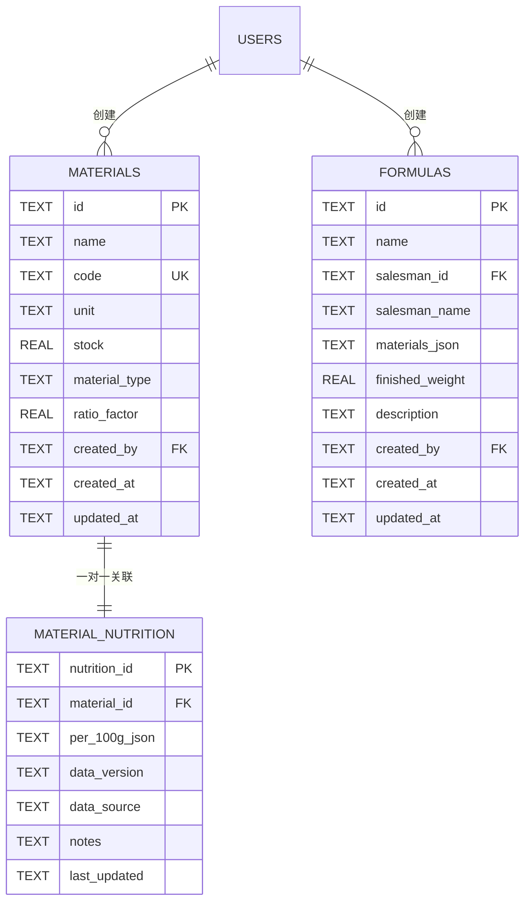
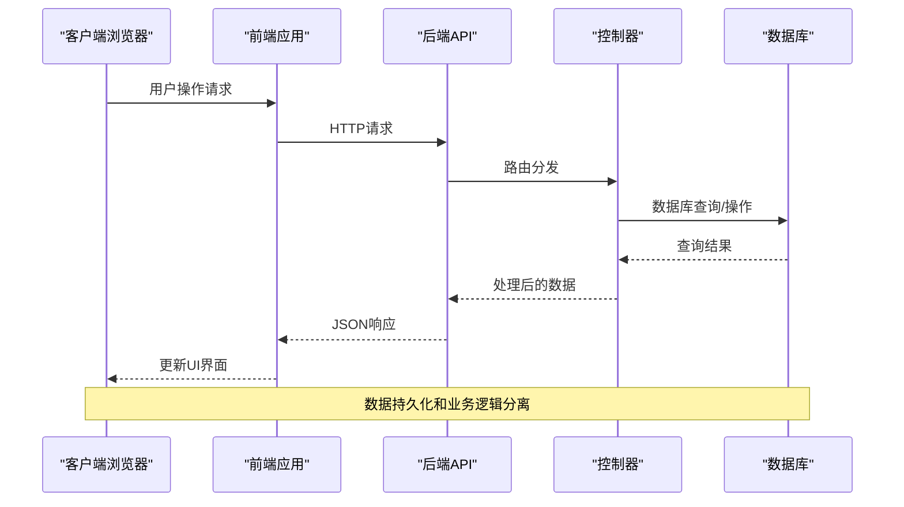
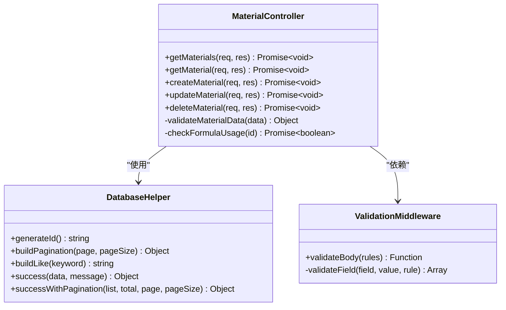
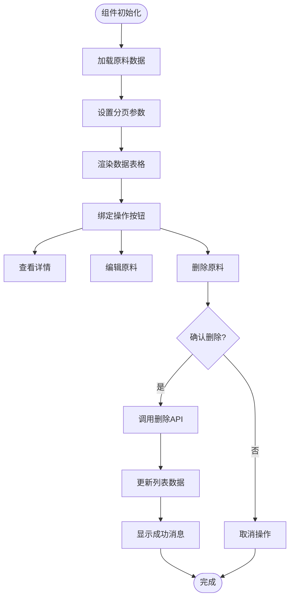
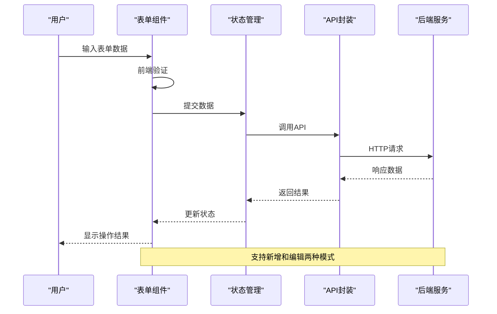
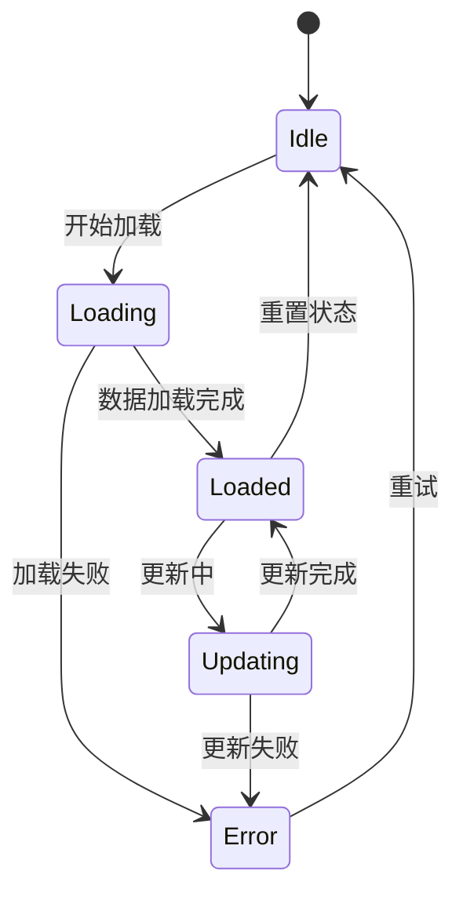
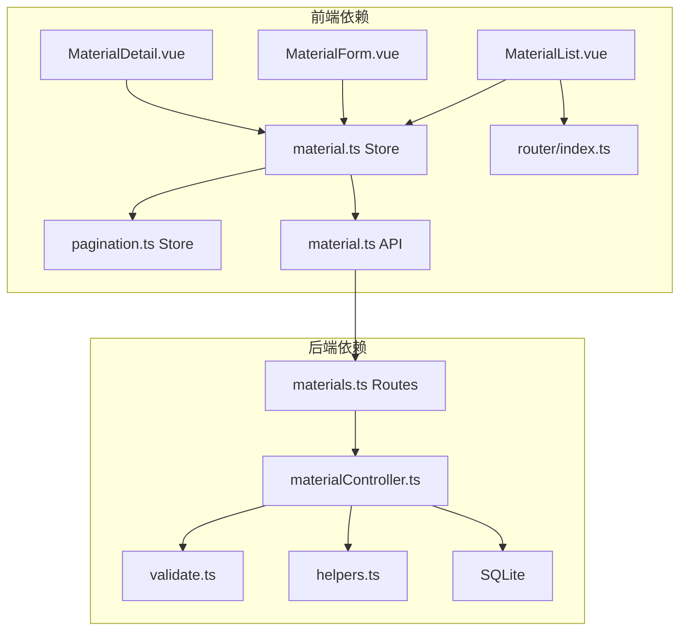
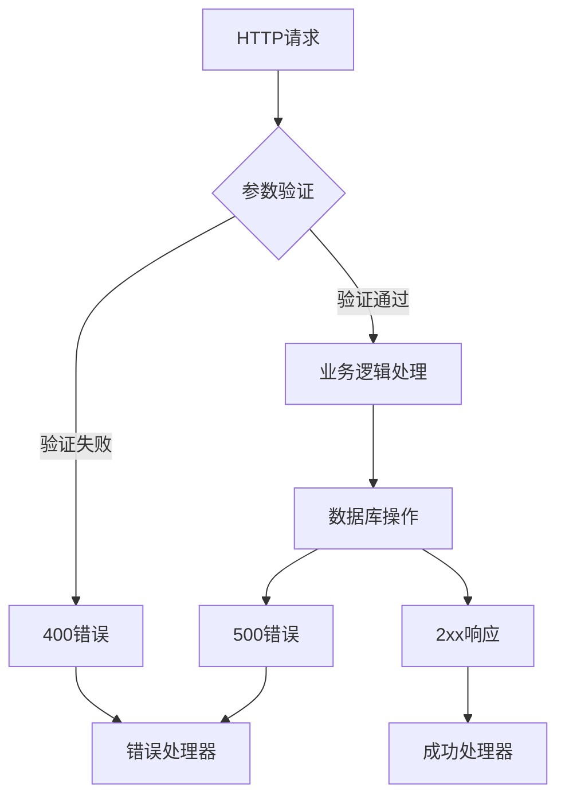

# 原料管理系统

<cite>
**本文档引用的文件**
- [materialController.ts](file://backend/src/controllers/materialController.ts)
- [material.ts](file://backend/src/routes/materials.ts)
- [validate.ts](file://backend/src/middleware/validate.ts)
- [helpers.ts](file://backend/src/utils/helpers.ts)
- [material.ts](file://frontend/src/api/material.ts)
- [material.ts](file://frontend/src/stores/material.ts)
- [MaterialList.vue](file://frontend/src/views/materials/MaterialList.vue)
- [MaterialForm.vue](file://frontend/src/views/materials/MaterialForm.vue)
- [MaterialDetail.vue](file://frontend/src/views/materials/MaterialDetail.vue)
- [pagination.ts](file://frontend/src/stores/pagination.ts)
- [DATABASE_DOC.md](file://backend/DATABASE_DOC.md)
- [API_DOC.md](file://backend/API_DOC.md)
- [index.ts](file://frontend/src/router/index.ts)
</cite>

## 目录
1. [简介](#简介)
2. [项目结构](#项目结构)
3. [核心组件](#核心组件)
4. [架构概览](#架构概览)
5. [详细组件分析](#详细组件分析)
6. [依赖关系分析](#依赖关系分析)
7. [性能考虑](#性能考虑)
8. [故障排除指南](#故障排除指南)
9. [结论](#结论)

## 简介

TingStudio 原料管理系统是一个基于 Vue.js 和 Node.js 的企业级配方管理平台，专注于中药材和营养补充剂的原料管理。系统采用前后端分离架构，后端使用 Express.js 提供 RESTful API，前端使用 Vue.js + Pinia 实现响应式用户界面。

该系统的核心功能包括：
- 原料数据模型管理（名称、编码、单位、库存、类型、含量比系数）
- 完整的 CRUD 操作（增删改查）
- 库存管理与业务规则检查
- 原料分类管理（中药材 vs 营养补充剂）
- 供应商信息关联和价格管理
- 营养成分分析集成
- 前端组件化开发和状态管理

## 项目结构

系统采用模块化的项目组织方式，分为前端和后端两个主要部分：

```mermaid
graph TB
subgraph "后端架构"
Backend[后端服务]
Controllers[控制器层]
Routes[路由层]
Middleware[中间件层]
Utils[工具函数]
Database[数据库层]
Backend --> Controllers
Controllers --> Routes
Routes --> Middleware
Middleware --> Utils
Controllers --> Database
end
subgraph "前端架构"
Frontend[前端应用]
Views[视图组件]
Stores[状态管理]
API[API封装]
Router[路由管理]
Frontend --> Views
Views --> Stores
Stores --> API
API --> Router
end
Backend <- --> Frontend
```

**图表来源**
- [materialController.ts:1-129](file://backend/src/controllers/materialController.ts#L1-L129)
- [material.ts:1-22](file://backend/src/routes/materials.ts#L1-L22)
- [material.ts:1-342](file://frontend/src/views/materials/MaterialList.vue#L1-L342)

**章节来源**
- [materialController.ts:1-129](file://backend/src/controllers/materialController.ts#L1-L129)
- [material.ts:1-22](file://backend/src/routes/materials.ts#L1-L22)
- [material.ts:1-342](file://frontend/src/views/materials/MaterialList.vue#L1-L342)

## 核心组件

### 数据模型设计

系统采用 SQLite 作为数据存储，核心数据模型围绕原料管理展开：



**图表来源**
- [DATABASE_DOC.md:44-65](file://backend/DATABASE_DOC.md#L44-L65)
- [DATABASE_DOC.md:273-321](file://backend/DATABASE_DOC.md#L273-L321)

### 核心业务实体

系统定义了完整的原料管理业务实体：

| 字段 | 类型 | 约束 | 说明 |
|------|------|------|------|
| id | TEXT | PRIMARY KEY | 原料唯一标识 |
| name | TEXT | NOT NULL | 原料名称 |
| code | TEXT | NOT NULL, UNIQUE | 原料编码（如 MAT001） |
| unit | TEXT | NOT NULL, DEFAULT 'g' | 计量单位 |
| stock | REAL | NOT NULL, DEFAULT 0 | 库存数量 |
| material_type | TEXT | NOT NULL, DEFAULT 'herb' | 原料类型：herb/supplement |
| ratio_factor | REAL | NOT NULL, DEFAULT 0.18 | 含量比系数 |
| created_by | TEXT | NOT NULL | 创建人（用户 ID） |
| created_at | TEXT | NOT NULL | 创建时间 |
| updated_at | TEXT | NOT NULL | 更新时间 |

**章节来源**
- [DATABASE_DOC.md:44-65](file://backend/DATABASE_DOC.md#L44-L65)

## 架构概览

系统采用经典的三层架构模式，实现了清晰的职责分离：



**图表来源**
- [materialController.ts:6-38](file://backend/src/controllers/materialController.ts#L6-L38)
- [material.ts:11-21](file://backend/src/routes/materials.ts#L11-L21)

### 技术栈特点

- **后端技术**：TypeScript + Express.js + better-sqlite3
- **前端技术**：Vue.js 3 + TypeScript + Pinia + TDesign UI
- **数据库**：SQLite（WAL模式），支持外键约束
- **状态管理**：Pinia（替代 Vuex）
- **构建工具**：Vite

**章节来源**
- [materialController.ts:1-129](file://backend/src/controllers/materialController.ts#L1-L129)
- [material.ts:1-22](file://backend/src/routes/materials.ts#L1-L22)

## 详细组件分析

### 后端控制器实现

#### 原料管理控制器

控制器层实现了完整的 CRUD 操作，包含了数据验证、业务规则检查和错误处理：



**图表来源**
- [materialController.ts:6-129](file://backend/src/controllers/materialController.ts#L6-L129)
- [validate.ts:16-67](file://backend/src/middleware/validate.ts#L16-L67)
- [helpers.ts:3-86](file://backend/src/utils/helpers.ts#L3-L86)

#### 数据验证机制

系统实现了强大的请求验证中间件，确保数据完整性：

| 验证规则 | 类型 | 必填 | 约束 | 错误消息 |
|----------|------|------|------|----------|
| name | string | 是 | 最小长度1 | 请输入原料名称 |
| code | string | 是 | 最小长度1 | 请输入原料编码 |
| unit | string | 否 | 必须为字符串 | 单位必须为字符串 |
| stock | number | 否 | 必须为数字 | 库存必须为数字 |

**章节来源**
- [materialController.ts:57-106](file://backend/src/controllers/materialController.ts#L57-L106)
- [validate.ts:16-67](file://backend/src/middleware/validate.ts#L16-L67)

### 前端组件实现

#### 原料列表组件

列表组件提供了完整的数据展示和交互功能：



**图表来源**
- [MaterialList.vue:108-178](file://frontend/src/views/materials/MaterialList.vue#L108-L178)

#### 原料表单组件

表单组件实现了数据输入和验证功能：



**图表来源**
- [MaterialForm.vue:142-165](file://frontend/src/views/materials/MaterialForm.vue#L142-L165)

**章节来源**
- [MaterialList.vue:1-342](file://frontend/src/views/materials/MaterialList.vue#L1-L342)
- [MaterialForm.vue:1-204](file://frontend/src/views/materials/MaterialForm.vue#L1-L204)

### 状态管理策略

#### Pinia Store 设计

系统使用 Pinia 进行状态管理，实现了响应式的数据流：



**图表来源**
- [material.ts:16-85](file://frontend/src/stores/material.ts#L16-L85)

#### 分页状态管理

系统实现了全局分页状态管理，支持动态调整分页参数：

| 状态属性 | 类型 | 默认值 | 说明 |
|----------|------|--------|------|
| current | number | 1 | 当前页码 |
| pageSize | number | 10 | 每页条数 |
| total | number | 0 | 总记录数 |
| visible | boolean | false | 分页控件可见性 |
| dynamicPageSize | number | 10 | 动态计算的分页大小 |

**章节来源**
- [material.ts:1-130](file://frontend/src/stores/material.ts#L1-L130)
- [pagination.ts:1-89](file://frontend/src/stores/pagination.ts#L1-L89)

## 依赖关系分析

### 组件间依赖关系



**图表来源**
- [material.ts:75-82](file://frontend/src/views/materials/MaterialList.vue#L75-L82)
- [material.ts:1-129](file://backend/src/controllers/materialController.ts#L1-L129)
- [material.ts:1-22](file://backend/src/routes/materials.ts#L1-L22)

### 外部依赖分析

系统的主要外部依赖包括：

| 依赖包 | 版本 | 用途 |
|--------|------|------|
| vue | ^3.4.0 | 前端框架 |
| pinia | ^2.1.0 | 状态管理 |
| tdesign-vue-next | ^1.0.0 | UI 组件库 |
| express | ^4.18.0 | Web 服务器 |
| better-sqlite3 | ^9.0.0 | SQLite 数据库驱动 |
| axios | ^1.5.0 | HTTP 客户端 |

**章节来源**
- [material.ts:1-342](file://frontend/src/views/materials/MaterialList.vue#L1-L342)
- [materialController.ts:1-129](file://backend/src/controllers/materialController.ts#L1-L129)

## 性能考虑

### 数据库优化

系统在数据库层面采用了多项优化措施：

1. **索引策略**：为常用查询字段建立索引
   - `idx_material_name`：按原料名称查询
   - `idx_material_code`：按原料编码查询

2. **查询优化**：使用参数化查询防止 SQL 注入
3. **连接池管理**：合理配置数据库连接数
4. **事务处理**：在需要一致性的地方使用事务

### 前端性能优化

1. **懒加载**：路由级别的组件懒加载
2. **虚拟滚动**：大数据量时使用虚拟滚动
3. **缓存策略**：Pinia Store 状态缓存
4. **防抖处理**：搜索功能的防抖优化

### API 性能优化

1. **分页查询**：默认每页20条记录，最大100条
2. **批量操作**：支持批量删除和更新
3. **缓存机制**：热门数据的内存缓存
4. **压缩传输**：启用 Gzip 压缩

## 故障排除指南

### 常见问题及解决方案

#### 数据库连接问题

**症状**：启动时出现数据库连接错误
**解决方案**：
1. 检查数据库文件路径是否正确
2. 确认数据库文件权限设置
3. 验证 SQLite 驱动安装状态

#### API 接口错误

**症状**：API 返回 400 或 500 错误
**排查步骤**：
1. 检查请求参数格式
2. 验证数据类型和约束
3. 查看后端日志输出

#### 前端组件异常

**症状**：页面显示空白或功能异常
**解决方法**：
1. 检查网络请求状态
2. 验证 API 响应格式
3. 确认路由配置正确

### 错误处理机制

系统实现了多层次的错误处理：



**图表来源**
- [materialController.ts:35-127](file://backend/src/controllers/materialController.ts#L35-L127)
- [validate.ts:60-66](file://backend/src/middleware/validate.ts#L60-L66)

**章节来源**
- [materialController.ts:35-127](file://backend/src/controllers/materialController.ts#L35-L127)
- [validate.ts:60-66](file://backend/src/middleware/validate.ts#L60-L66)

## 结论

TingStudio 原料管理系统展现了现代 Web 应用的最佳实践，具有以下特点：

### 技术优势
- **架构清晰**：前后端分离，职责明确
- **数据安全**：完善的参数验证和错误处理
- **用户体验**：响应式设计，操作流畅
- **扩展性强**：模块化设计，易于功能扩展

### 业务价值
- **提高效率**：自动化库存管理和业务流程
- **保证质量**：严格的业务规则和数据校验
- **降低成本**：减少人工操作和错误率
- **增强协作**：支持多用户协同工作

### 发展建议
1. **监控完善**：增加系统性能监控和日志分析
2. **测试覆盖**：提升单元测试和集成测试覆盖率
3. **文档更新**：保持 API 文档与代码同步
4. **安全加固**：增强身份认证和授权机制

该系统为中药材和营养补充剂的原料管理提供了完整的数字化解决方案，具备良好的可维护性和扩展性，能够满足企业的长期发展需求。