# 导出管理系统

<cite>
**本文档引用的文件**
- [backend/src/controllers/exportController.ts](file://backend/src/controllers/exportController.ts)
- [backend/src/routes/exports.ts](file://backend/src/routes/exports.ts)
- [backend/src/utils/formulaExporter.ts](file://backend/src/utils/formulaExporter.ts)
- [backend/src/utils/formulaPdfExporter.ts](file://backend/src/utils/formulaPdfExporter.ts)
- [backend/src/config/database.ts](file://backend/src/config/database.ts)
- [backend/src/utils/helpers.ts](file://backend/src/utils/helpers.ts)
- [backend/src/middleware/errorHandler.ts](file://backend/src/middleware/errorHandler.ts)
- [backend/src/middleware/validate.ts](file://backend/src/middleware/validate.ts)
- [backend/DATABASE_DOC.md](file://backend/DATABASE_DOC.md)
- [backend/src/scripts/init.sql](file://backend/src/scripts/init.sql)
- [backend/src/index.ts](file://backend/src/index.ts)
- [backend/package.json](file://backend/package.json)
- [frontend/src/views/exports/ExportCenter.vue](file://frontend/src/views/exports/ExportCenter.vue)
- [frontend/src/stores/export.ts](file://frontend/src/stores/export.ts)
- [frontend/src/api/export.ts](file://frontend/src/api/export.ts)
- [frontend/src/api/http.ts](file://frontend/src/api/http.ts)
- [frontend/package.json](file://frontend/package.json)
</cite>

## 更新摘要
**变更内容**
- Excel导出支持三个工作表：配方信息、原料清单、营养数据
- PDF导出增强中文支持和排版优化，包含中文字体检测和注册
- 实现完整的导出任务状态跟踪和失败重试机制
- 更新数据库模式，支持Excel和PDF导出类型
- 完善前端导出界面，提供更丰富的导出选项和状态反馈

## 目录
1. [简介](#简介)
2. [项目结构](#项目结构)
3. [核心组件](#核心组件)
4. [架构概览](#架构概览)
5. [详细组件分析](#详细组件分析)
6. [导出引擎详解](#导出引擎详解)
7. [支持的导出格式](#支持的导出格式)
8. [依赖关系分析](#依赖关系分析)
9. [性能考虑](#性能考虑)
10. [故障排除指南](#故障排除指南)
11. [结论](#结论)
12. [附录](#附录)

## 简介

TingStudio 导出管理系统是一个完整的配方导出解决方案，现已升级为支持多种导出格式（Excel、PDF、API）和自定义模板功能的专业系统。该系统采用前后端分离架构，后端基于 Node.js + Express + SQLite，前端使用 Vue 3 + TypeScript + TDesign 组件库。

**系统特色功能：**
- **专业导出引擎**：内置Excel和PDF导出引擎，支持复杂的格式化和样式设置
- **多格式支持**：Excel电子表格、PDF专业文档、API实时数据推送、Print打印格式
- **高级模板管理**：支持自定义模板配置和格式化选项
- **文件存储管理**：本地文件系统存储导出文件，支持下载和重试功能
- **状态跟踪系统**：完整的导出任务状态管理和进度监控
- **分享功能**：支持密码保护、有效期限制和下载次数控制的分享链接
- **中文支持**：PDF导出包含中文字体检测和注册机制

## 项目结构

导出管理系统采用模块化的项目结构，前后端分离设计清晰：

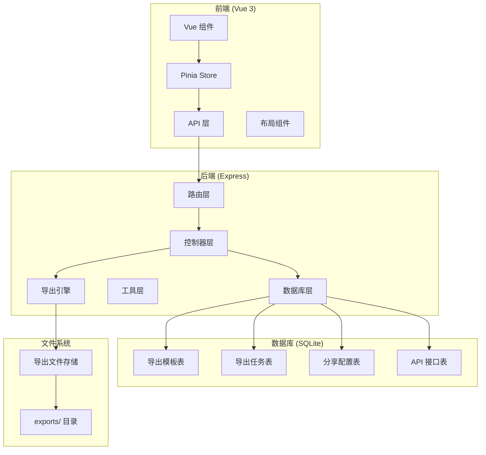

**图表来源**
- [frontend/src/views/exports/ExportCenter.vue:1-554](file://frontend/src/views/exports/ExportCenter.vue#L1-L554)
- [backend/src/controllers/exportController.ts:1-425](file://backend/src/controllers/exportController.ts#L1-L425)
- [backend/src/routes/exports.ts:1-40](file://backend/src/routes/exports.ts#L1-L40)
- [backend/src/utils/formulaExporter.ts:1-203](file://backend/src/utils/formulaExporter.ts#L1-L203)
- [backend/src/utils/formulaPdfExporter.ts:1-391](file://backend/src/utils/formulaPdfExporter.ts#L1-L391)

**章节来源**
- [frontend/src/views/exports/ExportCenter.vue:1-554](file://frontend/src/views/exports/ExportCenter.vue#L1-L554)
- [backend/src/controllers/exportController.ts:1-425](file://backend/src/controllers/exportController.ts#L1-L425)
- [backend/src/routes/exports.ts:1-40](file://backend/src/routes/exports.ts#L1-L40)

## 核心组件

### 后端核心组件

#### 导出控制器 (ExportController)
负责处理所有导出相关的业务逻辑，包括模板管理、任务创建、分享配置和文件下载等功能。

#### 导出引擎 (Export Engines)
**新增** 两个专业导出引擎：
- **Excel导出引擎**：基于xlsx库，支持复杂的工作簿结构和格式化
- **PDF导出引擎**：基于pdfkit库，支持专业的PDF文档生成和样式设置，包含中文字体支持

#### 路由配置 (Export Routes)
定义了完整的导出管理 API 接口，包括认证中间件和参数验证。

#### 数据库配置 (Database)
基于 better-sqlite3 的 SQLite 数据库连接管理，支持事务和外键约束。

### 前端核心组件

#### 导出中心视图 (ExportCenter.vue)
提供完整的导出管理界面，包括任务创建、模板管理和分享功能，支持Excel和PDF格式选择。

#### Pinia Store (Export Store)
管理导出相关的状态管理，包括模板列表、任务列表、分享配置和API接口管理。

#### API 层 (Export API)
封装所有导出相关的 HTTP 请求，提供类型安全的接口定义和文件下载处理。

**章节来源**
- [backend/src/controllers/exportController.ts:1-425](file://backend/src/controllers/exportController.ts#L1-L425)
- [backend/src/utils/formulaExporter.ts:1-203](file://backend/src/utils/formulaExporter.ts#L1-L203)
- [backend/src/utils/formulaPdfExporter.ts:1-391](file://backend/src/utils/formulaPdfExporter.ts#L1-L391)
- [backend/src/routes/exports.ts:1-40](file://backend/src/routes/exports.ts#L1-L40)
- [backend/src/config/database.ts:1-70](file://backend/src/config/database.ts#L1-L70)
- [frontend/src/views/exports/ExportCenter.vue:1-554](file://frontend/src/views/exports/ExportCenter.vue#L1-L554)
- [frontend/src/stores/export.ts:1-194](file://frontend/src/stores/export.ts#L1-L194)
- [frontend/src/api/export.ts:1-118](file://frontend/src/api/export.ts#L1-L118)

## 架构概览

导出管理系统采用经典的三层架构设计，现已增强为支持多格式导出的专业系统：

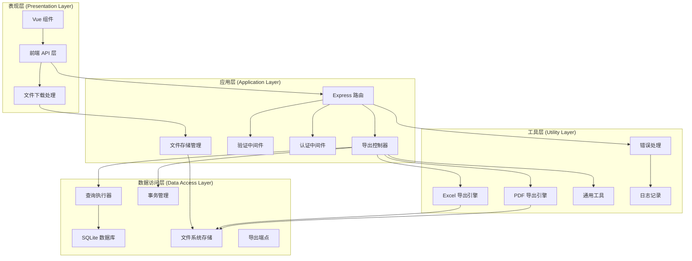

**图表来源**
- [backend/src/index.ts:1-61](file://backend/src/index.ts#L1-L61)
- [backend/src/routes/exports.ts:1-40](file://backend/src/routes/exports.ts#L1-L40)
- [backend/src/controllers/exportController.ts:1-425](file://backend/src/controllers/exportController.ts#L1-L425)
- [backend/src/config/database.ts:1-70](file://backend/src/config/database.ts#L1-L70)
- [backend/src/utils/formulaExporter.ts:1-203](file://backend/src/utils/formulaExporter.ts#L1-L203)
- [backend/src/utils/formulaPdfExporter.ts:1-391](file://backend/src/utils/formulaPdfExporter.ts#L1-L391)

### 数据模型关系

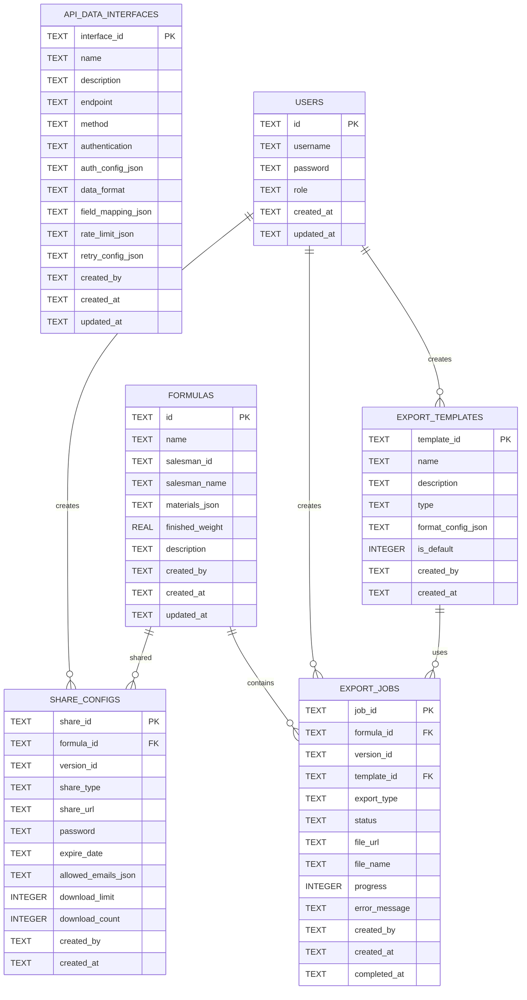

**图表来源**
- [backend/DATABASE_DOC.md:180-275](file://backend/DATABASE_DOC.md#L180-L275)
- [backend/src/scripts/init.sql:102-170](file://backend/src/scripts/init.sql#L102-L170)

**章节来源**
- [backend/DATABASE_DOC.md:1-462](file://backend/DATABASE_DOC.md#L1-L462)
- [backend/src/scripts/init.sql:1-234](file://backend/src/scripts/init.sql#L1-L234)

## 详细组件分析

### 后端控制器实现

#### 导出模板管理
控制器提供了完整的模板 CRUD 操作，支持默认模板切换和格式配置管理。

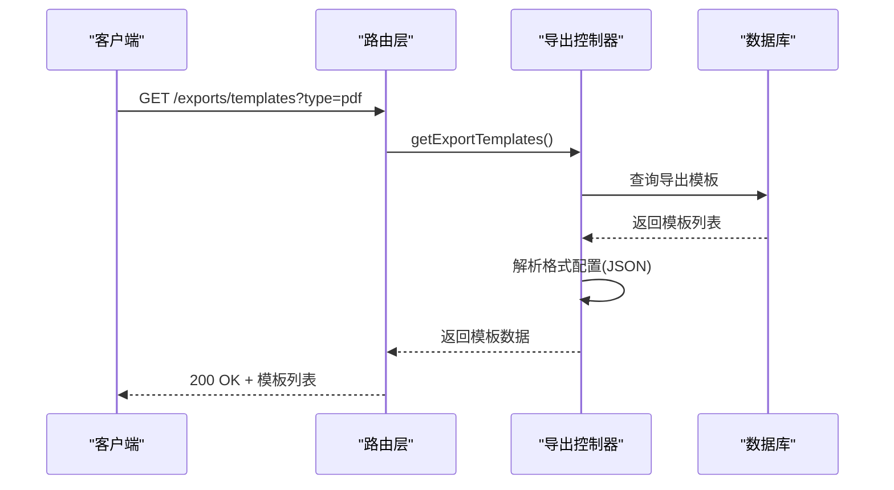

**图表来源**
- [backend/src/controllers/exportController.ts:16-40](file://backend/src/controllers/exportController.ts#L16-L40)
- [backend/src/routes/exports.ts:16](file://backend/src/routes/exports.ts#L16)

#### 导出任务处理
**更新** 任务创建流程现在支持Excel和PDF格式的同步导出，并包含完整的状态跟踪。

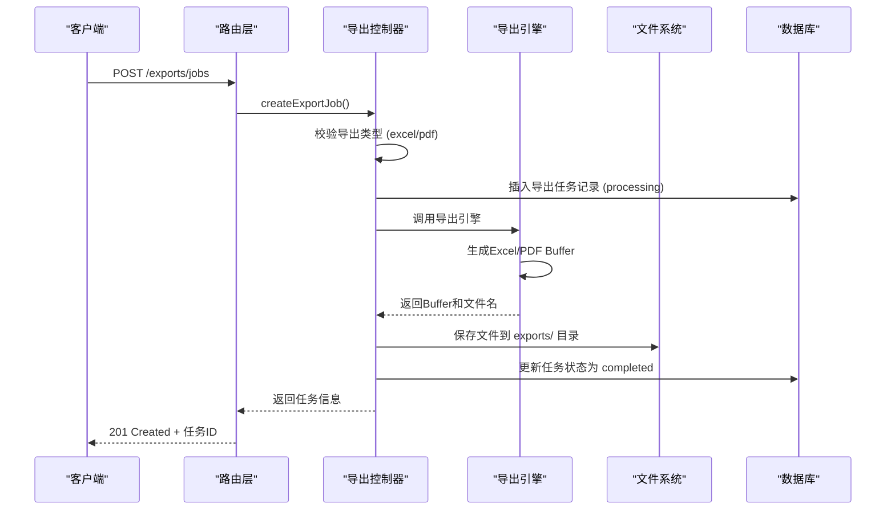

**图表来源**
- [backend/src/controllers/exportController.ts:65-122](file://backend/src/controllers/exportController.ts#L65-L122)
- [backend/src/routes/exports.ts:22](file://backend/src/routes/exports.ts#L22)

#### 分享链接管理
支持多种分享方式，包括密码保护、有效期限制和下载次数控制。

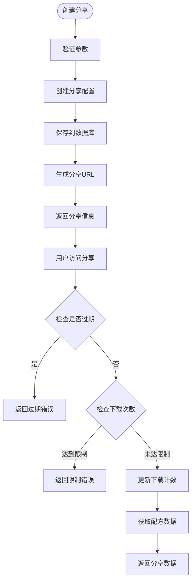

**图表来源**
- [backend/src/controllers/exportController.ts:173-239](file://backend/src/controllers/exportController.ts#L173-L239)

#### 导出任务状态跟踪
**新增** 完整的任务状态跟踪机制，支持pending、processing、completed、failed四种状态。

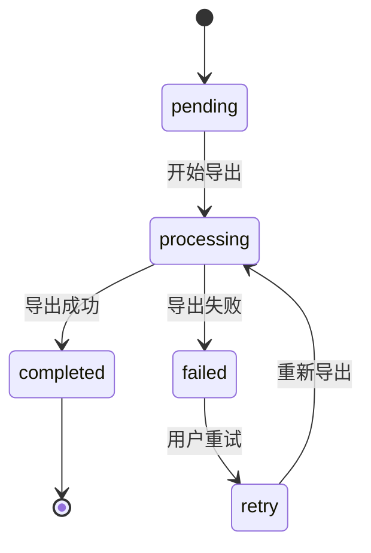

**图表来源**
- [backend/src/controllers/exportController.ts:20-40](file://backend/src/controllers/exportController.ts#L20-L40)

#### 失败重试机制
**新增** 导出任务失败后的重试功能，支持用户手动重试失败的任务。

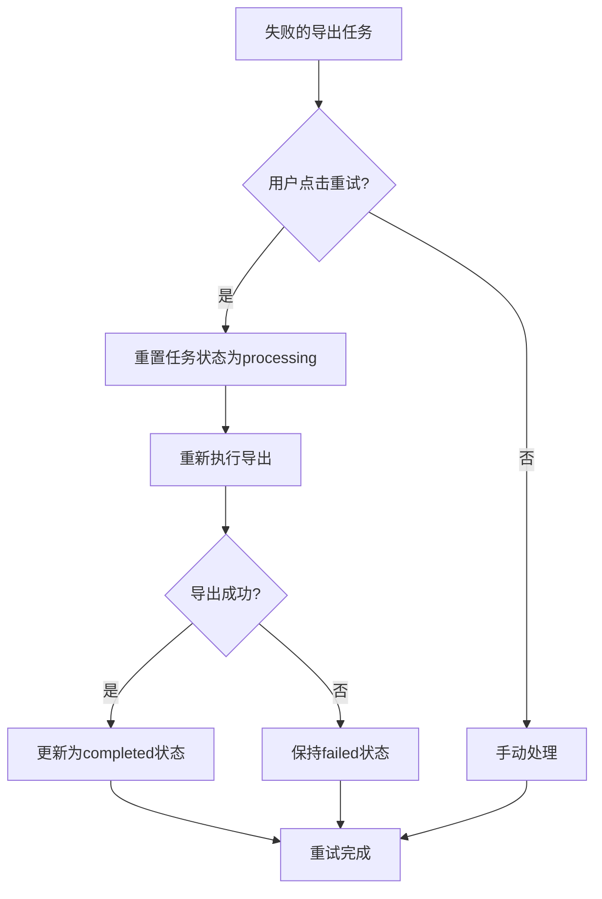

**图表来源**
- [backend/src/controllers/exportController.ts:317-364](file://backend/src/controllers/exportController.ts#L317-L364)

**章节来源**
- [backend/src/controllers/exportController.ts:1-425](file://backend/src/controllers/exportController.ts#L1-L425)

### 前端组件实现

#### 导出中心界面设计
ExportCenter.vue 提供了完整的导出管理界面，采用标签页组织不同功能模块。

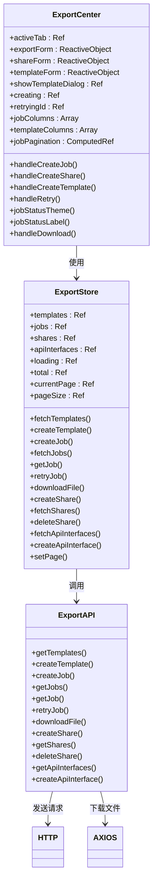

**图表来源**
- [frontend/src/views/exports/ExportCenter.vue:277-554](file://frontend/src/views/exports/ExportCenter.vue#L277-L554)
- [frontend/src/stores/export.ts:1-194](file://frontend/src/stores/export.ts#L1-L194)
- [frontend/src/api/export.ts:66-118](file://frontend/src/api/export.ts#L66-L118)

#### 状态管理架构
Pinia Store 提供了响应式的状态管理，支持模板和任务的增删改查操作。

**章节来源**
- [frontend/src/views/exports/ExportCenter.vue:1-554](file://frontend/src/views/exports/ExportCenter.vue#L1-L554)
- [frontend/src/stores/export.ts:1-194](file://frontend/src/stores/export.ts#L1-L194)
- [frontend/src/api/export.ts:1-118](file://frontend/src/api/export.ts#L1-L118)

## 导出引擎详解

### Excel导出引擎

**新增** Excel导出引擎基于xlsx库，提供专业的电子表格导出功能：

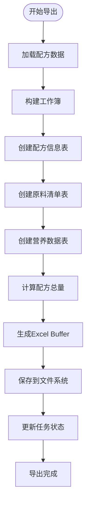

**图表来源**
- [backend/src/utils/formulaExporter.ts:56-203](file://backend/src/utils/formulaExporter.ts#L56-L203)

**Excel导出特性**
- **三个工作表结构**：配方信息、原料清单、营养数据
- **智能格式化**：自动列宽调整、数据类型识别、数字格式化
- **统计计算**：配方总量计算、营养成分汇总
- **样式定制**：表头高亮、交替行着色、边框设置

### PDF导出引擎

**新增** PDF导出引擎基于pdfkit库，支持专业的PDF文档生成和中文支持：

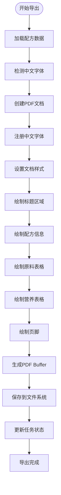

**图表来源**
- [backend/src/utils/formulaPdfExporter.ts:140-391](file://backend/src/utils/formulaPdfExporter.ts#L140-L391)

**PDF导出特性**
- **中文字体支持**：自动检测系统中文字体（SimHei、Microsoft YaHei等）
- **字体缓存机制**：优化字体加载性能
- **专业排版**：A4页面、标准边距、标题样式
- **表格渲染**：精确的表格布局、单元格对齐
- **颜色主题**：品牌色彩、渐变效果、视觉层次
- **元数据管理**：文档标题、作者、主题信息

### 文件存储管理

**新增** 导出文件存储系统：

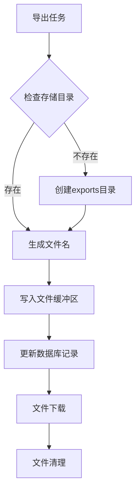

**图表来源**
- [backend/src/controllers/exportController.ts:100-110](file://backend/src/controllers/exportController.ts#L100-L110)

**章节来源**
- [backend/src/utils/formulaExporter.ts:1-203](file://backend/src/utils/formulaExporter.ts#L1-L203)
- [backend/src/utils/formulaPdfExporter.ts:1-391](file://backend/src/utils/formulaPdfExporter.ts#L1-L391)
- [backend/src/controllers/exportController.ts:1-425](file://backend/src/controllers/exportController.ts#L1-L425)

## 支持的导出格式

**更新** 系统现已支持以下导出格式：

| 格式类型 | 描述 | 主要用途 | 技术实现 | 配置选项 |
|---------|------|----------|----------|----------|
| PDF | 专业文档格式 | 报告打印、归档、正式发布 | pdfkit库 | 页面设置、字体样式、边距、颜色主题 |
| Excel | 电子表格格式 | 数据分析、二次处理、批量导入 | xlsx库 | 列宽、样式、公式、条件格式 |
| API | 实时数据推送 | 系统集成、自动化 | HTTP接口 | 端点配置、认证方式、数据格式 |
| Print | 打印格式 | 生产指令、标签打印 | 直接打印 | 打印机设置、纸张规格 |

### Excel导出特性

**新增** Excel导出引擎提供以下专业功能：
- **多工作表结构**：配方信息、原料清单、营养数据三个工作表
- **智能格式化**：自动列宽调整、数据类型识别、数字格式化
- **统计计算**：配方总量计算、营养成分汇总
- **样式定制**：表头高亮、交替行着色、边框设置

### PDF导出特性

**新增** PDF导出引擎提供以下专业功能：
- **中文字体检测**：自动检测系统中文字体并注册使用
- **字体缓存**：优化字体加载性能，避免重复注册
- **专业排版**：A4页面、标准边距、标题样式
- **表格渲染**：精确的表格布局、单元格对齐
- **颜色主题**：品牌色彩、渐变效果、视觉层次
- **元数据管理**：文档标题、作者、主题信息

**章节来源**
- [backend/DATABASE_DOC.md:180-275](file://backend/DATABASE_DOC.md#L180-L275)
- [backend/src/scripts/init.sql:102-170](file://backend/src/scripts/init.sql#L102-L170)
- [backend/src/utils/formulaExporter.ts:112-195](file://backend/src/utils/formulaExporter.ts#L112-L195)
- [backend/src/utils/formulaPdfExporter.ts:56-89](file://backend/src/utils/formulaPdfExporter.ts#L56-L89)

## 依赖关系分析

### 后端依赖关系

**更新** 新增导出引擎相关依赖：

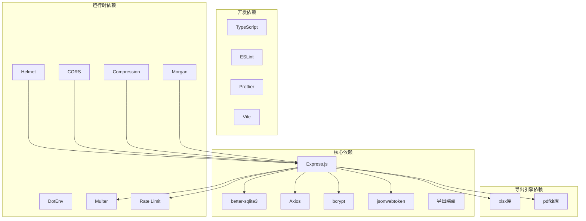

**图表来源**
- [backend/package.json:14-28](file://backend/package.json#L14-L28)
- [frontend/package.json:12-20](file://frontend/package.json#L12-L20)

### 前端依赖关系

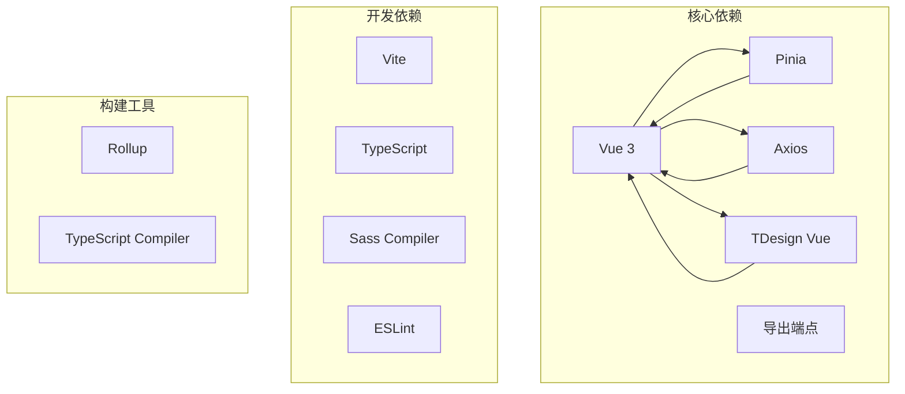

**图表来源**
- [frontend/package.json:12-20](file://frontend/package.json#L12-L20)

**章节来源**
- [backend/src/index.ts:1-61](file://backend/src/index.ts#L1-L61)
- [frontend/src/main.ts](file://frontend/src/main.ts)

## 性能考虑

### 数据库性能优化

**更新** 导出功能的数据库优化：

1. **索引策略**
   - 导出模板按类型建立索引
   - 导出任务按配方和状态建立索引
   - 分享配置按配方建立索引

2. **查询优化**
   - 使用分页查询避免大数据集加载
   - 采用预编译语句防止 SQL 注入
   - 批量操作减少数据库往返

3. **连接池管理**
   - SQLite WAL 模式提高并发性能
   - 事务批处理提升写入效率

### 文件系统性能优化

**新增** 导出文件存储优化：

1. **文件存储策略**
   - 导出文件统一存储在 `exports/` 目录
   - 文件命名采用任务ID+扩展名格式
   - 支持文件过期清理机制

2. **内存管理**
   - Excel和PDF导出使用Buffer对象
   - 避免大文件在内存中驻留过久
   - 异步文件写入操作

3. **并发处理**
   - 导出任务支持并发执行
   - 文件系统I/O操作异步化
   - 内存使用监控和限制

### 前端性能优化

1. **组件懒加载**
   - 导出中心组件按需加载
   - 大数据表格虚拟滚动

2. **状态缓存**
   - Pinia Store 状态持久化
   - API 请求结果缓存

3. **资源优化**
   - 图片压缩和懒加载
   - CSS 和 JavaScript 代码分割

### 后端性能优化

1. **中间件优化**
   - Helmet 安全头配置
   - Compression 压缩响应
   - CORS 预检缓存
   - Rate Limit 限流保护

2. **错误处理**
   - 统一错误响应格式
   - 详细的日志记录
   - 异常情况优雅降级

3. **导出引擎优化**
   - **Excel导出优化**：使用工作簿对象批量创建多个工作表
   - **PDF导出优化**：字体缓存机制避免重复注册字体
   - **内存管理**：及时释放导出缓冲区内存

**章节来源**
- [backend/src/config/database.ts:21-23](file://backend/src/config/database.ts#L21-L23)
- [backend/src/middleware/errorHandler.ts:1-51](file://backend/src/middleware/errorHandler.ts#L1-L51)
- [backend/src/controllers/exportController.ts:100-110](file://backend/src/controllers/exportController.ts#L100-L110)

## 故障排除指南

### 常见问题及解决方案

#### 数据库连接问题
- **症状**: 启动时报数据库连接失败
- **原因**: 数据库文件路径不存在或权限不足
- **解决**: 检查数据库配置路径，确保目录存在且有读写权限

#### 认证失败
- **症状**: 401 未授权错误
- **原因**: JWT 令牌过期或无效
- **解决**: 重新登录获取新令牌，检查令牌存储位置

#### 参数验证错误
- **症状**: 400 参数错误
- **原因**: 请求参数不符合验证规则
- **解决**: 检查请求格式，确保必填字段完整

#### 外键约束错误
- **症状**: 400 关联数据不存在
- **原因**: 引用的外键记录不存在
- **解决**: 确保关联数据先创建，检查外键完整性

#### 导出引擎错误
**新增** 导出功能特有的错误处理：

- **症状**: 导出任务状态为 failed
- **原因**: Excel或PDF导出引擎异常
- **解决**: 检查配方数据完整性，确认导出引擎正常运行

#### 文件存储错误
**新增** 文件系统相关的错误处理：

- **症状**: 导出文件无法下载
- **原因**: 文件路径不存在或权限不足
- **解决**: 检查 `exports/` 目录权限，确认文件已正确保存

#### 中文字体缺失
**新增** PDF导出中文字体支持问题：

- **症状**: PDF文档中的中文显示为方块或乱码
- **原因**: 系统缺少中文字体或字体路径不正确
- **解决**: 确保系统安装了中文字体，检查字体检测逻辑

### 错误处理流程

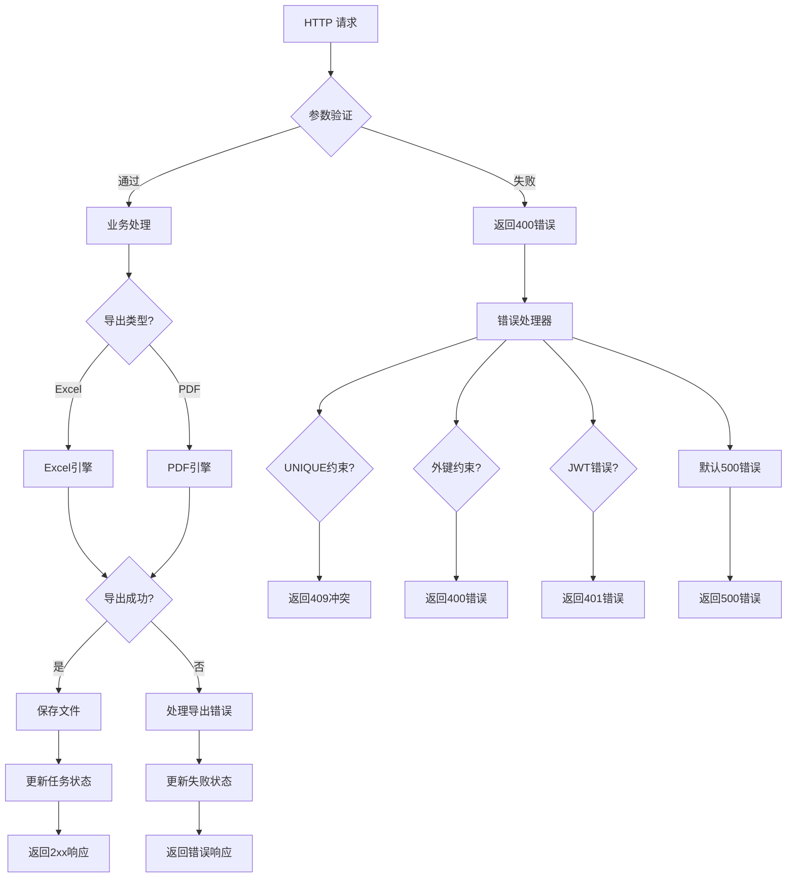

**图表来源**
- [backend/src/middleware/errorHandler.ts:5-50](file://backend/src/middleware/errorHandler.ts#L5-L50)
- [backend/src/controllers/exportController.ts:111-118](file://backend/src/controllers/exportController.ts#L111-L118)

**章节来源**
- [backend/src/middleware/errorHandler.ts:1-51](file://backend/src/middleware/errorHandler.ts#L1-L51)
- [backend/src/middleware/validate.ts:1-68](file://backend/src/middleware/validate.ts#L1-L68)

## 结论

TingStudio 导出管理系统经过升级后，已成为一个功能完整、架构清晰的专业配方导出解决方案。系统的主要优势包括：

1. **专业导出引擎**：内置Excel和PDF导出引擎，提供专业的文件格式支持
2. **多格式支持**：支持 Excel、PDF、API 等多种导出格式
3. **灵活配置**：自定义模板和参数配置满足不同需求
4. **文件存储管理**：本地文件系统存储导出文件，支持下载和重试功能
5. **状态跟踪**：完整的任务状态管理和进度监控
6. **安全可靠**：完善的认证授权和错误处理机制
7. **性能优化**：多项性能优化措施，包括数据库索引、分页查询、中间件优化等
8. **中文支持**：PDF导出包含中文字体检测和注册机制
9. **失败重试**：完整的导出任务失败重试机制

系统在性能方面采用了多项优化措施，包括数据库索引、分页查询、中间件优化、文件系统I/O优化等。同时提供了完善的错误处理和故障排除指南。

## 附录

### API 接口规范

#### 导出模板管理
- `GET /exports/templates` - 获取模板列表
- `POST /exports/templates` - 创建模板
- `PUT /exports/templates/:templateId` - 更新模板
- `DELETE /exports/templates/:templateId` - 删除模板

#### 导出任务管理
- `POST /exports/jobs` - 创建导出任务
- `GET /exports/jobs` - 获取任务列表
- `GET /exports/jobs/:jobId` - 获取任务详情
- `GET /exports/jobs/:jobId/download` - 下载导出文件
- `POST /exports/jobs/:jobId/retry` - 重试导出任务

#### 分享管理
- `GET /exports/shares` - 获取分享列表
- `POST /exports/share` - 创建分享链接
- `DELETE /exports/share/:shareId` - 删除分享链接

#### API 接口管理
- `GET /exports/api-interfaces` - 获取API接口列表
- `POST /exports/api-interfaces` - 创建API接口

### 数据库表结构

**更新** 系统包含 4 个核心导出相关表：
- `export_templates`: 导出模板配置，支持pdf、excel、api、print类型
- `export_jobs`: 导出任务记录，支持pdf、excel、api类型
- `share_configs`: 分享配置
- `api_data_interfaces`: API 接口配置

### 扩展开发建议

1. **自定义格式支持**: 可以添加新的导出格式，如 Word、CSV 等
2. **批量处理**: 实现批量导出任务的并发处理
3. **进度通知**: 添加 WebSocket 实时进度通知
4. **模板编辑器**: 开发可视化的模板编辑界面
5. **审计日志**: 添加完整的操作审计功能
6. **云存储集成**: 支持云存储服务（AWS S3、阿里云OSS等）
7. **导出队列**: 实现异步导出队列系统
8. **模板预览**: 添加导出模板预览功能

### 导出引擎技术细节

**新增** 导出引擎的技术实现要点：

#### Excel导出技术要点
- 使用xlsx库的workbook对象管理多个工作表
- 支持复杂的表格样式和格式设置
- 实现数据到表格的自动映射
- 提供文件缓冲区生成和下载支持

#### PDF导出技术要点
- 使用pdfkit库创建PDF文档对象
- 实现精确的页面布局和元素定位
- 支持字体、颜色、边框等样式设置
- 提供文档元数据和安全属性配置
- **中文字体支持**：自动检测和注册系统中文字体

**章节来源**
- [backend/src/controllers/exportController.ts:1-425](file://backend/src/controllers/exportController.ts#L1-L425)
- [backend/src/utils/formulaExporter.ts:1-203](file://backend/src/utils/formulaExporter.ts#L1-L203)
- [backend/src/utils/formulaPdfExporter.ts:1-391](file://backend/src/utils/formulaPdfExporter.ts#L1-L391)
- [backend/DATABASE_DOC.md:180-275](file://backend/DATABASE_DOC.md#L180-L275)
- [backend/src/scripts/init.sql:102-170](file://backend/src/scripts/init.sql#L102-L170)