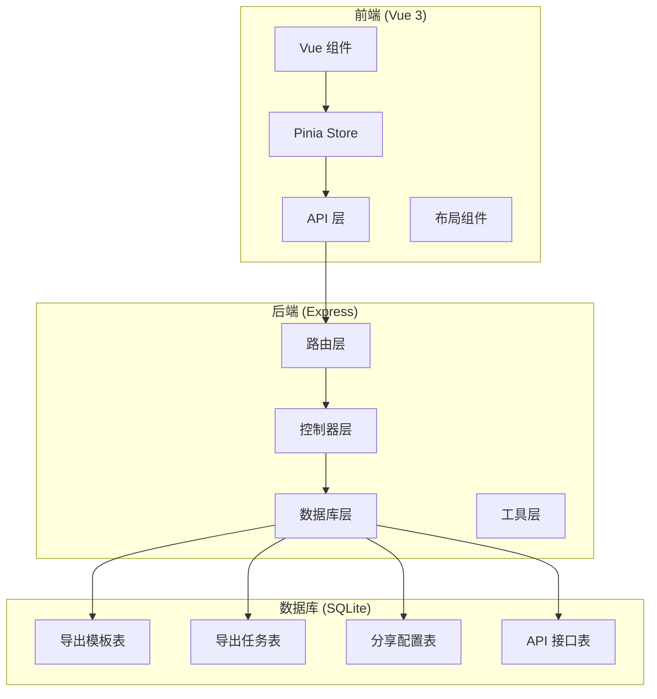
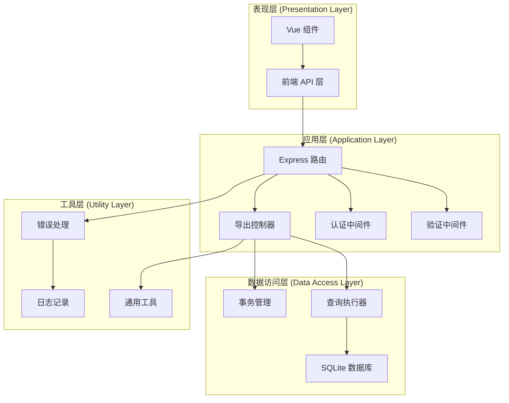
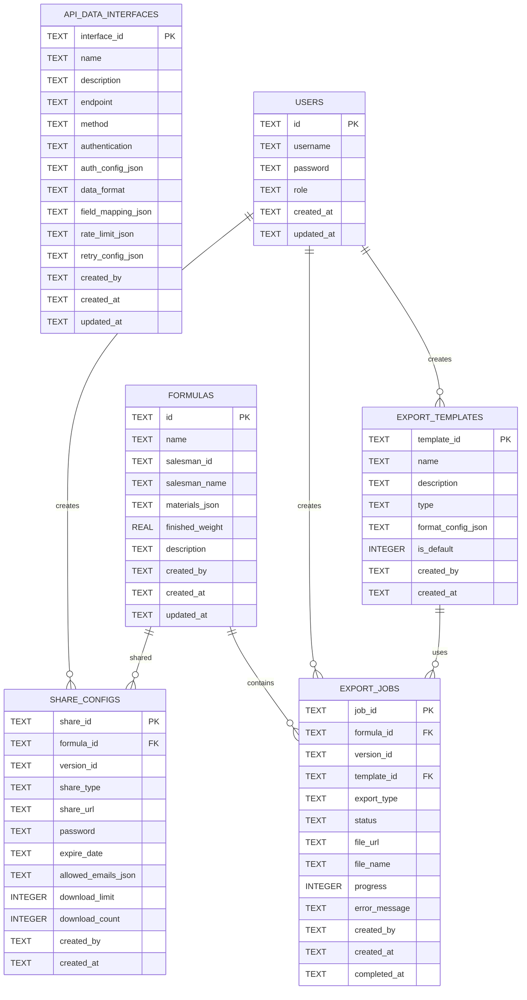
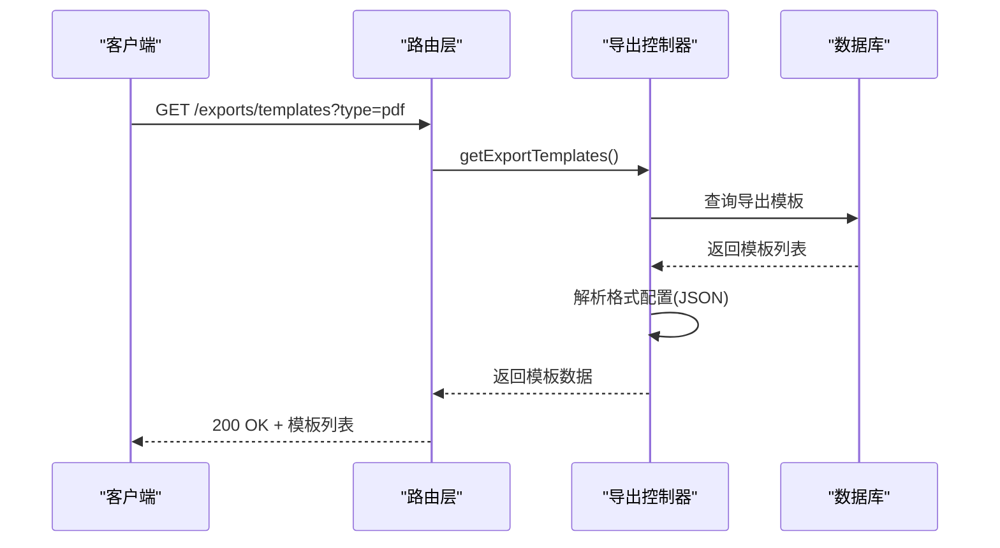
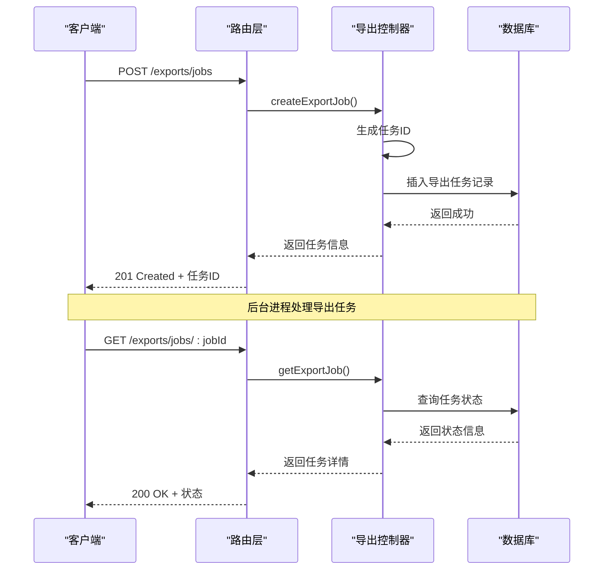
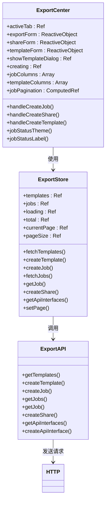
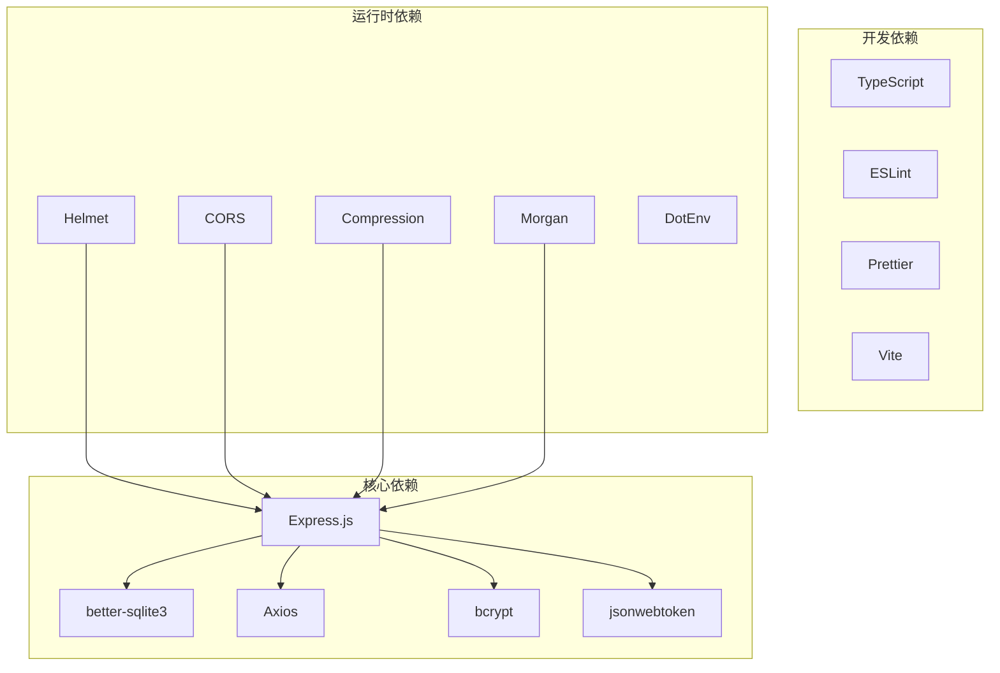
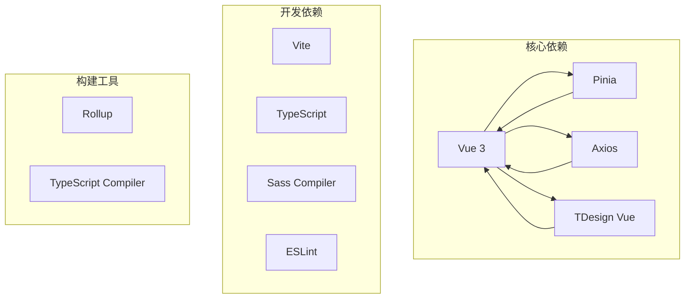
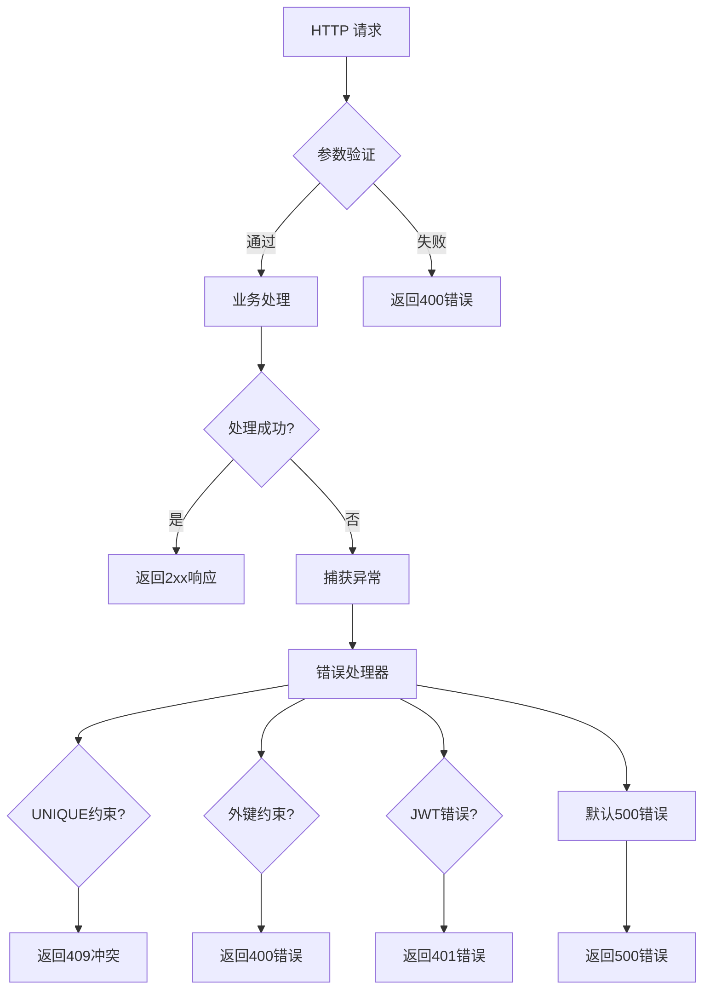

# 导出管理系统

<cite>
**本文档引用的文件**
- [backend/src/controllers/exportController.ts](file://backend/src/controllers/exportController.ts)
- [backend/src/routes/exports.ts](file://backend/src/routes/exports.ts)
- [backend/src/config/database.ts](file://backend/src/config/database.ts)
- [backend/src/utils/helpers.ts](file://backend/src/utils/helpers.ts)
- [backend/src/middleware/errorHandler.ts](file://backend/src/middleware/errorHandler.ts)
- [backend/src/middleware/validate.ts](file://backend/src/middleware/validate.ts)
- [backend/DATABASE_DOC.md](file://backend/DATABASE_DOC.md)
- [backend/src/scripts/init.sql](file://backend/src/scripts/init.sql)
- [backend/src/index.ts](file://backend/src/index.ts)
- [frontend/src/views/exports/ExportCenter.vue](file://frontend/src/views/exports/ExportCenter.vue)
- [frontend/src/stores/export.ts](file://frontend/src/stores/export.ts)
- [frontend/src/api/export.ts](file://frontend/src/api/export.ts)
- [frontend/src/api/http.ts](file://frontend/src/api/http.ts)
</cite>

## 目录
1. [简介](#简介)
2. [项目结构](#项目结构)
3. [核心组件](#核心组件)
4. [架构概览](#架构概览)
5. [详细组件分析](#详细组件分析)
6. [依赖关系分析](#依赖关系分析)
7. [性能考虑](#性能考虑)
8. [故障排除指南](#故障排除指南)
9. [结论](#结论)
10. [附录](#附录)

## 简介

TingStudio 导出管理系统是一个完整的配方导出解决方案，支持多种导出格式（PDF、Excel、API）和自定义模板功能。该系统采用前后端分离架构，后端基于 Node.js + Express + SQLite，前端使用 Vue 3 + TypeScript + TDesign 组件库。

系统主要功能包括：
- 导出模板设计与管理
- 导出任务创建与跟踪
- 多格式文件生成
- 分享链接管理
- API 数据接口对接
- 批量导出处理

## 项目结构

导出管理系统采用模块化的项目结构，前后端分离设计清晰：

**图表来源**
- [frontend/src/views/exports/ExportCenter.vue:1-186](file://frontend/src/views/exports/ExportCenter.vue#L1-L186)
- [backend/src/controllers/exportController.ts:1-230](file://backend/src/controllers/exportController.ts#L1-L230)
- [backend/src/routes/exports.ts:1-34](file://backend/src/routes/exports.ts#L1-L34)

**章节来源**
- [frontend/src/views/exports/ExportCenter.vue:1-186](file://frontend/src/views/exports/ExportCenter.vue#L1-L186)
- [backend/src/controllers/exportController.ts:1-230](file://backend/src/controllers/exportController.ts#L1-L230)
- [backend/src/routes/exports.ts:1-34](file://backend/src/routes/exports.ts#L1-L34)

## 核心组件

### 后端核心组件

#### 导出控制器 (ExportController)
负责处理所有导出相关的业务逻辑，包括模板管理、任务创建、分享配置等功能。

#### 路由配置 (Export Routes)
定义了完整的导出管理 API 接口，包括认证中间件和参数验证。

#### 数据库配置 (Database)
基于 better-sqlite3 的 SQLite 数据库连接管理，支持事务和外键约束。

### 前端核心组件

#### 导出中心视图 (ExportCenter.vue)
提供完整的导出管理界面，包括任务创建、模板管理和分享功能。

#### Pinia Store (Export Store)
管理导出相关的状态管理，包括模板列表、任务列表和加载状态。

#### API 层 (Export API)
封装所有导出相关的 HTTP 请求，提供类型安全的接口定义。

**章节来源**
- [backend/src/controllers/exportController.ts:1-230](file://backend/src/controllers/exportController.ts#L1-L230)
- [backend/src/routes/exports.ts:1-34](file://backend/src/routes/exports.ts#L1-L34)
- [backend/src/config/database.ts:1-70](file://backend/src/config/database.ts#L1-L70)
- [frontend/src/views/exports/ExportCenter.vue:1-186](file://frontend/src/views/exports/ExportCenter.vue#L1-L186)
- [frontend/src/stores/export.ts:1-109](file://frontend/src/stores/export.ts#L1-L109)
- [frontend/src/api/export.ts:1-56](file://frontend/src/api/export.ts#L1-L56)

## 架构概览

导出管理系统采用经典的三层架构设计：

**图表来源**
- [backend/src/index.ts:1-61](file://backend/src/index.ts#L1-L61)
- [backend/src/routes/exports.ts:1-34](file://backend/src/routes/exports.ts#L1-L34)
- [backend/src/controllers/exportController.ts:1-230](file://backend/src/controllers/exportController.ts#L1-L230)
- [backend/src/config/database.ts:1-70](file://backend/src/config/database.ts#L1-L70)

### 数据模型关系

**图表来源**
- [backend/DATABASE_DOC.md:175-270](file://backend/DATABASE_DOC.md#L175-L270)
- [backend/src/scripts/init.sql:97-166](file://backend/src/scripts/init.sql#L97-L166)

**章节来源**
- [backend/DATABASE_DOC.md:1-457](file://backend/DATABASE_DOC.md#L1-L457)
- [backend/src/scripts/init.sql:1-228](file://backend/src/scripts/init.sql#L1-L228)

## 详细组件分析

### 后端控制器实现

#### 导出模板管理
控制器提供了完整的模板 CRUD 操作，支持默认模板切换和格式配置管理。

**图表来源**
- [backend/src/controllers/exportController.ts:6-30](file://backend/src/controllers/exportController.ts#L6-L30)
- [backend/src/routes/exports.ts:17-18](file://backend/src/routes/exports.ts#L17-L18)

#### 导出任务处理
任务创建流程支持异步处理，状态跟踪和进度监控。

**图表来源**
- [backend/src/controllers/exportController.ts:55-117](file://backend/src/controllers/exportController.ts#L55-L117)
- [backend/src/routes/exports.ts:21-23](file://backend/src/routes/exports.ts#L21-L23)

#### 分享链接管理
支持多种分享方式，包括密码保护、有效期限制和下载次数控制。

**图表来源**
- [backend/src/controllers/exportController.ts:119-185](file://backend/src/controllers/exportController.ts#L119-L185)

**章节来源**
- [backend/src/controllers/exportController.ts:1-230](file://backend/src/controllers/exportController.ts#L1-L230)

### 前端组件实现

#### 导出中心界面设计
ExportCenter.vue 提供了完整的导出管理界面，采用标签页组织不同功能模块。

**图表来源**
- [frontend/src/views/exports/ExportCenter.vue:98-173](file://frontend/src/views/exports/ExportCenter.vue#L98-L173)
- [frontend/src/stores/export.ts:6-108](file://frontend/src/stores/export.ts#L6-L108)
- [frontend/src/api/export.ts:30-55](file://frontend/src/api/export.ts#L30-L55)

#### 状态管理架构
Pinia Store 提供了响应式的状态管理，支持模板和任务的增删改查操作。

**章节来源**
- [frontend/src/views/exports/ExportCenter.vue:1-186](file://frontend/src/views/exports/ExportCenter.vue#L1-L186)
- [frontend/src/stores/export.ts:1-109](file://frontend/src/stores/export.ts#L1-L109)
- [frontend/src/api/export.ts:1-56](file://frontend/src/api/export.ts#L1-L56)

### 支持的导出格式

系统支持以下导出格式：

| 格式类型 | 描述 | 主要用途 | 配置选项 |
|---------|------|----------|----------|
| PDF | 专业文档格式 | 报告打印、归档 | 页面设置、字体样式、边距 |
| Excel | 电子表格格式 | 数据分析、二次处理 | 列宽、样式、公式 |
| API | 实时数据推送 | 系统集成、自动化 | 端点配置、认证方式 |
| Print | 打印格式 | 生产指令、标签打印 | 打印机设置、纸张规格 |

**章节来源**
- [backend/DATABASE_DOC.md:175-220](file://backend/DATABASE_DOC.md#L175-L220)

## 依赖关系分析

### 后端依赖关系

**图表来源**
- [backend/package.json](file://backend/package.json)
- [frontend/package.json](file://frontend/package.json)

### 前端依赖关系

**图表来源**
- [frontend/package.json](file://frontend/package.json)

**章节来源**
- [backend/src/index.ts:1-61](file://backend/src/index.ts#L1-L61)
- [frontend/src/main.ts](file://frontend/src/main.ts)

## 性能考虑

### 数据库性能优化

1. **索引策略**
   - 导出模板按类型建立索引
   - 导出任务按配方和状态建立索引
   - 分享配置按配方建立索引

2. **查询优化**
   - 使用分页查询避免大数据集加载
   - 采用预编译语句防止 SQL 注入
   - 批量操作减少数据库往返

3. **连接池管理**
   - SQLite WAL 模式提高并发性能
   - 事务批处理提升写入效率

### 前端性能优化

1. **组件懒加载**
   - 导出中心组件按需加载
   - 大数据表格虚拟滚动

2. **状态缓存**
   - Pinia Store 状态持久化
   - API 请求结果缓存

3. **资源优化**
   - 图片压缩和懒加载
   - CSS 和 JavaScript 代码分割

### 后端性能优化

1. **中间件优化**
   - Helmet 安全头配置
   - Compression 压缩响应
   - CORS 预检缓存

2. **错误处理**
   - 统一错误响应格式
   - 详细的日志记录
   - 异常情况优雅降级

**章节来源**
- [backend/src/config/database.ts:21-23](file://backend/src/config/database.ts#L21-L23)
- [backend/src/middleware/errorHandler.ts:1-51](file://backend/src/middleware/errorHandler.ts#L1-L51)

## 故障排除指南

### 常见问题及解决方案

#### 数据库连接问题
- **症状**: 启动时报数据库连接失败
- **原因**: 数据库文件路径不存在或权限不足
- **解决**: 检查数据库配置路径，确保目录存在且有读写权限

#### 认证失败
- **症状**: 401 未授权错误
- **原因**: JWT 令牌过期或无效
- **解决**: 重新登录获取新令牌，检查令牌存储位置

#### 参数验证错误
- **症状**: 400 参数错误
- **原因**: 请求参数不符合验证规则
- **解决**: 检查请求格式，确保必填字段完整

#### 外键约束错误
- **症状**: 400 关联数据不存在
- **原因**: 引用的外键记录不存在
- **解决**: 确保关联数据先创建，检查外键完整性

### 错误处理流程

**图表来源**
- [backend/src/middleware/errorHandler.ts:5-50](file://backend/src/middleware/errorHandler.ts#L5-L50)

**章节来源**
- [backend/src/middleware/errorHandler.ts:1-51](file://backend/src/middleware/errorHandler.ts#L1-L51)
- [backend/src/middleware/validate.ts:1-68](file://backend/src/middleware/validate.ts#L1-L68)

## 结论

TingStudio 导出管理系统是一个功能完整、架构清晰的配方导出解决方案。系统的主要优势包括：

1. **模块化设计**: 清晰的前后端分离架构，便于维护和扩展
2. **多格式支持**: 支持 PDF、Excel、API 等多种导出格式
3. **灵活配置**: 自定义模板和参数配置满足不同需求
4. **状态跟踪**: 完整的任务状态管理和进度监控
5. **安全可靠**: 完善的认证授权和错误处理机制

系统在性能方面采用了多项优化措施，包括数据库索引、分页查询、中间件优化等。同时提供了完善的错误处理和故障排除指南。

## 附录

### API 接口规范

#### 导出模板管理
- `GET /exports/templates` - 获取模板列表
- `POST /exports/templates` - 创建模板

#### 导出任务管理
- `POST /exports/jobs` - 创建导出任务
- `GET /exports/jobs` - 获取任务列表
- `GET /exports/jobs/:jobId` - 获取任务详情

#### 分享管理
- `POST /exports/share` - 创建分享链接
- `GET /exports/share/:shareId` - 获取分享详情

### 数据库表结构

系统包含 4 个核心导出相关表：
- `export_templates`: 导出模板配置
- `export_jobs`: 导出任务记录
- `share_configs`: 分享配置
- `api_data_interfaces`: API 接口配置

### 扩展开发建议

1. **自定义格式支持**: 可以添加新的导出格式，如 Word、CSV 等
2. **批量处理**: 实现批量导出任务的并发处理
3. **进度通知**: 添加 WebSocket 实时进度通知
4. **模板编辑器**: 开发可视化的模板编辑界面
5. **审计日志**: 添加完整的操作审计功能