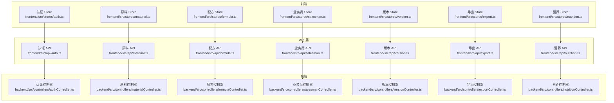
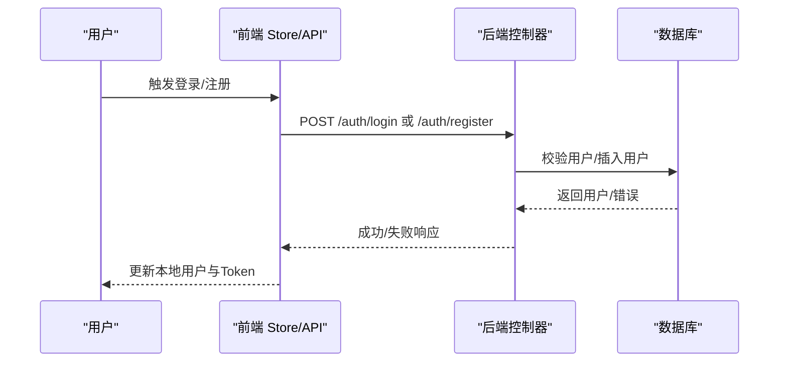
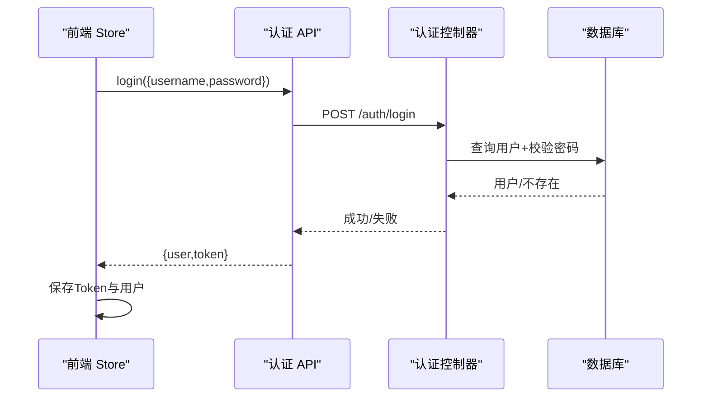
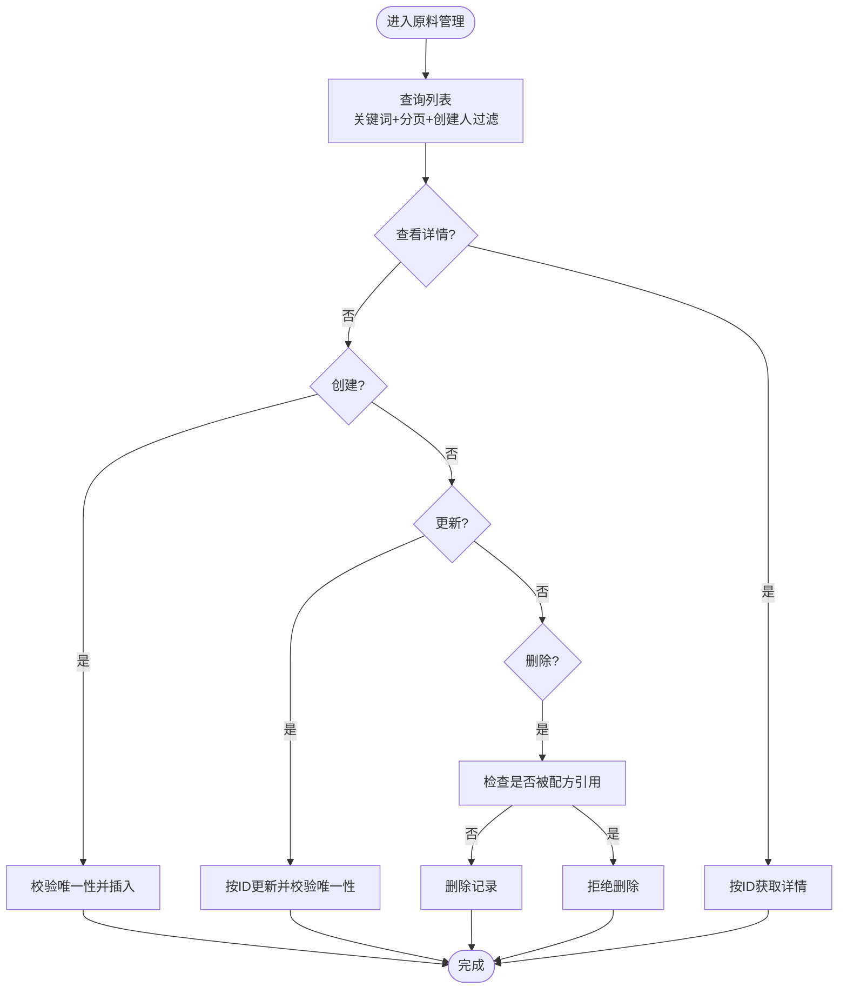
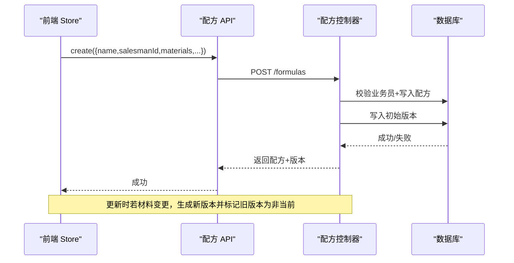
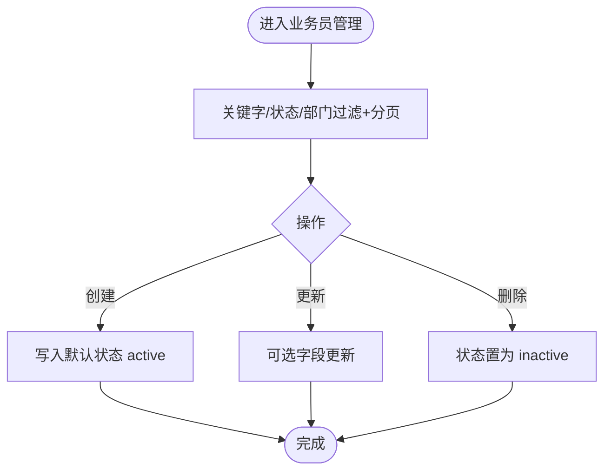
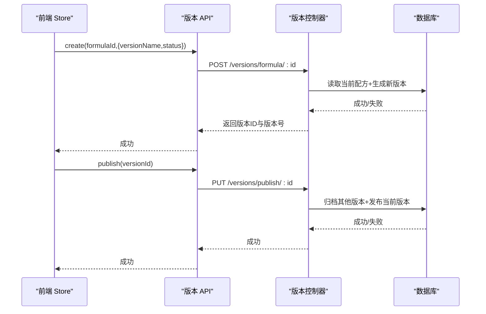
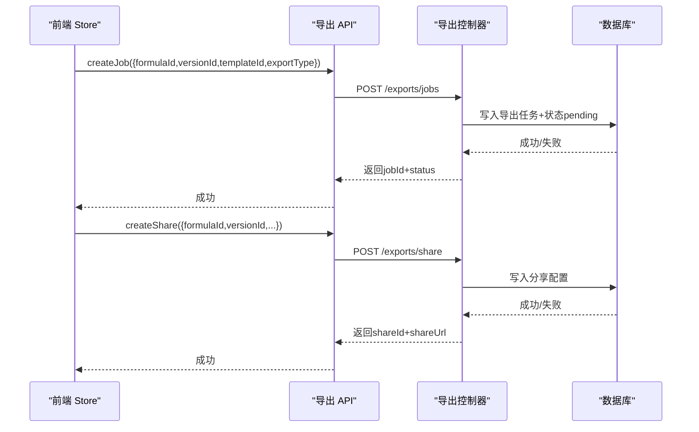
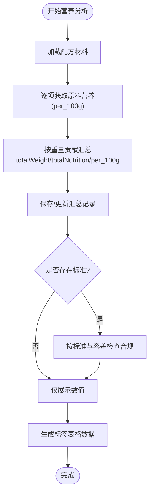
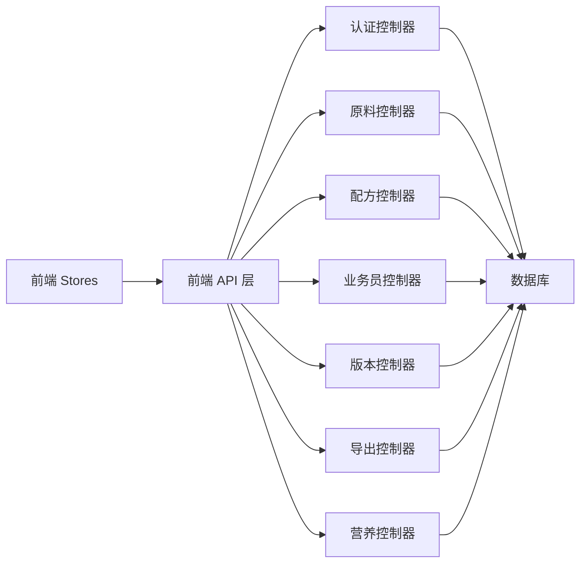

# 核心功能模块

<cite>
**本文引用的文件**
- [backend/src/controllers/authController.ts](file://backend/src/controllers/authController.ts)
- [backend/src/controllers/materialController.ts](file://backend/src/controllers/materialController.ts)
- [backend/src/controllers/formulaController.ts](file://backend/src/controllers/formulaController.ts)
- [backend/src/controllers/salesmanController.ts](file://backend/src/controllers/salesmanController.ts)
- [backend/src/controllers/versionController.ts](file://backend/src/controllers/versionController.ts)
- [backend/src/controllers/exportController.ts](file://backend/src/controllers/exportController.ts)
- [backend/src/controllers/nutritionController.ts](file://backend/src/controllers/nutritionController.ts)
- [frontend/src/stores/auth.ts](file://frontend/src/stores/auth.ts)
- [frontend/src/stores/material.ts](file://frontend/src/stores/material.ts)
- [frontend/src/stores/formula.ts](file://frontend/src/stores/formula.ts)
- [frontend/src/stores/salesman.ts](file://frontend/src/stores/salesman.ts)
- [frontend/src/stores/version.ts](file://frontend/src/stores/version.ts)
- [frontend/src/stores/export.ts](file://frontend/src/stores/export.ts)
- [frontend/src/stores/nutrition.ts](file://frontend/src/stores/nutrition.ts)
- [frontend/src/api/auth.ts](file://frontend/src/api/auth.ts)
- [frontend/src/api/material.ts](file://frontend/src/api/material.ts)
- [frontend/src/api/formula.ts](file://frontend/src/api/formula.ts)
- [frontend/src/api/salesman.ts](file://frontend/src/api/salesman.ts)
- [frontend/src/api/version.ts](file://frontend/src/api/version.ts)
- [frontend/src/api/export.ts](file://frontend/src/api/export.ts)
- [frontend/src/api/nutrition.ts](file://frontend/src/api/nutrition.ts)
</cite>

## 目录
1. [简介](#简介)
2. [项目结构](#项目结构)
3. [核心组件](#核心组件)
4. [架构总览](#架构总览)
5. [详细组件分析](#详细组件分析)
6. [依赖关系分析](#依赖关系分析)
7. [性能考量](#性能考量)
8. [故障排查指南](#故障排查指南)
9. [结论](#结论)
10. [附录](#附录)

## 简介
本文件面向 TingStudio 的核心功能模块，系统梳理认证管理、原料管理、配方管理、业务员管理、版本控制、导出管理、营养分析七大模块。内容涵盖业务逻辑、数据模型、前后端交互、API 设计与状态管理策略，并提供功能演示思路、使用场景与最佳实践，帮助开发者快速理解与扩展系统。

## 项目结构
- 后端采用 Node.js + Express + SQLite，按功能域划分控制器、中间件、路由与工具函数。
- 前端采用 Vue 3 + Pinia，按模块拆分 Store、API 层与视图层，统一通过 HTTP 客户端与后端交互。
- 数据模型围绕用户、原料、配方、业务员、版本、导出任务/模板、分享配置、营养数据等实体展开。

图表来源
- [frontend/src/stores/auth.ts:1-64](file://frontend/src/stores/auth.ts#L1-L64)
- [frontend/src/stores/material.ts:1-130](file://frontend/src/stores/material.ts#L1-L130)
- [frontend/src/stores/formula.ts:1-166](file://frontend/src/stores/formula.ts#L1-L166)
- [frontend/src/stores/salesman.ts:1-121](file://frontend/src/stores/salesman.ts#L1-L121)
- [frontend/src/stores/version.ts:1-83](file://frontend/src/stores/version.ts#L1-L83)
- [frontend/src/stores/export.ts:1-109](file://frontend/src/stores/export.ts#L1-L109)
- [frontend/src/stores/nutrition.ts:1-100](file://frontend/src/stores/nutrition.ts#L1-L100)
- [frontend/src/api/auth.ts:1-36](file://frontend/src/api/auth.ts#L1-L36)
- [frontend/src/api/material.ts:1-41](file://frontend/src/api/material.ts#L1-L41)
- [frontend/src/api/formula.ts:1-54](file://frontend/src/api/formula.ts#L1-L54)
- [frontend/src/api/salesman.ts:1-41](file://frontend/src/api/salesman.ts#L1-L41)
- [frontend/src/api/version.ts:1-35](file://frontend/src/api/version.ts#L1-L35)
- [frontend/src/api/export.ts:1-56](file://frontend/src/api/export.ts#L1-L56)
- [frontend/src/api/nutrition.ts:1-38](file://frontend/src/api/nutrition.ts#L1-L38)
- [backend/src/controllers/authController.ts:1-89](file://backend/src/controllers/authController.ts#L1-L89)
- [backend/src/controllers/materialController.ts:1-129](file://backend/src/controllers/materialController.ts#L1-L129)
- [backend/src/controllers/formulaController.ts:1-268](file://backend/src/controllers/formulaController.ts#L1-L268)
- [backend/src/controllers/salesmanController.ts:1-125](file://backend/src/controllers/salesmanController.ts#L1-L125)
- [backend/src/controllers/versionController.ts:1-256](file://backend/src/controllers/versionController.ts#L1-L256)
- [backend/src/controllers/exportController.ts:1-230](file://backend/src/controllers/exportController.ts#L1-L230)
- [backend/src/controllers/nutritionController.ts:1-538](file://backend/src/controllers/nutritionController.ts#L1-L538)

章节来源
- [frontend/src/stores/auth.ts:1-64](file://frontend/src/stores/auth.ts#L1-L64)
- [frontend/src/stores/material.ts:1-130](file://frontend/src/stores/material.ts#L1-L130)
- [frontend/src/stores/formula.ts:1-166](file://frontend/src/stores/formula.ts#L1-L166)
- [frontend/src/stores/salesman.ts:1-121](file://frontend/src/stores/salesman.ts#L1-L121)
- [frontend/src/stores/version.ts:1-83](file://frontend/src/stores/version.ts#L1-L83)
- [frontend/src/stores/export.ts:1-109](file://frontend/src/stores/export.ts#L1-L109)
- [frontend/src/stores/nutrition.ts:1-100](file://frontend/src/stores/nutrition.ts#L1-L100)
- [frontend/src/api/auth.ts:1-36](file://frontend/src/api/auth.ts#L1-L36)
- [frontend/src/api/material.ts:1-41](file://frontend/src/api/material.ts#L1-L41)
- [frontend/src/api/formula.ts:1-54](file://frontend/src/api/formula.ts#L1-L54)
- [frontend/src/api/salesman.ts:1-41](file://frontend/src/api/salesman.ts#L1-L41)
- [frontend/src/api/version.ts:1-35](file://frontend/src/api/version.ts#L1-L35)
- [frontend/src/api/export.ts:1-56](file://frontend/src/api/export.ts#L1-L56)
- [frontend/src/api/nutrition.ts:1-38](file://frontend/src/api/nutrition.ts#L1-L38)
- [backend/src/controllers/authController.ts:1-89](file://backend/src/controllers/authController.ts#L1-L89)
- [backend/src/controllers/materialController.ts:1-129](file://backend/src/controllers/materialController.ts#L1-L129)
- [backend/src/controllers/formulaController.ts:1-268](file://backend/src/controllers/formulaController.ts#L1-L268)
- [backend/src/controllers/salesmanController.ts:1-125](file://backend/src/controllers/salesmanController.ts#L1-L125)
- [backend/src/controllers/versionController.ts:1-256](file://backend/src/controllers/versionController.ts#L1-L256)
- [backend/src/controllers/exportController.ts:1-230](file://backend/src/controllers/exportController.ts#L1-L230)
- [backend/src/controllers/nutritionController.ts:1-538](file://backend/src/controllers/nutritionController.ts#L1-L538)

## 核心组件
- 认证管理：负责用户注册、登录、令牌签发与当前用户信息获取；前端通过 Store 缓存用户与 Token，API 层封装请求。
- 原料管理：支持原料增删改查、关键字搜索、分页与唯一性约束校验；与配方通过 JSON 存储的原料清单关联。
- 配方管理：配方 CRUD、按业务员过滤、管理员可见范围扩展、自动版本快照与变更记录；提供按原料反查配方能力。
- 业务员管理：业务员增删改查、状态软删除、关键字与状态/部门筛选、唯一性约束。
- 版本控制：配方版本列表、详情、手动快照、发布与归档、版本对比与差异聚合。
- 导出管理：导出模板管理、导出任务创建与状态查询、分享链接创建与访问校验、API 数据接口配置。
- 营养分析：原料营养数据标准化存储、配方营养汇总计算、营养标准与合规检查、标签表格数据生成。

章节来源
- [backend/src/controllers/authController.ts:1-89](file://backend/src/controllers/authController.ts#L1-L89)
- [backend/src/controllers/materialController.ts:1-129](file://backend/src/controllers/materialController.ts#L1-L129)
- [backend/src/controllers/formulaController.ts:1-268](file://backend/src/controllers/formulaController.ts#L1-L268)
- [backend/src/controllers/salesmanController.ts:1-125](file://backend/src/controllers/salesmanController.ts#L1-L125)
- [backend/src/controllers/versionController.ts:1-256](file://backend/src/controllers/versionController.ts#L1-L256)
- [backend/src/controllers/exportController.ts:1-230](file://backend/src/controllers/exportController.ts#L1-L230)
- [backend/src/controllers/nutritionController.ts:1-538](file://backend/src/controllers/nutritionController.ts#L1-L538)
- [frontend/src/stores/auth.ts:1-64](file://frontend/src/stores/auth.ts#L1-L64)
- [frontend/src/stores/material.ts:1-130](file://frontend/src/stores/material.ts#L1-L130)
- [frontend/src/stores/formula.ts:1-166](file://frontend/src/stores/formula.ts#L1-L166)
- [frontend/src/stores/salesman.ts:1-121](file://frontend/src/stores/salesman.ts#L1-L121)
- [frontend/src/stores/version.ts:1-83](file://frontend/src/stores/version.ts#L1-L83)
- [frontend/src/stores/export.ts:1-109](file://frontend/src/stores/export.ts#L1-L109)
- [frontend/src/stores/nutrition.ts:1-100](file://frontend/src/stores/nutrition.ts#L1-L100)

## 架构总览
- 前端通过 API 层发起 HTTP 请求，携带认证 Token；后端控制器接收请求，调用数据库查询与业务逻辑，返回统一结构响应。
- Store 负责状态管理、分页参数、加载态与错误提示；部分 Store 提供解析与格式化逻辑（如配方描述解析、时间戳格式化）。
- 版本控制与导出管理引入异步任务与分享机制，前端通过轮询或一次性获取结果完成用户体验闭环。

图表来源
- [frontend/src/api/auth.ts:1-36](file://frontend/src/api/auth.ts#L1-L36)
- [backend/src/controllers/authController.ts:1-89](file://backend/src/controllers/authController.ts#L1-L89)
- [frontend/src/stores/auth.ts:1-64](file://frontend/src/stores/auth.ts#L1-L64)

## 详细组件分析

### 认证管理
- 业务逻辑
  - 注册：校验用户名唯一，哈希密码，写入用户表并生成初始角色，签发 Token 返回。
  - 登录：按用户名查询用户，bcrypt 校验密码，签发 Token 返回。
  - 当前用户：按用户 ID 查询并返回基础信息。
- 前后端交互
  - 前端 Store 调用 API，保存 Token 与用户信息到本地存储；后续请求由 HTTP 层注入 Token。
- 状态管理
  - Store 维护用户、加载态与鉴权状态；初始化时读取缓存用户。

图表来源
- [frontend/src/stores/auth.ts:1-64](file://frontend/src/stores/auth.ts#L1-L64)
- [frontend/src/api/auth.ts:1-36](file://frontend/src/api/auth.ts#L1-L36)
- [backend/src/controllers/authController.ts:1-89](file://backend/src/controllers/authController.ts#L1-L89)

章节来源
- [backend/src/controllers/authController.ts:1-89](file://backend/src/controllers/authController.ts#L1-L89)
- [frontend/src/stores/auth.ts:1-64](file://frontend/src/stores/auth.ts#L1-L64)
- [frontend/src/api/auth.ts:1-36](file://frontend/src/api/auth.ts#L1-L36)

### 原料管理
- 业务逻辑
  - 列表：支持关键字（名称/编码）与分页；按创建人过滤。
  - 单条：按 ID 查询，不存在返回错误。
  - 创建：必填名称/编码，单位默认 g，库存默认 0；唯一性冲突返回 409。
  - 更新：按 ID 更新名称/编码/单位/库存；唯一性冲突返回 409。
  - 删除：若被配方 JSON 引用则拒绝删除。
- 前后端交互
  - Store 负责分页参数与关键词，API 封装 GET/POST/PUT/DELETE。
- 状态管理
  - Store 维护列表、总数、关键词、页码与加载态；提供“全部原料”下拉数据预取。

图表来源
- [backend/src/controllers/materialController.ts:1-129](file://backend/src/controllers/materialController.ts#L1-L129)
- [frontend/src/stores/material.ts:1-130](file://frontend/src/stores/material.ts#L1-L130)
- [frontend/src/api/material.ts:1-41](file://frontend/src/api/material.ts#L1-L41)

章节来源
- [backend/src/controllers/materialController.ts:1-129](file://backend/src/controllers/materialController.ts#L1-L129)
- [frontend/src/stores/material.ts:1-130](file://frontend/src/stores/material.ts#L1-L130)
- [frontend/src/api/material.ts:1-41](file://frontend/src/api/material.ts#L1-L41)

### 配方管理
- 业务逻辑
  - 列表：管理员可见全部，普通用户仅见本人；支持关键字与业务员过滤；分页。
  - 单条：按 ID 查询。
  - 创建：校验业务员存在，补全原料名称，写入配方与初始版本。
  - 更新：若材料变更，生成新版本并标记旧版本为非当前；自动版本号递增。
  - 删除：直接删除。
  - 按原料反查：在配方 JSON 中模糊匹配原料 ID。
- 前后端交互
  - Store 解析 materialsJson 与描述字段，格式化时间；API 提供 CRUD 与按原料查询。
- 状态管理
  - Store 维护列表、总数、关键词、业务员筛选与页码；提供解析辅助方法。

图表来源
- [frontend/src/stores/formula.ts:1-166](file://frontend/src/stores/formula.ts#L1-L166)
- [frontend/src/api/formula.ts:1-54](file://frontend/src/api/formula.ts#L1-L54)
- [backend/src/controllers/formulaController.ts:1-268](file://backend/src/controllers/formulaController.ts#L1-L268)

章节来源
- [backend/src/controllers/formulaController.ts:1-268](file://backend/src/controllers/formulaController.ts#L1-L268)
- [frontend/src/stores/formula.ts:1-166](file://frontend/src/stores/formula.ts#L1-L166)
- [frontend/src/api/formula.ts:1-54](file://frontend/src/api/formula.ts#L1-L54)

### 业务员管理
- 业务逻辑
  - 列表：支持关键字、状态、部门过滤与分页。
  - 单条：按 ID 查询。
  - 创建：写入基础信息，默认状态 active。
  - 更新：可选字段更新；未传入状态则保持不变。
  - 删除：软删除，将状态置为 inactive。
- 前后端交互
  - API 提供 GET/POST/PUT/DELETE；Store 管理分页与筛选。
- 状态管理
  - Store 维护列表、总数、关键词、状态筛选与页码。

图表来源
- [backend/src/controllers/salesmanController.ts:1-125](file://backend/src/controllers/salesmanController.ts#L1-L125)
- [frontend/src/stores/salesman.ts:1-121](file://frontend/src/stores/salesman.ts#L1-L121)
- [frontend/src/api/salesman.ts:1-41](file://frontend/src/api/salesman.ts#L1-L41)

章节来源
- [backend/src/controllers/salesmanController.ts:1-125](file://backend/src/controllers/salesmanController.ts#L1-L125)
- [frontend/src/stores/salesman.ts:1-121](file://frontend/src/stores/salesman.ts#L1-L121)
- [frontend/src/api/salesman.ts:1-41](file://frontend/src/api/salesman.ts#L1-L41)

### 版本控制
- 业务逻辑
  - 列表：按配方 ID 查询，可按状态过滤。
  - 详情：按版本 ID 查询，解析 changes 与 snapshot。
  - 创建：基于当前配方生成新版本，旧当前版本降级为非当前，版本号递增。
  - 发布：将同一配方其他版本归档，当前版本发布。
  - 对比：解析两个版本快照，对比业务员、描述与原料变更，输出差异与统计。
- 前后端交互
  - API 提供列表、详情、创建、发布、对比；Store 管理版本列表、当前版本与对比结果。
- 状态管理
  - Store 维护版本列表、加载态与对比结果。

图表来源
- [frontend/src/stores/version.ts:1-83](file://frontend/src/stores/version.ts#L1-L83)
- [frontend/src/api/version.ts:1-35](file://frontend/src/api/version.ts#L1-L35)
- [backend/src/controllers/versionController.ts:1-256](file://backend/src/controllers/versionController.ts#L1-L256)

章节来源
- [backend/src/controllers/versionController.ts:1-256](file://backend/src/controllers/versionController.ts#L1-L256)
- [frontend/src/stores/version.ts:1-83](file://frontend/src/stores/version.ts#L1-L83)
- [frontend/src/api/version.ts:1-35](file://frontend/src/api/version.ts#L1-L35)

### 导出管理
- 业务逻辑
  - 模板：支持按类型过滤、默认模板唯一性维护、创建与查询。
  - 任务：创建导出任务，状态 pending；支持按状态与分页查询；按 ID 获取任务详情。
  - 分享：创建分享配置（类型、密码、过期时间、允许邮箱、下载次数），访问时校验过期与下载次数并更新计数。
  - API 接口：创建/查询外部数据接口配置。
- 前后端交互
  - API 提供模板、任务、分享、接口管理；Store 管理模板列表、任务列表与分页。
- 状态管理
  - Store 维护模板、任务、分页与加载态。

图表来源
- [frontend/src/stores/export.ts:1-109](file://frontend/src/stores/export.ts#L1-L109)
- [frontend/src/api/export.ts:1-56](file://frontend/src/api/export.ts#L1-L56)
- [backend/src/controllers/exportController.ts:1-230](file://backend/src/controllers/exportController.ts#L1-L230)

章节来源
- [backend/src/controllers/exportController.ts:1-230](file://backend/src/controllers/exportController.ts#L1-L230)
- [frontend/src/stores/export.ts:1-109](file://frontend/src/stores/export.ts#L1-L109)
- [frontend/src/api/export.ts:1-56](file://frontend/src/api/export.ts#L1-L56)

### 营养分析
- 业务逻辑
  - 原料营养：标准化 per_100g 键名，支持设置/更新数据版本号；提供 per100g 与原始 JSON 的转换。
  - 配方计算：按配方材料逐项贡献，汇总 totalWeight、totalNutrition、per_100g；保存至汇总表。
  - 标准与合规：支持营养标准配置（目标值、容差范围、强制字段）；对配方进行合规检查并生成报告。
  - 标签表格：生成符合 XLS 格式的营养成分表与技术处理依据行。
- 前后端交互
  - API 提供原料营养、配方计算、标准、合规、表格数据；Store 管理材料/配方/合规结果。
- 状态管理
  - Store 维护加载态与结果缓存。

图表来源
- [backend/src/controllers/nutritionController.ts:1-538](file://backend/src/controllers/nutritionController.ts#L1-L538)
- [frontend/src/stores/nutrition.ts:1-100](file://frontend/src/stores/nutrition.ts#L1-L100)
- [frontend/src/api/nutrition.ts:1-38](file://frontend/src/api/nutrition.ts#L1-L38)

章节来源
- [backend/src/controllers/nutritionController.ts:1-538](file://backend/src/controllers/nutritionController.ts#L1-L538)
- [frontend/src/stores/nutrition.ts:1-100](file://frontend/src/stores/nutrition.ts#L1-L100)
- [frontend/src/api/nutrition.ts:1-38](file://frontend/src/api/nutrition.ts#L1-L38)

## 依赖关系分析
- 控制器依赖数据库查询与通用工具函数，统一返回成功/失败结构。
- Store 依赖 API 层，API 层依赖 HTTP 客户端；认证 Store 在登录后持久化 Token。
- 配方与版本紧密耦合：更新配方会触发版本生成；版本发布影响当前版本状态。
- 营养分析依赖配方与原料营养数据；合规检查依赖营养标准配置。

图表来源
- [backend/src/controllers/authController.ts:1-89](file://backend/src/controllers/authController.ts#L1-L89)
- [backend/src/controllers/materialController.ts:1-129](file://backend/src/controllers/materialController.ts#L1-L129)
- [backend/src/controllers/formulaController.ts:1-268](file://backend/src/controllers/formulaController.ts#L1-L268)
- [backend/src/controllers/salesmanController.ts:1-125](file://backend/src/controllers/salesmanController.ts#L1-L125)
- [backend/src/controllers/versionController.ts:1-256](file://backend/src/controllers/versionController.ts#L1-L256)
- [backend/src/controllers/exportController.ts:1-230](file://backend/src/controllers/exportController.ts#L1-L230)
- [backend/src/controllers/nutritionController.ts:1-538](file://backend/src/controllers/nutritionController.ts#L1-L538)
- [frontend/src/stores/auth.ts:1-64](file://frontend/src/stores/auth.ts#L1-L64)
- [frontend/src/stores/material.ts:1-130](file://frontend/src/stores/material.ts#L1-L130)
- [frontend/src/stores/formula.ts:1-166](file://frontend/src/stores/formula.ts#L1-L166)
- [frontend/src/stores/salesman.ts:1-121](file://frontend/src/stores/salesman.ts#L1-L121)
- [frontend/src/stores/version.ts:1-83](file://frontend/src/stores/version.ts#L1-L83)
- [frontend/src/stores/export.ts:1-109](file://frontend/src/stores/export.ts#L1-L109)
- [frontend/src/stores/nutrition.ts:1-100](file://frontend/src/stores/nutrition.ts#L1-L100)

章节来源
- [backend/src/controllers/authController.ts:1-89](file://backend/src/controllers/authController.ts#L1-L89)
- [backend/src/controllers/materialController.ts:1-129](file://backend/src/controllers/materialController.ts#L1-L129)
- [backend/src/controllers/formulaController.ts:1-268](file://backend/src/controllers/formulaController.ts#L1-L268)
- [backend/src/controllers/salesmanController.ts:1-125](file://backend/src/controllers/salesmanController.ts#L1-L125)
- [backend/src/controllers/versionController.ts:1-256](file://backend/src/controllers/versionController.ts#L1-L256)
- [backend/src/controllers/exportController.ts:1-230](file://backend/src/controllers/exportController.ts#L1-L230)
- [backend/src/controllers/nutritionController.ts:1-538](file://backend/src/controllers/nutritionController.ts#L1-L538)
- [frontend/src/stores/auth.ts:1-64](file://frontend/src/stores/auth.ts#L1-L64)
- [frontend/src/stores/material.ts:1-130](file://frontend/src/stores/material.ts#L1-L130)
- [frontend/src/stores/formula.ts:1-166](file://frontend/src/stores/formula.ts#L1-L166)
- [frontend/src/stores/salesman.ts:1-121](file://frontend/src/stores/salesman.ts#L1-L121)
- [frontend/src/stores/version.ts:1-83](file://frontend/src/stores/version.ts#L1-L83)
- [frontend/src/stores/export.ts:1-109](file://frontend/src/stores/export.ts#L1-L109)
- [frontend/src/stores/nutrition.ts:1-100](file://frontend/src/stores/nutrition.ts#L1-L100)

## 性能考量
- 分页与过滤：列表接口统一支持分页与多维过滤，避免一次性加载大量数据。
- JSON 存储：配方与版本快照采用 JSON 存储，便于灵活扩展但需注意查询性能；建议在高频查询字段上建立索引或冗余字段。
- 缓存与去抖：前端 Store 已内置关键词与分页参数缓存；可结合路由参数与本地缓存减少重复请求。
- 导出任务：导出任务异步执行，前端通过轮询或一次性获取结果，避免阻塞 UI。
- 营养计算：按配方材料逐项计算，复杂度与材料数量线性相关；建议对常用配方结果做缓存。

## 故障排查指南
- 认证失败
  - 检查用户名/密码是否正确；确认 Token 是否正确注入请求头。
  - 查看后端控制器返回的错误消息与状态码。
- 原料/业务员唯一性冲突
  - 出现 409 时检查编码/工号是否重复；更新时避免与现有记录冲突。
- 配方删除被拒
  - 若提示被配方使用，先移除相关配方中的该原料或调整配方。
- 版本发布异常
  - 确认目标版本存在且属于同一配方；检查归档与发布状态更新是否成功。
- 导出任务状态异常
  - 检查任务创建是否成功；核对模板与版本参数；关注状态字段变化。
- 营养计算缺失
  - 确保配方材料均有对应原料营养数据；检查 per_100g 键名标准化是否正确。

章节来源
- [backend/src/controllers/authController.ts:1-89](file://backend/src/controllers/authController.ts#L1-L89)
- [backend/src/controllers/materialController.ts:1-129](file://backend/src/controllers/materialController.ts#L1-L129)
- [backend/src/controllers/formulaController.ts:1-268](file://backend/src/controllers/formulaController.ts#L1-L268)
- [backend/src/controllers/versionController.ts:1-256](file://backend/src/controllers/versionController.ts#L1-L256)
- [backend/src/controllers/exportController.ts:1-230](file://backend/src/controllers/exportController.ts#L1-L230)
- [backend/src/controllers/nutritionController.ts:1-538](file://backend/src/controllers/nutritionController.ts#L1-L538)

## 结论
TingStudio 的核心模块围绕“数据驱动 + 版本治理 + 营养合规”的主线构建，前后端职责清晰、状态管理完善。通过统一的 API 设计与 Store 管理，实现了良好的可扩展性与可维护性。建议在生产环境中进一步完善索引、缓存与异步任务监控，持续优化用户体验与系统稳定性。

## 附录
- 使用场景与最佳实践
  - 认证：统一使用 Token 策略，避免明文传输；前端持久化用户信息与 Token，确保刷新后仍可恢复。
  - 原料：建立编码规范与唯一性约束；定期清理无用量原料。
  - 配方：变更即生成版本，保留历史快照；发布前进行合规检查。
  - 业务员：统一状态管理与权限划分；定期清理停用人员。
  - 导出：模板默认化与分类管理；分享链接设置有效期与下载限制。
  - 营养：标准化键名与单位；定期更新标准与数据源；对关键配方进行合规复核。