# 版本控制系统

<cite>
**本文档引用的文件**
- [versionController.ts](file://backend/src/controllers/versionController.ts)
- [versions.ts](file://backend/src/routes/versions.ts)
- [helpers.ts](file://backend/src/utils/helpers.ts)
- [DATABASE_DOC.md](file://backend/DATABASE_DOC.md)
- [init.sql](file://backend/src/scripts/init.sql)
- [VersionList.vue](file://frontend/src/views/versions/VersionList.vue)
- [VersionCompare.vue](file://frontend/src/views/versions/VersionCompare.vue)
- [version.ts](file://frontend/src/stores/version.ts)
- [version.ts](file://frontend/src/api/version.ts)
- [index.ts](file://frontend/src/router/index.ts)
- [API_DOC.md](file://backend/API_DOC.md)
</cite>

## 更新摘要

**变更内容**

- 优化版本对比功能，增加全字段变更记录检测
- 增强发布流程，实现版本数据与配方数据的同步
- 改进对比页面的用户界面和交互体验
- 修复版本管理状态逻辑，确保数据一致性
- 扩展版本快照包含完整配方数据结构
- **v2.17.0 版本管理 UI 全面重构**：VersionList.vue 和 VersionCompare.vue 采用 header + main 双区域布局，完全还原 version-management.html / version-compare.html 设计规范；支持最多 3 个版本多维对比、基准卡片对比逻辑（pin 按钮设为基准）、占位卡片内联版本选择、4 种差异高亮类型（added/removed/changed/missing）、发布流程 popconfirm 简化、版本快照 Dialog 可拖拽 + 背景虚化

## 目录

1. [简介](#简介)
2. [项目结构](#项目结构)
3. [核心组件](#核心组件)
4. [架构概览](#架构概览)
5. [详细组件分析](#详细组件分析)
6. [依赖关系分析](#依赖关系分析)
7. [性能考虑](#性能考虑)
8. [故障排除指南](#故障排除指南)
9. [最佳实践](#最佳实践)
10. [扩展开发指导](#扩展开发指导)
11. [结论](#结论)

## 简介

TingStudio 的版本控制系统是一个完整的配方版本管理解决方案，支持版本创建、历史记录管理、版本对比和发布流程。系统采用前后端分离架构，后端使用 Node.js + Express + SQLite，前端使用 Vue 3 + TypeScript + TDesign 组件库。

该系统的核心目标是：

- 提供完整的配方版本生命周期管理
- 支持版本号自动生成和版本状态跟踪
- 实现精确的版本对比功能，包含全字段变更检测
- 确保数据一致性和可追溯性
- 提供友好的用户界面和操作体验

## 项目结构

版本控制系统在项目中的组织结构如下：

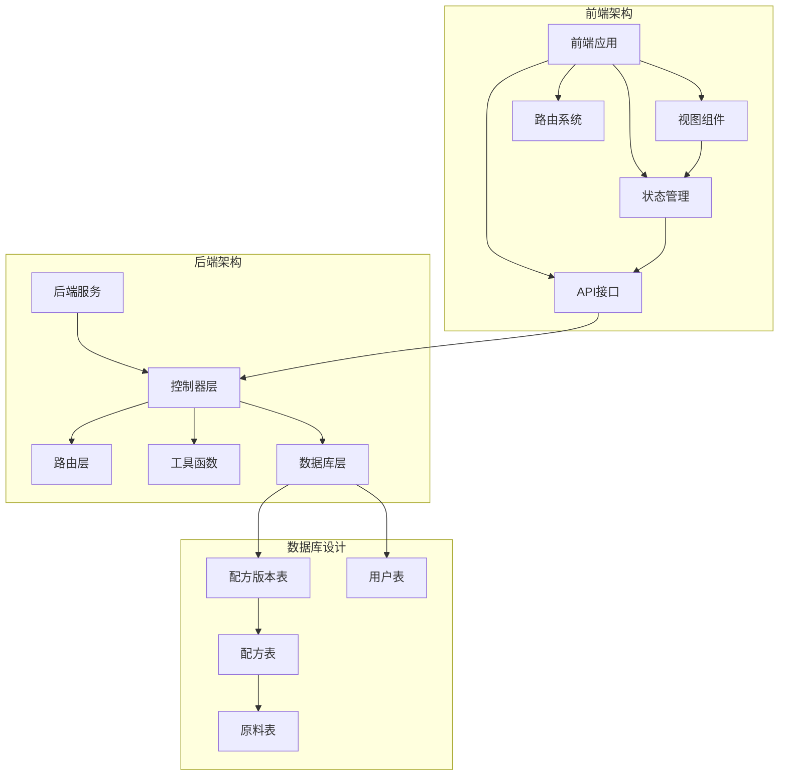

**图表来源**

- [versionController.ts:1-375](file://backend/src/controllers/versionController.ts#L1-L375)
- [versions.ts:1-17](file://backend/src/routes/versions.ts#L1-L17)
- [VersionList.vue:1-173](file://frontend/src/views/versions/VersionList.vue#L1-L173)
- [version.ts:1-88](file://frontend/src/stores/version.ts#L1-L88)

**章节来源**

- [versionController.ts:1-375](file://backend/src/controllers/versionController.ts#L1-L375)
- [versions.ts:1-17](file://backend/src/routes/versions.ts#L1-L17)
- [DATABASE_DOC.md:125-172](file://backend/DATABASE_DOC.md#L125-L172)

## 核心组件

### 数据模型设计

版本控制系统的核心数据模型基于 SQLite 数据库，主要包含以下关键表结构：

#### 配方版本表 (formula_versions)

- **version_id**: 主键，版本唯一标识
- **formula_id**: 外键，关联配方表
- **version_number**: 版本号，采用语义化版本格式 (vX.Y)
- **version_name**: 版本名称，可选描述
- **version_reason**: 升版原因，说明版本变更背景
- **changes_json**: 变更记录的 JSON 序列化，包含字段级变更详情
- **snapshot_json**: 版本快照的 JSON 序列化，包含完整配方数据
- **status**: 版本状态 (draft/published/archived)
- **is_current**: 当前版本标记 (1/0)
- **ratio_factor**: 主料含量比系数，默认 0.18
- **supplement_ratio_factor**: 辅料含量比系数，默认 1.0
- **created_by**: 创建人
- **created_at**: 创建时间

#### 配方表 (formulas)

- **id**: 主键，配方唯一标识
- **name**: 配方名称
- **salesman_id**: 业务员关联
- **salesman_name**: 业务员名称冗余
- **materials_json**: 原料列表 JSON
- **finished_weight**: 成品重量
- **ratio_factor**: 主料含量比系数
- **supplement_ratio_factor**: 辅料含量比系数
- **description**: 配方描述
- **created_by**: 创建人
- **created_at**: 创建时间

**章节来源**

- [DATABASE_DOC.md:125-172](file://backend/DATABASE_DOC.md#L125-L172)
- [init.sql:76-91](file://backend/src/scripts/init.sql#L76-L91)

### 版本状态管理

系统实现了完整的版本状态生命周期管理，包含数据一致性修复机制：

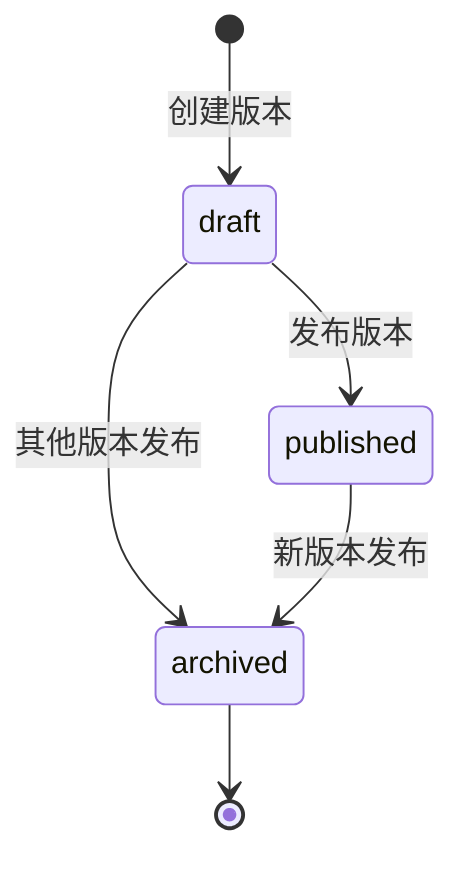

**更新** 修复了版本状态逻辑，确保每个配方最多只有一个当前版本和一个已发布版本

**图表来源**

- [versionController.ts:12-43](file://backend/src/controllers/versionController.ts#L12-L43)

### 版本号生成策略

版本号采用语义化版本控制，系统自动处理版本号递增：

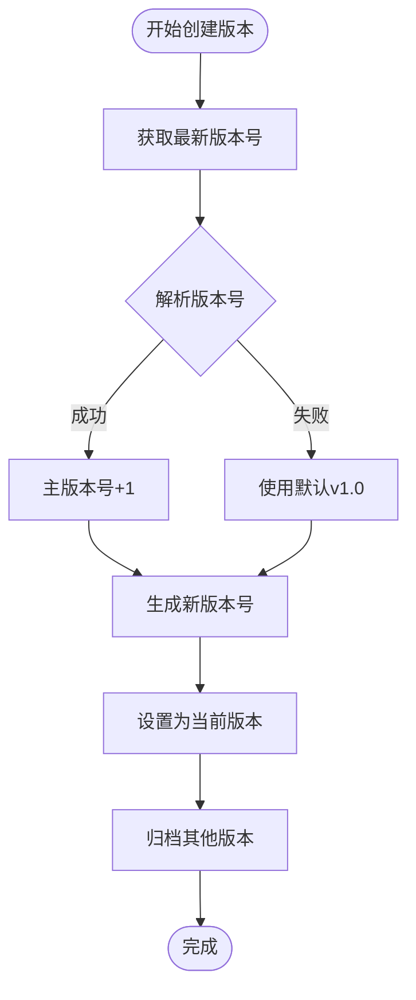

**图表来源**

- [versionController.ts:112-144](file://backend/src/controllers/versionController.ts#L112-L144)

**章节来源**

- [versionController.ts:112-144](file://backend/src/controllers/versionController.ts#L112-L144)

## 架构概览

版本控制系统采用分层架构设计，确保关注点分离和代码可维护性：

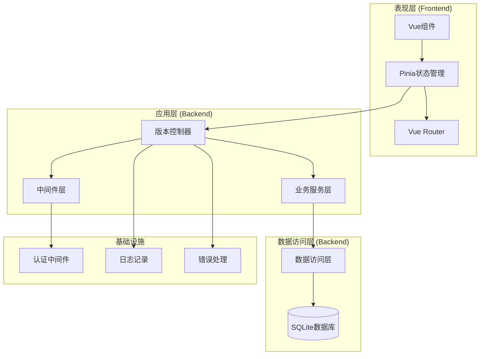

**图表来源**

- [versionController.ts:1-375](file://backend/src/controllers/versionController.ts#L1-L375)
- [versions.ts:1-17](file://backend/src/routes/versions.ts#L1-L17)
- [version.ts:1-88](file://frontend/src/stores/version.ts#L1-L88)

### API 设计规范

系统遵循 RESTful API 设计原则，提供标准化的版本管理接口：

| HTTP方法 | 路径                           | 功能             | 认证要求 |
| -------- | ------------------------------ | ---------------- | -------- |
| GET      | `/versions/formula/:formulaId` | 获取配方版本列表 | 是       |
| GET      | `/versions/detail/:versionId`  | 获取版本详情     | 是       |
| POST     | `/versions/formula/:formulaId` | 创建新版本       | 是       |
| PUT      | `/versions/publish/:versionId` | 发布版本         | 是       |
| GET      | `/versions/compare/:formulaId` | 版本对比         | 是       |

**章节来源**

- [API_DOC.md:366-466](file://backend/API_DOC.md#L366-L466)
- [versions.ts:12-16](file://backend/src/routes/versions.ts#L12-L16)

## 详细组件分析

### 后端控制器实现

#### 版本控制器架构

版本控制器采用单一职责原则，每个控制器方法专注于特定的业务功能：

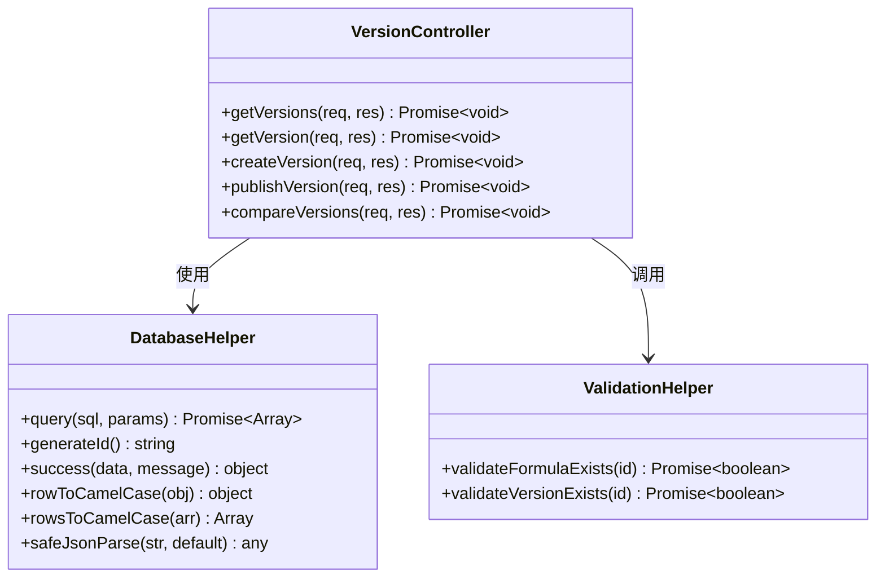

**图表来源**

- [versionController.ts:6-375](file://backend/src/controllers/versionController.ts#L6-L375)
- [helpers.ts:1-86](file://backend/src/utils/helpers.ts#L1-L86)

#### 版本创建逻辑

版本创建过程包含多个安全检查和数据一致性保证：

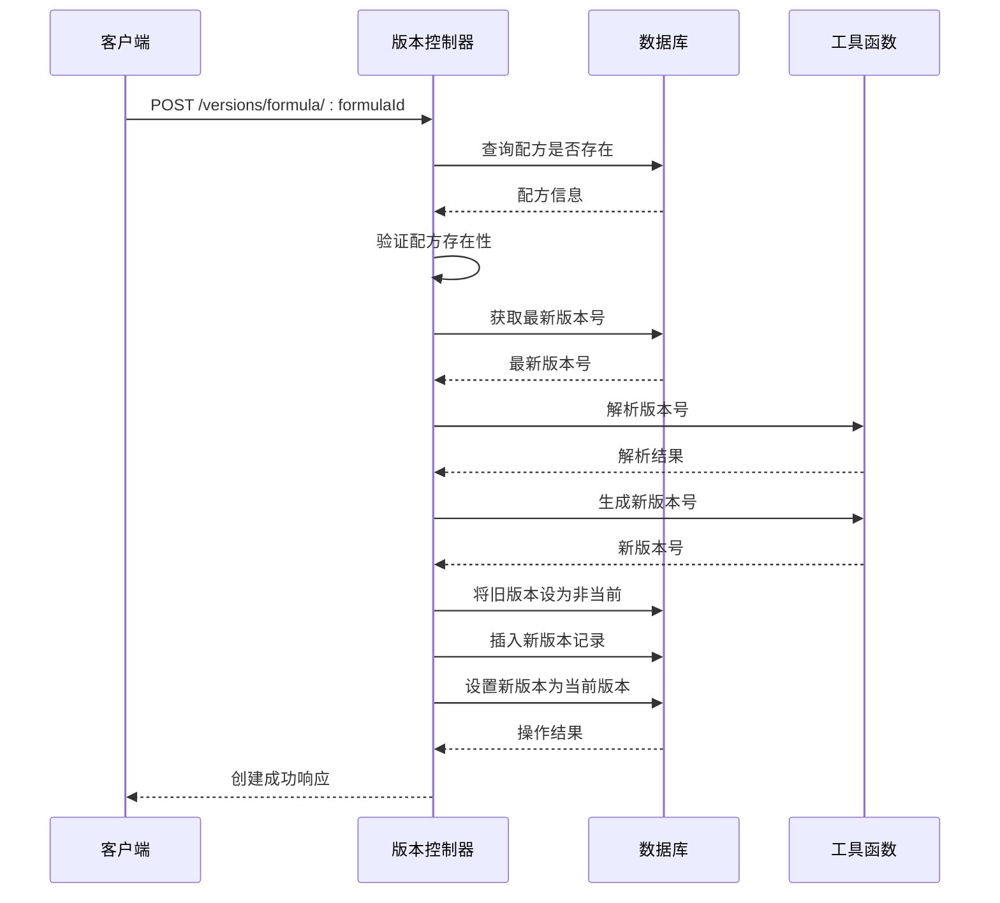

**图表来源**

- [versionController.ts:94-150](file://backend/src/controllers/versionController.ts#L94-L150)

**章节来源**

- [versionController.ts:94-150](file://backend/src/controllers/versionController.ts#L94-L150)

#### 版本发布流程

**更新** 版本发布机制现在包含配方数据同步功能，确保版本数据与配方数据保持一致：

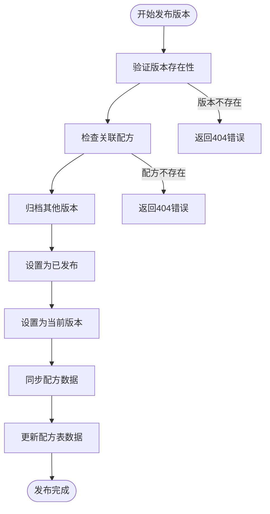

**图表来源**

- [versionController.ts:152-217](file://backend/src/controllers/versionController.ts#L152-L217)

**章节来源**

- [versionController.ts:152-217](file://backend/src/controllers/versionController.ts#L152-L217)

#### 版本对比算法

**更新** 版本对比功能现在支持全字段变更记录检测，包括配方参数、业务员信息、原料列表等：

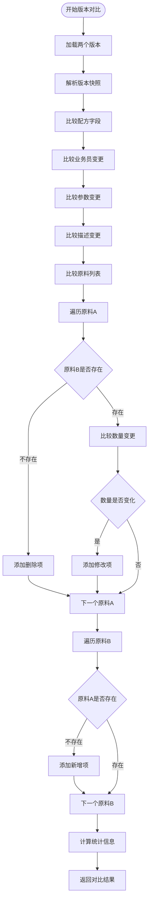

**图表来源**

- [versionController.ts:219-375](file://backend/src/controllers/versionController.ts#L219-L375)

**章节来源**

- [versionController.ts:219-375](file://backend/src/controllers/versionController.ts#L219-L375)

### 前端组件实现

#### 版本列表组件 (VersionList.vue)

**v2.17.0 重构**：采用 `header + main` 双区域布局，完全还原 `version-management.html` 设计规范。

**Header 区域**：

- 左侧：返回按钮（arrow-left 图标，rounded-xl，slate→emerald hover）+ 面包屑导航（配方管理 > 版本管理）+ 标题「版本控制中心」
- 右侧：状态筛选 RadioGroup（emerald 主题，选中态淡绿底）+ 创建版本按钮（emerald 绿色）+ 进入对比按钮（书本图标）
- 背景：`rgba(255,255,255,0.8)` + `backdrop-filter: blur(10px)` + sticky 定位

**Main 区域**：

- 版本列表表格（TDesign t-table），列顺序：选择对比 → 版本号 → 版本名称 → 升版原因 → 状态 → 创建日期 → 操作
- 表头样式：`bg-slate-50/50` 半透明 + `text-slate-400 uppercase tracking-widest`
- 状态 Tag：草稿(amber) / 已发布(emerald) / 已归档(slate)，`white-space: nowrap`
- 创建日期：年月日在上、时分秒在下双行格式
- 行悬浮：`hover:bg-slate-50/50` 半透明效果
- **对比选择上限扩展**：支持最多选择 3 个版本进行多维对比（原 2 个），通过 `localStorage('compare_versions')` 持久化选中的版本 ID
- **发布流程简化**：发布操作采用 `<t-popconfirm>` 二次确认弹窗，确认后直接执行发布，不再弹出中间 dialog

**版本快照 Dialog**：

- 完全参照 `version-management.html#L147-180` 设计规范重新实现
- Dialog 属性：`:footer="false"` 取消底部按钮 + `:draggable="true"` 可拖拽 + `:show-close-button="false"` 隐藏默认关闭按钮 + `:close-on-overlay-click="true"` 点击遮罩关闭
- 尺寸规格：宽度 672px（max-w-2xl）+ 圆角 2.5rem（40px）+ shadow-2xl 阴影 + overflow-hidden
- 定位：`margin-top: 8vh` 靠上显示
- 遮罩层：`backdrop-filter: blur(8px)` + `rgba(15,23,42,0.4)` 深色半透明虚化背景
- 自定义 Header：标题「版本快照详情」+ 副标题「配方数据备份记录」+ 圆形 X 关闭按钮（w-10 h-10 rounded-full hover:bg-slate-100 text-slate-400 transition-colors）
- Body 区域：max-height 70vh 可滚动，包含版本号/发布状态 info-grid（gap-6 / p-4 bg-slate-50 rounded-2xl）+ 原料组成快照列表

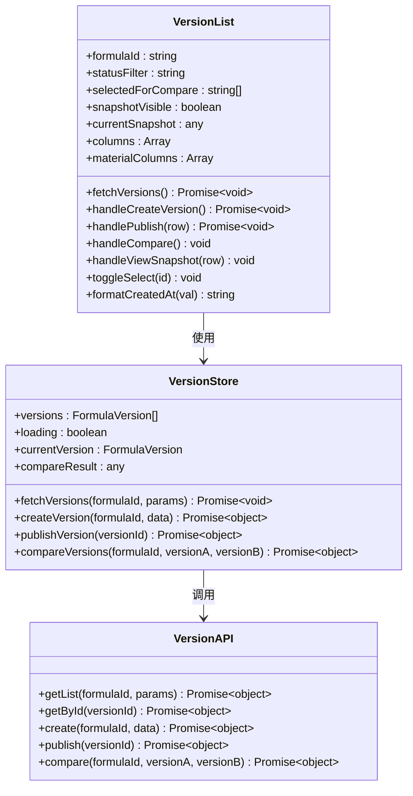

**图表来源**

- [VersionList.vue:1-80](frontend/src/views/versions/VersionList.vue#L1-L80)
- [version.ts:6-88](frontend/src/stores/version.ts#L6-L88)
- [version.ts:18-34](frontend/src/api/version.ts#L18-L34)

#### 版本对比组件 (VersionCompare.vue)

**v2.17.0 重构**：同样采用 `header + main` 双区域布局，还原 `version-compare.html` 设计规范。

**Header 区域**：
- 左侧：返回按钮 + 面包屑（版本管理 > 版本差异对比）+ 标题「版本多维对比视图」
- 右侧：当前对比版本数计数器（emerald 加粗）+ 重置对比按钮（rose 色，TDesign Dialog 弹窗）

**Main 区域**：
- **空状态**：大图标(view-module) + 提示文字 + 返回选择按钮(emerald 主题)
- **占位卡片内联版本选择**：
  - 移除 popover 触发的下拉框方案，改为在占位卡片内部直接展示可选版本列表
  - 用户点击即可选中版本，占位卡片实时切换为该版本的完整对比卡片
  - 样式与正式对比卡片 (`compare-card`) 完全一致
- **基准卡片对比逻辑**：
  - 以第一个卡片为基准进行差异比对（非两两交叉对比）
  - 非基准卡片顶部新增「设为基准」pin 按钮（pin 图标），点击后将该卡片移至第一位作为新基准
  - 基准有、当前无的原料项：红色虚线框空出（`diff-missing`），进度条归零，名称删除线
  - 当前多出（基准无）的原料项：绿色高亮（`diff-added`），追加到原料列表末尾保持对齐
  - 数量变更项：琥珀色高亮（`diff-changed`）
- **对比卡片网格**：横向滚动 flex 布局，每张卡片独立 slideIn 动画
  - 卡片头部：版本号 pill（emerald 底，基准卡带「· 基准」标识）+ pin 按钮 + 删除按钮(delete 图标) + 版本名称 + 日期/作者元信息
  - 原料构成区域：从 `snapshot.materials` 读取数据，展示原料名称 + 百分比 + emerald 进度条
  - 差异高亮四种类型：新增(green/diff-added)、删除(red strikethrough/diff-removed)、修改(amber/diff-changed)、缺失(red dashed/diff-missing)
  - 版本摘要区域：斜体文字 + emerald 半透明背景 + 根据 status 动态文本
- **弹窗交互**：重置对比使用 TDesign `<t-dialog>` 组件声明式弹窗

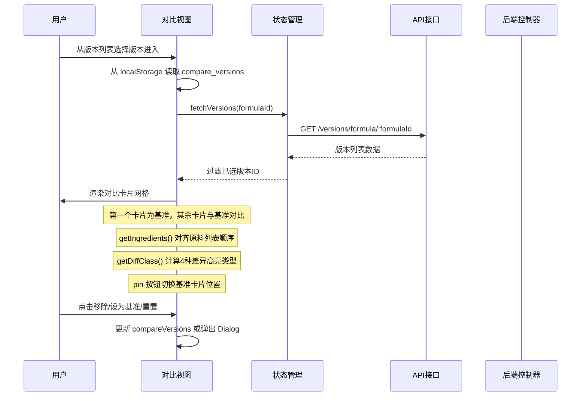

**图表来源**

- [VersionCompare.vue:1-80](frontend/src/views/versions/VersionCompare.vue#L1-L80)
- [version.ts:61-88](frontend/src/stores/version.ts#L61-L88)

**章节来源**

- [VersionList.vue](frontend/src/views/versions/VersionList.vue)
- [VersionCompare.vue](frontend/src/views/versions/VersionCompare.vue)
- [version.ts](frontend/src/stores/version.ts)

### 状态管理模式

版本状态管理采用 Pinia 状态管理库，实现了响应式的数据流：

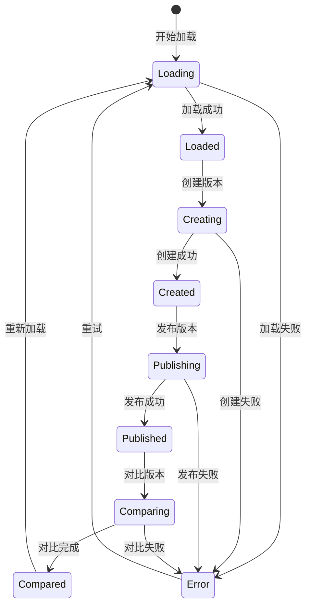

**图表来源**

- [version.ts:12-88](file://frontend/src/stores/version.ts#L12-L88)

**章节来源**

- [version.ts:1-88](file://frontend/src/stores/version.ts#L1-L88)

## 依赖关系分析

### 技术栈依赖

版本控制系统的技术栈依赖关系如下：

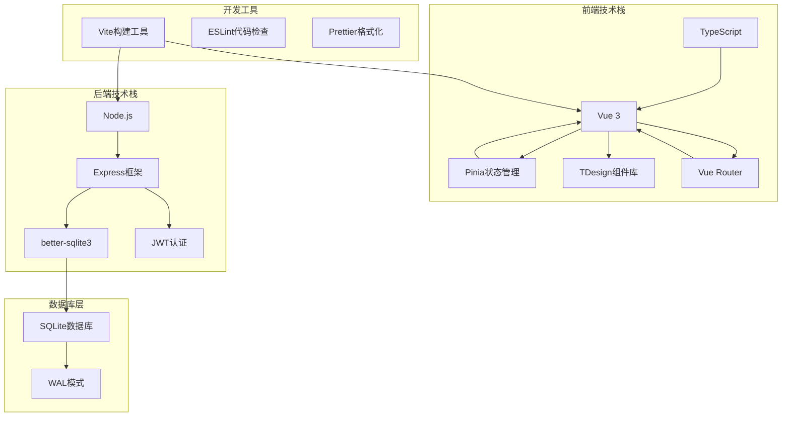

**图表来源**

- [package.json](file://frontend/package.json)
- [package.json](file://backend/package.json)

### 外部依赖关系

系统对外部依赖的管理：

| 依赖包           | 版本    | 用途             | 安全性    |
| ---------------- | ------- | ---------------- | --------- |
| express          | ^4.18.0 | Web服务器框架    | ✅ 已更新 |
| better-sqlite3   | ^8.0.0  | SQLite数据库驱动 | ✅ 已更新 |
| vue              | ^3.2.0  | 前端框架         | ✅ 已更新 |
| tdesign-vue-next | ^0.30.0 | UI组件库         | ✅ 已更新 |
| pinia            | ^2.0.0  | 状态管理         | ✅ 已更新 |

**章节来源**

- [package.json](file://backend/package.json)
- [package.json](file://frontend/package.json)

## 性能考虑

### 数据库性能优化

#### 索引策略

系统为关键查询字段建立了适当的索引：

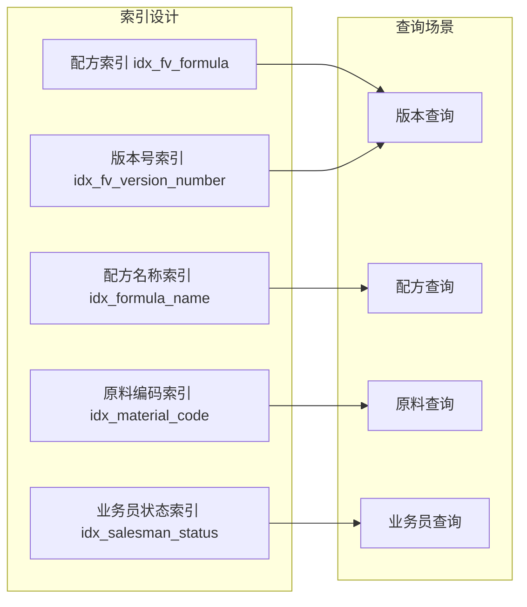

**图表来源**

- [init.sql:90-91](file://backend/src/scripts/init.sql#L90-L91)
- [init.sql:47-49](file://backend/src/scripts/init.sql#L47-L49)
- [init.sql:30-31](file://backend/src/scripts/init.sql#L30-L31)
- [init.sql:68-70](file://backend/src/scripts/init.sql#L68-L70)

#### 查询优化策略

1. **延迟加载**: 版本详情采用按需加载，避免不必要的数据传输
2. **分页查询**: 支持大列表的分页显示，限制每次查询的数据量
3. **条件过滤**: 支持按状态、时间范围等条件过滤版本数据
4. **缓存策略**: 前端对常用查询结果进行缓存

### 前端性能优化

#### 组件懒加载

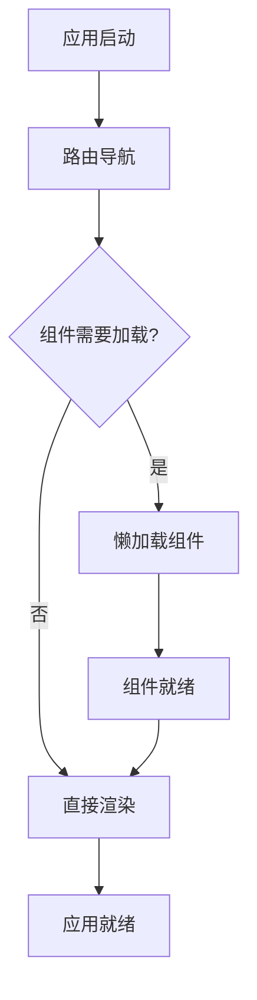

**图表来源**

- [index.ts:1-165](file://frontend/src/router/index.ts#L1-L165)

#### 内存管理

1. **组件卸载**: 自动清理事件监听器和定时器
2. **状态清理**: 在路由切换时清理不需要的状态数据
3. **图片优化**: 使用适当的图片格式和尺寸
4. **虚拟滚动**: 对于大量数据使用虚拟滚动技术

## 故障排除指南

### 常见问题及解决方案

#### 版本创建失败

**问题症状**: 创建版本时返回错误信息

**可能原因**:

1. 配方不存在或已被删除
2. 数据库连接异常
3. 权限不足
4. 版本号生成冲突

**解决步骤**:

1. 验证配方ID的有效性
2. 检查数据库连接状态
3. 确认用户权限
4. 查看服务器日志

#### 版本发布异常

**问题症状**: 发布版本时出现状态不一致

**可能原因**:

1. 并发发布操作
2. 数据库事务失败
3. 外键约束冲突
4. 配方数据同步失败

**解决步骤**:

1. 检查并发控制机制
2. 验证数据库事务完整性
3. 确认外键关系正确
4. 检查配方数据同步状态

#### 版本对比错误

**问题症状**: 版本对比功能返回空结果或错误

**可能原因**:

1. 版本数据损坏
2. JSON解析失败
3. 内存溢出
4. 字段结构不匹配

**解决步骤**:

1. 验证版本数据完整性
2. 检查JSON格式正确性
3. 优化内存使用
4. 检查字段结构兼容性

**章节来源**

- [versionController.ts:32-34](file://backend/src/controllers/versionController.ts#L32-L34)
- [versionController.ts:108-110](file://backend/src/controllers/versionController.ts#L108-L110)
- [versionController.ts:153-156](file://backend/src/controllers/versionController.ts#L153-L156)

### 日志记录和监控

系统实现了完善的日志记录机制：

```mermaid
graph TB
subgraph "日志级别"
Debug[调试日志]
Info[信息日志]
Warn[警告日志]
Error[错误日志]
end
subgraph "日志内容"
Request[请求日志]
Response[响应日志]
ErrorLog[错误日志]
Performance[性能日志]
end
subgraph "监控指标"
ResponseTime[响应时间]
ErrorRate[错误率]
Throughput[吞吐量]
MemoryUsage[内存使用]
end
Debug --> Request
Info --> Response
Warn --> ErrorLog
Error --> ErrorLog
Request --> Performance
Response --> Performance
ErrorLog --> Performance
```

**章节来源**

- [helpers.ts:26-29](file://backend/src/utils/helpers.ts#L26-L29)

## 最佳实践

### 版本管理最佳实践

#### 版本创建策略

1. **定期创建版本**: 建议在重要里程碑时创建版本
2. **有意义的版本名称**: 使用描述性的版本名称便于识别
3. **状态管理**: 正确使用草稿、发布、归档状态
4. **变更记录**: 保持详细的变更记录便于追溯

#### 版本发布流程

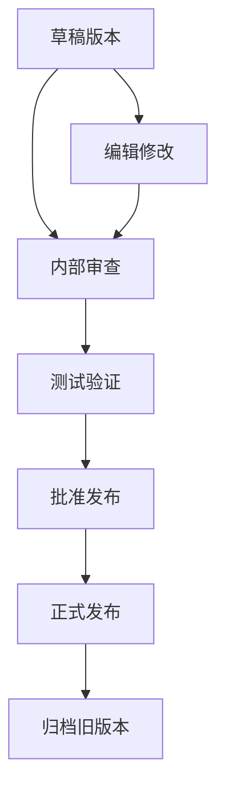

#### 版本对比使用建议

1. **选择合适的对比范围**: 通常对比相邻版本
2. **关注关键变更**: 重点关注配方名称、描述、原料列表
3. **定期进行对比**: 建议在发布前进行版本对比
4. **保存对比结果**: 将重要的对比结果存档

### 数据安全最佳实践

#### 数据备份策略

1. **定期备份**: 建议每日备份数据库文件
2. **多地点存储**: 将备份文件存储在不同位置
3. **版本保留**: 保留一定数量的历史备份
4. **恢复测试**: 定期测试备份文件的可恢复性

#### 权限管理

1. **最小权限原则**: 用户只授予必要的操作权限
2. **角色分离**: 不同角色有不同的操作范围
3. **审计日志**: 记录所有重要操作
4. **定期审查**: 定期审查用户权限设置

### 性能优化建议

#### 数据库优化

1. **索引优化**: 为常用查询字段建立索引
2. **查询优化**: 避免N+1查询问题
3. **连接池**: 使用连接池管理数据库连接
4. **缓存策略**: 实施适当的缓存策略

#### 前端优化

1. **组件优化**: 使用Vue的性能优化特性
2. **懒加载**: 实现组件和路由的懒加载
3. **资源压缩**: 压缩CSS和JavaScript文件
4. **CDN加速**: 使用CDN加速静态资源

## 扩展开发指导

### 功能扩展方向

#### 版本回滚功能

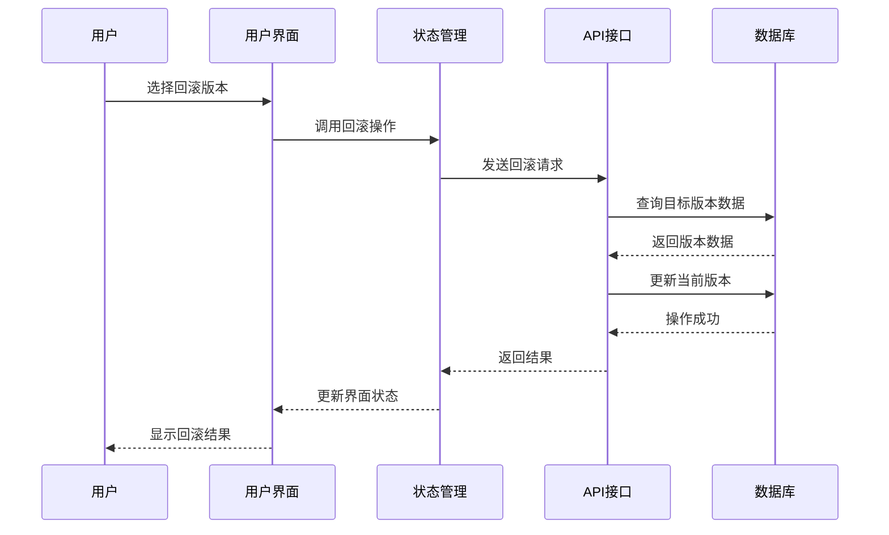

#### 版本标签功能

1. **标签创建**: 允许为重要版本添加标签
2. **标签管理**: 提供标签的增删改查功能
3. **标签筛选**: 支持按标签筛选版本
4. **标签通知**: 当标签版本更新时发送通知

#### 版本合并功能

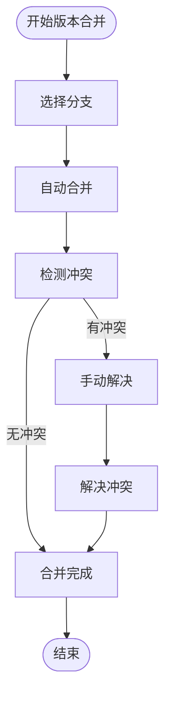

### API 扩展建议

#### 版本历史API

```typescript
// 获取版本历史详情
GET /api/versions/history/:versionId

// 获取版本变更日志
GET /api/versions/:versionId/changes

// 导出版本数据
GET /api/versions/:versionId/export
```

#### 批量操作API

```typescript
// 批量发布版本
POST / api / versions / batch - publish;

// 批量删除版本
DELETE / api / versions / batch -
  delete (
    // 批量归档版本
    PUT
  ) /
    api /
    versions /
    batch -
  archive;
```

### 数据模型扩展

#### 版本标签表

```sql
CREATE TABLE version_tags (
    tag_id TEXT PRIMARY KEY,
    version_id TEXT NOT NULL,
    tag_name TEXT NOT NULL,
    tag_color TEXT,
    created_by TEXT NOT NULL,
    created_at TEXT NOT NULL DEFAULT (datetime('now')),
    FOREIGN KEY (version_id) REFERENCES formula_versions(version_id) ON DELETE CASCADE
);
```

#### 版本评论表

```sql
CREATE TABLE version_comments (
    comment_id TEXT PRIMARY KEY,
    version_id TEXT NOT NULL,
    user_id TEXT NOT NULL,
    content TEXT NOT NULL,
    created_at TEXT NOT NULL DEFAULT (datetime('now')),
    updated_at TEXT NOT NULL DEFAULT (datetime('now')),
    FOREIGN KEY (version_id) REFERENCES formula_versions(version_id) ON DELETE CASCADE,
    FOREIGN KEY (user_id) REFERENCES users(id) ON DELETE CASCADE
);
```

### 前端组件扩展

#### 版本树形视图

```vue
<template>
  <div class="version-tree">
    <t-tree :data="treeData" :expand-all="true" />
  </div>
</template>
```

#### 版本时间轴

```vue
<template>
  <div class="version-timeline">
    <t-timeline>
      <t-timeline-item
        v-for="version in versions"
        :key="version.versionId"
        :title="version.versionName"
        :content="version.createdAt" />
    </t-timeline>
  </div>
</template>
```

## 结论

TingStudio 的版本控制系统是一个设计合理、实现完善的配方版本管理解决方案。系统采用了现代化的技术栈和架构模式，确保了良好的可维护性和扩展性。

### 主要优势

1. **完整的功能覆盖**: 从版本创建到发布、对比的全流程支持
2. **数据一致性保证**: 通过数据库约束和业务逻辑确保数据完整性
3. **用户体验优秀**: 前端界面友好，操作流程清晰
4. **性能优化到位**: 采用多种优化策略提升系统性能
5. **安全性可靠**: 实现了完善的认证授权和数据保护

### 技术亮点

1. **分层架构设计**: 清晰的职责分离和良好的可维护性
2. **响应式状态管理**: 使用Pinia实现高效的状态管理
3. **类型安全**: TypeScript提供编译时类型检查
4. **组件化开发**: Vue组件实现高复用性和可测试性
5. **RESTful API**: 标准化的接口设计便于集成

### 发展前景

随着业务需求的增长和技术的发展，版本控制系统还有很大的扩展空间：

1. **AI辅助版本管理**: 利用机器学习进行智能版本推荐
2. **实时协作**: 支持多人实时协作编辑和版本管理
3. **云原生部署**: 支持容器化和微服务架构
4. **国际化支持**: 多语言界面和本地化功能
5. **移动端适配**: 移动端应用和响应式设计

该系统为配方管理提供了坚实的技术基础，能够满足当前和未来的各种业务需求。
