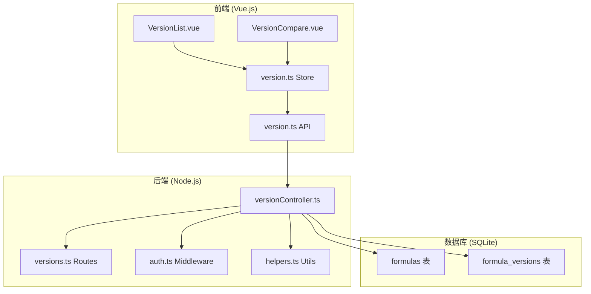
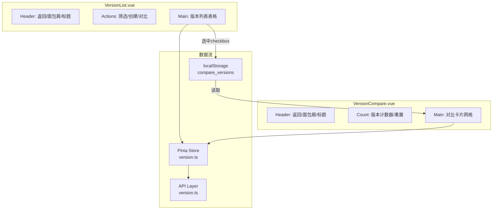
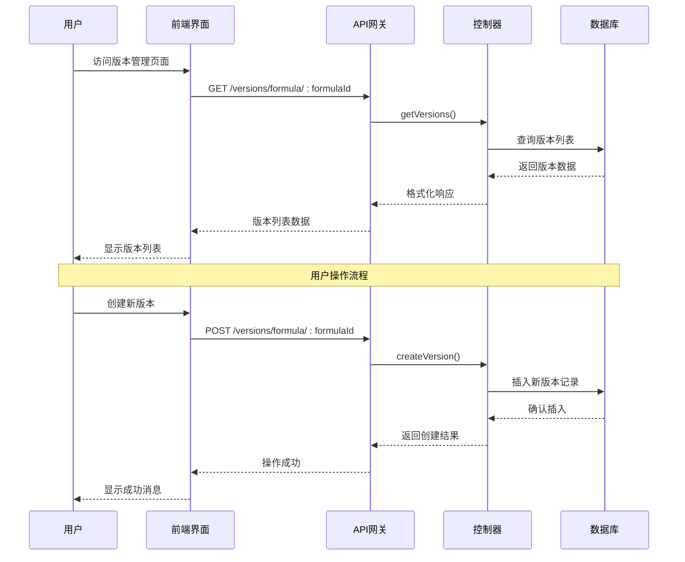
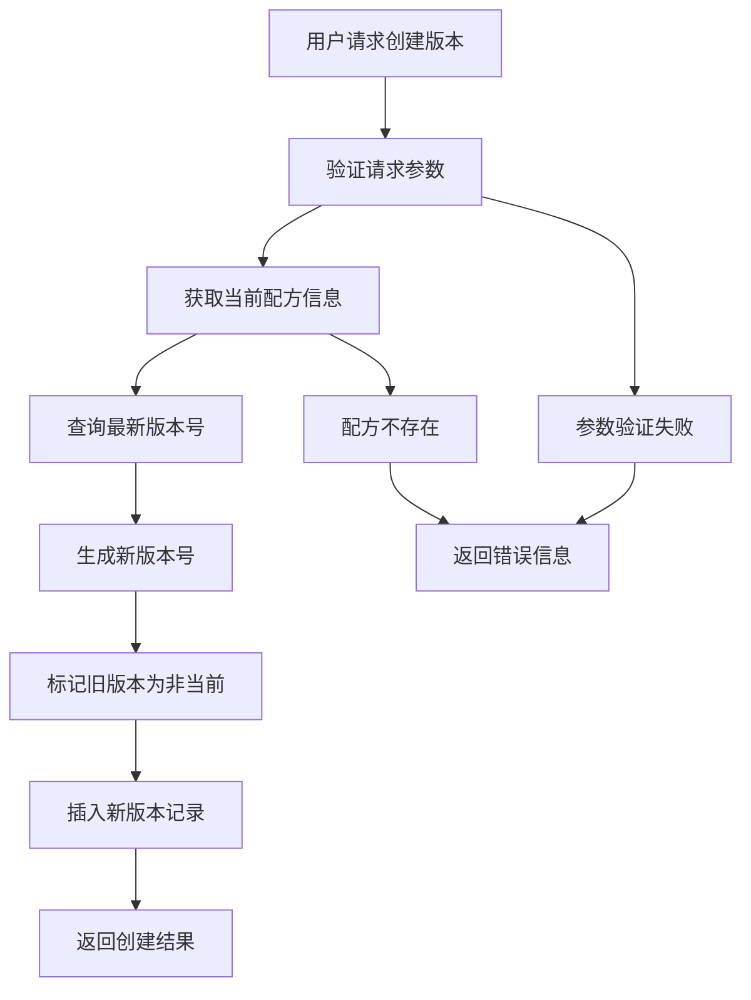
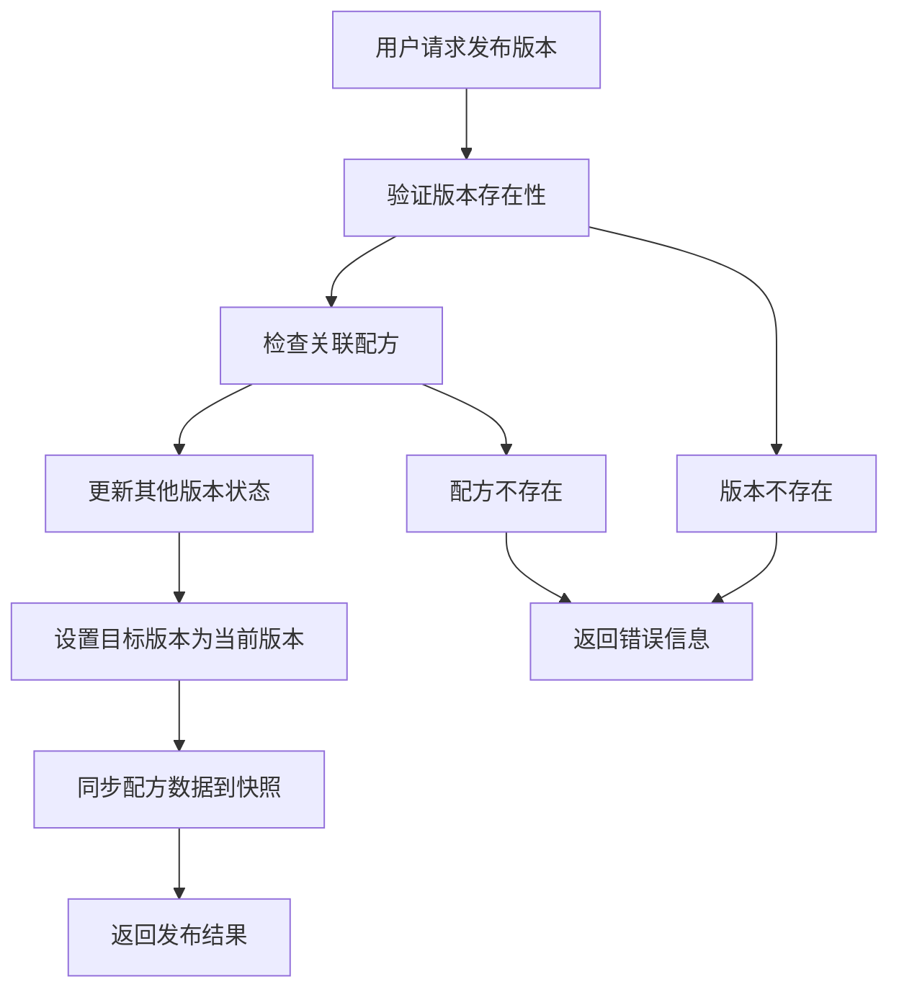
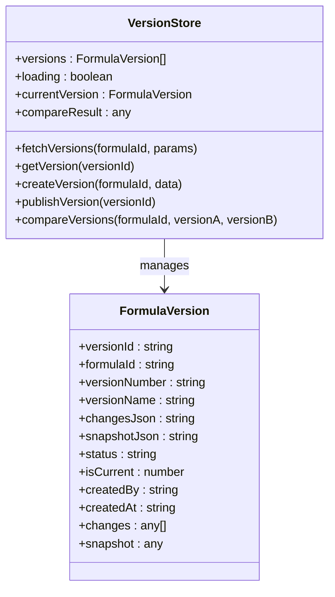
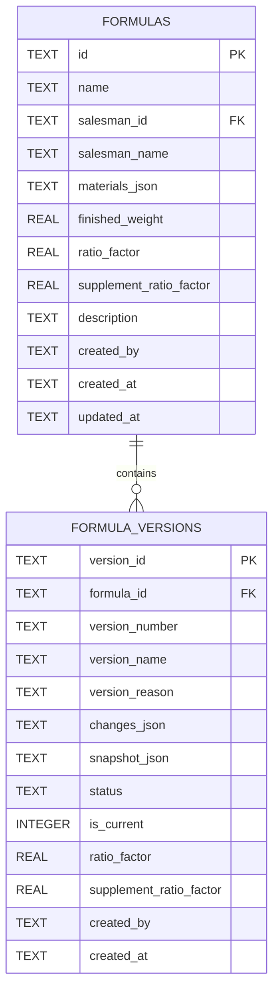
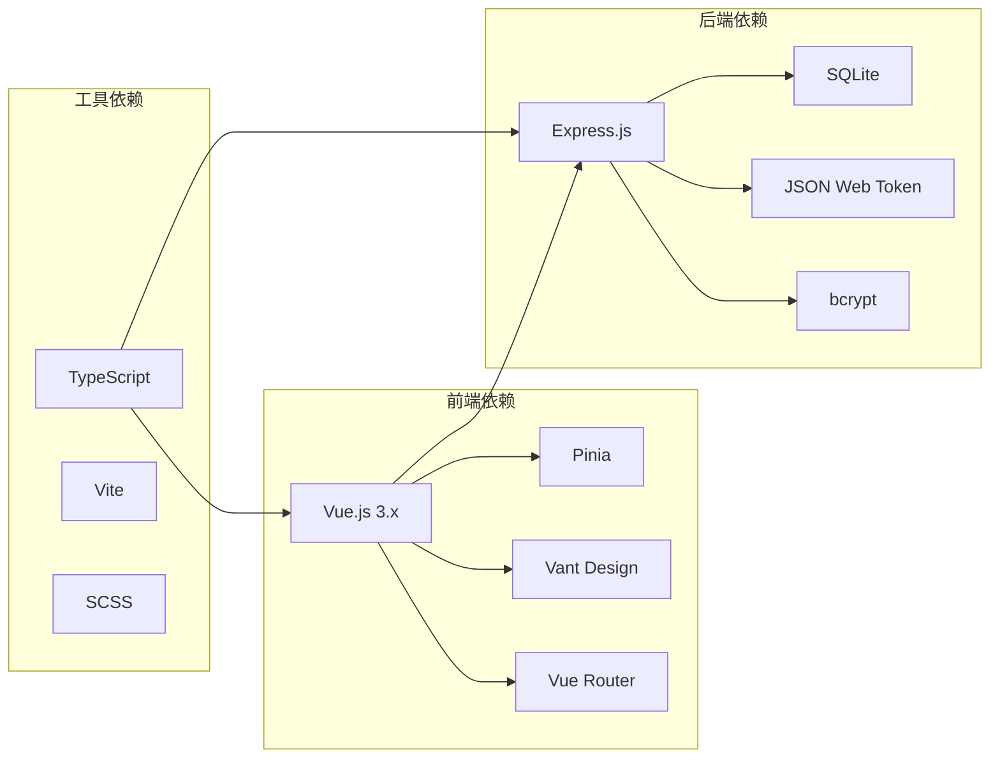

# 版本控制系统增强

<cite>
**本文档引用的文件**
- [backend/src/controllers/versionController.ts](file://backend/src/controllers/versionController.ts)
- [backend/src/routes/versions.ts](file://backend/src/routes/versions.ts)
- [backend/src/utils/helpers.ts](file://backend/src/utils/helpers.ts)
- [backend/src/middleware/auth.ts](file://backend/src/middleware/auth.ts)
- [backend/DATABASE_DOC.md](file://backend/DATABASE_DOC.md)
- [backend/API_DOC.md](file://backend/API_DOC.md)
- [backend/src/scripts/init.sql](file://backend/src/scripts/init.sql)
- [frontend/src/views/versions/VersionList.vue](file://frontend/src/views/versions/VersionList.vue)
- [frontend/src/views/versions/VersionCompare.vue](file://frontend/src/views/versions/VersionCompare.vue)
- [frontend/src/stores/version.ts](file://frontend/src/stores/version.ts)
- [frontend/src/api/version.ts](file://frontend/src/api/version.ts)
- [frontend/src/router/index.ts](file://frontend/src/router/index.ts)
</cite>

## 目录

1. [简介](#简介)
2. [项目结构](#项目结构)
3. [核心组件](#核心组件)
4. [架构概览](#架构概览)
5. [详细组件分析](#详细组件分析)
6. [依赖关系分析](#依赖关系分析)
7. [性能考虑](#性能考虑)
8. [故障排除指南](#故障排除指南)
9. [结论](#结论)

## 简介

TingStudio 版本控制系统是一个完整的配方版本管理解决方案，基于 SQLite 数据库存储，采用前后端分离架构。该系统提供了配方版本的创建、发布、对比和管理功能，支持草稿、已发布和已归档三种状态管理。

**v2.17.0 UI 重构亮点**：

- VersionList.vue 和 VersionCompare.vue 统一采用 `header + main` 双区域布局
- 完全还原 version-management.html / version-compare.html 设计规范（emerald 绿色主题）
- 版本列表表格支持状态筛选、自定义 checkbox 对比选择（最多 3 个）、差异高亮对比卡片
- 基准卡片对比逻辑：以第一个卡片为基准，pin 按钮切换基准位置，4 种差异高亮类型
- 占位卡片内联版本选择：移除 popover 方案，直接在占位卡片内展示可选版本列表
- 发布流程简化：popconfirm 二次确认后直接执行，不再弹出中间 dialog
- 版本快照 Dialog 可拖拽 + 背景虚化 + 自定义关闭按钮
- 跨页面数据传递通过 localStorage 持久化实现
- TDesign Dialog/Popconfirm 替代浏览器原生弹窗

系统的核心特性包括：

- 实时版本对比功能，支持字段级别的变更追踪
- 自动化的版本号生成和版本状态管理
- 完整的变更历史记录和快照机制
- 基于角色的访问控制和权限管理
- 用户友好的前端界面和响应式设计

## 项目结构

项目采用典型的前后端分离架构，后端使用 Node.js + Express，前端使用 Vue.js + TypeScript。

**图表来源**

- [frontend/src/views/versions/VersionList.vue:1-298](file://frontend/src/views/versions/VersionList.vue#L1-L298)
- [frontend/src/views/versions/VersionCompare.vue:1-165](file://frontend/src/views/versions/VersionCompare.vue#L1-L165)
- [backend/src/controllers/versionController.ts:1-340](file://backend/src/controllers/versionController.ts#L1-L340)
- [backend/src/routes/versions.ts:1-17](file://backend/src/routes/versions.ts#L1-L17)

**章节来源**

- [backend/src/controllers/versionController.ts:1-340](file://backend/src/controllers/versionController.ts#L1-L340)
- [frontend/src/views/versions/VersionList.vue:1-298](file://frontend/src/views/versions/VersionList.vue#L1-L298)

## 核心组件

### 后端控制器层

版本控制器是系统的核心业务逻辑层，负责处理所有版本相关的请求：

- **版本列表获取**：支持按状态过滤的版本查询
- **版本详情获取**：提供单个版本的完整信息
- **版本创建**：手动创建新版本并生成版本号
- **版本发布**：将指定版本设为当前版本并同步配方数据
- **版本对比**：比较两个版本之间的差异

### 前端视图层

**v2.17.0 重构**：前端两个核心页面统一采用 `header + main` 双区域布局，参照 FormulaDetail.vue 结构。

**VersionList.vue（版本管理页）**：

- **Header**：返回按钮 + 面包屑导航 + 标题「版本控制中心」+ 状态筛选 RadioGroup + 创建/对比按钮
- **Main**：TDesign 表格组件，7 列布局（选择对比、版本号、版本名称、升版原因、状态、创建日期、操作）
  - 状态 Tag 精确还原设计稿颜色（amber/emerald/slate）
  - 创建日期双行格式（年月日 / 时分秒）
  - 自定义 checkbox 支持多选对比（最多 3 个）
  - 选中的版本 ID 通过 `localStorage('compare_versions')` 持久化
  - 发布操作采用 `<t-popconfirm>` 二次确认弹窗，确认后直接执行发布
- **版本快照 Dialog**：
  - 完全参照 `version-management.html#L147-180` 设计规范
  - `:footer="false"` + `:draggable="true"` + `:show-close-button="false"` + `:close-on-overlay-click="true"`
  - 宽度 672px + 圆角 2.5rem + shadow-2xl + `margin-top: 8vh`
  - 遮罩层 `backdrop-filter: blur(8px)` + `rgba(15,23,42,0.4)` 虚化背景
  - 自定义圆形 X 关闭按钮（w-10 h-10 rounded-full hover:bg-slate-100）
  - Body 区域 max-height 70vh 可滚动，info-grid + 原料快照列表

**VersionCompare.vue（版本对比页）**：

- **Header**：返回按钮 + 面包屑导航 + 标题「版本多维对比视图」+ 版本计数器 + 重置按钮
- **Main**：
  - 空状态提示（无选中版本时显示，含返回按钮）
  - **占位卡片内联版本选择**：移除 popover 方案，占位卡片内直接展示可选版本列表，点击选中实时切换
  - 对比卡片网格（横向滚动 flex 布局，每张卡片独立 slideIn 动画）
    - 卡片头部：版本号 pill（基准卡带「· 基准」标识）+ pin 设为基准按钮 + 删除按钮 + 版本名称 + 日期作者
    - **基准卡片对比逻辑**：以第一个卡片为基准进行差异比对
      - 非 pin 按钮：点击将当前卡片移至第一位作为新基准
      - 基准有、当前无的原料项：红色虚线框空出（`diff-missing`），进度条归零
      - 当前多出（基准无）的原料项：绿色高亮（`diff-added`），追加到末尾对齐
    - 差异高亮四种类型：diff-added(绿)/diff-changed(琥珀色)/diff-removed(红删除线)/diff-missing(红虚线框)
    - 数据源从 `snapshot.materials` 读取
  - 重置弹窗使用 TDesign `<t-dialog>` 组件

**图表来源**

- [frontend/src/views/versions/VersionList.vue](frontend/src/views/versions/VersionList.vue)
- [frontend/src/views/versions/VersionCompare.vue](frontend/src/views/versions/VersionCompare.vue)

### 数据存储层

系统使用 SQLite 作为数据存储，包含两个核心表：

- **formulas 表**：存储配方的基本信息和当前状态
- **formula_versions 表**：存储版本历史和快照数据

**章节来源**

- [backend/src/controllers/versionController.ts:6-340](file://backend/src/controllers/versionController.ts#L6-L340)
- [backend/DATABASE_DOC.md:127-177](file://backend/DATABASE_DOC.md#L127-L177)

## 架构概览

系统采用分层架构设计，确保了良好的可维护性和扩展性。

**图表来源**

- [backend/src/controllers/versionController.ts:6-117](file://backend/src/controllers/versionController.ts#L6-L117)
- [backend/src/routes/versions.ts:12-16](file://backend/src/routes/versions.ts#L12-L16)

**章节来源**

- [backend/src/controllers/versionController.ts:1-340](file://backend/src/controllers/versionController.ts#L1-L340)
- [backend/src/middleware/auth.ts:1-38](file://backend/src/middleware/auth.ts#L1-L38)

## 详细组件分析

### 版本控制器实现

版本控制器实现了完整的 CRUD 操作和业务逻辑处理。

#### 版本创建流程

**图表来源**

- [backend/src/controllers/versionController.ts:60-117](file://backend/src/controllers/versionController.ts#L60-L117)

#### 版本发布流程

**图表来源**

- [backend/src/controllers/versionController.ts:119-182](file://backend/src/controllers/versionController.ts#L119-L182)

**章节来源**

- [backend/src/controllers/versionController.ts:60-182](file://backend/src/controllers/versionController.ts#L60-L182)

### 前端状态管理

版本状态管理使用 Pinia 进行集中管理，提供了完整的 CRUD 操作封装。

#### 状态管理模式

**图表来源**

- [frontend/src/stores/version.ts:6-85](file://frontend/src/stores/version.ts#L6-L85)
- [frontend/src/api/version.ts:3-16](file://frontend/src/api/version.ts#L3-L16)

**章节来源**

- [frontend/src/stores/version.ts:1-86](file://frontend/src/stores/version.ts#L1-L86)
- [frontend/src/api/version.ts:1-35](file://frontend/src/api/version.ts#L1-L35)

### 数据库设计

系统采用关系型数据库设计，确保数据的一致性和完整性。

#### 表结构设计

**图表来源**

- [backend/DATABASE_DOC.md:67-177](file://backend/DATABASE_DOC.md#L67-L177)
- [backend/src/scripts/init.sql:77-96](file://backend/src/scripts/init.sql#L77-L96)

**章节来源**

- [backend/DATABASE_DOC.md:127-177](file://backend/DATABASE_DOC.md#L127-L177)
- [backend/src/scripts/init.sql:77-96](file://backend/src/scripts/init.sql#L77-L96)

## 依赖关系分析

系统的依赖关系清晰明确，遵循了单一职责原则和依赖倒置原则。

**图表来源**

- [frontend/package.json](file://frontend/package.json)
- [backend/package.json](file://backend/package.json)

**章节来源**

- [frontend/src/router/index.ts:1-165](file://frontend/src/router/index.ts#L1-L165)
- [backend/src/middleware/auth.ts:1-38](file://backend/src/middleware/auth.ts#L1-L38)

## 性能考虑

系统在设计时充分考虑了性能优化和可扩展性：

### 数据库性能优化

- **索引策略**：为常用查询字段建立索引，包括 `formula_id` 和 `version_number`
- **查询优化**：使用参数化查询防止 SQL 注入
- **连接池**：合理配置数据库连接池大小

### 前端性能优化

- **懒加载**：路由级别的代码分割
- **状态缓存**：Pinia 状态持久化
- **虚拟滚动**：大数据量表格的虚拟滚动支持

### 缓存策略

- **API 缓存**：对不频繁变化的数据进行缓存
- **浏览器缓存**：静态资源的长期缓存策略
- **内存缓存**：热点数据的内存缓存

## 故障排除指南

### 常见问题及解决方案

#### 版本创建失败

**问题症状**：创建版本时返回错误信息

**可能原因**：

1. 升版原因为空
2. 配方不存在
3. 数据库连接异常

**解决步骤**：

1. 检查升版原因是否填写
2. 验证配方 ID 是否正确
3. 查看数据库连接状态

#### 版本发布异常

**问题症状**：发布版本时报错

**可能原因**：

1. 版本不存在
2. 关联配方被删除
3. 数据库事务失败

**解决步骤**：

1. 确认版本 ID 正确性
2. 检查配方是否存在
3. 查看数据库日志

#### 前端显示异常

**问题症状**：版本列表无法显示或显示空白

**可能原因**：

1. API 接口调用失败
2. 认证令牌过期
3. 网络连接问题

**解决步骤**：

1. 检查网络连接
2. 刷新页面重新登录
3. 清除浏览器缓存

**章节来源**

- [backend/src/controllers/versionController.ts:67-116](file://backend/src/controllers/versionController.ts#L67-L116)
- [frontend/src/stores/version.ts:34-57](file://frontend/src/stores/version.ts#L34-L57)

## 结论

TingStudio 版本控制系统是一个功能完整、架构清晰的配方版本管理解决方案。系统具有以下优势：

### 技术优势

- **架构清晰**：前后端分离，职责分明
- **数据安全**：完善的认证授权机制
- **扩展性强**：模块化设计便于功能扩展
- **用户体验**：响应式界面，操作便捷

### 业务价值

- **版本管控**：完整的版本生命周期管理
- **变更追踪**：详细的变更历史记录
- **合规保障**：满足配方管理的合规要求
- **效率提升**：自动化流程减少人工操作

### 改进建议

1. **监控告警**：增加系统运行监控和告警机制
2. **备份恢复**：实现数据自动备份和恢复功能
3. **审计日志**：增加详细的操作审计日志
4. **移动端支持**：开发移动端应用提升移动办公体验

该系统为配方管理提供了强有力的技术支撑，能够有效提升配方研发和管理的效率与质量。
