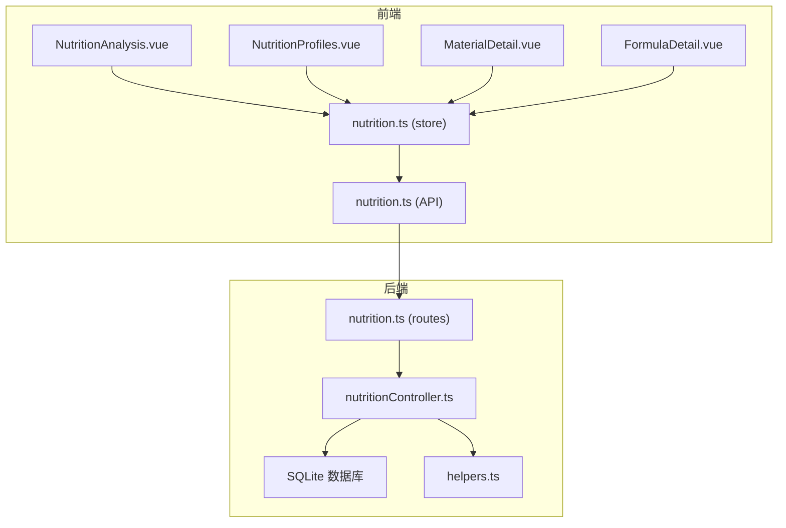
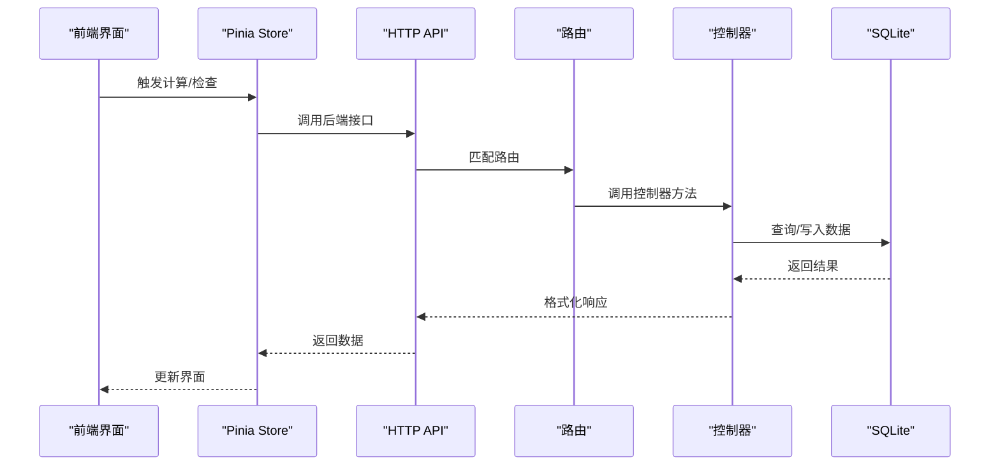
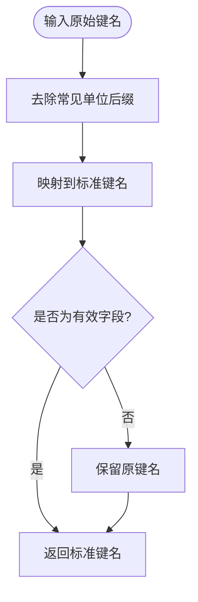
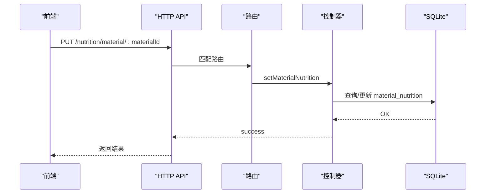
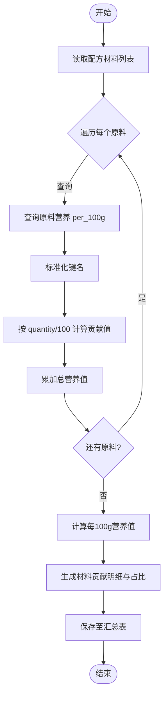
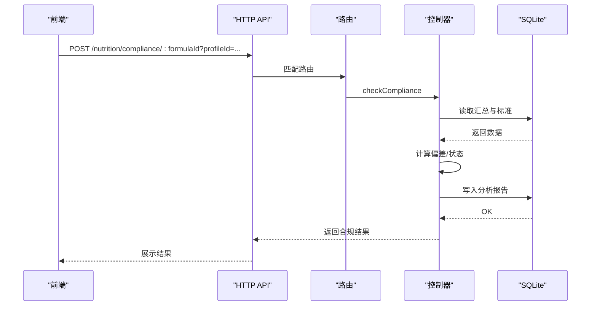
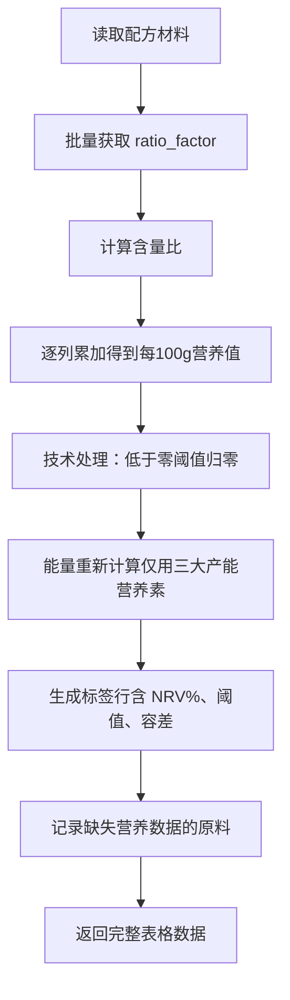
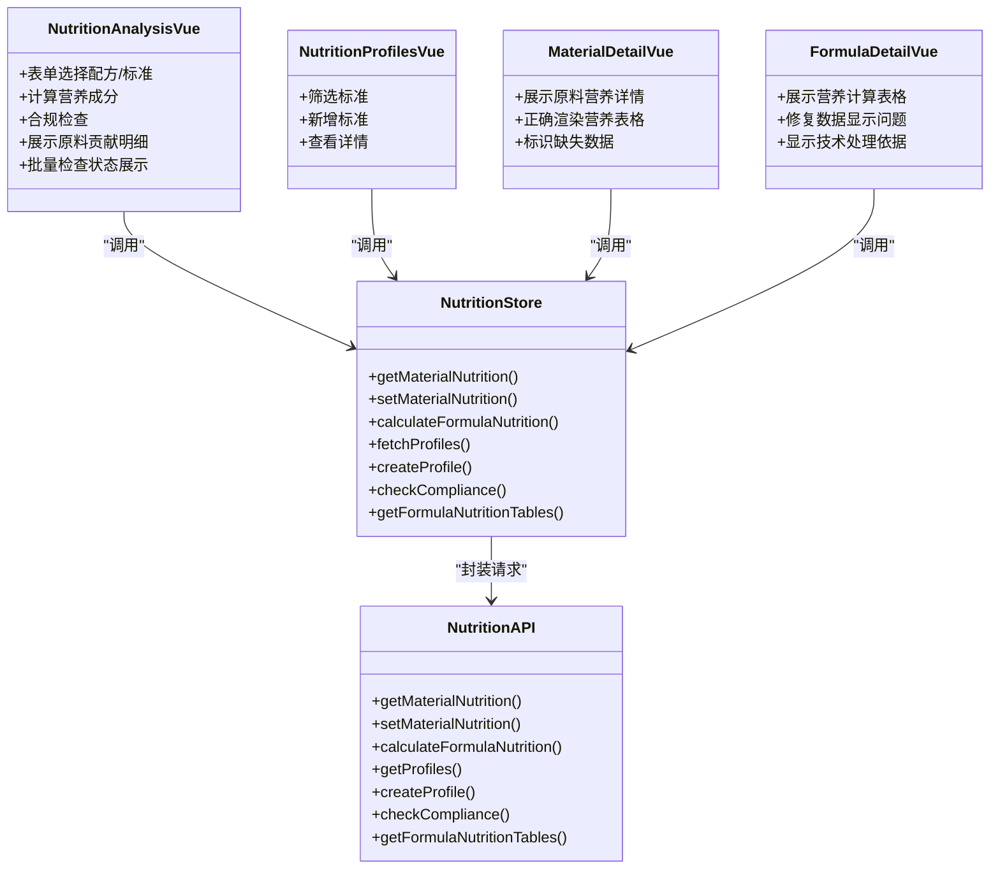
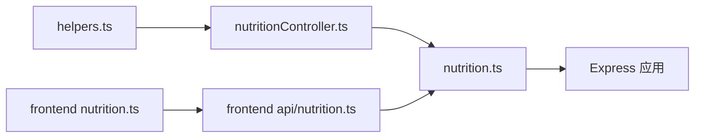
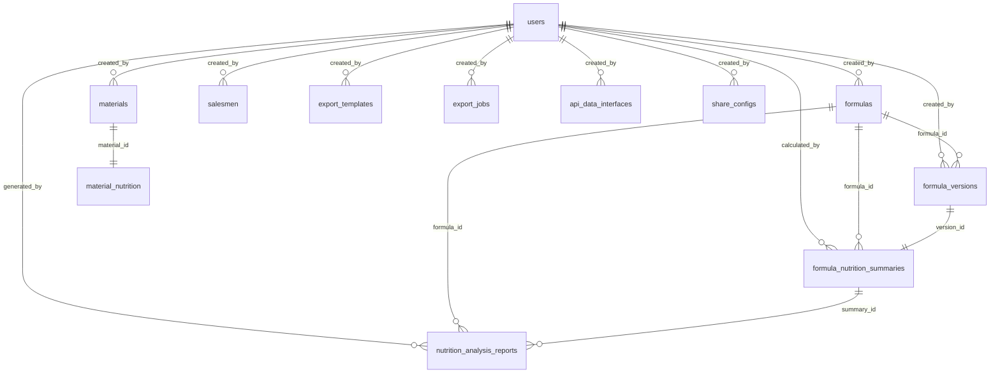

# 营养分析系统

<cite>
**本文档引用的文件**
- [backend/src/controllers/nutritionController.ts](file://backend/src/controllers/nutritionController.ts)
- [backend/src/routes/nutrition.ts](file://backend/src/routes/nutrition.ts)
- [backend/src/utils/helpers.ts](file://backend/src/utils/helpers.ts)
- [backend/src/scripts/init.sql](file://backend/src/scripts/init.sql)
- [backend/DATABASE_DOC.md](file://backend/DATABASE_DOC.md)
- [backend/API_DOC.md](file://backend/API_DOC.md)
- [frontend/src/views/nutrition/NutritionAnalysis.vue](file://frontend/src/views/nutrition/NutritionAnalysis.vue)
- [frontend/src/views/nutrition/NutritionProfiles.vue](file://frontend/src/views/nutrition/NutritionProfiles.vue)
- [frontend/src/views/materials/MaterialDetail.vue](file://frontend/src/views/materials/MaterialDetail.vue)
- [frontend/src/views/formulas/FormulaDetail.vue](file://frontend/src/views/formulas/FormulaDetail.vue)
- [frontend/src/stores/nutrition.ts](file://frontend/src/stores/nutrition.ts)
- [frontend/src/api/nutrition.ts](file://frontend/src/api/nutrition.ts)
</cite>

## 更新摘要
**变更内容**
- 新增配方营养表格数据接口，支持完整的营养计算表格展示
- 增强原料列表营养列批量检查功能，提供状态展示与可视化反馈
- 优化原料详情页营养表格正确渲染，支持缺失数据标识
- 修复配方详情页营养计算表格数据显示问题
- 完善营养分析界面的状态管理与用户体验

## 目录
1. [简介](#简介)
2. [项目结构](#项目结构)
3. [核心组件](#核心组件)
4. [架构总览](#架构总览)
5. [详细组件分析](#详细组件分析)
6. [依赖关系分析](#依赖关系分析)
7. [性能考虑](#性能考虑)
8. [故障排查指南](#故障排查指南)
9. [结论](#结论)
10. [附录](#附录)

## 简介
本系统为 TingStudio 的营养分析模块，提供从原料营养值管理、配方营养汇总计算、标准对照合规检查到营养报告生成的完整能力。后端基于 Node.js + Express + SQLite，前端采用 Vue 3 + Pinia + TDesign，支持营养数据模型标准化、精确计算与可视化呈现，并具备完善的数据库结构与 API 文档支撑。

**更新** 新增配方营养表格数据接口，增强批量检查与状态展示功能，优化各页面数据渲染体验。

## 项目结构
- 后端模块划分清晰，营养分析相关控制器、路由、工具函数与数据库脚本分离存放，便于维护与扩展。
- 前端采用组件化架构，NutritionAnalysis.vue 负责配方营养分析界面，NutritionProfiles.vue 负责营养标准管理，MaterialDetail.vue 和 FormulaDetail.vue 分别负责原料详情与配方详情展示，Pinia store 统一管理状态与 API 调用。

**图表来源**
- [backend/src/controllers/nutritionController.ts:1-792](file://backend/src/controllers/nutritionController.ts#L1-L792)
- [backend/src/routes/nutrition.ts:1-33](file://backend/src/routes/nutrition.ts#L1-L33)
- [frontend/src/views/nutrition/NutritionAnalysis.vue:1-750](file://frontend/src/views/nutrition/NutritionAnalysis.vue#L1-L750)
- [frontend/src/views/nutrition/NutritionProfiles.vue:1-262](file://frontend/src/views/nutrition/NutritionProfiles.vue#L1-L262)
- [frontend/src/views/materials/MaterialDetail.vue:1-147](file://frontend/src/views/materials/MaterialDetail.vue#L1-L147)
- [frontend/src/views/formulas/FormulaDetail.vue:1-315](file://frontend/src/views/formulas/FormulaDetail.vue#L1-L315)
- [frontend/src/stores/nutrition.ts:1-124](file://frontend/src/stores/nutrition.ts#L1-L124)
- [frontend/src/api/nutrition.ts:1-38](file://frontend/src/api/nutrition.ts#L1-L38)

**章节来源**
- [backend/src/controllers/nutritionController.ts:1-792](file://backend/src/controllers/nutritionController.ts#L1-L792)
- [backend/src/routes/nutrition.ts:1-33](file://backend/src/routes/nutrition.ts#L1-L33)
- [frontend/src/views/nutrition/NutritionAnalysis.vue:1-750](file://frontend/src/views/nutrition/NutritionAnalysis.vue#L1-L750)
- [frontend/src/views/nutrition/NutritionProfiles.vue:1-262](file://frontend/src/views/nutrition/NutritionProfiles.vue#L1-L262)
- [frontend/src/views/materials/MaterialDetail.vue:1-147](file://frontend/src/views/materials/MaterialDetail.vue#L1-L147)
- [frontend/src/views/formulas/FormulaDetail.vue:1-315](file://frontend/src/views/formulas/FormulaDetail.vue#L1-L315)
- [frontend/src/stores/nutrition.ts:1-124](file://frontend/src/stores/nutrition.ts#L1-L124)
- [frontend/src/api/nutrition.ts:1-38](file://frontend/src/api/nutrition.ts#L1-L38)

## 核心组件
- 后端控制器：实现原料营养获取/设置、配方营养计算、营养标准管理、合规检查与营养表格数据生成。
- 前端视图：NutritionAnalysis.vue 提供配方分析与合规检查界面；NutritionProfiles.vue 提供营养标准创建与查看；MaterialDetail.vue 展示原料营养详情；FormulaDetail.vue 显示配方营养计算表格。
- 状态管理：Pinia store 统一调度 API 请求与状态缓存。
- 数据库：SQLite 存储原料营养、配方汇总、营养标准与分析报告。

**更新** 新增配方营养表格数据接口，支持完整的营养计算表格展示功能。

**章节来源**
- [backend/src/controllers/nutritionController.ts:55-791](file://backend/src/controllers/nutritionController.ts#L55-L791)
- [frontend/src/views/nutrition/NutritionAnalysis.vue:10-750](file://frontend/src/views/nutrition/NutritionAnalysis.vue#L10-L750)
- [frontend/src/views/nutrition/NutritionProfiles.vue:1-262](file://frontend/src/views/nutrition/NutritionProfiles.vue#L1-L262)
- [frontend/src/views/materials/MaterialDetail.vue:1-147](file://frontend/src/views/materials/MaterialDetail.vue#L1-L147)
- [frontend/src/views/formulas/FormulaDetail.vue:1-315](file://frontend/src/views/formulas/FormulaDetail.vue#L1-L315)
- [frontend/src/stores/nutrition.ts:1-124](file://frontend/src/stores/nutrition.ts#L1-L124)

## 架构总览
系统采用前后端分离架构，后端提供 RESTful API，前端通过 Pinia store 调用 API 并渲染界面。营养数据以 JSON 形式存储于 SQLite 表中，关键字段包括 per_100g_json、target_values_json、tolerance_ranges_json 等。

**图表来源**
- [backend/src/routes/nutrition.ts:13-33](file://backend/src/routes/nutrition.ts#L13-L33)
- [backend/src/controllers/nutritionController.ts:55-791](file://backend/src/controllers/nutritionController.ts#L55-L791)
- [frontend/src/api/nutrition.ts:15-37](file://frontend/src/api/nutrition.ts#L15-L37)
- [frontend/src/stores/nutrition.ts:38-124](file://frontend/src/stores/nutrition.ts#L38-L124)

## 详细组件分析

### 数据模型与标准化
- 营养素字段集合：包含能量、蛋白质、脂肪、碳水、膳食纤维、糖类、钠、钾、钙、铁、锌、镁、磷、维生素A-K、B族维生素、叶酸、胆固醇、反式脂肪、饱和脂肪等。
- 键名标准化：支持带单位后缀的键名（如 energy_kj、protein_g 等）自动映射到标准键名，确保跨来源数据一致性。
- NRV 参考值：内置常见营养素的每日参考值，用于 NRV% 计算与标签展示。

**图表来源**
- [backend/src/controllers/nutritionController.ts:16-44](file://backend/src/controllers/nutritionController.ts#L16-L44)

**章节来源**
- [backend/src/controllers/nutritionController.ts:7-53](file://backend/src/controllers/nutritionController.ts#L7-L53)

### 原料营养值管理
- 获取：根据 materialId 查询 material_nutrition 表，解析 per_100g_json，标准化键名后返回。
- 设置：若存在历史记录则递增 data_version（主版本号+1.0），否则新建记录；支持数据来源与备注字段。

**图表来源**
- [backend/src/routes/nutrition.ts:18-19](file://backend/src/routes/nutrition.ts#L18-L19)
- [backend/src/controllers/nutritionController.ts:76-121](file://backend/src/controllers/nutritionController.ts#L76-L121)
- [backend/src/scripts/init.sql:173-182](file://backend/src/scripts/init.sql#L173-L182)

**章节来源**
- [backend/src/controllers/nutritionController.ts:55-121](file://backend/src/controllers/nutritionController.ts#L55-L121)
- [backend/src/scripts/init.sql:173-182](file://backend/src/scripts/init.sql#L173-L182)

### 配方营养计算算法
- 输入：配方 ID，配方材料列表（含 materialId、materialName、quantity）。
- 步骤：
  1) 遍历配方材料，查询每种原料的 per_100g 营养值（支持按名称备选查找）。
  2) 标准化键名，按 quantity/100 计算每种营养素的贡献值并累加。
  3) 计算总重量与每100g营养值（保留两位小数）。
  4) 生成材料贡献明细与占比（百分比）。
  5) 保存至 formula_nutrition_summaries 表，供后续合规检查使用。

**图表来源**
- [backend/src/controllers/nutritionController.ts:124-257](file://backend/src/controllers/nutritionController.ts#L124-L257)
- [backend/src/scripts/init.sql:184-198](file://backend/src/scripts/init.sql#L184-L198)

**章节来源**
- [backend/src/controllers/nutritionController.ts:124-257](file://backend/src/controllers/nutritionController.ts#L124-L257)
- [backend/src/scripts/init.sql:184-198](file://backend/src/scripts/init.sql#L184-L198)

### 营养标准数据库与合规检查
- 营养标准：nutrition_profiles 表存储目标值、容差范围与必填字段，支持按类别筛选。
- 合规检查：读取 formula_nutrition_summaries 的 per_100g 数据，与标准进行对比，生成检查结果与建议，保存至 nutrition_analysis_reports。

**图表来源**
- [backend/src/routes/nutrition.ts:32-32](file://backend/src/routes/nutrition.ts#L32-L32)
- [backend/src/controllers/nutritionController.ts:371-543](file://backend/src/controllers/nutritionController.ts#L371-L543)
- [backend/src/scripts/init.sql:200-226](file://backend/src/scripts/init.sql#L200-L226)

**章节来源**
- [backend/src/controllers/nutritionController.ts:371-543](file://backend/src/controllers/nutritionController.ts#L371-L543)
- [backend/src/scripts/init.sql:200-226](file://backend/src/scripts/init.sql#L200-L226)

### 营养表格数据生成（与 Excel 一致）
- 支持批量获取配方材料 ratio_factor（来自 materials 表），计算"含量比"与"营养成分表"。
- 技术处理规则：
  - 低于零阈值的营养素归零；
  - 能量重新计算：仅用处理后的蛋白质、脂肪、碳水计算；
  - 输出标签行（含 NRV%、零阈值、容差范围）。
- 返回字段：配方名称、成品重量、原料总重量、计算行、汇总行、NRV 行、标签行及缺失营养数据的原料清单。

**更新** 新增配方营养表格数据接口，支持完整的营养计算表格展示，包括原料明细、技术处理依据和缺失数据标识。

**图表来源**
- [backend/src/controllers/nutritionController.ts:587-791](file://backend/src/controllers/nutritionController.ts#L587-L791)
- [backend/src/scripts/init.sql:17-31](file://backend/src/scripts/init.sql#L17-L31)

**章节来源**
- [backend/src/controllers/nutritionController.ts:587-791](file://backend/src/controllers/nutritionController.ts#L587-L791)
- [backend/src/scripts/init.sql:17-31](file://backend/src/scripts/init.sql#L17-L31)

### 前端组件实现
- 营养分析界面（NutritionAnalysis.vue）：
  - 表单选择配方与营养标准，触发计算与合规检查；
  - 展示每100g营养成分与合规检查结果（通过/警告/超标）。
  - **新增** 原料贡献明细表格，支持批量检查状态展示与营养贡献详情弹窗。
- 营养档案管理（NutritionProfiles.vue）：
  - 支持按类别筛选、新增标准、查看详情；
  - 编辑器动态添加目标营养指标与数值。
- 原料详情展示（MaterialDetail.vue）：
  - **优化** 营养表格正确渲染，支持缺失数据标识与状态展示。
- 配方详情展示（FormulaDetail.vue）：
  - **修复** 营养计算表格数据显示问题，支持完整的营养计算表格展示。
- 状态管理（nutrition.ts）：
  - 统一封装 API 调用，提供加载状态、数据缓存与错误处理。

**图表来源**
- [frontend/src/views/nutrition/NutritionAnalysis.vue:10-750](file://frontend/src/views/nutrition/NutritionAnalysis.vue#L10-L750)
- [frontend/src/views/nutrition/NutritionProfiles.vue:1-262](file://frontend/src/views/nutrition/NutritionProfiles.vue#L1-L262)
- [frontend/src/views/materials/MaterialDetail.vue:1-147](file://frontend/src/views/materials/MaterialDetail.vue#L1-L147)
- [frontend/src/views/formulas/FormulaDetail.vue:1-315](file://frontend/src/views/formulas/FormulaDetail.vue#L1-L315)
- [frontend/src/stores/nutrition.ts:1-124](file://frontend/src/stores/nutrition.ts#L1-L124)
- [frontend/src/api/nutrition.ts:15-37](file://frontend/src/api/nutrition.ts#L15-L37)

**章节来源**
- [frontend/src/views/nutrition/NutritionAnalysis.vue:1-750](file://frontend/src/views/nutrition/NutritionAnalysis.vue#L1-L750)
- [frontend/src/views/nutrition/NutritionProfiles.vue:1-262](file://frontend/src/views/nutrition/NutritionProfiles.vue#L1-L262)
- [frontend/src/views/materials/MaterialDetail.vue:1-147](file://frontend/src/views/materials/MaterialDetail.vue#L1-L147)
- [frontend/src/views/formulas/FormulaDetail.vue:1-315](file://frontend/src/views/formulas/FormulaDetail.vue#L1-L315)
- [frontend/src/stores/nutrition.ts:1-124](file://frontend/src/stores/nutrition.ts#L1-L124)
- [frontend/src/api/nutrition.ts:1-38](file://frontend/src/api/nutrition.ts#L1-L38)

## 依赖关系分析
- 控制器依赖工具函数（ID 生成、时间、JSON 解析、命名转换）与数据库查询。
- 路由中间件统一鉴权，控制器内再做业务校验（如配方/原料存在性）。
- 前端 store 依赖 API 模块，API 模块封装 HTTP 请求与响应格式。

**图表来源**
- [backend/src/utils/helpers.ts:1-86](file://backend/src/utils/helpers.ts#L1-L86)
- [backend/src/controllers/nutritionController.ts:1-6](file://backend/src/controllers/nutritionController.ts#L1-L6)
- [backend/src/routes/nutrition.ts:1-11](file://backend/src/routes/nutrition.ts#L1-L11)
- [frontend/src/stores/nutrition.ts:1-4](file://frontend/src/stores/nutrition.ts#L1-L4)
- [frontend/src/api/nutrition.ts:1-3](file://frontend/src/api/nutrition.ts#L1-L3)

**章节来源**
- [backend/src/utils/helpers.ts:1-86](file://backend/src/utils/helpers.ts#L1-L86)
- [backend/src/controllers/nutritionController.ts:1-6](file://backend/src/controllers/nutritionController.ts#L1-L6)
- [backend/src/routes/nutrition.ts:1-11](file://backend/src/routes/nutrition.ts#L1-L11)
- [frontend/src/stores/nutrition.ts:1-4](file://frontend/src/stores/nutrition.ts#L1-L4)
- [frontend/src/api/nutrition.ts:1-3](file://frontend/src/api/nutrition.ts#L1-L3)

## 性能考虑
- 数据库索引：对关键查询字段建立索引（如 formula_nutrition_summaries(formula_id)、nutrition_profiles(category)），提升查询效率。
- 批量查询：配方表格数据生成阶段，一次性批量获取 ratio_factor，减少多次往返。
- 精度控制：计算结果保留两位小数，避免浮点误差累积。
- 缓存策略：前端 store 缓存已获取的标准与配方结果，减少重复请求。
- 错误处理：统一的错误响应格式与状态码，便于前端快速定位问题。
- **新增** 表格渲染优化：前端组件对大量数据进行虚拟滚动和懒加载处理，提升大数据量表格的渲染性能。

## 故障排查指南
- 常见错误与处理：
  - 未找到配方/原料：检查 formulaId/materialId 是否正确，确认数据库中是否存在对应记录。
  - 未找到营养数据：确认 material_nutrition 是否已录入 per_100g_json，或是否可通过原料名称备选匹配。
  - 未先计算营养汇总即进行合规检查：需先调用计算接口，确保 formula_nutrition_summaries 中已有数据。
  - API 响应失败：检查后端日志与网络连通性，确认路由与控制器逻辑执行路径。
  - **新增** 表格数据渲染问题：检查 missingNutritionMaterials 字段是否正确传递，确认前端组件对空值的处理逻辑。
- 建议的日志与监控：
  - 在控制器中记录关键步骤（查询、计算、保存）的时间戳与参数，便于定位性能瓶颈。
  - 前端捕获异常并提示用户，同时上报错误信息以便后台排查。

**章节来源**
- [backend/src/controllers/nutritionController.ts:55-121](file://backend/src/controllers/nutritionController.ts#L55-L121)
- [backend/src/controllers/nutritionController.ts:371-543](file://backend/src/controllers/nutritionController.ts#L371-L543)
- [backend/API_DOC.md:680-701](file://backend/API_DOC.md#L680-L701)

## 结论
本系统通过标准化的数据模型、严谨的计算流程与完善的数据库设计，实现了从原料到配方的营养分析闭环。前后端职责清晰，API 文档完备，具备良好的可维护性与扩展性。**更新** 新增的配方营养表格数据接口和增强的批量检查功能进一步提升了系统的实用性和用户体验。建议持续完善测试用例与性能监控，确保在高并发场景下的稳定性与准确性。

## 附录

### 数据库 ER 关系图（文字描述）

**图表来源**
- [backend/DATABASE_DOC.md:393-427](file://backend/DATABASE_DOC.md#L393-L427)

### API 接口一览（节选）
- GET /api/nutrition/material/:materialId
- PUT /api/nutrition/material/:materialId
- POST /api/nutrition/calculate/:formulaId
- GET /api/nutrition/profiles
- POST /api/nutrition/profiles
- POST /api/nutrition/compliance/:formulaId
- GET /api/nutrition/tables/:formulaId

**更新** 新增配方营养表格数据接口，提供完整的营养计算表格展示能力。

**章节来源**
- [backend/API_DOC.md:561-759](file://backend/API_DOC.md#L561-L759)