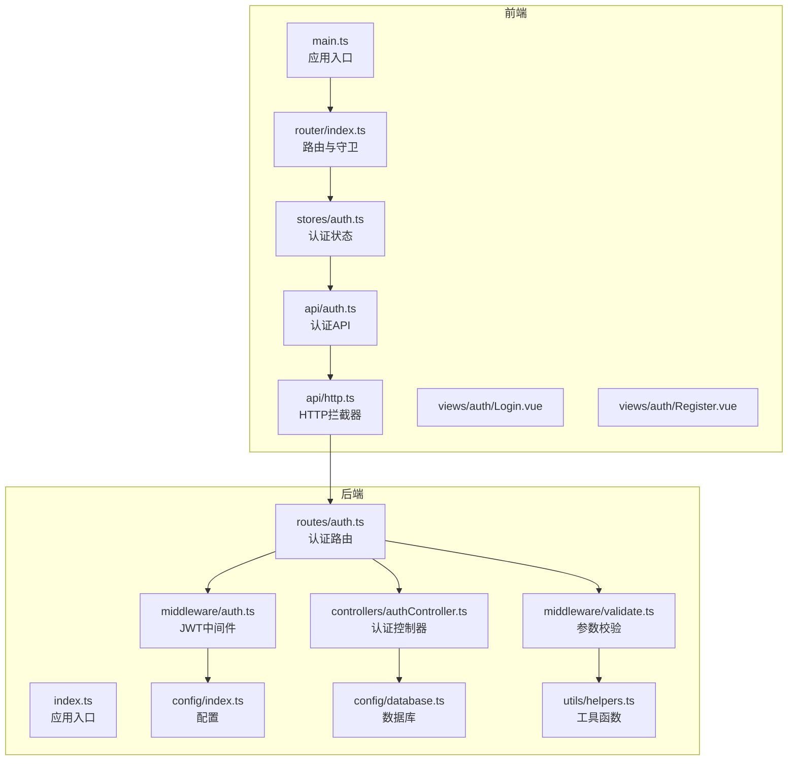
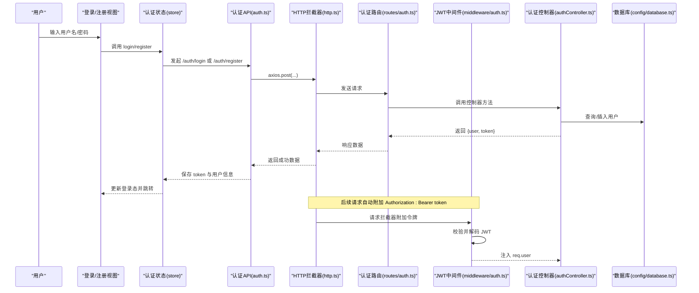
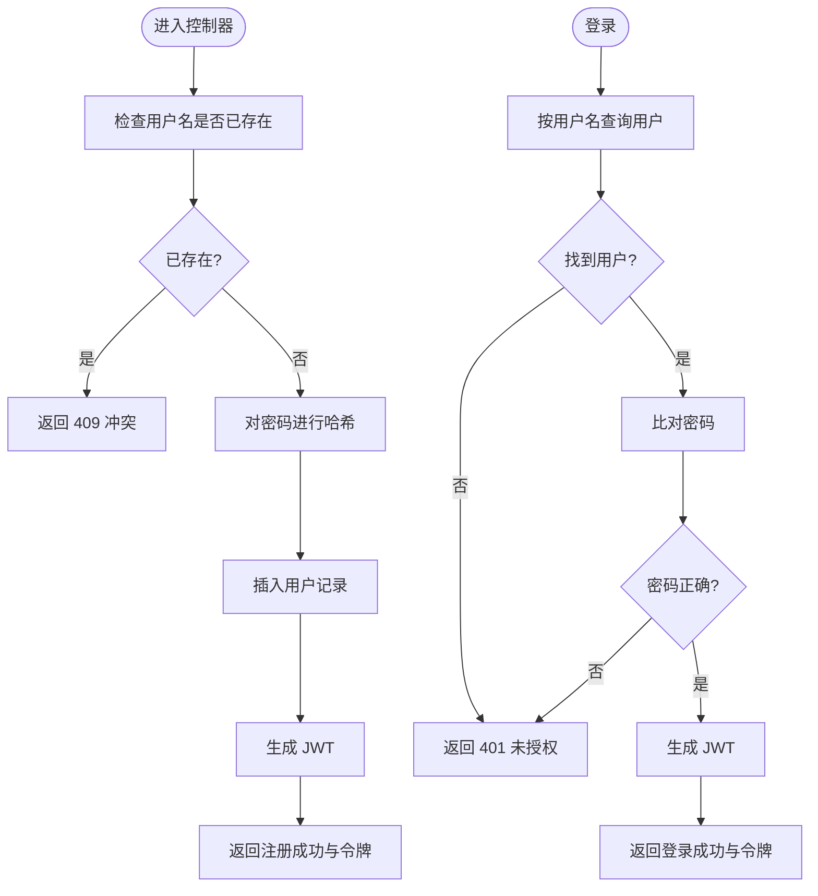
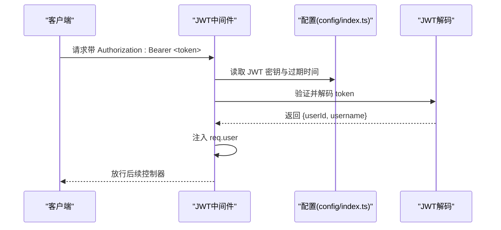
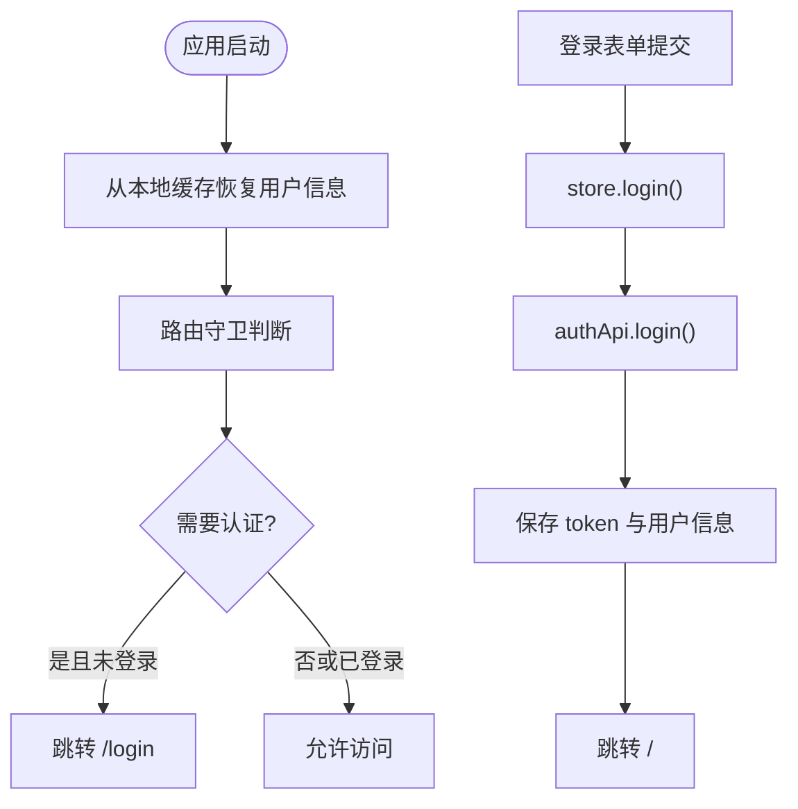
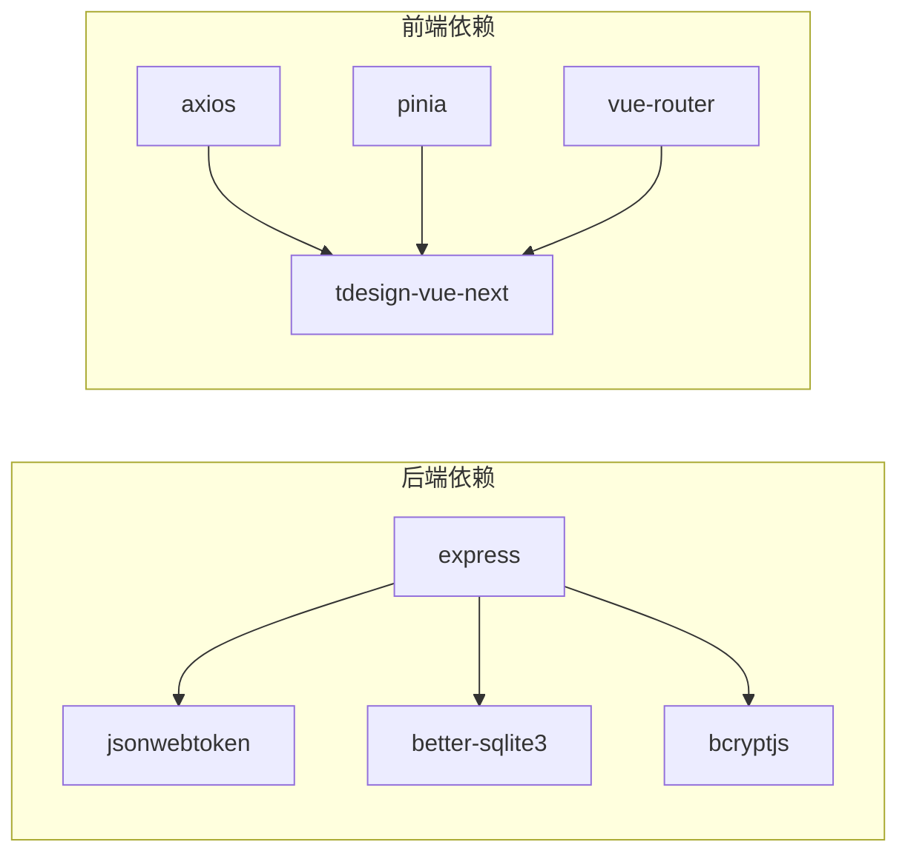

# 认证管理系统

<cite>
**本文档引用的文件**
- [backend/src/controllers/authController.ts](file://backend/src/controllers/authController.ts)
- [backend/src/middleware/auth.ts](file://backend/src/middleware/auth.ts)
- [backend/src/routes/auth.ts](file://backend/src/routes/auth.ts)
- [backend/src/middleware/validate.ts](file://backend/src/middleware/validate.ts)
- [backend/src/config/index.ts](file://backend/src/config/index.ts)
- [backend/src/config/database.ts](file://backend/src/config/database.ts)
- [backend/src/utils/helpers.ts](file://backend/src/utils/helpers.ts)
- [backend/API_DOC.md](file://backend/API_DOC.md)
- [backend/package.json](file://backend/package.json)
- [frontend/src/stores/auth.ts](file://frontend/src/stores/auth.ts)
- [frontend/src/router/index.ts](file://frontend/src/router/index.ts)
- [frontend/src/api/auth.ts](file://frontend/src/api/auth.ts)
- [frontend/src/api/http.ts](file://frontend/src/api/http.ts)
- [frontend/src/views/auth/Login.vue](file://frontend/src/views/auth/Login.vue)
- [frontend/src/views/auth/Register.vue](file://frontend/src/views/auth/Register.vue)
- [frontend/src/types/user.ts](file://frontend/src/types/user.ts)
- [frontend/src/main.ts](file://frontend/src/main.ts)
</cite>

## 目录
1. [简介](#简介)
2. [项目结构](#项目结构)
3. [核心组件](#核心组件)
4. [架构总览](#架构总览)
5. [详细组件分析](#详细组件分析)
6. [依赖关系分析](#依赖关系分析)
7. [性能与安全考量](#性能与安全考量)
8. [故障排查指南](#故障排查指南)
9. [结论](#结论)
10. [附录](#附录)

## 简介
本文件面向 TingStudio 的认证管理系统，系统采用前后端分离架构，后端基于 Express + TypeScript，使用 JWT 实现无状态认证；前端基于 Vue 3 + Pinia + Vue Router，通过拦截器与状态管理完成认证态维护与路由守卫。本文档覆盖用户注册、登录、JWT 令牌管理、权限控制、错误处理、安全策略、令牌刷新与会话管理等主题，并提供扩展指南与最佳实践。

## 项目结构
- 后端位于 backend 目录，包含控制器、中间件、路由、配置、数据库与工具模块。
- 前端位于 frontend 目录，包含 API 层、状态管理、路由守卫、视图组件与类型定义。
- 认证相关的关键交互集中在后端认证控制器与中间件、前端状态与路由守卫之间。

图表来源
- [frontend/src/main.ts:1-17](file://frontend/src/main.ts#L1-L17)
- [frontend/src/router/index.ts:1-165](file://frontend/src/router/index.ts#L1-L165)
- [frontend/src/stores/auth.ts:1-64](file://frontend/src/stores/auth.ts#L1-L64)
- [frontend/src/api/http.ts:1-58](file://frontend/src/api/http.ts#L1-L58)
- [frontend/src/api/auth.ts:1-36](file://frontend/src/api/auth.ts#L1-L36)
- [backend/src/routes/auth.ts:1-20](file://backend/src/routes/auth.ts#L1-L20)
- [backend/src/middleware/auth.ts:1-38](file://backend/src/middleware/auth.ts#L1-L38)
- [backend/src/middleware/validate.ts:1-68](file://backend/src/middleware/validate.ts#L1-L68)
- [backend/src/controllers/authController.ts:1-89](file://backend/src/controllers/authController.ts#L1-L89)
- [backend/src/config/index.ts:1-24](file://backend/src/config/index.ts#L1-L24)
- [backend/src/config/database.ts:1-70](file://backend/src/config/database.ts#L1-L70)
- [backend/src/utils/helpers.ts:1-86](file://backend/src/utils/helpers.ts#L1-L86)

章节来源
- [frontend/src/main.ts:1-17](file://frontend/src/main.ts#L1-L17)
- [backend/src/routes/auth.ts:1-20](file://backend/src/routes/auth.ts#L1-L20)

## 核心组件
- 后端认证控制器：负责注册、登录、获取当前用户信息。
- JWT 中间件：校验 Authorization 头中的 Bearer 令牌，注入用户信息。
- 参数校验中间件：对请求体进行类型、长度、范围等规则校验。
- 前端认证状态管理：集中管理用户登录态、加载状态与持久化。
- 前端路由守卫：根据登录态控制页面访问与跳转。
- 前端 HTTP 拦截器：自动附加令牌、统一对 401 做登出处理。

章节来源
- [backend/src/controllers/authController.ts:1-89](file://backend/src/controllers/authController.ts#L1-L89)
- [backend/src/middleware/auth.ts:1-38](file://backend/src/middleware/auth.ts#L1-L38)
- [backend/src/middleware/validate.ts:1-68](file://backend/src/middleware/validate.ts#L1-L68)
- [frontend/src/stores/auth.ts:1-64](file://frontend/src/stores/auth.ts#L1-L64)
- [frontend/src/router/index.ts:148-162](file://frontend/src/router/index.ts#L148-L162)
- [frontend/src/api/http.ts:12-43](file://frontend/src/api/http.ts#L12-L43)

## 架构总览
认证流程由“前端表单提交 -> 后端参数校验 -> 控制器处理 -> 生成JWT -> 前端存储 -> 请求携带令牌 -> 后端中间件校验”构成。路由守卫在前端层面进一步保护受控页面。

图表来源
- [frontend/src/views/auth/Login.vue:290-308](file://frontend/src/views/auth/Login.vue#L290-L308)
- [frontend/src/views/auth/Register.vue:190-208](file://frontend/src/views/auth/Register.vue#L190-L208)
- [frontend/src/stores/auth.ts:19-47](file://frontend/src/stores/auth.ts#L19-L47)
- [frontend/src/api/auth.ts:7-17](file://frontend/src/api/auth.ts#L7-L17)
- [frontend/src/api/http.ts:12-19](file://frontend/src/api/http.ts#L12-L19)
- [backend/src/routes/auth.ts:9-19](file://backend/src/routes/auth.ts#L9-L19)
- [backend/src/middleware/auth.ts:13-31](file://backend/src/middleware/auth.ts#L13-L31)
- [backend/src/controllers/authController.ts:9-88](file://backend/src/controllers/authController.ts#L9-L88)
- [backend/src/config/database.ts:44-55](file://backend/src/config/database.ts#L44-L55)

## 详细组件分析

### 后端认证控制器
- 注册：校验用户名唯一性，哈希密码，写入数据库，签发 JWT 并返回用户与令牌。
- 登录：根据用户名查询用户，比对密码，签发 JWT 并返回用户与令牌。
- 获取当前用户：根据已注入的用户ID查询用户信息。

图表来源
- [backend/src/controllers/authController.ts:9-88](file://backend/src/controllers/authController.ts#L9-L88)

章节来源
- [backend/src/controllers/authController.ts:9-88](file://backend/src/controllers/authController.ts#L9-L88)

### JWT 中间件与令牌管理
- 中间件职责：从 Authorization 头提取 Bearer 令牌，校验有效性并解码，将用户信息注入 req.user，放行后续处理。
- 令牌生成：使用配置中的密钥与过期时间生成 JWT。

图表来源
- [backend/src/middleware/auth.ts:13-37](file://backend/src/middleware/auth.ts#L13-L37)
- [backend/src/config/index.ts:10-13](file://backend/src/config/index.ts#L10-L13)

章节来源
- [backend/src/middleware/auth.ts:13-37](file://backend/src/middleware/auth.ts#L13-L37)
- [backend/src/config/index.ts:10-13](file://backend/src/config/index.ts#L10-L13)

### 参数校验中间件
- 对请求体字段进行类型、必填、最小/最大长度、最小/最大数值等规则校验。
- 校验失败返回 400 与错误列表。

章节来源
- [backend/src/middleware/validate.ts:16-67](file://backend/src/middleware/validate.ts#L16-L67)

### 前端认证状态管理与路由守卫
- Pinia 状态：保存用户信息、登录/注册加载状态、认证态计算属性。
- 登录/注册流程：调用认证 API，成功后保存 token 与用户信息至本地存储。
- 路由守卫：未登录访问受保护路由跳转登录；已登录访问登录/注册页跳转首页。

图表来源
- [frontend/src/stores/auth.ts:12-32](file://frontend/src/stores/auth.ts#L12-L32)
- [frontend/src/router/index.ts:148-162](file://frontend/src/router/index.ts#L148-L162)
- [frontend/src/api/auth.ts:19-35](file://frontend/src/api/auth.ts#L19-L35)

章节来源
- [frontend/src/stores/auth.ts:1-64](file://frontend/src/stores/auth.ts#L1-L64)
- [frontend/src/router/index.ts:148-162](file://frontend/src/router/index.ts#L148-L162)
- [frontend/src/api/auth.ts:19-35](file://frontend/src/api/auth.ts#L19-L35)

### 前端 HTTP 拦截器与错误处理
- 请求拦截：若本地存在 token，则在 Authorization 头中附加 Bearer 令牌。
- 响应拦截：统一处理错误；当 401 时清除本地认证信息并跳转登录页。

章节来源
- [frontend/src/api/http.ts:12-43](file://frontend/src/api/http.ts#L12-L43)

### API 接口规范与错误码
- 认证模块接口：注册、登录、获取当前用户。
- 通用响应格式：success、message、data；分页列表包含 pagination。
- 通用错误码：400 参数错误、401 未认证/令牌无效、404 资源不存在、409 冲突、500 服务器错误。

章节来源
- [backend/API_DOC.md:82-160](file://backend/API_DOC.md#L82-L160)
- [backend/API_DOC.md:18-71](file://backend/API_DOC.md#L18-L71)

## 依赖关系分析
- 后端依赖：bcryptjs（密码哈希）、jsonwebtoken（JWT）、better-sqlite3（数据库）、express（Web 框架）等。
- 前端依赖：axios（HTTP 客户端）、tdesign-vue-next（UI 组件库）、pinia（状态管理）、vue-router（路由）。

图表来源
- [backend/package.json:14-26](file://backend/package.json#L14-L26)

章节来源
- [backend/package.json:14-26](file://backend/package.json#L14-L26)

## 性能与安全考量
- 性能
  - 使用 bcryptjs 对密码进行哈希，成本因子 10；可在生产环境评估提升以平衡安全与性能。
  - 数据库使用 WAL 模式与外键约束，保证一致性与并发性能。
- 安全
  - JWT 密钥与过期时间通过环境变量配置，避免硬编码。
  - 前端拦截器统一处理 401，自动清理本地认证信息并跳转登录页。
  - 后端对注册参数进行严格校验，防止异常输入。
- 令牌刷新与会话管理
  - 当前实现为一次性签发 JWT，未实现刷新令牌机制。建议引入短期访问令牌与长期刷新令牌，配合黑名单/撤销机制与安全存储策略。
- 权限控制
  - 当前后端未实现细粒度角色/资源权限控制，仅通过中间件校验登录态。建议引入 RBAC 或 ABAC 模型，并在路由层与控制器层分别进行权限校验。

章节来源
- [backend/src/config/index.ts:10-13](file://backend/src/config/index.ts#L10-L13)
- [backend/src/config/database.ts:21-23](file://backend/src/config/database.ts#L21-L23)
- [frontend/src/api/http.ts:33-42](file://frontend/src/api/http.ts#L33-L42)
- [backend/src/middleware/validate.ts:16-67](file://backend/src/middleware/validate.ts#L16-L67)

## 故障排查指南
- 登录失败
  - 检查用户名/密码是否符合后端校验规则（用户名长度、密码长度）。
  - 确认数据库中是否存在重复用户名导致 409 冲突。
- 401 未认证或令牌无效
  - 检查前端是否正确保存 token 并在请求头中附加 Authorization: Bearer。
  - 检查后端 JWT 密钥与过期时间配置是否一致。
- 获取当前用户失败
  - 确认用户 ID 在数据库中存在，且中间件已正确注入 req.user。
- 路由跳转异常
  - 检查路由守卫逻辑与 meta.requiresAuth 标记是否正确设置。

章节来源
- [backend/src/middleware/validate.ts:16-67](file://backend/src/middleware/validate.ts#L16-L67)
- [backend/src/controllers/authController.ts:42-88](file://backend/src/controllers/authController.ts#L42-L88)
- [frontend/src/api/http.ts:12-19](file://frontend/src/api/http.ts#L12-L19)
- [frontend/src/router/index.ts:148-162](file://frontend/src/router/index.ts#L148-L162)

## 结论
TingStudio 的认证系统以 JWT 为核心，结合前端状态管理与路由守卫实现了基础的登录态维护与页面保护。系统具备清晰的模块划分与统一的错误处理机制。为进一步增强安全性与可维护性，建议引入令牌刷新策略、细粒度权限控制与更完善的会话管理方案。

## 附录

### API 规范摘要
- 认证接口
  - POST /api/auth/register：注册，返回 {user, token}
  - POST /api/auth/login：登录，返回 {user, token}
  - GET /api/auth/me：获取当前用户信息
- 通用响应
  - 成功：{success: true, message, data}
  - 错误：{success: false, message, errors?}

章节来源
- [backend/API_DOC.md:82-160](file://backend/API_DOC.md#L82-L160)
- [backend/API_DOC.md:18-71](file://backend/API_DOC.md#L18-L71)

### 前端类型定义
- 用户信息：id、username、createdAt
- 登录/注册表单：username、password、confirmPassword（注册）
- 认证状态：user、isAuthenticated

章节来源
- [frontend/src/types/user.ts:1-22](file://frontend/src/types/user.ts#L1-L22)