# 配方管理功能增强

<cite>
**本文档引用的文件**
- [backend/src/controllers/formulaController.ts](file://backend/src/controllers/formulaController.ts)
- [backend/src/routes/formulas.ts](file://backend/src/routes/formulas.ts)
- [backend/src/utils/helpers.ts](file://backend/src/utils/helpers.ts)
- [backend/src/middleware/validate.ts](file://backend/src/middleware/validate.ts)
- [backend/src/config/database.ts](file://backend/src/config/database.ts)
- [backend/src/scripts/init.sql](file://backend/src/scripts/init.sql)
- [frontend/src/stores/formula.ts](file://frontend/src/stores/formula.ts)
- [frontend/src/types/formula.ts](file://frontend/src/types/formula.ts)
- [frontend/src/views/formulas/FormulaList.vue](file://frontend/src/views/formulas/FormulaList.vue)
- [frontend/src/views/formulas/FormulaForm.vue](file://frontend/src/views/formulas/FormulaForm.vue)
- [frontend/src/api/formula.ts](file://frontend/src/api/formula.ts)
</cite>

## 目录
1. [项目概述](#项目概述)
2. [系统架构](#系统架构)
3. [核心组件分析](#核心组件分析)
4. [配方管理功能详解](#配方管理功能详解)
5. [版本控制系统](#版本控制系统)
6. [数据模型设计](#数据模型设计)
7. [前端界面实现](#前端界面实现)
8. [性能优化策略](#性能优化策略)
9. [故障排查指南](#故障排查指南)
10. [总结](#总结)

## 项目概述

TingStudio 是一个基于 Vue.js 和 Node.js 的配方管理系统，专注于中药配方的数字化管理。该系统提供了完整的配方生命周期管理，包括配方创建、编辑、版本控制、营养分析等功能。

### 系统特性

- **配方管理**：支持配方的增删改查操作
- **版本控制**：完整的配方版本历史追踪
- **营养分析**：基于原料营养成分的配方营养计算
- **权限管理**：管理员和配方管理员的角色区分
- **数据导出**：支持多种格式的配方数据导出

## 系统架构

系统采用前后端分离的架构设计，后端使用 Node.js + Express 提供 RESTful API，前端使用 Vue.js + TypeScript 构建用户界面。

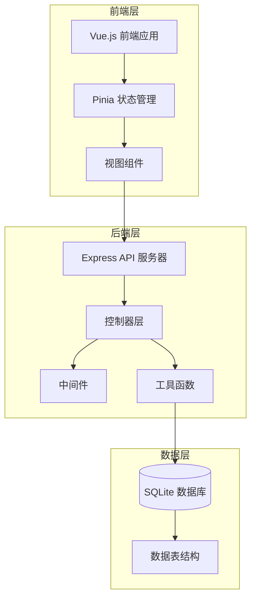

**图表来源**
- [backend/src/controllers/formulaController.ts:1-373](file://backend/src/controllers/formulaController.ts#L1-L373)
- [backend/src/routes/formulas.ts:1-38](file://backend/src/routes/formulas.ts#L1-L38)
- [backend/src/config/database.ts:1-70](file://backend/src/config/database.ts#L1-L70)

## 核心组件分析

### 后端控制器架构

配方管理的核心逻辑集中在控制器层，负责处理所有与配方相关的业务逻辑。

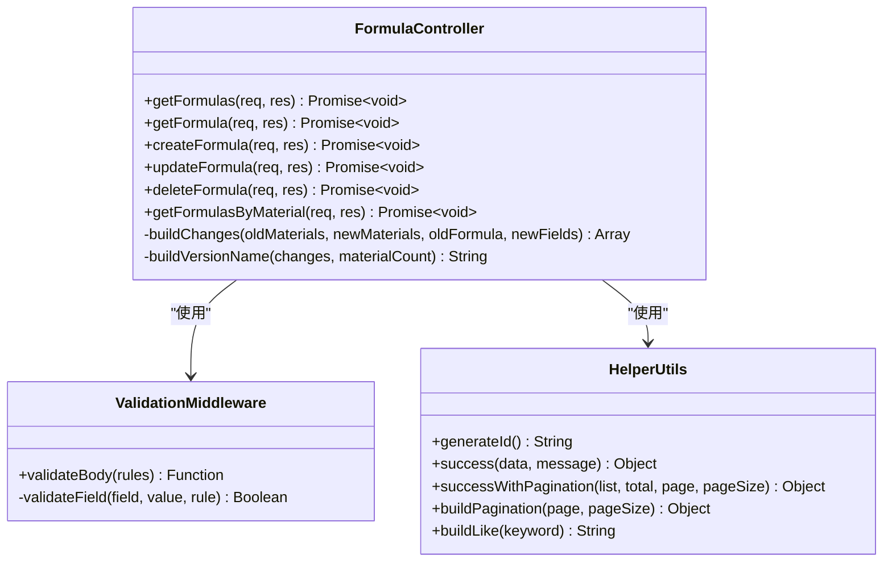

**图表来源**
- [backend/src/controllers/formulaController.ts:1-373](file://backend/src/controllers/formulaController.ts#L1-L373)
- [backend/src/middleware/validate.ts:1-68](file://backend/src/middleware/validate.ts#L1-L68)
- [backend/src/utils/helpers.ts:1-86](file://backend/src/utils/helpers.ts#L1-L86)

**章节来源**
- [backend/src/controllers/formulaController.ts:1-373](file://backend/src/controllers/formulaController.ts#L1-L373)
- [backend/src/middleware/validate.ts:1-68](file://backend/src/middleware/validate.ts#L1-L68)
- [backend/src/utils/helpers.ts:1-86](file://backend/src/utils/helpers.ts#L1-L86)

## 配方管理功能详解

### 配方 CRUD 操作

系统提供了完整的配方 CRUD 操作，包括查询、创建、更新和删除功能。

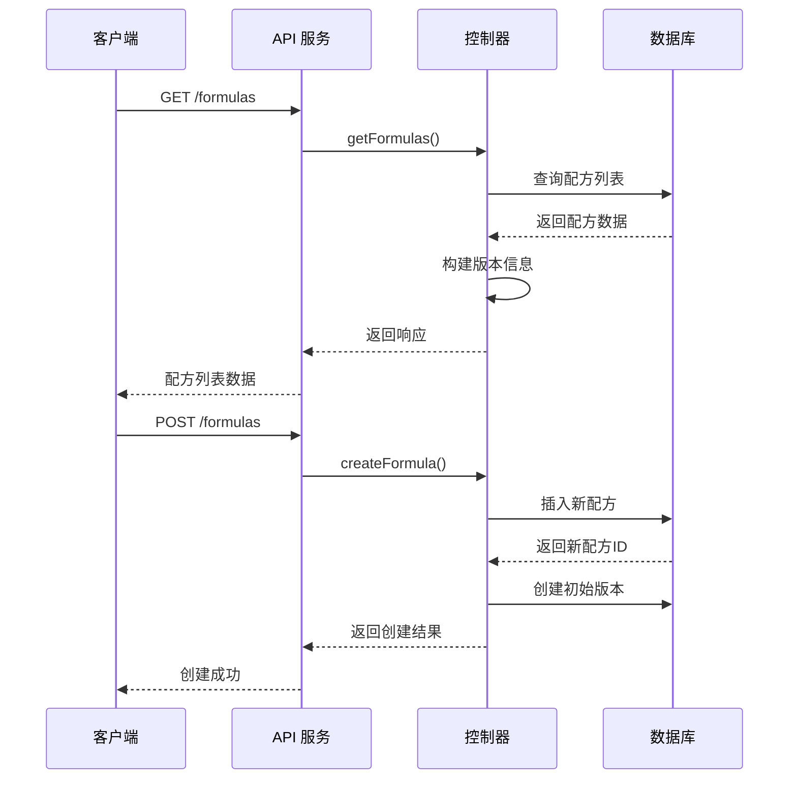

**图表来源**
- [backend/src/controllers/formulaController.ts:6-76](file://backend/src/controllers/formulaController.ts#L6-L76)
- [backend/src/routes/formulas.ts:14-26](file://backend/src/routes/formulas.ts#L14-L26)

### 配方创建流程

配方创建过程包含多个验证步骤和自动化的版本管理。

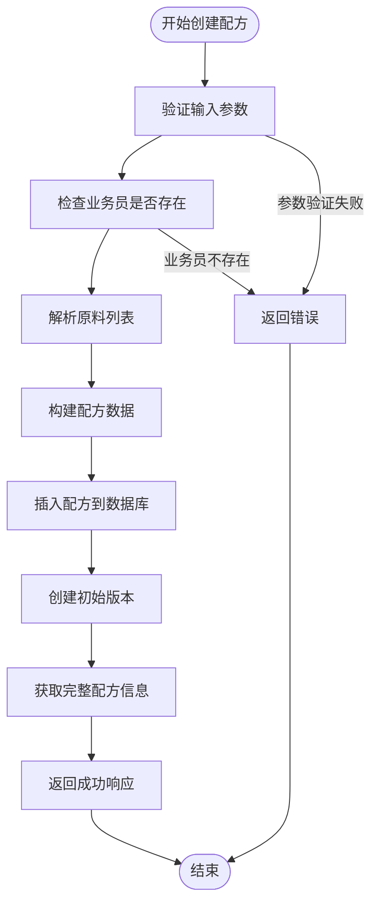

**图表来源**
- [backend/src/controllers/formulaController.ts:95-139](file://backend/src/controllers/formulaController.ts#L95-L139)

**章节来源**
- [backend/src/controllers/formulaController.ts:95-139](file://backend/src/controllers/formulaController.ts#L95-L139)

### 配方更新机制

配方更新支持增量更新和版本升级，确保历史数据的完整性和可追溯性。

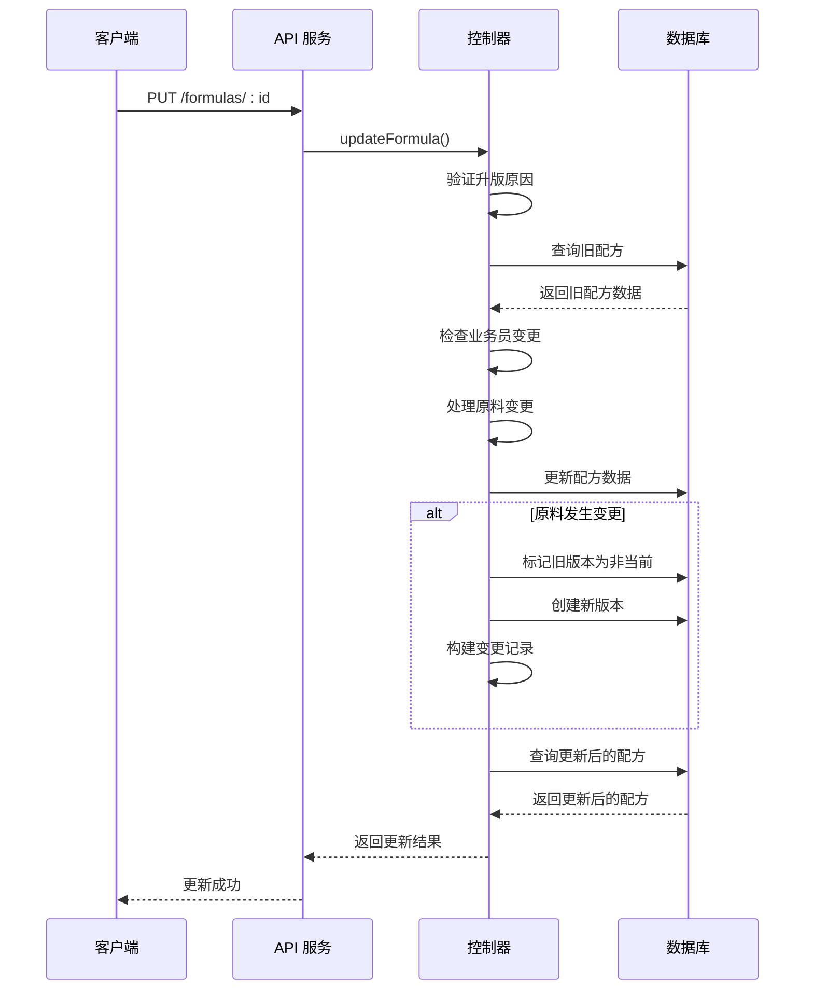

**图表来源**
- [backend/src/controllers/formulaController.ts:141-242](file://backend/src/controllers/formulaController.ts#L141-L242)

**章节来源**
- [backend/src/controllers/formulaController.ts:141-242](file://backend/src/controllers/formulaController.ts#L141-L242)

## 版本控制系统

### 版本管理架构

系统实现了完整的配方版本控制机制，支持版本的创建、发布和归档。

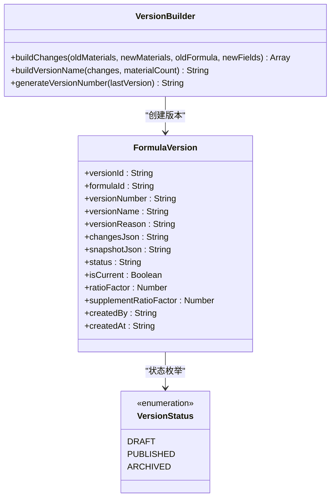

**图表来源**
- [backend/src/controllers/formulaController.ts:269-372](file://backend/src/controllers/formulaController.ts#L269-L372)
- [backend/src/scripts/init.sql:77-96](file://backend/src/scripts/init.sql#L77-L96)

### 版本变更追踪

系统能够精确追踪配方的每一次变更，包括配方参数和原料清单的修改。

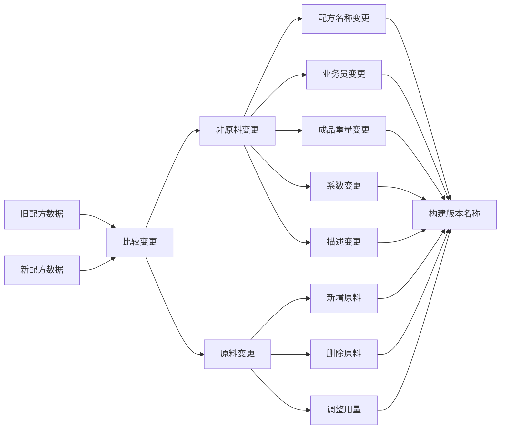

**图表来源**
- [backend/src/controllers/formulaController.ts:269-323](file://backend/src/controllers/formulaController.ts#L269-L323)

**章节来源**
- [backend/src/controllers/formulaController.ts:269-372](file://backend/src/controllers/formulaController.ts#L269-L372)

## 数据模型设计

### 数据库表结构

系统使用 SQLite 作为数据存储，设计了专门的表结构来支持配方管理功能。

```mermaid
erDiagram
FORMULAS {
TEXT id PK
TEXT name
TEXT salesman_id FK
TEXT salesman_name
TEXT materials_json
REAL finished_weight
REAL ratio_factor
REAL supplement_ratio_factor
TEXT description
TEXT created_by
TEXT created_at
TEXT updated_at
}
SALES_MEN {
TEXT id PK
TEXT name
TEXT code
TEXT department
TEXT phone
TEXT email
TEXT status
TEXT created_by
TEXT created_at
TEXT updated_at
}
FORMULA_VERSIONS {
TEXT version_id PK
TEXT formula_id FK
TEXT version_number
TEXT version_name
TEXT version_reason
TEXT changes_json
TEXT snapshot_json
TEXT status
INTEGER is_current
REAL ratio_factor
REAL supplement_ratio_factor
TEXT created_by
TEXT created_at
}
MATERIALS {
TEXT id PK
TEXT name
TEXT code
TEXT unit
REAL stock
TEXT material_type
TEXT created_by
TEXT created_at
TEXT updated_at
}
FORMULAS }o--|| SALES_MEN : "关联"
FORMULAS ||--o{ FORMULA_VERSIONS : "拥有"
FORMULAS ||--o{ MATERIALS : "包含"
```

**图表来源**
- [backend/src/scripts/init.sql:32-96](file://backend/src/scripts/init.sql#L32-L96)

### 关键约束和索引

系统通过数据库约束确保数据完整性，并通过索引提升查询性能。

**章节来源**
- [backend/src/scripts/init.sql:1-200](file://backend/src/scripts/init.sql#L1-L200)

## 前端界面实现

### 配方列表页面

配方列表页面提供了完整的配方浏览和管理功能。

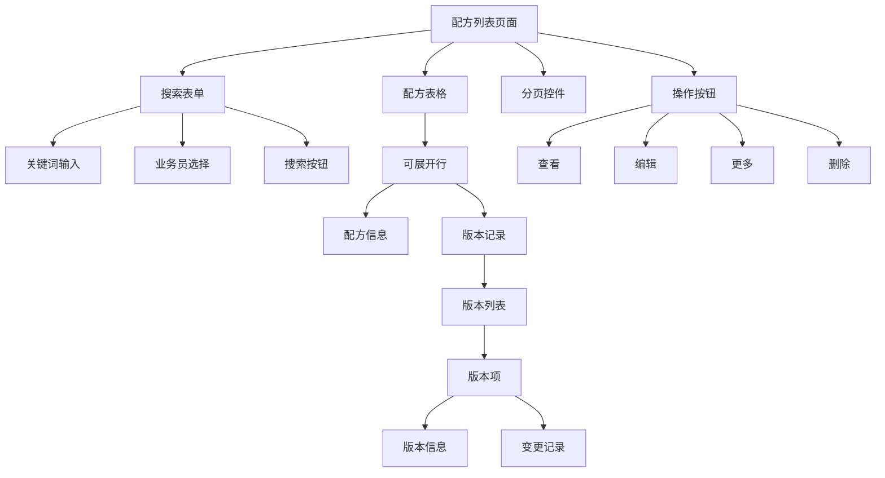

**图表来源**
- [frontend/src/views/formulas/FormulaList.vue:1-747](file://frontend/src/views/formulas/FormulaList.vue#L1-L747)

### 配方表单页面

配方表单页面提供了直观的配方编辑体验。

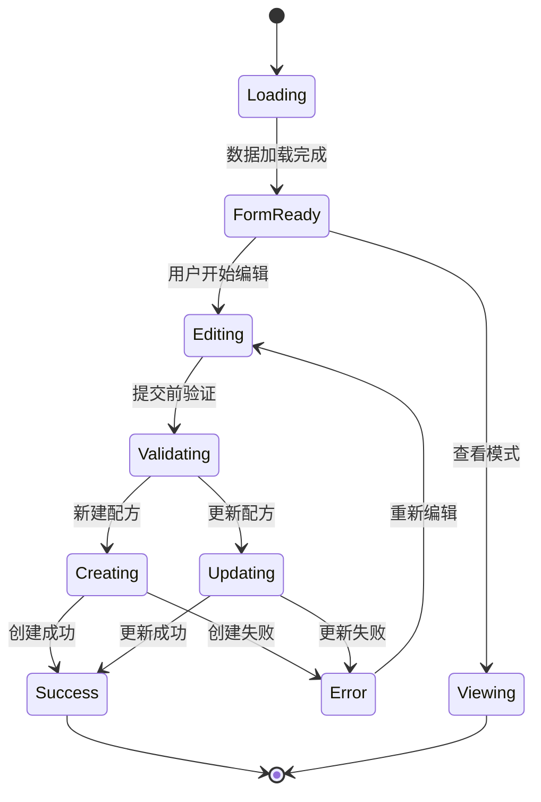

**图表来源**
- [frontend/src/views/formulas/FormulaForm.vue:1-422](file://frontend/src/views/formulas/FormulaForm.vue#L1-L422)

**章节来源**
- [frontend/src/views/formulas/FormulaList.vue:1-747](file://frontend/src/views/formulas/FormulaList.vue#L1-L747)
- [frontend/src/views/formulas/FormulaForm.vue:1-422](file://frontend/src/views/formulas/FormulaForm.vue#L1-L422)

## 性能优化策略

### 数据库查询优化

系统通过合理的索引设计和查询优化来提升性能。

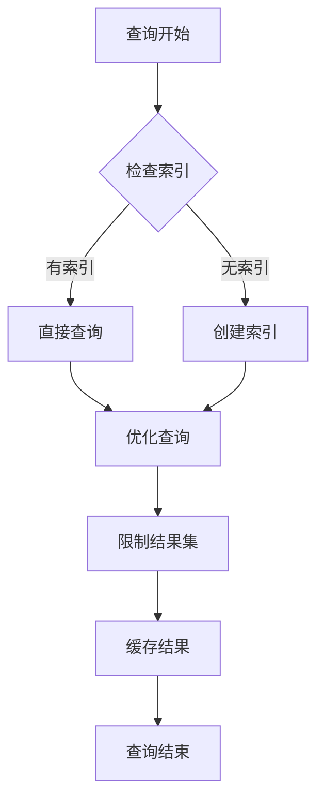

### 前端性能优化

前端采用了多种优化策略来提升用户体验。

**章节来源**
- [backend/src/config/database.ts:1-70](file://backend/src/config/database.ts#L1-L70)
- [frontend/src/stores/formula.ts:1-166](file://frontend/src/stores/formula.ts#L1-L166)

## 故障排查指南

### 常见问题诊断

系统提供了完善的错误处理和日志记录机制。

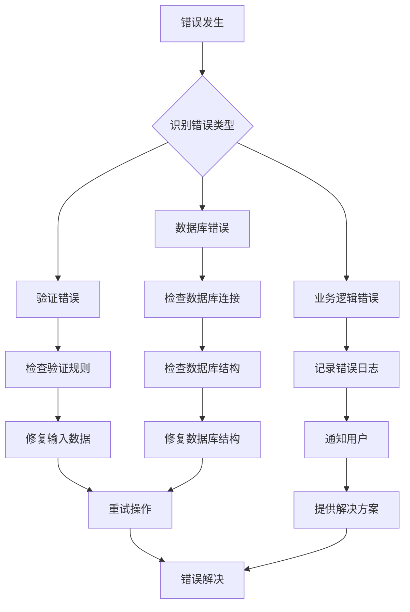

### 错误处理机制

系统在各个层面都实现了错误处理机制。

**章节来源**
- [backend/src/controllers/formulaController.ts:73-75](file://backend/src/controllers/formulaController.ts#L73-L75)
- [backend/src/middleware/validate.ts:60-66](file://backend/src/middleware/validate.ts#L60-L66)

## 总结

TingStudio 配方管理系统通过精心设计的架构和完整的功能实现，为用户提供了一个强大而易用的配方管理平台。系统的主要优势包括：

1. **完整的功能覆盖**：从基础的 CRUD 操作到复杂的版本控制和营养分析
2. **良好的用户体验**：直观的界面设计和流畅的操作体验
3. **可靠的数据管理**：严格的验证机制和完整的数据备份
4. **可扩展的架构**：模块化的代码结构便于功能扩展和维护

未来可以考虑的功能增强方向包括：
- 增强移动端适配能力
- 添加配方导入导出功能
- 实现配方审批流程
- 集成更多的营养分析算法