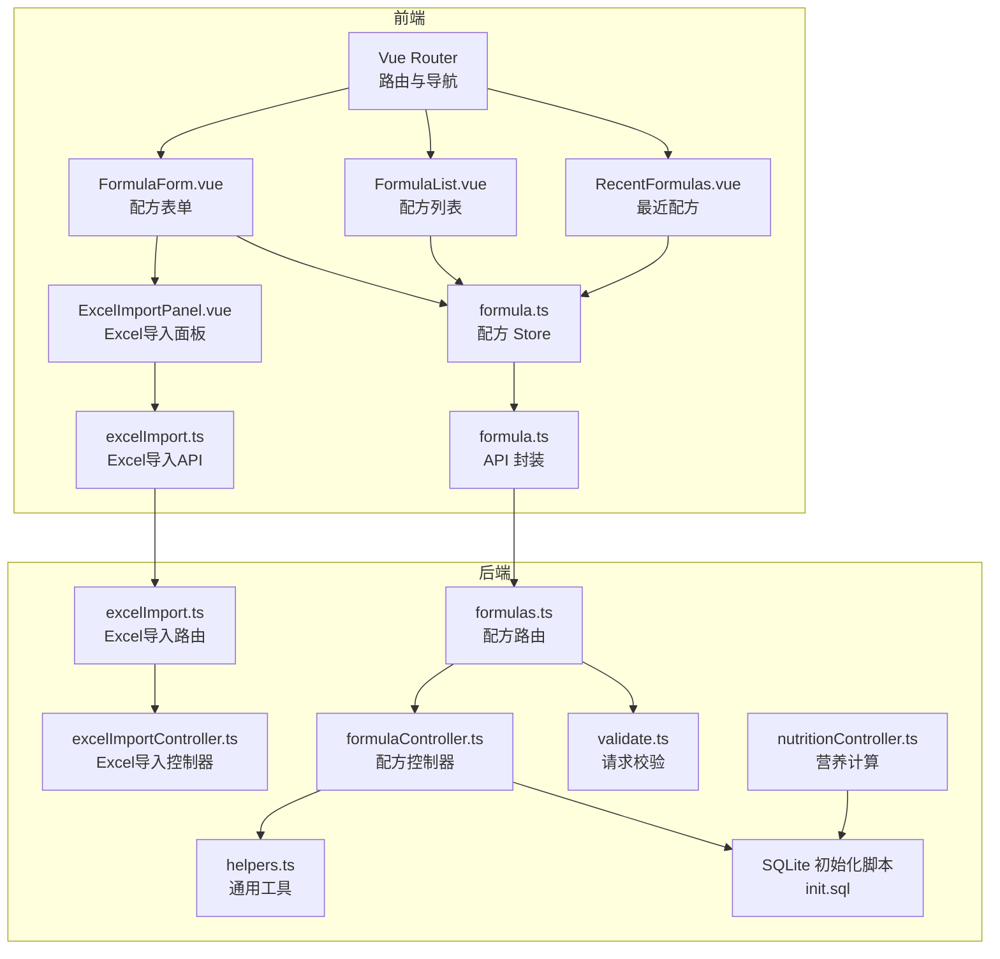
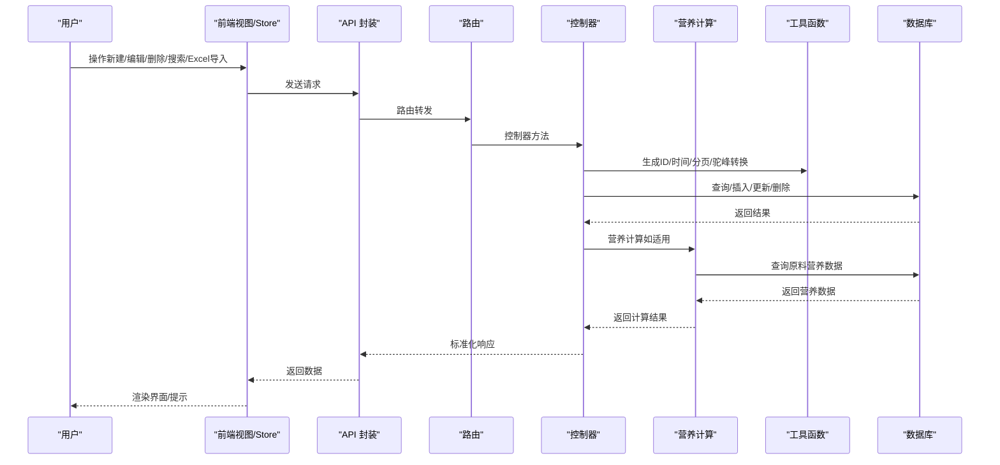
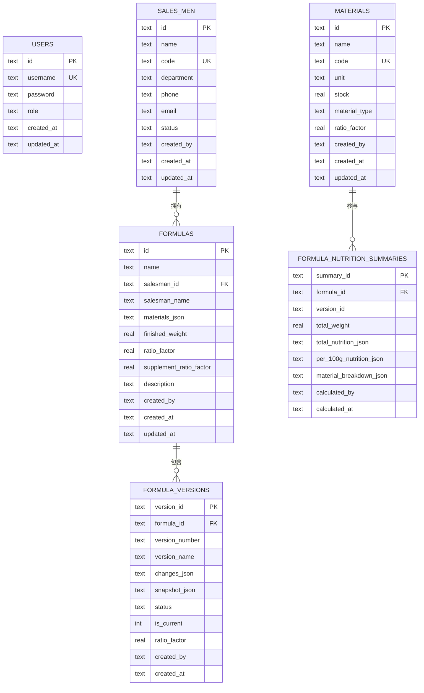
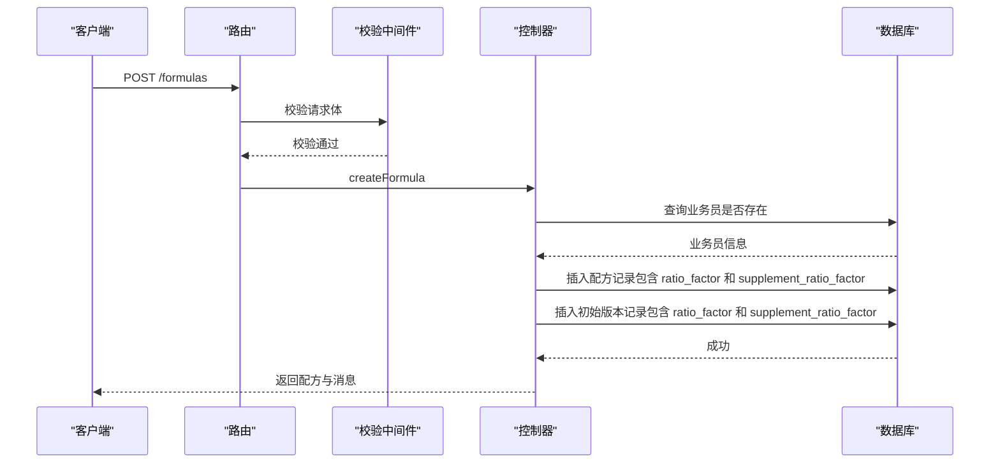
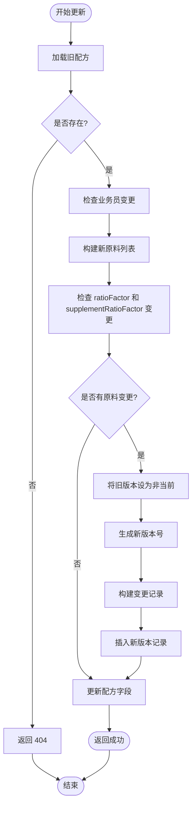
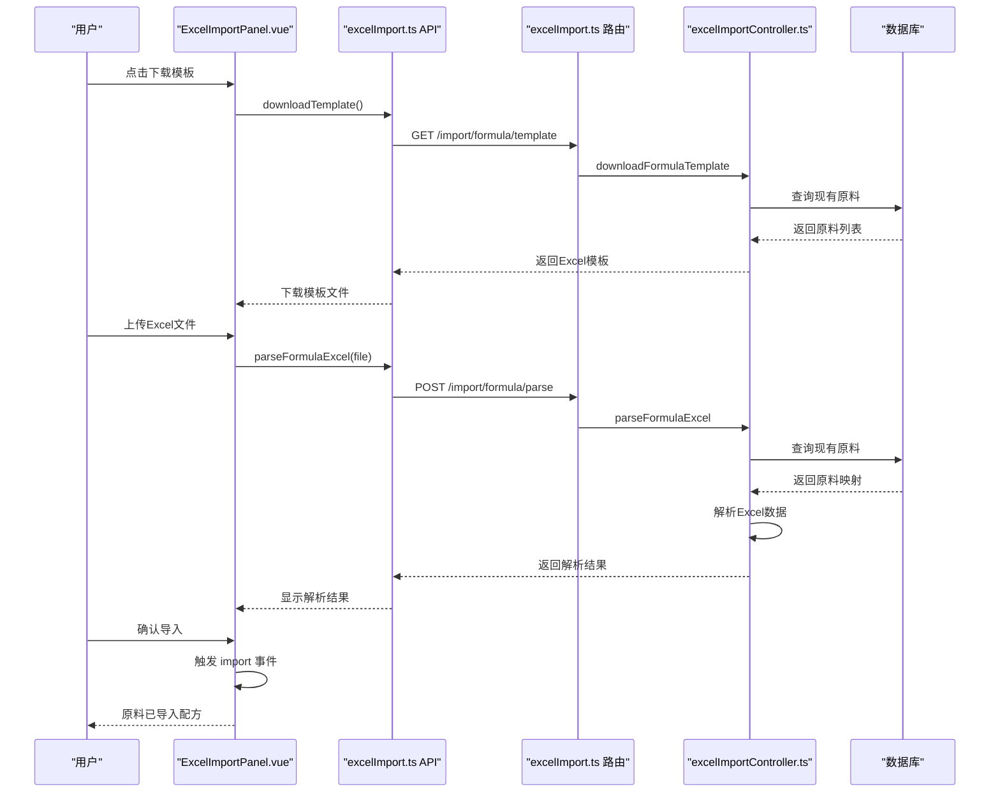
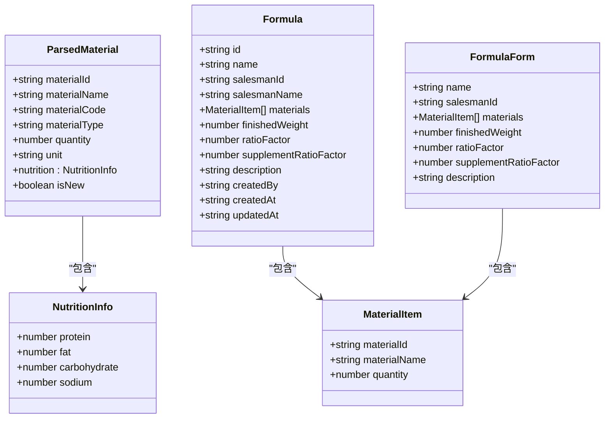
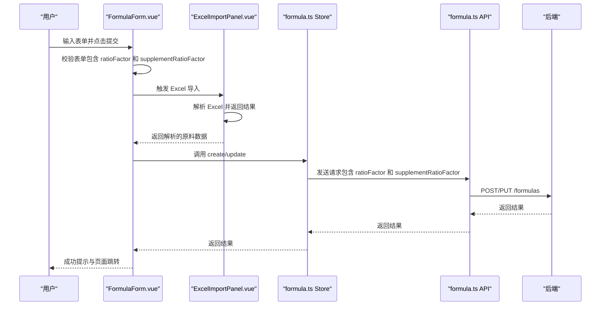
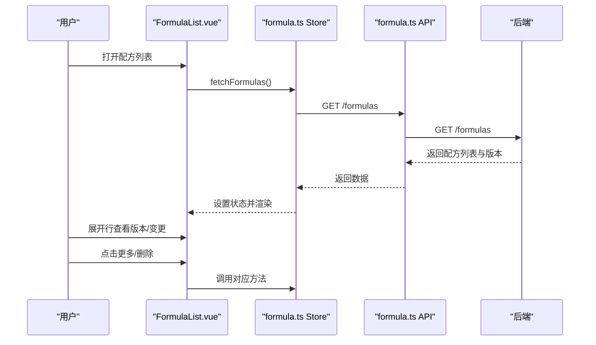
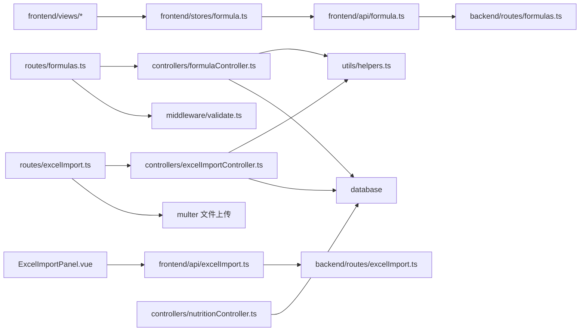

# 配方管理系统

<cite>
**本文引用的文件**
- [backend/src/controllers/formulaController.ts](file://backend/src/controllers/formulaController.ts)
- [backend/src/controllers/excelImportController.ts](file://backend/src/controllers/excelImportController.ts)
- [backend/src/routes/formulas.ts](file://backend/src/routes/formulas.ts)
- [backend/src/routes/excelImport.ts](file://backend/src/routes/excelImport.ts)
- [backend/src/utils/helpers.ts](file://backend/src/utils/helpers.ts)
- [backend/src/middleware/validate.ts](file://backend/src/middleware/validate.ts)
- [backend/src/scripts/init.sql](file://backend/src/scripts/init.sql)
- [backend/src/scripts/migrate-ratio-factor.ts](file://backend/src/scripts/migrate-ratio-factor.ts)
- [backend/src/controllers/nutritionController.ts](file://backend/src/controllers/nutritionController.ts)
- [frontend/src/views/formulas/FormulaForm.vue](file://frontend/src/views/formulas/FormulaForm.vue)
- [frontend/src/views/formulas/FormulaList.vue](file://frontend/src/views/formulas/FormulaList.vue)
- [frontend/src/views/formulas/RecentFormulas.vue](file://frontend/src/views/formulas/RecentFormulas.vue)
- [frontend/src/components/ExcelImportPanel.vue](file://frontend/src/components/ExcelImportPanel.vue)
- [frontend/src/stores/formula.ts](file://frontend/src/stores/formula.ts)
- [frontend/src/api/formula.ts](file://frontend/src/api/formula.ts)
- [frontend/src/api/excelImport.ts](file://frontend/src/api/excelImport.ts)
- [frontend/src/types/formula.ts](file://frontend/src/types/formula.ts)
- [frontend/src/router/index.ts](file://frontend/src/router/index.ts)
</cite>

## 目录
1. [简介](#简介)
2. [项目结构](#项目结构)
3. [核心组件](#核心组件)
4. [架构总览](#架构总览)
5. [详细组件分析](#详细组件分析)
6. [依赖关系分析](#依赖关系分析)
7. [性能考虑](#性能考虑)
8. [故障排除指南](#故障排除指南)
9. [结论](#结论)
10. [附录](#附录)

## 简介
本文件为 TingStudio 配方管理系统的功能文档，覆盖配方数据模型、配方创建流程、原料配置逻辑、后端控制器的复杂业务处理（含原料比例计算、配方验证与数据完整性检查）、前端组件实现（配方表单、原料添加管理、配方搜索与最近使用记录）、配方的保存/编辑/删除/批量操作，以及最佳实践、性能优化建议与扩展开发指导。文档以代码为依据，结合可视化图示帮助读者快速理解系统架构与实现细节。

**更新** 本版本新增了配方含量比系数（ratioFactor）功能，用于营养成分计算的精确控制。同时集成了Excel导入面板，用户可以通过Excel模板批量导入配方数据，大幅提升了配方创建效率。

## 项目结构
系统采用前后端分离架构：
- 后端基于 Express + TypeScript，提供 REST API，包含认证、校验、数据库访问与工具函数。
- 前端基于 Vue 3 + TDesign，使用 Pinia 状态管理，通过 API 层与后端交互。
- 数据库为 SQLite，通过初始化脚本定义配方、业务员、配方版本、导出、营养等核心表结构。

**图表来源**
- [frontend/src/router/index.ts:1-165](file://frontend/src/router/index.ts#L1-L165)
- [frontend/src/views/formulas/FormulaForm.vue:1-445](file://frontend/src/views/formulas/FormulaForm.vue#L1-L445)
- [frontend/src/views/formulas/FormulaList.vue:1-741](file://frontend/src/views/formulas/FormulaList.vue#L1-L741)
- [frontend/src/views/formulas/RecentFormulas.vue:1-284](file://frontend/src/views/formulas/RecentFormulas.vue#L1-L284)
- [frontend/src/components/ExcelImportPanel.vue:1-339](file://frontend/src/components/ExcelImportPanel.vue#L1-L339)
- [frontend/src/stores/formula.ts:1-166](file://frontend/src/stores/formula.ts#L1-L166)
- [frontend/src/api/formula.ts:1-67](file://frontend/src/api/formula.ts#L1-L67)
- [frontend/src/api/excelImport.ts:1-55](file://frontend/src/api/excelImport.ts#L1-L55)
- [backend/src/routes/formulas.ts:1-28](file://backend/src/routes/formulas.ts#L1-L28)
- [backend/src/routes/excelImport.ts:1-42](file://backend/src/routes/excelImport.ts#L1-L42)
- [backend/src/controllers/formulaController.ts:1-290](file://backend/src/controllers/formulaController.ts#L1-L290)
- [backend/src/controllers/excelImportController.ts:1-226](file://backend/src/controllers/excelImportController.ts#L1-L226)
- [backend/src/middleware/validate.ts:1-68](file://backend/src/middleware/validate.ts#L1-L68)
- [backend/src/utils/helpers.ts:1-86](file://backend/src/utils/helpers.ts#L1-L86)
- [backend/src/scripts/init.sql:1-229](file://backend/src/scripts/init.sql#L1-L229)
- [backend/src/controllers/nutritionController.ts:1-641](file://backend/src/controllers/nutritionController.ts#L1-L641)

**章节来源**
- [frontend/src/router/index.ts:1-165](file://frontend/src/router/index.ts#L1-L165)
- [backend/src/scripts/init.sql:1-229](file://backend/src/scripts/init.sql#L1-L229)

## 核心组件
- 后端控制器：负责配方的增删改查、版本管理、按原料检索、变更记录构建等。
- Excel导入控制器：提供Excel模板下载和配方数据解析功能，支持批量原料导入。
- 路由层：统一鉴权中间件，定义配方 API 和 Excel导入 API 的路径与参数校验规则。
- 前端 Store：封装配方列表、详情、创建/更新/删除等操作，统一解析 JSON 字段与格式化时间。
- 前端视图：配方表单（含原料选择与数量输入、含量比系数输入、Excel导入面板）、配方列表（含展开行显示版本与变更）、最近配方展示。
- Excel导入面板：提供Excel模板下载、文件上传解析、导入结果预览与确认功能。
- 数据模型：配方、原料、版本、描述字段的 JSON 结构解析与兼容处理。
- 营养计算模块：基于配方的含量比系数进行精确的营养成分计算。

**章节来源**
- [backend/src/controllers/formulaController.ts:1-290](file://backend/src/controllers/formulaController.ts#L1-L290)
- [backend/src/controllers/excelImportController.ts:1-226](file://backend/src/controllers/excelImportController.ts#L1-L226)
- [backend/src/routes/formulas.ts:1-28](file://backend/src/routes/formulas.ts#L1-L28)
- [backend/src/routes/excelImport.ts:1-42](file://backend/src/routes/excelImport.ts#L1-L42)
- [frontend/src/stores/formula.ts:1-166](file://frontend/src/stores/formula.ts#L1-L166)
- [frontend/src/views/formulas/FormulaForm.vue:1-445](file://frontend/src/views/formulas/FormulaForm.vue#L1-L445)
- [frontend/src/views/formulas/FormulaList.vue:1-741](file://frontend/src/views/formulas/FormulaList.vue#L1-L741)
- [frontend/src/views/formulas/RecentFormulas.vue:1-284](file://frontend/src/views/formulas/RecentFormulas.vue#L1-L284)
- [frontend/src/components/ExcelImportPanel.vue:1-339](file://frontend/src/components/ExcelImportPanel.vue#L1-L339)
- [frontend/src/types/formula.ts:1-33](file://frontend/src/types/formula.ts#L1-L33)
- [backend/src/controllers/nutritionController.ts:1-641](file://backend/src/controllers/nutritionController.ts#L1-L641)

## 架构总览
后端控制器在接收请求后，先通过鉴权中间件与自定义校验中间件进行安全与参数校验，随后调用数据库访问与工具函数完成业务处理。前端通过 API 层封装请求，Store 统一处理响应数据，视图组件负责渲染与交互。

**图表来源**
- [backend/src/controllers/formulaController.ts:1-290](file://backend/src/controllers/formulaController.ts#L1-L290)
- [backend/src/controllers/excelImportController.ts:1-226](file://backend/src/controllers/excelImportController.ts#L1-L226)
- [backend/src/routes/formulas.ts:1-28](file://backend/src/routes/formulas.ts#L1-L28)
- [backend/src/routes/excelImport.ts:1-42](file://backend/src/routes/excelImport.ts#L1-L42)
- [backend/src/middleware/validate.ts:1-68](file://backend/src/middleware/validate.ts#L1-L68)
- [backend/src/utils/helpers.ts:1-86](file://backend/src/utils/helpers.ts#L1-L86)
- [frontend/src/api/formula.ts:1-67](file://frontend/src/api/formula.ts#L1-L67)
- [frontend/src/api/excelImport.ts:1-55](file://frontend/src/api/excelImport.ts#L1-L55)
- [frontend/src/stores/formula.ts:1-166](file://frontend/src/stores/formula.ts#L1-L166)
- [backend/src/controllers/nutritionController.ts:1-641](file://backend/src/controllers/nutritionController.ts#L1-L641)

## 详细组件分析

### 数据模型与表结构
- 配方表（formulas）：存储配方基本信息、业务员关联、原料 JSON、成品重量、含量比系数、描述、创建者与时间戳。
- 配方版本表（formula_versions）：记录每次变更的版本号、快照、变更明细、状态与是否当前版本，包含含量比系数字段。
- 原料表（materials）：包含单位、类型、比例因子等，用于后续可能的比例计算与营养分析。
- 业务员表（salesmen）：与配方建立外键约束，确保业务员存在性。

**更新** 配方表和版本表现在都包含 `ratio_factor` 字段，默认值为 0.18，用于营养成分计算。同时新增了 `supplement_ratio_factor` 字段，用于辅料的特殊计算。

**图表来源**
- [backend/src/scripts/init.sql:33-49](file://backend/src/scripts/init.sql#L33-L49)
- [backend/src/scripts/init.sql:76-91](file://backend/src/scripts/init.sql#L76-L91)
- [backend/src/scripts/init.sql:172-198](file://backend/src/scripts/init.sql#L172-L198)

**章节来源**
- [backend/src/scripts/init.sql:33-49](file://backend/src/scripts/init.sql#L33-L49)
- [backend/src/scripts/init.sql:76-91](file://backend/src/scripts/init.sql#L76-L91)
- [backend/src/scripts/init.sql:172-198](file://backend/src/scripts/init.sql#L172-L198)

### 配方创建流程与业务逻辑
- 参数校验：路由层对配方名称、业务员、原料列表、成品重量、含量比系数进行必填与类型校验。
- 业务员校验：创建时需确保业务员存在，否则返回错误。
- 原料处理：前端传入的原料包含 materialId、materialName、quantity；控制器会补充 materialName（若缺失），并以 JSON 存储到 materials_json。
- 含量比系数：创建时支持指定 `ratioFactor` 和 `supplementRatioFactor` 参数，未指定时使用默认值 0.18 和 1.0。
- 版本管理：创建成功后自动创建初始版本（状态为已发布，标记为当前版本），快照包含配方完整数据，包含 `ratio_factor` 和 `supplement_ratio_factor` 字段。
- 响应：返回创建成功的配方信息。

**更新** 新增了 `ratioFactor` 和 `supplementRatioFactor` 参数的处理，支持自定义含量比系数。

**图表来源**
- [backend/src/routes/formulas.ts:14-24](file://backend/src/routes/formulas.ts#L14-L24)
- [backend/src/middleware/validate.ts:16-67](file://backend/src/middleware/validate.ts#L16-L67)
- [backend/src/controllers/formulaController.ts:88-130](file://backend/src/controllers/formulaController.ts#L88-L130)

**章节来源**
- [backend/src/routes/formulas.ts:14-24](file://backend/src/routes/formulas.ts#L14-L24)
- [backend/src/middleware/validate.ts:16-67](file://backend/src/middleware/validate.ts#L16-L67)
- [backend/src/controllers/formulaController.ts:88-130](file://backend/src/controllers/formulaController.ts#L88-L130)

### 配方更新流程与版本变更
- 旧数据加载：根据 id 加载旧配方，若不存在则返回 404。
- 业务员变更：若更新了 salesmanId，需重新查询业务员名称。
- 原料变更：若 materials 为空表示不更新原料；否则构建变更记录（新增/删除/修改）。
- 含量比系数：若 `ratioFactor` 或 `supplementRatioFactor` 未指定，保持原有值；若指定则更新为新值。
- 版本策略：每次变更都会将旧"当前版本"标记为非当前，生成新版本号（基于最新版本号递增），并写入 changes_json 与 snapshot_json，包含 `ratio_factor` 和 `supplement_ratio_factor` 字段。
- 响应：返回更新后的配方信息。

**更新** 更新流程现在支持 `ratioFactor` 和 `supplementRatioFactor` 字段的动态更新，并在版本快照中保留这些字段。

**图表来源**
- [backend/src/controllers/formulaController.ts:132-218](file://backend/src/controllers/formulaController.ts#L132-L218)
- [backend/src/controllers/formulaController.ts:245-286](file://backend/src/controllers/formulaController.ts#L245-L286)

**章节来源**
- [backend/src/controllers/formulaController.ts:132-218](file://backend/src/controllers/formulaController.ts#L132-L218)
- [backend/src/controllers/formulaController.ts:245-286](file://backend/src/controllers/formulaController.ts#L245-L286)

### Excel导入功能与批量处理

#### Excel导入面板组件
- 模板下载：提供完整的Excel模板文件，包含必填字段说明和示例数据。
- 文件上传：支持 .xlsx 和 .xls 格式，文件大小限制5MB。
- 数据解析：自动读取Excel内容，验证必填字段和数据格式。
- 匹配机制：根据原料名称或编码自动匹配现有原料，支持新原料识别。
- 结果展示：提供详细的解析摘要、错误列表、警告信息和缺失原料提示。
- 确认导入：用户确认后将解析的原料数据直接填充到配方表单。

#### Excel导入流程
- 模板生成：后端生成包含表头、示例数据和使用说明的工作簿。
- 数据验证：检查必填字段（原料名称、原料类型、数量），验证数据类型和范围。
- 原料匹配：优先按名称匹配，其次按编码匹配，支持模糊匹配。
- 错误处理：记录解析错误和警告信息，提供详细的错误定位。
- 结果返回：返回解析结果、统计信息和缺失原料列表。

**新增** Excel导入功能大幅提升了配方创建效率，支持批量原料导入和智能匹配。

**图表来源**
- [frontend/src/components/ExcelImportPanel.vue:167-250](file://frontend/src/components/ExcelImportPanel.vue#L167-L250)
- [frontend/src/api/excelImport.ts:36-54](file://frontend/src/api/excelImport.ts#L36-L54)
- [backend/src/routes/excelImport.ts:35-39](file://backend/src/routes/excelImport.ts#L35-L39)
- [backend/src/controllers/excelImportController.ts:52-103](file://backend/src/controllers/excelImportController.ts#L52-L103)
- [backend/src/controllers/excelImportController.ts:105-225](file://backend/src/controllers/excelImportController.ts#L105-L225)

**章节来源**
- [frontend/src/components/ExcelImportPanel.vue:1-339](file://frontend/src/components/ExcelImportPanel.vue#L1-L339)
- [frontend/src/api/excelImport.ts:1-55](file://frontend/src/api/excelImport.ts#L1-L55)
- [backend/src/controllers/excelImportController.ts:1-226](file://backend/src/controllers/excelImportController.ts#L1-L226)
- [backend/src/routes/excelImport.ts:1-42](file://backend/src/routes/excelImport.ts#L1-L42)

### 原料配置逻辑与比例计算
- 原料选择：前端表单支持远程搜索与本地过滤，选择后自动回填名称。
- 数量输入：支持数值输入与最小值限制，保证数量有效。
- 含量比系数：前端表单支持输入 `ratioFactor` 和 `supplementRatioFactor`，分别用于主料和辅料的营养计算。
- 原料比例：数据库中每种原料包含 ratio_factor 字段，可用于后续比例计算与营养分析。
- 原料变更记录：更新时通过 buildChanges 对比新旧原料，生成变更类型与字段标签。

**更新** 新增了 `ratioFactor` 和 `supplementRatioFactor` 字段的输入和验证，支持用户自定义含量比系数。

**图表来源**
- [frontend/src/types/formula.ts:1-33](file://frontend/src/types/formula.ts#L1-L33)
- [frontend/src/api/excelImport.ts:6-34](file://frontend/src/api/excelImport.ts#L6-L34)
- [frontend/src/views/formulas/FormulaForm.vue:191-227](file://frontend/src/views/formulas/FormulaForm.vue#L191-L227)
- [backend/src/controllers/formulaController.ts:103-105](file://backend/src/controllers/formulaController.ts#L103-L105)

**章节来源**
- [frontend/src/views/formulas/FormulaForm.vue:191-227](file://frontend/src/views/formulas/FormulaForm.vue#L191-L227)
- [frontend/src/types/formula.ts:1-33](file://frontend/src/types/formula.ts#L1-L33)
- [frontend/src/api/excelImport.ts:6-34](file://frontend/src/api/excelImport.ts#L6-L34)
- [backend/src/scripts/init.sql:17-29](file://backend/src/scripts/init.sql#L17-L29)

### 营养计算与含量比系数
- 营养计算：基于配方的 `finishedWeight` 和 `ratioFactor` 进行精确计算。
- 含量比公式：`含量比 = quantity / finishedWeight * ratioFactor`。
- 默认值策略：纯药材配方使用 0.18，含辅料配方使用 1.0。
- 辅料特殊处理：辅料使用 `supplementRatioFactor` 进行特殊计算，范围通常为0.5-1.5。
- 计算精度：结果保留适当的小数位数，确保计算准确性。

**新增** 营养计算模块现在使用配方级别的 `ratioFactor` 和 `supplementRatioFactor` 字段进行精确的营养成分计算。

**章节来源**
- [backend/src/controllers/nutritionController.ts:496-500](file://backend/src/controllers/nutritionController.ts#L496-L500)
- [backend/src/scripts/migrate-ratio-factor.ts:92-94](file://backend/src/scripts/migrate-ratio-factor.ts#L92-L94)

### 前端组件实现

#### 配方表单设计
- 表单字段：配方名称、所属业务员、成品重量、含量比系数、原料清单、配方描述。
- 含量比系数输入：支持 0-2 范围内的数值输入，默认 0.18，用于营养计算。
- Excel导入面板：集成Excel导入功能，支持模板下载和批量原料导入。
- 原料管理：支持动态添加/删除原料，远程搜索与本地过滤，自动回填原料名称。
- 校验规则：必填校验、数量有效性校验、含量比系数范围校验、至少一种原料。
- 提交流程：区分新建与编辑，调用 Store 的 create/update 方法，成功后跳转列表。

**更新** 配方表单现在包含 `ratioFactor` 和 `supplementRatioFactor` 字段的输入控件，支持用户自定义含量比系数。

**图表来源**
- [frontend/src/views/formulas/FormulaForm.vue:254-277](file://frontend/src/views/formulas/FormulaForm.vue#L254-L277)
- [frontend/src/views/formulas/FormulaForm.vue:327-336](file://frontend/src/views/formulas/FormulaForm.vue#L327-L336)
- [frontend/src/stores/formula.ts:64-88](file://frontend/src/stores/formula.ts#L64-L88)
- [frontend/src/api/formula.ts:45-64](file://frontend/src/api/formula.ts#L45-L64)

**章节来源**
- [frontend/src/views/formulas/FormulaForm.vue:1-445](file://frontend/src/views/formulas/FormulaForm.vue#L1-L445)
- [frontend/src/stores/formula.ts:64-88](file://frontend/src/stores/formula.ts#L64-L88)
- [frontend/src/api/formula.ts:45-64](file://frontend/src/api/formula.ts#L45-L64)

#### 配方列表与版本管理
- 列表展示：支持关键字与业务员筛选、分页、展开行显示版本与变更详情。
- 版本状态：根据当前版本状态显示不同标签（草稿/已发布/已归档）。
- 操作按钮：查看、编辑、更多（版本管理/营养分析/导出）与删除。

**图表来源**
- [frontend/src/views/formulas/FormulaList.vue:184-356](file://frontend/src/views/formulas/FormulaList.vue#L184-L356)
- [frontend/src/stores/formula.ts:18-44](file://frontend/src/stores/formula.ts#L18-L44)
- [frontend/src/api/formula.ts:45-64](file://frontend/src/api/formula.ts#L45-L64)

**章节来源**
- [frontend/src/views/formulas/FormulaList.vue:1-741](file://frontend/src/views/formulas/FormulaList.vue#L1-L741)
- [frontend/src/stores/formula.ts:18-44](file://frontend/src/stores/formula.ts#L18-L44)

#### 最近使用记录功能
- 最近配方：按更新时间倒序取前 N 条，支持查看与编辑。
- 交互：空状态引导创建配方，支持全局搜索联动。

**章节来源**
- [frontend/src/views/formulas/RecentFormulas.vue:1-284](file://frontend/src/views/formulas/RecentFormulas.vue#L1-L284)

### 配方搜索与按原料检索
- 关键字搜索：支持配方名称与业务员名称模糊匹配。
- 按原料检索：根据原料 ID 在配方 JSON 中进行 LIKE 查询，返回匹配配方列表。
- 前端联动：搜索框事件通过全局事件触发，Store 重置分页并刷新列表。

**章节来源**
- [backend/src/controllers/formulaController.ts:6-69](file://backend/src/controllers/formulaController.ts#L6-L69)
- [backend/src/controllers/formulaController.ts:231-243](file://backend/src/controllers/formulaController.ts#L231-L243)
- [frontend/src/views/formulas/FormulaList.vue:284-307](file://frontend/src/views/formulas/FormulaList.vue#L284-L307)

### 保存、编辑、删除与批量操作
- 保存/编辑：通过表单提交，控制器进行参数校验与业务处理，前端 Store 统一刷新列表。
- 删除：弹窗确认后调用删除接口，成功后刷新列表。
- 批量操作：当前实现未提供批量勾选与批量删除功能，可在前端增加多选与批量操作按钮，后端路由层扩展批量接口。

**章节来源**
- [frontend/src/views/formulas/FormulaList.vue:334-355](file://frontend/src/views/formulas/FormulaList.vue#L334-L355)
- [frontend/src/stores/formula.ts:90-101](file://frontend/src/stores/formula.ts#L90-L101)

## 依赖关系分析
- 路由依赖：formulas 路由依赖 auth 中间件与 validate 中间件；excelImport 路由依赖 auth 中间件与 multer 文件上传中间件。
- 控制器依赖：helpers 工具函数（ID 生成、时间、分页、驼峰转换、JSON 安全解析）。
- 前端依赖：API 封装与 Store，Store 依赖分页 Store 与时间格式化工具。
- Excel导入依赖：ExcelImportPanel 依赖 excelImport API，excelImport API 依赖 HTTP 客户端。
- 营养计算依赖：营养计算模块依赖配方的 `ratioFactor` 和 `supplementRatioFactor` 字段进行精确计算。

**更新** 新增了Excel导入功能的依赖关系分析。

**图表来源**
- [backend/src/routes/formulas.ts:1-28](file://backend/src/routes/formulas.ts#L1-L28)
- [backend/src/routes/excelImport.ts:1-42](file://backend/src/routes/excelImport.ts#L1-L42)
- [backend/src/controllers/formulaController.ts:1-6](file://backend/src/controllers/formulaController.ts#L1-L6)
- [backend/src/controllers/excelImportController.ts:1-8](file://backend/src/controllers/excelImportController.ts#L1-L8)
- [backend/src/middleware/validate.ts:1-68](file://backend/src/middleware/validate.ts#L1-L68)
- [frontend/src/api/formula.ts:1-67](file://frontend/src/api/formula.ts#L1-L67)
- [frontend/src/api/excelImport.ts:1-55](file://frontend/src/api/excelImport.ts#L1-L55)
- [frontend/src/stores/formula.ts:1-166](file://frontend/src/stores/formula.ts#L1-L166)
- [frontend/src/components/ExcelImportPanel.vue:145-154](file://frontend/src/components/ExcelImportPanel.vue#L145-L154)
- [backend/src/controllers/nutritionController.ts:1-641](file://backend/src/controllers/nutritionController.ts#L1-L641)

**章节来源**
- [backend/src/routes/formulas.ts:1-28](file://backend/src/routes/formulas.ts#L1-L28)
- [backend/src/routes/excelImport.ts:1-42](file://backend/src/routes/excelImport.ts#L1-L42)
- [backend/src/utils/helpers.ts:1-86](file://backend/src/utils/helpers.ts#L1-L86)
- [frontend/src/api/formula.ts:1-67](file://frontend/src/api/formula.ts#L1-L67)
- [frontend/src/api/excelImport.ts:1-55](file://frontend/src/api/excelImport.ts#L1-L55)
- [frontend/src/stores/formula.ts:1-166](file://frontend/src/stores/formula.ts#L1-L166)
- [frontend/src/components/ExcelImportPanel.vue:145-154](file://frontend/src/components/ExcelImportPanel.vue#L145-L154)
- [backend/src/controllers/nutritionController.ts:1-641](file://backend/src/controllers/nutritionController.ts#L1-L641)

## 性能考虑
- 分页与索引：后端使用分页工具函数限制每页最大条数；数据库为关键列建立索引（配方名、业务员、创建人、版本号组合索引）。
- 批量查询：列表页一次性查询配方与其版本映射，减少 N+1 查询。
- 前端缓存：Store 中统一解析 JSON 与格式化时间，避免重复计算。
- 搜索优化：LIKE 查询配合转义与索引，建议对常用搜索字段建立复合索引。
- 版本对比：变更记录仅在展开行时解析，避免不必要的 JSON 解析。
- 营养计算优化：含量比系数计算使用整型运算，避免浮点数精度问题。
- Excel导入优化：文件上传使用内存存储限制5MB，解析时使用Map进行原料匹配，提高查找效率。

**更新** 新增了Excel导入功能的性能优化考虑。

**章节来源**
- [backend/src/utils/helpers.ts:13-19](file://backend/src/utils/helpers.ts#L13-L19)
- [backend/src/scripts/init.sql:47-49](file://backend/src/scripts/init.sql#L47-L49)
- [backend/src/scripts/init.sql:90-91](file://backend/src/scripts/init.sql#L90-L91)
- [frontend/src/stores/formula.ts:29-36](file://frontend/src/stores/formula.ts#L29-L36)
- [backend/src/controllers/nutritionController.ts:496-500](file://backend/src/controllers/nutritionController.ts#L496-L500)
- [backend/src/controllers/excelImportController.ts:123-129](file://backend/src/controllers/excelImportController.ts#L123-L129)

## 故障排除指南
- 参数校验失败：检查请求体字段类型与长度，确保必填字段完整。
- 业务员不存在：创建/更新时需确保 salesmanId 对应的业务员存在。
- 配方不存在：更新/删除时需确认配方 id 是否正确。
- JSON 解析异常：描述字段可能为纯文本或 JSON，Store 中已做安全解析，如仍报错，检查后端写入格式。
- 权限问题：路由层启用鉴权中间件，未登录将被重定向至登录页。
- 含量比系数异常：检查 `ratioFactor` 和 `supplementRatioFactor` 是否在 0-2 范围内，超出范围将导致营养计算错误。
- Excel导入失败：检查文件格式是否为 .xlsx 或 .xls，文件大小是否超过5MB，模板字段是否符合要求。
- 原料匹配问题：Excel中的原料名称需要与系统中的名称完全匹配，注意大小写和特殊字符。

**更新** 新增了Excel导入和含量比系数相关的故障排除指导。

**章节来源**
- [backend/src/middleware/validate.ts:16-67](file://backend/src/middleware/validate.ts#L16-L67)
- [backend/src/controllers/formulaController.ts:95-100](file://backend/src/controllers/formulaController.ts#L95-L100)
- [backend/src/controllers/formulaController.ts:140-144](file://backend/src/controllers/formulaController.ts#L140-L144)
- [frontend/src/stores/formula.ts:146-165](file://frontend/src/stores/formula.ts#L146-L165)
- [frontend/src/router/index.ts:148-162](file://frontend/src/router/index.ts#L148-L162)
- [backend/src/controllers/excelImportController.ts:108-121](file://backend/src/controllers/excelImportController.ts#L108-L121)
- [frontend/src/components/ExcelImportPanel.vue:192-205](file://frontend/src/components/ExcelImportPanel.vue#L192-L205)

## 结论
TingStudio 的配方管理系统以清晰的前后端职责划分实现了配方的全生命周期管理：从表单录入、业务校验、版本控制到列表展示与搜索。系统具备良好的扩展性（版本号策略、变更记录、比例因子预留），并通过工具函数与中间件保障了数据一致性与安全性。

**更新** 新增的Excel导入功能和含量比系数功能显著提升了系统的易用性和精确性。Excel导入功能支持批量原料导入，大幅提高了配方创建效率；含量比系数功能为不同类型的配方（纯药材 vs 含辅料）提供了精确的计算支持。建议后续增强批量操作、导出模板与营养分析的深度集成，进一步提升用户体验与业务价值。

## 附录

### API 定义概览
- 获取配方列表：GET /formulas（支持 keyword、salesmanId、分页）
- 获取单个配方：GET /formulas/:id
- 创建配方：POST /formulas（body 包含 name、salesmanId、materials、finishedWeight、ratioFactor、supplementRatioFactor、description）
- 更新配方：PUT /formulas/:id（部分字段可更新，包括 ratioFactor、supplementRatioFactor）
- 删除配方：DELETE /formulas/:id
- 按原料检索：GET /formulas/by-material/:materialId
- 下载Excel模板：GET /import/formula/template
- 解析Excel文件：POST /import/formula/parse（multipart/form-data）

**更新** API 接口现在支持 `ratioFactor`、`supplementRatioFactor` 参数的传递和更新，以及Excel导入相关接口。

**章节来源**
- [backend/src/routes/formulas.ts:14-27](file://backend/src/routes/formulas.ts#L14-L27)
- [backend/src/routes/excelImport.ts:35-39](file://backend/src/routes/excelImport.ts#L35-L39)
- [frontend/src/api/formula.ts:45-64](file://frontend/src/api/formula.ts#L45-L64)
- [frontend/src/api/excelImport.ts:36-54](file://frontend/src/api/excelImport.ts#L36-L54)

### 最佳实践
- 前端：保持 Store 与 API 的职责单一，统一解析与格式化；对用户输入进行即时校验与反馈。
- 后端：严格使用中间件进行参数校验；对敏感操作（删除）增加二次确认；版本号生成遵循语义化规则。
- 数据库：为高频查询字段建立索引；描述字段采用 JSON 或纯文本时，前端需做兼容解析。
- 扩展开发：新增功能（如批量操作、导出模板、营养分析）应遵循现有路由与中间件模式，保持一致的错误处理与响应格式。
- 含量比系数：合理设置 `ratioFactor` 和 `supplementRatioFactor` 值，纯药材配方建议使用 0.18，含辅料配方建议使用 1.0。
- Excel导入：确保Excel模板字段与系统要求一致，注意数据格式和单位标准化。

**更新** 新增了Excel导入和含量比系数的最佳实践建议。

### 数据库迁移说明
- 新增 `ratio_factor` 字段：为 `formulas` 和 `formula_versions` 表添加 `ratio_factor` 字段，默认值为 0.18。
- 新增 `supplement_ratio_factor` 字段：为 `formulas` 和 `formula_versions` 表添加 `supplement_ratio_factor` 字段，默认值为 1.0。
- 数据迁移：根据配方中的原料类型自动设置合理的 `ratio_factor` 和 `supplement_ratio_factor` 值。
- 兼容性：现有数据会自动迁移，保持向后兼容。

**新增** 数据库迁移相关的说明文档。

**章节来源**
- [backend/src/scripts/migrate-ratio-factor.ts:1-149](file://backend/src/scripts/migrate-ratio-factor.ts#L1-L149)
- [backend/src/scripts/init.sql:33-49](file://backend/src/scripts/init.sql#L33-L49)
- [backend/src/scripts/init.sql:76-91](file://backend/src/scripts/init.sql#L76-L91)