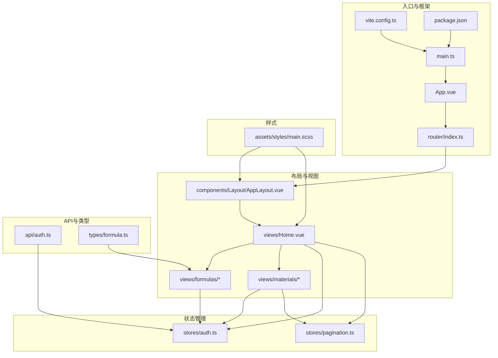
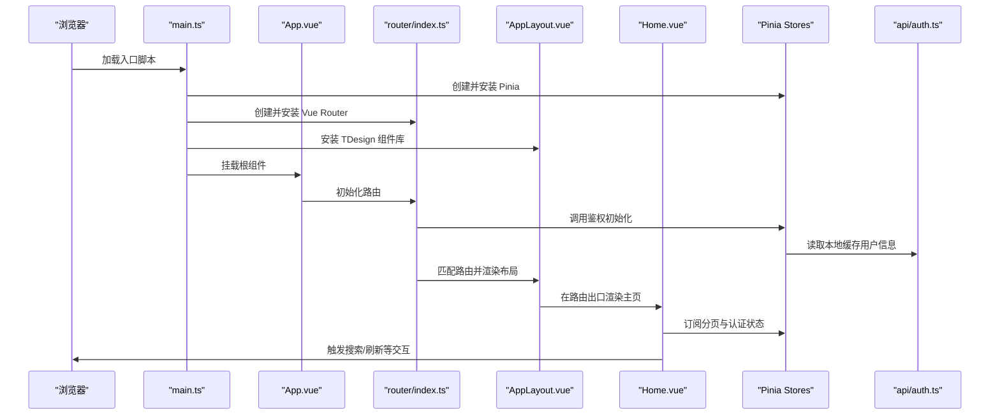
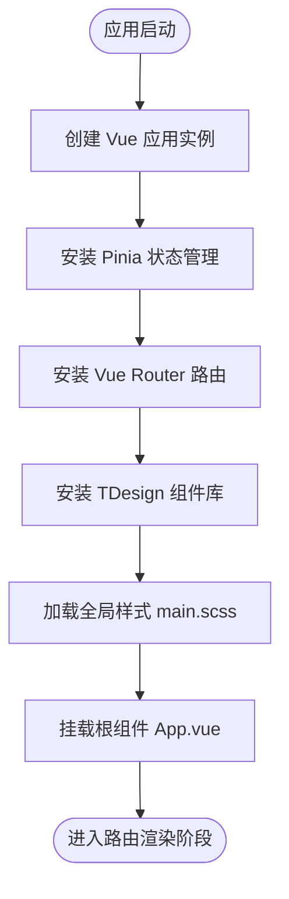
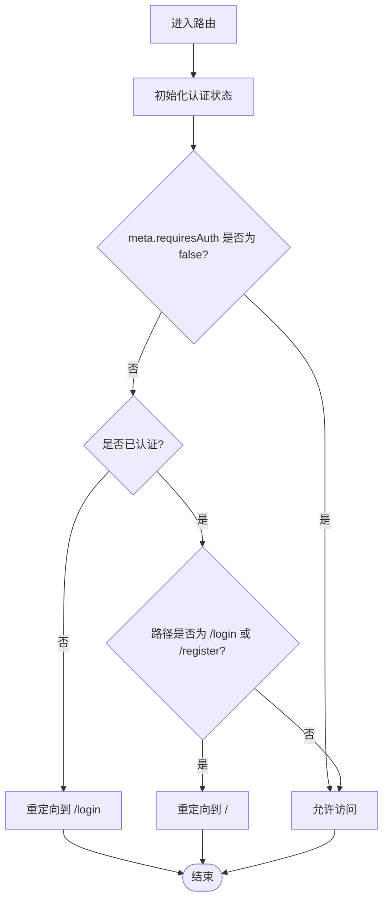
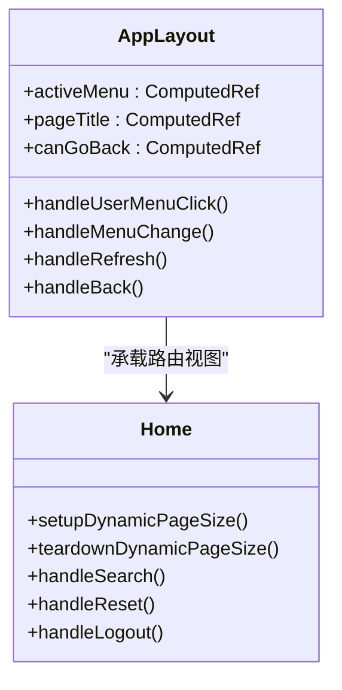
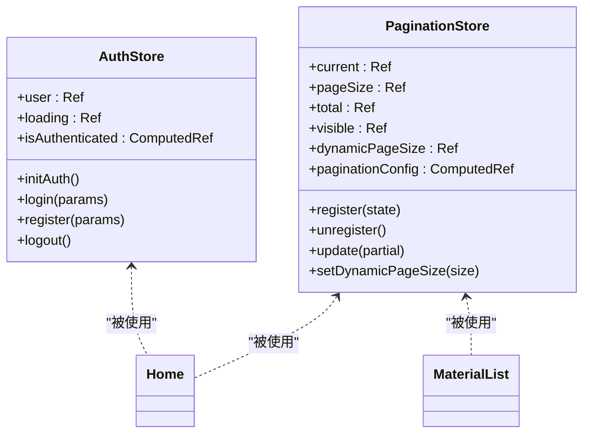
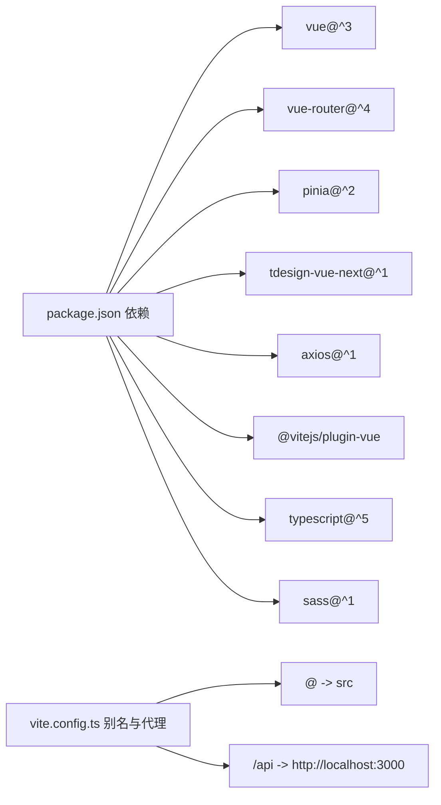

# 前端架构设计

<cite>
**本文引用的文件**
- [main.ts](file://frontend/src/main.ts)
- [App.vue](file://frontend/src/App.vue)
- [router/index.ts](file://frontend/src/router/index.ts)
- [components/Layout/AppLayout.vue](file://frontend/src/components/Layout/AppLayout.vue)
- [views/Home.vue](file://frontend/src/views/Home.vue)
- [stores/auth.ts](file://frontend/src/stores/auth.ts)
- [stores/pagination.ts](file://frontend/src/stores/pagination.ts)
- [api/auth.ts](file://frontend/src/api/auth.ts)
- [views/formulas/FormulaList.vue](file://frontend/src/views/formulas/FormulaList.vue)
- [views/materials/MaterialList.vue](file://frontend/src/views/materials/MaterialList.vue)
- [types/formula.ts](file://frontend/src/types/formula.ts)
- [vite.config.ts](file://frontend/vite.config.ts)
- [package.json](file://frontend/package.json)
- [assets/styles/main.scss](file://frontend/src/assets/styles/main.scss)
</cite>

## 目录
1. [简介](#简介)
2. [项目结构](#项目结构)
3. [核心组件](#核心组件)
4. [架构总览](#架构总览)
5. [详细组件分析](#详细组件分析)
6. [依赖分析](#依赖分析)
7. [性能考虑](#性能考虑)
8. [故障排查指南](#故障排查指南)
9. [结论](#结论)
10. [附录](#附录)

## 简介
本文件面向 TingStudio 前端架构，围绕 Vue 3 + TypeScript 技术栈，系统性阐述组件化架构模式、路由设计原理与布局系统；详解 TDesign Vue Next 组件库的集成与使用；总结组合式 API 的应用模式；梳理前端应用启动流程、全局状态管理与错误边界处理策略，并提供架构图与组件层次结构，帮助开发者快速理解与扩展系统。

## 项目结构
前端采用按功能域划分的目录组织方式，核心模块包括：
- 入口与根组件：main.ts、App.vue
- 路由：router/index.ts
- 布局：components/Layout/AppLayout.vue
- 视图页面：views 下按业务域划分（auth、formulas、materials、salesmen、versions、exports、nutrition、Tools）
- 状态管理：stores 下按业务域划分（auth、formula、material、salesman、version、export、nutrition、pagination）
- 类型定义：types 下定义业务模型
- API 层：api 下封装 HTTP 请求与认证数据持久化
- 样式：assets/styles 下统一主题与覆盖样式
- 构建配置：vite.config.ts、package.json

图表来源
- [main.ts:1-17](file://frontend/src/main.ts#L1-L17)
- [App.vue:1-10](file://frontend/src/App.vue#L1-L10)
- [router/index.ts:1-165](file://frontend/src/router/index.ts#L1-L165)
- [components/Layout/AppLayout.vue:1-392](file://frontend/src/components/Layout/AppLayout.vue#L1-L392)
- [views/Home.vue:1-800](file://frontend/src/views/Home.vue#L1-L800)
- [stores/auth.ts:1-64](file://frontend/src/stores/auth.ts#L1-L64)
- [stores/pagination.ts:1-89](file://frontend/src/stores/pagination.ts#L1-L89)
- [api/auth.ts:1-36](file://frontend/src/api/auth.ts#L1-L36)
- [types/formula.ts:1-33](file://frontend/src/types/formula.ts#L1-L33)
- [vite.config.ts:1-23](file://frontend/vite.config.ts#L1-L23)
- [package.json:1-30](file://frontend/package.json#L1-L30)
- [assets/styles/main.scss:1-203](file://frontend/src/assets/styles/main.scss#L1-L203)

章节来源
- [main.ts:1-17](file://frontend/src/main.ts#L1-L17)
- [router/index.ts:1-165](file://frontend/src/router/index.ts#L1-L165)
- [vite.config.ts:1-23](file://frontend/vite.config.ts#L1-L23)
- [package.json:1-30](file://frontend/package.json#L1-L30)

## 核心组件
- 应用入口与插件安装：创建 Vue 应用实例，安装 Pinia、Vue Router、TDesign，并挂载根组件。
- 根组件：承载路由出口，作为页面切换的容器。
- 路由系统：集中定义页面级路由与嵌套路由，统一鉴权守卫与面包屑标题元信息。
- 布局组件：提供头部导航、侧边菜单、内容区与面包屑，统一风格与交互。
- 主页视图：整合左侧导航、右侧内容区、搜索与分页控制，实现动态分页与全局搜索联动。
- 全局状态：Pinia Store 提供认证状态与分页配置，支持跨组件共享与响应式更新。
- 组件库集成：TDesign Vue Next 提供丰富的 UI 组件，配合全局样式覆盖实现统一主题。

章节来源
- [main.ts:1-17](file://frontend/src/main.ts#L1-L17)
- [App.vue:1-10](file://frontend/src/App.vue#L1-L10)
- [router/index.ts:1-165](file://frontend/src/router/index.ts#L1-L165)
- [components/Layout/AppLayout.vue:1-392](file://frontend/src/components/Layout/AppLayout.vue#L1-L392)
- [views/Home.vue:1-800](file://frontend/src/views/Home.vue#L1-L800)
- [stores/auth.ts:1-64](file://frontend/src/stores/auth.ts#L1-L64)
- [stores/pagination.ts:1-89](file://frontend/src/stores/pagination.ts#L1-L89)
- [assets/styles/main.scss:1-203](file://frontend/src/assets/styles/main.scss#L1-L203)

## 架构总览
下图展示了前端启动流程、路由与布局交互、状态管理与组件库集成的整体关系：

图表来源
- [main.ts:1-17](file://frontend/src/main.ts#L1-L17)
- [router/index.ts:148-162](file://frontend/src/router/index.ts#L148-L162)
- [components/Layout/AppLayout.vue:103-174](file://frontend/src/components/Layout/AppLayout.vue#L103-L174)
- [views/Home.vue:233-526](file://frontend/src/views/Home.vue#L233-L526)
- [stores/auth.ts:6-64](file://frontend/src/stores/auth.ts#L6-L64)
- [api/auth.ts:19-35](file://frontend/src/api/auth.ts#L19-L35)

## 详细组件分析

### 启动流程与应用初始化
- 创建应用实例并安装插件：Pinia、Vue Router、TDesign。
- 引入全局样式与字体资源，确保主题一致性。
- 在路由守卫中进行鉴权初始化，避免重复请求。
- 首屏渲染通过 App.vue 的路由出口承载各页面视图。

图表来源
- [main.ts:1-17](file://frontend/src/main.ts#L1-L17)
- [assets/styles/main.scss:1-203](file://frontend/src/assets/styles/main.scss#L1-L203)

章节来源
- [main.ts:1-17](file://frontend/src/main.ts#L1-L17)
- [assets/styles/main.scss:1-203](file://frontend/src/assets/styles/main.scss#L1-L203)

### 路由设计与权限控制
- 页面路由与嵌套路由：根路径 '/' 使用 AppLayout 包裹 Home.vue，并在 children 中定义各业务页面。
- 路由元信息：requiresAuth 控制是否需要登录；title 用于面包屑与页面标题。
- 全局前置守卫：在进入路由前检查认证状态，未登录跳转登录页，已登录访问登录/注册页则重定向首页。

图表来源
- [router/index.ts:148-162](file://frontend/src/router/index.ts#L148-L162)

章节来源
- [router/index.ts:1-165](file://frontend/src/router/index.ts#L1-L165)

### 布局系统与导航
- 头部区域：Logo、面包屑、返回/刷新按钮、用户下拉菜单。
- 侧边菜单：根据当前路径高亮对应导航项，点击跳转至相应页面。
- 内容区：通过 router-view 承载子路由视图，配合 AppLayout 实现统一布局。

图表来源
- [components/Layout/AppLayout.vue:103-174](file://frontend/src/components/Layout/AppLayout.vue#L103-L174)
- [views/Home.vue:233-526](file://frontend/src/views/Home.vue#L233-L526)

章节来源
- [components/Layout/AppLayout.vue:1-392](file://frontend/src/components/Layout/AppLayout.vue#L1-L392)
- [views/Home.vue:1-800](file://frontend/src/views/Home.vue#L1-L800)

### 组合式 API 应用模式
- 响应式状态：使用 ref/computed 管理用户信息、分页参数、页面标题等。
- 生命周期钩子：onMounted/onUnmounted 管理动态分页计算与 ResizeObserver 生命周期。
- 事件监听：通过 window.CustomEvent 实现全局搜索事件的订阅与触发。
- 路由与状态：useRouter/useRoute 与 Pinia Store 协同，驱动页面行为与数据流。

章节来源
- [views/Home.vue:233-526](file://frontend/src/views/Home.vue#L233-L526)
- [stores/pagination.ts:14-89](file://frontend/src/stores/pagination.ts#L14-L89)

### 全局状态管理（Pinia）
- 认证状态：用户信息、登录/注册/登出流程、本地缓存读写。
- 分页配置：当前页、页大小、总数、可见性、回调注册与动态页大小计算。
- 跨组件共享：通过 defineStore 定义的 Store 实例在视图与组件中直接使用。

图表来源
- [stores/auth.ts:6-64](file://frontend/src/stores/auth.ts#L6-L64)
- [stores/pagination.ts:14-89](file://frontend/src/stores/pagination.ts#L14-L89)
- [views/Home.vue:233-526](file://frontend/src/views/Home.vue#L233-L526)
- [views/materials/MaterialList.vue:72-180](file://frontend/src/views/materials/MaterialList.vue#L72-L180)

章节来源
- [stores/auth.ts:1-64](file://frontend/src/stores/auth.ts#L1-L64)
- [stores/pagination.ts:1-89](file://frontend/src/stores/pagination.ts#L1-L89)

### TDesign Vue Next 集成与使用
- 插件安装：在 main.ts 中引入并 app.use(TDesign)，全局可用组件。
- 样式覆盖：main.scss 对组件库的按钮、输入框、表格、分页等进行主题化覆盖。
- 组件使用：在视图中广泛使用 t-layout、t-header、t-aside、t-content、t-menu、t-table、t-pagination、t-dialog、t-button、t-input 等。

章节来源
- [main.ts:3-4](file://frontend/src/main.ts#L3-L4)
- [assets/styles/main.scss:88-203](file://frontend/src/assets/styles/main.scss#L88-L203)
- [views/formulas/FormulaList.vue:1-200](file://frontend/src/views/formulas/FormulaList.vue#L1-L200)
- [views/materials/MaterialList.vue:1-200](file://frontend/src/views/materials/MaterialList.vue#L1-L200)

### 数据模型与类型定义
- 配方相关：MaterialItem、Formula、FormulaForm、FormulaQuery。
- 用于表单、列表与查询场景的数据结构，保障类型安全与可维护性。

章节来源
- [types/formula.ts:1-33](file://frontend/src/types/formula.ts#L1-L33)

### API 层与认证
- 认证接口：login、register、getMe。
- 本地存储：saveAuthData/clearAuthData/getCachedUser。
- 集成：AuthStore 通过 authApi 进行网络请求，成功后写入本地缓存并更新状态。

章节来源
- [api/auth.ts:1-36](file://frontend/src/api/auth.ts#L1-L36)
- [stores/auth.ts:19-62](file://frontend/src/stores/auth.ts#L19-L62)

### 视图组件示例：配方列表与原料列表
- 配方列表：使用 t-table 展示配方数据，支持展开行显示版本变更详情，提供查看/编辑/删除等操作。
- 原料列表：使用 t-table 展示原料数据，支持库存状态标签、操作列与分页；通过全局搜索事件与 Home.vue 协作。

章节来源
- [views/formulas/FormulaList.vue:1-200](file://frontend/src/views/formulas/FormulaList.vue#L1-L200)
- [views/materials/MaterialList.vue:1-200](file://frontend/src/views/materials/MaterialList.vue#L1-L200)

## 依赖分析
- 运行时依赖：Vue 3、Vue Router、Pinia、TDesign Vue Next、Axios、vee-validate、yup。
- 开发依赖：Vite、@vitejs/plugin-vue、TypeScript、Sass、tsx。
- 构建别名：@ 指向 src，便于统一导入路径。
- 代理配置：/api 代理到后端服务地址，便于前后端联调。

图表来源
- [package.json:12-28](file://frontend/package.json#L12-L28)
- [vite.config.ts:7-21](file://frontend/vite.config.ts#L7-L21)

章节来源
- [package.json:1-30](file://frontend/package.json#L1-L30)
- [vite.config.ts:1-23](file://frontend/vite.config.ts#L1-L23)

## 性能考虑
- 动态分页：根据内容区可视高度动态计算每页条数，减少不必要的 DOM 节点数量，提升长列表渲染性能。
- ResizeObserver：仅在内容区尺寸变化时触发重算，避免频繁测量带来的开销。
- 路由懒加载：视图组件通过动态 import 按需加载，降低首屏体积。
- 组件库样式：通过全局样式覆盖统一主题，减少重复样式注入。

章节来源
- [views/Home.vue:250-310](file://frontend/src/views/Home.vue#L250-L310)
- [router/index.ts:10-165](file://frontend/src/router/index.ts#L10-L165)
- [assets/styles/main.scss:88-203](file://frontend/src/assets/styles/main.scss#L88-L203)

## 故障排查指南
- 登录/注册失败：检查 authApi 接口返回与错误消息，确认本地 token 与用户信息是否正确写入/清除。
- 路由跳转异常：确认路由元信息 requiresAuth 与守卫逻辑，避免循环重定向。
- 分页不生效：检查 paginationStore.register/update 与视图中的 onChange 回调绑定。
- 组件样式异常：确认 main.scss 中的 ::v-deep 覆盖是否正确，以及 TDesign 版本兼容性。
- 代理请求失败：检查 vite 代理配置与后端服务端口，确保 /api 前缀匹配。

章节来源
- [stores/auth.ts:19-62](file://frontend/src/stores/auth.ts#L19-L62)
- [router/index.ts:148-162](file://frontend/src/router/index.ts#L148-L162)
- [stores/pagination.ts:42-87](file://frontend/src/stores/pagination.ts#L42-L87)
- [assets/styles/main.scss:88-203](file://frontend/src/assets/styles/main.scss#L88-L203)
- [vite.config.ts:15-20](file://frontend/vite.config.ts#L15-L20)

## 结论
TingStudio 前端以 Vue 3 + TypeScript 为基础，结合 Pinia 实现全局状态管理，借助 TDesign Vue Next 提供一致的 UI 体验；路由系统通过元信息与守卫实现清晰的权限控制；布局组件统一了导航与内容区域，视图层通过组合式 API 与 Store 协作，形成高内聚、低耦合的架构。整体设计具备良好的扩展性与可维护性，适合持续演进。

## 附录
- 启动命令：dev/build/preview，分别对应开发、构建与预览。
- 初始化示例数据：init:sample-data 脚本用于生成演示数据。

章节来源
- [package.json:6-11](file://frontend/package.json#L6-L11)