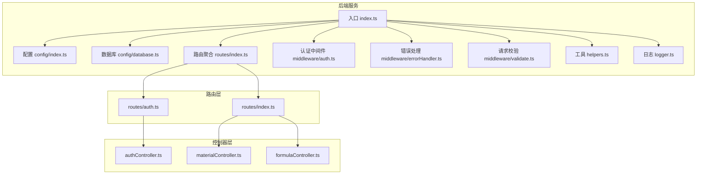
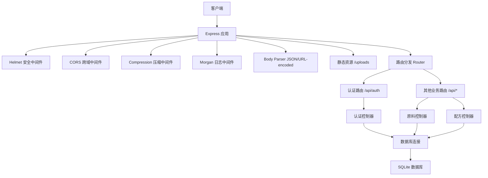
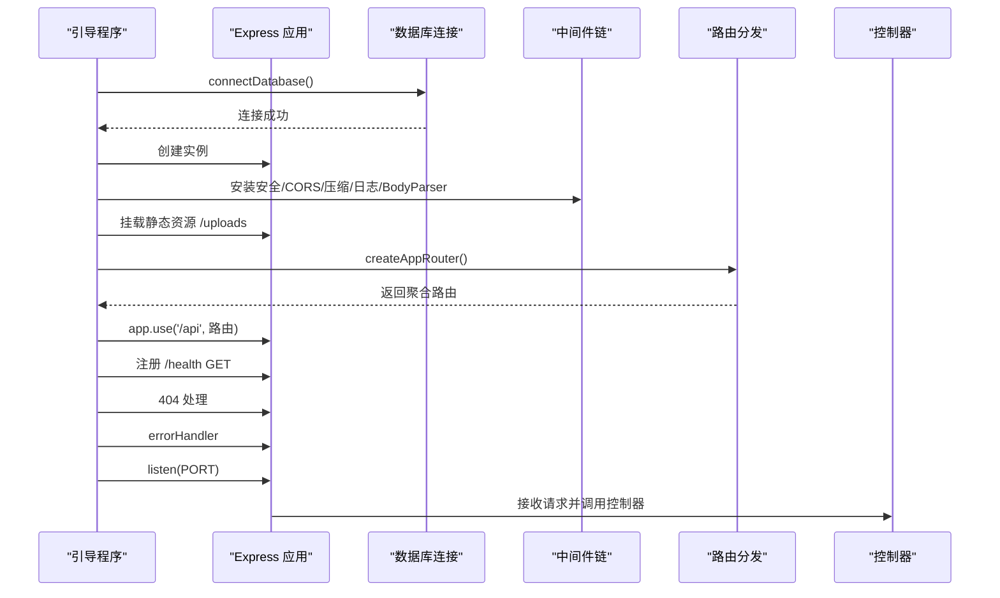
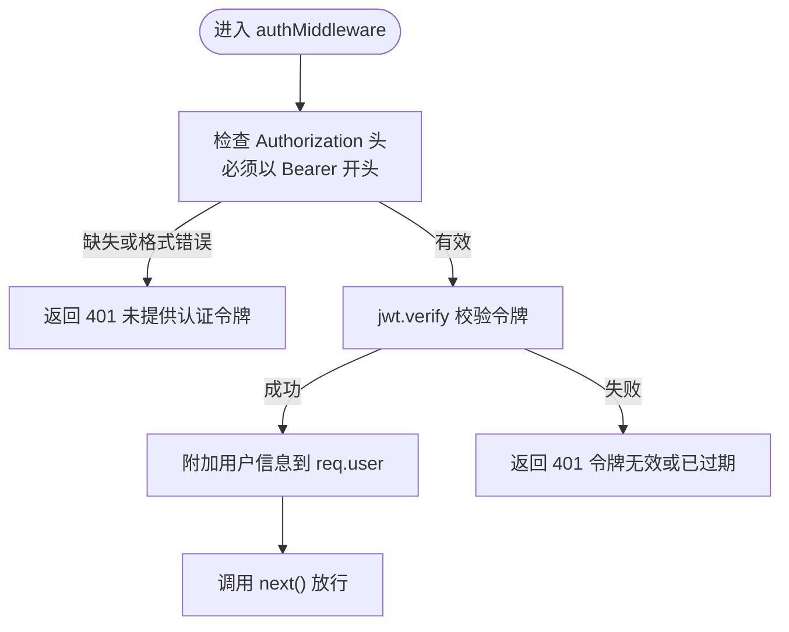
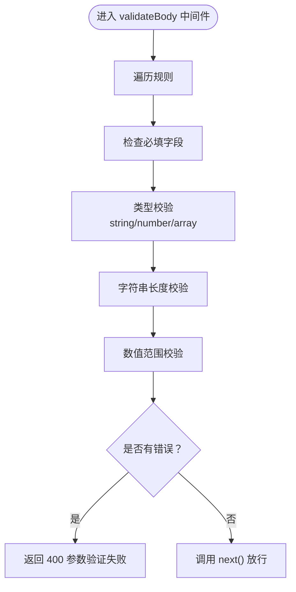
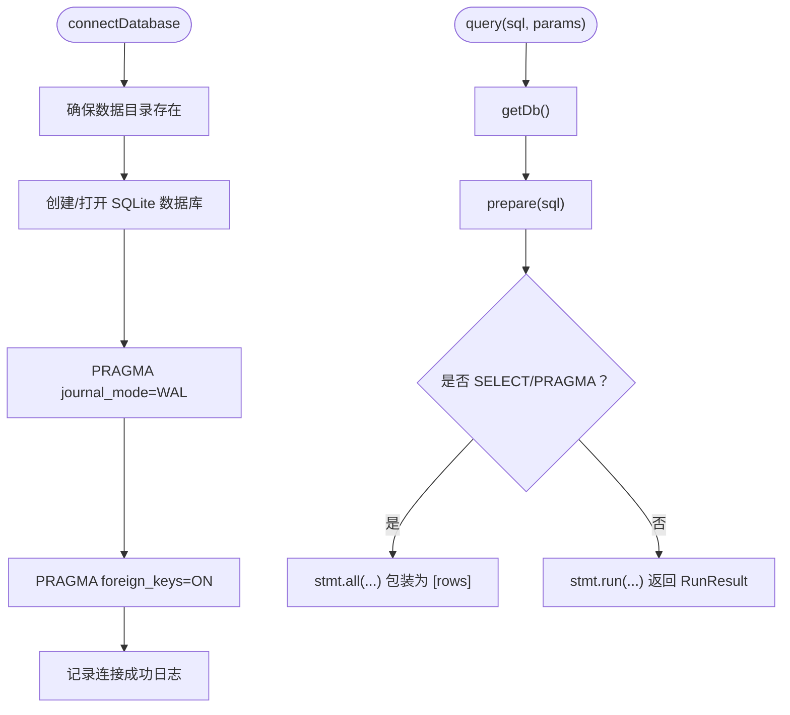
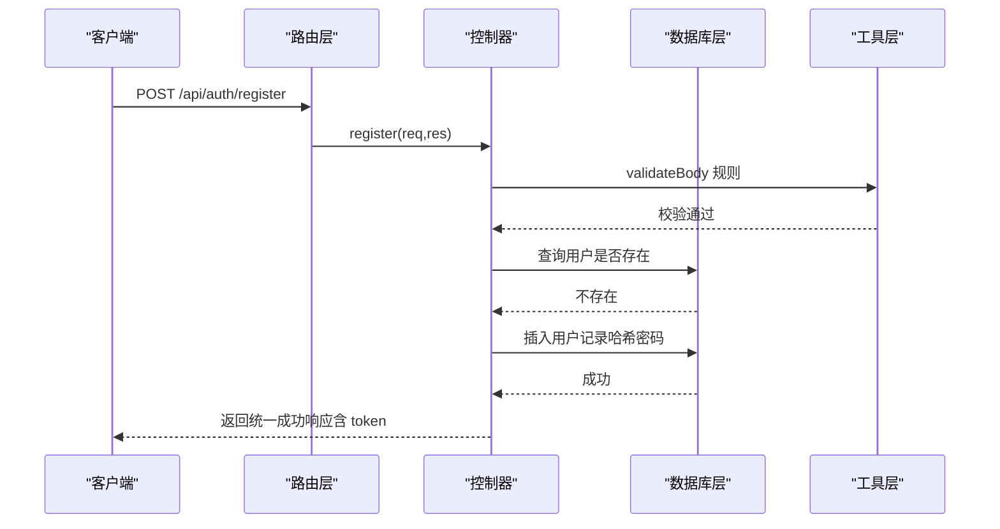
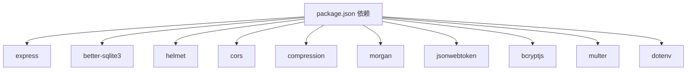

# 后端架构设计

<cite>
**本文档引用的文件**
- [backend/src/index.ts](file://backend/src/index.ts)
- [backend/src/config/index.ts](file://backend/src/config/index.ts)
- [backend/src/config/database.ts](file://backend/src/config/database.ts)
- [backend/src/routes/index.ts](file://backend/src/routes/index.ts)
- [backend/src/routes/auth.ts](file://backend/src/routes/auth.ts)
- [backend/src/controllers/authController.ts](file://backend/src/controllers/authController.ts)
- [backend/src/controllers/materialController.ts](file://backend/src/controllers/materialController.ts)
- [backend/src/controllers/formulaController.ts](file://backend/src/controllers/formulaController.ts)
- [backend/src/middleware/auth.ts](file://backend/src/middleware/auth.ts)
- [backend/src/middleware/errorHandler.ts](file://backend/src/middleware/errorHandler.ts)
- [backend/src/middleware/validate.ts](file://backend/src/middleware/validate.ts)
- [backend/src/utils/helpers.ts](file://backend/src/utils/helpers.ts)
- [backend/src/utils/logger.ts](file://backend/src/utils/logger.ts)
- [backend/API_DOC.md](file://backend/API_DOC.md)
- [backend/DATABASE_DOC.md](file://backend/DATABASE_DOC.md)
- [backend/package.json](file://backend/package.json)
</cite>

## 目录
1. [简介](#简介)
2. [项目结构](#项目结构)
3. [核心组件](#核心组件)
4. [架构总览](#架构总览)
5. [详细组件分析](#详细组件分析)
6. [依赖关系分析](#依赖关系分析)
7. [性能考虑](#性能考虑)
8. [故障排查指南](#故障排查指南)
9. [结论](#结论)
10. [附录](#附录)

## 简介
本文件面向 TingStudio 后端架构，基于 Express + TypeScript 的实现，采用 MVC 架构模式与中间件体系，提供 RESTful API 设计、统一响应格式、数据库连接管理、认证与安全策略、以及错误处理机制。文档同时给出服务启动、路由分发与业务处理的完整流程图，并对关键组件进行深入分析。

## 项目结构
后端采用按功能域划分的目录组织方式，核心层次如下：
- config：应用配置与数据库连接管理
- routes：路由定义与聚合
- controllers：业务控制器，处理请求与调用数据层
- middleware：全局中间件与业务中间件（认证、校验、错误处理）
- utils：通用工具函数与日志
- scripts：数据库初始化与数据导入脚本
- src/index.ts：服务入口，装配中间件、路由与错误处理器

**图表来源**
- [backend/src/index.ts:13-55](file://backend/src/index.ts#L13-L55)
- [backend/src/config/index.ts:1-24](file://backend/src/config/index.ts#L1-L24)
- [backend/src/config/database.ts:1-70](file://backend/src/config/database.ts#L1-L70)
- [backend/src/routes/index.ts:1-24](file://backend/src/routes/index.ts#L1-L24)
- [backend/src/routes/auth.ts:1-20](file://backend/src/routes/auth.ts#L1-L20)
- [backend/src/controllers/authController.ts:1-89](file://backend/src/controllers/authController.ts#L1-L89)
- [backend/src/controllers/materialController.ts:1-129](file://backend/src/controllers/materialController.ts#L1-L129)
- [backend/src/controllers/formulaController.ts:1-200](file://backend/src/controllers/formulaController.ts#L1-L200)
- [backend/src/middleware/auth.ts:1-38](file://backend/src/middleware/auth.ts#L1-L38)
- [backend/src/middleware/errorHandler.ts:1-51](file://backend/src/middleware/errorHandler.ts#L1-L51)
- [backend/src/middleware/validate.ts:1-68](file://backend/src/middleware/validate.ts#L1-L68)
- [backend/src/utils/helpers.ts:1-86](file://backend/src/utils/helpers.ts#L1-L86)
- [backend/src/utils/logger.ts:1-40](file://backend/src/utils/logger.ts#L1-L40)

**章节来源**
- [backend/src/index.ts:1-61](file://backend/src/index.ts#L1-L61)
- [backend/src/routes/index.ts:1-24](file://backend/src/routes/index.ts#L1-L24)

## 核心组件
- 服务入口与中间件链
  - 在入口文件中完成数据库连接、全局中间件（安全、CORS、压缩、日志、静态资源）、路由挂载、404 与错误处理的装配。
- 配置中心
  - 统一管理端口、数据库路径、JWT 密钥与过期时间、上传目录与大小限制、CORS 来源等。
- 数据库连接管理
  - 使用 better-sqlite3，提供连接、查询、事务与关闭方法；启用 WAL 模式与外键约束；封装查询兼容 MySQL 的 [rows] 模式。
- 中间件体系
  - 认证中间件：基于 Authorization Bearer Token 的 JWT 校验，向请求注入用户信息。
  - 请求校验中间件：声明式字段规则（类型、必填、长度、数值范围），统一返回参数错误。
  - 全局错误处理：针对 SQLite 约束、JWT、文件大小等场景进行状态码与消息规范化。
- 控制器层
  - 实现业务逻辑，调用数据库层，返回统一响应格式；分页、模糊查询、JSON 字段处理等。
- 工具与日志
  - ID 生成、时间格式化、分页构建、命名转换、JSON 安全解析；彩色日志输出。

**章节来源**
- [backend/src/index.ts:13-55](file://backend/src/index.ts#L13-L55)
- [backend/src/config/index.ts:1-24](file://backend/src/config/index.ts#L1-L24)
- [backend/src/config/database.ts:1-70](file://backend/src/config/database.ts#L1-L70)
- [backend/src/middleware/auth.ts:1-38](file://backend/src/middleware/auth.ts#L1-L38)
- [backend/src/middleware/validate.ts:1-68](file://backend/src/middleware/validate.ts#L1-L68)
- [backend/src/middleware/errorHandler.ts:1-51](file://backend/src/middleware/errorHandler.ts#L1-L51)
- [backend/src/utils/helpers.ts:1-86](file://backend/src/utils/helpers.ts#L1-L86)
- [backend/src/utils/logger.ts:1-40](file://backend/src/utils/logger.ts#L1-L40)

## 架构总览
TingStudio 后端采用经典的 MVC 架构：
- Model：数据库访问层（better-sqlite3），提供 query、transaction、getDb 等方法。
- View：控制器返回统一 JSON 响应。
- Controller：路由绑定控制器方法，处理业务逻辑与数据组装。
- Middleware：全局中间件链（安全、CORS、压缩、日志、静态资源、路由、404、错误处理）。

**图表来源**
- [backend/src/index.ts:13-55](file://backend/src/index.ts#L13-L55)
- [backend/src/routes/index.ts:1-24](file://backend/src/routes/index.ts#L1-L24)
- [backend/src/routes/auth.ts:1-20](file://backend/src/routes/auth.ts#L1-L20)
- [backend/src/config/database.ts:1-70](file://backend/src/config/database.ts#L1-L70)

## 详细组件分析

### 服务启动与中间件链
服务启动流程包括：数据库连接、全局中间件安装、静态资源、API 路由挂载、健康检查、404 与错误处理，最后监听端口。

**图表来源**
- [backend/src/index.ts:13-55](file://backend/src/index.ts#L13-L55)

**章节来源**
- [backend/src/index.ts:13-55](file://backend/src/index.ts#L13-L55)

### 认证中间件与安全策略
- 认证中间件从 Authorization 头提取 Bearer Token，使用配置中的密钥进行验证，成功后在请求对象注入用户信息并放行。
- 令牌生成使用配置中的密钥与过期时间。
- 全局错误处理对 JWT 相关异常进行专门处理，返回 401 并提示无效或过期。

**图表来源**
- [backend/src/middleware/auth.ts:13-31](file://backend/src/middleware/auth.ts#L13-L31)

**章节来源**
- [backend/src/middleware/auth.ts:1-38](file://backend/src/middleware/auth.ts#L1-L38)
- [backend/src/middleware/errorHandler.ts:25-34](file://backend/src/middleware/errorHandler.ts#L25-L34)

### 请求验证中间件
- 通过声明式规则对请求体字段进行校验，支持类型、必填、最小/最大长度、最小/最大数值等。
- 校验失败统一返回 400 与错误列表。

**图表来源**
- [backend/src/middleware/validate.ts:16-67](file://backend/src/middleware/validate.ts#L16-L67)

**章节来源**
- [backend/src/middleware/validate.ts:1-68](file://backend/src/middleware/validate.ts#L1-L68)

### 数据库连接管理
- 初始化时确保数据目录存在，创建/打开 SQLite 文件，启用 WAL 模式与外键约束。
- 提供 query 方法兼容 [rows] 模式，支持 SELECT 返回数组与 INSERT/UPDATE/DELETE 返回运行结果。
- 提供 transaction 方法执行事务。
- 提供 getDb 与 closeDatabase 辅助方法。

**图表来源**
- [backend/src/config/database.ts:10-61](file://backend/src/config/database.ts#L10-L61)

**章节来源**
- [backend/src/config/database.ts:1-70](file://backend/src/config/database.ts#L1-L70)

### 路由与控制器设计
- 路由聚合：在路由入口中挂载各模块路由（认证、原料、配方、业务员、版本、导出、营养）。
- 认证路由：注册、登录、获取当前用户信息；登录接口无需认证，其余接口需认证。
- 控制器：实现 CRUD 与业务逻辑，使用工具函数进行分页、命名转换、统一响应包装。

**图表来源**
- [backend/src/routes/auth.ts:9-15](file://backend/src/routes/auth.ts#L9-L15)
- [backend/src/controllers/authController.ts:8-39](file://backend/src/controllers/authController.ts#L8-L39)
- [backend/src/middleware/validate.ts:16-67](file://backend/src/middleware/validate.ts#L16-L67)
- [backend/src/utils/helpers.ts:26-51](file://backend/src/utils/helpers.ts#L26-L51)

**章节来源**
- [backend/src/routes/index.ts:1-24](file://backend/src/routes/index.ts#L1-L24)
- [backend/src/routes/auth.ts:1-20](file://backend/src/routes/auth.ts#L1-L20)
- [backend/src/controllers/authController.ts:1-89](file://backend/src/controllers/authController.ts#L1-L89)

### 统一响应格式与 RESTful 设计
- 统一响应结构：success: true/false、message、data（可包含分页结构）。
- 分页响应：list、pagination.page、pageSize、total、totalPages。
- 错误响应：success: false、message、errors（参数校验失败时存在）。
- HTTP 状态码：200/201/400/401/404/409/413/500 等。
- RESTful 设计：资源命名复数、使用标准动词、路径参数与查询参数规范。

**章节来源**
- [backend/API_DOC.md:18-71](file://backend/API_DOC.md#L18-L71)

### 错误处理机制
- 全局错误处理中间件根据错误类型返回相应状态码与消息：
  - SQLite UNIQUE/FOREIGN KEY 约束失败
  - JWT 相关错误（无效/过期）
  - Multer 文件大小超限
  - 默认 500 服务器内部错误
- 开发环境显示详细错误信息，生产环境隐藏细节。

**章节来源**
- [backend/src/middleware/errorHandler.ts:1-51](file://backend/src/middleware/errorHandler.ts#L1-L51)

## 依赖关系分析
- 运行时依赖：Express、better-sqlite3、helmet、cors、compression、morgan、bcryptjs、jsonwebtoken、multer、dotenv 等。
- 开发依赖：TypeScript、tsx、@types/* 等。
- 服务启动脚本：dev、build、start、init-db、seed、import-nutrition。

**图表来源**
- [backend/package.json:14-26](file://backend/package.json#L14-L26)

**章节来源**
- [backend/package.json:1-42](file://backend/package.json#L1-L42)

## 性能考虑
- 数据库层面：启用 WAL 模式提升并发读写性能；开启外键约束保证一致性；合理使用索引（见数据库文档）。
- 传输层面：启用 compression 减少带宽；morgan 记录访问日志便于监控。
- 请求层面：body-parser 限制请求体大小；validate 中间件提前拒绝非法请求；分页避免一次性返回大量数据。
- 缓存与扩展：当前未实现缓存层，可在热点查询上引入内存缓存或连接池优化（建议）。

## 故障排查指南
- 服务启动失败
  - 检查数据库连接路径与权限；确认数据目录可写。
  - 查看日志输出定位具体错误。
- 认证失败
  - 确认 Authorization 头格式为 Bearer Token；检查 JWT 密钥与过期时间配置。
  - 若返回“令牌无效或已过期”，重新登录获取新令牌。
- 参数校验失败
  - 根据返回的 errors 列表修正请求体字段类型、长度或必填项。
- 数据冲突或外键约束
  - UNIQUE 冲突：修改唯一字段（如用户名、编码）。
  - FOREIGN KEY 冲突：确保关联资源存在且有效。
- 文件上传失败
  - 检查文件大小是否超过限制；确认上传目录权限。

**章节来源**
- [backend/src/middleware/errorHandler.ts:13-40](file://backend/src/middleware/errorHandler.ts#L13-L40)
- [backend/src/utils/logger.ts:24-39](file://backend/src/utils/logger.ts#L24-L39)

## 结论
TingStudio 后端以 Express + TypeScript 为基础，采用清晰的 MVC 分层与中间件体系，实现了 RESTful API 的统一响应格式、完善的认证与安全策略、以及健壮的错误处理机制。配合 SQLite 数据库与良好的工具函数，满足食品配方工作数据管理平台的业务需求。后续可在缓存、限流与连接池方面进一步优化性能与稳定性。

## 附录
- API 文档与响应格式详见 API 文档。
- 数据库表结构与 ER 关系详见数据库文档。
- 配置项与默认值详见配置文件。

**章节来源**
- [backend/API_DOC.md:1-714](file://backend/API_DOC.md#L1-L714)
- [backend/DATABASE_DOC.md:1-457](file://backend/DATABASE_DOC.md#L1-L457)