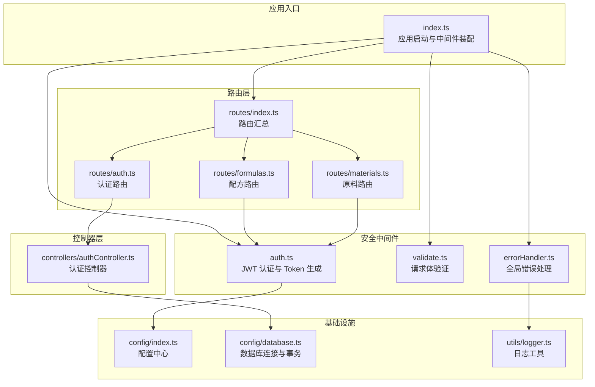
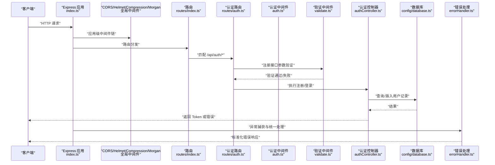
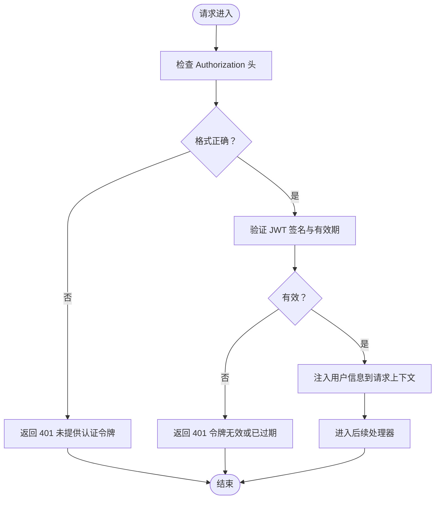
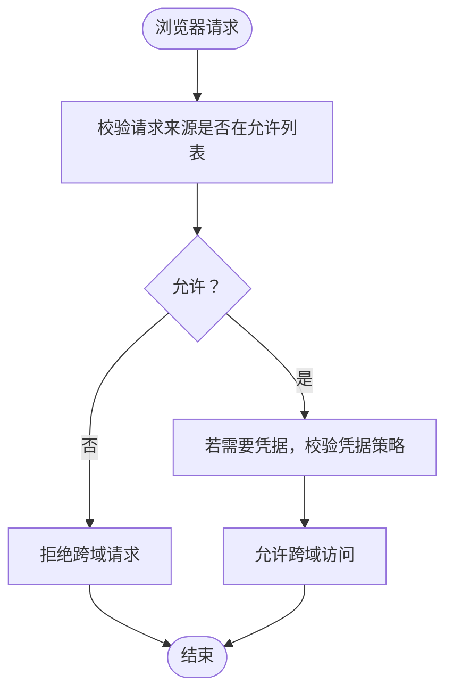
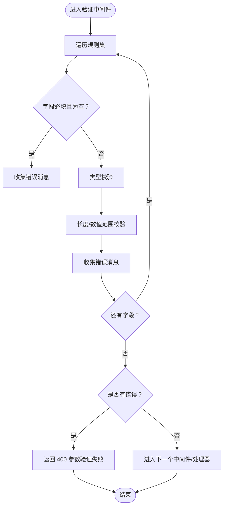
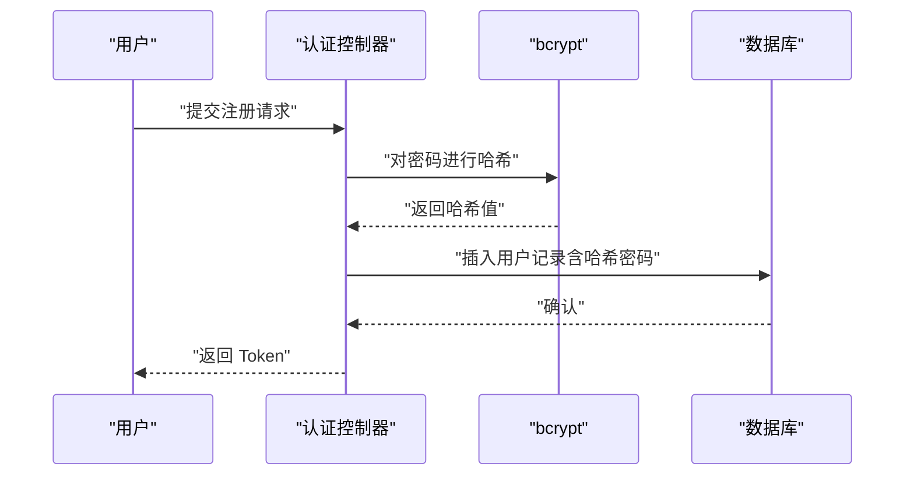
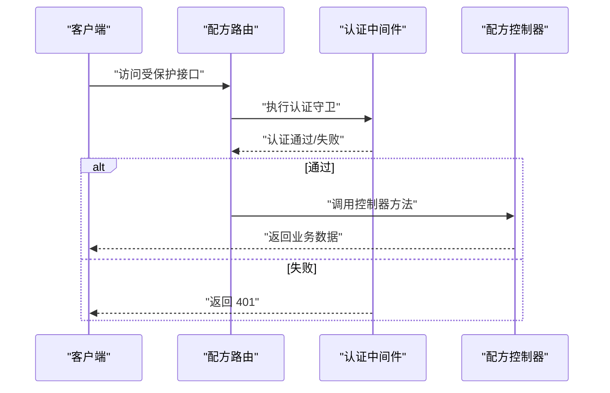
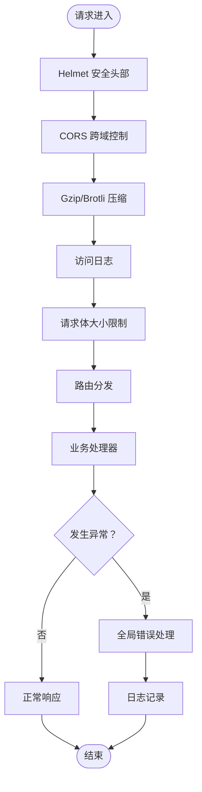
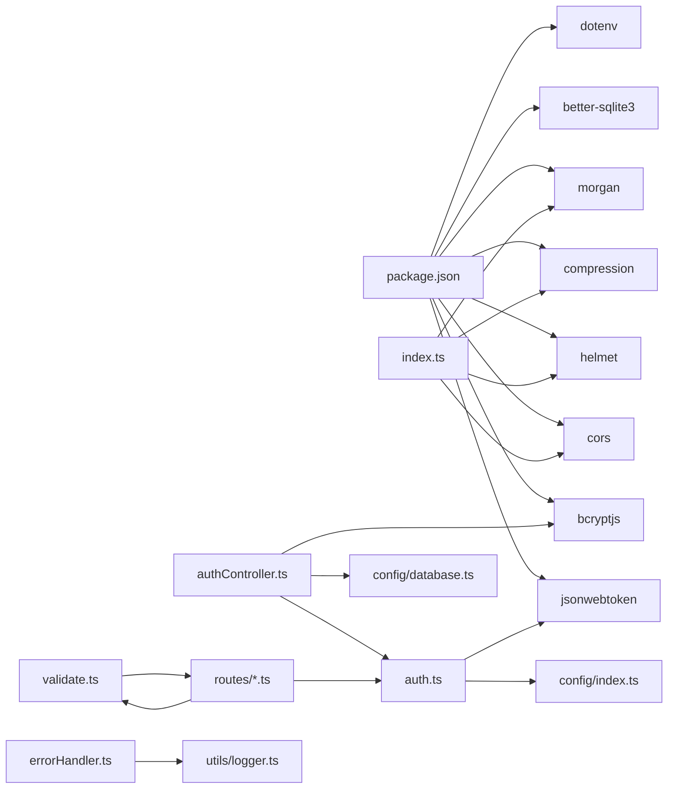

# 安全架构设计

<cite>
**本文档引用的文件**
- [backend/src/index.ts](file://backend/src/index.ts)
- [backend/src/config/index.ts](file://backend/src/config/index.ts)
- [backend/src/middleware/auth.ts](file://backend/src/middleware/auth.ts)
- [backend/src/middleware/errorHandler.ts](file://backend/src/middleware/errorHandler.ts)
- [backend/src/middleware/validate.ts](file://backend/src/middleware/validate.ts)
- [backend/src/controllers/authController.ts](file://backend/src/controllers/authController.ts)
- [backend/src/routes/auth.ts](file://backend/src/routes/auth.ts)
- [backend/src/routes/formulas.ts](file://backend/src/routes/formulas.ts)
- [backend/src/routes/materials.ts](file://backend/src/routes/materials.ts)
- [backend/src/config/database.ts](file://backend/src/config/database.ts)
- [backend/src/utils/logger.ts](file://backend/src/utils/logger.ts)
- [backend/src/utils/helpers.ts](file://backend/src/utils/helpers.ts)
- [backend/package.json](file://backend/package.json)
</cite>

## 目录
1. [引言](#引言)
2. [项目结构](#项目结构)
3. [核心组件](#核心组件)
4. [架构总览](#架构总览)
5. [详细组件分析](#详细组件分析)
6. [依赖关系分析](#依赖关系分析)
7. [性能考虑](#性能考虑)
8. [故障排除指南](#故障排除指南)
9. [结论](#结论)
10. [附录](#附录)

## 引言
本文件面向 TingStudio 后端安全架构，系统性梳理多层安全防护设计与实现，覆盖认证授权（JWT）、跨域资源共享（CORS）、输入验证、错误处理、密码加密存储、Token 有效期管理、权限控制、中间件安全检查流程、异常捕获与日志记录等。同时提供安全架构图与威胁模型分析，明确安全边界与防护措施。

## 项目结构
后端采用 Express + TypeScript 架构，按功能模块化组织，安全相关能力通过中间件与路由守卫统一接入，数据库采用 SQLite 并启用 WAL 与外键约束，配合全局错误处理与日志工具，形成闭环的安全运行时。

**图表来源**
- [backend/src/index.ts:13-61](file://backend/src/index.ts#L13-L61)
- [backend/src/middleware/auth.ts:13-38](file://backend/src/middleware/auth.ts#L13-L38)
- [backend/src/middleware/validate.ts:16-68](file://backend/src/middleware/validate.ts#L16-L68)
- [backend/src/middleware/errorHandler.ts:5-51](file://backend/src/middleware/errorHandler.ts#L5-L51)
- [backend/src/routes/index.ts:11-24](file://backend/src/routes/index.ts#L11-L24)
- [backend/src/routes/auth.ts:7-20](file://backend/src/routes/auth.ts#L7-L20)
- [backend/src/routes/formulas.ts:10-28](file://backend/src/routes/formulas.ts#L10-L28)
- [backend/src/routes/materials.ts:7-22](file://backend/src/routes/materials.ts#L7-L22)
- [backend/src/controllers/authController.ts:9-89](file://backend/src/controllers/authController.ts#L9-L89)
- [backend/src/config/index.ts:1-24](file://backend/src/config/index.ts#L1-L24)
- [backend/src/config/database.ts:10-70](file://backend/src/config/database.ts#L10-L70)
- [backend/src/utils/logger.ts:24-40](file://backend/src/utils/logger.ts#L24-L40)

**章节来源**
- [backend/src/index.ts:13-61](file://backend/src/index.ts#L13-L61)
- [backend/src/config/index.ts:1-24](file://backend/src/config/index.ts#L1-L24)

## 核心组件
- JWT 认证中间件：负责校验 Authorization 头中的 Bearer Token，并在成功时将用户信息注入请求上下文；提供 Token 生成函数用于登录/注册成功后发放令牌。
- 输入验证中间件：基于规则集对请求体字段进行类型、长度、范围与必填性校验，统一返回结构化错误。
- 全局错误处理中间件：集中处理数据库约束冲突、JWT 过期/无效、文件大小限制、未捕获异常等，屏蔽敏感信息并输出标准化响应。
- 认证控制器：实现注册、登录与当前用户查询，注册时使用 bcrypt 对密码进行加盐哈希存储。
- 路由与权限：认证路由开放注册/登录/当前用户接口；业务路由（如配方、原料）通过 authMiddleware 全局守卫强制鉴权。
- 配置与基础设施：集中管理 JWT 密钥、过期时间、CORS 来源、上传限制等；数据库连接启用 WAL 与外键约束；日志工具支持彩色输出与级别控制。

**章节来源**
- [backend/src/middleware/auth.ts:13-38](file://backend/src/middleware/auth.ts#L13-L38)
- [backend/src/middleware/validate.ts:16-68](file://backend/src/middleware/validate.ts#L16-L68)
- [backend/src/middleware/errorHandler.ts:5-51](file://backend/src/middleware/errorHandler.ts#L5-L51)
- [backend/src/controllers/authController.ts:9-89](file://backend/src/controllers/authController.ts#L9-L89)
- [backend/src/routes/auth.ts:7-20](file://backend/src/routes/auth.ts#L7-L20)
- [backend/src/routes/formulas.ts:10-28](file://backend/src/routes/formulas.ts#L10-L28)
- [backend/src/routes/materials.ts:7-22](file://backend/src/routes/materials.ts#L7-L22)
- [backend/src/config/index.ts:10-23](file://backend/src/config/index.ts#L10-L23)
- [backend/src/config/database.ts:10-70](file://backend/src/config/database.ts#L10-L70)
- [backend/src/utils/logger.ts:24-40](file://backend/src/utils/logger.ts#L24-L40)

## 架构总览
下图展示从客户端到数据库的完整安全路径，包括认证、验证、权限控制、错误处理与日志记录。

**图表来源**
- [backend/src/index.ts:20-48](file://backend/src/index.ts#L20-L48)
- [backend/src/routes/index.ts:11-24](file://backend/src/routes/index.ts#L11-L24)
- [backend/src/routes/auth.ts:7-20](file://backend/src/routes/auth.ts#L7-L20)
- [backend/src/middleware/validate.ts:16-68](file://backend/src/middleware/validate.ts#L16-L68)
- [backend/src/middleware/auth.ts:13-38](file://backend/src/middleware/auth.ts#L13-L38)
- [backend/src/controllers/authController.ts:9-89](file://backend/src/controllers/authController.ts#L9-L89)
- [backend/src/config/database.ts:44-55](file://backend/src/config/database.ts#L44-L55)
- [backend/src/middleware/errorHandler.ts:5-51](file://backend/src/middleware/errorHandler.ts#L5-L51)

## 详细组件分析

### JWT 认证机制
- 认证流程
  - 客户端在请求头携带 Bearer Token。
  - 中间件校验头部格式与签名有效性，解码后将用户标识写入请求上下文。
  - 成功后进入后续路由处理；失败则返回 401。
- Token 签发与有效期
  - 使用独立的密钥与过期间配置，注册/登录成功后签发 Token。
  - 过期时间可配置，默认值来自环境变量。
- 权限控制
  - 业务路由通过 authMiddleware 强制鉴权，未通过者无法访问受保护资源。

**图表来源**
- [backend/src/middleware/auth.ts:13-31](file://backend/src/middleware/auth.ts#L13-L31)

**章节来源**
- [backend/src/middleware/auth.ts:13-38](file://backend/src/middleware/auth.ts#L13-L38)
- [backend/src/config/index.ts:10-13](file://backend/src/config/index.ts#L10-L13)
- [backend/src/routes/formulas.ts:12](file://backend/src/routes/formulas.ts#L12)
- [backend/src/routes/materials.ts:9](file://backend/src/routes/materials.ts#L9)

### CORS 配置与跨域安全
- 配置来源：CORS 来源与凭据允许均来自配置中心，便于环境隔离。
- 安全要点：生产环境建议限定具体来源，避免通配符；启用凭据需谨慎，确保仅在可信域名下使用。

**图表来源**
- [backend/src/index.ts:22-25](file://backend/src/index.ts#L22-L25)
- [backend/src/config/index.ts:20-22](file://backend/src/config/index.ts#L20-L22)

**章节来源**
- [backend/src/index.ts:22-25](file://backend/src/index.ts#L22-L25)
- [backend/src/config/index.ts:20-23](file://backend/src/config/index.ts#L20-L23)

### 输入验证与错误处理策略
- 参数验证
  - 支持类型（string/number/array）、必填、最小/最大值、最小/最大长度等规则。
  - 验证失败统一返回 400 与结构化错误数组。
- 全局错误处理
  - 捕获数据库约束冲突（唯一/外键）、JWT 错误（无效/过期）、文件大小限制、未处理异常。
  - 开发环境输出详细错误，生产环境隐藏细节。
  - 统一日志记录，便于审计与问题定位。

**图表来源**
- [backend/src/middleware/validate.ts:16-68](file://backend/src/middleware/validate.ts#L16-L68)

**章节来源**
- [backend/src/middleware/validate.ts:16-68](file://backend/src/middleware/validate.ts#L16-L68)
- [backend/src/middleware/errorHandler.ts:5-51](file://backend/src/middleware/errorHandler.ts#L5-L51)
- [backend/src/utils/logger.ts:24-40](file://backend/src/utils/logger.ts#L24-L40)

### 密码加密存储与 Token 有效期管理
- 密码存储
  - 注册时使用 bcrypt 对明文密码进行加盐哈希，存储哈希值而非明文。
- Token 管理
  - 登录/注册成功后签发 JWT，有效期由配置中心统一管理。
  - 客户端应妥善保存 Token，服务端不存储会话状态，实现无状态认证。

**图表来源**
- [backend/src/controllers/authController.ts:23-29](file://backend/src/controllers/authController.ts#L23-L29)
- [backend/src/middleware/auth.ts:33-37](file://backend/src/middleware/auth.ts#L33-L37)

**章节来源**
- [backend/src/controllers/authController.ts:23-29](file://backend/src/controllers/authController.ts#L23-L29)
- [backend/src/config/index.ts:10-13](file://backend/src/config/index.ts#L10-L13)

### 权限控制机制
- 路由级守卫
  - 业务路由（配方、原料等）在挂载时即应用 authMiddleware，确保所有受保护接口均需认证。
- 当前用户查询
  - /api/auth/me 接口通过已认证的用户标识查询数据库并返回用户信息。

**图表来源**
- [backend/src/routes/formulas.ts:12](file://backend/src/routes/formulas.ts#L12)
- [backend/src/middleware/auth.ts:13-31](file://backend/src/middleware/auth.ts#L13-L31)

**章节来源**
- [backend/src/routes/formulas.ts:12](file://backend/src/routes/formulas.ts#L12)
- [backend/src/routes/materials.ts:9](file://backend/src/routes/materials.ts#L9)
- [backend/src/routes/auth.ts:19](file://backend/src/routes/auth.ts#L19)

### 中间件安全检查流程、异常捕获与日志记录
- 中间件链
  - Helmet 提供常见安全头部；CORS 控制跨域；Compression 压缩响应；Morgan 记录访问日志；JSON/URL 编码限制防止过大负载。
- 异常捕获
  - 全局错误处理中间件拦截未处理异常，分类返回标准 HTTP 状态码与消息。
- 日志记录
  - 日志工具支持 info/warn/error/debug 级别，开发环境输出调试信息，生产环境收敛输出。

**图表来源**
- [backend/src/index.ts:21-29](file://backend/src/index.ts#L21-L29)
- [backend/src/middleware/errorHandler.ts:5-51](file://backend/src/middleware/errorHandler.ts#L5-L51)
- [backend/src/utils/logger.ts:24-40](file://backend/src/utils/logger.ts#L24-L40)

**章节来源**
- [backend/src/index.ts:21-29](file://backend/src/index.ts#L21-L29)
- [backend/src/middleware/errorHandler.ts:5-51](file://backend/src/middleware/errorHandler.ts#L5-L51)
- [backend/src/utils/logger.ts:24-40](file://backend/src/utils/logger.ts#L24-L40)

### HTTP 头部安全设置
- Helmet 自动注入安全头部，降低常见 Web 攻击风险（如点击劫持、XSS、MIME 嗜好等），无需手动配置即可生效。

**章节来源**
- [backend/src/index.ts:21](file://backend/src/index.ts#L21)
- [backend/package.json:22](file://backend/package.json#L22)

### 数据验证规则
- 认证注册
  - 用户名：字符串，必填，长度 2-50。
  - 密码：字符串，必填，长度 ≥6。
- 配方创建
  - 名称：字符串，必填。
  - 业务员 ID：字符串，必填。
  - 原料列表：数组，必填。
  - 成品重量：数值，必填。
- 原料创建
  - 名称：字符串，必填。
  - 编码：字符串，必填。

**章节来源**
- [backend/src/routes/auth.ts:10-15](file://backend/src/routes/auth.ts#L10-L15)
- [backend/src/routes/formulas.ts:16-24](file://backend/src/routes/formulas.ts#L16-L24)
- [backend/src/routes/materials.ts:13-18](file://backend/src/routes/materials.ts#L13-L18)

## 依赖关系分析
- 外部依赖
  - bcryptjs：密码哈希。
  - jsonwebtoken：JWT 签发与验证。
  - cors/helmet/compression/morgan：安全与性能中间件。
  - better-sqlite3：数据库驱动，启用 WAL 与外键约束。
  - dotenv：环境变量加载。
- 内部耦合
  - 路由依赖中间件（auth、validate）与控制器。
  - 控制器依赖数据库访问与工具函数。
  - 错误处理与日志贯穿全局。

**图表来源**
- [backend/package.json:14-26](file://backend/package.json#L14-L26)
- [backend/src/index.ts:21-29](file://backend/src/index.ts#L21-L29)
- [backend/src/middleware/auth.ts:3-4](file://backend/src/middleware/auth.ts#L3-L4)
- [backend/src/controllers/authController.ts:3](file://backend/src/controllers/authController.ts#L3)
- [backend/src/config/index.ts:1-24](file://backend/src/config/index.ts#L1-L24)
- [backend/src/utils/logger.ts:24-40](file://backend/src/utils/logger.ts#L24-L40)

**章节来源**
- [backend/package.json:14-26](file://backend/package.json#L14-L26)
- [backend/src/index.ts:21-29](file://backend/src/index.ts#L21-L29)

## 性能考虑
- 压缩：开启 gzip/brotli 压缩，降低带宽占用。
- 日志：生产环境建议调整日志级别，避免过多 debug 输出影响性能。
- 数据库：WAL 模式提升并发读写性能；外键约束保证一致性但可能影响写入性能，需结合业务权衡。
- 请求体限制：合理设置 JSON/上传大小上限，防止内存压力与拒绝服务。

[本节为通用指导，无需特定文件引用]

## 故障排除指南
- 认证失败
  - 检查 Authorization 头格式与 Token 是否过期/无效。
  - 确认 JWT 密钥与过期时间配置一致。
- 参数验证失败
  - 根据返回的错误数组逐项修正请求体字段类型、长度与必填性。
- 数据库约束冲突
  - 唯一约束冲突：检查重复键（如用户名）。
  - 外键约束冲突：检查关联数据是否存在。
- 文件大小限制
  - 上传文件超过配置上限，调整 MAX_FILE_SIZE 或前端分片上传。
- 未处理异常
  - 查看日志输出，定位具体错误堆栈；开发环境可获得详细信息。

**章节来源**
- [backend/src/middleware/errorHandler.ts:13-40](file://backend/src/middleware/errorHandler.ts#L13-L40)
- [backend/src/utils/logger.ts:24-40](file://backend/src/utils/logger.ts#L24-L40)

## 结论
TingStudio 后端通过 Helmet、CORS、压缩、日志与全局错误处理构建了基础安全层；JWT 实现无状态认证，bcrypt 保障密码存储安全；输入验证与路由守卫形成纵深防御；SQLite WAL 与外键约束提升数据一致性。整体架构清晰、职责分离，具备良好的扩展性与可观测性。建议在生产环境中进一步强化 CORS 来源白名单、速率限制与审计日志策略。

[本节为总结，无需特定文件引用]

## 附录

### 安全边界与威胁模型
- 安全边界
  - 前端：Vue SPA，静态资源托管，通过 CORS 与 HTTPS 通信。
  - 后端：Express 服务，统一中间件与路由守卫，数据库本地存储。
- 威胁与缓解
  - 未授权访问：通过 authMiddleware 与路由守卫强制认证。
  - 参数注入：通过 validate 中间件严格校验请求体。
  - 令牌泄露：短有效期与严格的来源控制；客户端妥善存储。
  - 数据库攻击：WAL 与外键约束；最小权限与只读备份。
  - 日志泄露：生产环境收敛日志内容，避免敏感信息外泄。

[本节为概念性分析，无需特定文件引用]