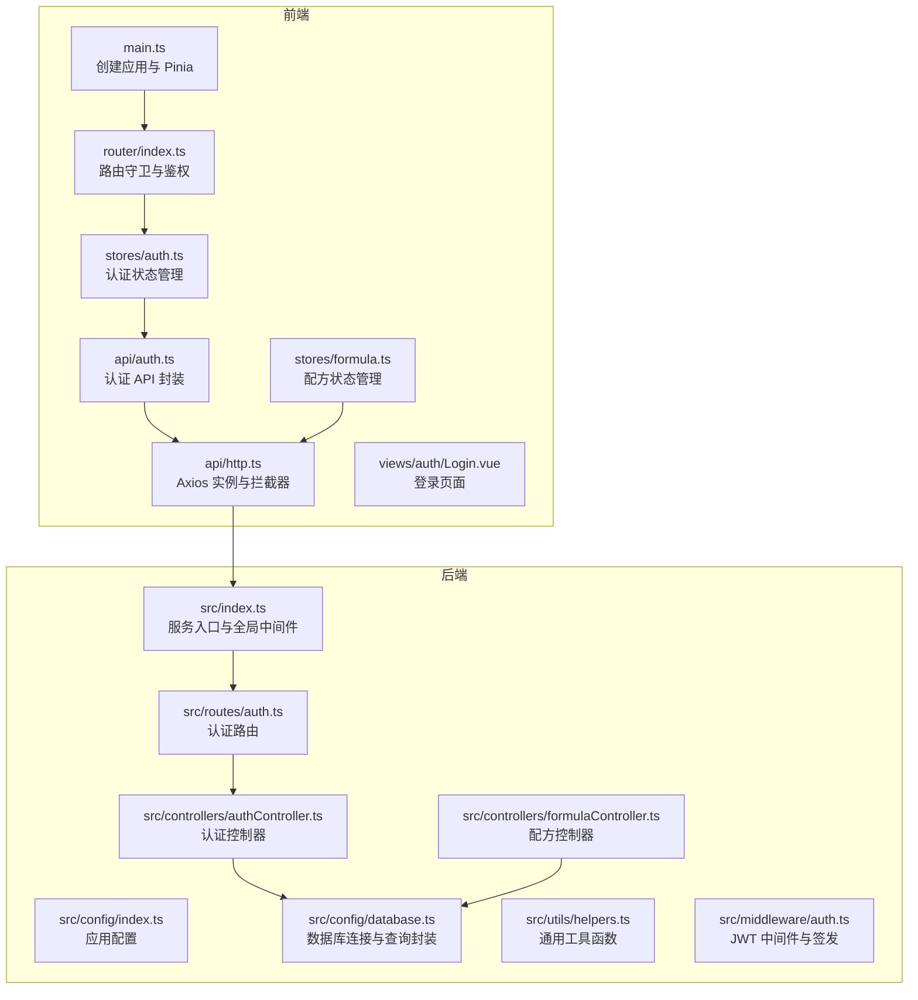
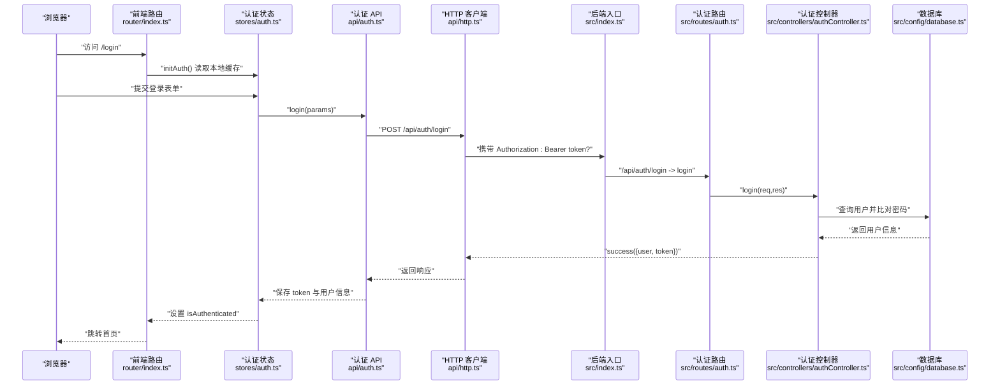
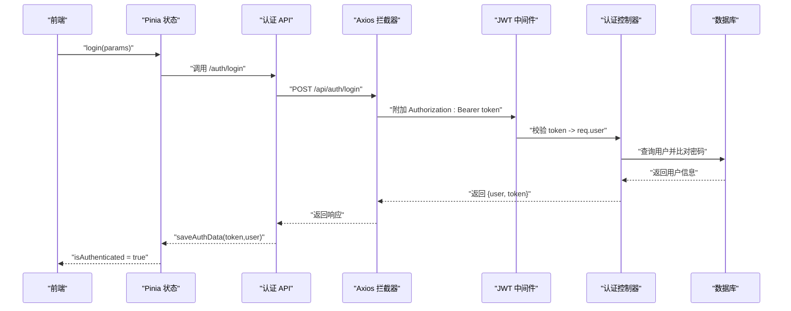
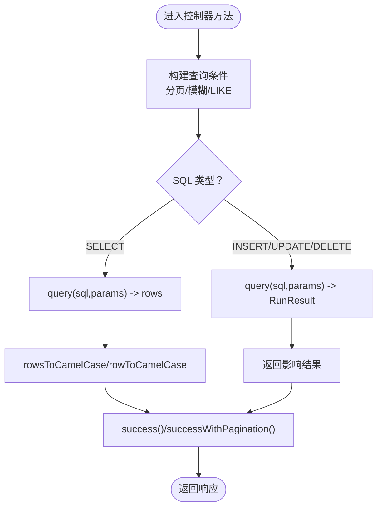
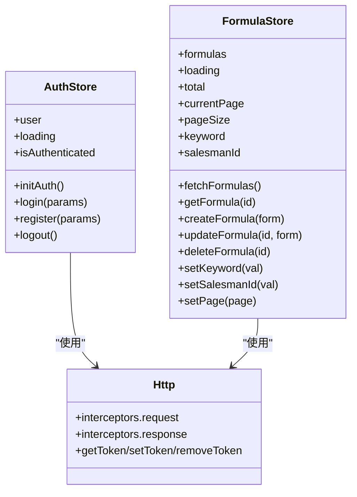
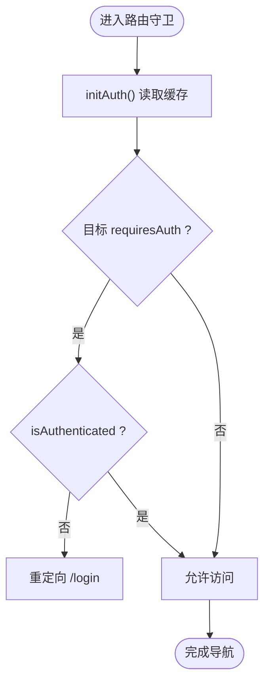
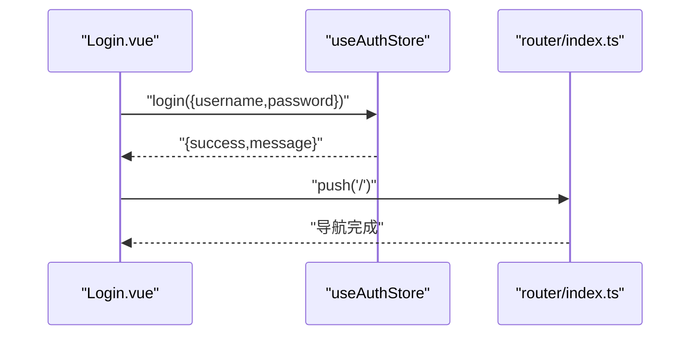
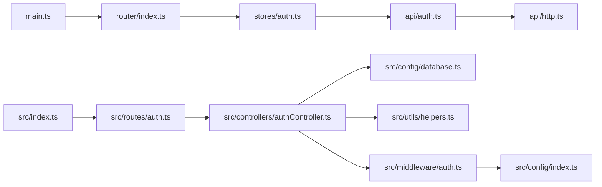

# 数据流架构

<cite>
**本文引用的文件**
- [后端入口 index.ts](file://backend/src/index.ts)
- [前端入口 main.ts](file://frontend/src/main.ts)
- [认证控制器 authController.ts](file://backend/src/controllers/authController.ts)
- [认证路由 auth.ts](file://backend/src/routes/auth.ts)
- [JWT 中间件 auth.ts](file://backend/src/middleware/auth.ts)
- [数据库配置 database.ts](file://backend/src/config/database.ts)
- [通用工具 helpers.ts](file://backend/src/utils/helpers.ts)
- [应用配置 config.ts](file://backend/src/config/index.ts)
- [HTTP 客户端 http.ts](file://frontend/src/api/http.ts)
- [认证 API auth.ts](file://frontend/src/api/auth.ts)
- [认证 Pinia 状态 auth.ts](file://frontend/src/stores/auth.ts)
- [路由配置 index.ts](file://frontend/src/router/index.ts)
- [配方控制器 formulaController.ts](file://backend/src/controllers/formulaController.ts)
- [配方 Pinia 状态 formula.ts](file://frontend/src/stores/formula.ts)
- [登录视图 Login.vue](file://frontend/src/views/auth/Login.vue)
</cite>

## 目录
1. [简介](#简介)
2. [项目结构](#项目结构)
3. [核心组件](#核心组件)
4. [架构总览](#架构总览)
5. [详细组件分析](#详细组件分析)
6. [依赖关系分析](#依赖关系分析)
7. [性能考量](#性能考量)
8. [故障排查指南](#故障排查指南)
9. [结论](#结论)
10. [附录](#附录)

## 简介
本文件面向 TingStudio 的数据流架构，系统性梳理从前端用户操作到后端数据库的完整数据流转路径，覆盖以下主题：
- HTTP 请求处理与路由分发
- JWT 认证流程与令牌传递机制
- Pinia 状态管理与本地缓存同步
- API 调用与错误处理
- 数据库操作与事务
- 前后端数据交互标准格式
- 缓存策略与性能优化建议
- 关键流程的时序图与数据流图

## 项目结构
TingStudio 采用前后端分离架构：
- 前端基于 Vue 3 + Pinia + Vue Router，通过 Axios 发起 API 请求
- 后端基于 Express + TypeScript，使用 better-sqlite3 作为数据库驱动
- 前端通过 /api 前缀访问后端接口，后端在根路径挂载 /api 路由

图表来源
- [后端入口 index.ts:13-55](file://backend/src/index.ts#L13-L55)
- [前端入口 main.ts:9-16](file://frontend/src/main.ts#L9-L16)
- [认证路由 auth.ts:7-19](file://backend/src/routes/auth.ts#L7-L19)
- [认证控制器 authController.ts:8-88](file://backend/src/controllers/authController.ts#L8-L88)
- [JWT 中间件 auth.ts:13-31](file://backend/src/middleware/auth.ts#L13-L31)
- [数据库配置 database.ts:10-61](file://backend/src/config/database.ts#L10-L61)
- [HTTP 客户端 http.ts:6-43](file://frontend/src/api/http.ts#L6-L43)
- [认证 API auth.ts:7-17](file://frontend/src/api/auth.ts#L7-L17)
- [认证 Pinia 状态 auth.ts:6-62](file://frontend/src/stores/auth.ts#L6-L62)
- [配方 Pinia 状态 formula.ts:9-134](file://frontend/src/stores/formula.ts#L9-L134)

章节来源
- [后端入口 index.ts:13-55](file://backend/src/index.ts#L13-L55)
- [前端入口 main.ts:9-16](file://frontend/src/main.ts#L9-L16)
- [认证路由 auth.ts:7-19](file://backend/src/routes/auth.ts#L7-L19)
- [认证控制器 authController.ts:8-88](file://backend/src/controllers/authController.ts#L8-L88)
- [JWT 中间件 auth.ts:13-31](file://backend/src/middleware/auth.ts#L13-L31)
- [数据库配置 database.ts:10-61](file://backend/src/config/database.ts#L10-L61)
- [HTTP 客户端 http.ts:6-43](file://frontend/src/api/http.ts#L6-L43)
- [认证 API auth.ts:7-17](file://frontend/src/api/auth.ts#L7-L17)
- [认证 Pinia 状态 auth.ts:6-62](file://frontend/src/stores/auth.ts#L6-L62)
- [配方 Pinia 状态 formula.ts:9-134](file://frontend/src/stores/formula.ts#L9-L134)

## 核心组件
- 前端应用与状态
  - 应用入口负责挂载 Pinia 与路由；认证与业务状态通过 Pinia Store 管理
  - 登录视图触发认证状态更新，随后跳转首页
- 后端服务与中间件
  - Express 服务启动后加载全局中间件（CORS、压缩、日志、JSON 解析）
  - JWT 中间件校验请求头 Authorization 中的 Bearer Token
  - 数据库层提供统一 query 封装，兼容 SELECT/INSERT/UPDATE/DELETE
- API 层
  - 前端通过 Axios 统一拦截器附加 Token 并集中处理错误
  - 后端控制器按领域拆分（认证、配方等），返回统一 success 结构

章节来源
- [前端入口 main.ts:9-16](file://frontend/src/main.ts#L9-L16)
- [后端入口 index.ts:20-30](file://backend/src/index.ts#L20-L30)
- [JWT 中间件 auth.ts:13-31](file://backend/src/middleware/auth.ts#L13-L31)
- [数据库配置 database.ts:44-55](file://backend/src/config/database.ts#L44-L55)
- [HTTP 客户端 http.ts:12-43](file://frontend/src/api/http.ts#L12-L43)
- [认证控制器 authController.ts:8-88](file://backend/src/controllers/authController.ts#L8-L88)

## 架构总览
下图展示了从浏览器到数据库的端到端数据流，涵盖认证、鉴权与业务数据读写。

图表来源
- [路由配置 index.ts:148-162](file://frontend/src/router/index.ts#L148-L162)
- [认证 Pinia 状态 auth.ts:19-32](file://frontend/src/stores/auth.ts#L19-L32)
- [认证 API auth.ts:8-16](file://frontend/src/api/auth.ts#L8-L16)
- [HTTP 客户端 http.ts:12-19](file://frontend/src/api/http.ts#L12-L19)
- [后端入口 index.ts:34-35](file://backend/src/index.ts#L34-L35)
- [认证路由 auth.ts:17-17](file://backend/src/routes/auth.ts#L17-L17)
- [认证控制器 authController.ts:42-71](file://backend/src/controllers/authController.ts#L42-L71)
- [数据库配置 database.ts:44-55](file://backend/src/config/database.ts#L44-L55)

## 详细组件分析

### 认证与 JWT 流程
- 前端
  - 登录成功后，将 token 写入 localStorage，并缓存用户信息
  - 请求拦截器自动在 Authorization 头添加 Bearer token
  - 响应拦截器统一处理错误，401 时清理缓存并重定向登录
- 后端
  - 登录接口验证用户名与密码，成功后签发 JWT
  - 鉴权中间件从 Authorization 头解析 Bearer token 并写入 req.user
  - 受保护路由通过中间件校验，否则返回 401

图表来源
- [认证 Pinia 状态 auth.ts:19-32](file://frontend/src/stores/auth.ts#L19-L32)
- [认证 API auth.ts:8-16](file://frontend/src/api/auth.ts#L8-L16)
- [HTTP 客户端 http.ts:12-19](file://frontend/src/api/http.ts#L12-L19)
- [JWT 中间件 auth.ts:13-31](file://backend/src/middleware/auth.ts#L13-L31)
- [认证控制器 authController.ts:42-71](file://backend/src/controllers/authController.ts#L42-L71)
- [数据库配置 database.ts:44-55](file://backend/src/config/database.ts#L44-L55)

章节来源
- [认证 Pinia 状态 auth.ts:19-32](file://frontend/src/stores/auth.ts#L19-L32)
- [认证 API auth.ts:19-35](file://frontend/src/api/auth.ts#L19-L35)
- [HTTP 客户端 http.ts:12-43](file://frontend/src/api/http.ts#L12-L43)
- [JWT 中间件 auth.ts:13-31](file://backend/src/middleware/auth.ts#L13-L31)
- [认证控制器 authController.ts:42-71](file://backend/src/controllers/authController.ts#L42-L71)

### 数据库查询与事务
- 查询封装
  - query 函数根据 SQL 类型区分 SELECT 与 DML，返回兼容数组解构的结构
  - 支持 LIKE 条件构建、分页参数生成、驼峰字段转换
- 事务支持
  - 提供 transaction 包装，确保多条写入的一致性
- 使用示例
  - 控制器中使用 query 执行增删改查，返回统一 success 结构

图表来源
- [数据库配置 database.ts:44-55](file://backend/src/config/database.ts#L44-L55)
- [通用工具 helpers.ts:26-51](file://backend/src/utils/helpers.ts#L26-L51)
- [配方控制器 formulaController.ts:6-69](file://backend/src/controllers/formulaController.ts#L6-L69)

章节来源
- [数据库配置 database.ts:44-55](file://backend/src/config/database.ts#L44-L55)
- [通用工具 helpers.ts:26-51](file://backend/src/utils/helpers.ts#L26-L51)
- [配方控制器 formulaController.ts:6-69](file://backend/src/controllers/formulaController.ts#L6-L69)

### 前端状态管理与缓存
- 认证状态
  - 初始化从 localStorage 读取缓存用户信息
  - 登录/注册成功后写入 token 与用户信息
  - 登出清除缓存并重置状态
- 配方状态
  - 列表加载时合并分页与筛选条件，解析 materialsJson/description 并格式化时间戳
  - 提供 CRUD 方法，统一错误提示与加载状态

图表来源
- [认证 Pinia 状态 auth.ts:6-62](file://frontend/src/stores/auth.ts#L6-L62)
- [配方 Pinia 状态 formula.ts:9-134](file://frontend/src/stores/formula.ts#L9-L134)
- [HTTP 客户端 http.ts:45-57](file://frontend/src/api/http.ts#L45-L57)

章节来源
- [认证 Pinia 状态 auth.ts:6-62](file://frontend/src/stores/auth.ts#L6-L62)
- [配方 Pinia 状态 formula.ts:9-134](file://frontend/src/stores/formula.ts#L9-L134)
- [HTTP 客户端 http.ts:45-57](file://frontend/src/api/http.ts#L45-L57)

### 路由守卫与鉴权
- 路由守卫在每次导航前检查认证状态
  - 若未登录且目标需要认证，则重定向至登录页
  - 已登录访问登录/注册页则重定向首页
  - 首次访问时尝试从本地缓存恢复认证状态

图表来源
- [路由配置 index.ts:148-162](file://frontend/src/router/index.ts#L148-L162)

章节来源
- [路由配置 index.ts:148-162](file://frontend/src/router/index.ts#L148-L162)

### 登录视图与状态联动
- 登录视图收集表单数据，调用认证状态的 login 方法
- 成功后提示并跳转首页，失败显示错误消息

图表来源
- [登录视图 Login.vue:290-308](file://frontend/src/views/auth/Login.vue#L290-L308)
- [路由配置 index.ts:148-162](file://frontend/src/router/index.ts#L148-L162)
- [认证 Pinia 状态 auth.ts:19-32](file://frontend/src/stores/auth.ts#L19-L32)

章节来源
- [登录视图 Login.vue:290-308](file://frontend/src/views/auth/Login.vue#L290-L308)
- [路由配置 index.ts:148-162](file://frontend/src/router/index.ts#L148-L162)
- [认证 Pinia 状态 auth.ts:19-32](file://frontend/src/stores/auth.ts#L19-L32)

## 依赖关系分析
- 前端
  - main.ts 依赖 Pinia 与路由
  - stores/* 依赖 api/* 与工具函数
  - api/* 依赖 http.ts
  - router/index.ts 依赖 stores/auth.ts
- 后端
  - index.ts 依赖 routes/* 与中间件
  - routes/* 依赖 controllers/*
  - controllers/* 依赖 config/database.ts 与 utils/helpers.ts
  - middleware/auth.ts 依赖 config/index.ts

图表来源
- [前端入口 main.ts:9-16](file://frontend/src/main.ts#L9-L16)
- [路由配置 index.ts:148-162](file://frontend/src/router/index.ts#L148-L162)
- [认证 Pinia 状态 auth.ts:6-62](file://frontend/src/stores/auth.ts#L6-L62)
- [认证 API auth.ts:7-17](file://frontend/src/api/auth.ts#L7-L17)
- [HTTP 客户端 http.ts:6-10](file://frontend/src/api/http.ts#L6-L10)
- [后端入口 index.ts:34-35](file://backend/src/index.ts#L34-L35)
- [认证路由 auth.ts:7-19](file://backend/src/routes/auth.ts#L7-L19)
- [认证控制器 authController.ts:8-88](file://backend/src/controllers/authController.ts#L8-L88)
- [数据库配置 database.ts:10-61](file://backend/src/config/database.ts#L10-L61)
- [通用工具 helpers.ts:26-51](file://backend/src/utils/helpers.ts#L26-L51)
- [JWT 中间件 auth.ts:13-31](file://backend/src/middleware/auth.ts#L13-L31)
- [应用配置 config.ts:10-13](file://backend/src/config/index.ts#L10-L13)

章节来源
- [前端入口 main.ts:9-16](file://frontend/src/main.ts#L9-L16)
- [路由配置 index.ts:148-162](file://frontend/src/router/index.ts#L148-L162)
- [认证 Pinia 状态 auth.ts:6-62](file://frontend/src/stores/auth.ts#L6-L62)
- [认证 API auth.ts:7-17](file://frontend/src/api/auth.ts#L7-L17)
- [HTTP 客户端 http.ts:6-10](file://frontend/src/api/http.ts#L6-L10)
- [后端入口 index.ts:34-35](file://backend/src/index.ts#L34-L35)
- [认证路由 auth.ts:7-19](file://backend/src/routes/auth.ts#L7-L19)
- [认证控制器 authController.ts:8-88](file://backend/src/controllers/authController.ts#L8-L88)
- [数据库配置 database.ts:10-61](file://backend/src/config/database.ts#L10-L61)
- [通用工具 helpers.ts:26-51](file://backend/src/utils/helpers.ts#L26-L51)
- [JWT 中间件 auth.ts:13-31](file://backend/src/middleware/auth.ts#L13-L31)
- [应用配置 config.ts:10-13](file://backend/src/config/index.ts#L10-L13)

## 性能考量
- 前端
  - 使用 Pinia 进行细粒度状态管理，避免不必要的响应式开销
  - 在列表加载时统一处理 loading 与错误提示，减少重复逻辑
- 后端
  - better-sqlite3 适合中小规模数据，开启 WAL 与外键约束提升并发与一致性
  - 控制器中对批量查询进行合并（如配方版本聚合），减少 N+1 查询
- 通用
  - 统一响应结构与错误处理，便于前端快速反馈
  - 通过拦截器集中处理 Token 与错误，降低重复代码

## 故障排查指南
- 登录后 401
  - 检查前端是否正确保存 token 与用户信息
  - 检查后端 JWT secret 与过期时间配置
  - 确认请求头 Authorization 是否包含 Bearer token
- 接口报错
  - 查看后端响应拦截器输出的消息
  - 检查数据库连接与 SQL 参数绑定
- 页面无法跳转
  - 检查路由守卫逻辑与认证状态初始化

章节来源
- [HTTP 客户端 http.ts:31-42](file://frontend/src/api/http.ts#L31-L42)
- [JWT 中间件 auth.ts:20-30](file://backend/src/middleware/auth.ts#L20-L30)
- [应用配置 config.ts:10-13](file://backend/src/config/index.ts#L10-L13)
- [路由配置 index.ts:148-162](file://frontend/src/router/index.ts#L148-L162)

## 结论
TingStudio 的数据流架构以“前后端分离 + 统一响应格式 + 明确鉴权链路”为核心设计原则。通过 Axios 拦截器与 Pinia 状态管理，实现了简洁一致的认证与数据交互体验；后端以 better-sqlite3 为基础，配合中间件与控制器分层，保证了可维护性与扩展性。建议在后续迭代中引入更完善的缓存策略（如 HTTP 缓存头、客户端缓存键空间）与监控埋点，进一步提升性能与可观测性。

## 附录
- 前后端数据交互标准格式
  - 成功响应：{ success: true, message, data }
  - 分页响应：{ success: true, message, data: { list, pagination: { page, pageSize, total, totalPages } } }
  - 失败响应：{ success: false, message, error? }
- 缓存策略建议
  - 前端：登录态与用户信息持久化于 localStorage；列表数据按路由/查询参数建立缓存键
  - 后端：对热点查询结果进行内存缓存（需考虑并发与失效策略）