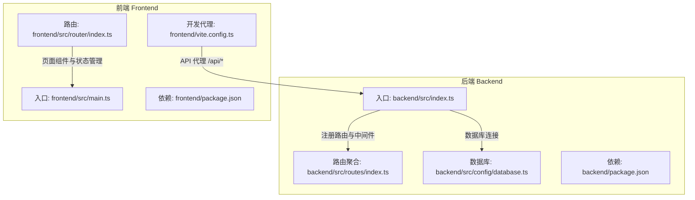
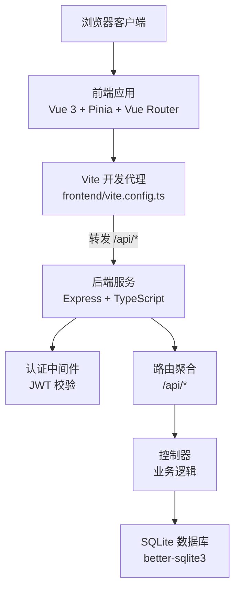
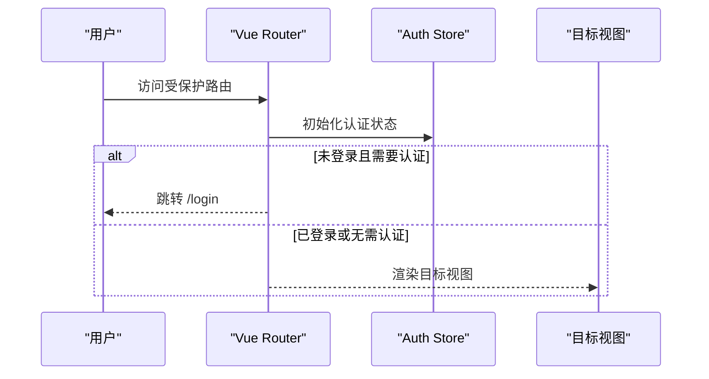
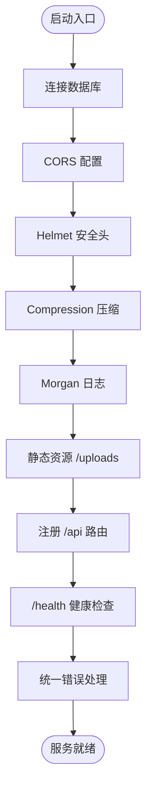
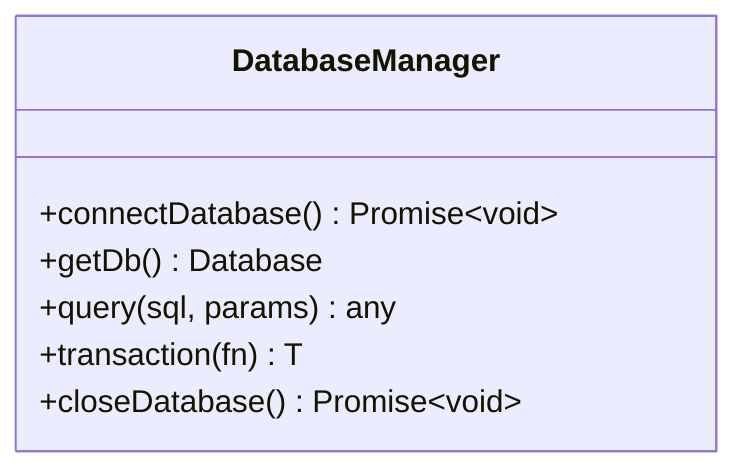
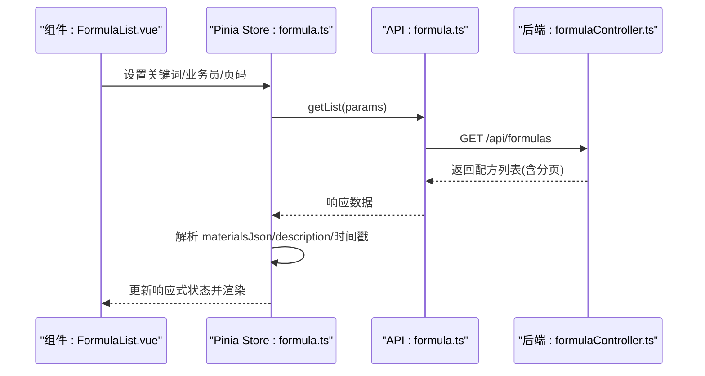
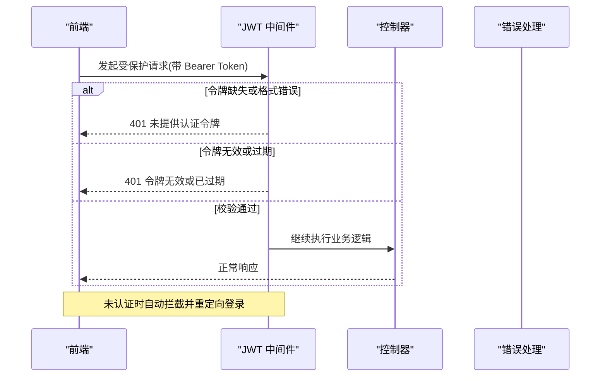
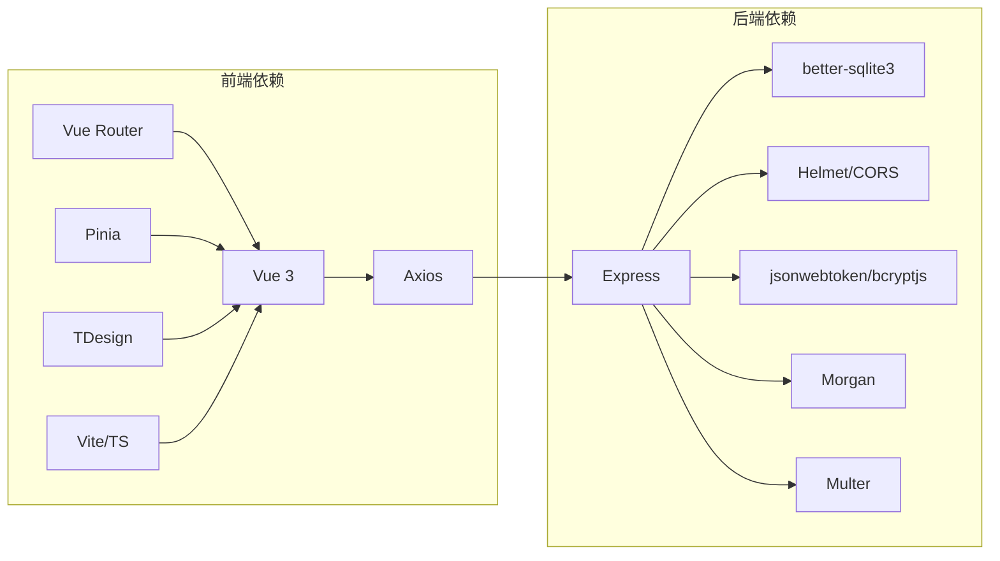

# 整体架构概览

<cite>
**本文档引用的文件**
- [README.md](file://README.md)
- [backend/package.json](file://backend/package.json)
- [frontend/package.json](file://frontend/package.json)
- [backend/src/index.ts](file://backend/src/index.ts)
- [frontend/src/main.ts](file://frontend/src/main.ts)
- [backend/src/routes/index.ts](file://backend/src/routes/index.ts)
- [frontend/src/router/index.ts](file://frontend/src/router/index.ts)
- [backend/src/config/database.ts](file://backend/src/config/database.ts)
- [frontend/vite.config.ts](file://frontend/vite.config.ts)
- [backend/src/controllers/formulaController.ts](file://backend/src/controllers/formulaController.ts)
- [frontend/src/stores/formula.ts](file://frontend/src/stores/formula.ts)
- [frontend/src/api/formula.ts](file://frontend/src/api/formula.ts)
- [backend/src/middleware/auth.ts](file://backend/src/middleware/auth.ts)
- [backend/src/config/index.ts](file://backend/src/config/index.ts)
- [backend/DATABASE_DOC.md](file://backend/DATABASE_DOC.md)
- [frontend/src/views/formulas/FormulaList.vue](file://frontend/src/views/formulas/FormulaList.vue)
- [frontend/src/App.vue](file://frontend/src/App.vue)
</cite>

## 目录
1. [简介](#简介)
2. [项目结构](#项目结构)
3. [核心组件](#核心组件)
4. [架构总览](#架构总览)
5. [详细组件分析](#详细组件分析)
6. [依赖关系分析](#依赖关系分析)
7. [性能考虑](#性能考虑)
8. [故障排查指南](#故障排查指南)
9. [结论](#结论)

## 简介
TingStudio 是一个面向食品配方工作的数据管理平台，采用前后端分离架构：前端基于 Vue 3 + TypeScript，后端基于 Express + TypeScript，数据库采用 SQLite（better-sqlite3）。系统支持 JWT 认证、RESTful API、配方版本控制、营养分析与合规检查、导出分享等功能，适合中小团队在本地或轻量部署场景下高效管理配方数据。

## 项目结构
项目采用“前后端独立仓库”的组织方式，根目录包含 backend 与 frontend 两个子工程，分别通过各自的 package.json 管理依赖与脚本。后端提供 REST API，前端通过 Vite 开发服务器与后端 API 代理进行联调。

图表来源
- [backend/src/index.ts:1-61](file://backend/src/index.ts#L1-L61)
- [backend/src/routes/index.ts:1-24](file://backend/src/routes/index.ts#L1-L24)
- [backend/src/config/database.ts:1-70](file://backend/src/config/database.ts#L1-L70)
- [frontend/src/main.ts:1-17](file://frontend/src/main.ts#L1-L17)
- [frontend/src/router/index.ts:1-165](file://frontend/src/router/index.ts#L1-L165)
- [frontend/vite.config.ts:1-23](file://frontend/vite.config.ts#L1-L23)

章节来源
- [README.md:65-113](file://README.md#L65-L113)
- [backend/package.json:1-42](file://backend/package.json#L1-L42)
- [frontend/package.json:1-30](file://frontend/package.json#L1-L30)

## 核心组件
- 前端核心
  - 应用入口与插件注册：frontend/src/main.ts
  - 路由与导航：frontend/src/router/index.ts
  - 开发服务器与 API 代理：frontend/vite.config.ts
  - 页面组件与状态管理：frontend/src/views/* 与 frontend/src/stores/*
  - API 层封装：frontend/src/api/*

- 后端核心
  - 应用入口与中间件：backend/src/index.ts
  - 路由聚合：backend/src/routes/index.ts
  - 数据库连接与事务：backend/src/config/database.ts
  - 控制器示例：backend/src/controllers/formulaController.ts
  - 认证中间件：backend/src/middleware/auth.ts
  - 配置中心：backend/src/config/index.ts

章节来源
- [frontend/src/main.ts:1-17](file://frontend/src/main.ts#L1-L17)
- [frontend/src/router/index.ts:1-165](file://frontend/src/router/index.ts#L1-L165)
- [frontend/vite.config.ts:1-23](file://frontend/vite.config.ts#L1-L23)
- [backend/src/index.ts:1-61](file://backend/src/index.ts#L1-L61)
- [backend/src/routes/index.ts:1-24](file://backend/src/routes/index.ts#L1-L24)
- [backend/src/config/database.ts:1-70](file://backend/src/config/database.ts#L1-L70)
- [backend/src/controllers/formulaController.ts:1-200](file://backend/src/controllers/formulaController.ts#L1-L200)
- [backend/src/middleware/auth.ts:1-38](file://backend/src/middleware/auth.ts#L1-L38)
- [backend/src/config/index.ts:1-24](file://backend/src/config/index.ts#L1-L24)

## 架构总览
系统采用典型的三层架构：前端 Vue 3 SPA、后端 Express REST API、SQLite 数据库存储。前后端通过 /api 前缀进行通信，开发阶段前端通过 Vite 代理将 /api 请求转发至后端 3000 端口；生产部署时可通过反向代理统一暴露 API。

图表来源
- [frontend/vite.config.ts:12-21](file://frontend/vite.config.ts#L12-L21)
- [backend/src/index.ts:20-35](file://backend/src/index.ts#L20-L35)
- [backend/src/routes/index.ts:11-23](file://backend/src/routes/index.ts#L11-L23)
- [backend/src/middleware/auth.ts:13-31](file://backend/src/middleware/auth.ts#L13-L31)
- [backend/src/config/database.ts:10-37](file://backend/src/config/database.ts#L10-L37)

## 详细组件分析

### 前端应用与路由
- 应用入口完成插件注册（Pinia、Router、TDesign），挂载根组件
- 路由采用 history 模式，定义了认证/授权相关的元信息，支持登录拦截与已登录跳转首页
- 通过动态 import 加载页面组件，实现按需加载与代码分割

图表来源
- [frontend/src/router/index.ts:148-162](file://frontend/src/router/index.ts#L148-L162)
- [frontend/src/main.ts:9-16](file://frontend/src/main.ts#L9-L16)

章节来源
- [frontend/src/main.ts:1-17](file://frontend/src/main.ts#L1-L17)
- [frontend/src/router/index.ts:1-165](file://frontend/src/router/index.ts#L1-L165)

### 后端服务与中间件
- 入口文件集中初始化数据库、中间件（CORS、Helmet、Compression、Morgan）、静态资源与路由
- 提供健康检查端点与统一 404/错误处理
- 配置中心集中管理端口、数据库路径、JWT 密钥、上传目录、跨域来源等

图表来源
- [backend/src/index.ts:13-54](file://backend/src/index.ts#L13-L54)
- [backend/src/config/index.ts:2-23](file://backend/src/config/index.ts#L2-L23)

章节来源
- [backend/src/index.ts:1-61](file://backend/src/index.ts#L1-L61)
- [backend/src/config/index.ts:1-24](file://backend/src/config/index.ts#L1-L24)

### 数据库与事务
- 使用 better-sqlite3 连接 SQLite，启用 WAL 模式与外键约束提升并发与一致性
- 提供通用 query 封装，兼容 SELECT 返回数组与 DML 返回变更信息
- 提供 transaction 封装，便于复杂写入流程的一致性保证

图表来源
- [backend/src/config/database.ts:10-70](file://backend/src/config/database.ts#L10-L70)

章节来源
- [backend/src/config/database.ts:1-70](file://backend/src/config/database.ts#L1-L70)

### API 与状态管理（配方模块）
- 前端通过 API 层封装对后端 /api/formulas 的 GET/POST/PUT/DELETE 调用
- Pinia Store 负责配方列表、详情、分页、搜索条件的状态管理，并在加载时进行数据解析与格式化
- 列表页组件使用表格与展开行展示配方信息与原料清单，支持分页与操作按钮

图表来源
- [frontend/src/views/formulas/FormulaList.vue:175-184](file://frontend/src/views/formulas/FormulaList.vue#L175-L184)
- [frontend/src/stores/formula.ts:18-44](file://frontend/src/stores/formula.ts#L18-L44)
- [frontend/src/api/formula.ts:35-37](file://frontend/src/api/formula.ts#L35-L37)
- [backend/src/controllers/formulaController.ts:7-48](file://backend/src/controllers/formulaController.ts#L7-L48)

章节来源
- [frontend/src/stores/formula.ts:1-166](file://frontend/src/stores/formula.ts#L1-L166)
- [frontend/src/api/formula.ts:1-54](file://frontend/src/api/formula.ts#L1-L54)
- [frontend/src/views/formulas/FormulaList.vue:1-200](file://frontend/src/views/formulas/FormulaList.vue#L1-L200)
- [backend/src/controllers/formulaController.ts:1-200](file://backend/src/controllers/formulaController.ts#L1-L200)

### 认证与安全
- 后端通过 JWT 中间件校验请求头中的 Authorization Bearer Token
- 配置中心集中管理 JWT 密钥与过期时间，支持环境变量覆盖
- 前端路由守卫在进入受保护路由前初始化认证状态并进行跳转控制

图表来源
- [backend/src/middleware/auth.ts:13-31](file://backend/src/middleware/auth.ts#L13-L31)
- [backend/src/config/index.ts:10-13](file://backend/src/config/index.ts#L10-L13)
- [frontend/src/router/index.ts:148-162](file://frontend/src/router/index.ts#L148-L162)

章节来源
- [backend/src/middleware/auth.ts:1-38](file://backend/src/middleware/auth.ts#L1-L38)
- [backend/src/config/index.ts:1-24](file://backend/src/config/index.ts#L1-L24)
- [frontend/src/router/index.ts:1-165](file://frontend/src/router/index.ts#L1-L165)

## 依赖关系分析
- 前端依赖
  - 运行时：Vue 3、Pinia、Vue Router、Axios
  - UI：TDesign Vue Next
  - 表单校验：VeeValidate + Yup
  - 构建：Vite、TypeScript
- 后端依赖
  - Web：Express、better-sqlite3
  - 安全：Helmet、CORS、Rate Limit
  - 认证：jsonwebtoken、bcryptjs
  - 日志：Morgan
  - 文件上传：Multer

图表来源
- [frontend/package.json:12-29](file://frontend/package.json#L12-L29)
- [backend/package.json:14-26](file://backend/package.json#L14-L26)

章节来源
- [frontend/package.json:1-30](file://frontend/package.json#L1-L30)
- [backend/package.json:1-42](file://backend/package.json#L1-L42)

## 性能考虑
- 前端
  - 使用动态 import 与路由懒加载减少首屏体积
  - Vite 构建优化与按需引入 UI 组件库
- 后端
  - better-sqlite3 本地文件数据库，I/O 性能稳定；开启 WAL 模式提升并发读取
  - Compression 中间件降低传输体积
  - Rate Limit 限制恶意请求，保护服务稳定性
- 数据库
  - 通过索引与查询条件优化（如按业务员、关键词）提升检索效率
  - 配方版本表采用 JSON 存储快照，便于历史追溯与对比

## 故障排查指南
- 启动失败
  - 检查后端入口日志与错误处理中间件输出
  - 确认数据库初始化脚本是否执行
- 跨域问题
  - 校验 CORS 配置与前端代理 target 是否一致
- 认证失败
  - 确认请求头 Authorization 格式与 JWT 密钥配置
- 数据库异常
  - 检查数据库路径与 WAL/外键设置，必要时重建数据库

章节来源
- [backend/src/index.ts:57-60](file://backend/src/index.ts#L57-L60)
- [backend/src/config/index.ts:20-22](file://backend/src/config/index.ts#L20-L22)
- [backend/src/middleware/auth.ts:13-31](file://backend/src/middleware/auth.ts#L13-L31)
- [backend/src/config/database.ts:10-37](file://backend/src/config/database.ts#L10-L37)

## 结论
TingStudio 采用“Vue 3 前端 + Express 后端 + SQLite 数据库”的技术栈，结合 JWT 认证、RESTful API、版本控制与营养分析能力，形成一套完整、清晰且易于维护的食品配方管理解决方案。该架构在开发体验、部署便捷性与功能扩展性之间取得良好平衡，适合中小团队快速落地与迭代。