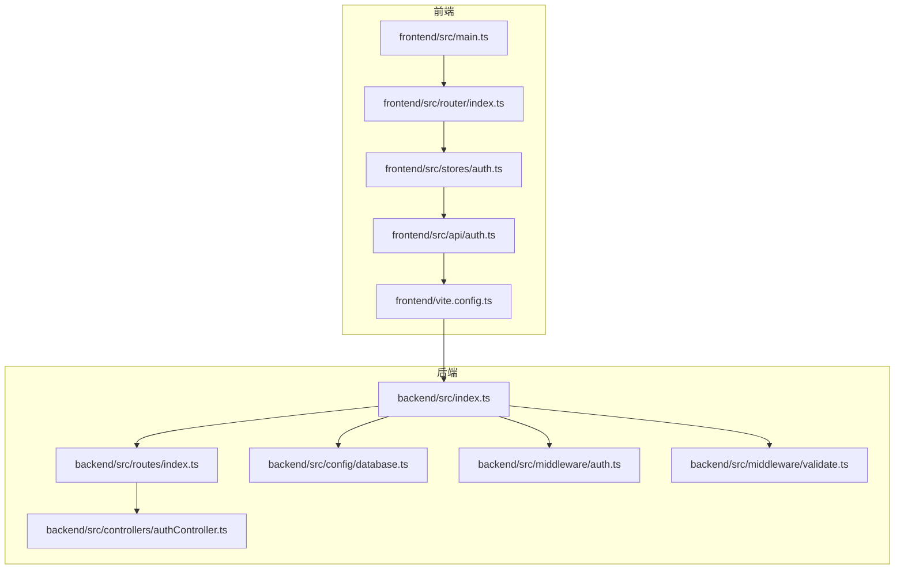
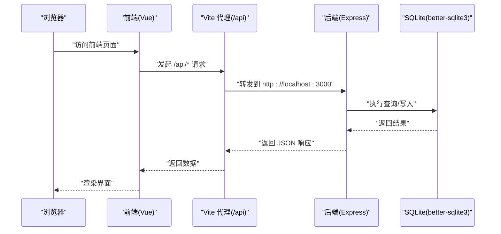
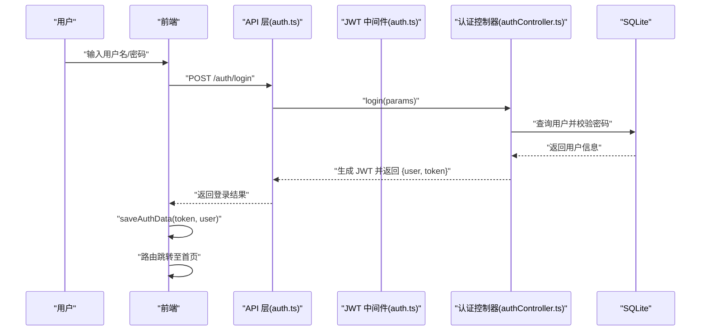
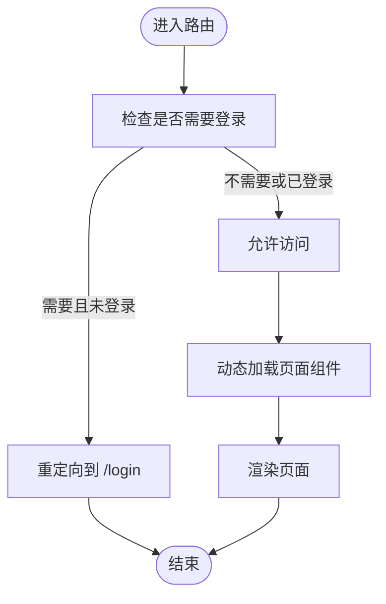
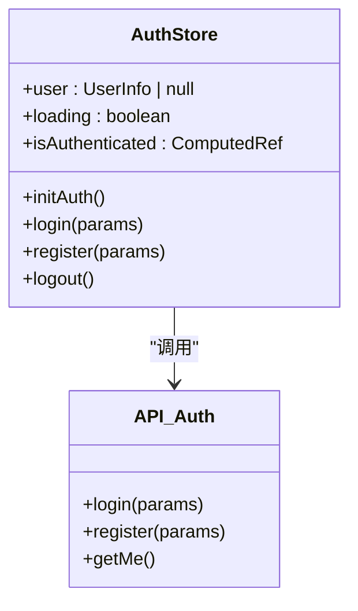
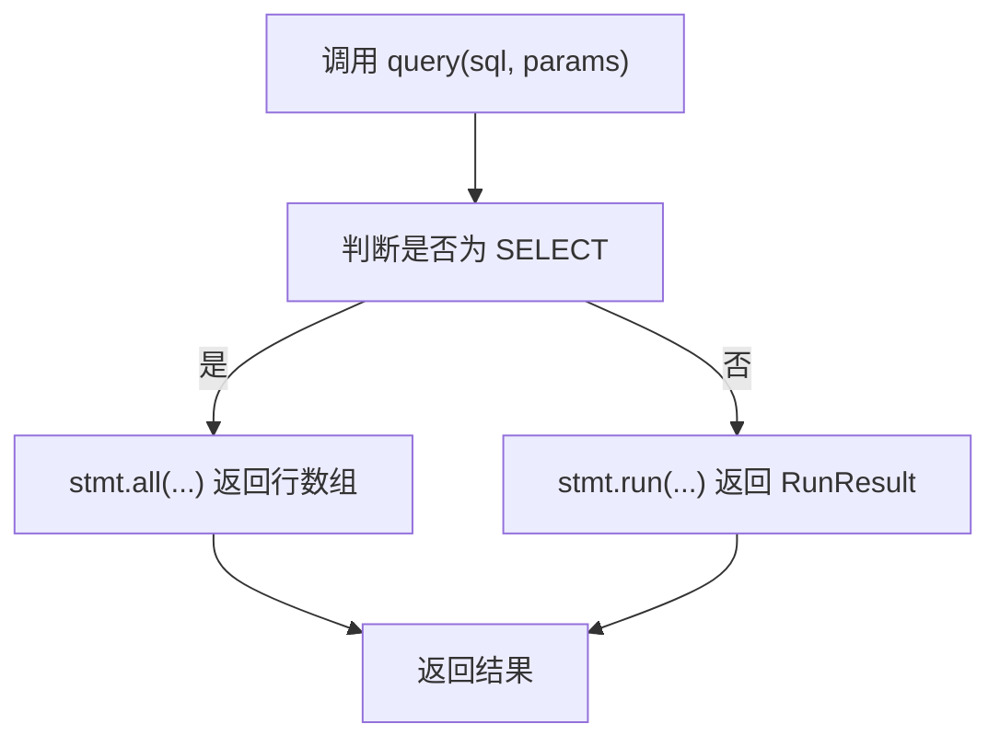
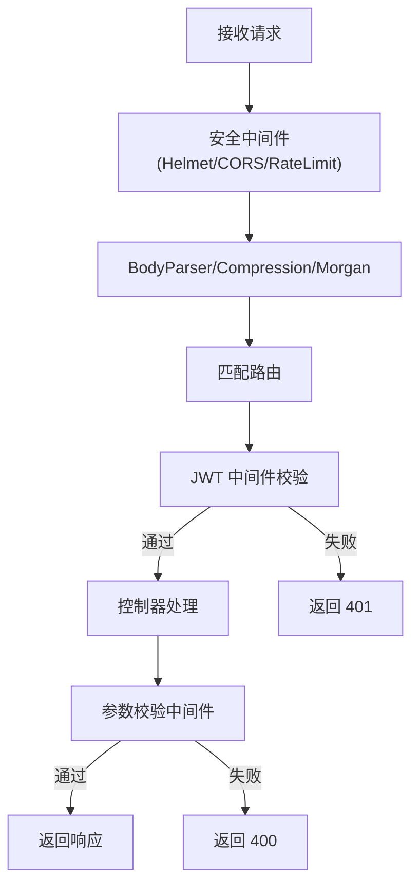
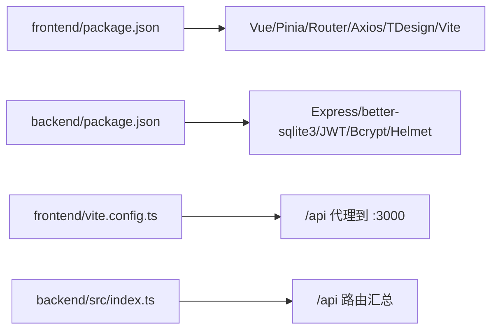

# 系统架构设计

<cite>
**本文引用的文件**
- [README.md](file://README.md)
- [backend/package.json](file://backend/package.json)
- [frontend/package.json](file://frontend/package.json)
- [backend/src/index.ts](file://backend/src/index.ts)
- [backend/src/config/database.ts](file://backend/src/config/database.ts)
- [backend/src/routes/index.ts](file://backend/src/routes/index.ts)
- [backend/src/controllers/authController.ts](file://backend/src/controllers/authController.ts)
- [backend/src/middleware/auth.ts](file://backend/src/middleware/auth.ts)
- [backend/src/middleware/validate.ts](file://backend/src/middleware/validate.ts)
- [backend/src/utils/helpers.ts](file://backend/src/utils/helpers.ts)
- [frontend/src/main.ts](file://frontend/src/main.ts)
- [frontend/src/router/index.ts](file://frontend/src/router/index.ts)
- [frontend/src/stores/auth.ts](file://frontend/src/stores/auth.ts)
- [frontend/src/api/auth.ts](file://frontend/src/api/auth.ts)
- [frontend/vite.config.ts](file://frontend/vite.config.ts)
</cite>

## 目录
1. [引言](#引言)
2. [项目结构](#项目结构)
3. [核心组件](#核心组件)
4. [架构总览](#架构总览)
5. [详细组件分析](#详细组件分析)
6. [依赖分析](#依赖分析)
7. [性能考虑](#性能考虑)
8. [故障排查指南](#故障排查指南)
9. [结论](#结论)
10. [附录](#附录)

## 引言
本文件为 TingStudio 的系统架构设计文档，面向前后端分离架构下的开发者与技术评审人员。系统采用 Vue 3 + Express + SQLite 技术栈，围绕 RESTful API 提供认证、配方管理、原料管理、业务员管理、版本控制、导出分享、营养分析等完整功能链路。文档将从整体架构、数据流、组件交互、认证流程、路由与状态管理、可扩展性与安全、性能优化等方面进行系统化阐述，并辅以架构图与组件关系图，帮助读者快速理解与落地实施。

## 项目结构
TingStudio 采用典型的前后端分离工程组织方式：
- 后端：基于 Express 的 Node.js 服务，提供 RESTful API，使用 better-sqlite3 连接 SQLite，通过中间件实现安全与校验，模块化控制器与路由。
- 前端：基于 Vue 3 + Vite 的单页应用，使用 Vue Router 管理页面路由，Pinia 管理全局状态，Axios 封装 HTTP 请求，TDesign Vue Next 提供 UI 组件库。

**图表来源**
- [frontend/src/main.ts:1-17](file://frontend/src/main.ts#L1-L17)
- [frontend/src/router/index.ts:1-165](file://frontend/src/router/index.ts#L1-L165)
- [frontend/src/stores/auth.ts:1-64](file://frontend/src/stores/auth.ts#L1-L64)
- [frontend/src/api/auth.ts:1-36](file://frontend/src/api/auth.ts#L1-L36)
- [frontend/vite.config.ts:1-23](file://frontend/vite.config.ts#L1-L23)
- [backend/src/index.ts:1-61](file://backend/src/index.ts#L1-L61)
- [backend/src/routes/index.ts:1-24](file://backend/src/routes/index.ts#L1-L24)
- [backend/src/config/database.ts:1-70](file://backend/src/config/database.ts#L1-L70)
- [backend/src/middleware/auth.ts:1-38](file://backend/src/middleware/auth.ts#L1-L38)
- [backend/src/middleware/validate.ts:1-68](file://backend/src/middleware/validate.ts#L1-L68)
- [backend/src/controllers/authController.ts:1-89](file://backend/src/controllers/authController.ts#L1-L89)

**章节来源**
- [README.md:65-113](file://README.md#L65-L113)
- [backend/src/index.ts:13-55](file://backend/src/index.ts#L13-L55)
- [frontend/src/main.ts:1-17](file://frontend/src/main.ts#L1-L17)

## 核心组件
- 前端应用入口与依赖注入：Vue 应用在入口文件中挂载 Pinia、Vue Router、TDesign，并挂载根组件。
- 前端路由与鉴权守卫：基于 meta 字段控制页面访问权限，结合 Pinia 状态管理实现登录态判断与跳转。
- 前端状态管理：Pinia Store 封装认证状态、加载状态与持久化存储；API 层负责与后端交互。
- 后端服务入口：Express 应用初始化中间件、静态资源、路由与健康检查，统一错误处理。
- 数据库连接：better-sqlite3 连接 SQLite，启用 WAL 与外键约束，提供 query 与 transaction 封装。
- 认证与请求校验：JWT 中间件解析与校验令牌；通用校验中间件对请求体进行规则校验。
- 控制器：认证控制器提供注册、登录、获取当前用户等接口。

**章节来源**
- [frontend/src/main.ts:1-17](file://frontend/src/main.ts#L1-L17)
- [frontend/src/router/index.ts:148-162](file://frontend/src/router/index.ts#L148-L162)
- [frontend/src/stores/auth.ts:1-64](file://frontend/src/stores/auth.ts#L1-L64)
- [frontend/src/api/auth.ts:1-36](file://frontend/src/api/auth.ts#L1-L36)
- [backend/src/index.ts:13-55](file://backend/src/index.ts#L13-L55)
- [backend/src/config/database.ts:10-70](file://backend/src/config/database.ts#L10-L70)
- [backend/src/middleware/auth.ts:13-37](file://backend/src/middleware/auth.ts#L13-L37)
- [backend/src/middleware/validate.ts:16-67](file://backend/src/middleware/validate.ts#L16-L67)
- [backend/src/controllers/authController.ts:9-88](file://backend/src/controllers/authController.ts#L9-L88)

## 架构总览
系统采用前后端分离架构，前端通过 Vite 开发服务器与后端 API 通过本地代理互通，后端以 Express 提供 RESTful 服务，数据持久化采用 SQLite。整体交互遵循“浏览器 → 前端代理 → 后端 API → 数据库”的数据流向。

**图表来源**
- [frontend/vite.config.ts:15-20](file://frontend/vite.config.ts#L15-L20)
- [backend/src/index.ts:34-48](file://backend/src/index.ts#L34-L48)
- [backend/src/config/database.ts:44-61](file://backend/src/config/database.ts#L44-L61)

**章节来源**
- [README.md:115-148](file://README.md#L115-L148)
- [frontend/vite.config.ts:1-23](file://frontend/vite.config.ts#L1-L23)
- [backend/src/index.ts:13-55](file://backend/src/index.ts#L13-L55)

## 详细组件分析

### 认证与会话管理
- 前端：登录/注册通过 API 层调用后端，成功后将 token 与用户信息写入本地存储；路由守卫根据登录态决定跳转。
- 后端：JWT 中间件解析 Authorization 头中的 Bearer Token 并校验；认证控制器提供注册与登录逻辑，返回 token 与用户信息。

**图表来源**
- [frontend/src/api/auth.ts:8-17](file://frontend/src/api/auth.ts#L8-L17)
- [frontend/src/stores/auth.ts:19-32](file://frontend/src/stores/auth.ts#L19-L32)
- [backend/src/middleware/auth.ts:13-31](file://backend/src/middleware/auth.ts#L13-L31)
- [backend/src/controllers/authController.ts:42-71](file://backend/src/controllers/authController.ts#L42-L71)

**章节来源**
- [frontend/src/api/auth.ts:1-36](file://frontend/src/api/auth.ts#L1-L36)
- [frontend/src/stores/auth.ts:1-64](file://frontend/src/stores/auth.ts#L1-L64)
- [backend/src/middleware/auth.ts:1-38](file://backend/src/middleware/auth.ts#L1-L38)
- [backend/src/controllers/authController.ts:1-89](file://backend/src/controllers/authController.ts#L1-L89)

### 路由与页面导航
- 前端路由：使用 Vue Router 定义页面级路由与嵌套路由，通过 meta 字段声明是否需要登录；全局前置守卫在进入路由前初始化登录态并做权限判断。
- 页面组件：各模块页面组件按功能划分，如配方、原料、业务员、版本、导出、营养分析等。

**图表来源**
- [frontend/src/router/index.ts:148-162](file://frontend/src/router/index.ts#L148-L162)

**章节来源**
- [frontend/src/router/index.ts:1-165](file://frontend/src/router/index.ts#L1-L165)

### 状态管理架构
- Pinia Store：集中管理认证状态（用户信息、加载状态、登录态）、持久化存储与 API 调用封装；提供初始化、登录、注册、登出方法。
- 前端入口：在应用启动时注册 Pinia、Router、TDesign，确保全局可用。

**图表来源**
- [frontend/src/stores/auth.ts:6-63](file://frontend/src/stores/auth.ts#L6-L63)
- [frontend/src/api/auth.ts:7-17](file://frontend/src/api/auth.ts#L7-L17)

**章节来源**
- [frontend/src/stores/auth.ts:1-64](file://frontend/src/stores/auth.ts#L1-L64)
- [frontend/src/api/auth.ts:1-36](file://frontend/src/api/auth.ts#L1-L36)
- [frontend/src/main.ts:1-17](file://frontend/src/main.ts#L1-L17)

### 数据库与查询封装
- better-sqlite3：提供高性能的本地数据库能力，支持事务与 WAL 模式，提升并发读写与崩溃恢复能力。
- 查询封装：统一 query 函数支持 SELECT/INSERT/UPDATE/DELETE，返回兼容模式；transaction 封装事务执行；提供工具函数进行命名转换与分页构造。

**图表来源**
- [backend/src/config/database.ts:44-55](file://backend/src/config/database.ts#L44-L55)

**章节来源**
- [backend/src/config/database.ts:1-70](file://backend/src/config/database.ts#L1-L70)
- [backend/src/utils/helpers.ts:13-51](file://backend/src/utils/helpers.ts#L13-L51)

### 安全与请求校验
- 安全中间件：Helmet、CORS、compression、rate-limit、Morgan 等中间件提供头部安全、跨域、压缩、限流与日志能力。
- JWT 中间件：解析 Authorization 头，校验 JWT 有效性，向后续控制器注入用户信息。
- 参数校验中间件：对请求体字段进行类型、长度、范围等规则校验，统一返回错误响应。

**图表来源**
- [backend/src/index.ts:20-29](file://backend/src/index.ts#L20-L29)
- [backend/src/middleware/auth.ts:13-31](file://backend/src/middleware/auth.ts#L13-L31)
- [backend/src/middleware/validate.ts:16-67](file://backend/src/middleware/validate.ts#L16-L67)

**章节来源**
- [backend/src/index.ts:1-61](file://backend/src/index.ts#L1-L61)
- [backend/src/middleware/auth.ts:1-38](file://backend/src/middleware/auth.ts#L1-L38)
- [backend/src/middleware/validate.ts:1-68](file://backend/src/middleware/validate.ts#L1-L68)

## 依赖分析
- 前端依赖：Vue 3、Vue Router、Pinia、Axios、TDesign Vue Next、Vite、SCSS 等。
- 后端依赖：Express、better-sqlite3、bcryptjs、jsonwebtoken、helmet、cors、express-rate-limit、morgan、multer 等。
- 代理与端口：前端开发服务器默认 5173，通过代理将 /api 前缀转发至后端 3000 端口。

**图表来源**
- [frontend/package.json:12-29](file://frontend/package.json#L12-L29)
- [backend/package.json:14-26](file://backend/package.json#L14-L26)
- [frontend/vite.config.ts:15-20](file://frontend/vite.config.ts#L15-L20)
- [backend/src/index.ts:34-35](file://backend/src/index.ts#L34-L35)

**章节来源**
- [frontend/package.json:1-30](file://frontend/package.json#L1-L30)
- [backend/package.json:1-42](file://backend/package.json#L1-L42)
- [frontend/vite.config.ts:1-23](file://frontend/vite.config.ts#L1-L23)
- [backend/src/index.ts:13-55](file://backend/src/index.ts#L13-L55)

## 性能考虑
- 数据库层面
  - WAL 模式提升并发读写性能与崩溃恢复能力。
  - 事务封装保证批量操作一致性与原子性。
  - 适度分页与 LIKE 查询条件构建，避免大结果集与全表扫描。
- 服务端层面
  - 压缩中间件减少传输体积。
  - 限流中间件防止恶意请求与突发流量。
  - 日志中间件便于问题定位与性能观测。
- 前端层面
  - 按需加载页面组件，降低首屏体积。
  - Pinia 精准状态拆分，避免全局状态风暴。
  - Axios 统一封装，统一处理错误与拦截器。

[本节为通用性能指导，不直接分析具体文件]

## 故障排查指南
- 启动失败
  - 后端：检查服务启动日志与端口占用；确认数据库初始化脚本执行成功。
  - 前端：检查代理配置与后端服务连通性；确认端口 5173 可用。
- 认证失败
  - 检查前端是否正确保存 token 与用户信息；确认后端 JWT 密钥配置一致。
  - 检查路由守卫逻辑与登录态缓存。
- 数据库异常
  - 确认数据库路径存在且可写；检查 WAL 与外键 pragma 设置；必要时重建数据库。
- 接口 404/401
  - 确认请求路径是否以 /api 前缀；检查路由汇总与中间件顺序；核对 JWT 令牌有效期。

**章节来源**
- [backend/src/index.ts:51-54](file://backend/src/index.ts#L51-L54)
- [frontend/src/api/auth.ts:19-35](file://frontend/src/api/auth.ts#L19-L35)
- [backend/src/config/database.ts:10-30](file://backend/src/config/database.ts#L10-L30)
- [backend/src/middleware/auth.ts:13-31](file://backend/src/middleware/auth.ts#L13-L31)

## 结论
TingStudio 采用成熟的前后端分离架构，结合 Vue 3 与 Express 的现代化生态，配合 better-sqlite3 的本地数据库能力，实现了从认证、路由、状态管理到 API 与数据库的完整闭环。该架构具备良好的可维护性、可扩展性与安全性，适合中小团队在本地或轻量级部署场景下快速迭代与交付。

[本节为总结性内容，不直接分析具体文件]

## 附录
- 快速开始与命令参考见项目自述文件与前后端 package.json 脚本。
- API 与数据库文档详见后端文档文件。

**章节来源**
- [README.md:115-177](file://README.md#L115-L177)
- [backend/package.json:6-12](file://backend/package.json#L6-L12)
- [frontend/package.json:6-11](file://frontend/package.json#L6-L11)