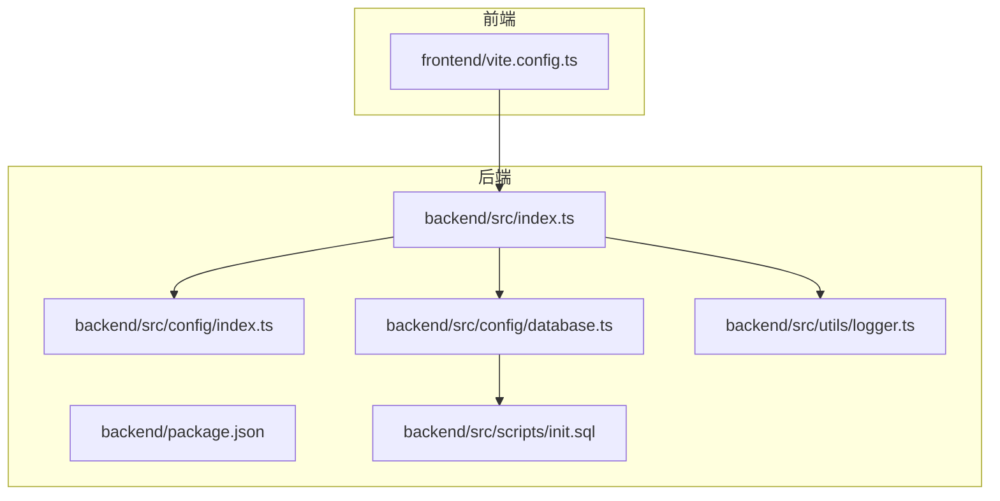
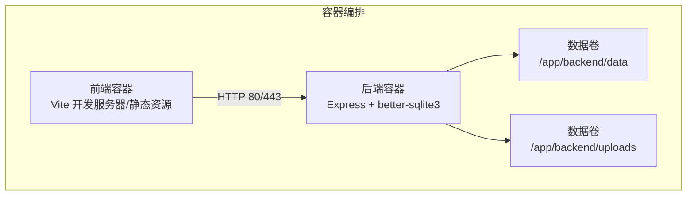
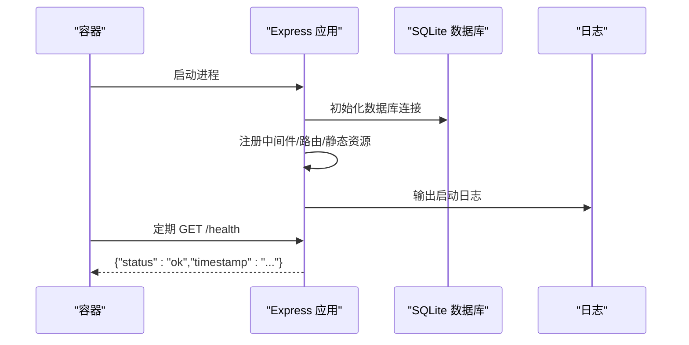
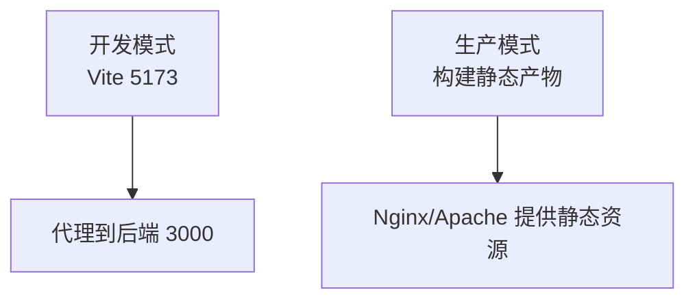
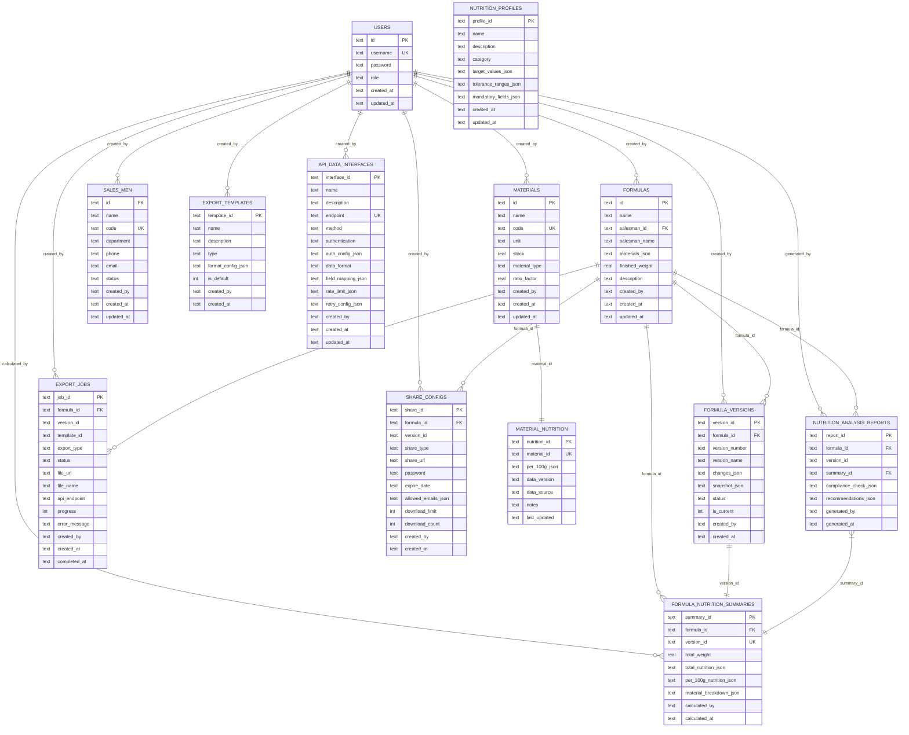
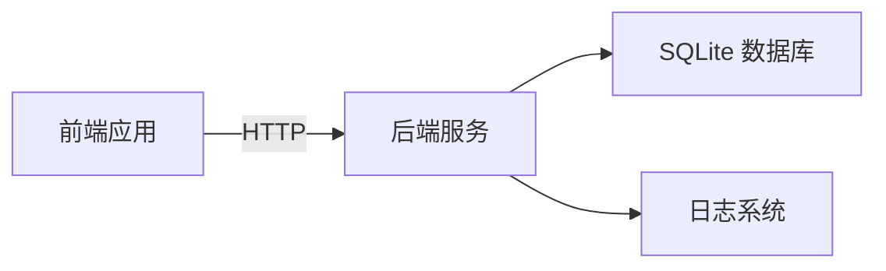

# 容器化部署

<cite>
**本文引用的文件**
- [backend/package.json](file://backend/package.json)
- [backend/src/index.ts](file://backend/src/index.ts)
- [backend/src/config/index.ts](file://backend/src/config/index.ts)
- [backend/src/config/database.ts](file://backend/src/config/database.ts)
- [backend/src/utils/logger.ts](file://backend/src/utils/logger.ts)
- [backend/API_DOC.md](file://backend/API_DOC.md)
- [backend/DATABASE_DOC.md](file://backend/DATABASE_DOC.md)
- [backend/src/scripts/init.sql](file://backend/src/scripts/init.sql)
- [backend/src/controllers/exportController.ts](file://backend/src/controllers/exportController.ts)
- [backend/.gitignore](file://backend/.gitignore)
- [frontend/vite.config.ts](file://frontend/vite.config.ts)
- [README.md](file://README.md)
</cite>

## 目录
1. [简介](#简介)
2. [项目结构](#项目结构)
3. [核心组件](#核心组件)
4. [架构总览](#架构总览)
5. [详细组件分析](#详细组件分析)
6. [依赖关系分析](#依赖关系分析)
7. [性能考虑](#性能考虑)
8. [故障排查指南](#故障排查指南)
9. [结论](#结论)
10. [附录](#附录)

## 简介
本指南面向 TingStudio 项目的容器化部署，提供从 Dockerfile 多阶段构建、Docker Compose 编排、环境变量与数据卷配置，到 Kubernetes 部署 YAML 的完整实践。TingStudio 采用前后端分离架构：前端基于 Vue 3 + Vite，后端基于 Node.js + Express + TypeScript，数据库为 SQLite（better-sqlite3）。部署目标是实现高可用、可扩展、可观测的容器化服务，并确保数据持久化与静态资源访问。

## 项目结构
TingStudio 仓库包含后端、前端两大模块，以及根目录下的文档与脚本。后端使用 TypeScript + Express，前端使用 Vue 3 + Vite。数据库为 SQLite，位于后端 data 目录下；后端还提供 uploads 目录用于文件上传。

**图表来源**
- [backend/src/index.ts:1-61](file://backend/src/index.ts#L1-L61)
- [backend/src/config/index.ts:1-24](file://backend/src/config/index.ts#L1-L24)
- [backend/src/config/database.ts:1-70](file://backend/src/config/database.ts#L1-L70)
- [backend/src/utils/logger.ts:1-40](file://backend/src/utils/logger.ts#L1-L40)
- [backend/src/scripts/init.sql:1-200](file://backend/src/scripts/init.sql#L1-L200)
- [frontend/vite.config.ts:1-23](file://frontend/vite.config.ts#L1-L23)

**章节来源**
- [README.md:65-113](file://README.md#L65-L113)
- [backend/package.json:1-42](file://backend/package.json#L1-L42)
- [frontend/vite.config.ts:1-23](file://frontend/vite.config.ts#L1-L23)

## 核心组件
- 后端服务（Express + TypeScript）
  - 入口文件负责加载环境变量、初始化数据库、注册中间件、挂载路由、暴露健康检查端点。
  - 配置模块集中管理端口、数据库路径、JWT、上传目录、跨域等。
  - 数据库模块使用 better-sqlite3，启用 WAL 模式与外键约束，确保并发与一致性。
  - 日志模块统一输出格式，便于容器日志采集。
- 前端应用（Vue 3 + Vite）
  - 开发服务器默认端口 5173，配置了对后端 API 的代理，便于本地联调。
- 数据库（SQLite）
  - 使用 SQLite 文件作为数据存储，初始化脚本包含 13 张表，涵盖用户、原料、配方、版本、导出、营养分析等模块。
- 上传与静态资源
  - 后端通过静态中间件对外提供 uploads 目录访问，供导出文件与附件下载。

**章节来源**
- [backend/src/index.ts:13-55](file://backend/src/index.ts#L13-L55)
- [backend/src/config/index.ts:2-23](file://backend/src/config/index.ts#L2-L23)
- [backend/src/config/database.ts:10-37](file://backend/src/config/database.ts#L10-L37)
- [backend/src/utils/logger.ts:24-39](file://backend/src/utils/logger.ts#L24-L39)
- [backend/src/scripts/init.sql:1-200](file://backend/src/scripts/init.sql#L1-L200)
- [backend/src/controllers/exportController.ts:1-200](file://backend/src/controllers/exportController.ts#L1-L200)
- [backend/.gitignore:1-5](file://backend/.gitignore#L1-L5)
- [frontend/vite.config.ts:12-21](file://frontend/vite.config.ts#L12-L21)

## 架构总览
下图展示了 TingStudio 在容器中的典型部署形态：前端容器提供静态页面与 API 代理，后端容器承载业务逻辑与数据库文件，二者通过 Docker 网络通信；上传文件与数据库文件通过数据卷持久化。

**图表来源**
- [backend/src/index.ts:31-35](file://backend/src/index.ts#L31-L35)
- [backend/src/config/database.ts:12-16](file://backend/src/config/database.ts#L12-L16)
- [backend/.gitignore:1-5](file://backend/.gitignore#L1-L5)

## 详细组件分析

### 后端服务容器化要点
- 端口与健康检查
  - 后端监听端口来自环境变量，默认 3000；提供 /health 健康检查端点，便于容器探针。
- 数据库与上传目录
  - 数据库存放在后端 data 目录，容器内应通过数据卷持久化；上传文件目录 uploads 也需持久化。
- 日志输出
  - 后端使用统一日志模块，容器中应确保 stdout/stderr 可采集，便于集中日志管理。
- 静态资源
  - 后端通过静态中间件提供 uploads 目录，需确保容器内路径与数据卷映射一致。

**图表来源**
- [backend/src/index.ts:13-55](file://backend/src/index.ts#L13-L55)
- [backend/src/config/database.ts:10-29](file://backend/src/config/database.ts#L10-L29)
- [backend/src/utils/logger.ts:24-39](file://backend/src/utils/logger.ts#L24-L39)

**章节来源**
- [backend/src/index.ts:13-55](file://backend/src/index.ts#L13-L55)
- [backend/src/config/index.ts:2-23](file://backend/src/config/index.ts#L2-L23)
- [backend/src/config/database.ts:10-37](file://backend/src/config/database.ts#L10-L37)
- [backend/src/utils/logger.ts:24-39](file://backend/src/utils/logger.ts#L24-L39)

### 前端服务容器化要点
- 开发与生产模式
  - 开发模式使用 Vite，默认端口 5173；生产模式建议构建静态产物并由 Nginx/Apache 提供服务。
- API 代理
  - Vite 配置了对后端 API 的代理，容器内需确保代理目标可达（例如通过服务名或宿主机网络）。

**图表来源**
- [frontend/vite.config.ts:12-21](file://frontend/vite.config.ts#L12-L21)

**章节来源**
- [frontend/vite.config.ts:12-21](file://frontend/vite.config.ts#L12-L21)

### 数据库与文件持久化
- SQLite 文件
  - 数据库文件位于后端 data 目录，容器内应映射到持久化卷，避免重启丢失。
- 上传文件
  - uploads 目录用于导出文件与附件，同样需要持久化。

**图表来源**
- [backend/src/scripts/init.sql:1-200](file://backend/src/scripts/init.sql#L1-L200)
- [backend/DATABASE_DOC.md:1-457](file://backend/DATABASE_DOC.md#L1-L457)

**章节来源**
- [backend/src/scripts/init.sql:1-200](file://backend/src/scripts/init.sql#L1-L200)
- [backend/DATABASE_DOC.md:1-457](file://backend/DATABASE_DOC.md#L1-L457)

## 依赖关系分析
- 后端依赖
  - Web 框架：Express
  - 数据库：better-sqlite3
  - 安全与中间件：Helmet、CORS、压缩、速率限制
  - 日志：Morgan
  - 认证：JWT、bcrypt
- 前端依赖
  - 框架：Vue 3 + Vue Router + Pinia
  - 构建：Vite
  - UI：TDesign Vue Next
  - HTTP：Axios
  - 表单：VeeValidate + Yup

**图表来源**
- [backend/package.json:14-26](file://backend/package.json#L14-L26)
- [frontend/vite.config.ts:12-21](file://frontend/vite.config.ts#L12-L21)

**章节来源**
- [backend/package.json:14-26](file://backend/package.json#L14-L26)
- [frontend/vite.config.ts:12-21](file://frontend/vite.config.ts#L12-L21)

## 性能考虑
- 数据库性能
  - 启用 WAL 模式与外键约束，提升并发读写与数据一致性。
- 中间件优化
  - 启用压缩与速率限制，减少带宽与滥用风险。
- 静态资源
  - 生产环境建议由反向代理提供静态资源缓存与 Gzip 压缩。
- 日志
  - 使用结构化日志，便于容器日志聚合与检索。

**章节来源**
- [backend/src/config/database.ts:21-23](file://backend/src/config/database.ts#L21-L23)
- [backend/src/index.ts:21-29](file://backend/src/index.ts#L21-L29)
- [backend/src/utils/logger.ts:13-22](file://backend/src/utils/logger.ts#L13-L22)

## 故障排查指南
- 健康检查失败
  - 检查 /health 端点是否可达，确认后端进程已启动且端口监听正常。
- 数据库连接失败
  - 确认数据库文件路径与权限，检查数据卷挂载是否正确。
- 上传文件无法访问
  - 确认 uploads 目录已映射到持久化卷，且静态中间件路径与容器内路径一致。
- 日志无输出
  - 确认日志模块输出到 stdout/stderr，容器日志驱动已启用。

**章节来源**
- [backend/src/index.ts:37-40](file://backend/src/index.ts#L37-L40)
- [backend/src/config/database.ts:12-29](file://backend/src/config/database.ts#L12-L29)
- [backend/src/utils/logger.ts:24-39](file://backend/src/utils/logger.ts#L24-L39)

## 结论
通过合理的多阶段 Docker 构建、明确的数据卷与环境变量配置、以及完善的健康检查与日志策略，TingStudio 可以稳定地在容器环境中运行。结合 Docker Compose 或 Kubernetes，可进一步实现服务编排、扩缩容与滚动更新。

## 附录

### Dockerfile 多阶段构建与镜像分层策略
- 构建阶段
  - 使用 Node.js 基础镜像安装依赖，执行 TypeScript 编译，产出 dist 目录。
- 运行阶段
  - 使用更小的基础镜像（如 Node slim 或 Alpine），仅复制 dist 与必要资源，降低镜像体积与攻击面。
- 分层优化
  - 将依赖安装与源码复制分层，利用 Docker 缓存；仅在依赖变化时重建后续层。
- 运行用户与权限
  - 以非 root 用户运行，限制文件权限，提升安全性。

### Docker Compose 编排与网络配置
- 服务编排
  - 定义后端服务与前端服务，分别挂载数据卷（数据库文件与上传目录）。
- 网络
  - 使用自定义桥接网络，使前端可通过服务名访问后端 API。
- 环境变量
  - 通过 env 文件或 Compose 的 environment 字段传递端口、数据库路径、JWT 密钥、CORS 来源等。
- 健康检查与重启策略
  - 配置 healthcheck 与 restart: unless-stopped，提升可用性。

### 环境变量与数据卷
- 关键环境变量
  - 端口：PORT
  - 数据库路径：DB_PATH
  - JWT 密钥：JWT_SECRET
  - 上传目录：UPLOAD_DIR
  - CORS 来源：CORS_ORIGIN
- 数据卷
  - /app/backend/data：持久化 SQLite 数据库文件
  - /app/backend/uploads：持久化上传文件

### Kubernetes 部署 YAML 示例（概念性说明）
- Deployment
  - 定义副本数、容器镜像、端口、环境变量、资源请求与限制。
- Service
  - ClusterIP/NodePort/LoadBalancer，暴露后端服务。
- ConfigMap
  - 存放非敏感配置（如 CORS 来源、日志级别）。
- Secret
  - 存放敏感配置（如 JWT 密钥、数据库连接信息）。
- PersistentVolumeClaim
  - 挂载数据库与上传目录，确保数据持久化。
- 健康检查与探针
  - livenessProbe/readinessProbe 指向 /health，配置重启策略与优雅退出。

### 容器健康检查、重启策略与资源限制
- 健康检查
  - GET /health，检查服务状态与时间戳。
- 重启策略
  - unless-stopped，保证异常退出后自动恢复。
- 资源限制
  - 为后端容器设置 CPU/内存 requests/limits，避免资源争用。