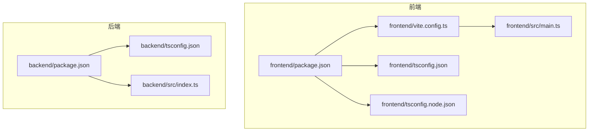
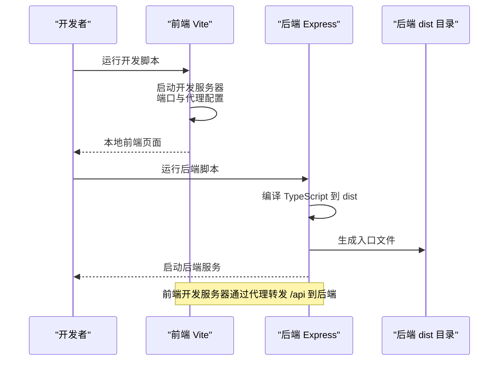
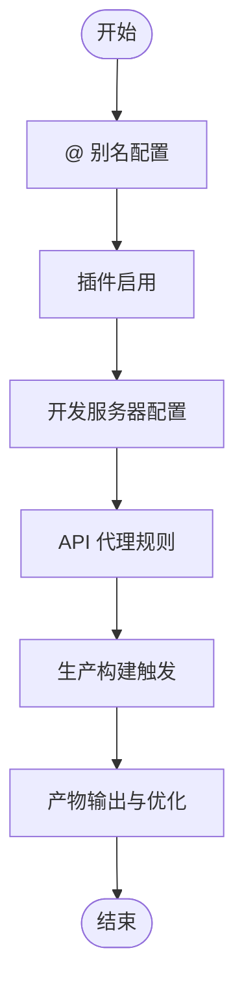
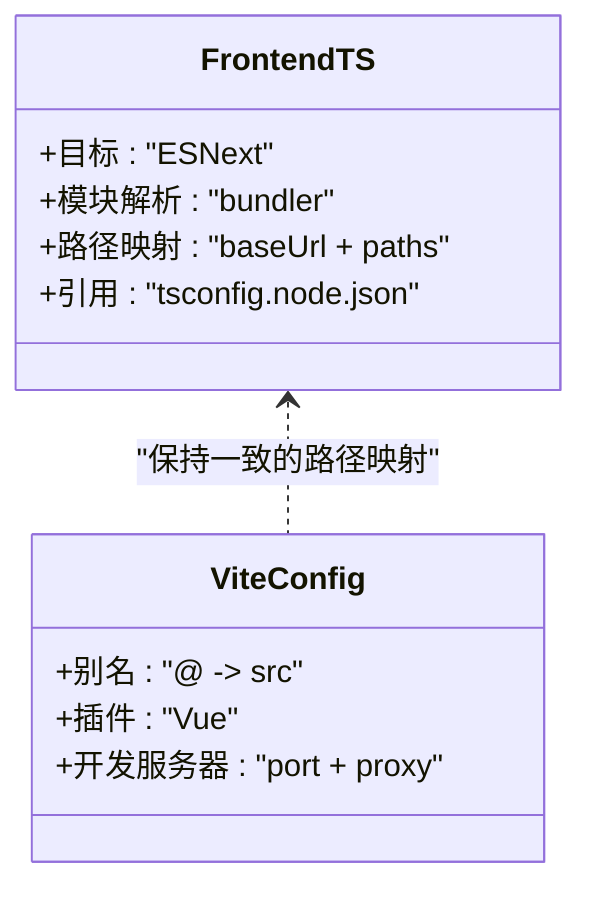
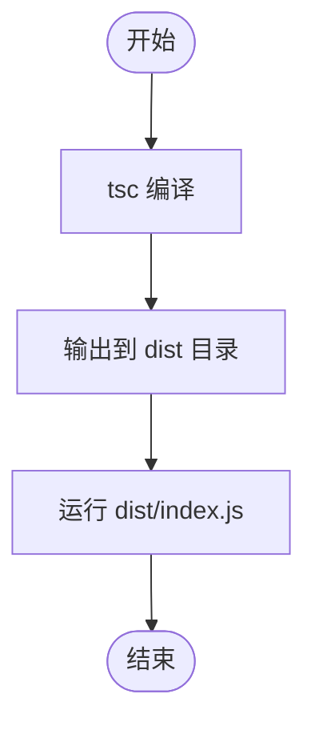
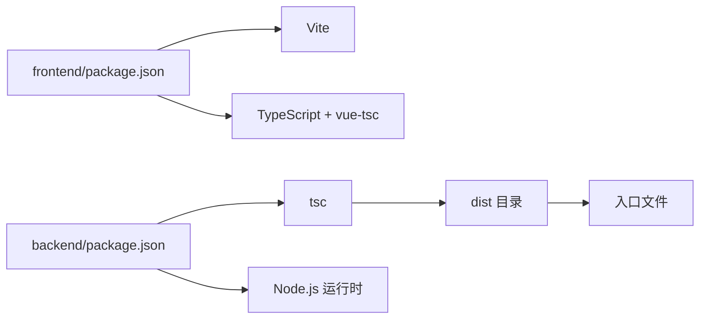

# 构建配置

<cite>
**本文引用的文件**
- [frontend/vite.config.ts](file://frontend/vite.config.ts)
- [frontend/package.json](file://frontend/package.json)
- [frontend/tsconfig.json](file://frontend/tsconfig.json)
- [frontend/tsconfig.node.json](file://frontend/tsconfig.node.json)
- [backend/package.json](file://backend/package.json)
- [backend/tsconfig.json](file://backend/tsconfig.json)
- [backend/src/index.ts](file://backend/src/index.ts)
- [frontend/src/main.ts](file://frontend/src/main.ts)
- [README.md](file://README.md)
</cite>

## 目录
1. [引言](#引言)
2. [项目结构](#项目结构)
3. [核心组件](#核心组件)
4. [架构总览](#架构总览)
5. [详细组件分析](#详细组件分析)
6. [依赖分析](#依赖分析)
7. [性能考虑](#性能考虑)
8. [故障排查指南](#故障排查指南)
9. [结论](#结论)
10. [附录](#附录)

## 引言
本指南面向 TingStudio 的开发者，提供完整的构建配置说明，覆盖前端 Vite 生产构建、静态资源处理与代码分割策略，以及后端 TypeScript 编译与输出目录设置。同时给出构建脚本使用方法、自定义配置选项、部署要求与文件结构、性能优化与缓存策略建议，并提供常见问题的排查路径。

## 项目结构
TingStudio 采用前后端分离架构，前端基于 Vue 3 + Vite，后端基于 Express + TypeScript。构建相关的关键文件分布如下：
- 前端
  - 构建配置：frontend/vite.config.ts
  - 构建脚本与依赖：frontend/package.json
  - TS 编译配置：frontend/tsconfig.json、frontend/tsconfig.node.json
- 后端
  - 构建脚本与依赖：backend/package.json
  - TS 编译配置：backend/tsconfig.json
- 应用入口
  - 前端入口：frontend/src/main.ts
  - 后端入口：backend/src/index.ts
- 项目说明
  - README.md 提供快速开始与主要脚本说明

图表来源
- [frontend/package.json:1-30](file://frontend/package.json#L1-L30)
- [frontend/vite.config.ts:1-23](file://frontend/vite.config.ts#L1-L23)
- [frontend/tsconfig.json:1-32](file://frontend/tsconfig.json#L1-L32)
- [frontend/tsconfig.node.json:1-11](file://frontend/tsconfig.node.json#L1-L11)
- [frontend/src/main.ts:1-17](file://frontend/src/main.ts#L1-L17)
- [backend/package.json:1-42](file://backend/package.json#L1-L42)
- [backend/tsconfig.json:1-25](file://backend/tsconfig.json#L1-L25)
- [backend/src/index.ts:1-61](file://backend/src/index.ts#L1-L61)

章节来源
- [README.md:115-148](file://README.md#L115-L148)
- [frontend/package.json:1-30](file://frontend/package.json#L1-L30)
- [backend/package.json:1-42](file://backend/package.json#L1-L42)

## 核心组件
- 前端 Vite 配置
  - 插件与别名：启用 Vue 插件与路径别名 @ 指向 src。
  - 开发服务器：端口、自动打开浏览器、API 代理到后端。
- 前端 TypeScript 配置
  - 编译目标与模块解析：ESNext、bundler 解析。
  - 路径映射：baseUrl 与 paths。
  - 与 Vite 配置联动：references 指向 tsconfig.node.json。
- 前端构建脚本
  - dev/build/preview：分别对应开发、生产构建与本地预览。
- 后端 TypeScript 配置
  - 输出目录：outDir 指向 dist。
  - 模块与目标：ESNext、bundler 解析。
  - 路径映射：baseUrl 与 paths。
- 后端构建脚本
  - dev/build/start：开发监听、编译与运行。
- 应用入口
  - 前端：创建 Vue 应用、挂载根组件。
  - 后端：Express 应用、中间件、静态文件、路由与健康检查。

章节来源
- [frontend/vite.config.ts:1-23](file://frontend/vite.config.ts#L1-L23)
- [frontend/tsconfig.json:1-32](file://frontend/tsconfig.json#L1-L32)
- [frontend/tsconfig.node.json:1-11](file://frontend/tsconfig.node.json#L1-L11)
- [frontend/package.json:1-30](file://frontend/package.json#L1-L30)
- [backend/tsconfig.json:1-25](file://backend/tsconfig.json#L1-L25)
- [backend/package.json:1-42](file://backend/package.json#L1-L42)
- [frontend/src/main.ts:1-17](file://frontend/src/main.ts#L1-L17)
- [backend/src/index.ts:1-61](file://backend/src/index.ts#L1-L61)

## 架构总览
下图展示了前端构建与后端编译的整体流程，以及开发阶段的代理与运行关系。

图表来源
- [frontend/vite.config.ts:12-21](file://frontend/vite.config.ts#L12-L21)
- [backend/package.json:6-12](file://backend/package.json#L6-L12)
- [backend/tsconfig.json:7-8](file://backend/tsconfig.json#L7-L8)

## 详细组件分析

### 前端 Vite 构建配置
- 插件与别名
  - 使用 Vue 插件进行 SFC 编译与热更新。
  - 路径别名 @ 指向 src，便于统一导入。
- 开发服务器
  - 端口与自动打开浏览器。
  - 代理规则：将 /api 请求转发到后端地址，便于开发联调。
- 生产构建
  - 通过构建脚本触发 vue-tsc 与 vite build，实现类型检查与打包。
- 代码分割与静态资源
  - Vite 默认按需分块；可通过路由或动态导入进一步优化。
  - 静态资源放置在 public 目录，构建时原样复制。
- 自定义配置选项
  - 可扩展插件、解析别名、代理、构建优化等（见“性能考虑”与“附录”）。

图表来源
- [frontend/vite.config.ts:5-22](file://frontend/vite.config.ts#L5-L22)
- [frontend/package.json:8](file://frontend/package.json#L8)

章节来源
- [frontend/vite.config.ts:1-23](file://frontend/vite.config.ts#L1-L23)
- [frontend/package.json:6-11](file://frontend/package.json#L6-L11)

### 前端 TypeScript 编译配置
- 编译目标与模块解析
  - ESNext 目标与 bundler 解析，适配 Vite。
- 路径映射
  - baseUrl 与 paths 与 Vite 别名保持一致。
- 与 Vite 配置联动
  - references 指向 tsconfig.node.json，确保 Vite 配置文件被识别。

图表来源
- [frontend/tsconfig.json:2-27](file://frontend/tsconfig.json#L2-L27)
- [frontend/tsconfig.node.json:1-11](file://frontend/tsconfig.node.json#L1-L11)
- [frontend/vite.config.ts:7-11](file://frontend/vite.config.ts#L7-L11)

章节来源
- [frontend/tsconfig.json:1-32](file://frontend/tsconfig.json#L1-L32)
- [frontend/tsconfig.node.json:1-11](file://frontend/tsconfig.node.json#L1-L11)

### 后端 TypeScript 编译配置与输出目录
- 输出目录
  - outDir 设置为 dist，编译后源码生成在此目录。
- 模块与目标
  - ESNext 目标与 bundler 解析，利于现代 Node 运行时。
- 路径映射
  - baseUrl 与 paths 与 src 对齐。
- 构建脚本
  - build 脚本执行 tsc；start 脚本运行 dist/index.js。

图表来源
- [backend/tsconfig.json:7-8](file://backend/tsconfig.json#L7-L8)
- [backend/package.json:8](file://backend/package.json#L8)
- [backend/src/index.ts:51-54](file://backend/src/index.ts#L51-L54)

章节来源
- [backend/tsconfig.json:1-25](file://backend/tsconfig.json#L1-L25)
- [backend/package.json:6-12](file://backend/package.json#L6-L12)
- [backend/src/index.ts:1-61](file://backend/src/index.ts#L1-L61)

### 构建脚本使用方法与自定义选项
- 前端
  - 开发：npm run dev（启动 Vite 开发服务器）。
  - 构建：npm run build（先类型检查，再打包）。
  - 预览：npm run preview（本地预览生产包）。
- 后端
  - 开发：npm run dev（监听并运行 TypeScript 文件）。
  - 构建：npm run build（编译到 dist）。
  - 运行：npm run start（运行 dist/index.js）。
- 自定义选项
  - Vite：可在 vite.config.ts 中添加插件、优化构建参数、自定义代理与别名。
  - TypeScript：可在 tsconfig.json 中调整目标、模块解析、路径映射与输出目录。

章节来源
- [frontend/package.json:6-11](file://frontend/package.json#L6-L11)
- [backend/package.json:6-12](file://backend/package.json#L6-L12)
- [frontend/vite.config.ts:5-22](file://frontend/vite.config.ts#L5-L22)
- [frontend/tsconfig.json:2-27](file://frontend/tsconfig.json#L2-L27)
- [backend/tsconfig.json:7-8](file://backend/tsconfig.json#L7-L8)

### 构建产物与部署要求
- 前端产物
  - 通过 vite build 生成静态资源与 HTML；public 目录下的静态文件会原样复制。
  - 生产环境建议将产物部署到 Nginx/Apache 等静态服务器，或作为后端静态资源提供。
- 后端产物
  - 编译后的 dist 目录包含可运行的 JavaScript 入口文件。
  - 部署时需准备 Node.js 运行时，使用 npm run start 或进程管理器运行。
- 部署注意事项
  - 确保后端端口与 CORS 配置与前端代理一致。
  - 静态资源路径与路由需与实际部署路径匹配。

章节来源
- [frontend/package.json:8](file://frontend/package.json#L8)
- [backend/package.json:9](file://backend/package.json#L9)
- [backend/src/index.ts:31-35](file://backend/src/index.ts#L31-L35)

## 依赖分析
- 前端
  - Vite 与 Vue 插件负责开发与构建。
  - TypeScript 与 vue-tsc 在构建前进行类型检查。
- 后端
  - TypeScript 负责编译，Node.js 运行时负责执行。
  - Express 提供 Web 服务，中间件与静态资源处理。

图表来源
- [frontend/package.json:1-30](file://frontend/package.json#L1-L30)
- [backend/package.json:1-42](file://backend/package.json#L1-L42)

章节来源
- [frontend/package.json:1-30](file://frontend/package.json#L1-L30)
- [backend/package.json:1-42](file://backend/package.json#L1-L42)

## 性能考虑
- 前端构建优化
  - 代码分割：利用路由级懒加载与动态导入减少首屏体积。
  - 静态资源：将大文件放入 public 并通过 CDN 加速。
  - 构建优化：在 vite.config.ts 中配置压缩、预构建依赖与 Rollup 选项。
- 后端编译优化
  - 仅编译必要模块，避免引入大型开发依赖。
  - 使用 outDir 与 sourceMap 控制产物与调试信息。
- 缓存策略
  - 前端：静态资源可开启长期缓存，HTML 不缓存；版本化文件名。
  - 后端：dist 目录缓存编译产物，CI 中复用缓存以加速构建。

[本节为通用指导，不直接分析具体文件，故无章节来源]

## 故障排查指南
- 前端开发代理无法访问后端
  - 检查 vite.config.ts 中代理配置是否指向正确的后端地址与端口。
  - 确认后端 CORS 配置允许前端开发端口。
- 构建失败或类型错误
  - 前端：确认 vue-tsc 与 vite build 顺序；检查 tsconfig 与路径映射一致性。
  - 后端：确认 tsc 编译无错误；检查 outDir 与入口文件是否存在。
- 部署后页面空白或资源 404
  - 确认静态资源路径与部署路径一致；检查路由模式与回退策略。
  - 后端 dist 目录是否随构建一起部署。

章节来源
- [frontend/vite.config.ts:12-21](file://frontend/vite.config.ts#L12-L21)
- [backend/src/index.ts:22-25](file://backend/src/index.ts#L22-L25)
- [frontend/package.json:8](file://frontend/package.json#L8)
- [backend/package.json:8](file://backend/package.json#L8)

## 结论
TingStudio 的构建体系围绕 Vite 与 TypeScript 展开：前端通过 Vite 实现高效开发与生产构建，后端通过 tsc 生成可运行的 dist 目录。遵循本文的配置说明与优化建议，可获得稳定、可维护且高性能的构建体验。

[本节为总结性内容，不直接分析具体文件，故无章节来源]

## 附录
- 快速开始与主要脚本
  - 前端：安装依赖后运行 npm run dev 启动开发服务器。
  - 后端：安装依赖后运行 npm run dev 启动开发服务。
- 路径映射与别名
  - 前端：Vite 别名 @ 指向 src；TypeScript 路径映射保持一致。
  - 后端：TypeScript 路径映射 baseUrl 与 paths 与 src 对齐。

章节来源
- [README.md:115-148](file://README.md#L115-L148)
- [frontend/vite.config.ts:7-11](file://frontend/vite.config.ts#L7-L11)
- [frontend/tsconfig.json:24-27](file://frontend/tsconfig.json#L24-L27)
- [backend/tsconfig.json:17-20](file://backend/tsconfig.json#L17-L20)