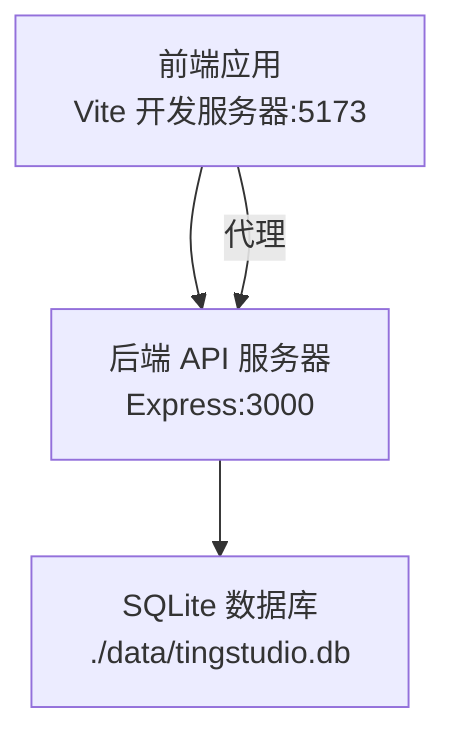
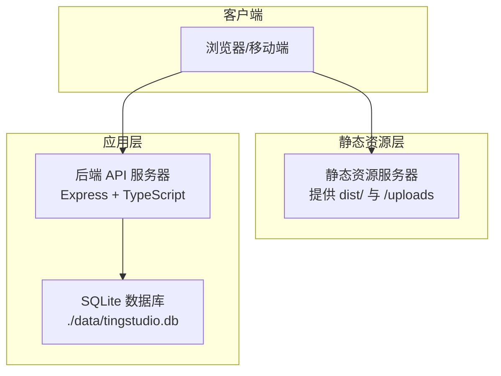
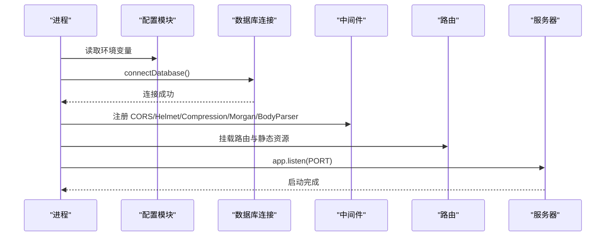
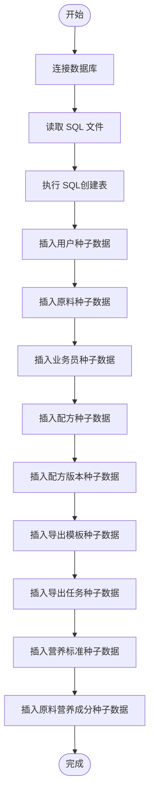
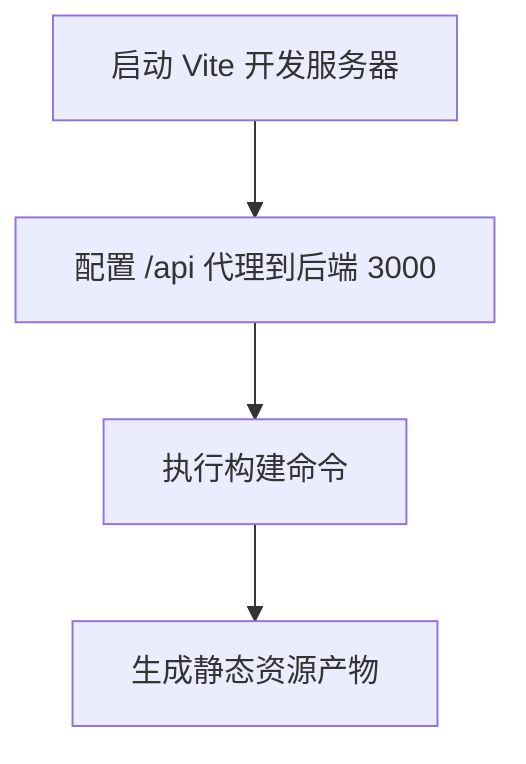
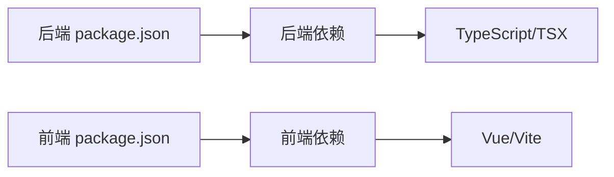

# 环境准备

<cite>
**本文引用的文件**
- [backend/package.json](file://backend/package.json)
- [frontend/package.json](file://frontend/package.json)
- [backend/tsconfig.json](file://backend/tsconfig.json)
- [frontend/tsconfig.json](file://frontend/tsconfig.json)
- [frontend/vite.config.ts](file://frontend/vite.config.ts)
- [backend/src/config/index.ts](file://backend/src/config/index.ts)
- [backend/src/config/database.ts](file://backend/src/config/database.ts)
- [backend/src/index.ts](file://backend/src/index.ts)
- [backend/src/scripts/initDatabase.ts](file://backend/src/scripts/initDatabase.ts)
- [backend/src/utils/logger.ts](file://backend/src/utils/logger.ts)
- [backend/DATABASE_DOC.md](file://backend/DATABASE_DOC.md)
- [backend/API_DOC.md](file://backend/API_DOC.md)
</cite>

## 目录
1. [简介](#简介)
2. [项目结构](#项目结构)
3. [核心组件](#核心组件)
4. [架构总览](#架构总览)
5. [详细组件分析](#详细组件分析)
6. [依赖关系分析](#依赖关系分析)
7. [性能考虑](#性能考虑)
8. [故障排查指南](#故障排查指南)
9. [结论](#结论)
10. [附录](#附录)

## 简介
本指南面向 TingStudio 生产环境部署与运维，覆盖硬件与操作系统要求、网络配置、Node.js 与包管理器版本、环境变量、前后端分离部署差异、静态资源与 API 服务器独立部署、跨平台配置步骤以及系统依赖与权限要点。文档同时给出基于仓库实际实现的架构与流程图示，帮助快速搭建稳定可靠的生产环境。

## 项目结构
TingStudio 采用前后端分离架构：
- 前端：基于 Vue 3 + Vite，开发时前端本地服务默认监听 5173 端口，并通过代理将 /api 前缀请求转发至后端 3000 端口。
- 后端：基于 Express + TypeScript，提供 REST API、静态文件服务（上传文件）、数据库连接与日志输出。
- 数据库：SQLite（better-sqlite3），默认数据库文件位于后端工程内的 data 目录。

图表来源
- [frontend/vite.config.ts:12-21](file://frontend/vite.config.ts#L12-L21)
- [backend/src/index.ts:31-35](file://backend/src/index.ts#L31-L35)
- [backend/src/config/database.ts:13-16](file://backend/src/config/database.ts#L13-L16)

章节来源
- [frontend/vite.config.ts:12-21](file://frontend/vite.config.ts#L12-L21)
- [backend/src/index.ts:31-35](file://backend/src/index.ts#L31-L35)
- [backend/src/config/database.ts:13-16](file://backend/src/config/database.ts#L13-L16)

## 核心组件
- 后端配置与运行
  - 端口与环境：默认端口 3000；支持通过环境变量覆盖。
  - 数据库：SQLite，better-sqlite3，WAL 模式与外键约束已启用；数据库文件路径可配置。
  - 静态资源：/uploads 目录静态托管。
  - 中间件：CORS、Helmet、Compression、Morgan、BodyParser（JSON/URL-encoded）。
  - 健康检查：/health。
- 前端开发与构建
  - 开发服务器：Vite，默认 5173 端口。
  - 代理：将 /api 前缀转发至后端 3000 端口。
  - 构建：Vue + Vite，产物用于静态资源服务器对外发布。
- 数据库初始化与种子数据
  - 初始化脚本：一次性执行 SQL 文件创建表结构。
  - 种子数据：批量插入用户、原料、业务员、配方、版本、导出模板、导出任务、营养标准与原料营养数据。

章节来源
- [backend/src/config/index.ts:1-24](file://backend/src/config/index.ts#L1-L24)
- [backend/src/config/database.ts:10-37](file://backend/src/config/database.ts#L10-L37)
- [backend/src/index.ts:13-54](file://backend/src/index.ts#L13-L54)
- [backend/src/scripts/initDatabase.ts:11-31](file://backend/src/scripts/initDatabase.ts#L11-L31)
- [backend/src/scripts/seedData.ts:102-393](file://backend/src/scripts/seedData.ts#L102-L393)

## 架构总览
下图展示生产环境典型部署形态：前端静态资源由独立静态资源服务器提供，后端 API 服务器单独运行，二者通过反向代理或域名路由进行访问控制与安全加固。

图表来源
- [backend/src/index.ts:31-35](file://backend/src/index.ts#L31-L35)
- [backend/src/config/database.ts:13-16](file://backend/src/config/database.ts#L13-L16)

## 详细组件分析

### 后端服务与数据库组件
- 配置加载与默认值
  - 端口、环境、JWT、上传目录、文件大小限制、CORS 来源等均可通过环境变量覆盖。
- 数据库连接
  - 自动确保数据目录存在；开启 WAL 模式与外键约束；提供查询与事务封装。
- 启动流程
  - 初始化数据库 → 注册全局中间件 → 挂载静态资源 → 注册路由 → 健康检查 → 错误处理 → 监听端口。

图表来源
- [backend/src/config/index.ts:1-24](file://backend/src/config/index.ts#L1-L24)
- [backend/src/config/database.ts:10-37](file://backend/src/config/database.ts#L10-L37)
- [backend/src/index.ts:13-54](file://backend/src/index.ts#L13-L54)

章节来源
- [backend/src/config/index.ts:1-24](file://backend/src/config/index.ts#L1-L24)
- [backend/src/config/database.ts:10-37](file://backend/src/config/database.ts#L10-L37)
- [backend/src/index.ts:13-54](file://backend/src/index.ts#L13-L54)

### 数据库初始化与种子数据流程
- 初始化脚本
  - 读取 SQL 文件并一次性执行，创建所有表结构。
- 种子数据脚本
  - 批量插入用户、原料、业务员、配方、版本、导出模板、导出任务、营养标准与原料营养数据，使用事务保证一致性。

图表来源
- [backend/src/scripts/initDatabase.ts:11-31](file://backend/src/scripts/initDatabase.ts#L11-L31)
- [backend/src/scripts/seedData.ts:102-393](file://backend/src/scripts/seedData.ts#L102-L393)

章节来源
- [backend/src/scripts/initDatabase.ts:11-31](file://backend/src/scripts/initDatabase.ts#L11-L31)
- [backend/src/scripts/seedData.ts:102-393](file://backend/src/scripts/seedData.ts#L102-L393)

### 前端开发与构建组件
- 开发服务器
  - Vite 默认端口 5173；开启自动打开浏览器与代理。
- 代理规则
  - 将 /api 前缀转发至后端 3000 端口，便于本地联调。
- 构建产物
  - 使用 Vue + Vite 构建，产物目录用于静态资源服务器发布。

图表来源
- [frontend/vite.config.ts:12-21](file://frontend/vite.config.ts#L12-L21)
- [frontend/package.json:6-11](file://frontend/package.json#L6-L11)

章节来源
- [frontend/vite.config.ts:12-21](file://frontend/vite.config.ts#L12-L21)
- [frontend/package.json:6-11](file://frontend/package.json#L6-L11)

## 依赖关系分析
- 后端技术栈
  - Express、better-sqlite3、bcryptjs、jsonwebtoken、cors、helmet、compression、morgan、multer、dotenv、TypeScript、tsx。
- 前端技术栈
  - Vue 3、Vite、Vue Router、Pinia、Axios、tdesign-vue-next、vee-validate、yup、TypeScript、tsx。
- 构建与编译
  - 后端使用 tsc 编译 TS；前端使用 vue-tsc + vite 构建。

图表来源
- [backend/package.json:14-40](file://backend/package.json#L14-L40)
- [frontend/package.json:12-28](file://frontend/package.json#L12-L28)

章节来源
- [backend/package.json:14-40](file://backend/package.json#L14-L40)
- [frontend/package.json:12-28](file://frontend/package.json#L12-L28)

## 性能考虑
- 数据库性能
  - 启用 WAL 模式与外键约束，适合中小规模并发写入场景；建议在生产环境中评估并发与磁盘 I/O。
- 传输压缩
  - 启用 Compression 中间件，减少 API 响应体积。
- 静态资源
  - 前端构建产物交由静态资源服务器提供，建议开启缓存与 Gzip/Brotli 压缩。
- 日志与监控
  - Morgan 输出访问日志；建议结合系统日志与指标监控工具进行生产观测。

章节来源
- [backend/src/config/database.ts:21-23](file://backend/src/config/database.ts#L21-L23)
- [backend/src/index.ts:26-28](file://backend/src/index.ts#L26-L28)
- [backend/src/utils/logger.ts:24-39](file://backend/src/utils/logger.ts#L24-L39)

## 故障排查指南
- 数据库连接失败
  - 检查数据库文件路径是否存在且可写；确认数据目录已创建。
- 端口占用
  - 后端默认 3000；前端默认 5173；若被占用请修改相应配置。
- CORS 问题
  - 确认 CORS_ORIGIN 环境变量与前端开发/生产域名一致。
- 静态资源 404
  - 确认 /uploads 目录存在且具备读权限；生产环境建议将 uploads 与静态资源服务器统一管理。
- 健康检查失败
  - 访问 /health 确认服务状态；若失败查看后端日志。

章节来源
- [backend/src/config/database.ts:13-16](file://backend/src/config/database.ts#L13-L16)
- [backend/src/index.ts:51-54](file://backend/src/index.ts#L51-L54)
- [backend/src/config/index.ts:20-22](file://backend/src/config/index.ts#L20-L22)
- [backend/src/index.ts:31-35](file://backend/src/index.ts#L31-L35)

## 结论
通过明确的前后端分离部署策略、合理的环境变量配置与数据库初始化流程，TingStudio 可在多种操作系统上稳定运行。建议在生产环境中强化静态资源与 API 的独立部署、完善 CORS 与安全中间件配置，并建立完善的日志与监控体系。

## 附录

### 硬件与操作系统要求
- 硬件建议
  - CPU：至少双核；内存：建议 2GB 以上；存储：根据数据量预留空间（SQLite 文件随数据增长而增大）。
- 操作系统
  - Linux、Windows、macOS 均可运行；推荐 Linux 作为生产主机以获得更好的稳定性与资源控制。
- 网络
  - 后端默认监听 3000；前端开发默认 5173；生产环境建议通过反向代理暴露 API 与静态资源。

章节来源
- [backend/src/config/index.ts:3](file://backend/src/config/index.ts#L3)
- [frontend/vite.config.ts:13](file://frontend/vite.config.ts#L13)
- [backend/src/index.ts:15](file://backend/src/index.ts#L15)

### Node.js 与包管理器版本要求
- Node.js
  - 后端与前端均使用 ESNext 模块与较新的语言特性；建议使用长期支持（LTS）版本的 Node.js（如 18.x 或 20.x）。
- 包管理器
  - 支持 npm 与 yarn；仓库提供 package-lock.json，建议在 CI/CD 中锁定依赖版本以保证一致性。

章节来源
- [backend/package.json:5](file://backend/package.json#L5)
- [frontend/package.json:5](file://frontend/package.json#L5)

### 环境变量与配置
- 后端关键变量
  - PORT：服务端口（默认 3000）
  - NODE_ENV：运行环境（默认 development）
  - DB_PATH：SQLite 数据库文件路径（默认 ./data/tingstudio.db）
  - JWT_SECRET：JWT 密钥（默认值仅用于开发）
  - JWT_EXPIRES_IN：JWT 过期间隔（默认 7d）
  - UPLOAD_DIR：上传目录（默认 ./uploads）
  - MAX_FILE_SIZE：上传文件大小上限（字节）
  - CORS_ORIGIN：允许的前端来源（默认 http://localhost:5173）
- 前端开发代理
  - Vite 代理将 /api 转发至 http://localhost:3000，便于本地联调。

章节来源
- [backend/src/config/index.ts:1-24](file://backend/src/config/index.ts#L1-L24)
- [frontend/vite.config.ts:15-20](file://frontend/vite.config.ts#L15-L20)

### 前后端分离部署差异
- 静态资源服务器
  - 建议将前端构建产物部署至独立静态资源服务器（Nginx/Apache/CND），并配置缓存与压缩。
- API 服务器
  - 后端独立运行，提供 REST API 与 /uploads 静态资源；生产环境建议启用 HTTPS、限流与 WAF。
- 跨域与鉴权
  - 生产环境需严格配置 CORS_ORIGIN 与 JWT 密钥；确保前端域名与后端一致。

章节来源
- [backend/src/index.ts:31-35](file://backend/src/index.ts#L31-L35)
- [backend/src/config/index.ts:20-22](file://backend/src/config/index.ts#L20-L22)

### 不同操作系统配置步骤（Windows/Linux/macOS）
- Windows
  - 安装 Node.js LTS；使用 PowerShell 或 CMD；确保路径分隔符正确；注意 SQLite 文件权限。
- Linux
  - 使用包管理器安装 Node.js；配置 systemd 或 Docker；设置数据库与上传目录权限。
- macOS
  - 使用 Homebrew 安装 Node.js；注意 .DS_Store 等隐藏文件对构建的影响；确保数据库目录可写。

章节来源
- [backend/DATABASE_DOC.md:449-456](file://backend/DATABASE_DOC.md#L449-L456)

### 系统依赖与权限配置
- 系统依赖
  - Node.js（LTS）、Git（可选，用于克隆与脚本）。
- 权限
  - 数据库文件与 uploads 目录需具备写权限；生产环境建议使用专用用户运行服务并最小化权限。
- 日志与备份
  - 建议将日志输出到标准输出或集中日志系统；定期备份 SQLite 数据库文件。

章节来源
- [backend/src/config/database.ts:13-16](file://backend/src/config/database.ts#L13-L16)
- [backend/src/utils/logger.ts:24-39](file://backend/src/utils/logger.ts#L24-L39)