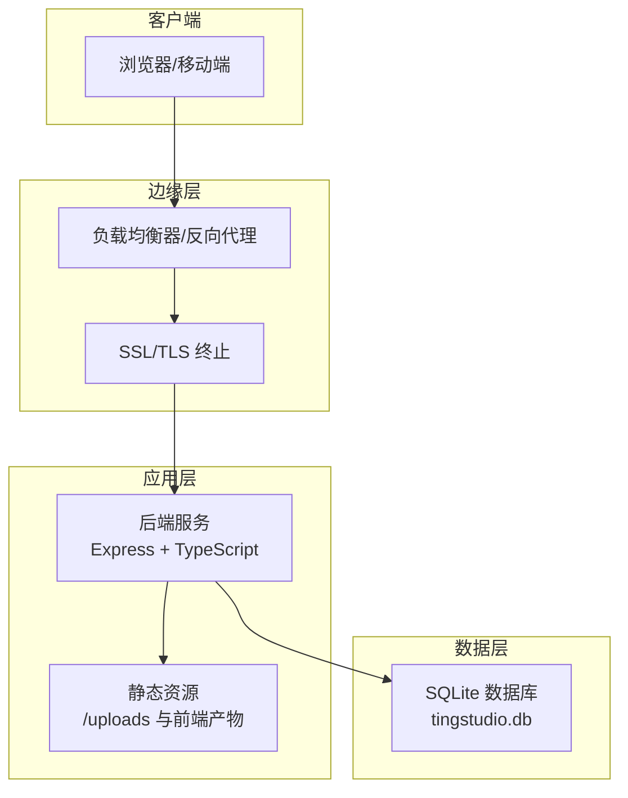
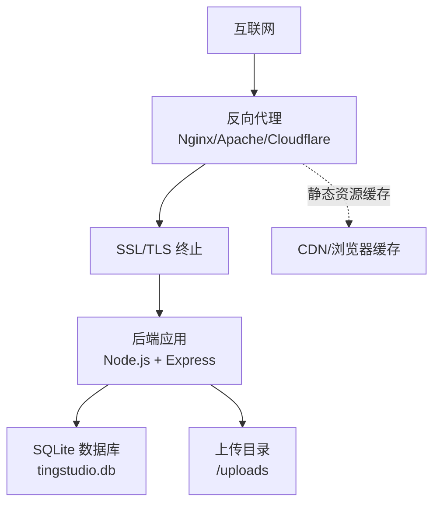
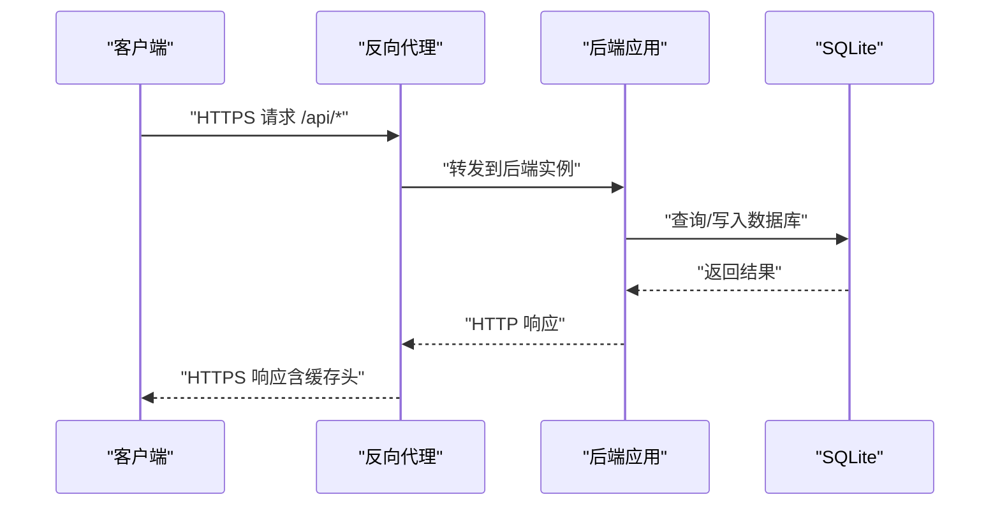
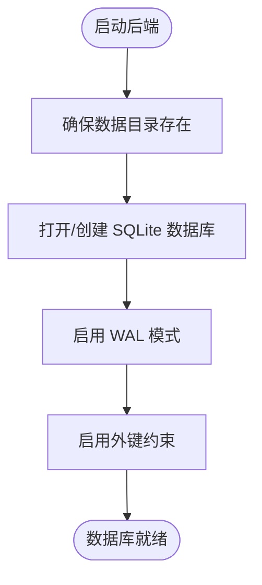
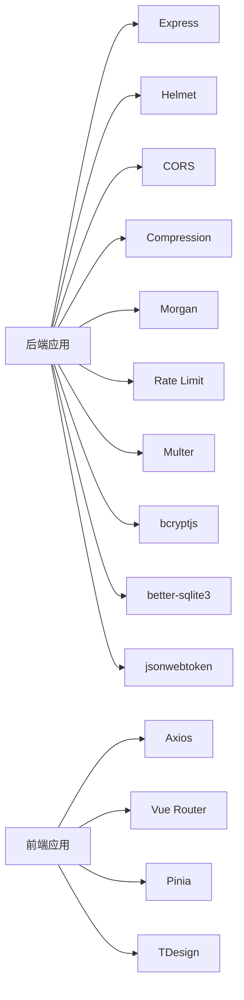

# 生产环境部署

<cite>
**本文引用的文件**
- [backend/src/config/index.ts](file://backend/src/config/index.ts)
- [backend/src/config/database.ts](file://backend/src/config/database.ts)
- [backend/src/index.ts](file://backend/src/index.ts)
- [backend/src/utils/logger.ts](file://backend/src/utils/logger.ts)
- [backend/src/scripts/initDatabase.ts](file://backend/src/scripts/initDatabase.ts)
- [backend/src/scripts/init.sql](file://backend/src/scripts/init.sql)
- [backend/API_DOC.md](file://backend/API_DOC.md)
- [backend/DATABASE_DOC.md](file://backend/DATABASE_DOC.md)
- [backend/package.json](file://backend/package.json)
- [frontend/vite.config.ts](file://frontend/vite.config.ts)
- [frontend/package.json](file://frontend/package.json)
</cite>

## 目录
1. [简介](#简介)
2. [项目结构](#项目结构)
3. [核心组件](#核心组件)
4. [架构总览](#架构总览)
5. [详细组件分析](#详细组件分析)
6. [依赖关系分析](#依赖关系分析)
7. [性能考虑](#性能考虑)
8. [故障排查指南](#故障排查指南)
9. [结论](#结论)
10. [附录](#附录)

## 简介
本指南面向 TingStudio 在生产环境的落地部署，覆盖服务器配置、域名与 SSL 证书、负载均衡与反向代理、静态资源缓存策略、数据库生产配置（SQLite 文件权限、备份与性能调优）、进程管理与自动重启、日志轮转、安全加固（防火墙、访问控制、审计）、以及部署后的验证与监控配置。文档基于仓库中的实际代码与配置进行说明，并提供可视化图示帮助理解。

## 项目结构
TingStudio 采用前后端分离架构：
- 前端：Vue 3 + Vite，开发时通过本地代理将 /api 请求转发至后端服务。
- 后端：Express + TypeScript，提供 REST API，内置健康检查、静态文件服务、日志与安全中间件。
- 数据库：SQLite（better-sqlite3），默认 WAL 模式与外键约束，初始化脚本集中于 SQL 文件。

图表来源
- [backend/src/index.ts:13-55](file://backend/src/index.ts#L13-L55)
- [backend/src/config/database.ts:10-30](file://backend/src/config/database.ts#L10-L30)
- [frontend/vite.config.ts:15-21](file://frontend/vite.config.ts#L15-L21)

章节来源
- [backend/src/index.ts:13-55](file://backend/src/index.ts#L13-L55)
- [frontend/vite.config.ts:15-21](file://frontend/vite.config.ts#L15-L21)

## 核心组件
- 应用配置与环境变量：端口、数据库路径、JWT、上传目录与大小限制、CORS 来源等。
- 数据库连接与初始化：SQLite 连接、WAL 模式、外键约束、查询封装、事务支持。
- 后端服务：安全中间件（Helmet）、CORS、压缩、日志、静态文件、路由与健康检查。
- 前端开发代理：本地开发时将 /api 代理到后端 3000 端口；生产需由反向代理统一暴露。

章节来源
- [backend/src/config/index.ts:2-24](file://backend/src/config/index.ts#L2-L24)
- [backend/src/config/database.ts:10-70](file://backend/src/config/database.ts#L10-L70)
- [backend/src/index.ts:13-55](file://backend/src/index.ts#L13-L55)
- [frontend/vite.config.ts:15-21](file://frontend/vite.config.ts#L15-L21)

## 架构总览
生产部署建议采用“反向代理 + 应用容器 + 数据库”的三层结构：
- 反向代理层：Nginx/Apache/Cloudflare 等，负责 SSL 终止、静态资源缓存、请求转发、限流与 WAF。
- 应用层：后端服务运行在 Node.js 上，监听内网端口，由进程管理器守护。
- 数据层：SQLite 文件位于持久化卷，配合备份与权限控制。

图表来源
- [backend/src/index.ts:31-32](file://backend/src/index.ts#L31-L32)
- [backend/src/config/index.ts:6-8](file://backend/src/config/index.ts#L6-L8)

## 详细组件分析

### 服务器与网络配置
- 监听端口：默认 3000，可通过环境变量覆盖。
- CORS 来源：开发默认允许本地前端，生产需限定可信域名。
- 安全头部：启用 Helmet，增强常见 Web 攻击防护。
- 压缩与日志：开启 Gzip 压缩与 Morgan 日志，便于问题定位。

章节来源
- [backend/src/index.ts:15-29](file://backend/src/index.ts#L15-L29)
- [backend/src/config/index.ts:3-22](file://backend/src/config/index.ts#L3-L22)

### 域名绑定与 SSL 证书
- 反向代理负责域名解析与证书管理，后端仅需监听内网端口。
- 建议使用 Let’s Encrypt 自动续期，或企业 CA 证书。
- 将 /api 前缀转发至后端服务，静态资源由反向代理直接提供或缓存。

章节来源
- [backend/src/index.ts:35-40](file://backend/src/index.ts#L35-L40)
- [frontend/vite.config.ts:15-21](file://frontend/vite.config.ts#L15-L21)

### 负载均衡与反向代理
- 建议至少部署两台后端实例，结合健康检查实现高可用。
- 反向代理配置要点：
  - 将 /api 前缀转发至后端集群。
  - 对静态资源设置长缓存与 ETag/Last-Modified。
  - 开启速率限制与 IP 黑名单。
  - 配置安全头与 HTTPS 强制跳转。

图表来源
- [backend/src/index.ts:35-40](file://backend/src/index.ts#L35-L40)
- [backend/src/config/database.ts:44-55](file://backend/src/config/database.ts#L44-L55)

### 静态资源缓存策略
- 上传文件：后端通过 /uploads 提供静态访问，建议由反向代理设置强缓存与版本化命名。
- 前端产物：构建后交由反向代理提供，设置 Cache-Control 与 ETag，启用 gzip/br 压缩。
- 缓存失效：通过文件名指纹或查询参数版本化，避免浏览器缓存陈旧资源。

章节来源
- [backend/src/index.ts:31-32](file://backend/src/index.ts#L31-L32)
- [backend/src/config/index.ts:15-18](file://backend/src/config/index.ts#L15-L18)

### 数据库生产配置（SQLite）
- 存储位置：默认 ./data/tingstudio.db，生产建议挂载到持久化卷。
- WAL 模式：提升并发读写性能，适合中小规模生产场景。
- 外键约束：已启用，确保参照完整性。
- 查询封装：提供统一 query 与 transaction 封装，便于事务与兼容性处理。
- 初始化：通过 init.sql 脚本一次性创建所有表与索引。

图表来源
- [backend/src/config/database.ts:10-30](file://backend/src/config/database.ts#L10-L30)

章节来源
- [backend/src/config/database.ts:10-70](file://backend/src/config/database.ts#L10-L70)
- [backend/src/scripts/initDatabase.ts:11-31](file://backend/src/scripts/initDatabase.ts#L11-L31)
- [backend/src/scripts/init.sql:1-228](file://backend/src/scripts/init.sql#L1-L228)
- [backend/DATABASE_DOC.md:447-457](file://backend/DATABASE_DOC.md#L447-L457)

### 进程管理、自动重启与日志轮转
- 进程管理：使用 PM2 或 systemd 管理 Node.js 进程，配置自动重启与内存阈值告警。
- 日志：后端使用自定义 logger 输出到 stdout/stderr，建议结合 Docker/系统日志收集与轮转。
- 健康检查：提供 /health 接口，反向代理定期探测，异常时自动摘除节点。

章节来源
- [backend/src/index.ts:37-40](file://backend/src/index.ts#L37-L40)
- [backend/src/utils/logger.ts:24-39](file://backend/src/utils/logger.ts#L24-L39)
- [backend/package.json:6-12](file://backend/package.json#L6-L12)

### 安全加固
- 防火墙：仅开放反向代理端口（如 80/443），后端仅监听内网回环或受控子网。
- 访问控制：CORS 限定可信域，JWT 令牌保护接口，必要时引入速率限制中间件。
- 审计：开启 Morgan 访问日志与错误日志，记录关键操作与异常。
- 传输安全：强制 HTTPS，HSTS 建议在反向代理层启用。

章节来源
- [backend/src/index.ts:21-25](file://backend/src/index.ts#L21-L25)
- [backend/src/config/index.ts:10-13](file://backend/src/config/index.ts#L10-L13)
- [backend/package.json:22](file://backend/package.json#L22)

### 部署后验证与监控
- 功能验证：调用 /health、登录认证、上传与导出流程。
- 性能验证：压测 /api 健康检查与典型接口，观察延迟与吞吐。
- 监控指标：CPU/内存/磁盘/数据库锁等待、请求延迟、错误率、日志告警。
- 备份验证：周期性校验数据库文件与上传目录完整性。

章节来源
- [backend/API_DOC.md:703-714](file://backend/API_DOC.md#L703-L714)
- [backend/DATABASE_DOC.md:447-457](file://backend/DATABASE_DOC.md#L447-L457)

## 依赖关系分析
- 后端依赖：Express、Helmet、CORS、Compression、Morgan、Rate Limit、Multer、bcryptjs、better-sqlite3、jsonwebtoken。
- 前端依赖：Vue 3、Vue Router、Pinia、Axios、TDesign 等，开发时通过 Vite 代理 /api。

图表来源
- [backend/package.json:14-26](file://backend/package.json#L14-L26)
- [frontend/package.json:12-20](file://frontend/package.json#L12-L20)

章节来源
- [backend/package.json:14-26](file://backend/package.json#L14-L26)
- [frontend/package.json:12-20](file://frontend/package.json#L12-L20)

## 性能考虑
- 数据库：
  - 使用 WAL 模式与外键约束，适合中小规模并发。
  - 建议对热点查询建立合适索引（参考初始化脚本中的索引定义）。
  - 控制单次事务大小，避免长时间持有锁。
- 应用：
  - 启用压缩与静态资源缓存，减少带宽与延迟。
  - 合理设置上传文件大小限制与类型校验。
  - 使用连接池与查询缓存（如需要）优化高频接口。
- 反向代理：
  - 启用 Gzip/Br 压缩与静态缓存。
  - 配置合理的超时与队列长度，避免雪崩效应。

章节来源
- [backend/src/config/database.ts:21-23](file://backend/src/config/database.ts#L21-L23)
- [backend/src/config/index.ts:15-18](file://backend/src/config/index.ts#L15-L18)
- [backend/src/index.ts:26-28](file://backend/src/index.ts#L26-L28)

## 故障排查指南
- 启动失败：检查数据库连接路径与权限，确认数据目录存在且可写。
- 404 接口：确认反向代理是否正确转发 /api 前缀，后端路由是否正确挂载。
- CORS 错误：核对生产环境 CORS 来源配置，确保与前端域名一致。
- 上传失败：检查上传目录权限与大小限制，确认反向代理未截断请求体。
- 数据库异常：查看 WAL 文件与锁状态，避免同时多进程写入。

章节来源
- [backend/src/config/database.ts:10-30](file://backend/src/config/database.ts#L10-L30)
- [backend/src/index.ts:42-48](file://backend/src/index.ts#L42-L48)
- [backend/src/config/index.ts:20-22](file://backend/src/config/index.ts#L20-L22)
- [backend/src/config/index.ts:15-18](file://backend/src/config/index.ts#L15-L18)

## 结论
本指南基于仓库现有代码与配置，给出了 TingStudio 生产部署的完整实施路径。通过合理的服务器与网络规划、严格的数据库与安全策略、完善的进程与日志管理，以及持续的监控与验证，可稳定支撑业务运行。建议在上线前完成压测与演练，确保各环节协同工作。

## 附录
- 环境变量清单（建议在生产中显式设置）：
  - PORT：后端监听端口
  - NODE_ENV：生产环境
  - DB_PATH：SQLite 数据库文件路径
  - JWT_SECRET：JWT 密钥
  - UPLOAD_DIR：上传目录
  - MAX_FILE_SIZE：上传大小上限
  - CORS_ORIGIN：允许的前端域名
- 健康检查端点：/health
- API 基础地址：/api

章节来源
- [backend/src/config/index.ts:2-24](file://backend/src/config/index.ts#L2-L24)
- [backend/API_DOC.md:3](file://backend/API_DOC.md#L3-L3)
- [backend/API_DOC.md:703-714](file://backend/API_DOC.md#L703-L714)