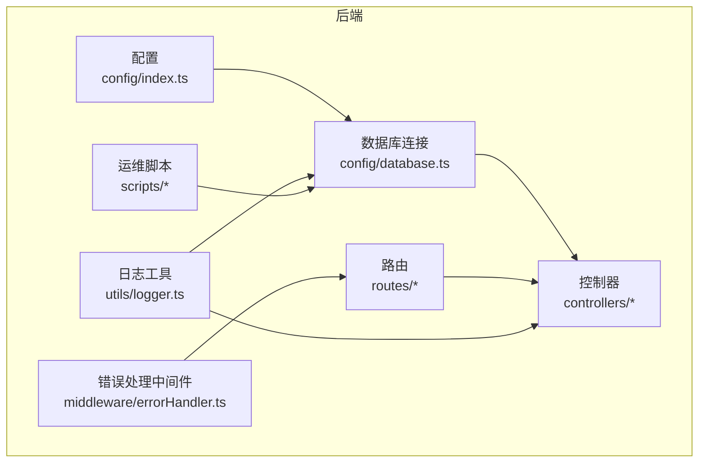
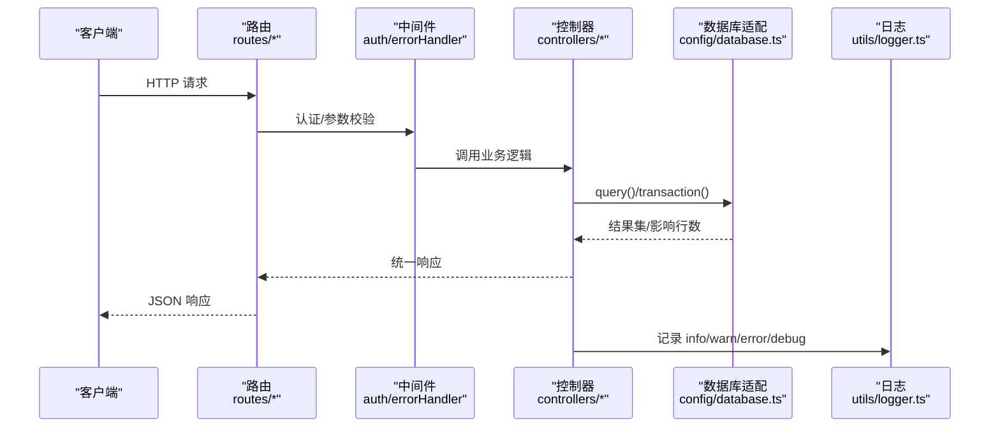
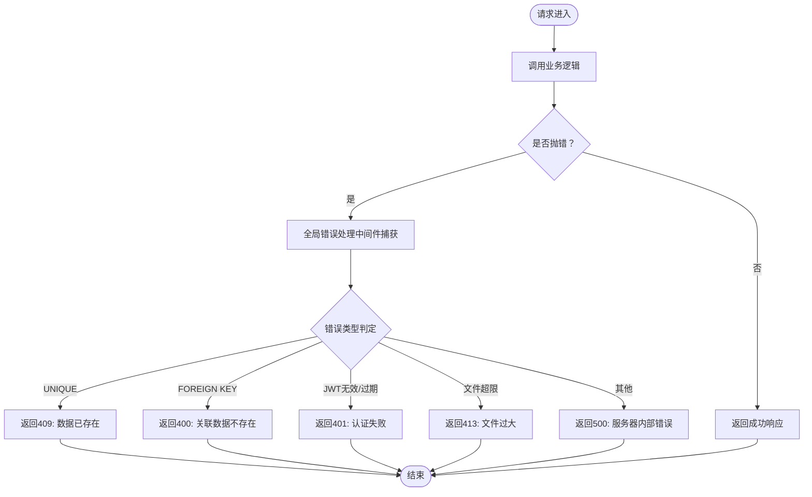
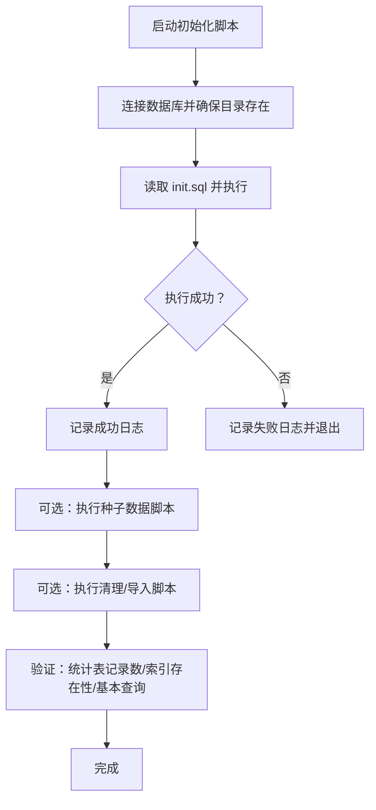
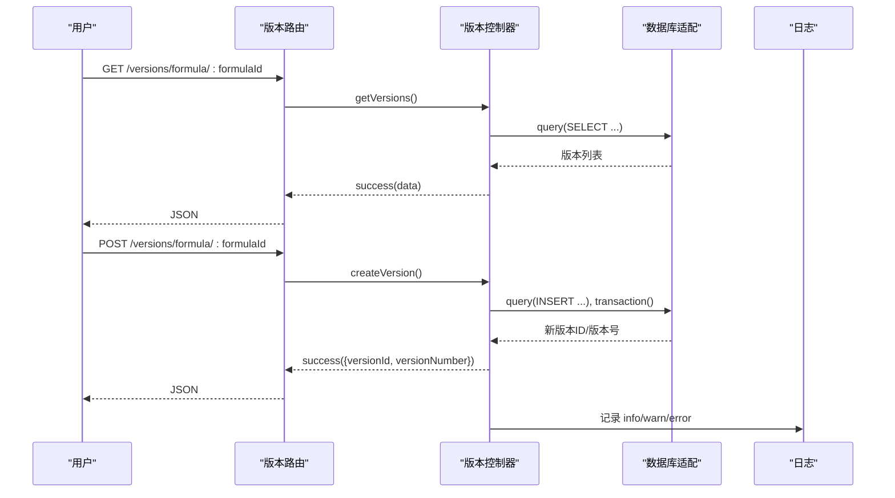
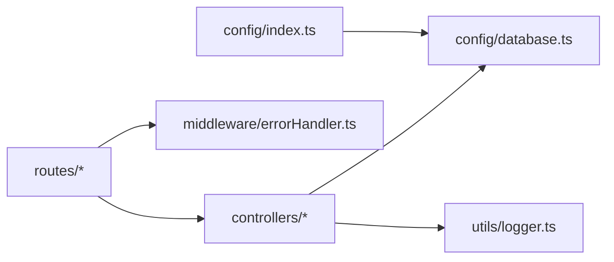

# 监控与维护

<cite>
**本文引用的文件**
- [backend/src/utils/logger.ts](file://backend/src/utils/logger.ts)
- [backend/src/middleware/errorHandler.ts](file://backend/src/middleware/errorHandler.ts)
- [backend/src/config/index.ts](file://backend/src/config/index.ts)
- [backend/src/config/database.ts](file://backend/src/config/database.ts)
- [backend/src/controllers/versionController.ts](file://backend/src/controllers/versionController.ts)
- [backend/src/routes/versions.ts](file://backend/src/routes/versions.ts)
- [backend/DATABASE_DOC.md](file://backend/DATABASE_DOC.md)
- [backend/API_DOC.md](file://backend/API_DOC.md)
- [backend/src/scripts/initDatabase.ts](file://backend/src/scripts/initDatabase.ts)
- [backend/src/scripts/init.sql](file://backend/src/scripts/init.sql)
- [backend/src/scripts/cleanOldMaterials.ts](file://backend/src/scripts/cleanOldMaterials.ts)
- [backend/src/scripts/importNutritionData.ts](file://backend/src/scripts/importNutritionData.ts)
- [backend/src/scripts/seedData.ts](file://backend/src/scripts/seedData.ts)
- [scripts/update-docs.ps1](file://scripts/update-docs.ps1)
</cite>

## 目录
1. [简介](#简介)
2. [项目结构](#项目结构)
3. [核心组件](#核心组件)
4. [架构总览](#架构总览)
5. [详细组件分析](#详细组件分析)
6. [依赖关系分析](#依赖关系分析)
7. [性能考量](#性能考量)
8. [故障排查指南](#故障排查指南)
9. [结论](#结论)
10. [附录](#附录)

## 简介
本指南面向 TingStudio 运维团队，提供系统监控与维护的完整实践，覆盖应用性能监控指标、日志收集与错误追踪、数据库监控与备份验证、数据完整性检查、健康检查脚本与自动化运维工具、版本升级与回滚流程、数据迁移方案、故障应急响应、问题排查方法以及性能优化建议，并给出日常维护清单与巡检标准。

## 项目结构
后端采用 Node.js + Express + better-sqlite3 架构，核心模块包括：
- 配置与数据库连接：环境变量、数据库连接、事务封装、查询适配
- 中间件：统一错误处理、认证、参数校验
- 控制器与路由：版本控制、导出、营养分析等业务接口
- 脚本：数据库初始化、种子数据、清理模拟数据、导入真实营养数据
- 文档：API 文档、数据库设计文档

图表来源
- [backend/src/config/index.ts:1-24](file://backend/src/config/index.ts#L1-L24)
- [backend/src/config/database.ts:1-70](file://backend/src/config/database.ts#L1-L70)
- [backend/src/utils/logger.ts:1-40](file://backend/src/utils/logger.ts#L1-L40)
- [backend/src/middleware/errorHandler.ts:1-51](file://backend/src/middleware/errorHandler.ts#L1-L51)
- [backend/src/routes/versions.ts:1-17](file://backend/src/routes/versions.ts#L1-L17)
- [backend/src/controllers/versionController.ts:1-270](file://backend/src/controllers/versionController.ts#L1-L270)
- [backend/src/scripts/initDatabase.ts:1-37](file://backend/src/scripts/initDatabase.ts#L1-L37)
- [backend/src/scripts/seedData.ts:1-399](file://backend/src/scripts/seedData.ts#L1-L399)

章节来源
- [backend/src/config/index.ts:1-24](file://backend/src/config/index.ts#L1-L24)
- [backend/src/config/database.ts:1-70](file://backend/src/config/database.ts#L1-L70)
- [backend/src/utils/logger.ts:1-40](file://backend/src/utils/logger.ts#L1-L40)
- [backend/src/middleware/errorHandler.ts:1-51](file://backend/src/middleware/errorHandler.ts#L1-L51)
- [backend/src/routes/versions.ts:1-17](file://backend/src/routes/versions.ts#L1-L17)
- [backend/src/controllers/versionController.ts:1-270](file://backend/src/controllers/versionController.ts#L1-L270)
- [backend/src/scripts/initDatabase.ts:1-37](file://backend/src/scripts/initDatabase.ts#L1-L37)
- [backend/src/scripts/seedData.ts:1-399](file://backend/src/scripts/seedData.ts#L1-L399)

## 核心组件
- 日志与错误追踪
  - 日志工具提供 info/warn/error/debug 输出，带时间戳与级别前缀；开发环境开启 debug 输出
  - 全局错误处理中间件捕获未处理异常，区分 SQLite 约束错误、JWT 错误、文件大小限制等场景，返回标准化错误响应
- 数据库与配置
  - better-sqlite3 连接管理，确保数据目录存在、启用 WAL 与外键约束
  - 查询适配层 query 统一 SELECT/INSERT/UPDATE/DELETE 返回形态，事务封装 transaction
  - 环境变量驱动端口、数据库路径、JWT、上传目录与大小、CORS 等
- 版本控制与健康检查
  - 版本控制器支持版本列表、详情、创建、发布、对比
  - API 文档提供健康检查接口 /health

章节来源
- [backend/src/utils/logger.ts:1-40](file://backend/src/utils/logger.ts#L1-L40)
- [backend/src/middleware/errorHandler.ts:1-51](file://backend/src/middleware/errorHandler.ts#L1-L51)
- [backend/src/config/database.ts:1-70](file://backend/src/config/database.ts#L1-L70)
- [backend/src/config/index.ts:1-24](file://backend/src/config/index.ts#L1-L24)
- [backend/API_DOC.md:703-714](file://backend/API_DOC.md#L703-L714)
- [backend/src/controllers/versionController.ts:1-270](file://backend/src/controllers/versionController.ts#L1-L270)

## 架构总览
后端服务通过 Express 提供 REST API，数据库为 SQLite（better-sqlite3）。请求经中间件处理，路由分发至控制器，控制器通过数据库适配层访问 SQLite 并返回统一响应结构。

图表来源
- [backend/src/routes/versions.ts:1-17](file://backend/src/routes/versions.ts#L1-L17)
- [backend/src/middleware/errorHandler.ts:1-51](file://backend/src/middleware/errorHandler.ts#L1-L51)
- [backend/src/controllers/versionController.ts:1-270](file://backend/src/controllers/versionController.ts#L1-L270)
- [backend/src/config/database.ts:1-70](file://backend/src/config/database.ts#L1-L70)
- [backend/src/utils/logger.ts:1-40](file://backend/src/utils/logger.ts#L1-L40)

## 详细组件分析

### 日志与错误追踪
- 日志工具
  - 输出包含时间戳、级别、消息与可选元数据
  - 开发环境才输出 debug
- 错误处理中间件
  - 统一记录未处理错误
  - 区分 UNIQUE/FOREIGN KEY/JWT/文件大小限制等错误，返回业务友好消息
  - 默认 500 并在开发环境返回具体错误消息

图表来源
- [backend/src/middleware/errorHandler.ts:1-51](file://backend/src/middleware/errorHandler.ts#L1-L51)
- [backend/src/utils/logger.ts:1-40](file://backend/src/utils/logger.ts#L1-L40)

章节来源
- [backend/src/utils/logger.ts:1-40](file://backend/src/utils/logger.ts#L1-L40)
- [backend/src/middleware/errorHandler.ts:1-51](file://backend/src/middleware/errorHandler.ts#L1-L51)

### 数据库监控与备份验证
- 连接与配置
  - 自动创建数据目录，连接 SQLite，启用 WAL 模式与外键约束
  - 查询适配层对 SELECT 返回数组、写操作返回运行结果对象
- 初始化与脚本
  - 初始化脚本读取 SQL 文件一次性执行，创建 13 张表
  - 种子数据脚本批量插入用户、原料、业务员、配方、版本、导出模板、任务、营养标准与原料营养数据
  - 清理脚本删除指定范围的模拟数据并验证剩余数量
  - 营养数据导入脚本从 Excel 数据导入真实营养数据，去重并更新/新增
- 备份与验证
  - 建议在变更前复制数据库文件进行备份
  - 验证步骤：统计各表记录数、核对关键索引是否存在、执行简单查询确认连通性

图表来源
- [backend/src/scripts/initDatabase.ts:1-37](file://backend/src/scripts/initDatabase.ts#L1-L37)
- [backend/src/scripts/init.sql:1-228](file://backend/src/scripts/init.sql#L1-L228)
- [backend/src/scripts/seedData.ts:1-399](file://backend/src/scripts/seedData.ts#L1-L399)
- [backend/src/scripts/cleanOldMaterials.ts:1-48](file://backend/src/scripts/cleanOldMaterials.ts#L1-L48)
- [backend/src/scripts/importNutritionData.ts:1-215](file://backend/src/scripts/importNutritionData.ts#L1-L215)
- [backend/src/config/database.ts:1-70](file://backend/src/config/database.ts#L1-L70)

章节来源
- [backend/src/config/database.ts:1-70](file://backend/src/config/database.ts#L1-L70)
- [backend/src/scripts/initDatabase.ts:1-37](file://backend/src/scripts/initDatabase.ts#L1-L37)
- [backend/src/scripts/init.sql:1-228](file://backend/src/scripts/init.sql#L1-L228)
- [backend/src/scripts/seedData.ts:1-399](file://backend/src/scripts/seedData.ts#L1-L399)
- [backend/src/scripts/cleanOldMaterials.ts:1-48](file://backend/src/scripts/cleanOldMaterials.ts#L1-L48)
- [backend/src/scripts/importNutritionData.ts:1-215](file://backend/src/scripts/importNutritionData.ts#L1-L215)

### 版本控制与健康检查
- 版本控制
  - 列表/详情/创建/发布/对比接口，支持状态过滤与当前版本标记
  - 创建版本时自动计算版本号并设置为当前版本
  - 发布版本时将同一配方其他版本归档
- 健康检查
  - 提供 /health 接口返回服务状态与时间戳

图表来源
- [backend/src/routes/versions.ts:1-17](file://backend/src/routes/versions.ts#L1-L17)
- [backend/src/controllers/versionController.ts:1-270](file://backend/src/controllers/versionController.ts#L1-L270)
- [backend/API_DOC.md:703-714](file://backend/API_DOC.md#L703-L714)

章节来源
- [backend/src/controllers/versionController.ts:1-270](file://backend/src/controllers/versionController.ts#L1-L270)
- [backend/src/routes/versions.ts:1-17](file://backend/src/routes/versions.ts#L1-L17)
- [backend/API_DOC.md:703-714](file://backend/API_DOC.md#L703-L714)

### 数据完整性检查
- 外键约束
  - 连接时启用外键约束，确保参照完整性
- 唯一约束
  - 用户名、业务员工号、导出接口端点等字段具备唯一性
- 约束检查
  - 使用 SQLite CHECK 约束限制枚举值（如 status、type）
- 迁移与一致性
  - 通过 init.sql 统一创建表结构与索引
  - 脚本执行前建议备份数据库，执行后进行计数与查询验证

章节来源
- [backend/src/config/database.ts:1-70](file://backend/src/config/database.ts#L1-L70)
- [backend/src/scripts/init.sql:1-228](file://backend/src/scripts/init.sql#L1-L228)
- [backend/DATABASE_DOC.md:447-457](file://backend/DATABASE_DOC.md#L447-L457)

### 系统健康检查脚本与自动化运维工具
- 健康检查
  - 使用 /health 接口进行服务可用性探测
- 文档更新脚本
  - 提供 PowerShell 脚本用于更新文档，便于自动化运维流程集成

章节来源
- [backend/API_DOC.md:703-714](file://backend/API_DOC.md#L703-L714)
- [scripts/update-docs.ps1](file://scripts/update-docs.ps1)

### 版本升级、回滚与数据迁移
- 升级流程
  - 备份数据库文件
  - 应用新版本代码
  - 如需结构变更，准备并执行 SQL 脚本（基于 init.sql 的思路）
  - 运行种子数据或增量脚本恢复/迁移数据
  - 健康检查与功能回归测试
- 回滚策略
  - 停机并恢复备份数据库
  - 验证关键表计数与代表性查询结果
- 数据迁移
  - 使用 better-sqlite3 的事务保证原子性
  - 导入脚本示例展示了去重、计算与批量插入/更新的模式

章节来源
- [backend/src/scripts/init.sql:1-228](file://backend/src/scripts/init.sql#L1-L228)
- [backend/src/scripts/seedData.ts:1-399](file://backend/src/scripts/seedData.ts#L1-L399)
- [backend/src/scripts/importNutritionData.ts:1-215](file://backend/src/scripts/importNutritionData.ts#L1-L215)
- [backend/src/config/database.ts:1-70](file://backend/src/config/database.ts#L1-L70)

### 故障应急响应流程
- 常见问题定位
  - 409/400：检查 UNIQUE/FOREIGN KEY 约束与输入数据
  - 401：检查 JWT 有效性与过期时间
  - 413：检查上传大小限制与前端配置
  - 500：查看日志并复现最小化场景
- 快速处置
  - 重启服务（如必要）
  - 检查数据库连接与 WAL/外键状态
  - 回滚到最近一次备份
- 事后复盘
  - 记录错误堆栈与上下文
  - 修复后回归测试与监控指标观察

章节来源
- [backend/src/middleware/errorHandler.ts:1-51](file://backend/src/middleware/errorHandler.ts#L1-L51)
- [backend/src/utils/logger.ts:1-40](file://backend/src/utils/logger.ts#L1-L40)
- [backend/src/config/database.ts:1-70](file://backend/src/config/database.ts#L1-L70)

### 性能优化建议
- 数据库层面
  - 使用 WAL 模式提升并发读写
  - 为高频查询列建立索引（已有部分索引）
  - 控制单次事务大小，避免长时间锁持有
- 应用层面
  - 使用查询适配层统一返回形态，减少重复解析
  - 在控制器中进行必要的数据裁剪与分页
  - 合理使用事务包裹批量写入
- 监控与告警
  - 建议增加数据库 PRAGMA 查询与慢查询日志（SQLite 无内置慢查询日志，可通过应用侧埋点实现）

章节来源
- [backend/src/config/database.ts:1-70](file://backend/src/config/database.ts#L1-L70)
- [backend/src/config/index.ts:1-24](file://backend/src/config/index.ts#L1-L24)

## 依赖关系分析
- 组件耦合
  - 控制器依赖数据库适配层与工具函数
  - 路由依赖认证中间件与控制器
  - 错误处理中间件贯穿所有路由
- 外部依赖
  - better-sqlite3 提供高性能本地数据库能力
  - dotenv 用于环境变量加载

图表来源
- [backend/src/routes/versions.ts:1-17](file://backend/src/routes/versions.ts#L1-L17)
- [backend/src/controllers/versionController.ts:1-270](file://backend/src/controllers/versionController.ts#L1-L270)
- [backend/src/config/database.ts:1-70](file://backend/src/config/database.ts#L1-L70)
- [backend/src/utils/logger.ts:1-40](file://backend/src/utils/logger.ts#L1-L40)
- [backend/src/middleware/errorHandler.ts:1-51](file://backend/src/middleware/errorHandler.ts#L1-L51)
- [backend/src/config/index.ts:1-24](file://backend/src/config/index.ts#L1-L24)

章节来源
- [backend/src/routes/versions.ts:1-17](file://backend/src/routes/versions.ts#L1-L17)
- [backend/src/controllers/versionController.ts:1-270](file://backend/src/controllers/versionController.ts#L1-L270)
- [backend/src/config/database.ts:1-70](file://backend/src/config/database.ts#L1-L70)
- [backend/src/utils/logger.ts:1-40](file://backend/src/utils/logger.ts#L1-L40)
- [backend/src/middleware/errorHandler.ts:1-51](file://backend/src/middleware/errorHandler.ts#L1-L51)
- [backend/src/config/index.ts:1-24](file://backend/src/config/index.ts#L1-L24)

## 性能考量
- I/O 与并发
  - WAL 模式适合高并发读写场景
  - 避免长事务，拆分批量写入
- 查询优化
  - 利用现有索引（名称/编码/状态等）
  - 控制返回字段与分页大小
- 内存与资源
  - 合理设置进程内存上限与 GC 参数
  - 监控数据库文件大小与磁盘空间

## 故障排查指南
- 健康检查
  - 使用 /health 确认服务可用
- 日志定位
  - 查看 info/warn/error/debug 输出
  - 结合错误处理中间件返回码定位问题
- 数据库诊断
  - 检查数据目录是否存在
  - 确认外键约束与索引存在
  - 执行简单查询验证连通性
- 回滚与恢复
  - 基于备份文件快速回滚
  - 验证关键表计数与代表性数据

章节来源
- [backend/API_DOC.md:703-714](file://backend/API_DOC.md#L703-L714)
- [backend/src/utils/logger.ts:1-40](file://backend/src/utils/logger.ts#L1-L40)
- [backend/src/middleware/errorHandler.ts:1-51](file://backend/src/middleware/errorHandler.ts#L1-L51)
- [backend/src/config/database.ts:1-70](file://backend/src/config/database.ts#L1-L70)

## 结论
通过统一的日志与错误处理、完善的数据库初始化与脚本体系、明确的健康检查与运维流程，TingStudio 可实现稳定可靠的监控与维护。建议在生产环境中持续完善监控指标、告警阈值与自动化巡检，确保系统长期稳定运行。

## 附录

### 日常维护清单与巡检标准
- 每日
  - 健康检查 /health
  - 数据库文件大小与磁盘空间
  - 关键表计数核对（users/materials/formulas 等）
- 每周
  - 日志审查（错误率、异常堆栈）
  - 外键约束与索引状态检查
  - 备份完整性验证
- 每月
  - 数据一致性抽样检查
  - 版本控制与导出任务状态核查
  - 文档与脚本更新同步

章节来源
- [backend/API_DOC.md:703-714](file://backend/API_DOC.md#L703-L714)
- [backend/DATABASE_DOC.md:447-457](file://backend/DATABASE_DOC.md#L447-L457)