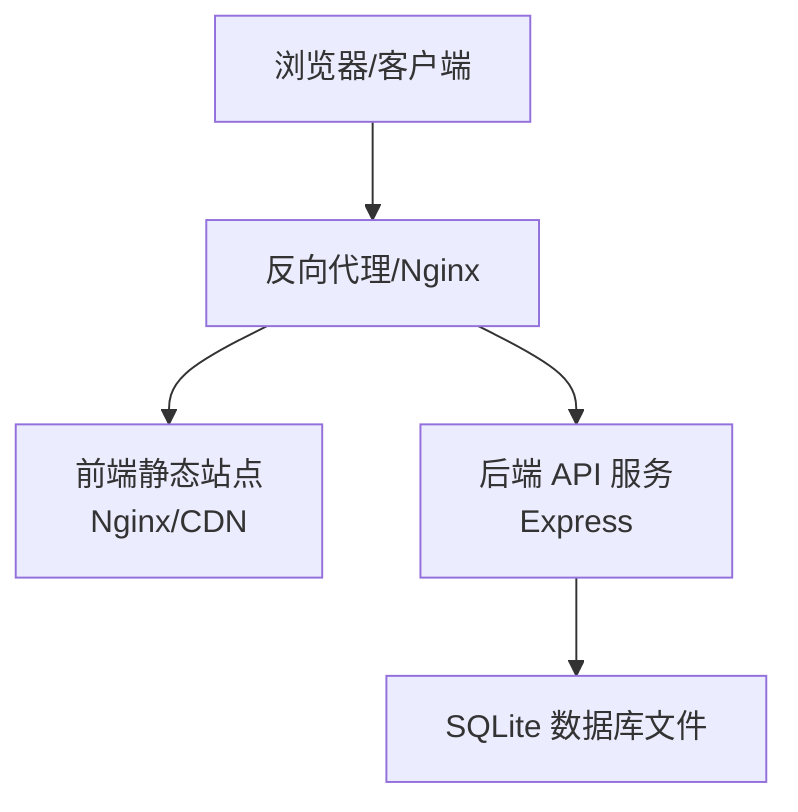
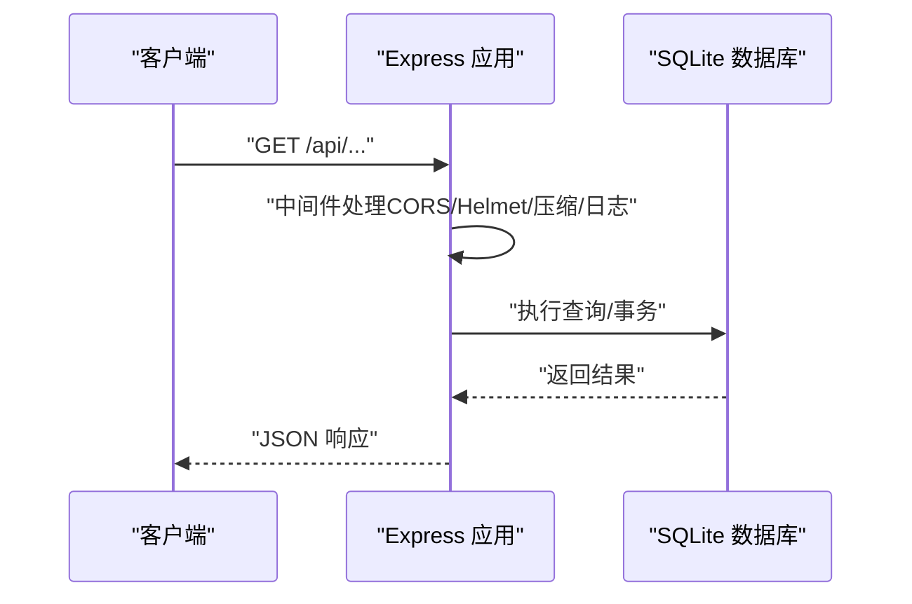
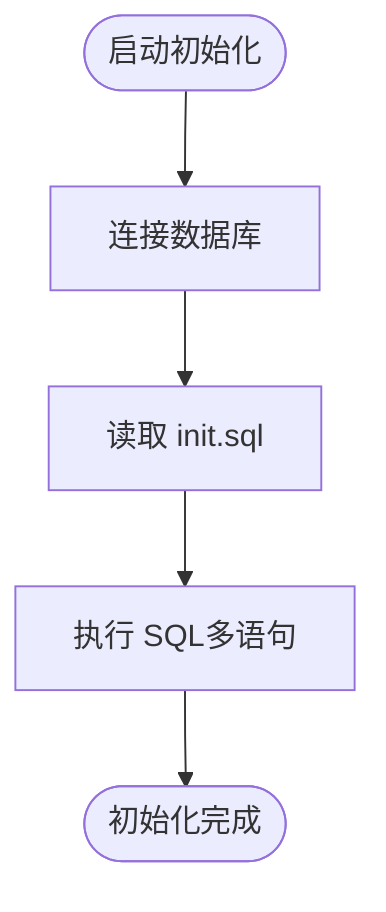
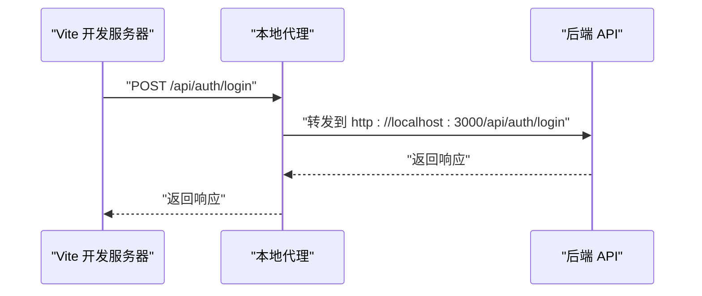
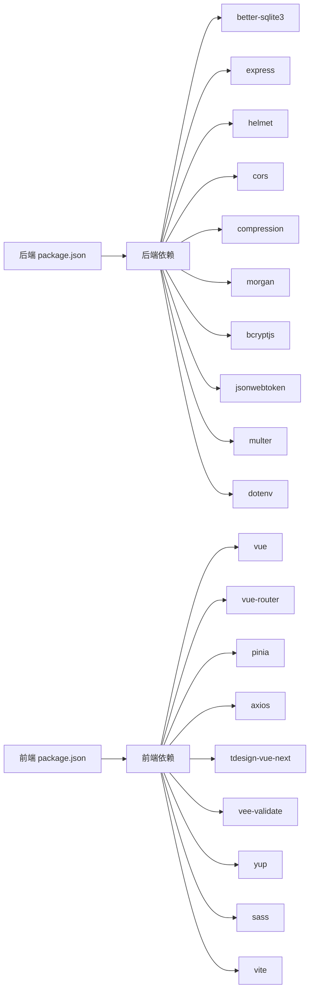

# 部署指南

<cite>
**本文引用的文件**
- [README.md](file://README.md)
- [backend/package.json](file://backend/package.json)
- [frontend/package.json](file://frontend/package.json)
- [backend/src/config/index.ts](file://backend/src/config/index.ts)
- [backend/src/config/database.ts](file://backend/src/config/database.ts)
- [backend/src/index.ts](file://backend/src/index.ts)
- [backend/src/scripts/initDatabase.ts](file://backend/src/scripts/initDatabase.ts)
- [backend/src/scripts/init.sql](file://backend/src/scripts/init.sql)
- [backend/DATABASE_DOC.md](file://backend/DATABASE_DOC.md)
- [backend/API_DOC.md](file://backend/API_DOC.md)
- [frontend/vite.config.ts](file://frontend/vite.config.ts)
- [frontend/src/api/http.ts](file://frontend/src/api/http.ts)
- [frontend/src/main.ts](file://frontend/src/main.ts)
- [backend/.gitignore](file://backend/.gitignore)
</cite>

## 目录
1. [简介](#简介)
2. [项目结构](#项目结构)
3. [核心组件](#核心组件)
4. [架构总览](#架构总览)
5. [详细组件分析](#详细组件分析)
6. [依赖关系分析](#依赖关系分析)
7. [性能考虑](#性能考虑)
8. [故障排查指南](#故障排查指南)
9. [结论](#结论)
10. [附录](#附录)

## 简介
本指南面向运维人员，提供 TingStudio 生产环境部署的完整方案，涵盖环境准备、依赖安装、配置设置、前后端分离部署策略、静态资源构建、API 代理配置、域名绑定、Docker 容器化部署、Kubernetes 部署配置、数据库生产配置与备份策略、监控设置、性能优化、安全加固以及故障恢复方案。

## 项目结构
TingStudio 采用前后端分离架构：
- 后端：基于 Node.js + Express + TypeScript，使用 better-sqlite3 作为 SQLite 驱动，提供 RESTful API。
- 前端：基于 Vue 3 + Vite，使用 Axios 进行 API 通信，通过本地代理将 /api 请求转发至后端。

```mermaid
graph TB
subgraph "前端"
FE["Vite 开发服务器<br/>端口 5173"]
VITECFG["Vite 配置<br/>/api 代理到后端"]
end
subgraph "后端"
BE["Express 应用<br/>端口 3000"]
DB["SQLite 数据库<br/>WAL 模式"]
end
FE --> VITECFG
VITECFG --> |"代理"/api"| BE
BE --> DB
```

图表来源
- [frontend/vite.config.ts:12-21](file://frontend/vite.config.ts#L12-L21)
- [backend/src/index.ts:13-54](file://backend/src/index.ts#L13-L54)
- [backend/src/config/database.ts:21-23](file://backend/src/config/database.ts#L21-L23)

章节来源
- [README.md:65-113](file://README.md#L65-L113)
- [frontend/vite.config.ts:12-21](file://frontend/vite.config.ts#L12-L21)
- [backend/src/index.ts:13-54](file://backend/src/index.ts#L13-L54)
- [backend/src/config/database.ts:21-30](file://backend/src/config/database.ts#L21-L30)

## 核心组件
- 后端服务：提供认证、业务模块（原料、配方、业务员、版本、导出、营养）的 RESTful API；内置健康检查端点；支持静态文件上传目录。
- 数据库：SQLite（better-sqlite3），启用 WAL 模式与外键约束；初始化脚本包含 13 张表。
- 前端应用：Vue 3 + Vite，Axios 统一请求封装，本地开发代理 /api 到后端。
- 配置中心：后端通过环境变量控制端口、数据库路径、JWT 密钥、上传目录、CORS 来源等。

章节来源
- [backend/src/index.ts:13-61](file://backend/src/index.ts#L13-L61)
- [backend/src/config/index.ts:1-24](file://backend/src/config/index.ts#L1-L24)
- [backend/src/config/database.ts:10-70](file://backend/src/config/database.ts#L10-L70)
- [backend/src/scripts/init.sql:1-227](file://backend/src/scripts/init.sql#L1-L227)
- [frontend/src/api/http.ts:1-58](file://frontend/src/api/http.ts#L1-L58)

## 架构总览
生产部署可采用两种常见模式：
- 方案 A：前后端分别部署，前端构建产物托管于静态 Web 服务器（Nginx/Apache），后端独立运行，通过反向代理实现域名绑定与 HTTPS。
- 方案 B：容器化部署（Docker），后端与前端分别打包为镜像，或前端构建产物放入后端镜像中，通过容器编排（Kubernetes）进行部署与扩缩容。



图表来源
- [backend/src/index.ts:38-45](file://backend/src/index.ts#L38-L45)
- [backend/src/config/index.ts:20-22](file://backend/src/config/index.ts#L20-L22)

## 详细组件分析

### 后端服务部署
- 运行时与依赖：Node.js 18+，使用 npm 管理依赖；生产启动命令为编译后的 dist/index.js。
- 端口与环境：默认监听 3000，可通过环境变量覆盖；开发时默认允许本地前端域名跨域。
- 安全中间件：Helmet、CORS、压缩、速率限制、日志。
- 静态资源：/uploads 目录对外提供文件访问。
- 健康检查：/health 返回服务状态。
- 数据库：WAL 模式与外键约束；数据库文件路径可通过环境变量配置。



图表来源
- [backend/src/index.ts:21-48](file://backend/src/index.ts#L21-L48)
- [backend/src/config/database.ts:44-61](file://backend/src/config/database.ts#L44-L61)

章节来源
- [backend/src/index.ts:13-61](file://backend/src/index.ts#L13-L61)
- [backend/src/config/index.ts:1-24](file://backend/src/config/index.ts#L1-L24)
- [backend/src/config/database.ts:10-70](file://backend/src/config/database.ts#L10-L70)

### 数据库初始化与生产配置
- 初始化脚本：一次性执行 init.sql，创建 13 张表，并建立必要索引。
- WAL 模式：提升并发读写性能；外键约束确保参照完整性。
- 数据库存储：默认 ./data/tingstudio.db，生产环境建议挂载持久卷并开启备份。



图表来源
- [backend/src/scripts/initDatabase.ts:11-31](file://backend/src/scripts/initDatabase.ts#L11-L31)
- [backend/src/scripts/init.sql:1-227](file://backend/src/scripts/init.sql#L1-L227)
- [backend/src/config/database.ts:21-23](file://backend/src/config/database.ts#L21-L23)

章节来源
- [backend/src/scripts/initDatabase.ts:1-37](file://backend/src/scripts/initDatabase.ts#L1-L37)
- [backend/src/scripts/init.sql:1-227](file://backend/src/scripts/init.sql#L1-L227)
- [backend/DATABASE_DOC.md:444-454](file://backend/DATABASE_DOC.md#L444-L454)

### 前端构建与 API 代理
- 开发代理：Vite 将 /api 请求代理到后端 localhost:3000。
- 生产构建：使用 Vite 构建静态产物，部署至 Nginx/Apache 或 CDN。
- API 基址：Axios 默认 baseURL 为 /api，生产环境需通过反向代理或构建时注入环境变量。



图表来源
- [frontend/vite.config.ts:15-20](file://frontend/vite.config.ts#L15-L20)
- [frontend/src/api/http.ts:6-10](file://frontend/src/api/http.ts#L6-L10)

章节来源
- [frontend/vite.config.ts:1-23](file://frontend/vite.config.ts#L1-L23)
- [frontend/src/api/http.ts:1-58](file://frontend/src/api/http.ts#L1-L58)

### API 文档与认证
- 认证方式：Bearer Token（JWT），除登录/注册外均需携带 Authorization 头。
- 响应格式：统一 success/message/data 结构；分页列表包含 pagination 字段。
- 健康检查：GET /health，无需认证。

章节来源
- [backend/API_DOC.md:1-71](file://backend/API_DOC.md#L1-L71)
- [backend/API_DOC.md:677-688](file://backend/API_DOC.md#L677-L688)

## 依赖关系分析
- 后端依赖：better-sqlite3、express、helmet、cors、compression、morgan、bcryptjs、jsonwebtoken、multer、dotenv。
- 前端依赖：vue、vue-router、pinia、axios、tdesign-vue-next、vee-validate、yup、sass、vite 等。
- 构建与脚本：后端使用 tsc + tsx；前端使用 vue-tsc + vite build。



图表来源
- [backend/package.json:14-26](file://backend/package.json#L14-L26)
- [frontend/package.json:12-20](file://frontend/package.json#L12-L20)

章节来源
- [backend/package.json:1-42](file://backend/package.json#L1-L42)
- [frontend/package.json:1-30](file://frontend/package.json#L1-L30)

## 性能考虑
- 数据库性能
  - 使用 WAL 模式提升并发读写能力。
  - 合理使用索引（如配方/原料/业务员表的索引）。
  - 控制单次查询返回的数据量，使用分页参数。
- 服务端性能
  - 启用压缩中间件减少传输体积。
  - 合理设置请求体大小限制，避免内存压力。
  - 使用健康检查端点进行存活探针。
- 前端性能
  - 构建产物启用缓存与 Gzip/Brotli 压缩。
  - 使用 CDN 加速静态资源分发。
  - 减少不必要的第三方依赖，控制包体大小。

章节来源
- [backend/src/config/database.ts:21-23](file://backend/src/config/database.ts#L21-L23)
- [backend/src/index.ts:26-29](file://backend/src/index.ts#L26-L29)
- [backend/API_DOC.md:72-78](file://backend/API_DOC.md#L72-L78)

## 故障排查指南
- 启动失败
  - 检查数据库连接是否成功，确认数据库文件路径与权限。
  - 查看日志输出，定位中间件或路由错误。
- API 认证问题
  - 确认 Authorization 头是否正确携带 Bearer Token。
  - 检查 JWT 密钥与过期时间配置。
- CORS 问题
  - 确认生产环境 CORS 来源已正确配置。
- 文件上传问题
  - 检查上传目录是否存在且具备写权限。
  - 确认文件大小限制与类型校验。
- 健康检查
  - 通过 /health 端点判断服务状态。

章节来源
- [backend/src/index.ts:38-48](file://backend/src/index.ts#L38-L48)
- [backend/src/config/index.ts:20-22](file://backend/src/config/index.ts#L20-L22)
- [backend/src/config/database.ts:25-29](file://backend/src/config/database.ts#L25-L29)
- [backend/.gitignore:1-5](file://backend/.gitignore#L1-L5)

## 结论
本指南提供了 TingStudio 在生产环境的完整部署与运维方案。通过前后端分离部署、合理的数据库配置与备份策略、容器化与 Kubernetes 编排、性能优化与安全加固，可确保系统的高可用、可扩展与易维护。

## 附录

### 环境准备与依赖安装
- 系统要求：Linux/Windows/macOS，Node.js 18+，npm 9+。
- 后端依赖安装与初始化：
  - 进入 backend 目录，安装依赖并初始化数据库，再填充种子数据（可选）。
- 前端依赖安装与构建：
  - 进入 frontend 目录，安装依赖并构建生产版本。

章节来源
- [README.md:117-148](file://README.md#L117-L148)
- [backend/package.json:6-12](file://backend/package.json#L6-L12)
- [frontend/package.json:6-11](file://frontend/package.json#L6-L11)

### 配置设置（环境变量）
- 后端关键配置项
  - 端口：PORT
  - 运行环境：NODE_ENV
  - 数据库路径：DB_PATH
  - JWT 密钥与过期时间：JWT_SECRET、JWT_EXPIRES_IN
  - 上传目录与大小限制：UPLOAD_DIR、MAX_FILE_SIZE
  - CORS 来源：CORS_ORIGIN
- 前端关键配置项
  - API 基址：通过构建注入或运行时代理配置（生产环境建议通过反向代理）

章节来源
- [backend/src/config/index.ts:1-24](file://backend/src/config/index.ts#L1-L24)
- [frontend/vite.config.ts:15-20](file://frontend/vite.config.ts#L15-L20)
- [frontend/src/api/http.ts:6-10](file://frontend/src/api/http.ts#L6-L10)

### 前后端分离部署策略
- 静态资源构建
  - 前端使用 Vite 构建生产版本，产物部署至 Nginx/Apache 或 CDN。
- API 代理配置
  - 开发阶段：Vite 本地代理将 /api 转发至后端。
  - 生产阶段：通过 Nginx 反向代理将 /api 转发至后端服务。
- 域名绑定
  - 在反向代理层配置域名与证书，实现 HTTPS 访问。

章节来源
- [frontend/vite.config.ts:12-21](file://frontend/vite.config.ts#L12-L21)
- [backend/src/index.ts:32-35](file://backend/src/index.ts#L32-L35)

### Docker 容器化部署方案
- 建议做法
  - 后端镜像：基于 Node.js 运行时，复制编译后的 dist 目录与依赖，暴露 3000 端口。
  - 前端镜像：基于 Nginx，复制构建产物至 /usr/share/nginx/html，暴露 80 端口。
  - 数据库：将 SQLite 文件挂载为持久卷，或使用外部数据库（如 MySQL/PostgreSQL）替换 SQLite。
- 关键点
  - 明确环境变量注入（端口、数据库路径、JWT 密钥、CORS 来源）。
  - 上传目录与日志目录映射到宿主机或持久卷。
  - 健康检查端点 /health 用于容器探针。

章节来源
- [backend/src/index.ts:38-40](file://backend/src/index.ts#L38-L40)
- [backend/src/config/index.ts:1-24](file://backend/src/config/index.ts#L1-L24)
- [backend/.gitignore:1-5](file://backend/.gitignore#L1-L5)

### Kubernetes 部署配置要点
- Deployment
  - 定义后端与前端两个 Deployment，分别管理 Pod 副本数与滚动更新策略。
  - 为后端 Pod 挂载持久卷（用于 SQLite 文件或外部数据库）。
- Service
  - 为后端暴露 ClusterIP 服务，供前端通过 /api 访问。
  - 为前端暴露 LoadBalancer/Ingress，提供公网访问。
- ConfigMap/Secret
  - 使用 ConfigMap 注入非敏感配置，使用 Secret 注入 JWT 密钥、数据库凭据等敏感信息。
- Ingress
  - 配置域名与 TLS 证书，将流量转发至前端 Service。
- 健康检查
  - 使用 /health 作为 liveness/readiness 探针。

章节来源
- [backend/src/index.ts:38-40](file://backend/src/index.ts#L38-L40)
- [backend/src/config/index.ts:1-24](file://backend/src/config/index.ts#L1-L24)

### 数据库生产配置、备份策略与监控
- 生产配置
  - 使用 WAL 模式与外键约束；确保数据库文件具备读写权限。
  - 建议将数据库文件挂载为持久卷，或迁移到外部数据库。
- 备份策略
  - 定期备份数据库文件；对关键业务数据（配方、版本、导出任务）进行增量备份。
  - 验证备份文件的完整性与可恢复性。
- 监控设置
  - 监控数据库连接数、查询耗时、磁盘空间与 IO。
  - 监控后端服务 CPU/内存、错误率与响应时间。
  - 前端监控页面加载时间与 API 响应时间。

章节来源
- [backend/src/config/database.ts:21-23](file://backend/src/config/database.ts#L21-L23)
- [backend/DATABASE_DOC.md:444-454](file://backend/DATABASE_DOC.md#L444-L454)

### 安全加固措施
- 传输安全
  - 使用 HTTPS，强制 TLS 1.2+。
  - 配置 HSTS、CSP、X-Frame-Options 等安全头。
- 认证与授权
  - 强制使用 JWT，合理设置过期时间与刷新机制。
  - 严格控制 CORS 来源，避免通配符。
- 输入校验与防护
  - 启用速率限制，防止暴力破解与滥用。
  - 对上传文件进行类型与大小校验。
- 日志与审计
  - 记录关键操作日志，保留足够时间以便审计。
  - 避免在日志中泄露敏感信息。

章节来源
- [backend/src/index.ts:21-25](file://backend/src/index.ts#L21-L25)
- [backend/src/config/index.ts:20-22](file://backend/src/config/index.ts#L20-L22)

### 故障恢复方案
- 快速恢复
  - 通过备份快速恢复数据库文件；验证 /health 端点可用后再切换流量。
- 渐进式回切
  - 使用蓝绿/金丝雀发布，逐步切换流量，降低风险。
- 应急响应
  - 建立应急响应流程，明确责任人与沟通渠道；定期演练。

章节来源
- [backend/src/index.ts:38-40](file://backend/src/index.ts#L38-L40)