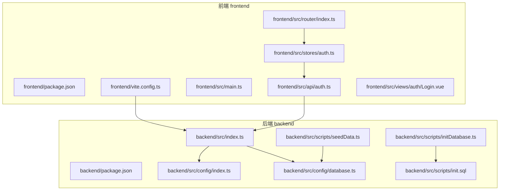
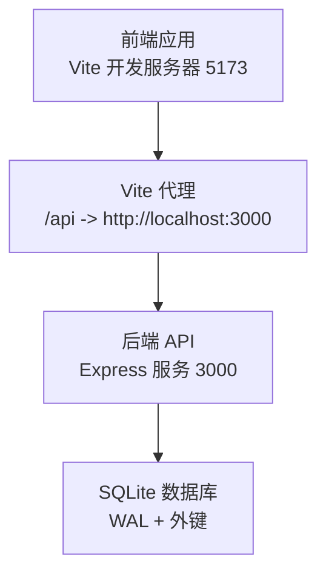
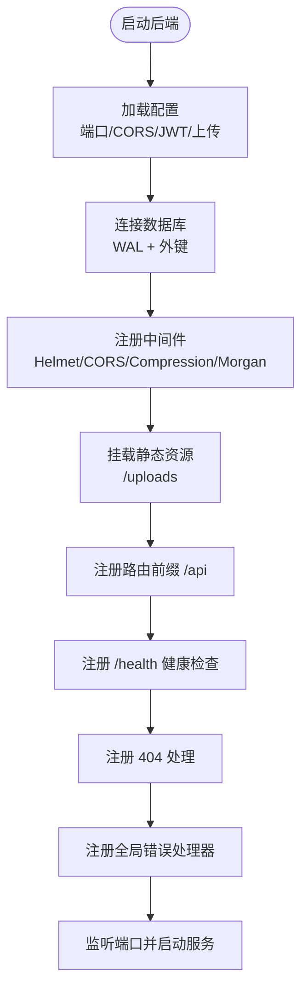
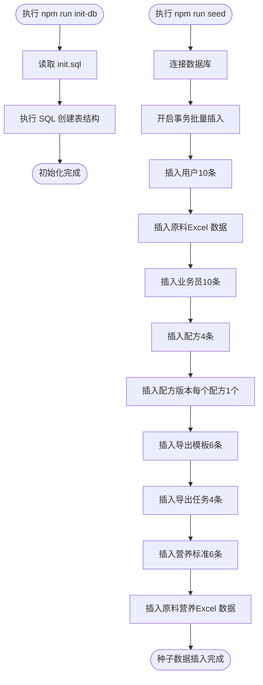
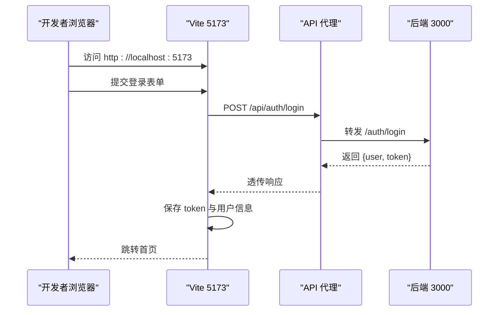
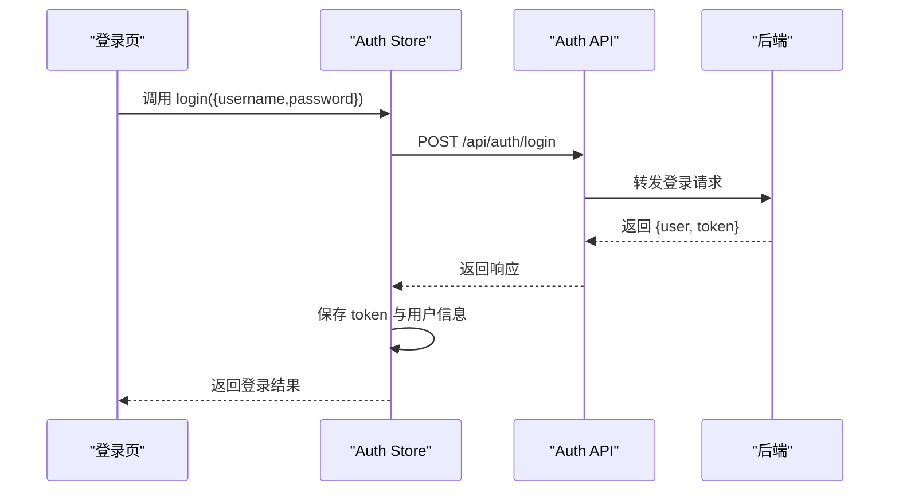
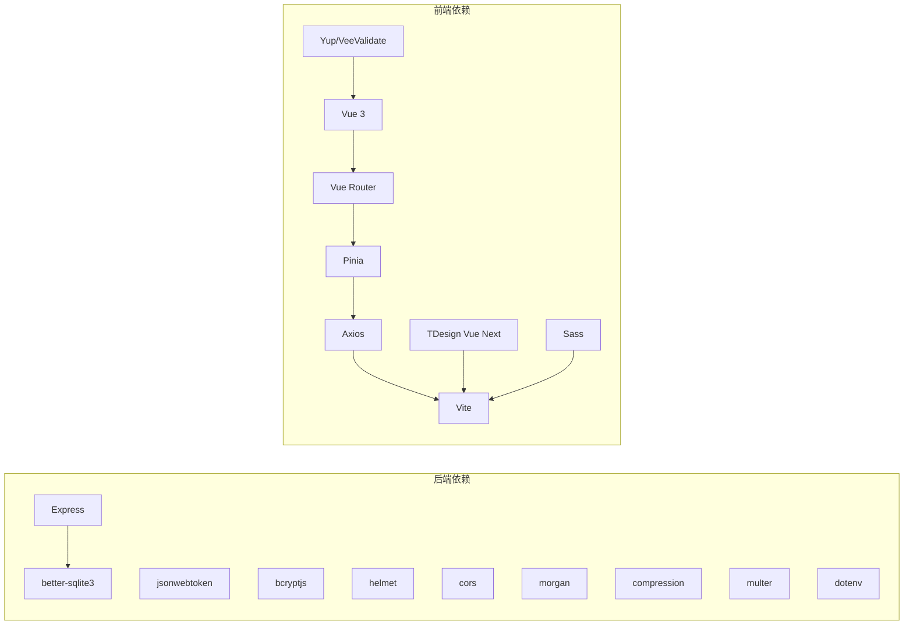

# 快速开始

<cite>
**本文引用的文件**   
- [README.md](file://README.md)
- [backend/package.json](file://backend/package.json)
- [frontend/package.json](file://frontend/package.json)
- [backend/src/index.ts](file://backend/src/index.ts)
- [backend/src/config/index.ts](file://backend/src/config/index.ts)
- [backend/src/config/database.ts](file://backend/src/config/database.ts)
- [backend/src/scripts/initDatabase.ts](file://backend/src/scripts/initDatabase.ts)
- [backend/src/scripts/init.sql](file://backend/src/scripts/init.sql)
- [backend/src/scripts/seedData.ts](file://backend/src/scripts/seedData.ts)
- [frontend/vite.config.ts](file://frontend/vite.config.ts)
- [frontend/src/main.ts](file://frontend/src/main.ts)
- [frontend/src/router/index.ts](file://frontend/src/router/index.ts)
- [frontend/src/stores/auth.ts](file://frontend/src/stores/auth.ts)
- [frontend/src/api/auth.ts](file://frontend/src/api/auth.ts)
- [frontend/src/views/auth/Login.vue](file://frontend/src/views/auth/Login.vue)
</cite>

## 目录
1. [简介](#简介)
2. [项目结构](#项目结构)
3. [核心组件](#核心组件)
4. [架构概览](#架构概览)
5. [详细组件分析](#详细组件分析)
6. [依赖分析](#依赖分析)
7. [性能考虑](#性能考虑)
8. [故障排查指南](#故障排查指南)
9. [结论](#结论)
10. [附录](#附录)

## 简介
TingStudio 是一个前后端分离的食品配方工作数据管理平台，采用 Vue 3 + Express + SQLite 技术栈，提供配方管理、原料管理、业务员管理、营养分析、导出分享等完整功能链路。本文面向初学者，提供从零开始搭建开发环境的完整路径，包括环境要求、安装与配置、数据库初始化与种子数据填充、前后端开发服务器启动、API 代理配置、测试账号与登录验证方法，以及常见问题排查。

## 项目结构
项目采用前后端分离架构，后端位于 backend 目录，前端位于 frontend 目录；根目录提供统一的包管理与文档。

**图表来源**
- [backend/src/index.ts:1-61](file://backend/src/index.ts#L1-L61)
- [backend/src/config/index.ts:1-24](file://backend/src/config/index.ts#L1-L24)
- [backend/src/config/database.ts:1-70](file://backend/src/config/database.ts#L1-L70)
- [backend/src/scripts/initDatabase.ts:1-37](file://backend/src/scripts/initDatabase.ts#L1-L37)
- [backend/src/scripts/init.sql:1-228](file://backend/src/scripts/init.sql#L1-L228)
- [backend/src/scripts/seedData.ts:1-399](file://backend/src/scripts/seedData.ts#L1-L399)
- [frontend/vite.config.ts:1-23](file://frontend/vite.config.ts#L1-L23)
- [frontend/src/main.ts:1-17](file://frontend/src/main.ts#L1-L17)
- [frontend/src/router/index.ts:1-165](file://frontend/src/router/index.ts#L1-L165)
- [frontend/src/stores/auth.ts:1-64](file://frontend/src/stores/auth.ts#L1-L64)
- [frontend/src/api/auth.ts:1-36](file://frontend/src/api/auth.ts#L1-L36)
- [frontend/src/views/auth/Login.vue:1-910](file://frontend/src/views/auth/Login.vue#L1-L910)

**章节来源**
- [README.md:115-166](file://README.md#L115-L166)

## 核心组件
- 后端入口与中间件：负责数据库连接、CORS、压缩、日志、静态资源、健康检查、全局错误处理与服务启动。
- 配置模块：集中管理端口、数据库路径、JWT、上传与 CORS 等配置项。
- 数据库模块：封装 better-sqlite3 连接、WAL 模式与外键启用、查询与事务封装。
- 初始化脚本：读取 SQL 文件一次性创建所有表结构。
- 种子数据脚本：批量插入用户、原料、业务员、配方、版本、导出模板、导出任务、营养标准与原料营养数据。
- 前端入口与路由：初始化 Vue、Pinia、路由守卫与认证状态缓存。
- 前端 API 层：封装登录/注册/获取当前用户等接口，并持久化 Token 与用户信息。
- Vite 开发服务器：本地 5173 端口，代理 /api 到后端 3000 端口。

**章节来源**
- [backend/src/index.ts:1-61](file://backend/src/index.ts#L1-L61)
- [backend/src/config/index.ts:1-24](file://backend/src/config/index.ts#L1-L24)
- [backend/src/config/database.ts:1-70](file://backend/src/config/database.ts#L1-L70)
- [backend/src/scripts/initDatabase.ts:1-37](file://backend/src/scripts/initDatabase.ts#L1-L37)
- [backend/src/scripts/init.sql:1-228](file://backend/src/scripts/init.sql#L1-L228)
- [backend/src/scripts/seedData.ts:1-399](file://backend/src/scripts/seedData.ts#L1-L399)
- [frontend/src/main.ts:1-17](file://frontend/src/main.ts#L1-L17)
- [frontend/src/router/index.ts:1-165](file://frontend/src/router/index.ts#L1-L165)
- [frontend/src/stores/auth.ts:1-64](file://frontend/src/stores/auth.ts#L1-L64)
- [frontend/src/api/auth.ts:1-36](file://frontend/src/api/auth.ts#L1-L36)
- [frontend/vite.config.ts:1-23](file://frontend/vite.config.ts#L1-L23)

## 架构概览
后端以 Express 提供 RESTful API，前端通过 Axios 调用 /api/* 接口，Vite 代理将请求转发到后端。数据库为 SQLite，使用 better-sqlite3 并启用 WAL 模式与外键约束。

**图表来源**
- [frontend/vite.config.ts:12-21](file://frontend/vite.config.ts#L12-L21)
- [backend/src/index.ts:35-48](file://backend/src/index.ts#L35-L48)
- [backend/src/config/database.ts:21-23](file://backend/src/config/database.ts#L21-L23)

## 详细组件分析

### 后端启动与配置
- 环境变量优先：端口、数据库路径、JWT 密钥、上传目录、CORS 来源均可通过环境变量配置。
- 中间件顺序：Helmet、CORS、Compression、Morgan、JSON/URL 编码、静态资源、路由、404、错误处理。
- 健康检查：/health 返回服务状态与时间戳。
- 静态资源：/uploads 指向 uploads 目录。

**图表来源**
- [backend/src/index.ts:13-55](file://backend/src/index.ts#L13-L55)
- [backend/src/config/index.ts:1-24](file://backend/src/config/index.ts#L1-L24)

**章节来源**
- [backend/src/index.ts:1-61](file://backend/src/index.ts#L1-L61)
- [backend/src/config/index.ts:1-24](file://backend/src/config/index.ts#L1-L24)

### 数据库初始化与种子数据
- 初始化脚本：读取 init.sql，一次性执行建表语句，创建全部 13 张表。
- 种子数据：批量插入用户、原料、业务员、配方、版本、导出模板、导出任务、营养标准与原料营养数据，支持重跑不破坏已有数据。

**图表来源**
- [backend/src/scripts/initDatabase.ts:11-31](file://backend/src/scripts/initDatabase.ts#L11-L31)
- [backend/src/scripts/init.sql:1-228](file://backend/src/scripts/init.sql#L1-L228)
- [backend/src/scripts/seedData.ts:102-393](file://backend/src/scripts/seedData.ts#L102-L393)

**章节来源**
- [backend/src/scripts/initDatabase.ts:1-37](file://backend/src/scripts/initDatabase.ts#L1-L37)
- [backend/src/scripts/init.sql:1-228](file://backend/src/scripts/init.sql#L1-L228)
- [backend/src/scripts/seedData.ts:1-399](file://backend/src/scripts/seedData.ts#L1-L399)

### 前端开发环境与 API 代理
- Vite 配置：本地端口 5173，/api 代理到 http://localhost:3000。
- 应用入口：初始化 Vue、Pinia、路由与 TDesign。
- 路由守卫：未登录访问受保护路由跳转登录；已登录访问登录/注册页跳转首页。
- 认证状态：登录成功后保存 Token 与用户信息到本地存储，刷新页面后自动恢复登录态。

**图表来源**
- [frontend/vite.config.ts:12-21](file://frontend/vite.config.ts#L12-L21)
- [frontend/src/router/index.ts:148-162](file://frontend/src/router/index.ts#L148-L162)
- [frontend/src/stores/auth.ts:19-32](file://frontend/src/stores/auth.ts#L19-L32)
- [frontend/src/api/auth.ts:8-16](file://frontend/src/api/auth.ts#L8-L16)
- [backend/src/index.ts:35-48](file://backend/src/index.ts#L35-L48)

**章节来源**
- [frontend/vite.config.ts:1-23](file://frontend/vite.config.ts#L1-L23)
- [frontend/src/main.ts:1-17](file://frontend/src/main.ts#L1-L17)
- [frontend/src/router/index.ts:1-165](file://frontend/src/router/index.ts#L1-L165)
- [frontend/src/stores/auth.ts:1-64](file://frontend/src/stores/auth.ts#L1-L64)
- [frontend/src/api/auth.ts:1-36](file://frontend/src/api/auth.ts#L1-L36)

### 登录与认证流程
- 登录接口：/api/auth/login，成功后返回用户信息与 Token。
- 本地存储：保存 Token 与用户信息，刷新后自动恢复登录态。
- 路由守卫：根据认证状态决定放行或重定向。

**图表来源**
- [frontend/src/views/auth/Login.vue:290-308](file://frontend/src/views/auth/Login.vue#L290-L308)
- [frontend/src/stores/auth.ts:19-32](file://frontend/src/stores/auth.ts#L19-L32)
- [frontend/src/api/auth.ts:8-16](file://frontend/src/api/auth.ts#L8-L16)
- [backend/src/index.ts:35-48](file://backend/src/index.ts#L35-L48)

**章节来源**
- [frontend/src/views/auth/Login.vue:1-910](file://frontend/src/views/auth/Login.vue#L1-L910)
- [frontend/src/stores/auth.ts:1-64](file://frontend/src/stores/auth.ts#L1-L64)
- [frontend/src/api/auth.ts:1-36](file://frontend/src/api/auth.ts#L1-L36)

## 依赖分析
- 后端依赖：Express、better-sqlite3、bcryptjs、jsonwebtoken、helmet、cors、compression、morgan、multer、dotenv 等。
- 前端依赖：Vue 3、Vue Router、Pinia、Axios、TDesign Vue Next、Vite、Sass、VeeValidate/Yup 等。
- 开发脚本：后端提供 dev/build/start、init-db、seed、import-nutrition；前端提供 dev/build/preview、init:sample-data。

**图表来源**
- [backend/package.json:1-42](file://backend/package.json#L1-L42)
- [frontend/package.json:1-30](file://frontend/package.json#L1-L30)

**章节来源**
- [backend/package.json:1-42](file://backend/package.json#L1-L42)
- [frontend/package.json:1-30](file://frontend/package.json#L1-L30)

## 性能考虑
- 数据库：启用 WAL 模式提升并发写入性能，开启外键约束保证数据一致性。
- 中间件：Gzip 压缩减少传输体积，日志级别按需调整，静态资源缓存策略可结合生产部署优化。
- 前端：开发阶段使用 Vite 快速热更新，生产构建开启 Tree Shaking 与代码分割。

## 故障排查指南
- 端口占用
  - 现象：启动后端/前端时报端口被占用。
  - 处理：修改环境变量或系统进程释放端口。
  - 参考：后端默认端口 3000，前端默认端口 5173。
- CORS 跨域
  - 现象：前端调用 /api 报跨域错误。
  - 处理：确认后端 CORS 配置与前端代理一致，或设置环境变量 CORS_ORIGIN。
  - 参考：后端 CORS 默认允许 http://localhost:5173。
- 数据库连接失败
  - 现象：启动后端提示数据库连接失败。
  - 处理：确认数据库路径存在且可写，初始化数据库后再启动服务。
  - 参考：数据库路径默认 ./data/tingstudio.db。
- 种子数据重复插入
  - 现象：重跑 seed 脚本报主键/唯一约束冲突。
  - 处理：脚本已内置 IGNORE 逻辑，若仍失败请清理数据库后重试。
- 登录失败
  - 现象：使用测试账号无法登录。
  - 处理：确认已执行初始化与种子数据脚本，检查后端日志与网络代理是否正常。

**章节来源**
- [backend/src/index.ts:22-25](file://backend/src/index.ts#L22-L25)
- [backend/src/config/index.ts:6-22](file://backend/src/config/index.ts#L6-L22)
- [backend/src/config/database.ts:12-29](file://backend/src/config/database.ts#L12-L29)
- [backend/src/scripts/seedData.ts:110-130](file://backend/src/scripts/seedData.ts#L110-L130)
- [frontend/vite.config.ts:15-20](file://frontend/vite.config.ts#L15-L20)

## 结论
按照本文提供的步骤，您可以在本地快速搭建 TingStudio 的开发环境：安装 Node.js 与 npm、分别在前后端目录安装依赖、初始化数据库并填充种子数据、启动后端与前端开发服务器。登录界面提供测试账号，配合 API 代理即可完成端到端验证。遇到问题时，可参考故障排查章节定位与解决。

## 附录

### 环境要求
- Node.js 18+
- npm 9+

**章节来源**
- [README.md:117-121](file://README.md#L117-L121)

### 安装与配置步骤
- 后端
  - 进入 backend 目录，安装依赖。
  - 初始化数据库：执行数据库初始化脚本。
  - 填充种子数据（可选）：执行种子数据脚本。
  - 启动开发服务：监听端口 3000。
- 前端
  - 进入 frontend 目录，安装依赖。
  - 启动开发服务：监听端口 5173，自动代理 /api 到后端。

**章节来源**
- [README.md:122-148](file://README.md#L122-L148)

### API 代理配置
- 前端 Vite 配置将 /api 代理到 http://localhost:3000，确保后端 CORS 允许该来源。

**章节来源**
- [frontend/vite.config.ts:12-21](file://frontend/vite.config.ts#L12-L21)
- [backend/src/index.ts:22-25](file://backend/src/index.ts#L22-L25)

### 测试账号与登录验证
- 测试账号
  - 管理员：用户名 admin，密码 admin123。
  - 配方师：user002，密码 user002。
  - 其他：user003 ~ user030，密码与用户名相同，角色在 admin/formulist 间循环。
- 登录验证
  - 登录成功后，前端会保存 Token 与用户信息，刷新页面仍保持登录态。
  - 路由守卫会根据认证状态控制页面访问。

**章节来源**
- [README.md:150-157](file://README.md#L150-L157)
- [frontend/src/api/auth.ts:19-35](file://frontend/src/api/auth.ts#L19-L35)
- [frontend/src/router/index.ts:148-162](file://frontend/src/router/index.ts#L148-L162)